# Quote Components

<cite>
**Referenced Files in This Document**   
- [ConversationalQuoteBuilder.tsx](file://src/components/quote/ConversationalQuoteBuilder.tsx)
- [NaturalLanguageQuoteInput.tsx](file://src/components/quote/NaturalLanguageQuoteInput.tsx)
- [SmartFactoryMatcher.tsx](file://src/components/quote/SmartFactoryMatcher.tsx)
- [MarketResearchInsights.tsx](file://src/components/quote/MarketResearchInsights.tsx)
- [PriceComparison.tsx](file://src/components/quote/PriceComparison.tsx)
- [QuoteComparison.tsx](file://src/components/quote/QuoteComparison.tsx)
- [EmailQuoteModal.tsx](file://src/components/quote/EmailQuoteModal.tsx)
- [QuoteHistoryCard.tsx](file://src/components/quote/QuoteHistoryCard.tsx)
- [AIQuoteGeneratorWithOTP.tsx](file://src/components/AIQuoteGeneratorWithOTP.tsx)
- [InteractiveQuoteDisplay.tsx](file://src/components/quote/InteractiveQuoteDisplay.tsx)
- [SmartRecommendations.tsx](file://src/components/quote/SmartRecommendations.tsx)
- [CurrencyDisplay.tsx](file://src/components/quote/CurrencyDisplay.tsx)
- [supabase/functions/ai-conversational-quote/index.ts](file://supabase/functions/ai-conversational-quote/index.ts)
- [supabase/functions/ai-market-research/index.ts](file://supabase/functions/ai-market-research/index.ts)
- [supabase/functions/parse-quote-description/index.ts](file://supabase/functions/parse-quote-description/index.ts)
- [supabase/functions/submit-quote/index.ts](file://supabase/functions/submit-quote/index.ts)
- [supabase/functions/send-otp/index.ts](file://supabase/functions/send-otp/index.ts)
- [supabase/functions/verify-otp/index.ts](file://supabase/functions/verify-otp/index.ts)
</cite>

## Table of Contents
1. [Introduction](#introduction)
2. [Core Quote Generation Flow](#core-quote-generation-flow)
3. [Conversational Quote Builder](#conversational-quote-builder)
4. [Natural Language Input Integration](#natural-language-input-integration)
5. [Smart Factory Matching](#smart-factory-matching)
6. [Market Research Insights](#market-research-insights)
7. [Quote Comparison and Decision Support](#quote-comparison-and-decision-support)
8. [Quote Sharing and Audit Trails](#quote-sharing-and-audit-trails)
9. [OTP Verification Flow](#otp-verification-flow)
10. [Form Validation and Accessibility](#form-validation-and-accessibility)
11. [Component Architecture](#component-architecture)
12. [Conclusion](#conclusion)

## Introduction
The AI-powered quote generation system in sleekapp-v100 provides a comprehensive solution for instant pricing and manufacturing estimates. This documentation details the components that enable conversational quote building, market research integration, supplier matching, and decision support tools. The system combines React frontend components with Supabase backend functions to deliver an intelligent quoting experience that handles complex garment specifications while maintaining accessibility and robust form validation.

The quote generation process follows a multi-step workflow that begins with requirement gathering, incorporates real-time market data, applies AI-powered analysis, and concludes with decision support tools and secure sharing mechanisms. Key components work together to provide a seamless experience from initial inquiry to final quote acceptance.

## Core Quote Generation Flow
The quote generation process follows a structured three-step workflow implemented primarily through the ConversationalQuoteBuilder component. This flow ensures comprehensive data collection, market validation, and personalized quote delivery.

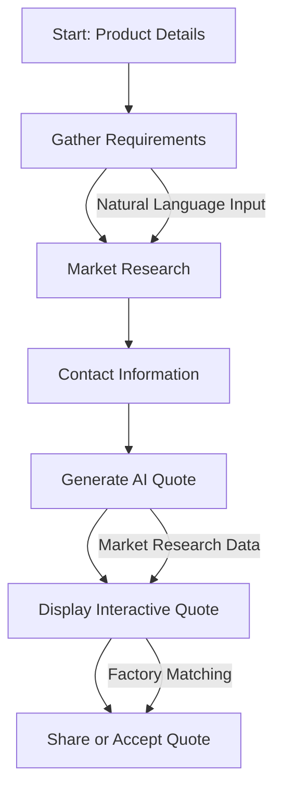

**Diagram sources**
- [ConversationalQuoteBuilder.tsx](file://src/components/quote/ConversationalQuoteBuilder.tsx#L43-L362)
- [AIQuoteGeneratorWithOTP.tsx](file://src/components/AIQuoteGeneratorWithOTP.tsx#L56-L800)

**Section sources**
- [ConversationalQuoteBuilder.tsx](file://src/components/quote/ConversationalQuoteBuilder.tsx#L43-L362)
- [AIQuoteGeneratorWithOTP.tsx](file://src/components/AIQuoteGeneratorWithOTP.tsx#L56-L800)

## Conversational Quote Builder
The ConversationalQuoteBuilder component serves as the primary interface for quote generation, implementing a step-by-step process that guides users through the quoting workflow. The component manages state for product specifications, market research results, and final quote data.

Key features include:
- Three-stage workflow (product details, contact information, final quote)
- Integration with AI market research function
- Real-time form validation
- Responsive card-based UI with loading states
- Session persistence using localStorage

The component orchestrates the quote generation process by first collecting product requirements, then invoking the ai-market-research function to gather competitive pricing data, and finally generating a personalized quote through the ai-conversational-quote function.

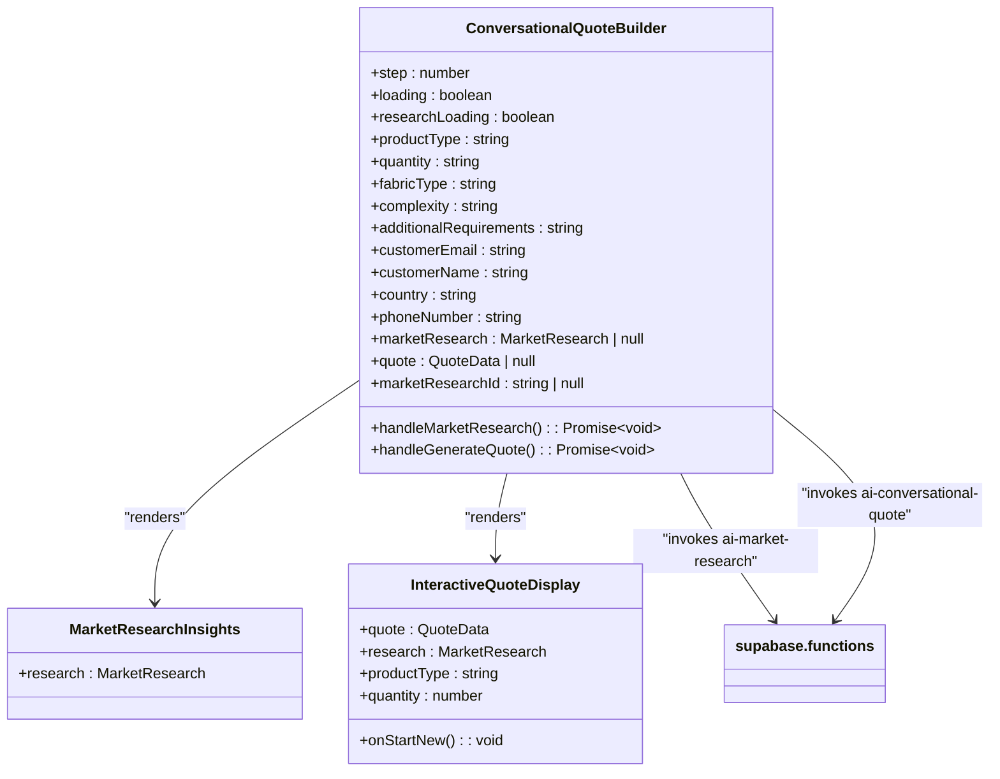

**Diagram sources**
- [ConversationalQuoteBuilder.tsx](file://src/components/quote/ConversationalQuoteBuilder.tsx#L43-L362)
- [MarketResearchInsights.tsx](file://src/components/quote/MarketResearchInsights.tsx#L21-L139)
- [InteractiveQuoteDisplay.tsx](file://src/components/quote/InteractiveQuoteDisplay.tsx#L45-L229)

**Section sources**
- [ConversationalQuoteBuilder.tsx](file://src/components/quote/ConversationalQuoteBuilder.tsx#L43-L362)

## Natural Language Input Integration
The NaturalLanguageQuoteInput component enables users to describe their manufacturing requirements in plain English, which are then parsed and converted into structured quote parameters. This feature significantly reduces friction in the quoting process by allowing free-text input that is automatically processed into form fields.

The component integrates with the parse-quote-description Supabase function, which uses AI to extract key information such as product type, quantity, fabric type, complexity level, and additional requirements from natural language descriptions. The implementation includes retry logic for handling transient errors and provides immediate feedback through toast notifications.

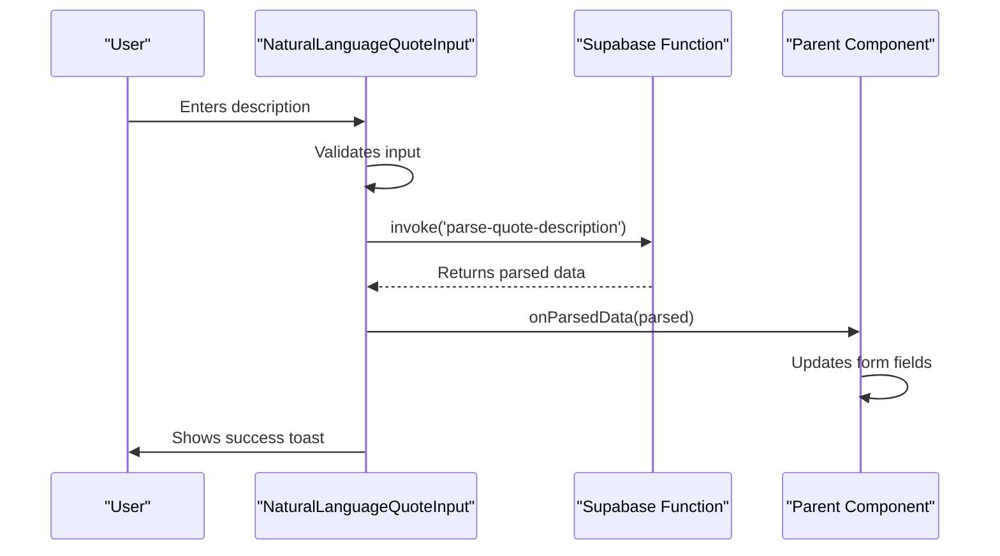

**Diagram sources**
- [NaturalLanguageQuoteInput.tsx](file://src/components/quote/NaturalLanguageQuoteInput.tsx#L22-L130)
- [supabase/functions/parse-quote-description/index.ts](file://supabase/functions/parse-quote-description/index.ts)

**Section sources**
- [NaturalLanguageQuoteInput.tsx](file://src/components/quote/NaturalLanguageQuoteInput.tsx#L22-L130)

## Smart Factory Matching
The SmartFactoryMatcher component provides intelligent supplier selection by analyzing factory capacity, performance metrics, and match scores against user requirements. This component helps users identify the most suitable manufacturing partners based on their specific order parameters.

Key functionality includes:
- Real-time factory capacity checking based on quantity and target date
- Performance score visualization (0-100 scale)
- Match score percentage display
- Capacity utilization indicators
- Optimization suggestions for orders exceeding single-factory capacity

The component uses the useAvailableFactories hook to fetch factory data and implements lazy loading with show more/less functionality for better performance with large result sets.

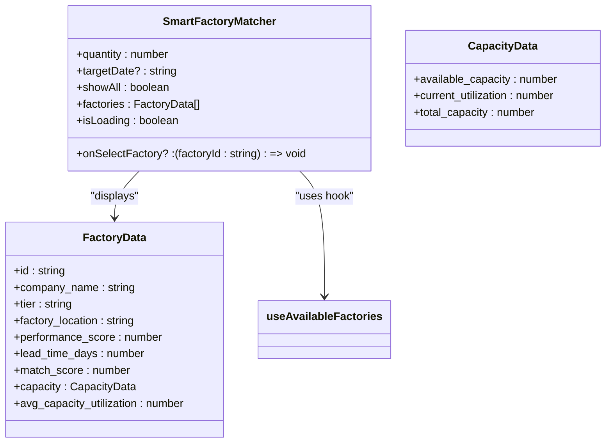

**Diagram sources**
- [SmartFactoryMatcher.tsx](file://src/components/quote/SmartFactoryMatcher.tsx#L15-L178)
- [hooks/useFactoryCapacity.ts](file://src/hooks/useFactoryCapacity.ts)

**Section sources**
- [SmartFactoryMatcher.tsx](file://src/components/quote/SmartFactoryMatcher.tsx#L15-L178)

## Market Research Insights
The MarketResearchInsights component enhances quotes with competitive pricing data from the ai-market-research function, providing transparency and market context for the generated quotes. This component displays real-time market data that validates the competitiveness of the proposed pricing.

Key features include:
- Confidence score visualization with color-coded badges
- Average unit cost and material cost per unit
- Lead time and market markup percentages
- Comparable product listings with source links
- Data source attribution with external links

The component receives research data from the ai-market-research function, which gathers information from multiple verified sources to ensure accuracy and reliability. The confidence score indicates the reliability of the market data, helping users assess the quote's validity.

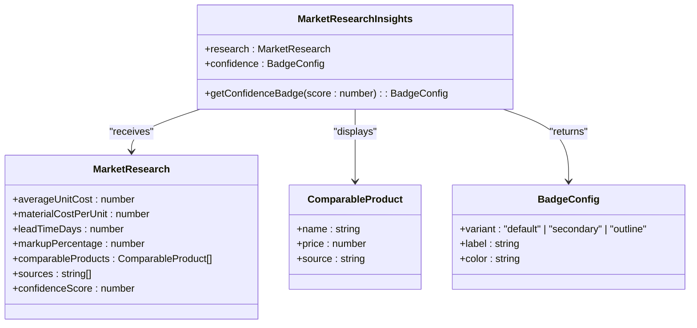

**Diagram sources**
- [MarketResearchInsights.tsx](file://src/components/quote/MarketResearchInsights.tsx#L21-L139)
- [supabase/functions/ai-market-research/index.ts](file://supabase/functions/ai-market-research/index.ts)

**Section sources**
- [MarketResearchInsights.tsx](file://src/components/quote/MarketResearchInsights.tsx#L21-L139)

## Quote Comparison and Decision Support
The quote system includes two complementary components for decision support: PriceComparison and QuoteComparison. These tools help users evaluate pricing competitiveness and compare multiple quotes side by side.

### Price Comparison Visualization
The PriceComparison component uses horizontal bar charts to visually compare pricing against US and China competitors, highlighting cost savings opportunities. The implementation includes:

- Animated bar charts with transition effects
- Savings calculations vs. US and China manufacturers
- Total order savings display
- Responsive grid layout for different screen sizes

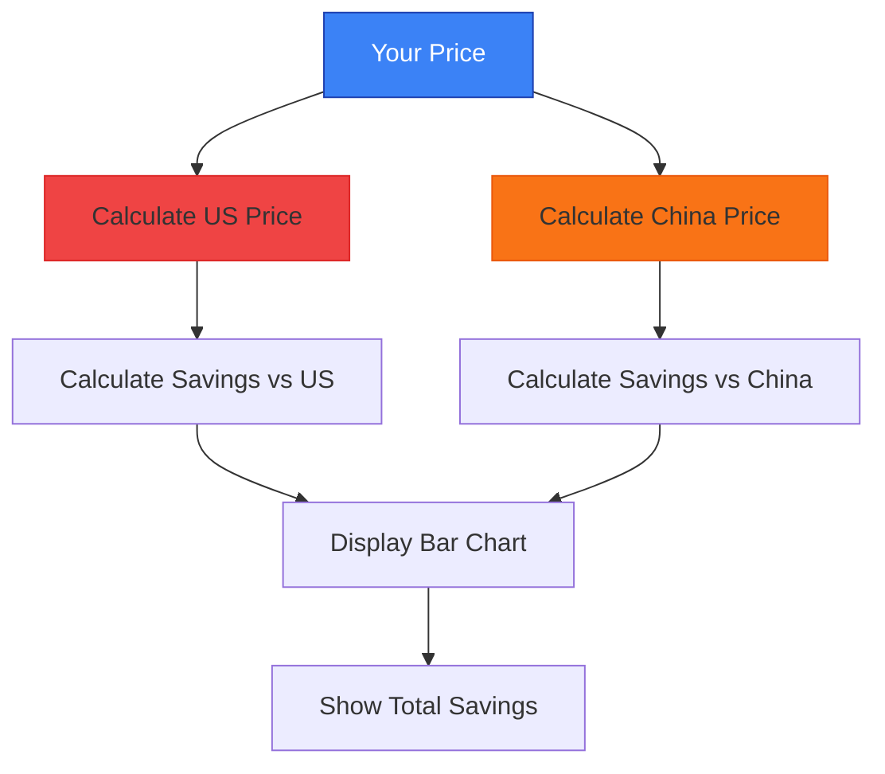

**Diagram sources**
- [PriceComparison.tsx](file://src/components/quote/PriceComparison.tsx#L10-L123)

### Quote Comparison Modal
The QuoteComparison component provides a detailed side-by-side comparison of multiple quotes through a modal interface. Key features include:

- Tabular comparison of quote specifications
- Price analysis with lowest price and potential savings
- Status badges with color coding
- Created date formatting
- Highlighted price columns for easy scanning

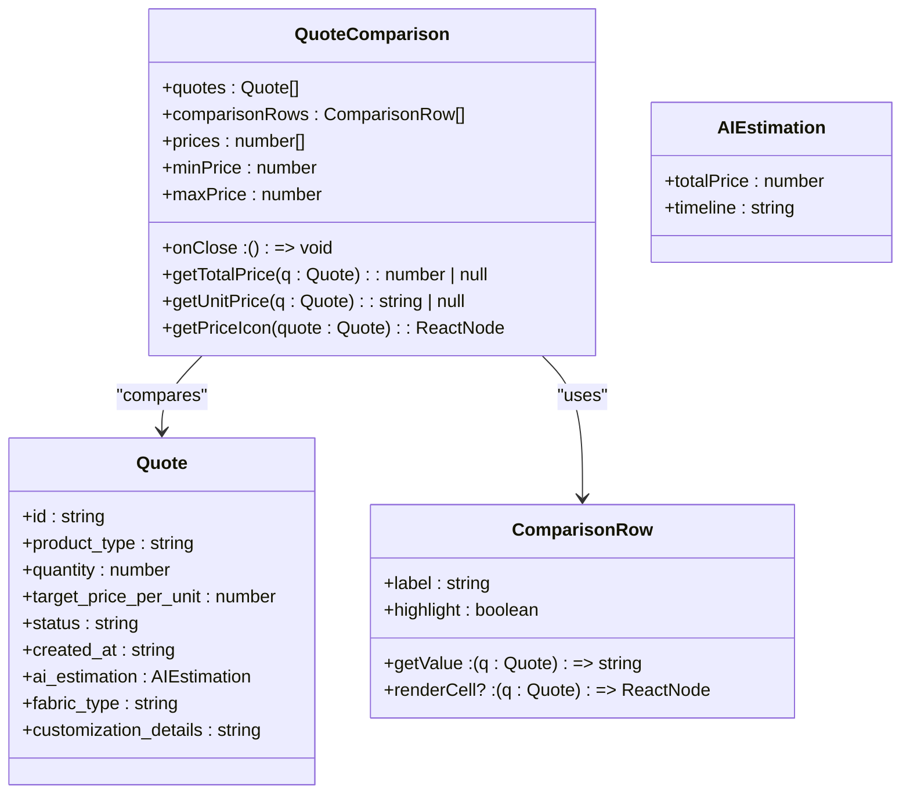

**Diagram sources**
- [QuoteComparison.tsx](file://src/components/quote/QuoteComparison.tsx#L20-L184)
- [hooks/useQuotes.ts](file://src/hooks/useQuotes.ts)

**Section sources**
- [PriceComparison.tsx](file://src/components/quote/PriceComparison.tsx#L10-L123)
- [QuoteComparison.tsx](file://src/components/quote/QuoteComparison.tsx#L20-L184)

## Quote Sharing and Audit Trails
The quote system includes robust mechanisms for sharing quotes and maintaining audit trails through the EmailQuoteModal and QuoteHistoryCard components.

### Email Quote Modal
The EmailQuoteModal component provides a secure way to share quotes via email with additional lead capture functionality. Key features include:

- Pre-filled quote summary in read-only mode
- Contact information collection with validation
- Optional swatch kit request
- Newsletter subscription option
- Phone number validation with regex pattern
- Success state with automatic dismissal

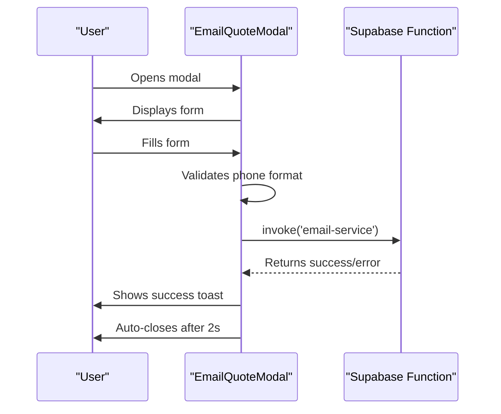

**Diagram sources**
- [EmailQuoteModal.tsx](file://src/components/quote/EmailQuoteModal.tsx#L30-L259)
- [supabase/functions/email-service/index.ts](file://supabase/functions/email-service/index.ts)

### Quote History and Audit Trail
The QuoteHistoryCard component displays past quotes in a card-based interface with selection functionality for comparison. Features include:

- Status badges with color coding
- Created date formatting
- Quantity and price displays
- Specification details
- Selection checkboxes for comparison
- View details link with ArrowRight icon

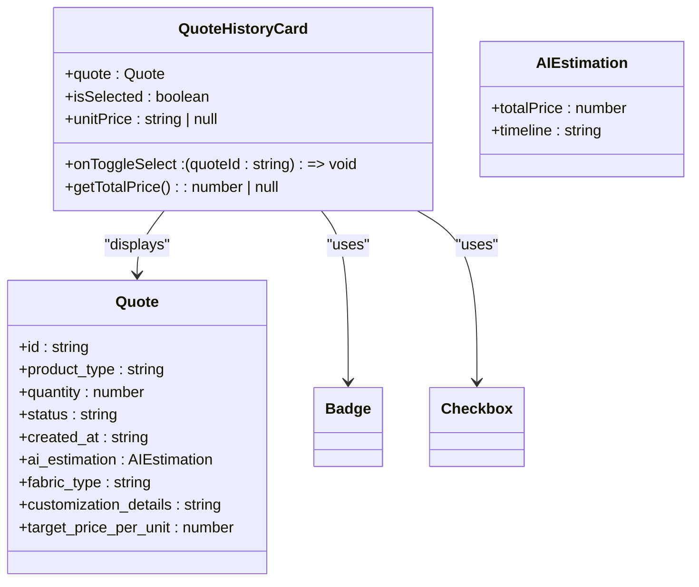

**Diagram sources**
- [QuoteHistoryCard.tsx](file://src/components/quote/QuoteHistoryCard.tsx#L29-L129)
- [hooks/useQuotes.ts](file://src/hooks/useQuotes.ts)

**Section sources**
- [EmailQuoteModal.tsx](file://src/components/quote/EmailQuoteModal.tsx#L30-L259)
- [QuoteHistoryCard.tsx](file://src/components/quote/QuoteHistoryCard.tsx#L29-L129)

## OTP Verification Flow
The AIQuoteGeneratorWithOTP component implements a secure quote generation process with email verification through OTP (One-Time Password). This flow ensures that quotes are generated only for valid email addresses and provides an additional layer of security.

The OTP verification process follows these steps:
1. Form submission with email validation
2. OTP request to send-otp function
3. User enters 6-digit code
4. Verification with verify-otp function
5. Quote generation upon successful verification

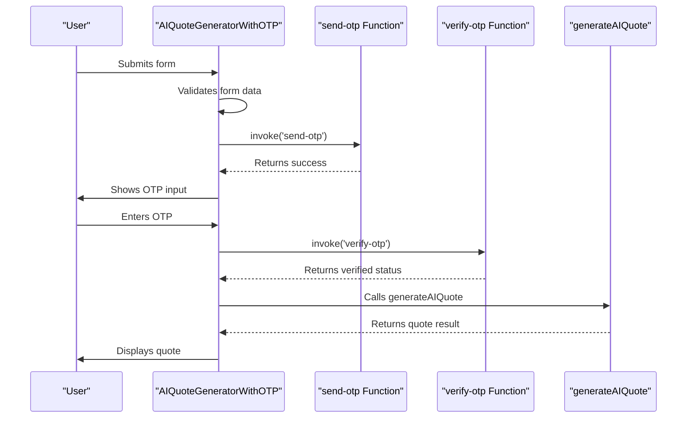

**Diagram sources**
- [AIQuoteGeneratorWithOTP.tsx](file://src/components/AIQuoteGeneratorWithOTP.tsx#L56-L800)
- [supabase/functions/send-otp/index.ts](file://supabase/functions/send-otp/index.ts)
- [supabase/functions/verify-otp/index.ts](file://supabase/functions/verify-otp/index.ts)
- [lib/api/aiQuote.ts](file://src/lib/api/aiQuote.ts)

**Section sources**
- [AIQuoteGeneratorWithOTP.tsx](file://src/components/AIQuoteGeneratorWithOTP.tsx#L56-L800)

## Form Validation and Accessibility
The quote components implement comprehensive form validation and accessibility features to ensure a robust user experience.

### Form Validation
The AIQuoteGeneratorWithOTP component uses Zod for schema-based validation with the following rules:
- Product type: required string
- Quantity: number between 50 and 100,000
- Complexity level: enum of 'simple', 'medium', 'complex'
- Fabric type: string with max 100 characters
- Additional requirements: string with max 2000 characters
- Customer name: string with max 100 characters
- Customer email: required valid email format
- Country: required string

Validation errors are displayed as toast notifications with specific error messages.

### Accessibility Features
Key accessibility implementations include:
- Proper ARIA labels for interactive elements
- Keyboard navigation support
- Semantic HTML structure with appropriate heading levels
- High contrast color schemes
- Screen reader support for dynamic content
- Focus management in modals
- Alt text for icons and images

The components use React Hook Form patterns for efficient form state management and validation, reducing re-renders and improving performance.

**Section sources**
- [AIQuoteGeneratorWithOTP.tsx](file://src/components/AIQuoteGeneratorWithOTP.tsx#L28-L37)
- [components/ui/form.tsx](file://src/components/ui/form.tsx)

## Component Architecture
The quote generation system follows a modular architecture with clear separation of concerns between components, hooks, and backend functions.

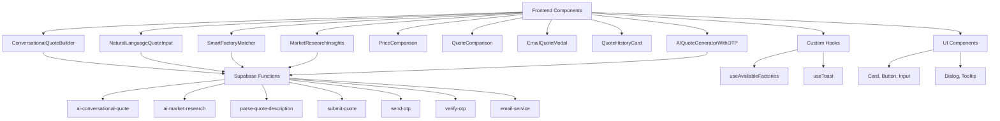

The architecture demonstrates a clean separation between presentation components, business logic, and data fetching. Frontend components handle UI rendering and user interaction, while Supabase functions manage AI processing, data validation, and external service integration. Custom hooks abstract complex logic and state management, promoting reusability across components.

**Diagram sources**
- [ConversationalQuoteBuilder.tsx](file://src/components/quote/ConversationalQuoteBuilder.tsx)
- [NaturalLanguageQuoteInput.tsx](file://src/components/quote/NaturalLanguageQuoteInput.tsx)
- [SmartFactoryMatcher.tsx](file://src/components/quote/SmartFactoryMatcher.tsx)
- [MarketResearchInsights.tsx](file://src/components/quote/MarketResearchInsights.tsx)
- [PriceComparison.tsx](file://src/components/quote/PriceComparison.tsx)
- [QuoteComparison.tsx](file://src/components/quote/QuoteComparison.tsx)
- [EmailQuoteModal.tsx](file://src/components/quote/EmailQuoteModal.tsx)
- [QuoteHistoryCard.tsx](file://src/components/quote/QuoteHistoryCard.tsx)
- [AIQuoteGeneratorWithOTP.tsx](file://src/components/AIQuoteGeneratorWithOTP.tsx)
- [supabase/functions/ai-conversational-quote/index.ts](file://supabase/functions/ai-conversational-quote/index.ts)
- [supabase/functions/ai-market-research/index.ts](file://supabase/functions/ai-market-research/index.ts)
- [supabase/functions/parse-quote-description/index.ts](file://supabase/functions/parse-quote-description/index.ts)
- [supabase/functions/submit-quote/index.ts](file://supabase/functions/submit-quote/index.ts)
- [supabase/functions/send-otp/index.ts](file://supabase/functions/send-otp/index.ts)
- [supabase/functions/verify-otp/index.ts](file://supabase/functions/verify-otp/index.ts)
- [hooks/useFactoryCapacity.ts](file://src/hooks/useFactoryCapacity.ts)
- [hooks/useToast.ts](file://src/hooks/use-toast.ts)

## Conclusion
The AI-powered quote generation system in sleekapp-v100 provides a comprehensive solution for instant pricing and manufacturing estimates. By combining conversational interfaces, natural language processing, market research integration, and intelligent supplier matching, the system delivers a seamless user experience from initial inquiry to final quote acceptance.

Key strengths of the implementation include:
- Modular component architecture with clear separation of concerns
- Robust integration between frontend components and backend AI functions
- Comprehensive form validation and accessibility features
- Visual decision support tools for price comparison
- Secure OTP verification for quote generation
- Detailed audit trails through quote history

The system effectively handles complex garment specifications while maintaining a user-friendly interface, making it suitable for both technical and non-technical users. Future enhancements could include real-time shipping cost calculations, enhanced factory filtering options, and integration with sample ordering workflows.