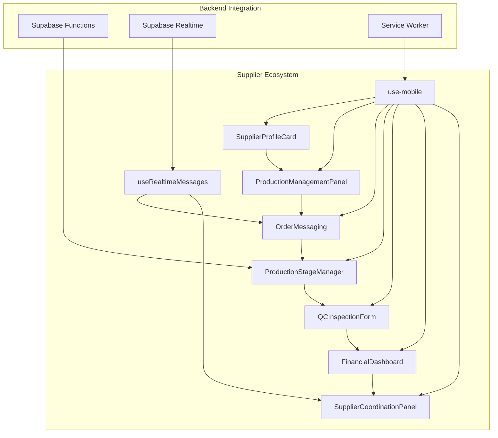
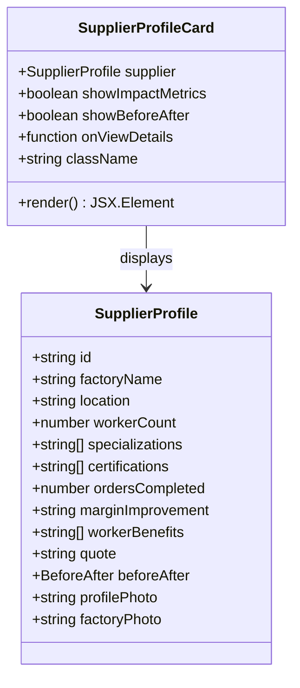
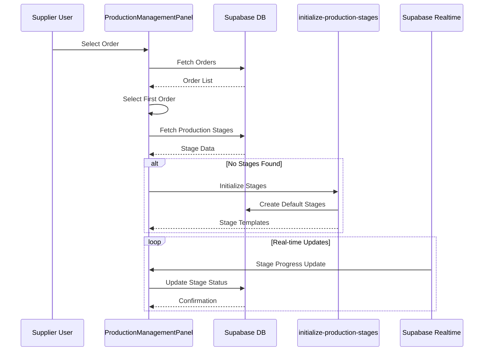
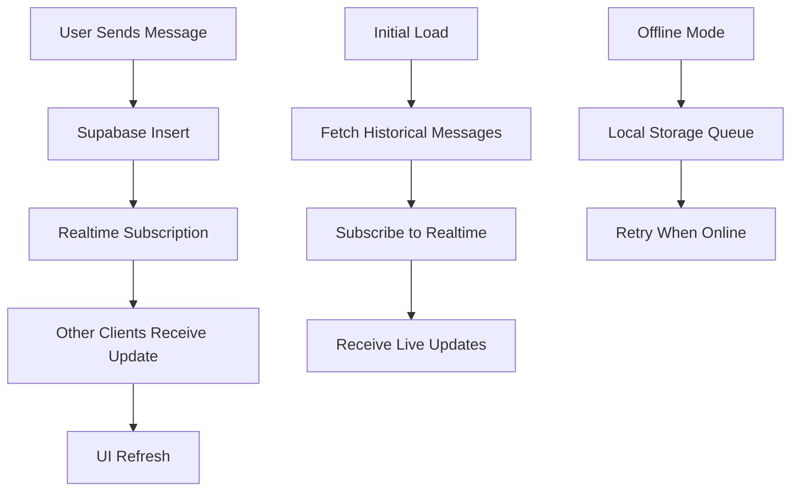
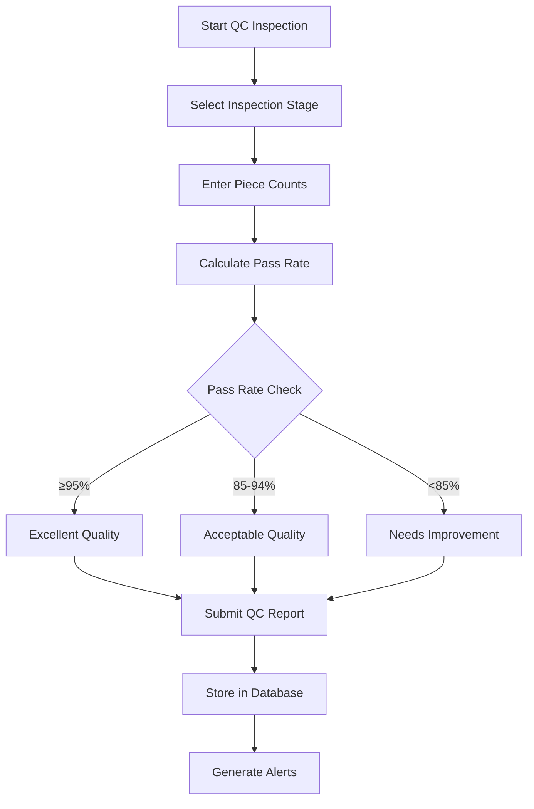
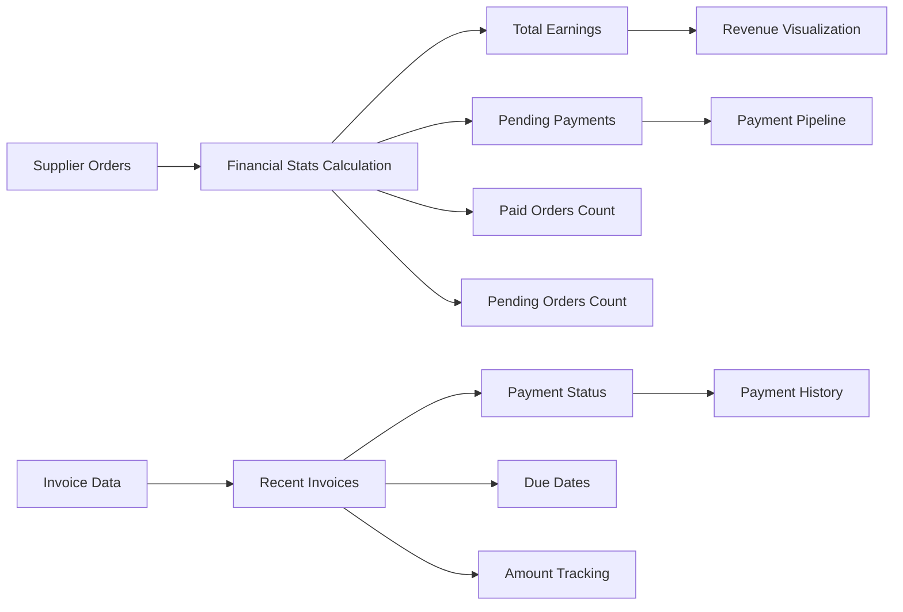
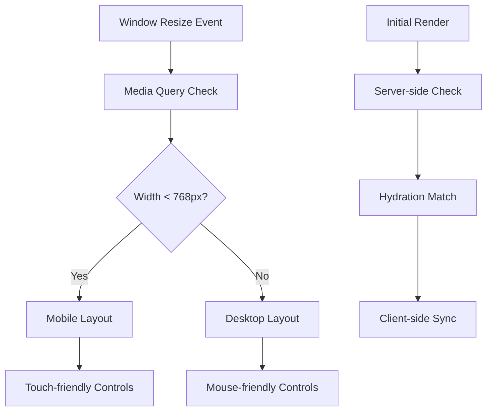
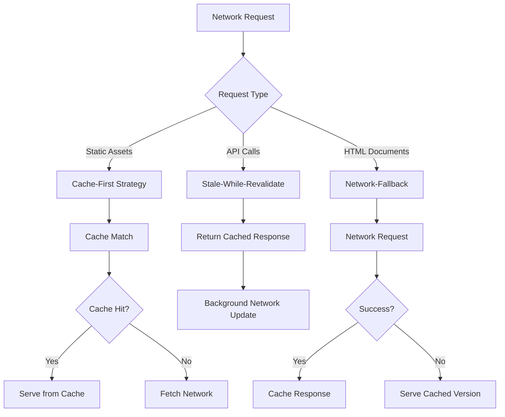
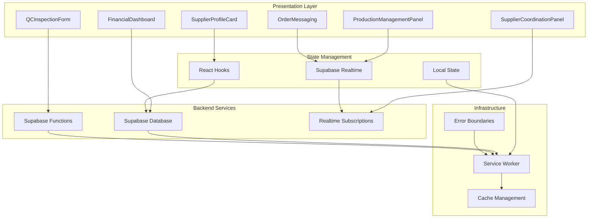

# Supplier Components

<cite>
**Referenced Files in This Document**
- [SupplierProfileCard.tsx](file://src/components/supplier/SupplierProfileCard.tsx)
- [ProductionManagementPanel.tsx](file://src/components/supplier/ProductionManagementPanel.tsx)
- [OrderMessaging.tsx](file://src/components/supplier/OrderMessaging.tsx)
- [ProductionStageManager.tsx](file://src/components/supplier/ProductionStageManager.tsx)
- [QCInspectionForm.tsx](file://src/components/supplier/QCInspectionForm.tsx)
- [FinancialDashboard.tsx](file://src/components/supplier/FinancialDashboard.tsx)
- [SupplierCoordinationPanel.tsx](file://src/components/production/SupplierCoordinationPanel.tsx)
- [useRealtimeMessages.ts](file://src/hooks/useRealtimeMessages.ts)
- [use-mobile.tsx](file://src/hooks/use-mobile.tsx)
- [initialize-production-stages/index.ts](file://supabase/functions/initialize-production-stages/index.ts)
- [sw.js](file://public/sw.js)
- [RootErrorBoundary.tsx](file://src/components/RootErrorBoundary.tsx)
</cite>

## Table of Contents
1. [Introduction](#introduction)
2. [Core Supplier Components](#core-supplier-components)
3. [Identity Representation](#identity-representation)
4. [Production Management](#production-management)
5. [Communication Systems](#communication-systems)
6. [Quality Control Integration](#quality-control-integration)
7. [Financial Tracking](#financial-tracking)
8. [Real-time Collaboration](#real-time-collaboration)
9. [Mobile Responsiveness](#mobile-responsiveness)
10. [Offline Capability](#offline-capability)
11. [Architecture Overview](#architecture-overview)
12. [Integration Patterns](#integration-patterns)
13. [Best Practices](#best-practices)

## Introduction

The sleekapp-v100 supplier ecosystem provides a comprehensive suite of components designed specifically for textile manufacturers and suppliers. These components enable efficient production management, seamless communication, quality control, and financial tracking within the factory floor environment. The system emphasizes real-time collaboration, mobile responsiveness, and offline capability to support the demanding needs of textile production facilities.

## Core Supplier Components

The supplier components are organized around five primary functional areas that address the complete supplier lifecycle from identity management to production execution and financial oversight.



**Diagram sources**
- [SupplierProfileCard.tsx](file://src/components/supplier/SupplierProfileCard.tsx#L1-L196)
- [ProductionManagementPanel.tsx](file://src/components/supplier/ProductionManagementPanel.tsx#L1-L325)
- [OrderMessaging.tsx](file://src/components/supplier/OrderMessaging.tsx#L1-L136)
- [ProductionStageManager.tsx](file://src/components/supplier/ProductionStageManager.tsx#L1-L251)
- [QCInspectionForm.tsx](file://src/components/supplier/QCInspectionForm.tsx#L1-L219)
- [FinancialDashboard.tsx](file://src/components/supplier/FinancialDashboard.tsx#L1-L232)
- [SupplierCoordinationPanel.tsx](file://src/components/production/SupplierCoordinationPanel.tsx#L1-L256)

## Identity Representation

### SupplierProfileCard.tsx

The SupplierProfileCard component serves as the primary identity representation for suppliers, providing a comprehensive view of supplier capabilities, certifications, and performance metrics.



**Diagram sources**
- [SupplierProfileCard.tsx](file://src/components/supplier/SupplierProfileCard.tsx#L7-L24)
- [SupplierProfileCard.tsx](file://src/components/supplier/SupplierProfileCard.tsx#L26-L32)

#### Key Features:
- **Visual Identity**: Displays factory name, location, and worker count with intuitive icons
- **Certification Display**: Shows WRAP, OEKO-TEX, and other industry certifications
- **Performance Metrics**: Highlights margin improvements and completed orders
- **Impact Visualization**: Demonstrates the positive impact on worker benefits
- **Responsive Design**: Adapts to various screen sizes with mobile-first principles

**Section sources**
- [SupplierProfileCard.tsx](file://src/components/supplier/SupplierProfileCard.tsx#L1-L196)

## Production Management

### ProductionManagementPanel.tsx

The ProductionManagementPanel provides comprehensive production stage management with real-time updates and automated stage initialization.



**Diagram sources**
- [ProductionManagementPanel.tsx](file://src/components/supplier/ProductionManagementPanel.tsx#L55-L130)
- [initialize-production-stages/index.ts](file://supabase/functions/initialize-production-stages/index.ts#L13-L133)

#### Core Functionality:
- **Order Selection**: Dynamic order selection with status filtering
- **Stage Initialization**: Automated creation of production stages via Supabase functions
- **Progress Tracking**: Real-time progress updates with percentage completion
- **Stage Management**: Individual stage updates with notes and timestamps
- **Status Visualization**: Color-coded status indicators for each production stage

**Section sources**
- [ProductionManagementPanel.tsx](file://src/components/supplier/ProductionManagementPanel.tsx#L1-L325)

### ProductionStageManager.tsx

The ProductionStageManager offers granular control over individual production stages with customizable templates and automated status management.

#### Template System:
The system uses predefined production stage templates mapped by product categories:

| Product Category | Default Stages |
|------------------|----------------|
| Casualwear | Fabric Preparation → Cutting → Sewing → Quality Control → Finishing |
| Activewear | Material Procurement → Cutting → Assembly → QC → Packaging |
| Knitwear | Yarn Inspection → Knitting → Linking → Washing → Final QC |

**Section sources**
- [ProductionStageManager.tsx](file://src/components/supplier/ProductionStageManager.tsx#L1-L251)

## Communication Systems

### OrderMessaging.tsx

The OrderMessaging component provides real-time messaging capabilities with Supabase realtime subscriptions for instant communication between suppliers and buyers.



**Diagram sources**
- [OrderMessaging.tsx](file://src/components/supplier/OrderMessaging.tsx#L22-L35)
- [useRealtimeMessages.ts](file://src/hooks/useRealtimeMessages.ts#L17-L61)

#### Messaging Features:
- **Real-time Communication**: Instant message delivery via Supabase realtime
- **Message History**: Comprehensive chat history with timestamps
- **User Identification**: Sender identification with full name display
- **Rich Content**: Support for text messages with potential attachment support
- **Status Indicators**: Read receipts and typing indicators

**Section sources**
- [OrderMessaging.tsx](file://src/components/supplier/OrderMessaging.tsx#L1-L136)

### useRealtimeMessages Hook

The useRealtimeMessages hook provides a reusable realtime messaging system for the entire application.

#### Realtime Event Handling:
- **INSERT Events**: New message notifications with automatic UI updates
- **UPDATE Events**: Message status changes and read receipts
- **Filtering**: Targeted subscriptions based on user roles and permissions
- **Error Handling**: Robust error management with fallback mechanisms

**Section sources**
- [useRealtimeMessages.ts](file://src/hooks/useRealtimeMessages.ts#L1-L61)

### SupplierCoordinationPanel.tsx

The SupplierCoordinationPanel enhances communication with supplier-specific features and integrated messaging.

#### Coordination Features:
- **Supplier Information**: Complete supplier contact details and company information
- **Integrated Messaging**: Direct messaging within supplier context
- **Message Thread Management**: Organized conversation threads per order
- **Role-Based Messaging**: Automatic sender role detection and display

**Section sources**
- [SupplierCoordinationPanel.tsx](file://src/components/production/SupplierCoordinationPanel.tsx#L1-L256)

## Quality Control Integration

### QCInspectionForm.tsx

The QCInspectionForm provides comprehensive quality control data capture with validation logic and pass rate calculations.



**Diagram sources**
- [QCInspectionForm.tsx](file://src/components/supplier/QCInspectionForm.tsx#L86-L174)

#### Quality Control Features:
- **Multi-stage Inspection**: Support for inspections at various production stages
- **Quantitative Analysis**: Total pieces checked, passed, and failed tracking
- **Pass Rate Calculation**: Automated pass rate calculation with visual indicators
- **Quality Classification**: Excellent, acceptable, and needs-improvement categorization
- **Defect Documentation**: Detailed notes and observations capture

#### Validation Logic:
The form implements comprehensive validation through controlled state management:

| Field | Validation Rule | Error Handling |
|-------|----------------|----------------|
| Total Pieces | Must be ≥ Passed + Failed | Automatic recalculation |
| Passed Pieces | Must be ≤ Total | Real-time adjustment |
| Failed Pieces | Calculated field | Read-only display |
| Stage Selection | Required field | Form submission blocking |

**Section sources**
- [QCInspectionForm.tsx](file://src/components/supplier/QCInspectionForm.tsx#L1-L219)

## Financial Tracking

### FinancialDashboard.tsx

The FinancialDashboard provides comprehensive revenue tracking and payment status monitoring for suppliers.



**Diagram sources**
- [FinancialDashboard.tsx](file://src/components/supplier/FinancialDashboard.tsx#L42-L98)

#### Financial Metrics:
- **Total Earnings**: Revenue from completed orders with currency formatting
- **Pending Payments**: Outstanding amounts from active orders
- **Paid Orders**: Count of successfully completed orders
- **Pending Orders**: Active orders awaiting completion
- **Payment History**: Recent invoice tracking with status visualization

#### Chart Integration:
The dashboard integrates with FinancialChartsEnhanced for:
- **Monthly Revenue Trends**: Historical revenue analysis
- **Payment Status Distribution**: Pie chart visualization of paid vs. pending
- **Order Volume Tracking**: Quantity-based analytics

**Section sources**
- [FinancialDashboard.tsx](file://src/components/supplier/FinancialDashboard.tsx#L1-L232)

## Real-time Collaboration

### ProductionStageManager Integration

The ProductionStageManager integrates seamlessly with Supabase functions for automated stage initialization and real-time updates.

#### Supabase Function Integration:
The system leverages the `initialize-production-stages` function for automated stage creation:

```typescript
// Function invocation pattern
const { data, error } = await supabase.functions.invoke('initialize-production-stages', {
  body: { 
    supplier_order_id: supplierOrderId, 
    product_type: productType 
  }
});
```

#### Real-time Tracking:
- **Automatic Timestamps**: Started_at and completed_at fields managed automatically
- **Status Transitions**: Seamless status changes based on completion percentages
- **Progress Persistence**: Real-time updates stored immediately in database
- **Conflict Resolution**: Optimistic concurrency handling for simultaneous updates

**Section sources**
- [ProductionStageManager.tsx](file://src/components/supplier/ProductionStageManager.tsx#L38-L82)
- [initialize-production-stages/index.ts](file://supabase/functions/initialize-production-stages/index.ts#L133-L133)

## Mobile Responsiveness

### useIsMobile Hook

The useIsMobile hook provides responsive design capabilities across all supplier components.



**Diagram sources**
- [use-mobile.tsx](file://src/hooks/use-mobile.tsx#L1-L32)

#### Responsive Features:
- **Breakpoint Detection**: Automatic detection at 768px width threshold
- **Hydration Safety**: Prevents hydration mismatches during SSR
- **Dynamic Updates**: Real-time layout adaptation on window resize
- **Touch Optimization**: Touch-friendly controls for mobile devices
- **Performance Optimization**: Efficient media query management

#### Component Adaptations:
All supplier components utilize the mobile hook for responsive behavior:

| Component | Mobile Adaptations |
|-----------|-------------------|
| SupplierProfileCard | Collapsible sections, touch targets |
| ProductionManagementPanel | Vertical layout, swipe gestures |
| OrderMessaging | Touch-friendly input, larger buttons |
| QCInspectionForm | Simplified form layout, easy input |
| FinancialDashboard | Card-based layout, simplified charts |

**Section sources**
- [use-mobile.tsx](file://src/hooks/use-mobile.tsx#L1-L32)

## Offline Capability

### Service Worker Implementation

The application implements comprehensive offline capabilities through a sophisticated service worker system.



**Diagram sources**
- [sw.js](file://public/sw.js#L85-L219)

#### Offline Strategies:
- **Cache-First for Static Assets**: Images, CSS, JavaScript with aggressive caching
- **Stale-While-Revalidate for APIs**: 5-minute cache with immediate network fallback
- **Network-Fallback for Documents**: HTML documents prioritizing fresh content
- **Service Worker Lifecycle**: Automatic cache management and cleanup

#### Offline Features:
- **Cached Supplier Profiles**: Access to supplier information without connectivity
- **Stored Production Data**: View and edit production stages offline
- **Message Queuing**: Store messages locally until network restoration
- **Error Recovery**: Graceful degradation with clear offline indicators

#### Cache Management:
The service worker implements intelligent cache management:

| Cache Type | Duration | Strategy |
|------------|----------|----------|
| Static Assets | 1 Year | Cache-first with versioning |
| Runtime Cache | 1 Day | Stale-while-revalidate |
| API Cache | 5 Minutes | Network fallback |
| Image Cache | 1 Year | Cache-first for media |

**Section sources**
- [sw.js](file://public/sw.js#L1-L219)

### Error Boundary Implementation

The RootErrorBoundary component provides comprehensive error handling for offline scenarios.

#### Error Recovery Features:
- **Cache Clearing**: Automatic service worker and cache removal
- **Full Application Reload**: Clean restart after cache invalidation
- **User Guidance**: Clear instructions for recovery actions
- **Graceful Degradation**: Maintains core functionality during errors

**Section sources**
- [RootErrorBoundary.tsx](file://src/components/RootErrorBoundary.tsx#L1-L82)

## Architecture Overview

### Component Integration Pattern

The supplier components follow a cohesive integration pattern that ensures seamless data flow and real-time synchronization.



**Diagram sources**
- [SupplierProfileCard.tsx](file://src/components/supplier/SupplierProfileCard.tsx#L1-L196)
- [ProductionManagementPanel.tsx](file://src/components/supplier/ProductionManagementPanel.tsx#L1-L325)
- [OrderMessaging.tsx](file://src/components/supplier/OrderMessaging.tsx#L1-L136)
- [QCInspectionForm.tsx](file://src/components/supplier/QCInspectionForm.tsx#L1-L219)
- [FinancialDashboard.tsx](file://src/components/supplier/FinancialDashboard.tsx#L1-L232)
- [SupplierCoordinationPanel.tsx](file://src/components/production/SupplierCoordinationPanel.tsx#L1-L256)

## Integration Patterns

### Supabase Function Integration

The system leverages Supabase Edge Functions for serverless processing of complex business logic.

#### Function Categories:
- **Initialization Functions**: Automated stage creation and template population
- **Business Logic**: Complex calculations and data transformations
- **Integration Handlers**: External system connectivity and data synchronization

#### Real-time Integration:
- **Event-driven Architecture**: Functions triggered by database events
- **Webhook Support**: External system notifications and updates
- **Batch Processing**: Scheduled operations for bulk data processing

### Messaging Patterns

The messaging system implements several sophisticated patterns for reliable communication.

#### Publish-Subscribe Pattern:
- **Topic-based Messaging**: Channel-based message routing
- **Event Streaming**: Continuous data flow for real-time updates
- **Filtering Mechanisms**: Targeted message delivery based on criteria

#### Queue Management:
- **Message Queuing**: Local queue for offline message storage
- **Retry Logic**: Automatic retry with exponential backoff
- **Delivery Guarantees**: At-least-once delivery semantics

## Best Practices

### Performance Optimization

#### Component-Level Optimizations:
- **Memoization**: Strategic use of React.memo for expensive computations
- **Lazy Loading**: Dynamic imports for non-critical components
- **Virtualization**: Large list rendering optimization
- **Debouncing**: Input field debouncing for real-time updates

#### Network Optimization:
- **Request Coalescing**: Combining multiple small requests
- **Compression**: Automatic response compression
- **CDN Integration**: Asset delivery optimization
- **Connection Pooling**: Efficient HTTP connection management

### Security Considerations

#### Authentication and Authorization:
- **Role-based Access Control**: Fine-grained permission systems
- **Token Management**: Secure JWT token handling
- **CSRF Protection**: Cross-site request forgery prevention
- **Input Validation**: Comprehensive input sanitization

#### Data Protection:
- **Encryption**: Data encryption at rest and in transit
- **Audit Logging**: Comprehensive change tracking
- **Data Retention**: Automated data lifecycle management
- **Privacy Compliance**: GDPR and regional privacy regulation adherence

### Accessibility Standards

#### WCAG Compliance:
- **Keyboard Navigation**: Full keyboard accessibility support
- **Screen Reader Support**: ARIA labels and semantic markup
- **Color Contrast**: High contrast ratio compliance
- **Focus Management**: Logical focus order and visibility

#### Mobile Accessibility:
- **Touch Targets**: Minimum 44px touch target sizing
- **Gesture Support**: Intuitive gesture-based navigation
- **Voice Control**: VoiceOver and similar assistive technologies
- **Reduced Motion**: Respects user motion preferences

### Testing Strategies

#### Unit Testing:
- **Component Testing**: Individual component functionality verification
- **Hook Testing**: Custom hook behavior validation
- **Utility Testing**: Helper function and utility testing
- **Mock Strategies**: Comprehensive mocking for external dependencies

#### Integration Testing:
- **API Integration**: Backend service integration validation
- **Real-time Testing**: WebSocket and realtime functionality testing
- **End-to-end Testing**: Complete workflow validation
- **Cross-browser Testing**: Multi-browser compatibility verification

#### Performance Testing:
- **Load Testing**: System performance under high load
- **Memory Leak Detection**: Long-running application stability
- **Network Simulation**: Performance under various network conditions
- **Battery Impact**: Mobile device battery usage optimization