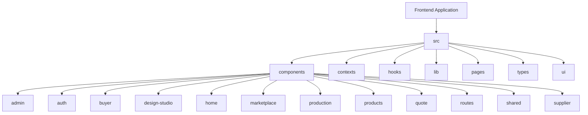
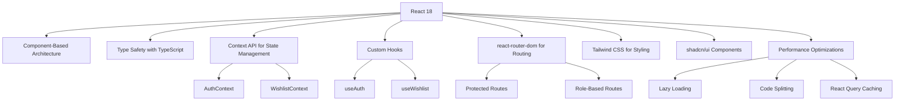
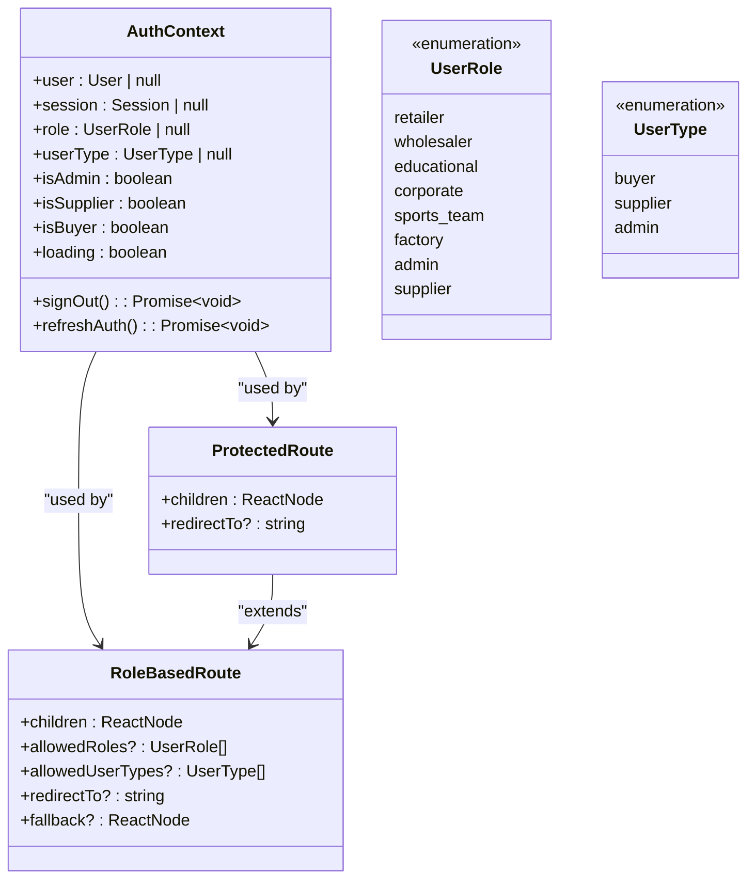
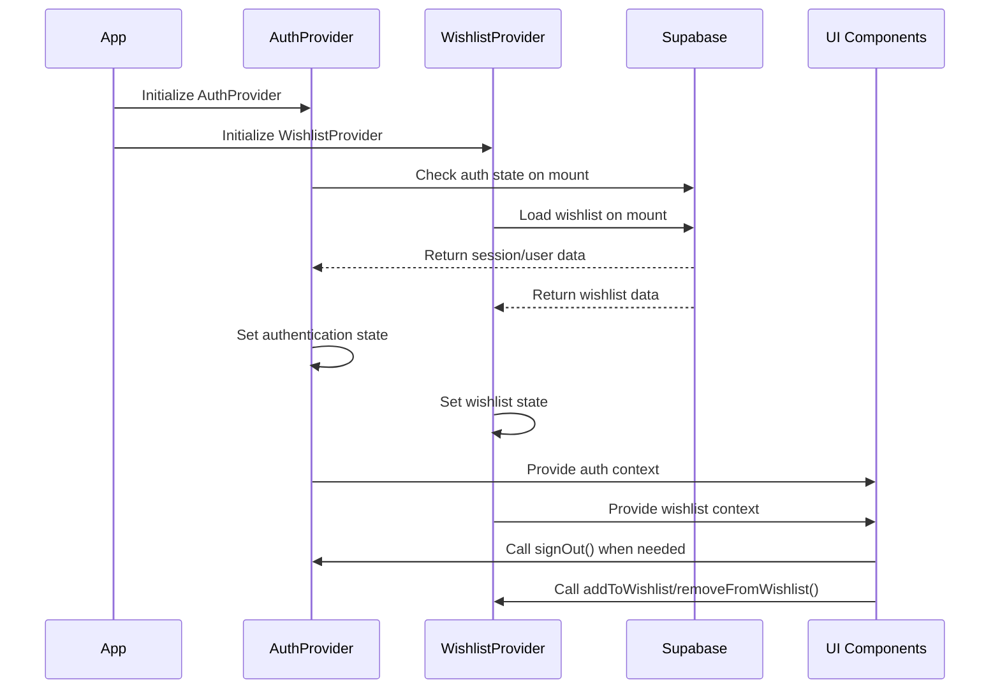
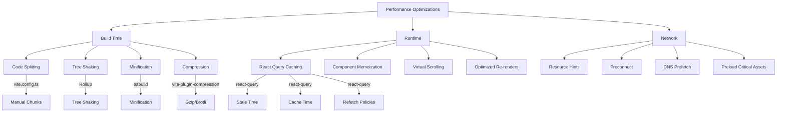

# Frontend Architecture

<cite>
**Referenced Files in This Document**   
- [main.tsx](file://src/main.tsx)
- [App.tsx](file://src/App.tsx)
- [index.css](file://src/index.css)
- [tailwind.config.ts](file://tailwind.config.ts)
- [vite.config.ts](file://vite.config.ts)
- [AuthContext.tsx](file://src/contexts/AuthContext.tsx)
- [WishlistContext.tsx](file://src/contexts/WishlistContext.tsx)
- [ProtectedRoute.tsx](file://src/components/routes/ProtectedRoute.tsx)
- [RoleBasedRoute.tsx](file://src/components/routes/RoleBasedRoute.tsx)
- [useWishlist.ts](file://src/hooks/useWishlist.ts)
- [button.tsx](file://src/components/ui/button.tsx)
- [lazyLoadRoutes.ts](file://src/lib/lazyLoadRoutes.ts)
- [performanceOptimizer.ts](file://src/lib/performanceOptimizer.ts)
</cite>

## Table of Contents
1. [Introduction](#introduction)
2. [Project Structure](#project-structure)
3. [Core Components](#core-components)
4. [Architecture Overview](#architecture-overview)
5. [Detailed Component Analysis](#detailed-component-analysis)
6. [Dependency Analysis](#dependency-analysis)
7. [Performance Considerations](#performance-considerations)
8. [Troubleshooting Guide](#troubleshooting-guide)
9. [Conclusion](#conclusion)

## Introduction
This document provides a comprehensive overview of the frontend architecture for the Sleek Apparels application. The application is built using React 18 with TypeScript for type safety, implementing a component-based architecture with modern frontend practices. The system utilizes Context API for global state management, custom hooks for reusable logic, and follows container/presentational component patterns. The routing is implemented with react-router-dom, with protected routes and role-based access control. Styling is handled through Tailwind CSS with shadcn/ui components, and various performance optimization techniques are implemented including lazy loading, code splitting, and memoization.

## Project Structure

The project follows a well-organized structure with clear separation of concerns. The main directories include:

- `src/components`: Contains all UI components organized by feature or functionality
- `src/contexts`: Global state management contexts (AuthContext, WishlistContext)
- `src/hooks`: Custom React hooks for reusable logic
- `src/integrations/supabase`: Supabase client and types
- `src/lib`: Utility libraries and performance optimization tools
- `src/pages`: Page-level components for routing
- `src/types`: Type definitions for the application
- `src/ui`: Reusable UI components from shadcn/ui



**Diagram sources**
- [src/components](file://src/components)

**Section sources**
- [src](file://src)

## Core Components

The application's core components include the main App component, authentication context, routing system, and global state management. The architecture is designed around React 18 features with TypeScript for type safety, ensuring maintainability and scalability.

**Section sources**
- [App.tsx](file://src/App.tsx)
- [AuthContext.tsx](file://src/contexts/AuthContext.tsx)
- [WishlistContext.tsx](file://src/contexts/WishlistContext.tsx)

## Architecture Overview

The frontend architecture follows a modern React application pattern with several key architectural decisions:

1. **Component-Based Architecture**: The application is structured as a tree of reusable components
2. **Type Safety**: TypeScript is used throughout the codebase for type safety
3. **State Management**: Context API is used for global state with custom hooks for business logic
4. **Routing**: react-router-dom handles client-side routing with protected routes
5. **Styling**: Tailwind CSS with shadcn/ui components provides a consistent design system
6. **Performance**: Various optimization techniques are implemented for optimal user experience



**Diagram sources**
- [App.tsx](file://src/App.tsx)
- [AuthContext.tsx](file://src/contexts/AuthContext.tsx)
- [WishlistContext.tsx](file://src/contexts/WishlistContext.tsx)
- [ProtectedRoute.tsx](file://src/components/routes/ProtectedRoute.tsx)
- [RoleBasedRoute.tsx](file://src/components/routes/RoleBasedRoute.tsx)

## Detailed Component Analysis

### Authentication and Authorization System

The authentication system is built around the AuthContext which provides user authentication state and role-based access control throughout the application.



**Diagram sources**
- [AuthContext.tsx](file://src/contexts/AuthContext.tsx)
- [ProtectedRoute.tsx](file://src/components/routes/ProtectedRoute.tsx)
- [RoleBasedRoute.tsx](file://src/components/routes/RoleBasedRoute.tsx)

**Section sources**
- [AuthContext.tsx](file://src/contexts/AuthContext.tsx)
- [ProtectedRoute.tsx](file://src/components/routes/ProtectedRoute.tsx)
- [RoleBasedRoute.tsx](file://src/components/routes/RoleBasedRoute.tsx)

### State Management with Context API

The application uses Context API for global state management, with two primary contexts: AuthContext for authentication state and WishlistContext for wishlist functionality.



**Diagram sources**
- [App.tsx](file://src/App.tsx)
- [AuthContext.tsx](file://src/contexts/AuthContext.tsx)
- [WishlistContext.tsx](file://src/contexts/WishlistContext.tsx)
- [useWishlist.ts](file://src/hooks/useWishlist.ts)

### Routing Implementation

The routing system is implemented with react-router-dom, featuring protected routes and role-based access control. The application uses both lazy loading and code splitting to optimize performance.

```mermaid
flowchart TD
A[Router] --> B[Public Routes]
A --> C[Protected Routes]
A --> D[Role-Based Routes]
B --> E[/]
B --> F[/auth]
B --> G[/products]
B --> H[/about]
B --> I[/contact]
C --> J[/dashboard]
C --> K[/settings]
C --> L[/profile]
D --> M[/admin]
D --> N[/supplier-dashboard]
D --> O[/buyer-dashboard]
C --> |Authentication Check| P[AuthContext]
D --> |Role Check| P
P --> |Provides user/role data| C
P --> |Provides user/role data| D
```

**Diagram sources**
- [App.tsx](file://src/App.tsx)
- [ProtectedRoute.tsx](file://src/components/routes/ProtectedRoute.tsx)
- [RoleBasedRoute.tsx](file://src/components/routes/RoleBasedRoute.tsx)

## Dependency Analysis

The application has a well-defined dependency structure with clear separation between core libraries, UI components, and utility functions.

```mermaid
graph TD
A[Frontend Application] --> B[React 18]
A --> C[TypeScript]
A --> D[Tailwind CSS]
A --> E[shadcn/ui]
A --> F[react-router-dom]
A --> G[@tanstack/react-query]
A --> H[Supabase]
D --> I[Tailwind Config]
E --> J[Radix UI]
G --> K[React Query Devtools]
H --> L[Supabase Client]
A --> M[Custom Components]
M --> N[Container Components]
M --> O[Presentational Components]
A --> P[Custom Hooks]
P --> Q[useAuth]
P --> R[useWishlist]
P --> S[Other Custom Hooks]
```

**Diagram sources**
- [package.json](file://package.json)
- [App.tsx](file://src/App.tsx)
- [tailwind.config.ts](file://tailwind.config.ts)

**Section sources**
- [package.json](file://package.json)
- [vite.config.ts](file://vite.config.ts)

## Performance Considerations

The application implements several performance optimization techniques to ensure fast load times and smooth user experience.

### Code Splitting and Lazy Loading

The application uses both route-based and component-based code splitting to minimize initial bundle size.

```mermaid
flowchart LR
A[Initial Bundle] --> B[Core Dependencies]
A --> C[Critical Components]
B --> D[React]
B --> E[React DOM]
B --> F[React Router]
C --> G[App Component]
C --> H[Auth Context]
I[Lazy Loaded Modules] --> J[Dashboard]
I --> K[Admin Panel]
I --> L[Product Catalog]
I --> M[Blog]
N[Dynamic Imports] --> O[lazy() function]
N --> P[Suspense fallback]
A --> |On Demand| I
O --> |Triggers| I
```

**Diagram sources**
- [App.tsx](file://src/App.tsx)
- [lazyLoadRoutes.ts](file://src/lib/lazyLoadRoutes.ts)
- [vite.config.ts](file://vite.config.ts)

### Performance Optimization Techniques

The application implements various performance optimization techniques at different levels.



**Diagram sources**
- [vite.config.ts](file://vite.config.ts)
- [App.tsx](file://src/App.tsx)
- [performanceOptimizer.ts](file://src/lib/performanceOptimizer.ts)

## Troubleshooting Guide

This section provides guidance for common issues that may arise when working with the frontend architecture.

### Common Issues and Solutions

| Issue | Possible Cause | Solution |
|------|---------------|---------|
| White screen on load | JavaScript disabled | Ensure JavaScript is enabled in browser |
| Authentication not persisting | Supabase session issue | Check Supabase configuration and network connectivity |
| Slow initial load | Large bundle size | Verify code splitting is working correctly |
| Routing not working | Incorrect route configuration | Check App.tsx routing configuration |
| Style inconsistencies | Tailwind classes not applied | Verify Tailwind configuration and build process |
| State not updating | Context provider missing | Ensure all context providers are properly wrapped |

**Section sources**
- [main.tsx](file://src/main.tsx)
- [App.tsx](file://src/App.tsx)
- [index.css](file://src/index.css)
- [tailwind.config.ts](file://tailwind.config.ts)

## Conclusion

The frontend architecture of the Sleek Apparels application demonstrates a well-structured, modern React application with TypeScript. The architecture follows best practices for component organization, state management, routing, and performance optimization. Key architectural decisions include:

1. **Component-Based Design**: Clear separation between container and presentational components
2. **Type Safety**: Comprehensive TypeScript usage throughout the codebase
3. **Global State Management**: Context API for authentication and wishlist state
4. **Protected Routing**: Role-based access control with ProtectedRoute and RoleBasedRoute components
5. **Performance Optimization**: Extensive use of lazy loading, code splitting, and caching
6. **Consistent Styling**: Tailwind CSS with a defined design system and shadcn/ui components

The architecture is scalable and maintainable, with clear separation of concerns and well-documented patterns. Future enhancements could include migrating to React Server Components if Next.js is adopted, implementing more advanced state management for complex scenarios, and further optimizing bundle size through more granular code splitting.