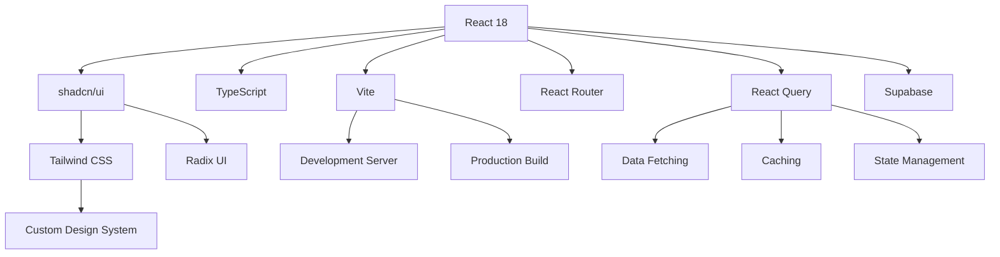
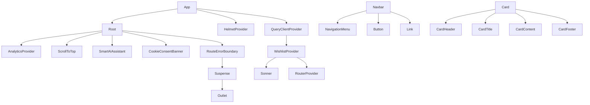
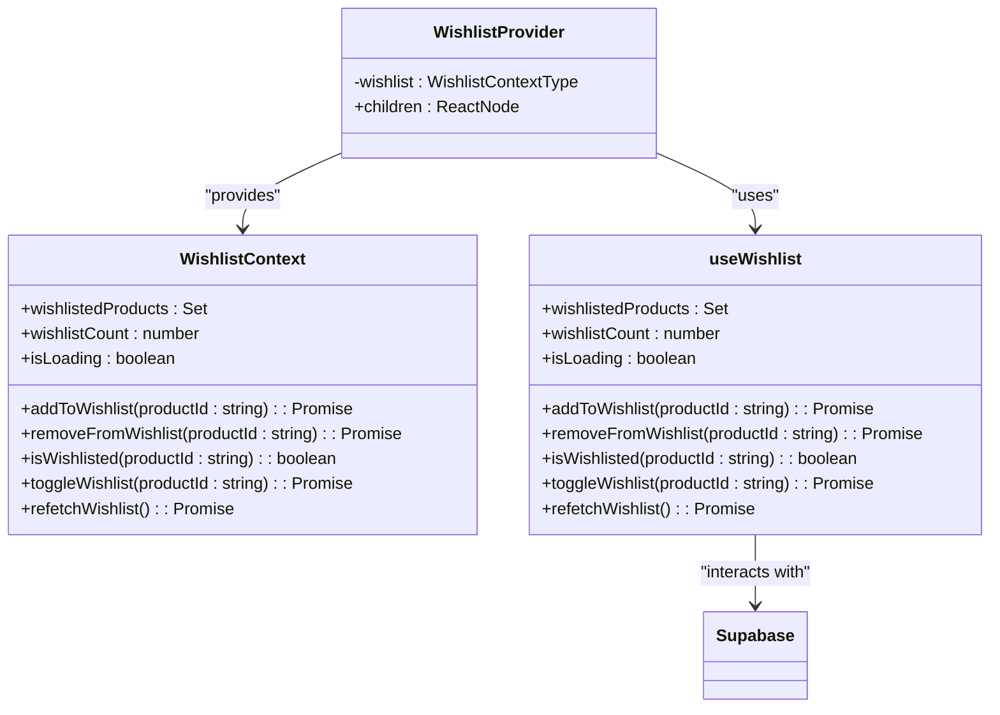
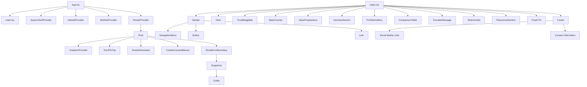

# Frontend Architecture

<cite>
**Referenced Files in This Document**   
- [App.tsx](file://src/App.tsx)
- [main.tsx](file://src/main.tsx)
- [vite.config.ts](file://vite.config.ts)
- [tailwind.config.ts](file://tailwind.config.ts)
- [package.json](file://package.json)
- [button.tsx](file://src/components/ui/button.tsx)
- [card.tsx](file://src/components/ui/card.tsx)
- [WishlistContext.tsx](file://src/contexts/WishlistContext.tsx)
- [useWishlist.ts](file://src/hooks/useWishlist.ts)
- [Index.tsx](file://src/pages/Index.tsx)
- [Navbar.tsx](file://src/components/Navbar.tsx)
- [Footer.tsx](file://src/components/Footer.tsx)
</cite>

## Table of Contents
1. [Introduction](#introduction)
2. [Technology Stack](#technology-stack)
3. [Project Structure](#project-structure)
4. [Core Architectural Patterns](#core-architectural-patterns)
5. [Component Hierarchy and Composition](#component-hierarchy-and-composition)
6. [State Management Strategy](#state-management-strategy)
7. [Data Fetching with React Query](#data-fetching-with-react-query)
8. [Routing and Navigation](#routing-and-navigation)
9. [Styling and Theming](#styling-and-theming)
10. [Performance Optimization](#performance-optimization)
11. [Accessibility and UX](#accessibility-and-ux)
12. [System Context Diagram](#system-context-diagram)
13. [Conclusion](#conclusion)

## Introduction

The frontend architecture of sleekapp-v100 is a modern, component-based React application built with TypeScript and the shadcn/ui design system. The application follows a modular architecture with clear separation of concerns, leveraging contemporary React patterns for state management, data fetching, and component composition. The architecture is designed to support a complex manufacturing platform with multiple user roles (buyers, suppliers, and administrators), featuring AI-powered instant quoting, real-time order tracking, and a comprehensive marketplace.

The application is structured around a component-driven development approach, with UI elements organized into reusable, composable components. The architecture emphasizes performance, accessibility, and developer experience, using Vite for fast development builds and production optimizations. The design system is implemented with Tailwind CSS for utility-first styling, augmented with shadcn/ui components that provide accessible, customizable UI primitives.

**Section sources**
- [App.tsx](file://src/App.tsx)
- [main.tsx](file://src/main.tsx)

## Technology Stack

The frontend technology stack is carefully selected to provide a modern development experience with optimal performance and maintainability. The core technologies include:

- **React 18**: The foundation of the frontend application, providing a component-based architecture with concurrent rendering capabilities
- **TypeScript**: For type safety and enhanced developer experience with static analysis
- **Vite**: As the build tool and development server, providing fast hot module replacement and optimized production builds
- **shadcn/ui**: A collection of reusable components built on top of Radix UI and Tailwind CSS, offering accessible and customizable UI elements
- **Tailwind CSS**: For utility-first styling with a custom design system implementation
- **React Router**: For client-side routing and navigation
- **React Query**: For data fetching, caching, and state management
- **Supabase**: For backend services including authentication, database, and serverless functions

The package.json file reveals a comprehensive set of dependencies that support the application's functionality, including @tanstack/react-query for data management, @radix-ui/react components for accessible UI primitives, and various utility libraries for form handling, animations, and analytics.



**Diagram sources **
- [package.json](file://package.json)
- [vite.config.ts](file://vite.config.ts)
- [tailwind.config.ts](file://tailwind.config.ts)

**Section sources**
- [package.json](file://package.json)
- [vite.config.ts](file://vite.config.ts)

## Project Structure

The project follows a feature-based organization with clear separation between different types of components and utilities. The src directory is organized into several top-level directories:

- **components**: Contains reusable UI components organized by feature area (admin, auth, blog, buyer, etc.) and shared UI primitives
- **contexts**: Contains React context providers for global state management
- **hooks**: Custom React hooks for encapsulating reusable logic
- **integrations**: Integration with external services like Supabase
- **lib**: Utility functions and shared logic
- **pages**: Route-level components that represent different views in the application
- **types**: TypeScript type definitions
- **ui**: shadcn/ui components that form the design system foundation

The component directory is further organized into feature-specific subdirectories (admin, buyer, supplier, etc.) and a ui directory containing the shadcn/ui components. This structure enables easy navigation and maintenance, with related components grouped together. The pages directory follows a similar pattern, with top-level pages and feature-specific pages organized in subdirectories.

The architecture supports lazy loading of components through React's lazy import functionality, which is configured in the App.tsx file. This improves initial load performance by only loading components when they are needed.

**Section sources**
- [App.tsx](file://src/App.tsx)
- [main.tsx](file://src/main.tsx)

## Core Architectural Patterns

The frontend architecture employs several key patterns to ensure maintainability, performance, and scalability:

1. **Component Composition**: Components are designed to be composable, with smaller, focused components combined to create more complex UIs. This follows the shadcn/ui philosophy of building blocks that can be assembled in different ways.

2. **Custom Hooks for Logic Reuse**: Business logic and side effects are encapsulated in custom hooks, following the "hooks as services" pattern. This separates UI concerns from business logic and enables easy testing and reuse.

3. **Context Providers for Global State**: React Context is used sparingly for truly global state that needs to be accessed by many components throughout the application.

4. **React Query for Data Management**: React Query handles all data fetching, caching, and synchronization with the server, providing a declarative way to manage server state.

5. **TypeScript for Type Safety**: The entire codebase is written in TypeScript, providing compile-time type checking and enhanced developer experience.

6. **Vite for Build Optimization**: Vite is configured with advanced optimizations including code splitting, compression, and asset optimization.

The architecture also incorporates performance monitoring and error tracking through the use of custom hooks and providers that wrap the application with analytics and error handling capabilities.

**Section sources**
- [App.tsx](file://src/App.tsx)
- [main.tsx](file://src/main.tsx)
- [useWishlist.ts](file://src/hooks/useWishlist.ts)

## Component Hierarchy and Composition

The component hierarchy follows a clear parent-child relationship starting from the App component, which serves as the root of the application. The App component renders the main application structure, including global providers and the router.

The component composition pattern is evident in the structure of the application, where higher-level components are composed of smaller, reusable components. For example, the Navbar component is composed of various UI primitives from shadcn/ui such as NavigationMenu, Button, and Link components.

The shadcn/ui components follow a consistent pattern of compound components, where a parent component (like Card) contains multiple sub-components (CardHeader, CardTitle, CardContent, etc.) that work together to create a cohesive UI element. This pattern is demonstrated in the card.tsx file, where the Card component and its sub-components are exported together.



**Diagram sources **
- [App.tsx](file://src/App.tsx)
- [Navbar.tsx](file://src/components/Navbar.tsx)
- [card.tsx](file://src/components/ui/card.tsx)

**Section sources**
- [App.tsx](file://src/App.tsx)
- [Navbar.tsx](file://src/components/Navbar.tsx)
- [card.tsx](file://src/components/ui/card.tsx)

## State Management Strategy

The application employs a multi-layered state management strategy that combines React Context, custom hooks, and React Query to handle different types of state:

1. **Local Component State**: Managed with React's useState and useReducer hooks for UI state that is confined to a single component.

2. **Global Application State**: Managed with React Context for state that needs to be accessed by many components throughout the application. The WishlistContext is an example of this pattern, providing wishlist functionality to any component that needs it.

3. **Server State**: Managed with React Query, which handles all data fetching, caching, and synchronization with the backend. This includes queries for products, orders, quotes, and other domain entities.

4. **Custom Hooks**: Business logic is encapsulated in custom hooks that can manage their own state and provide a clean API to components. The useWishlist hook is a prime example, abstracting the complexity of interacting with the Supabase backend.

The WishlistContext implementation demonstrates the pattern of using a context provider to make state available to the component tree, with a custom hook (useWishlistContext) to consume the context. The useWishlist hook encapsulates the logic for loading, adding, and removing items from the wishlist, including optimistic updates and error handling.



**Diagram sources **
- [WishlistContext.tsx](file://src/contexts/WishlistContext.tsx)
- [useWishlist.ts](file://src/hooks/useWishlist.ts)

**Section sources**
- [WishlistContext.tsx](file://src/contexts/WishlistContext.tsx)
- [useWishlist.ts](file://src/hooks/useWishlist.ts)

## Data Fetching with React Query

React Query is the primary mechanism for data fetching and server state management in the application. It is configured in the App.tsx file with optimized default settings for caching, refetching, and error handling.

The QueryClient is configured with the following settings:
- **staleTime**: 5 minutes - data stays fresh for 5 minutes before being considered stale
- **gcTime**: 10 minutes - cached data is cleaned up after 10 minutes of inactivity
- **refetchOnWindowFocus**: false - prevents automatic refetching when the window regains focus
- **refetchOnReconnect**: always - refetches data when the network connection is restored
- **refetchOnMount**: true - refetches data when a component mounts
- **structuralSharing**: true - enables structural sharing for better performance

These settings strike a balance between data freshness and performance, minimizing unnecessary network requests while ensuring users have access to up-to-date information. The configuration also includes retry logic (retry: 1) to handle transient network errors.

Custom hooks in the src/hooks/queries directory encapsulate specific data fetching logic, providing a clean API for components to interact with the backend. These hooks leverage React Query's useQuery and useMutation hooks to handle different types of operations.

The data fetching strategy follows a pattern of colocating queries with the components that use them, while extracting common patterns into reusable custom hooks. This approach makes it easy to understand the data requirements of each component while avoiding duplication of logic.

**Section sources**
- [App.tsx](file://src/App.tsx)

## Routing and Navigation

The application uses React Router for client-side routing, with a comprehensive routing configuration defined in the App.tsx file. The router is created with createBrowserRouter, which supports server-side rendering and static generation.

The routing structure includes:
- **Public routes**: Accessible to all users, including the home page, product catalog, and contact page
- **Authenticated routes**: Protected routes that require authentication, with access controlled based on user role
- **Admin routes**: Routes that are only accessible to admin users, typically accessed via an admin subdomain
- **SEO landing pages**: Dedicated pages optimized for search engine visibility
- **Legacy URL aliases**: Redirects for legacy URLs to prevent broken links

The routing configuration includes lazy loading for most pages, which improves initial load performance by only loading the code for the current page. Critical pages like the home page and contact page are loaded immediately to ensure fast initial rendering.

The SmartDashboardRouter component handles role-based routing, redirecting users to the appropriate dashboard based on their role (buyer, supplier, or admin). This component is used in conjunction with the dashboard-router route to provide a seamless user experience.

URL parameters are used extensively for dynamic content, such as product details (products/:id) and order tracking (orders/:orderId/track). The routing configuration also includes nested routes for complex features like admin functionality.

**Section sources**
- [App.tsx](file://src/App.tsx)
- [Index.tsx](file://src/pages/Index.tsx)

## Styling and Theming

The application uses Tailwind CSS for styling, with a custom design system implemented through the tailwind.config.ts file. The design system is based on CSS variables and semantic color names, allowing for easy theming and consistency across the application.

Key aspects of the styling and theming implementation include:

1. **Custom Theme Configuration**: The tailwind.config.ts file extends the default theme with custom colors, fonts, spacing, and typography settings. Colors are defined using CSS variables (e.g., hsl(var(--primary))) which enables dynamic theming.

2. **Semantic Color Names**: Instead of using generic color names, the application uses semantic names like primary, secondary, accent, and destructive. This makes the code more maintainable and allows for easy theme changes.

3. **Custom Typography**: The theme defines custom font sizes with semantic names (h1, h2, body-lg, etc.) and assigns them to specific font families (Open Sans, Inter, Crimson Text).

4. **Responsive Design**: The application is fully responsive, with mobile-specific styles and layout adjustments.

5. **Accessibility**: The design system includes accessibility features like focus rings, high contrast text, and proper color contrast ratios.

6. **Dark Mode**: The application supports dark mode through the darkMode: ["class"] configuration, which adds a "dark" class to the HTML element when dark mode is enabled.

The shadcn/ui components leverage this custom theme, ensuring consistency across all UI elements. The button.tsx file demonstrates how the design system is applied to components, using the cva (Class Variance Authority) utility to define variants with different styles for size and appearance.

```mermaid
classDiagram
class Button {
+variant : "default" | "gold" | "coral" | "outline" | "secondary" | "ghost" | "link" | "destructive"
+size : "default" | "sm" | "lg" | "icon"
+asChild : boolean
}
Button : +default : bg-primary text-primary-foreground hover : bg-primary-dark
Button : +gold : bg-accent text-accent-foreground hover : brightness-95
Button : +coral : bg-secondary text-secondary-foreground hover : brightness-90
Button : +outline : border-2 border-primary bg-transparent text-primary hover : bg-primary hover : text-primary-foreground
Button : +secondary : bg-secondary text-secondary-foreground hover : brightness-90
Button : +ghost : hover : bg-accent/20 hover : text-accent-foreground
Button : +link : text-primary underline-offset-4 hover : underline
Button : +destructive : bg-destructive text-destructive-foreground hover : bg-destructive/90
Button : +default : h-auto px-8 py-4 text-base
Button : +sm : h-auto px-4 py-2 text-sm
Button : +lg : h-auto px-10 py-5 text-lg
Button : +icon : h-12 w-12
```

**Diagram sources **
- [tailwind.config.ts](file://tailwind.config.ts)
- [button.tsx](file://src/components/ui/button.tsx)

**Section sources**
- [tailwind.config.ts](file://tailwind.config.ts)
- [button.tsx](file://src/components/ui/button.tsx)

## Performance Optimization

The application incorporates several performance optimization techniques to ensure fast load times and smooth user interactions:

1. **Vite Build Optimizations**: The vite.config.ts file includes numerous optimizations:
   - Code splitting with manualChunks to group related dependencies
   - CSS code splitting disabled for better caching
   - Lightning CSS for faster CSS minification
   - Asset inlining for small assets (< 4KB)
   - Gzip and Brotli compression for production builds
   - Bundle analysis with rollup-plugin-visualizer

2. **Lazy Loading**: Most pages and non-critical components are lazy loaded using React's lazy import syntax, reducing the initial bundle size.

3. **Code Splitting**: The build process creates multiple chunks for different parts of the application, allowing for parallel loading and better caching.

4. **Image Optimization**: The build process includes image optimization, with different file names for optimized images.

5. **Preload Critical CSS**: In production, critical CSS is preloaded to avoid render-blocking.

6. **Remove Console Logs**: Console logs are removed in production builds to reduce bundle size.

7. **Dependency Optimization**: The optimizeDeps configuration includes commonly used dependencies to improve development server startup time.

8. **Tree Shaking**: The build process eliminates unused code through tree shaking.

The performance monitoring system includes custom hooks like useCoreWebVitals and usePerformance that track key performance metrics and report them to analytics services. The application also includes a noscript fallback to inform users if JavaScript is disabled.

**Section sources**
- [vite.config.ts](file://vite.config.ts)
- [main.tsx](file://src/main.tsx)

## Accessibility and UX

The application prioritizes accessibility and user experience through several key practices:

1. **shadcn/ui Components**: The use of shadcn/ui components ensures that all UI elements are accessible by default, with proper ARIA attributes, keyboard navigation, and focus management.

2. **Semantic HTML**: Components use semantic HTML elements to provide proper structure and meaning.

3. **Keyboard Navigation**: All interactive elements are keyboard accessible, with proper focus indicators.

4. **Color Contrast**: The design system ensures sufficient color contrast for text and interactive elements.

5. **Responsive Design**: The application is fully responsive and works well on all device sizes.

6. **Error Boundaries**: The application includes error boundaries at multiple levels to prevent crashes and provide graceful error recovery.

7. **Loading States**: Components provide appropriate loading states and skeletons to indicate when content is being fetched.

8. **Form Validation**: Forms include client-side validation with clear error messages.

9. **Focus Management**: The application manages focus appropriately when navigating between pages and opening/closing dialogs.

10. **Reduced Motion**: The application respects user preferences for reduced motion.

The Navbar component demonstrates several accessibility features, including proper ARIA labels, keyboard navigation support, and focus management. The use of semantic icons with descriptive text ensures that screen reader users can understand the purpose of each navigation item.

**Section sources**
- [Navbar.tsx](file://src/components/Navbar.tsx)
- [Footer.tsx](file://src/components/Footer.tsx)

## System Context Diagram

The system context diagram illustrates the relationship between the main application components and how they interact to create the overall user experience.



**Diagram sources **
- [App.tsx](file://src/App.tsx)
- [main.tsx](file://src/main.tsx)
- [Index.tsx](file://src/pages/Index.tsx)
- [Navbar.tsx](file://src/components/Navbar.tsx)
- [Footer.tsx](file://src/components/Footer.tsx)

**Section sources**
- [App.tsx](file://src/App.tsx)
- [main.tsx](file://src/main.tsx)
- [Index.tsx](file://src/pages/Index.tsx)

## Conclusion

The frontend architecture of sleekapp-v100 represents a modern, well-structured React application that follows best practices for component design, state management, and performance optimization. By leveraging the shadcn/ui design system with Tailwind CSS, the application achieves a consistent, accessible user interface while maintaining flexibility for customization.

The architecture effectively combines several key patterns:
- Component composition for reusable, maintainable UI elements
- Custom hooks for encapsulating business logic and side effects
- React Context for global state management
- React Query for efficient data fetching and caching
- Vite for fast development and optimized production builds
- TypeScript for type safety and developer experience
- File-based routing for intuitive navigation

The result is a scalable, maintainable frontend that can support the complex requirements of a manufacturing platform with multiple user roles and extensive functionality. The architecture is designed to be extensible, making it easy to add new features and adapt to changing business requirements.

Future enhancements could include:
- Improved type safety with more comprehensive TypeScript interfaces
- Enhanced error boundaries with more granular error handling
- Additional performance optimizations like prefetching and preloading
- Improved accessibility testing and compliance
- Enhanced theming capabilities with more dynamic theme switching

Overall, the frontend architecture provides a solid foundation for the sleekapp-v100 platform, balancing developer experience with end-user performance and accessibility.