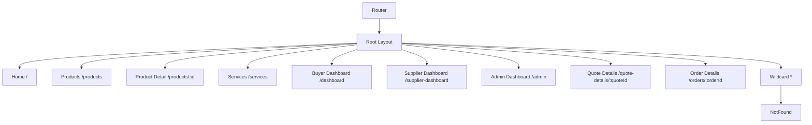
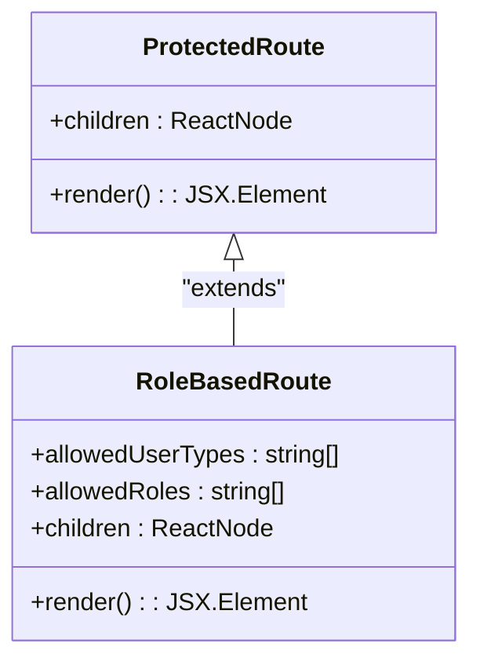
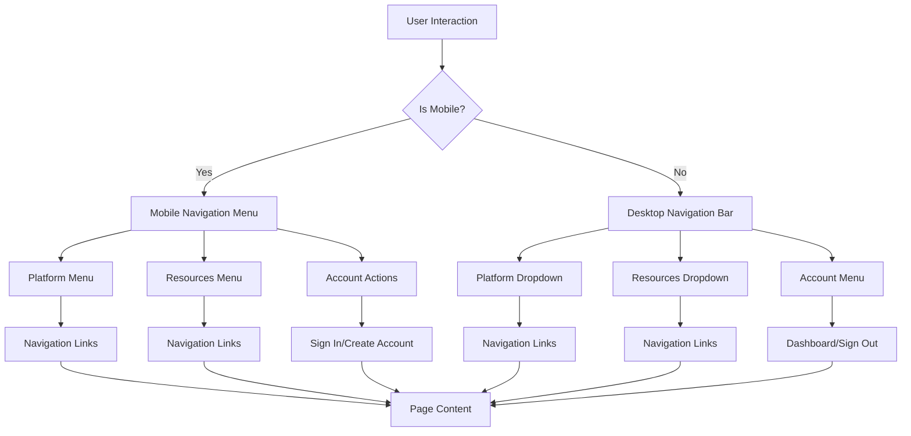
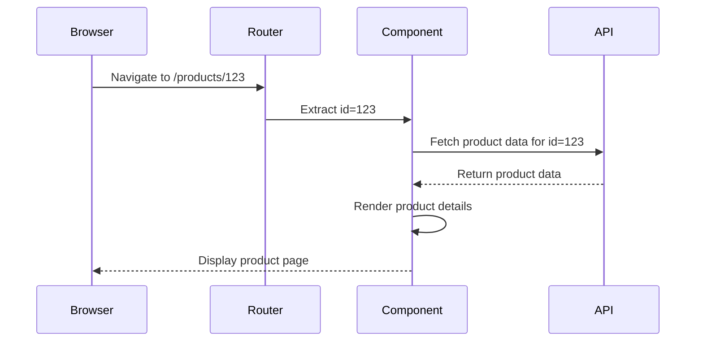
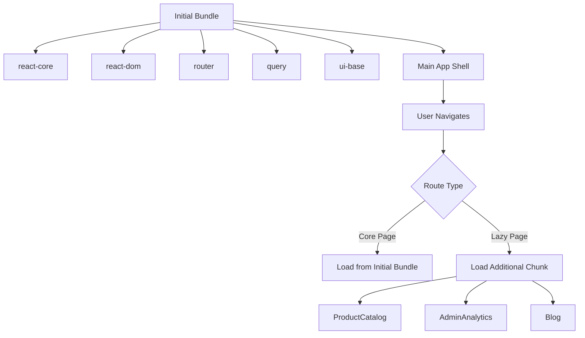
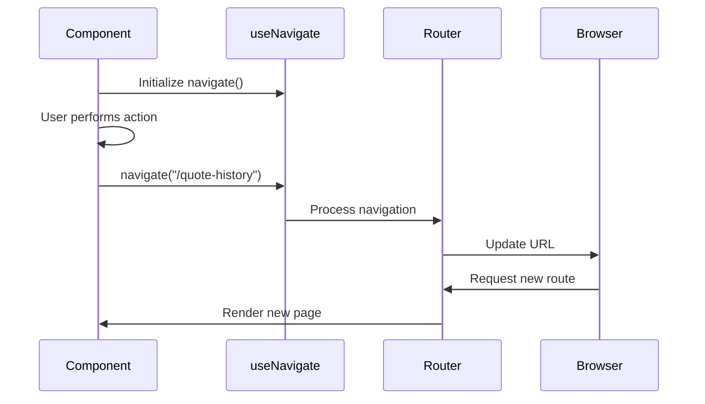
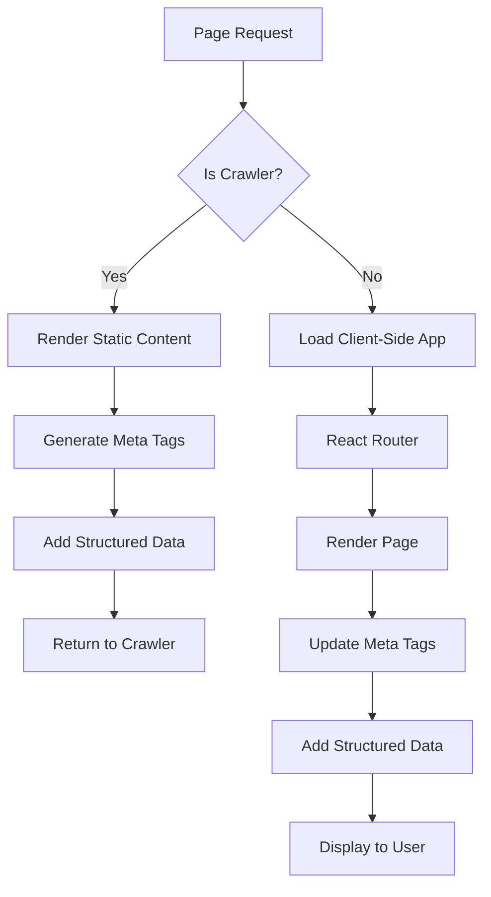

# Routing & Navigation

<cite>
**Referenced Files in This Document**   
- [App.tsx](file://src/App.tsx)
- [main.tsx](file://src/main.tsx)
- [ProtectedRoute.tsx](file://src/components/routes/ProtectedRoute.tsx)
- [RoleBasedRoute.tsx](file://src/components/routes/RoleBasedRoute.tsx)
- [Navbar.tsx](file://src/components/Navbar.tsx)
- [Footer.tsx](file://src/components/Footer.tsx)
- [Breadcrumb.tsx](file://src/components/Breadcrumb.tsx)
- [ProductDetail.tsx](file://src/pages/ProductDetail.tsx)
- [QuoteDetails.tsx](file://src/pages/QuoteDetails.tsx)
- [SupplierOrderDetail.tsx](file://src/pages/SupplierOrderDetail.tsx)
- [vite.config.ts](file://vite.config.ts)
</cite>

## Table of Contents
1. [Introduction](#introduction)
2. [Route Configuration](#route-configuration)
3. [Authentication & Role-Based Access Control](#authentication--role-based-access-control)
4. [Navigation Structure](#navigation-structure)
5. [Dynamic Routing Patterns](#dynamic-routing-patterns)
6. [Route-Level Code Splitting](#route-level-code-splitting)
7. [Programmatic Navigation & Query Parameters](#programmatic-navigation--query-parameters)
8. [SEO & Client-Side Routing](#seo--client-side-routing)
9. [Conclusion](#conclusion)

## Introduction

The routing and navigation system in the SleekApparels application is built on react-router-dom, providing a robust client-side routing solution that enables seamless navigation between pages while maintaining optimal performance and SEO compliance. The system supports role-based access control, dynamic routing for product and order details, and implements route-level code splitting for improved load times. This documentation provides a comprehensive overview of the routing architecture, navigation components, and associated patterns used throughout the application.

**Section sources**
- [App.tsx](file://src/App.tsx#L1-L362)

## Route Configuration

The application's routing is configured in App.tsx using react-router-dom's createBrowserRouter function. The router is defined with a hierarchical structure that includes both public and protected routes. Critical pages such as the homepage, contact page, and health check are imported directly for immediate loading, while secondary pages are lazy-loaded to optimize initial bundle size.

The route configuration includes specific paths for different user roles, with buyer, supplier, and admin dashboards each having dedicated routes. The system also implements route aliases for SEO and legacy URL support, redirecting paths like "/sign-in" to "/auth" to prevent 404 errors. The wildcard route at the end ensures that any unmatched paths are directed to the NotFound component.

**Diagram sources**
- [App.tsx](file://src/App.tsx#L180-L313)

**Section sources**
- [App.tsx](file://src/App.tsx#L180-L313)

## Authentication & Role-Based Access Control

The application implements a comprehensive authentication and authorization system using two custom route components: ProtectedRoute and RoleBasedRoute. These components are imported from src/components/routes and are used throughout the route configuration to control access to protected resources.

ProtectedRoute serves as the base authentication guard, wrapping routes that require any authenticated user. It checks the user's authentication status and redirects to the login page if not authenticated. RoleBasedRoute extends this functionality by implementing role-based access control, allowing different routes to be restricted to specific user types such as 'buyer', 'supplier', or 'admin'. This is evident in the route configuration where buyer dashboard routes specify allowedUserTypes={['buyer']} while admin routes specify allowedRoles={['admin']}.

The system also includes a SmartDashboardRouter component that likely handles dynamic dashboard routing based on the user's role, providing a unified entry point that redirects to the appropriate dashboard interface.

**Diagram sources**
- [App.tsx](file://src/App.tsx#L9)
- [ProtectedRoute.tsx](file://src/components/routes/ProtectedRoute.tsx)
- [RoleBasedRoute.tsx](file://src/components/routes/RoleBasedRoute.tsx)

**Section sources**
- [App.tsx](file://src/App.tsx#L211-L243)
- [ProtectedRoute.tsx](file://src/components/routes/ProtectedRoute.tsx)
- [RoleBasedRoute.tsx](file://src/components/routes/RoleBasedRoute.tsx)

## Navigation Structure

The application features a comprehensive navigation structure consisting of Navbar, Footer, and Breadcrumb components that provide consistent user navigation across all pages. The Navbar component implements a responsive design with desktop and mobile views, featuring dropdown menus for platform features and resources. It also includes role-specific navigation, displaying dashboard links for authenticated users and sign-up options for guests.

The Footer component provides site-wide navigation with links organized into categories such as Services, Resources, and Contact information. It includes social media links and legal pages, ensuring users can easily access important information from any page.

The Breadcrumb component enhances navigation by showing the user's current location within the site hierarchy. It generates structured data for SEO purposes and provides clickable links to parent pages, allowing users to navigate upward in the site structure. The component uses a routeNameMap to convert URL segments into human-readable names, improving the user experience.

**Diagram sources**
- [Navbar.tsx](file://src/components/Navbar.tsx)
- [Footer.tsx](file://src/components/Footer.tsx)
- [Breadcrumb.tsx](file://src/components/Breadcrumb.tsx)

**Section sources**
- [Navbar.tsx](file://src/components/Navbar.tsx)
- [Footer.tsx](file://src/components/Footer.tsx)
- [Breadcrumb.tsx](file://src/components/Breadcrumb.tsx)

## Dynamic Routing Patterns

The application implements dynamic routing patterns for pages that display specific data based on URL parameters. These patterns are used in pages like ProductDetail, QuoteDetails, and SupplierOrderDetail, where the route includes a parameter that identifies the specific resource to display.

In ProductDetail.tsx, the useParams hook is used to extract the product ID from the URL, which is then used to fetch the corresponding product data. The route pattern "/products/:id" allows the application to display different products based on the ID in the URL. Similarly, QuoteDetails.tsx uses the ":quoteId" parameter to load specific quote information, while SupplierOrderDetail.tsx uses ":orderId" to display order details.

These dynamic routes are protected by authentication checks that verify the user has permission to access the requested resource. For example, the SupplierOrderDetail component verifies that the order belongs to the authenticated supplier before displaying the details, preventing unauthorized access to sensitive information.

**Diagram sources**
- [ProductDetail.tsx](file://src/pages/ProductDetail.tsx)
- [QuoteDetails.tsx](file://src/pages/QuoteDetails.tsx)
- [SupplierOrderDetail.tsx](file://src/pages/SupplierOrderDetail.tsx)

**Section sources**
- [ProductDetail.tsx](file://src/pages/ProductDetail.tsx)
- [QuoteDetails.tsx](file://src/pages/QuoteDetails.tsx)
- [SupplierOrderDetail.tsx](file://src/pages/SupplierOrderDetail.tsx)

## Route-Level Code Splitting

The application implements route-level code splitting through Vite's lazy loading capabilities, configured in vite.config.ts. This optimization technique significantly improves initial load times by splitting the application bundle into smaller chunks that are loaded on-demand when the user navigates to specific routes.

In vite.config.ts, the rollupOptions configuration defines manualChunks that group related dependencies together. Critical libraries like React, React Router, and React Query are separated into their own chunks to ensure they can be cached independently. The configuration also includes specific chunks for heavy libraries like Framer Motion and Recharts, which are only loaded when needed.

The App.tsx file implements lazy loading for secondary pages using dynamic imports with the lazy function. Pages like ProductCatalog, ProductDetail, and various dashboard components are imported lazily, with Suspense used to handle the loading state. This approach ensures that users only download the code necessary for the current page, reducing bandwidth usage and improving performance.

**Diagram sources**
- [vite.config.ts](file://vite.config.ts)
- [App.tsx](file://src/App.tsx)

**Section sources**
- [vite.config.ts](file://vite.config.ts)
- [App.tsx](file://src/App.tsx)

## Programmatic Navigation & Query Parameters

The application uses react-router-dom's navigation hooks for programmatic navigation and query parameter handling. The useNavigate hook is used in components like QuoteDetails.tsx and SupplierOrderDetail.tsx to programmatically redirect users based on application state or user actions.

For example, in QuoteDetails.tsx, the navigate function is used to redirect users back to the quote history page when an invalid quote ID is provided. Similarly, SupplierOrderDetail.tsx uses navigate to redirect unauthenticated users to the login page or to return to the supplier dashboard after viewing an order.

The application also handles query parameters through URL patterns and component logic. While not explicitly shown in the provided code, the routing system supports query parameters for filtering and state management, particularly in pages like ProductCatalog where category filtering would likely be implemented through query parameters.

**Diagram sources**
- [QuoteDetails.tsx](file://src/pages/QuoteDetails.tsx)
- [SupplierOrderDetail.tsx](file://src/pages/SupplierOrderDetail.tsx)

**Section sources**
- [QuoteDetails.tsx](file://src/pages/QuoteDetails.tsx)
- [SupplierOrderDetail.tsx](file://src/pages/SupplierOrderDetail.tsx)

## SEO & Client-Side Routing

The application addresses SEO implications of client-side routing through comprehensive meta tag management and structured data implementation. The SEO component, used in pages like ProductDetail.tsx, dynamically generates title, description, and Open Graph tags based on the current page content, ensuring search engines can properly index each page.

The Breadcrumb component implements JSON-LD structured data to provide search engines with information about the site hierarchy, improving search result presentation and potentially enhancing click-through rates. ProductDetail.tsx also generates Product schema markup, providing search engines with detailed information about products including price, availability, and reviews.

The application includes a noscript fallback in App.tsx that displays a message to users with JavaScript disabled, informing them that JavaScript is required for the site to function properly. This ensures a basic level of accessibility while maintaining the benefits of a modern client-side application.

Additionally, the Vite configuration includes optimizations for SEO, such as transforming CSS links to preload for non-render-blocking loading, which improves page load performance—a key ranking factor for search engines.

**Diagram sources**
- [ProductDetail.tsx](file://src/pages/ProductDetail.tsx)
- [Breadcrumb.tsx](file://src/components/Breadcrumb.tsx)
- [App.tsx](file://src/App.tsx)
- [vite.config.ts](file://vite.config.ts)

**Section sources**
- [ProductDetail.tsx](file://src/pages/ProductDetail.tsx)
- [Breadcrumb.tsx](file://src/components/Breadcrumb.tsx)
- [App.tsx](file://src/App.tsx)
- [vite.config.ts](file://vite.config.ts)

## Conclusion

The routing and navigation system in the SleekApparels application demonstrates a well-architected approach to client-side routing with react-router-dom. The implementation effectively balances user experience, performance optimization, and SEO requirements through a combination of protected routes, role-based access control, dynamic routing patterns, and route-level code splitting. The consistent navigation components—Navbar, Footer, and Breadcrumb—provide intuitive user navigation while the comprehensive SEO strategy ensures the application remains discoverable despite its client-side nature. This routing system serves as a robust foundation for the application's complex multi-role functionality, supporting the needs of buyers, suppliers, and administrators within a unified interface.