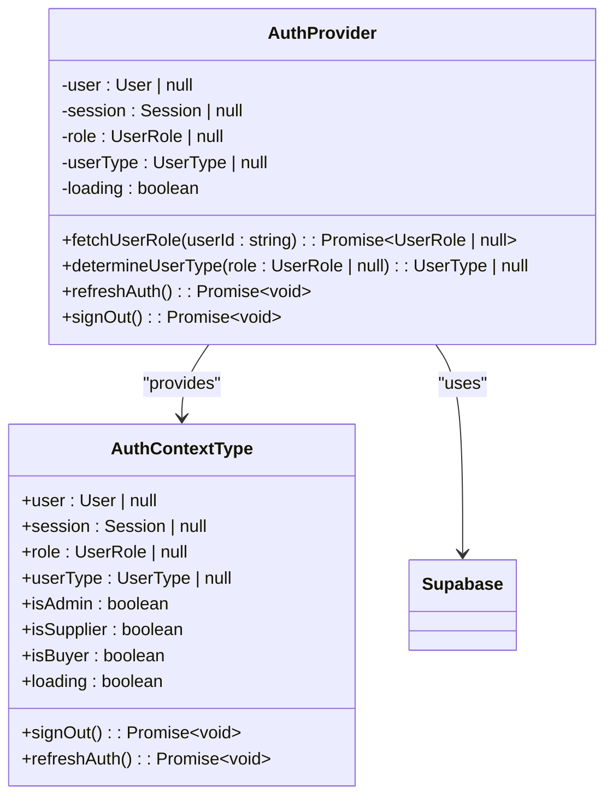
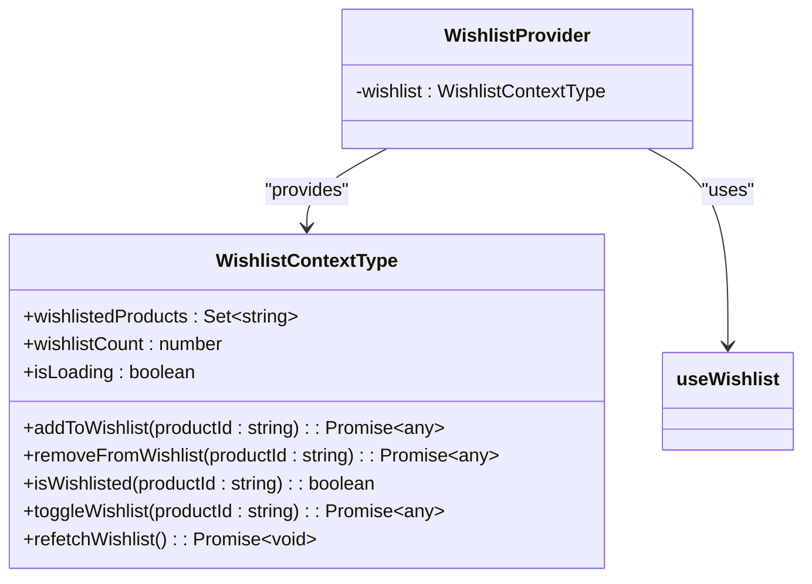
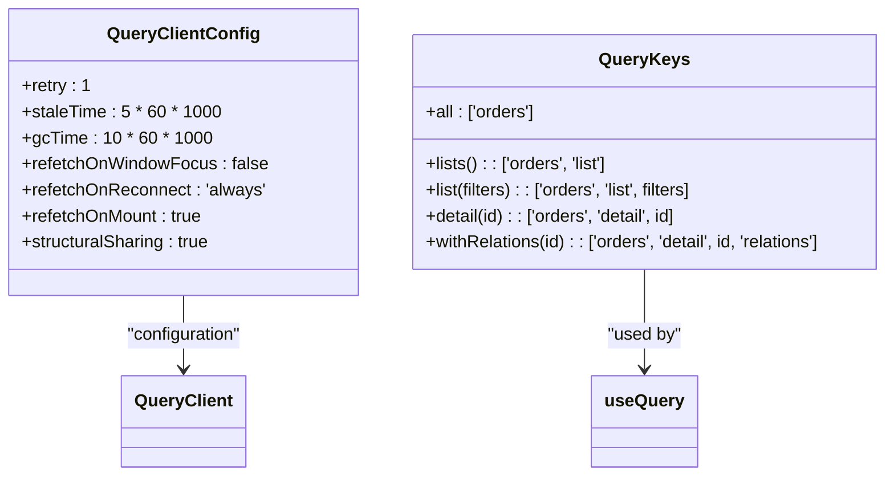
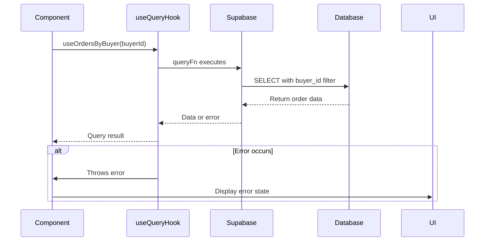
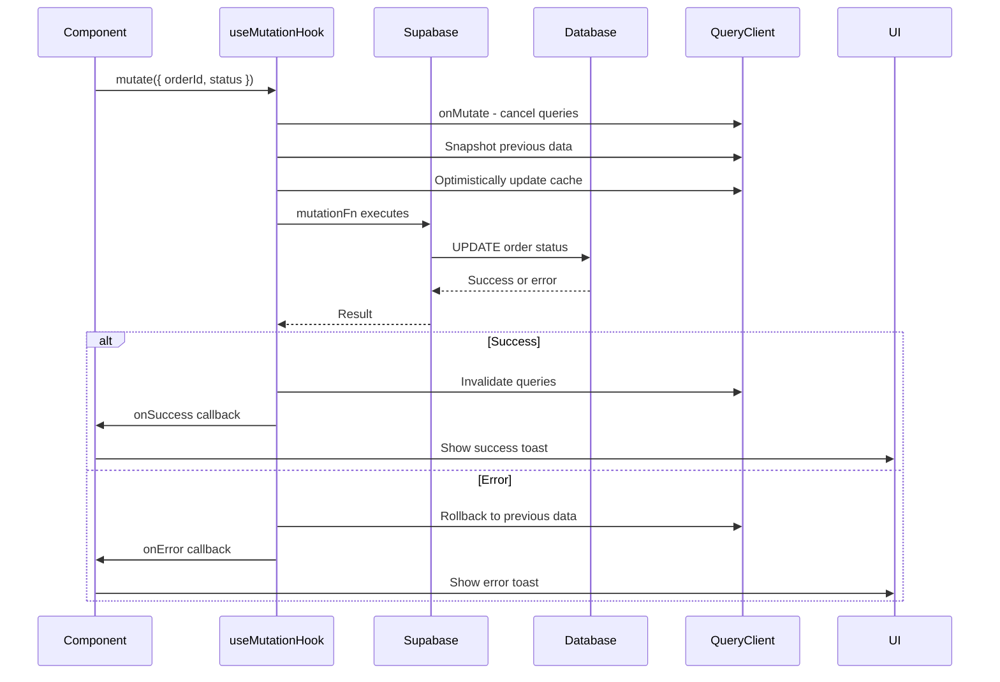
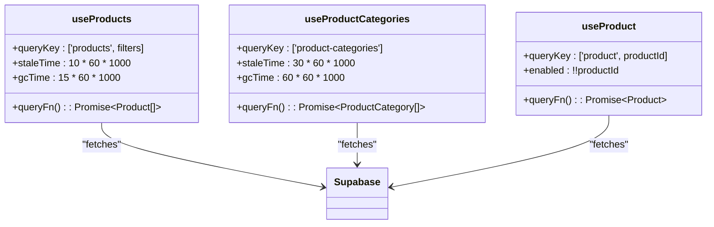
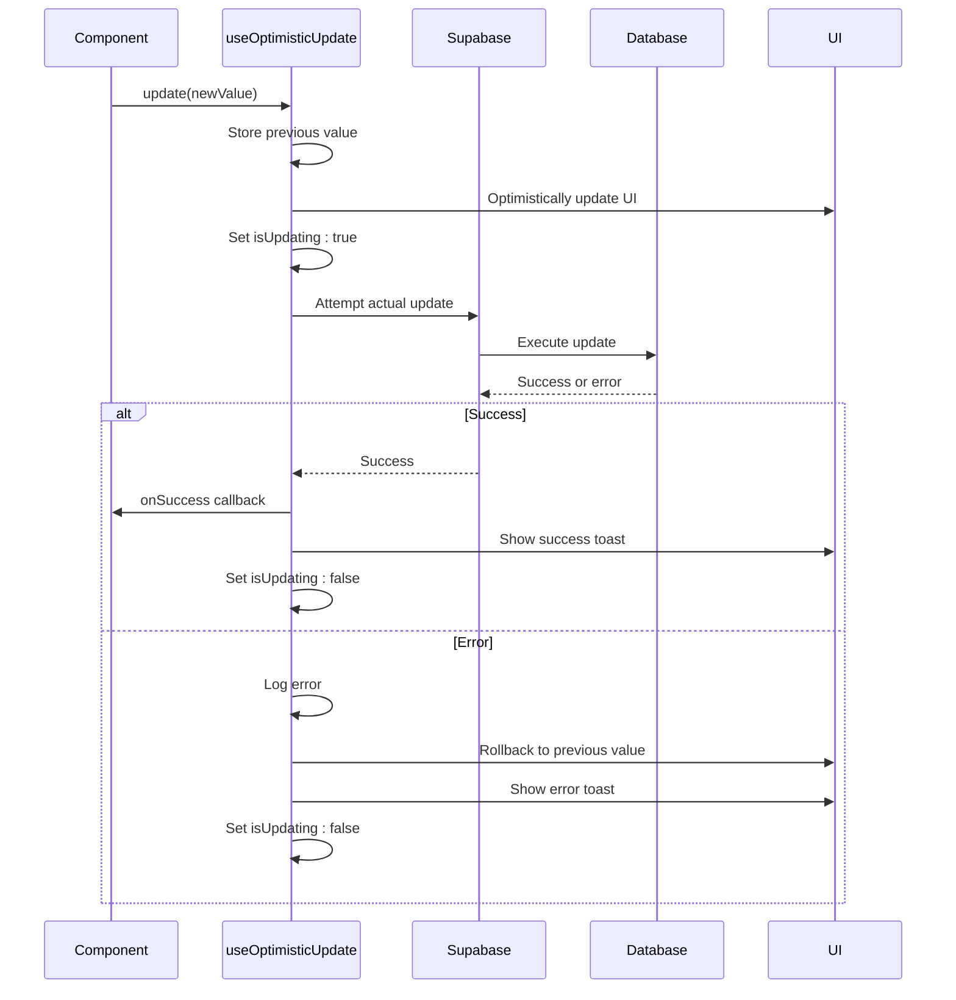
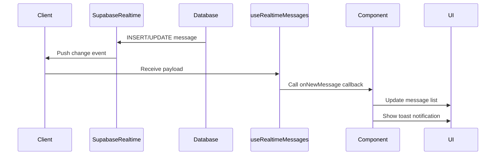
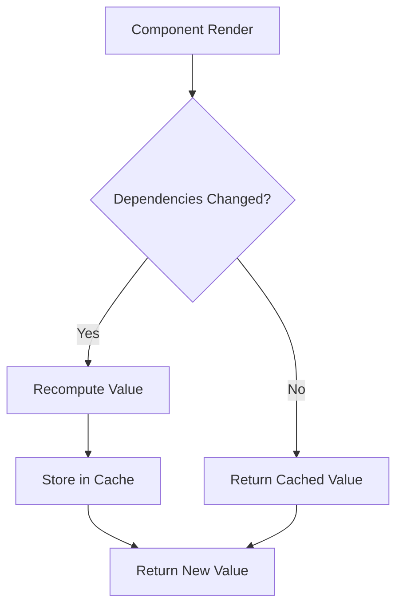

# State Management

<cite>
**Referenced Files in This Document**   
- [AuthContext.tsx](file://src/contexts/AuthContext.tsx)
- [WishlistContext.tsx](file://src/contexts/WishlistContext.tsx)
- [useOptimisticUpdate.ts](file://src/hooks/useOptimisticUpdate.ts)
- [useRealtimeMessages.ts](file://src/hooks/useRealtimeMessages.ts)
- [useQuotes.ts](file://src/hooks/useQuotes.ts)
- [useOrders.ts](file://src/hooks/queries/useOrders.ts)
- [useNotifications.ts](file://src/hooks/queries/useNotifications.ts)
- [useSuppliers.ts](file://src/hooks/queries/useSuppliers.ts)
- [useWishlist.ts](file://src/hooks/useWishlist.ts)
- [App.tsx](file://src/App.tsx)
- [useSupplierOrders.ts](file://src/hooks/useSupplierOrders.ts)
- [useProducts.ts](file://src/hooks/useProducts.ts)
</cite>

## Table of Contents
1. [Introduction](#introduction)
2. [Global State Management with React Context](#global-state-management-with-react-context)
3. [Server State Management with React Query](#server-state-management-with-react-query)
4. [Custom Hooks for Complex State Logic](#custom-hooks-for-complex-state-logic)
5. [Optimistic Updates and Real-time Synchronization](#optimistic-updates-and-real-time-synchronization)
6. [Performance Considerations](#performance-considerations)
7. [Troubleshooting Guide](#troubleshooting-guide)
8. [Conclusion](#conclusion)

## Introduction

The application implements a comprehensive state management strategy that combines React Context API for global client state, React Query for server state management, and custom hooks for encapsulating complex state logic. This documentation details the architecture and implementation of these state management patterns, focusing on authentication state propagation, wishlist persistence, data fetching, caching, synchronization, and mutation handling.

The system is designed to provide a seamless user experience with real-time updates, optimistic UI interactions, and efficient data synchronization across components. The state management strategy prioritizes performance, maintainability, and scalability while ensuring data consistency across the application.

**Section sources**
- [App.tsx](file://src/App.tsx#L1-L362)

## Global State Management with React Context

The application uses React Context API to manage global state across the component tree. Two primary context providers handle authentication and wishlist state, enabling access to this information from any component without prop drilling.

### Authentication Context

The `AuthContext` provides authentication state and user role information throughout the application. It manages user session data, role-based access, and authentication status using Supabase authentication.



**Diagram sources **
- [AuthContext.tsx](file://src/contexts/AuthContext.tsx#L17-L162)

The `AuthProvider` component initializes authentication state by checking the current session and user role from Supabase. It listens for authentication state changes and updates the context accordingly. The context exposes utility functions for signing out and refreshing authentication state.

User roles are fetched from the database and used to determine the user type (buyer, supplier, or admin), enabling role-based access control throughout the application. Computed properties like `isAdmin`, `isSupplier`, and `isBuyer` simplify conditional rendering based on user permissions.

**Section sources**
- [AuthContext.tsx](file://src/contexts/AuthContext.tsx#L1-L166)

### Wishlist Context

The `WishlistContext` manages product wishlist state, providing functionality to add, remove, and check wishlist status for products. It uses a custom hook to encapsulate the wishlist logic and persists data through Supabase functions.



**Diagram sources **
- [WishlistContext.tsx](file://src/contexts/WishlistContext.tsx#L4-L13)

The `WishlistProvider` wraps the application and provides wishlist functionality through the `useWishlist` custom hook. The context maintains a Set of wishlisted product IDs and provides methods to manipulate the wishlist with optimistic updates and error handling.

**Section sources**
- [WishlistContext.tsx](file://src/contexts/WishlistContext.tsx#L1-L34)
- [useWishlist.ts](file://src/hooks/useWishlist.ts#L1-L132)

## Server State Management with React Query

The application leverages React Query for server state management, handling data fetching, caching, synchronization, and mutations. This approach separates server state from client state, providing automatic caching, background updates, and simplified data synchronization.

### Query Architecture

React Query is configured with optimized settings for performance and user experience. The configuration includes appropriate stale times, garbage collection times, and refetch behaviors to balance data freshness with performance.



**Diagram sources **
- [App.tsx](file://src/App.tsx#L132-L148)
- [useOrders.ts](file://src/hooks/queries/useOrders.ts#L6-L17)

The query keys follow a structured naming convention that enables precise cache invalidation and data fetching. This pattern uses arrays to create unique, serializable query keys that support type safety and efficient cache management.

**Section sources**
- [App.tsx](file://src/App.tsx#L132-L148)

### Data Fetching Patterns

The application implements query hooks for various data entities, following a consistent pattern for data fetching and error handling. These hooks abstract the data access logic and provide a clean interface for components.



**Diagram sources **
- [useOrders.ts](file://src/hooks/queries/useOrders.ts#L43-L53)
- [useNotifications.ts](file://src/hooks/queries/useNotifications.ts#L12-L21)
- [useSuppliers.ts](file://src/hooks/queries/useSuppliers.ts#L15-L23)

The query hooks use Supabase client to fetch data from the database, handling errors and providing type-safe results. Each hook follows React Query's best practices, including proper query key structure, error handling, and data transformation.

**Section sources**
- [useOrders.ts](file://src/hooks/queries/useOrders.ts#L1-L152)
- [useNotifications.ts](file://src/hooks/queries/useNotifications.ts#L1-L135)
- [useSuppliers.ts](file://src/hooks/queries/useSuppliers.ts#L1-L49)

### Mutation Handling

Mutations are implemented using React Query's `useMutation` hook, providing a consistent pattern for data updates with automatic cache invalidation and error handling.



**Diagram sources **
- [useOrders.ts](file://src/hooks/queries/useOrders.ts#L110-L151)
- [useNotifications.ts](file://src/hooks/queries/useNotifications.ts#L24-L71)

The mutation hooks implement optimistic updates with automatic rollback on failure. They use the `onMutate` callback to cancel pending queries, snapshot previous data, and optimistically update the cache before the server request completes. On success, they invalidate relevant queries to ensure data consistency. On error, they rollback to the previous state and provide appropriate user feedback.

**Section sources**
- [useOrders.ts](file://src/hooks/queries/useOrders.ts#L110-L151)
- [useNotifications.ts](file://src/hooks/queries/useNotifications.ts#L24-L116)

## Custom Hooks for Complex State Logic

The application uses custom hooks to encapsulate complex state logic related to quotes, orders, suppliers, and notifications. These hooks provide reusable, composable functionality that can be shared across components.

### Quote Management

The quote management system provides hooks for creating, updating, and retrieving quotes and supplier quotes. These hooks handle the complex logic of quote submission and retrieval with proper error handling and user feedback.

```mermaid
classDiagram
class useQuotes {
+queryKey : ['quotes']
+queryFn() : Promise~Quote[]~
+enabled : true
}
class useQuote {
+queryKey : ['quote', quoteId]
+queryFn() : Promise~Quote~
+enabled : !!quoteId
}
class useCreateQuote {
+mutationFn(quoteData) : Promise~Quote~
+onSuccess() : invalidateQueries
+onError() : show error toast
}
class useUpdateQuote {
+mutationFn({ id, ...data }) : Promise~Quote~
+onSuccess() : invalidateQueries
+onError() : show error toast
}
class useSupplierQuotes {
+queryKey : ['supplier-quotes']
+queryFn() : Promise~SupplierQuote[]~
+enabled : authenticated
}
class useCreateSupplierQuote {
+mutationFn(quoteData) : Promise~SupplierQuote~
+onSuccess() : invalidateQueries
+onError() : show error toast
}
useQuotes --> Supabase : "fetches"
useQuote --> Supabase : "fetches"
useCreateQuote --> Supabase : "creates"
useUpdateQuote --> Supabase : "updates"
useSupplierQuotes --> Supabase : "fetches"
useCreateSupplierQuote --> Supabase : "creates"
```

**Diagram sources **
- [useQuotes.ts](file://src/hooks/useQuotes.ts#L55-L261)

The quote hooks handle both buyer and supplier perspectives, with appropriate filtering based on user authentication. The create and update mutations provide user feedback through toast notifications and automatically invalidate relevant queries to keep the UI in sync.

**Section sources**
- [useQuotes.ts](file://src/hooks/useQuotes.ts#L1-L261)

### Product Management

The product management system provides hooks for retrieving products, categories, and individual product details. These hooks include filtering and sorting capabilities to support the marketplace functionality.



**Diagram sources **
- [useProducts.ts](file://src/hooks/useProducts.ts#L53-L193)

The product hooks implement comprehensive filtering options including category, search, price range, MOQ, materials, and colors. They use full-text search capabilities and array operations to provide a rich filtering experience. The hooks are optimized with appropriate cache times based on how frequently the data changes.

**Section sources**
- [useProducts.ts](file://src/hooks/useProducts.ts#L1-L193)

## Optimistic Updates and Real-time Synchronization

The application implements optimistic updates and real-time data synchronization to provide a responsive user experience with immediate feedback and automatic data consistency.

### Optimistic Update Pattern

The `useOptimisticUpdate` custom hook provides a generic pattern for optimistic updates with automatic rollback on failure. This pattern improves perceived performance by immediately updating the UI before the server request completes.



**Diagram sources **
- [useOptimisticUpdate.ts](file://src/hooks/useOptimisticUpdate.ts#L16-L74)

The hook stores the previous value before the update, optimistically updates the UI, and attempts the server request. On success, it shows a success message. On failure, it automatically rolls back to the previous state and shows an error message, providing a seamless user experience.

**Section sources**
- [useOptimisticUpdate.ts](file://src/hooks/useOptimisticUpdate.ts#L1-L74)

### Real-time Data Synchronization

The application uses Supabase Realtime to provide real-time updates for messages and notifications. This ensures that users receive immediate updates when new data is available.



**Diagram sources **
- [useRealtimeMessages.ts](file://src/hooks/useRealtimeMessages.ts#L17-L61)
- [CommunicationCenter.tsx](file://src/components/shared/CommunicationCenter.tsx#L44-L88)

The `useRealtimeMessages` hook establishes a subscription to the messages table, listening for INSERT and UPDATE events. When a new message is received, it calls the provided callback function, allowing components to respond to real-time updates.

**Section sources**
- [useRealtimeMessages.ts](file://src/hooks/useRealtimeMessages.ts#L1-L61)
- [CommunicationCenter.tsx](file://src/components/shared/CommunicationCenter.tsx#L38-L131)

## Performance Considerations

The state management strategy incorporates several performance optimizations to ensure a responsive user experience and efficient resource utilization.

### Memoization and Selective Re-renders

The application uses React's memoization techniques to prevent unnecessary re-renders and computations. This includes using `useMemo` for expensive calculations and `useCallback` for function references.



**Diagram sources **
- [useProducts.ts](file://src/hooks/useProducts.ts#L54-L142)

The `useProducts` hook uses `useMemo` to memoize the query function, preventing unnecessary recreation on every render. This optimization is particularly important for hooks with multiple filter parameters that could trigger expensive recomputations.

**Section sources**
- [useProducts.ts](file://src/hooks/useProducts.ts#L54-L142)

### Cache Management

React Query's cache management is configured to balance data freshness with performance. The configuration includes appropriate stale times and garbage collection settings to optimize memory usage and network requests.

The cache uses structural sharing to minimize memory usage when updating queries. This means that when a query is updated, React Query attempts to reuse as much of the previous data structure as possible, reducing the memory footprint and improving performance.

**Section sources**
- [App.tsx](file://src/App.tsx#L132-L148)

### Garbage Collection of Stale Queries

The application configures React Query to automatically garbage collect stale queries after a specified period. This prevents memory leaks and ensures that unused query data is cleaned up appropriately.

The `gcTime` setting determines how long inactive queries are kept in memory before being garbage collected. This is set to 10 minutes for most queries, with longer durations for data that changes less frequently.

**Section sources**
- [App.tsx](file://src/App.tsx#L137-L138)

## Troubleshooting Guide

This section addresses common state-related issues and provides guidance for troubleshooting and resolution.

### Race Conditions

Race conditions can occur when multiple asynchronous operations compete to update the same state. The application mitigates this through several strategies:

1. **Query Cancellation**: React Query automatically cancels previous queries when a new one starts with the same query key.
2. **Optimistic Updates**: The optimistic update pattern reduces the window for race conditions by immediately updating the UI.
3. **Proper Dependencies**: Hooks use appropriate dependency arrays to ensure they only re-run when necessary.

When troubleshooting race conditions, check the query keys and dependencies to ensure they accurately reflect the data requirements.

**Section sources**
- [useOrders.ts](file://src/hooks/queries/useOrders.ts#L121-L122)
- [useNotifications.ts](file://src/hooks/queries/useNotifications.ts#L34-L37)

### Stale Closures

Stale closures can occur when hooks capture outdated values from previous renders. The application prevents this by:

1. **Using Callbacks**: Functions that depend on current state are wrapped in `useCallback` with proper dependencies.
2. **QueryClient Methods**: Using `queryClient.getQueryData()` and `setQueryData()` instead of relying on component state.
3. **Proper Dependencies**: Ensuring all dependencies are included in dependency arrays.

When encountering stale closure issues, verify that all dependencies are included in the appropriate hooks and that state updates are handled correctly.

**Section sources**
- [useOrders.ts](file://src/hooks/queries/useOrders.ts#L124-L125)
- [useNotifications.ts](file://src/hooks/queries/useNotifications.ts#L46-L49)

### Memory Leaks

Memory leaks can occur when subscriptions or event listeners are not properly cleaned up. The application prevents this by:

1. **Cleanup Functions**: Using cleanup functions in `useEffect` to unsubscribe from realtime channels.
2. **Automatic Cleanup**: Relying on React Query's automatic cache cleanup.
3. **Proper Unmounting**: Ensuring components clean up their resources when unmounted.

When troubleshooting memory leaks, check for missing cleanup functions, particularly in components that use realtime subscriptions or external libraries.

**Section sources**
- [useRealtimeMessages.ts](file://src/hooks/useRealtimeMessages.ts#L55-L57)
- [CommunicationCenter.tsx](file://src/components/shared/CommunicationCenter.tsx#L85-L87)

## Conclusion

The application's state management strategy effectively combines React Context API for global client state and React Query for server state management. This approach provides a robust foundation for handling authentication, wishlist persistence, data fetching, caching, and mutations.

The use of custom hooks encapsulates complex state logic, promoting reusability and maintainability. Optimistic updates and real-time synchronization enhance the user experience with immediate feedback and automatic data consistency.

Performance optimizations, including memoization, selective re-renders, and efficient cache management, ensure a responsive application. The troubleshooting guidance provides valuable insights for addressing common state-related issues.

This comprehensive state management strategy supports the application's scalability and maintainability while delivering a high-quality user experience.