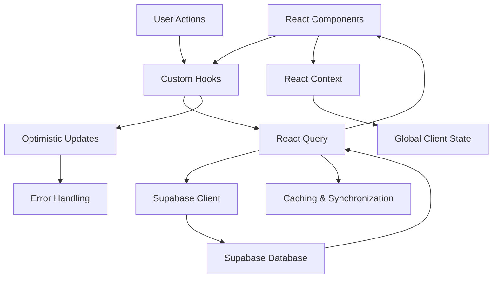
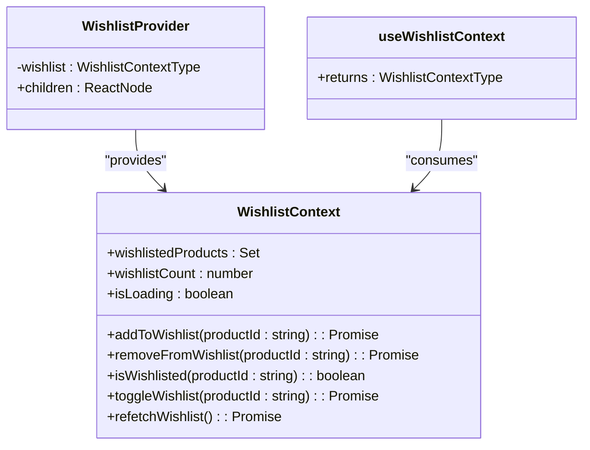
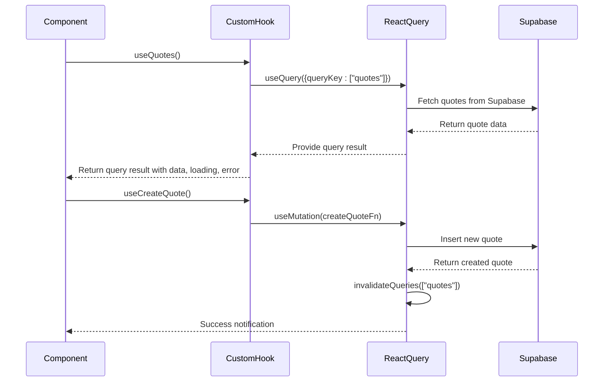
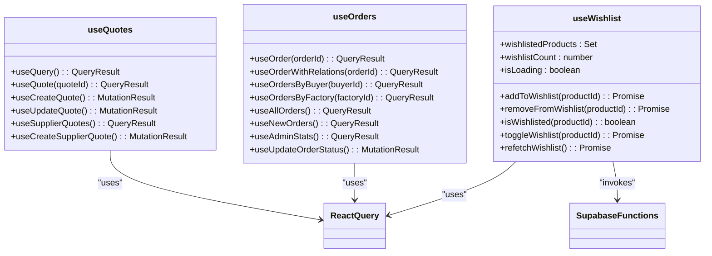
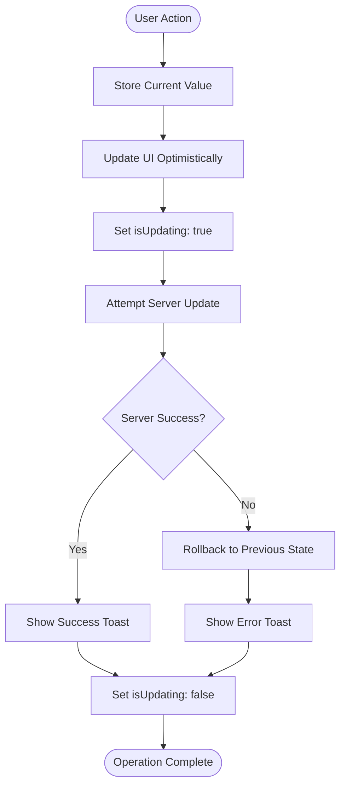

# State Management

<cite>
**Referenced Files in This Document**   
- [WishlistContext.tsx](file://src/contexts/WishlistContext.tsx)
- [useQuotes.ts](file://src/hooks/useQuotes.ts)
- [useOrders.ts](file://src/hooks/queries/useOrders.ts)
- [useOptimisticUpdate.ts](file://src/hooks/useOptimisticUpdate.ts)
- [useWishlist.ts](file://src/hooks/useWishlist.ts)
- [client.ts](file://src/integrations/supabase/client.ts)
- [supabaseHelpers.ts](file://src/lib/supabaseHelpers.ts)
- [use-toast.ts](file://src/hooks/use-toast.ts)
</cite>

## Table of Contents
1. [Introduction](#introduction)
2. [State Management Architecture](#state-management-architecture)
3. [Global State with React Context](#global-state-with-react-context)
4. [Server State Management with React Query](#server-state-management-with-react-query)
5. [Custom Hooks for Domain-Specific State](#custom-hooks-for-domain-specific-state)
6. [Optimistic Updates Implementation](#optimistic-updates-implementation)
7. [Error Handling and User Feedback](#error-handling-and-user-feedback)
8. [Component Consumption Patterns](#component-consumption-patterns)
9. [Conclusion](#conclusion)

## Introduction

The state management system in sleekapp-v100 implements a sophisticated multi-layered approach that combines React Context for global client state, custom hooks for domain-specific logic, and React Query for efficient server state synchronization with Supabase. This architecture effectively separates concerns between client state and server state while providing a seamless user experience through optimistic updates and real-time data synchronization. The system is designed to handle complex e-commerce workflows including quote management, order processing, supplier interactions, and user preferences.

**Section sources**
- [WishlistContext.tsx](file://src/contexts/WishlistContext.tsx)
- [useQuotes.ts](file://src/hooks/useQuotes.ts)
- [useOrders.ts](file://src/hooks/queries/useOrders.ts)

## State Management Architecture

The state management architecture in sleekapp-v100 follows a clear separation of concerns between different types of state. The system employs React Context for global client state that needs to be accessible across multiple components, React Query for server state management with Supabase, and custom hooks to encapsulate complex business logic. This multi-layered approach ensures that client state (such as UI preferences and temporary data) is managed separately from server state (persistent data stored in Supabase), while providing mechanisms for synchronization between the two.

**Diagram sources**
- [useQuotes.ts](file://src/hooks/useQuotes.ts)
- [useOrders.ts](file://src/hooks/queries/useOrders.ts)
- [client.ts](file://src/integrations/supabase/client.ts)

**Section sources**
- [useQuotes.ts](file://src/hooks/useQuotes.ts)
- [useOrders.ts](file://src/hooks/queries/useOrders.ts)
- [supabaseHelpers.ts](file://src/lib/supabaseHelpers.ts)

## Global State with React Context

The application implements global state management using React Context, specifically through the WishlistContext which manages user wishlist functionality across the application. The WishlistContext provides a centralized store for wishlist data that can be accessed by any component without prop drilling. It exposes essential functions including addToWishlist, removeFromWishlist, isWishlisted, and toggleWishlist, along with state variables like wishlistedProducts, wishlistCount, and isLoading.

The context is implemented following React best practices, with a provider component that wraps the application and makes the wishlist state available to all descendants. The useWishlistContext custom hook provides type-safe access to the context value, with validation to ensure it's only used within the appropriate provider. This pattern enables components to interact with the wishlist functionality without needing to manage the underlying state or data persistence logic.

**Diagram sources**
- [WishlistContext.tsx](file://src/contexts/WishlistContext.tsx)
- [useWishlist.ts](file://src/hooks/useWishlist.ts)

**Section sources**
- [WishlistContext.tsx](file://src/contexts/WishlistContext.tsx)
- [useWishlist.ts](file://src/hooks/useWishlist.ts)

## Server State Management with React Query

The application leverages React Query as the primary solution for server state management, providing efficient data synchronization with the Supabase backend. React Query handles data fetching, caching, and mutation operations for key entities such as quotes and orders. The useQuery hook is used to retrieve data from Supabase, automatically managing loading states, error handling, and cache invalidation.

For data mutations, the useMutation hook is employed to create, update, and delete records in the database. These mutations are configured with appropriate onSuccess and onError callbacks that handle cache invalidation and user feedback. The queryClient.invalidateQueries method is used to ensure that relevant queries are refetched after mutations, maintaining data consistency across the application.

The system implements query keys using a structured naming convention that enables precise cache management. For example, quote-related queries use keys like ["quotes"] and ["quote", quoteId], while order-related queries use a more sophisticated key structure defined in orderKeys with methods for different query types (detail, list, byBuyer, etc.).

**Diagram sources**
- [useQuotes.ts](file://src/hooks/useQuotes.ts)
- [useOrders.ts](file://src/hooks/queries/useOrders.ts)
- [client.ts](file://src/integrations/supabase/client.ts)

**Section sources**
- [useQuotes.ts](file://src/hooks/useQuotes.ts)
- [useOrders.ts](file://src/hooks/queries/useOrders.ts)
- [supabaseHelpers.ts](file://src/lib/supabaseHelpers.ts)

## Custom Hooks for Domain-Specific State

The application implements several custom hooks to encapsulate domain-specific state management logic, promoting code reuse and separation of concerns. The useQuotes hook provides comprehensive functionality for managing quote-related operations, including retrieving all quotes, fetching a specific quote by ID, creating new quotes, and updating existing quotes. Similarly, the useOrders hook manages order-related operations with functions for retrieving orders by buyer or factory, getting specific orders, and updating order status.

These custom hooks abstract away the complexity of interacting with Supabase, providing a clean API for components to use. They handle authentication state, construct appropriate database queries, and manage error conditions. The hooks also implement business logic such as determining whether to filter quotes by buyer ID or session ID based on authentication status.

The useWishlist hook demonstrates a more complex pattern that combines React Query with local state management to provide optimistic updates for wishlist operations. It uses useState to immediately update the UI when a product is added or removed from the wishlist, then attempts the server operation, rolling back the UI change if the server request fails.

**Diagram sources**
- [useQuotes.ts](file://src/hooks/useQuotes.ts)
- [useOrders.ts](file://src/hooks/queries/useOrders.ts)
- [useWishlist.ts](file://src/hooks/useWishlist.ts)

**Section sources**
- [useQuotes.ts](file://src/hooks/useQuotes.ts)
- [useOrders.ts](file://src/hooks/queries/useOrders.ts)
- [useWishlist.ts](file://src/hooks/useWishlist.ts)

## Optimistic Updates Implementation

The application implements optimistic updates through the useOptimisticUpdate custom hook and related specialized hooks like useOptimisticStageUpdate and useOptimisticOrderUpdate. This pattern enhances user experience by immediately reflecting changes in the UI before confirming the operation with the server, providing a more responsive interface.

The useOptimisticUpdate hook follows a standard optimistic update pattern: it stores the current value as a previous value, immediately updates the UI with the new value, attempts the server operation, and if the operation fails, rolls back the UI to the previous state. This approach is particularly effective for operations that are likely to succeed but need to account for potential network issues or validation errors.

For specific use cases like production stage updates and order updates, the application provides specialized hooks that encapsulate the domain-specific logic while following the same optimistic update pattern. These hooks manage the state updates, handle the Supabase operations, and provide appropriate user feedback through toast notifications.

**Diagram sources**
- [useOptimisticUpdate.ts](file://src/hooks/useOptimisticUpdate.ts)

**Section sources**
- [useOptimisticUpdate.ts](file://src/hooks/useOptimisticUpdate.ts)

## Error Handling and User Feedback

The state management system implements comprehensive error handling and user feedback mechanisms to ensure a robust user experience. All data operations include appropriate error handling, with user-facing feedback provided through toast notifications. The system uses the use-toast hook to display success and error messages, providing visual feedback for operations like creating quotes, updating orders, and modifying wishlist items.

Error handling is implemented at multiple levels: within the custom hooks that catch and process Supabase errors, in the optimistic update hooks that handle rollback on failure, and in the React Query mutations that define onError callbacks. The system distinguishes between different types of errors, providing specific error messages when possible while maintaining a consistent user experience.

The toast notification system is centralized through the use-toast hook, which manages the state of notifications and provides a clean API for components to display messages. Toasts are used to confirm successful operations and to alert users when operations fail, often including suggestions for resolution when appropriate.

**Section sources**
- [useQuotes.ts](file://src/hooks/useQuotes.ts)
- [useOrders.ts](file://src/hooks/queries/useOrders.ts)
- [useOptimisticUpdate.ts](file://src/hooks/useOptimisticUpdate.ts)
- [use-toast.ts](file://src/hooks/use-toast.ts)

## Component Consumption Patterns

Components in the application consume state through custom hooks rather than prop drilling, following React best practices for state management. This pattern promotes reusability and reduces coupling between components. For example, the QuoteHistory component uses the useQuotes hook to retrieve the user's quote history, while the Orders component uses order-related hooks to manage order data.

The WishlistContext enables components to access and modify wishlist state without requiring the state to be passed through multiple component layers. Components like ProductCard can independently manage their wishlist state by using the useWishlistContext hook, making them more self-contained and reusable.

This approach to state consumption creates a clean separation between presentation and logic, with components focusing on rendering UI based on the state provided by hooks, while the hooks manage the complexity of data fetching, mutation, and state synchronization.

**Section sources**
- [useQuotes.ts](file://src/hooks/useQuotes.ts)
- [useOrders.ts](file://src/hooks/queries/useOrders.ts)
- [WishlistContext.tsx](file://src/contexts/WishlistContext.tsx)

## Conclusion

The state management system in sleekapp-v100 effectively combines React Context, custom hooks, and React Query to create a robust and scalable architecture for managing both client and server state. By separating concerns between global client state (managed with Context) and server state (managed with React Query), the system provides a clear and maintainable approach to state management.

The implementation of custom hooks for domain-specific functionality encapsulates complex business logic and data operations, providing clean APIs for components to consume. The use of optimistic updates enhances user experience by providing immediate feedback, while comprehensive error handling ensures reliability.

This multi-layered approach enables the application to handle complex e-commerce workflows efficiently while maintaining code organization and scalability. The patterns established in this system can be extended to additional domains as the application grows, providing a solid foundation for future development.