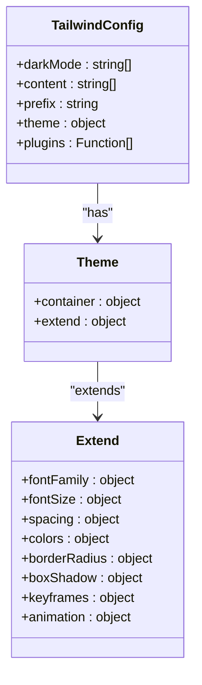
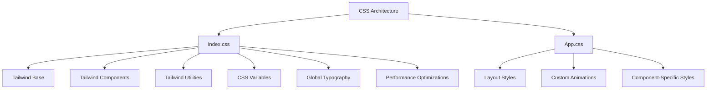
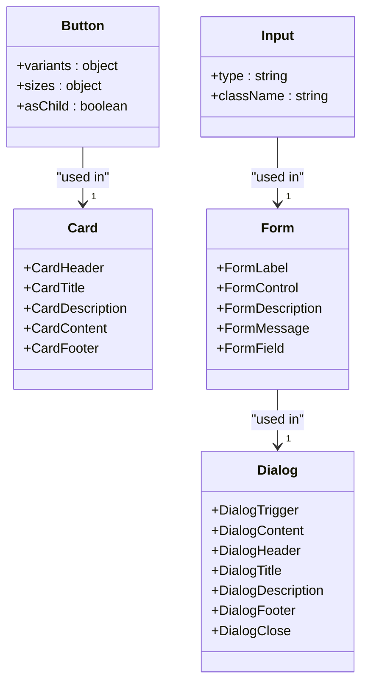
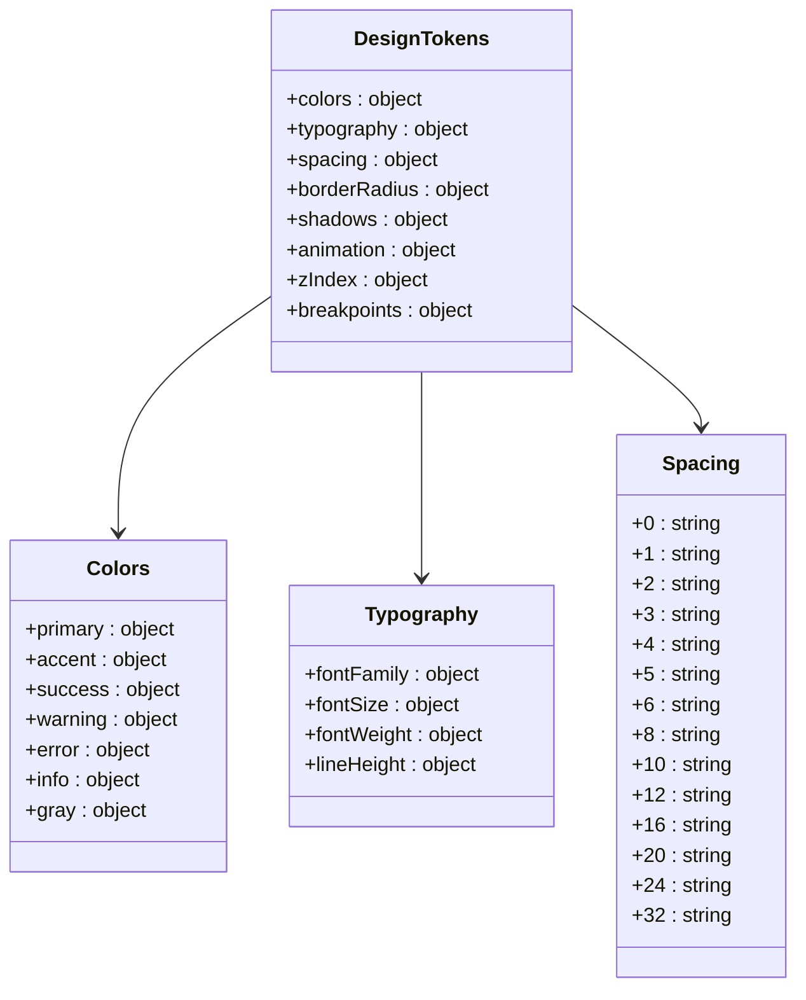
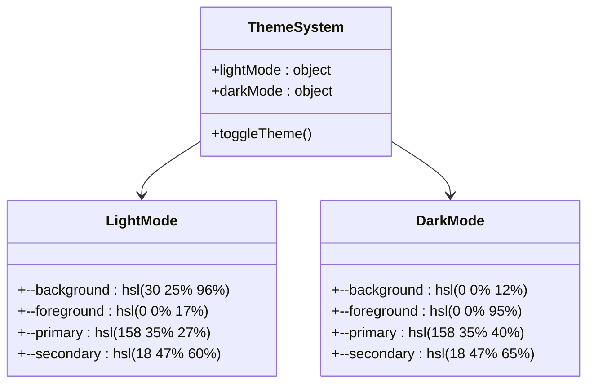

# Styling Strategy

<cite>
**Referenced Files in This Document**   
- [tailwind.config.ts](file://tailwind.config.ts)
- [src/lib/designTokens.ts](file://src/lib/designTokens.ts)
- [src/index.css](file://src/index.css)
- [src/App.css](file://src/App.css)
- [components.json](file://components.json)
- [src/components/ui/button.tsx](file://src/components/ui/button.tsx)
- [src/components/ui/card.tsx](file://src/components/ui/card.tsx)
- [src/components/ui/input.tsx](file://src/components/ui/input.tsx)
- [src/components/ui/form.tsx](file://src/components/ui/form.tsx)
- [src/components/ui/dialog.tsx](file://src/components/ui/dialog.tsx)
- [postcss.config.js](file://postcss.config.js)
</cite>

## Table of Contents
1. [Introduction](#introduction)
2. [Design System Overview](#design-system-overview)
3. [Tailwind CSS Configuration](#tailwind-css-configuration)
4. [CSS Architecture](#css-architecture)
5. [Component Library Implementation](#component-library-implementation)
6. [Design Tokens System](#design-tokens-system)
7. [Import Aliases Configuration](#import-aliases-configuration)
8. [Responsive Design Implementation](#responsive-design-implementation)
9. [Dark Mode Support](#dark-mode-support)
10. [Guidelines for New Components](#guidelines-for-new-components)
11. [Extending Tailwind Utilities](#extending-tailwind-utilities)
12. [Maintaining Visual Consistency](#maintaining-visual-consistency)

## Introduction
The sleekapp-v100 styling system implements a modern, scalable design architecture using the shadcn/ui component library with Tailwind CSS as the underlying utility framework. This documentation provides a comprehensive overview of the styling strategy, detailing how design tokens, component primitives, and CSS architecture work together to ensure visual consistency across the application. The system is designed to support responsive layouts, dark mode, and efficient component reuse while maintaining a clean, professional aesthetic aligned with the brand identity.

## Design System Overview
The styling system in sleekapp-v100 follows a component-driven architecture that combines the shadcn/ui design system with Tailwind CSS utilities. This approach provides a consistent, accessible, and maintainable UI across the application. The design system is built on several key principles: reusability through component primitives, consistency via design tokens, and scalability through a well-structured CSS architecture. The system supports both light and dark modes with carefully calibrated color palettes that maintain brand identity while ensuring accessibility.

**Section sources**
- [tailwind.config.ts](file://tailwind.config.ts)
- [src/lib/designTokens.ts](file://src/lib/designTokens.ts)
- [src/index.css](file://src/index.css)

## Tailwind CSS Configuration
The Tailwind CSS configuration in tailwind.config.ts extends the default theme with custom values for fonts, colors, spacing, and animations. The configuration uses CSS variables for colors, enabling dynamic theme switching between light and dark modes. Font families are defined for different text roles, with Open Sans and Lato for body text and Inter and Poppins for headings. Custom font sizes include responsive variants for mobile and desktop views. The theme extends spacing with semantic values like 'section' and 'component' to promote consistent layout patterns. Border radii are customized with specific values for buttons, cards, and images. The configuration also defines keyframes and animations for UI interactions, including accordion transitions, fade effects, and shimmer animations.

**Diagram sources**
- [tailwind.config.ts](file://tailwind.config.ts#L1-L196)

**Section sources**
- [tailwind.config.ts](file://tailwind.config.ts#L1-L196)

## CSS Architecture
The CSS architecture in sleekapp-v100 follows a layered approach with global styles in index.css and component-specific styles in App.css. The index.css file imports Tailwind's base, components, and utilities layers, then defines custom CSS variables for the design system. These variables use HSL color values to enable easy theme adjustments and ensure accessibility. The file establishes global typography rules, setting font families, colors, and line heights for the entire application. It also includes performance optimizations like will-change hints for animated elements and content-visibility for media elements. The App.css file contains application-specific styles, including layout rules for the root container and custom animations for the logo. This separation of concerns ensures that utility styles are managed by Tailwind while application-specific styles remain maintainable.

**Diagram sources**
- [src/index.css](file://src/index.css#L1-L193)
- [src/App.css](file://src/App.css#L1-L43)

**Section sources**
- [src/index.css](file://src/index.css#L1-L193)
- [src/App.css](file://src/App.css#L1-L43)

## Component Library Implementation
The component library in sleekapp-v100 is implemented in the src/components/ui/ directory, following the shadcn/ui pattern of building reusable UI primitives with Tailwind classes. Each component is designed as a composable primitive that can be used independently or combined with others to create complex interfaces. Components like Button, Card, Input, Form, and Dialog are built with accessibility in mind, using appropriate ARIA attributes and keyboard navigation. The Button component uses class-variance-authority (CVA) to define variants and sizes, allowing for consistent styling across different button types. The Card component provides structured slots for header, title, description, content, and footer, ensuring consistent card layouts throughout the application. Form components integrate with react-hook-form for robust form handling with validation and error messaging.

**Diagram sources**
- [src/components/ui/button.tsx](file://src/components/ui/button.tsx#L1-L51)
- [src/components/ui/card.tsx](file://src/components/ui/card.tsx#L1-L44)
- [src/components/ui/input.tsx](file://src/components/ui/input.tsx#L1-L23)
- [src/components/ui/form.tsx](file://src/components/ui/form.tsx#L1-L130)
- [src/components/ui/dialog.tsx](file://src/components/ui/dialog.tsx#L1-L96)

**Section sources**
- [src/components/ui/button.tsx](file://src/components/ui/button.tsx#L1-L51)
- [src/components/ui/card.tsx](file://src/components/ui/card.tsx#L1-L44)
- [src/components/ui/input.tsx](file://src/components/ui/input.tsx#L1-L23)
- [src/components/ui/form.tsx](file://src/components/ui/form.tsx#L1-L130)
- [src/components/ui/dialog.tsx](file://src/components/ui/dialog.tsx#L1-L96)

## Design Tokens System
The design tokens in src/lib/designTokens.ts provide a centralized source of truth for visual design properties across the application. These tokens define color palettes, typography scales, spacing systems, border radii, shadows, animations, and breakpoints in a structured, type-safe manner. The color system includes primary (LoopTrace™ Blue), accent (Energy Orange), and semantic colors for success, warning, error, and info states. The typography system defines font families, sizes, weights, and line heights with responsive considerations. The spacing system follows a 4px grid, ensuring consistent rhythm in layouts. Border radii and shadows are defined with semantic names that reflect their intended use cases. The tokens are exported as a const assertion to ensure type safety and prevent modification at runtime.

**Diagram sources**
- [src/lib/designTokens.ts](file://src/lib/designTokens.ts#L1-L205)

**Section sources**
- [src/lib/designTokens.ts](file://src/lib/designTokens.ts#L1-L205)

## Import Aliases Configuration
The aliases configuration in components.json enables clean, consistent import paths throughout the application. This configuration defines aliases for commonly used directories, reducing the complexity of relative imports and improving code readability. The "@/" prefix is used for all aliases, with "components" mapping to "@/components" for general components, "ui" mapping to "@/components/ui" for shadcn/ui primitives, "lib" mapping to "@/lib" for utilities and shared code, and "hooks" mapping to "@/hooks" for custom React hooks. This system works in conjunction with the TypeScript configuration to provide proper type checking and IDE support. The aliases make it easier to refactor code and move files without breaking imports, as components can always import from their logical location rather than their physical location in the directory structure.

**Section sources**
- [components.json](file://components.json#L1-L21)

## Responsive Design Implementation
The responsive design implementation in sleekapp-v100 uses a mobile-first approach with breakpoints defined in both the design tokens and Tailwind configuration. The system supports responsive typography with font sizes that adjust based on screen size, such as 'h1' and 'h1-mobile' variants. Components use Tailwind's responsive prefixes (sm:, md:, lg:, xl:) to adjust layout, spacing, and visibility across different screen sizes. The useIsMobile hook in src/hooks/use-mobile.tsx provides a React-friendly way to detect mobile devices and adjust behavior accordingly. The design system includes responsive spacing values like 'section' and 'section-mobile' to ensure consistent vertical rhythm across breakpoints. The container component centers content and limits maximum width, with a 2xl breakpoint set at 1400px to accommodate larger screens.

**Section sources**
- [tailwind.config.ts](file://tailwind.config.ts#L5-L17)
- [src/lib/designTokens.ts](file://src/lib/designTokens.ts#L194-L200)
- [src/hooks/use-mobile.tsx](file://src/hooks/use-mobile.tsx#L1-L32)

## Dark Mode Support
Dark mode support is implemented through Tailwind's class-based dark mode strategy, with the darkMode setting configured as "class" in tailwind.config.ts. This approach adds a 'dark' class to the document when dark mode is active, allowing CSS variables to be overridden for dark theme values. The color system in index.css defines both light and dark mode values for all semantic colors, ensuring a cohesive dark theme that maintains brand identity. The design carefully balances contrast and readability, with dark mode using a deep charcoal background and light text for optimal legibility. Interactive elements like buttons and cards have hover states that provide visual feedback in both light and dark modes. The transition between modes is smooth, with no flicker or layout shift, thanks to the use of CSS variables that are updated atomically.

**Diagram sources**
- [tailwind.config.ts](file://tailwind.config.ts#L4-L5)
- [src/index.css](file://src/index.css#L74-L124)

**Section sources**
- [tailwind.config.ts](file://tailwind.config.ts#L4-L5)
- [src/index.css](file://src/index.css#L74-L124)

## Guidelines for New Components
When creating new components in sleekapp-v100, developers should follow established patterns to maintain consistency with the design system. New components should be placed in appropriate subdirectories within src/components/ based on their functionality. Components should use the existing design tokens for colors, spacing, and typography rather than hardcoding values. For UI primitives, the shadcn/ui pattern should be followed, using Tailwind classes for styling and composing existing components when possible. Components should be designed to be composable, with clear props and default values. Accessibility should be prioritized, with appropriate ARIA attributes and keyboard navigation support. Components should support both light and dark modes through the use of CSS variables. Documentation should be included in the form of JSDoc comments that describe props and usage.

**Section sources**
- [src/components/ui/button.tsx](file://src/components/ui/button.tsx#L1-L51)
- [src/components/ui/card.tsx](file://src/components/ui/card.tsx#L1-L44)

## Extending Tailwind Utilities
The Tailwind configuration can be extended to add custom utilities that are not covered by the default set. The theme.extend property in tailwind.config.ts allows for the addition of custom values for existing utilities like colors, spacing, and typography. For more complex customizations, Tailwind plugins can be used, with tailwindcss-animate already included for animation utilities. Custom utilities should be added sparingly and only when they represent a consistent design pattern across the application. When creating custom utilities, semantic names should be used that reflect the purpose rather than the visual effect. The postcss.config.js file configures PostCSS with Tailwind and Autoprefixer, ensuring that generated CSS is compatible with target browsers. Custom utilities should be documented in the design system documentation to ensure consistent usage.

**Section sources**
- [tailwind.config.ts](file://tailwind.config.ts#L18-L192)
- [postcss.config.js](file://postcss.config.js#L1-L7)

## Maintaining Visual Consistency
Visual consistency in sleekapp-v100 is maintained through a combination of design tokens, component primitives, and strict adherence to the design system guidelines. The designTokens.ts file serves as the single source of truth for all visual properties, ensuring that colors, spacing, and typography are consistent across components. The shadcn/ui component library provides pre-styled primitives that enforce consistent patterns for common UI elements. The Tailwind configuration extends the default theme with custom values that reflect the brand identity. CSS variables in index.css enable dynamic theme switching while maintaining consistency between light and dark modes. Regular code reviews and design system audits help ensure that new components adhere to established patterns and do not introduce visual inconsistencies.

**Section sources**
- [src/lib/designTokens.ts](file://src/lib/designTokens.ts#L1-L205)
- [tailwind.config.ts](file://tailwind.config.ts#L10-L192)
- [src/index.css](file://src/index.css#L9-L124)