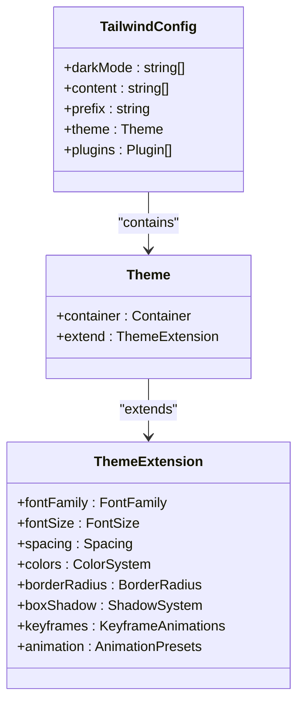
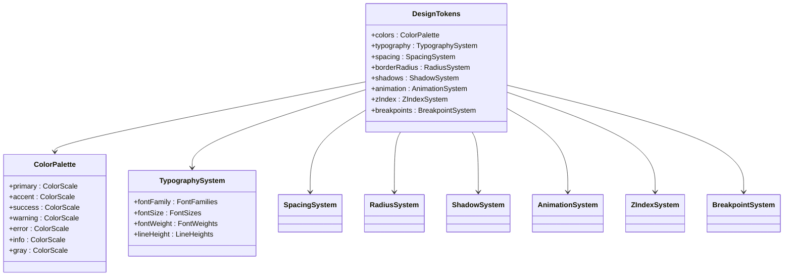
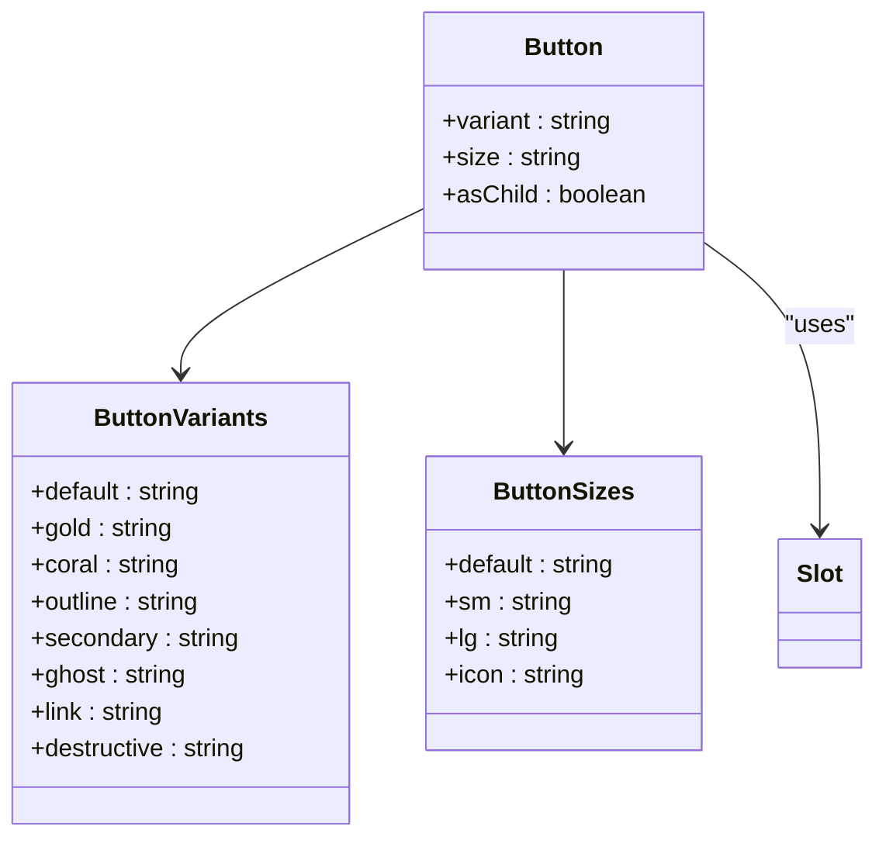
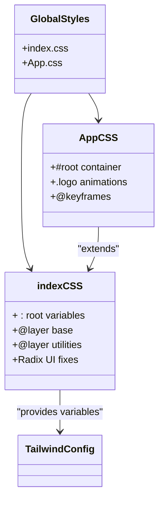
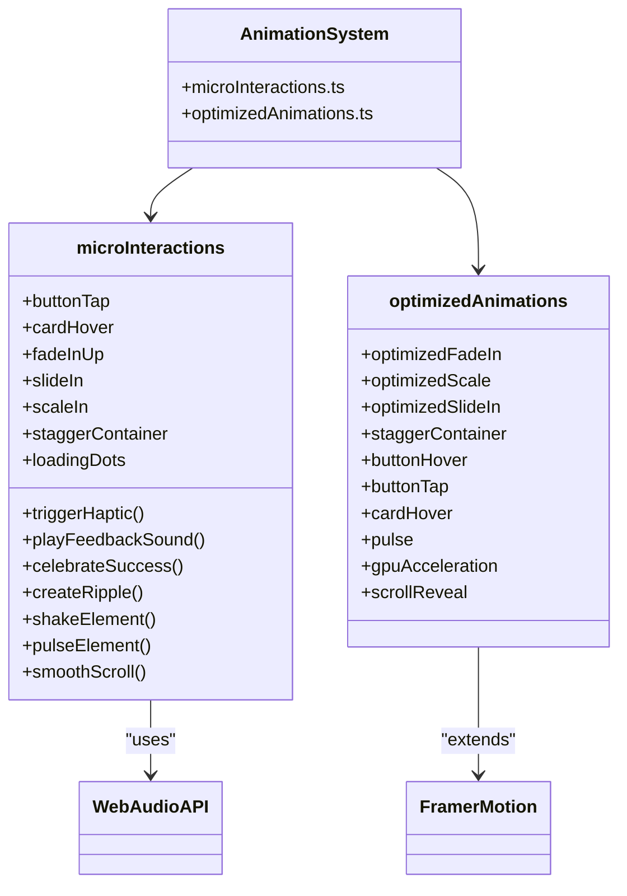
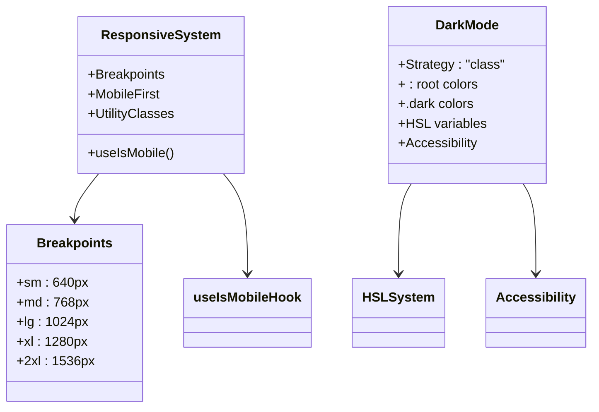
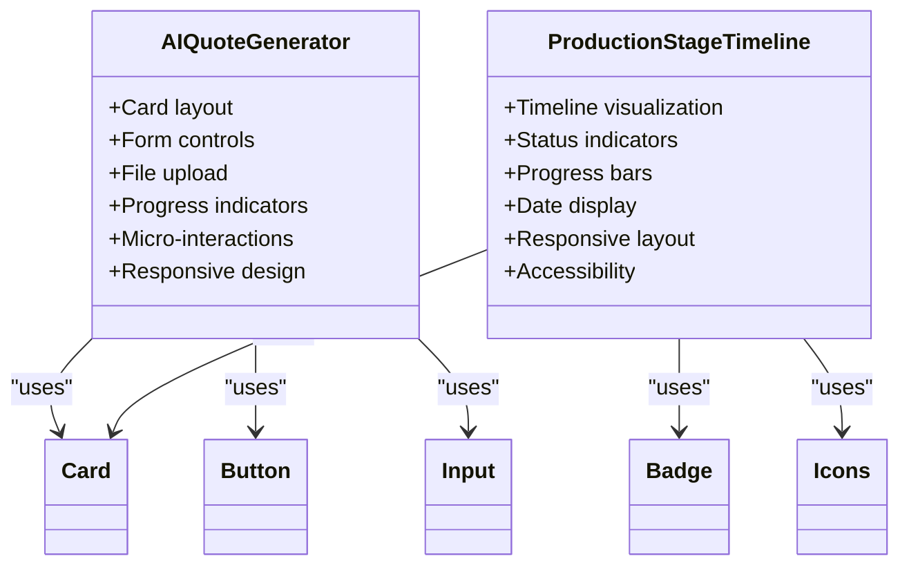
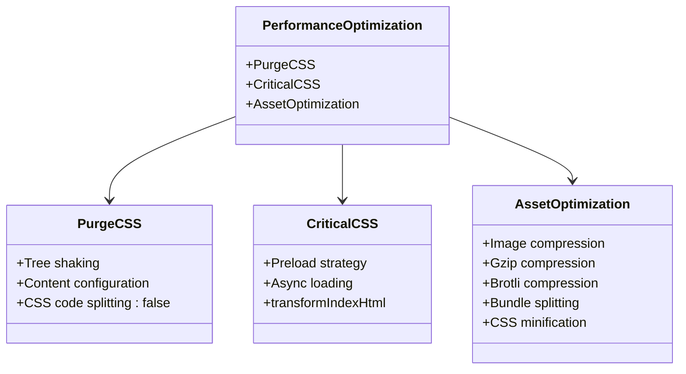

# Styling Strategy

<cite>
**Referenced Files in This Document**   
- [tailwind.config.ts](file://tailwind.config.ts)
- [designTokens.ts](file://src/lib/designTokens.ts)
- [index.css](file://src/index.css)
- [App.css](file://src/App.css)
- [button.tsx](file://src/components/ui/button.tsx)
- [card.tsx](file://src/components/ui/card.tsx)
- [microInteractions.ts](file://src/lib/microInteractions.ts)
- [optimizedAnimations.ts](file://src/lib/optimizedAnimations.ts)
- [AIQuoteGenerator.tsx](file://src/components/AIQuoteGenerator.tsx)
- [ProductionStageTimeline.tsx](file://src/components/production/ProductionStageTimeline.tsx)
- [vite.config.ts](file://vite.config.ts)
- [components.json](file://components.json)
</cite>

## Table of Contents
1. [Introduction](#introduction)
2. [Utility-First Approach with Tailwind CSS](#utility-first-approach-with-tailwind-css)
3. [Design Tokens and Theme Configuration](#design-tokens-and-theme-configuration)
4. [shadcn/ui Component Integration](#shadcnui-component-integration)
5. [Global Styles and CSS Modules](#global-styles-and-css-modules)
6. [Micro-Interactions and Animation Strategy](#micro-interactions-and-animation-strategy)
7. [Responsive Design and Dark Mode](#responsive-design-and-dark-mode)
8. [Complex Component Styling Examples](#complex-component-styling-examples)
9. [Performance Optimization Techniques](#performance-optimization-techniques)
10. [Accessibility Considerations](#accessibility-considerations)

## Introduction
The SleekApp styling architecture combines a utility-first approach with Tailwind CSS, a comprehensive design token system, and strategic component-level styling to create a cohesive, performant, and accessible user interface. The system is designed to balance developer efficiency with design consistency while maintaining high performance standards through optimized animations and critical CSS loading.

**Section sources**
- [tailwind.config.ts](file://tailwind.config.ts)
- [designTokens.ts](file://src/lib/designTokens.ts)
- [index.css](file://src/index.css)

## Utility-First Approach with Tailwind CSS
The application implements a utility-first CSS strategy using Tailwind CSS, configured through `tailwind.config.ts`. This approach enables rapid UI development by composing styles from atomic utility classes directly in JSX, reducing the need for custom CSS files.

The configuration extends Tailwind's default theme with custom values for typography, spacing, colors, and animations. Key features include:

- **Custom Font Families**: Defined Open Sans and Lato for body text, Inter and Poppins for headings, and Crimson Text for accent typography
- **Responsive Typography**: Custom font sizes with mobile-specific variants (e.g., `h1-mobile`, `h2-mobile`)
- **Semantic Spacing**: Named spacing values like `section` (80px) and `component` (24px) for consistent layout
- **HSL Color System**: Colors defined using HSL variables for easy theme switching and dark mode support
- **Custom Border Radius**: Multiple border radius values including `button` (8px) and `card` (12px)
- **Elevation System**: Custom box shadows for cards and buttons with hover states

The configuration also includes custom keyframe animations for common UI patterns like accordion transitions, fade effects, and loading states, which are then referenced in the `animation` section for easy application.

**Diagram sources **
- [tailwind.config.ts](file://tailwind.config.ts#L1-L196)

**Section sources**
- [tailwind.config.ts](file://tailwind.config.ts#L1-L196)
- [components.json](file://components.json#L1-L21)

## Design Tokens and Theme Configuration
The application implements a comprehensive design token system in `designTokens.ts`, which serves as the single source of truth for visual design properties. This token-based approach ensures consistency across the application and facilitates theme management.

The design tokens include:

- **Color System**: Structured color palettes for primary (LoopTrace™ Blue), accent (Energy Orange), semantic colors (success, warning, error, info), and a modern gray scale
- **Typography**: Font families, sizes, weights, and line heights following a consistent scale
- **Spacing**: 4px grid-based spacing system with values from 4px to 128px
- **Border Radius**: Multiple radius values from 4px to 32px plus full circle
- **Shadows**: Elevation system with 11 shadow levels from xs to 2xl
- **Animation**: Duration and easing presets for consistent motion design
- **Z-Index**: Layering system for UI elements
- **Breakpoints**: Mobile-first responsive design breakpoints

The tokens are exported as a const object with individual groups also exported for convenience, enabling both comprehensive and granular imports throughout the codebase.

**Diagram sources **
- [designTokens.ts](file://src/lib/designTokens.ts#L1-L205)

**Section sources**
- [designTokens.ts](file://src/lib/designTokens.ts#L1-L205)
- [index.css](file://src/index.css#L9-L124)

## shadcn/ui Component Integration
The application leverages shadcn/ui components as a foundation for its UI, extending and customizing them to match the brand identity. The integration is configured in `components.json`, which specifies the project's styling approach and aliases.

Key aspects of the shadcn/ui integration include:

- **Default Style**: Using the default styling approach rather than CSS variables
- **TypeScript Support**: Full TypeScript integration with .tsx files
- **Path Aliases**: Configuration of aliases for easier imports (e.g., "@/components/ui")
- **Tailwind Configuration**: Reference to the custom tailwind.config.ts and index.css

The shadcn/ui components are extended through utility classes and custom variants. For example, the Button component defines multiple variants (default, gold, coral, outline, secondary, ghost, link, destructive) and sizes (default, sm, lg, icon), each with specific utility class combinations for visual styling.

**Diagram sources **
- [components.json](file://components.json#L1-L21)
- [button.tsx](file://src/components/ui/button.tsx#L1-L51)

**Section sources**
- [components.json](file://components.json#L1-L21)
- [button.tsx](file://src/components/ui/button.tsx#L1-L51)
- [card.tsx](file://src/components/ui/card.tsx#L1-L44)

## Global Styles and CSS Modules
The styling architecture combines Tailwind's utility classes with targeted global CSS for base resets, performance optimizations, and complex styling patterns that are difficult to achieve with utilities alone.

The global styles are organized across two main files:

- **index.css**: Contains the core design system definitions using CSS custom properties (HSL colors, gradients, shadows) and Tailwind's `@layer` directives
- **App.css**: Contains application-specific styles not covered by Tailwind utilities

Key features of the global styling approach:

- **HSL Color System**: All colors defined as HSL variables in `:root` for easy theme switching
- **Dark Mode Support**: Complete dark mode theme with warm, accessible colors
- **Base Layer Styling**: Global typography settings, font families, and element defaults
- **Performance Optimizations**: GPU acceleration hints and content visibility settings
- **Radix UI Fixes**: Critical fixes for NavigationMenu component styling issues

The global styles work in concert with Tailwind's utility classes, with the CSS variables defined in index.css being referenced in the Tailwind configuration for consistent theming.

**Diagram sources **
- [index.css](file://src/index.css#L1-L193)
- [App.css](file://src/App.css#L1-L43)

**Section sources**
- [index.css](file://src/index.css#L1-L193)
- [App.css](file://src/App.css#L1-L43)

## Micro-Interactions and Animation Strategy
The application implements a sophisticated animation system using Framer Motion and optimized CSS transitions to create engaging user experiences while maintaining 60fps performance.

The animation strategy is implemented through two key files:

- **microInteractions.ts**: Contains a library of delightful UI feedback patterns including haptic feedback simulation, button press animations, success celebrations, and loading micro-animations
- **optimizedAnimations.ts**: Contains GPU-accelerated animation utilities that use transform and opacity for optimal performance

Key animation features include:

- **Haptic Feedback**: Simulated through visual pulse effects and subtle audio feedback using Web Audio API
- **Framer Motion Variants**: Predefined animation variants for common interactions (button tap, card hover, fade in, slide in)
- **GPU Acceleration**: Strategic use of `transform: translateZ(0)` and `will-change` to promote elements to their own GPU layer
- **Performance Optimization**: Animations restricted to transform and opacity properties to avoid layout thrashing
- **Staggered Animations**: Container variants that animate children with staggered delays
- **Scroll Reveal**: IntersectionObserver-based animations that trigger when elements enter the viewport

The system also includes custom JavaScript animations for specific effects like confetti celebrations, ripple effects, and shake animations for form validation errors.

**Diagram sources **
- [microInteractions.ts](file://src/lib/microInteractions.ts#L1-L339)
- [optimizedAnimations.ts](file://src/lib/optimizedAnimations.ts#L1-L158)

**Section sources**
- [microInteractions.ts](file://src/lib/microInteractions.ts#L1-L339)
- [optimizedAnimations.ts](file://src/lib/optimizedAnimations.ts#L1-L158)

## Responsive Design and Dark Mode
The application implements a comprehensive responsive design system with mobile-first breakpoints and full dark mode support.

### Responsive Design
The responsive system is built on a mobile-first approach with breakpoints defined in both the design tokens and Tailwind configuration:

- **sm**: 640px
- **md**: 768px
- **lg**: 1024px
- **xl**: 1280px
- **2xl**: 1536px

The system uses utility classes for responsive styling (e.g., `md:text-h3`, `lg:grid-cols-4`) and includes mobile-specific typography variants (e.g., `h1-mobile`, `h2-mobile`) for optimal readability on smaller screens.

A custom `useIsMobile` hook provides programmatic access to mobile detection based on the 768px breakpoint, enabling conditional rendering and behavior changes for mobile devices.

### Dark Mode
Dark mode is implemented using Tailwind's class-based dark mode strategy with `darkMode: ["class"]` in the configuration. The color system is defined using CSS custom properties in `:root` and `.dark`, allowing for seamless theme switching.

The dark mode theme maintains the brand's warmth with carefully selected dark background and text colors that ensure accessibility while providing a comfortable viewing experience in low-light environments.

**Diagram sources **
- [designTokens.ts](file://src/lib/designTokens.ts#L194-L200)
- [tailwind.config.ts](file://tailwind.config.ts#L4-L5)
- [index.css](file://src/index.css#L9-L124)
- [use-mobile.tsx](file://src/hooks/use-mobile.tsx#L1-L31)

**Section sources**
- [designTokens.ts](file://src/lib/designTokens.ts#L194-L200)
- [tailwind.config.ts](file://tailwind.config.ts#L4-L5)
- [index.css](file://src/index.css#L9-L124)
- [use-mobile.tsx](file://src/hooks/use-mobile.tsx#L1-L31)

## Complex Component Styling Examples
The styling architecture is demonstrated through complex components that showcase the integration of utility classes, custom styling, and animations.

### AIQuoteGenerator Interface
The AIQuoteGenerator component implements a sophisticated styling approach that combines:

- **Card-based Layout**: Using the shadcn/ui Card component with custom padding and shadow
- **Form Controls**: Consistent styling of inputs, selects, and textareas with appropriate spacing
- **File Upload**: Custom styling for file upload with preview thumbnails
- **Progress Indicators**: Animated loading progress during AI processing
- **Micro-Interactions**: Ripple effects on buttons and subtle animations on state changes
- **Responsive Design**: Mobile-optimized layout with appropriate touch targets

The component uses utility classes for layout and spacing while leveraging the design token system for consistent colors and typography.

### ProductionStageTimeline
The ProductionStageTimeline component demonstrates advanced styling techniques for data visualization:

- **Timeline Visualization**: Custom CSS for the vertical timeline with connecting lines
- **Status Indicators**: Color-coded icons and badges for different production stages
- **Progress Bars**: Animated progress bars for in-progress stages
- **Date Display**: Consistent formatting of dates with appropriate typography
- **Responsive Layout**: Adapts from vertical timeline on mobile to more compact layout on larger screens
- **Accessibility**: Proper contrast ratios and semantic HTML structure

The component uses a combination of utility classes for layout and custom CSS for the timeline visualization, with animations for state changes.

**Diagram sources **
- [AIQuoteGenerator.tsx](file://src/components/AIQuoteGenerator.tsx#L1-L200)
- [ProductionStageTimeline.tsx](file://src/components/production/ProductionStageTimeline.tsx#L1-L183)

**Section sources**
- [AIQuoteGenerator.tsx](file://src/components/AIQuoteGenerator.tsx#L1-L200)
- [ProductionStageTimeline.tsx](file://src/components/production/ProductionStageTimeline.tsx#L1-L183)

## Performance Optimization Techniques
The styling architecture incorporates several performance optimization techniques to ensure fast load times and smooth interactions.

### PurgeCSS Configuration
The application leverages Vite's build optimizations to eliminate unused CSS:

- **Tree Shaking**: Unused CSS classes are removed during the build process
- **Content Configuration**: Tailwind's content array includes all source files to ensure used classes are preserved
- **CSS Code Splitting**: Disabled to create a single CSS file for better caching

### Critical CSS Extraction
The build process implements critical CSS extraction and async loading:

- **Preload Strategy**: CSS is preloaded and then applied asynchronously to prevent render blocking
- **Critical CSS**: Essential styles are inlined or loaded first
- **Async Loading**: Non-critical CSS is loaded after initial render

This is implemented in vite.config.ts through a transformIndexHtml plugin that converts CSS links to preload links with onload handlers.

### Asset Optimization
Additional performance optimizations include:

- **Image Compression**: JPEG, PNG, and SVG images are optimized
- **Gzip and Brotli Compression**: Production builds are compressed with both algorithms
- **Bundle Splitting**: Code is split into logical chunks for lazy loading
- **Minification**: CSS is minified using lightningcss for faster processing

**Diagram sources **
- [vite.config.ts](file://vite.config.ts#L1-L200)
- [init-critical.js](file://public/init-critical.js#L1-L50)

**Section sources**
- [vite.config.ts](file://vite.config.ts#L1-L200)
- [init-critical.js](file://public/init-critical.js#L1-L50)

## Accessibility Considerations
The styling system incorporates several accessibility features to ensure the application is usable by all users:

- **Color Contrast**: All color combinations meet WCAG 2.1 AA contrast requirements
- **Focus States**: Visible focus indicators for keyboard navigation
- **Semantic HTML**: Proper use of HTML elements for screen reader compatibility
- **Reduced Motion**: Respects `prefers-reduced-motion` media query
- **Text Readability**: Appropriate font sizes, line heights, and spacing
- **Keyboard Navigation**: Interactive elements are keyboard accessible
- **ARIA Attributes**: Proper use of ARIA roles and properties

The dark mode implementation specifically considers accessibility by maintaining sufficient contrast between text and background colors in both light and dark themes.

**Section sources**
- [index.css](file://src/index.css#L30-L124)
- [tailwind.config.ts](file://tailwind.config.ts#L4-L5)
- [button.tsx](file://src/components/ui/button.tsx#L8-L21)