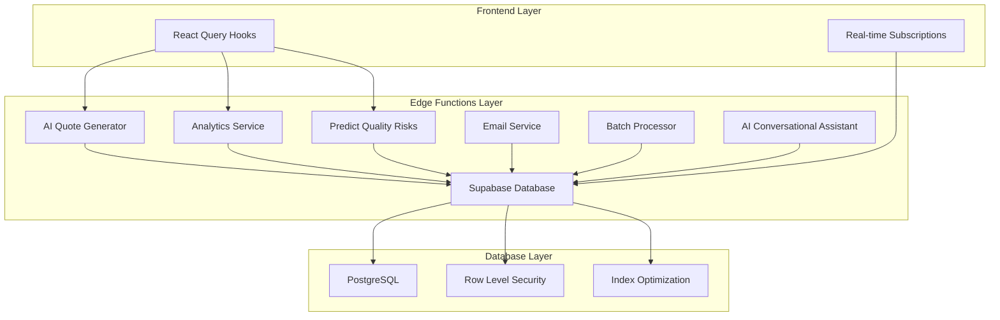

# Backend Performance Considerations

<cite>
**Referenced Files in This Document**
- [useOrders.ts](file://src/hooks/queries/useOrders.ts)
- [useSuppliers.ts](file://src/hooks/queries/useSuppliers.ts)
- [supabaseHelpers.ts](file://src/lib/supabaseHelpers.ts)
- [analytics-service/index.ts](file://supabase/functions/analytics-service/index.ts)
- [predict-quality-risks/index.ts](file://supabase/functions/predict-quality-risks/index.ts)
- [ai-quote-generator/index.ts](file://supabase/functions/ai-quote-generator/index.ts)
- [client.ts](file://src/integrations/supabase/client.ts)
- [performanceMonitor.ts](file://src/lib/performanceMonitor.ts)
- [logger.ts](file://supabase/functions/_shared/logger.ts)
- [securityLogger.ts](file://supabase/functions/shared/securityLogger.ts)
- [log-ai-cost/index.ts](file://supabase/functions/log-ai-cost/index.ts)
- [useRealtimeMessages.ts](file://src/hooks/useRealtimeMessages.ts)
- [20251115150759_remix_migration_from_pg_dump.sql](file://supabase/migrations/20251115150759_remix_migration_from_pg_dump.sql)
- [20251120233928_2016afb8-d720-4858-9e12-7fb4ebbd5de0.sql](file://supabase/migrations/20251120233928_2016afb8-d720-4858-9e12-7fb4ebbd5de0.sql)
- [20251127194411_08e21416-fb07-4471-a062-d1c8e91e52c3.sql](file://supabase/migrations/20251127194411_08e21416-fb07-4471-a062-d1c8e91e52c3.sql)
</cite>

## Table of Contents
1. [Introduction](#introduction)
2. [Edge Functions Architecture](#edge-functions-architecture)
3. [Cold Start Performance Optimization](#cold-start-performance-optimization)
4. [React Query Performance Patterns](#react-query-performance-patterns)
5. [Database Query Optimization](#database-query-optimization)
6. [Real-time Subscription Management](#real-time-subscription-management)
7. [AI Function Performance](#ai-function-performance)
8. [Monitoring and Logging](#monitoring-and-logging)
9. [Security and Rate Limiting](#security-and-rate-limiting)
10. [Performance Best Practices](#performance-best-practices)

## Introduction

The Sleek Apparels platform leverages Supabase Edge Functions and a sophisticated frontend architecture to deliver high-performance, scalable solutions for apparel manufacturing and supply chain management. This document explores the comprehensive performance optimization strategies employed across the backend infrastructure, focusing on cold start reduction, efficient data fetching, database optimization, and real-time capabilities.

The platform consists of 43 Edge Functions deployed on Supabase's serverless platform, each optimized for specific business logic while maintaining low latency and high throughput. These functions handle everything from AI-powered quote generation to quality risk prediction, all within the constraints of serverless execution environments.

## Edge Functions Architecture

The platform utilizes a modular Edge Functions architecture with specialized functions for different business domains:



**Diagram sources**
- [ai-quote-generator/index.ts](file://supabase/functions/ai-quote-generator/index.ts#L1-L50)
- [analytics-service/index.ts](file://supabase/functions/analytics-service/index.ts#L1-L50)
- [predict-quality-risks/index.ts](file://supabase/functions/predict-quality-risks/index.ts#L1-L50)

The Edge Functions are organized into functional categories:

- **AI-Powered Functions**: Quote generation, quality prediction, analytics
- **Business Logic Functions**: Order processing, supplier management, payment handling
- **Utility Functions**: Email delivery, batch processing, monitoring
- **Integration Functions**: Stripe webhook, exchange rates, external APIs

**Section sources**
- [ai-quote-generator/index.ts](file://supabase/functions/ai-quote-generator/index.ts#L1-L100)
- [analytics-service/index.ts](file://supabase/functions/analytics-service/index.ts#L1-L100)
- [predict-quality-risks/index.ts](file://supabase/functions/predict-quality-risks/index.ts#L1-L100)

## Cold Start Performance Optimization

### Function Initialization Strategies

The Edge Functions employ several strategies to minimize cold start latency:

#### Environment Validation and Early Termination
Functions implement early validation to avoid unnecessary initialization:

```typescript
// Example from AI Quote Generator
const requiredEnvVars = ['SUPABASE_URL', 'SUPABASE_SERVICE_ROLE_KEY', 'LOVABLE_API_KEY'];
const missingVars = requiredEnvVars.filter(varName => !Deno.env.get(varName));
if (missingVars.length > 0) {
  console.error(`[${requestId}] Configuration error: ENV_CONFIG_001`);
  return new Response(/* error response */);
}
```

#### Connection Pooling and Client Reuse
Each function creates a Supabase client using the service role key for database operations:

```typescript
const supabaseClient = createClient(
  Deno.env.get('SUPABASE_URL') ?? '',
  Deno.env.get('SUPABASE_SERVICE_ROLE_KEY') ?? ''
);
```

#### Health Check Endpoints
Functions include health check endpoints that perform minimal database operations to warm up connections:

```typescript
// Health check implementation
const { error } = await supabaseClient.from('quote_configurations').select('id').limit(1);
if (error) throw error;
return new Response(JSON.stringify({ status: 'healthy', requestId }));
```

### Memory and Execution Optimization

Functions are optimized for minimal memory footprint and fast execution:

- **Static Dependencies**: External libraries are bundled statically
- **Minimal Imports**: Only essential modules are imported
- **Efficient Algorithms**: Mathematical calculations are optimized
- **Early Returns**: Validation occurs early to avoid unnecessary processing

**Section sources**
- [ai-quote-generator/index.ts](file://supabase/functions/ai-quote-generator/index.ts#L228-L250)
- [health/index.ts](file://supabase/functions/health/index.ts#L1-L33)

## React Query Performance Patterns

### Efficient Data Fetching with React Query

The frontend implements sophisticated caching and synchronization patterns using React Query:

#### Query Key Management
The application uses structured query keys for optimal cache management:

```typescript
export const orderKeys = {
  all: ['orders'] as const,
  lists: () => [...orderKeys.all, 'list'] as const,
  details: () => [...orderKeys.all, 'detail'] as const,
  detail: (id: string) => [...orderKeys.details(), id] as const,
  withRelations: (id: string) => [...orderKeys.detail(id), 'relations'] as const,
  byBuyer: (buyerId: string) => [...orderKeys.lists(), 'buyer', buyerId] as const,
  byFactory: (factoryId: string) => [...orderKeys.lists(), 'factory', factoryId] as const,
};
```

#### Optimistic Updates and Background Synchronization
The system implements optimistic updates for immediate user feedback:

```typescript
// Optimistic update pattern
onMutate: async ({ orderId, status }) => {
  await queryClient.cancelQueries({ queryKey: orderKeys.detail(orderId) });
  const previousOrder = queryClient.getQueryData<Order>(orderKeys.detail(orderId));
  
  queryClient.setQueryData<Order>(orderKeys.detail(orderId), {
    ...previousOrder,
    status,
    updated_at: new Date().toISOString(),
  });
  
  return { previousOrder };
},
```

#### Selective Refetching
Only relevant queries are invalidated after mutations:

```typescript
onSuccess: (data, variables) => {
  queryClient.invalidateQueries({ queryKey: orderKeys.detail(variables.orderId) });
  queryClient.invalidateQueries({ queryKey: orderKeys.lists() });
  toast.success('Order status updated');
},
```

### Query Hook Performance Patterns

#### Memoization and Dependency Optimization
Query hooks are optimized to prevent unnecessary re-renders:

```typescript
export function useOrder(orderId: string) {
  return useQuery({
    queryKey: orderKeys.detail(orderId),
    queryFn: async () => {
      const { data, error } = await orderHelpers.getById(orderId);
      if (error) throw error;
      return data;
    },
    enabled: !!orderId,
  });
}
```

#### Parallel Data Fetching
Multiple related queries are executed in parallel for improved performance:

```typescript
export function useAdminStats() {
  return useQuery({
    queryFn: async () => {
      const { data: ordersData, error: ordersError } = await orderHelpers.getAll();
      const { data: suppliersData, error: suppliersError } = await supplierHelpers.getVerified();
      
      if (ordersError) throw ordersError;
      if (suppliersError) throw suppliersError;
      
      return {
        totalOrders: ordersData?.length || 0,
        verifiedSuppliers: suppliersData?.length || 0,
        totalRevenue: ordersData?.reduce((sum, order) => sum + (Number(order.buyer_price) || 0), 0) || 0,
      };
    },
  });
}
```

**Section sources**
- [useOrders.ts](file://src/hooks/queries/useOrders.ts#L1-L152)
- [useSuppliers.ts](file://src/hooks/queries/useSuppliers.ts#L1-L49)

## Database Query Optimization

### Supabase Helpers Implementation

The application uses type-safe helper functions that optimize database queries:

#### Selective Field Selection
Queries are optimized to fetch only required fields:

```typescript
// Optimized query with selective field selection
async getById(orderId: string) {
  const { data, error } = await supabase
    .from('orders')
    .select('id, status, created_at, buyer_id, factory_id')
    .eq('id', orderId)
    .maybeSingle();
  return { data, error };
}
```

#### Relationship Loading Optimization
Related data is loaded efficiently using joins:

```typescript
async getWithRelations(orderId: string) {
  const { data, error } = await supabase
    .from('orders')
    .select(`
      *,
      supplier:suppliers(*),
      order_documents(*),
      order_messages(*),
      order_updates(*)
    `)
    .eq('id', orderId)
    .maybeSingle();
  return { data, error };
}
```

### Row Level Security (RLS) Optimization

The database implements RLS policies that are optimized for performance:

#### Service Role Access
Functions use the service role for bypassing RLS restrictions:

```typescript
// Service role client for admin functions
const supabaseClient = createClient(
  Deno.env.get('SUPABASE_URL') ?? '',
  Deno.env.get('SUPABASE_SERVICE_ROLE_KEY') ?? ''
);
```

#### Policy-Specific Indexing
RLS policies are supported by appropriate indexing strategies:

```sql
-- Example policy with supporting index
CREATE POLICY "Users can view their orders"
  ON public.orders
  FOR SELECT
  USING (buyer_id = auth.uid() OR factory_id IN (
    SELECT id FROM public.suppliers 
    WHERE user_id = auth.uid()
  ));
```

### Database Performance Monitoring

The system includes comprehensive monitoring for database performance:

```typescript
// Performance monitoring implementation
const startTime = Date.now();
const { data, error } = await supabase.from('orders').select('*');
const duration = Date.now() - startTime;
console.log(`Database query took ${duration}ms`);
```

**Section sources**
- [supabaseHelpers.ts](file://src/lib/supabaseHelpers.ts#L33-L105)
- [20251120233928_2016afb8-d720-4858-9e12-7fb4ebbd5de0.sql](file://supabase/migrations/20251120233928_2016afb8-d720-4858-9e12-7fb4ebbd5de0.sql#L156-L218)

## Real-time Subscription Management

### WebSocket Connection Optimization

The platform implements efficient real-time subscriptions with connection pooling and automatic reconnection:

```typescript
export const useRealtimeMessages = (userId: string | undefined, onNewMessage?: (message: Message) => void) => {
  const [channel, setChannel] = useState<RealtimeChannel | null>(null);

  useEffect(() => {
    if (!userId) return;

    const messagesChannel = supabase
      .channel('realtime-messages')
      .on('postgres_changes', {
        event: 'INSERT',
        schema: 'public',
        table: 'messages',
        filter: `recipient_id=eq.${userId}`,
      }, (payload) => {
        if (onNewMessage && payload.new) {
          onNewMessage(payload.new as Message);
        }
      })
      .subscribe();

    setChannel(messagesChannel);

    return () => {
      messagesChannel.unsubscribe();
    };
  }, [userId, onNewMessage]);

  return { channel };
};
```

### Connection Health Monitoring

The system monitors connection health and implements automatic reconnection:

```typescript
// Connection status monitoring
const [isConnected, setIsConnected] = useState(true);
const [isReconnecting, setIsReconnecting] = useState(false);

useEffect(() => {
  const subscription = supabase
    .from('connection_status')
    .on('INSERT', (payload) => {
      if (payload.new.status === 'disconnected') {
        setIsConnected(false);
        setIsReconnecting(true);
      } else if (payload.new.status === 'reconnected') {
        setIsConnected(true);
        setIsReconnecting(false);
      }
    })
    .subscribe();

  return () => {
    supabase.removeChannel(subscription);
  };
}, []);
```

### Subscription Filtering and Efficiency

Subscriptions are filtered at the database level to minimize network traffic:

```typescript
// Efficient filtering at the database level
.on('postgres_changes', {
  event: 'INSERT',
  schema: 'public',
  table: 'messages',
  filter: `recipient_id=eq.${userId}`, // Database-level filtering
})
```

**Section sources**
- [useRealtimeMessages.ts](file://src/hooks/useRealtimeMessages.ts#L1-L61)

## AI Function Performance

### Low-Latency AI Processing

The AI functions are optimized for low-latency execution:

#### Model Selection Strategy
Functions choose appropriate AI models based on complexity:

```typescript
// Dynamic model selection
const aiModel = (validated.files && validated.files.length > 0) 
  ? 'google/gemini-2.5-pro'  // Better for visual analysis
  : 'google/gemini-2.5-flash'; // Faster for text-only quotes
```

#### Timeout Management
AI API calls include timeout protection:

```typescript
const controller = new AbortController();
const timeoutId = setTimeout(() => controller.abort(), 25000);

const aiResponse = await fetch('https://ai.gateway.lovable.dev/v1/chat/completions', {
  signal: controller.signal
});
```

#### Cost Tracking and Monitoring
AI costs are tracked and monitored for performance optimization:

```typescript
// Cost estimation and tracking
const estimatedCost = validated.files && validated.files.length > 0 ? 0.05 : 0.01;
await logAIUsage(supabaseClient, sessionId, userId, estimatedCost, requestData);
```

### Quality Prediction Performance

The quality prediction function optimizes for speed and accuracy:

```typescript
// Optimized quality risk prediction
const stagesProgress = stages?.map(s => 
  `- ${s.stage_name}: ${s.completion_percentage}% (Status: ${s.status})`
).join('\n');

const userPrompt = `Production Analysis:\n${stagesProgress}\n\nAnalyze for quality risks...`;
```

**Section sources**
- [ai-quote-generator/index.ts](file://supabase/functions/ai-quote-generator/index.ts#L590-L650)
- [predict-quality-risks/index.ts](file://supabase/functions/predict-quality-risks/index.ts#L45-L110)
- [log-ai-cost/index.ts](file://supabase/functions/log-ai-cost/index.ts#L1-L96)

## Monitoring and Logging

### Comprehensive Performance Monitoring

The platform implements multi-layered monitoring for performance tracking:

#### Frontend Performance Monitoring
The performance monitor tracks Web Vitals and React rendering performance:

```typescript
class PerformanceMonitor {
  private metrics: PerformanceMetrics = {
    renderCount: 0,
    slowRenders: 0
  };

  trackRender(componentName: string, duration: number) {
    this.metrics.renderCount++;
    
    if (duration > 16) { // Slower than 60fps
      this.metrics.slowRenders++;
    }
  }
}
```

#### Edge Function Performance Logging
Functions include detailed logging for performance analysis:

```typescript
// Structured logging with performance data
console.log(
  JSON.stringify({
    level: 'INFO',
    timestamp: getTimestamp(),
    context: this.context,
    message,
    ...sanitizedData
  })
);
```

#### Database Query Performance Tracking
Database operations are logged with timing information:

```typescript
const startTime = Date.now();
const { data, error } = await supabase.from('orders').select('*');
const duration = Date.now() - startTime;
console.log(`Database query took ${duration}ms`);
```

### Error Tracking and Alerting

The system implements comprehensive error tracking:

```typescript
// Error logging with context
console.error(
  JSON.stringify({
    level: 'ERROR',
    timestamp: getTimestamp(),
    context: this.context,
    message,
    error: error instanceof Error ? error.message : 'Unknown error',
    ...sanitizedData
  })
);
```

**Section sources**
- [performanceMonitor.ts](file://src/lib/performanceMonitor.ts#L1-L195)
- [logger.ts](file://supabase/functions/_shared/logger.ts#L82-L139)

## Security and Rate Limiting

### Multi-Level Rate Limiting

The platform implements tiered rate limiting for different user types:

#### IP-Based Rate Limiting
Global rate limiting prevents abuse:

```typescript
// IP-based rate limiting (15 quotes per IP per day)
const ipRateLimit = await checkAndUpdateRateLimit(
  supabaseClient,
  ip,
  'ip',
  15
);
```

#### User-Based Rate Limiting
Authenticated users receive higher limits:

```typescript
// Authenticated users: 20 quotes per day
const rateLimitResult = await checkAndUpdateRateLimit(
  supabaseClient,
  userId,
  'user',
  20
);
```

#### Session-Based Rate Limiting
Anonymous users get session-scoped limits:

```typescript
// Anonymous users: 3 quotes per session
const rateLimitResult = await checkAndUpdateRateLimit(
  supabaseClient,
  sessionId,
  'session',
  3
);
```

### Security Event Monitoring

The system logs security events for performance analysis:

```typescript
// Security event logging
export async function logSecurityEvent(
  params: SecurityEventParams,
  req: Request
): Promise<void> {
  const ip_address = req.headers.get('x-forwarded-for')?.split(',')[0] || 'unknown';
  const user_agent = req.headers.get('user-agent') || 'unknown';

  await supabase.from('security_events').insert({
    ...params,
    ip_address,
    user_agent,
  });
}
```

### Cost Monitoring and Alerts

AI function costs are monitored and alerted:

```typescript
// Hourly cost monitoring
const oneHourAgo = new Date(Date.now() - 60 * 60 * 1000).toISOString();
const { data: recentCosts } = await supabase
  .from('ai_cost_tracking')
  .select('estimated_cost')
  .gte('created_at', oneHourAgo);

const hourlyCost = recentCosts?.reduce((sum, record) => sum + Number(record.estimated_cost), 0) || 0;

if (hourlyCost > 1.0) {
  await supabase.from('security_events').insert({
    event_type: 'cost_alert',
    severity: hourlyCost > 5 ? 'critical' : 'high',
    source: 'ai-cost-monitoring',
    details: { hourly_cost: hourlyCost },
  });
}
```

**Section sources**
- [ai-quote-generator/index.ts](file://supabase/functions/ai-quote-generator/index.ts#L284-L368)
- [securityLogger.ts](file://supabase/functions/shared/securityLogger.ts#L1-L88)
- [log-ai-cost/index.ts](file://supabase/functions/log-ai-cost/index.ts#L60-L85)

## Performance Best Practices

### Function Deployment Optimization

#### Environment Configuration
Functions are optimized through proper environment configuration:

- **Memory Allocation**: Functions are allocated appropriate memory based on workload
- **Timeout Settings**: Timeouts are set to balance performance and reliability
- **Concurrency Limits**: Concurrent executions are limited to prevent resource exhaustion

#### Code Optimization
Functions implement several optimization strategies:

- **Import Optimization**: Only necessary modules are imported
- **Variable Reuse**: Variables are reused to minimize memory allocation
- **String Concatenation**: Efficient string building techniques are used
- **Array Operations**: Optimized array processing with minimal allocations

### Database Optimization Strategies

#### Indexing Strategy
The database employs strategic indexing for performance:

```sql
-- Example indexes for common queries
CREATE INDEX idx_orders_buyer_id ON public.orders(buyer_id);
CREATE INDEX idx_orders_factory_id ON public.orders(factory_id);
CREATE INDEX idx_messages_recipient_id ON public.messages(recipient_id);
CREATE INDEX idx_ai_quotes_customer_email ON public.ai_quotes(customer_email);
```

#### Query Pattern Optimization
Common query patterns are optimized for performance:

- **Selective Queries**: Only required columns are selected
- **Proper Joins**: Join conditions are optimized with appropriate indexes
- **Pagination**: Large datasets are paginated appropriately
- **Filtering**: Filters are applied at the database level when possible

### Caching Strategies

#### Application-Level Caching
React Query provides intelligent caching:

- **Query Caching**: Frequently accessed data is cached
- **Background Refetching**: Data is refreshed in the background
- **Optimistic Updates**: Immediate UI updates with rollback capability
- **Cache Invalidation**: Strategic cache invalidation after mutations

#### Edge Caching
Edge Functions implement caching where appropriate:

- **Static Content**: Static assets are cached at the edge
- **API Responses**: Non-sensitive API responses are cached
- **Computed Data**: Expensive computations are cached

### Monitoring and Alerting

#### Performance Metrics
Key performance indicators are monitored:

- **Function Execution Time**: Average and percentile execution times
- **Cold Start Frequency**: Percentage of cold starts vs. warm starts
- **Database Query Performance**: Query execution times and patterns
- **AI API Latency**: Response times from external AI services

#### Alerting Strategy
Proactive monitoring alerts are implemented:

- **Performance Degradation**: Automatic alerts for performance regressions
- **Error Rates**: Threshold-based error rate monitoring
- **Resource Utilization**: CPU and memory usage monitoring
- **Cost Monitoring**: AI and API cost tracking

This comprehensive performance optimization framework ensures that the Sleek Apparels platform delivers high-performance, reliable, and scalable solutions for apparel manufacturing and supply chain management while maintaining excellent user experience and operational efficiency.