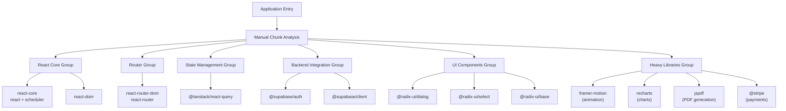
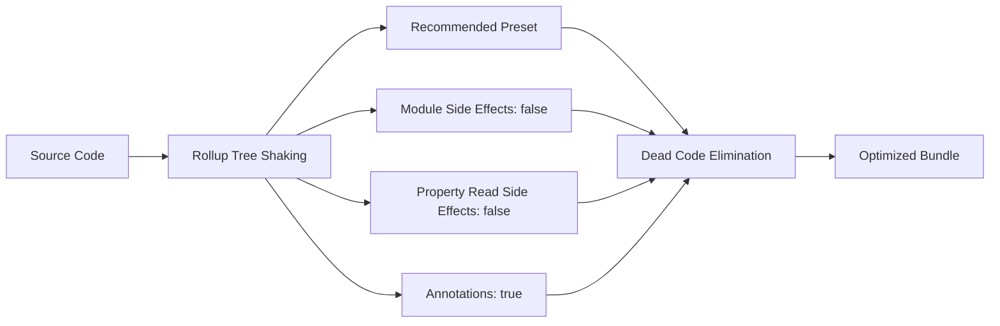
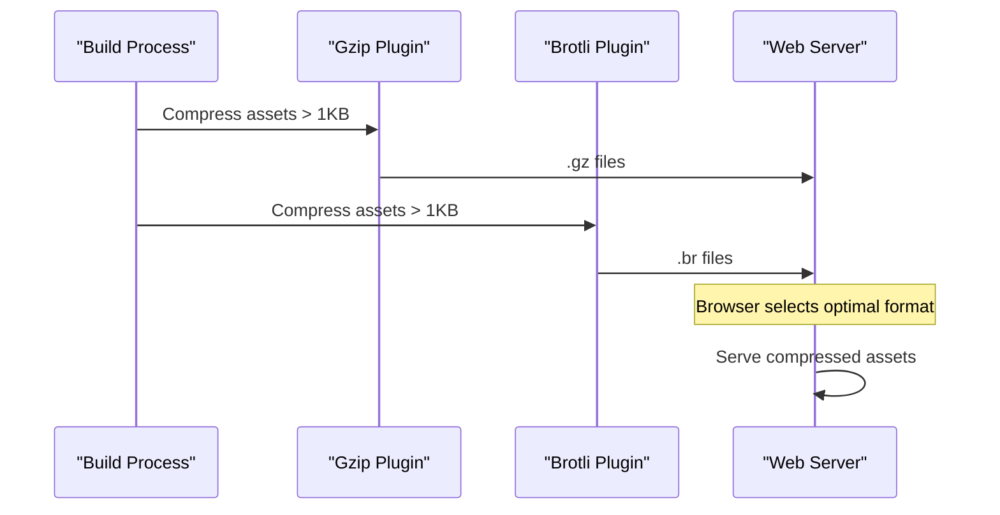
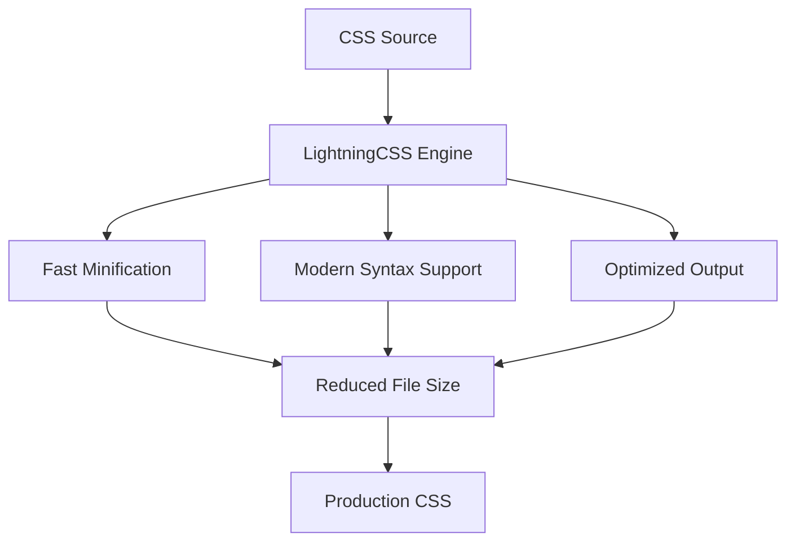
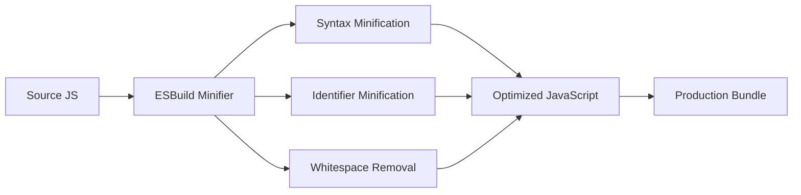
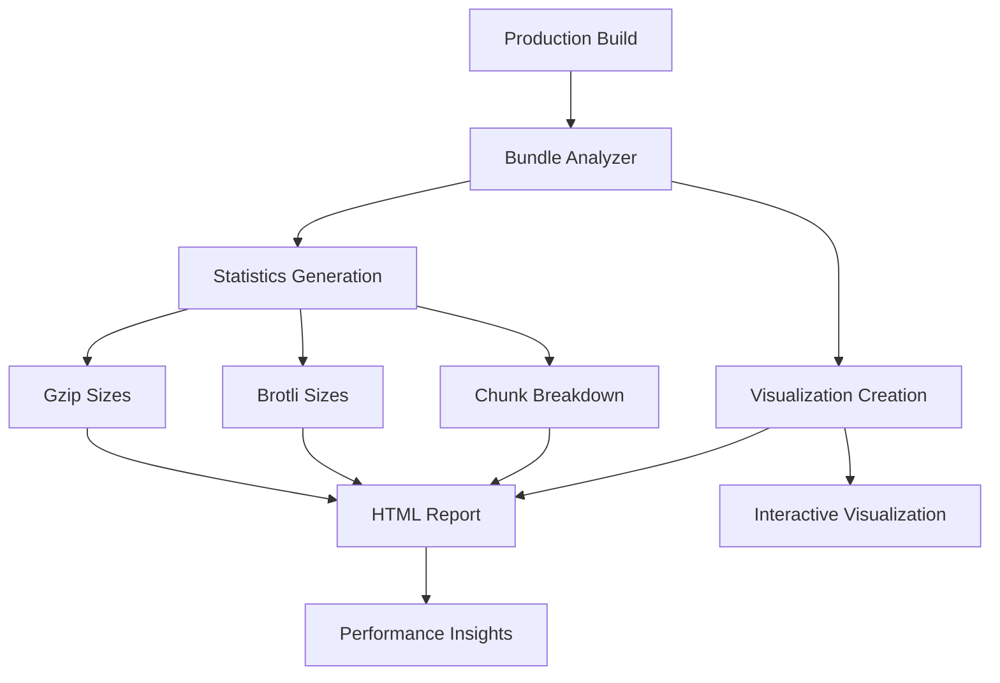
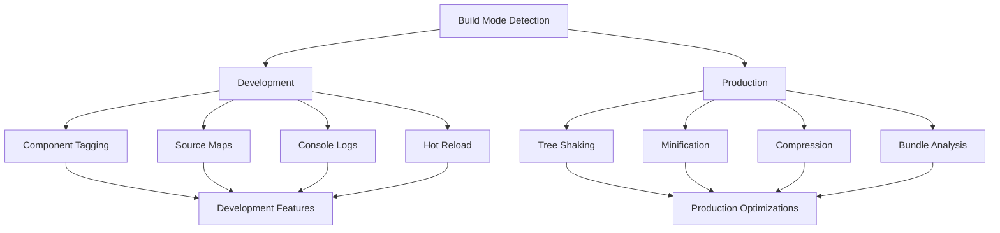
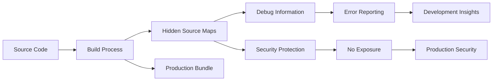

# Build Optimization

<cite>
**Referenced Files in This Document**
- [vite.config.ts](file://vite.config.ts)
- [package.json](file://package.json)
- [tailwind.config.ts](file://tailwind.config.ts)
- [postcss.config.js](file://postcss.config.js)
- [tsconfig.app.json](file://tsconfig.app.json)
- [tsconfig.node.json](file://tsconfig.node.json)
</cite>

## Table of Contents
1. [Introduction](#introduction)
2. [Code Splitting Strategy](#code-splitting-strategy)
3. [Tree Shaking Configuration](#tree-shaking-configuration)
4. [Asset Compression](#asset-compression)
5. [CSS Optimization](#css-optimization)
6. [JavaScript Minification](#javascript-minification)
7. [Bundle Analysis](#bundle-analysis)
8. [Development vs Production Optimizations](#development-vs-production-optimizations)
9. [Performance Monitoring](#performance-monitoring)
10. [Best Practices](#best-practices)

## Introduction

This Vite configuration implements comprehensive build-time performance optimizations designed to maximize application load speed and minimize bundle sizes. The optimization strategy focuses on intelligent code splitting, aggressive tree shaking, modern compression techniques, and efficient asset handling to deliver optimal user experiences across different browsers and network conditions.

The build system targets ES2020 standards while maintaining compatibility with modern browsers, employing advanced techniques like manual chunk grouping, CSS optimization, and bundle analysis to ensure peak performance in production environments.

## Code Splitting Strategy

### Manual Chunk Configuration

The application employs sophisticated manual chunking through Rollup's `manualChunks` configuration to create optimized bundle groups for critical dependencies. This approach ensures that essential libraries are grouped efficiently while allowing for lazy loading of heavy third-party libraries.



**Diagram sources**
- [vite.config.ts](file://vite.config.ts#L103-L187)

### Critical Dependency Grouping

The chunk grouping strategy prioritizes applications that benefit from immediate loading:

| Chunk Group | Dependencies | Purpose | Loading Strategy |
|-------------|--------------|---------|------------------|
| `react-core` | `react`, `scheduler` | Core React runtime | Immediate loading |
| `react-dom` | `react-dom` | DOM rendering | Immediate loading |
| `router` | `react-router-dom`, `react-router` | Navigation | Critical path |
| `query` | `@tanstack/react-query` | State management | Essential |
| `supabase-client` | `@supabase/supabase-js` | Backend integration | Critical |
| `supabase-auth` | `@supabase/auth` | Authentication | Critical |

### Lazy Loading Strategy

Heavy libraries are strategically placed in separate chunks for on-demand loading:

| Library Category | Chunk Name | Trigger Conditions |
|------------------|------------|-------------------|
| Animation | `animation` | Feature-specific usage |
| Charts | `charts` | Admin dashboard only |
| PDF Generation | `pdf-lib` | Quote generation |
| Payments | `payment` | Checkout process |
| Forms | `forms` | Specific forms only |
| Icons | `icons` | Tree-shaken individually |

**Section sources**
- [vite.config.ts](file://vite.config.ts#L103-L187)

## Tree Shaking Configuration

### Recommended Preset with Module Side Effects Disabled

The tree shaking configuration employs the recommended preset with moduleSideEffects disabled to eliminate dead code effectively:



**Diagram sources**
- [vite.config.ts](file://vite.config.ts#L96-L101)

### Tree Shaking Benefits

The tree shaking configuration provides several key advantages:

- **Dead Code Elimination**: Removes unused exports and imports
- **Module Deduplication**: Prevents duplicate module inclusion
- **Optimized Dependencies**: Reduces overall bundle size
- **Improved Load Times**: Faster initial page loads

**Section sources**
- [vite.config.ts](file://vite.config.ts#L96-L101)

## Asset Compression

### Multi-Format Compression Strategy

The application implements dual compression formats (Gzip and Brotli) with intelligent threshold-based compression to optimize asset delivery across different server capabilities.



**Diagram sources**
- [vite.config.ts](file://vite.config.ts#L55-L64)

### Compression Configuration Details

| Algorithm | Extension | Threshold | Use Case |
|-----------|-----------|-----------|----------|
| Gzip | `.gz` | 1024 bytes | Universal compatibility |
| Brotli | `.br` | 1024 bytes | Modern browsers |

### Compression Benefits

- **Reduced Transfer Size**: Significant reduction in asset payload
- **Faster Downloads**: Improved network performance
- **Bandwidth Savings**: Reduced hosting costs
- **Better UX**: Faster page loads across networks

**Section sources**
- [vite.config.ts](file://vite.config.ts#L55-L64)

## CSS Optimization

### LightningCSS Minification

The application leverages LightningCSS for superior CSS minification performance compared to traditional tools:



**Diagram sources**
- [vite.config.ts](file://vite.config.ts#L93)

### Single CSS File Strategy

The CSS code splitting is disabled (`cssCodeSplit: false`) to create a single CSS bundle for better caching efficiency:

| Benefit | Implementation | Impact |
|---------|---------------|--------|
| Better Caching | Single CSS file | Reduced HTTP requests |
| Consistent Styling | Unified stylesheet | Predictable rendering |
| Simplified Loading | One CSS bundle | Faster initial load |
| Cache Efficiency | Static filename | Long-term caching |

### CSS Preload Transformation

The build process automatically transforms CSS links into preload resources for non-blocking loading:

```html
<!-- Original -->
<link rel="stylesheet" crossorigin href="/assets/index-hash.css">

<!-- Transformed -->
<link rel="preload" href="/assets/index-hash.css" as="style" onload="this.onload=null;this.rel='stylesheet'">
<noscript><link rel="stylesheet" href="/assets/index-hash.css"></noscript>
```

**Section sources**
- [vite.config.ts](file://vite.config.ts#L33-L46)
- [vite.config.ts](file://vite.config.ts#L89)

## JavaScript Minification

### ESBuild Minification

The application uses ESBuild for JavaScript minification due to its exceptional speed and effectiveness:



**Diagram sources**
- [vite.config.ts](file://vite.config.ts#L90)

### Target ES2020 Optimization

The JavaScript target is set to ES2020 to leverage modern browser features while maintaining broad compatibility:

| Feature | ES2020 Benefit | Performance Impact |
|---------|---------------|-------------------|
| Native Async/Await | Reduced polyfills | Smaller bundles |
| Dynamic Imports | Built-in code splitting | Better chunking |
| Optional Chaining | Cleaner syntax | Reduced runtime checks |
| Nullish Coalescing | Efficient null handling | Better performance |

**Section sources**
- [vite.config.ts](file://vite.config.ts#L91)
- [tsconfig.app.json](file://tsconfig.app.json#L2-L3)

## Bundle Analysis

### Visualizer Integration

The rollup-plugin-visualizer provides comprehensive bundle analysis capabilities for production builds:



**Diagram sources**
- [vite.config.ts](file://vite.config.ts#L66-L71)

### Analysis Features

| Analysis Type | Output Format | Purpose |
|---------------|---------------|---------|
| Bundle Statistics | HTML report | Comprehensive overview |
| Gzip Size Analysis | Detailed metrics | Real-world performance |
| Brotli Size Analysis | Alternative compression | Modern browser optimization |
| Chunk Distribution | Visual representation | Code splitting effectiveness |

**Section sources**
- [vite.config.ts](file://vite.config.ts#L66-L71)

## Development vs Production Optimizations

### Environment-Specific Configurations

The build system applies different optimization strategies based on the environment:



**Diagram sources**
- [vite.config.ts](file://vite.config.ts#L29-L72)

### Development Optimizations

| Feature | Purpose | Implementation |
|---------|---------|---------------|
| Component Tagging | Development insights | `componentTagger()` plugin |
| Hot Module Replacement | Fast development | Built-in Vite HMR |
| Source Maps | Debugging support | Hidden source maps |
| Console Removal | Clean production | Conditional removal |

### Production Optimizations

| Feature | Purpose | Impact |
|---------|---------|--------|
| Tree Shaking | Dead code elimination | Reduced bundle size |
| Minification | Code optimization | Faster execution |
| Compression | Network efficiency | Reduced transfer time |
| Bundle Analysis | Performance monitoring | Continuous improvement |

**Section sources**
- [vite.config.ts](file://vite.config.ts#L29-L72)

## Performance Monitoring

### Source Map Strategy

The application uses hidden source maps in production to balance debugging capabilities with security:



**Diagram sources**
- [vite.config.ts](file://vite.config.ts#L88)

### Asset Optimization Strategy

The build system implements intelligent asset handling for optimal performance:

| Asset Type | Strategy | Configuration |
|------------|----------|---------------|
| Small Assets | Inline Limit | 4KB threshold |
| Images | Directory Organization | `assets/images/` |
| Fonts | Directory Organization | `assets/fonts/` |
| Other Assets | Standard Naming | `assets/[name]-[hash][extname]` |

**Section sources**
- [vite.config.ts](file://vite.config.ts#L88)
- [vite.config.ts](file://vite.config.ts#L195-L204)

## Best Practices

### Optimization Guidelines

1. **Chunk Strategy**: Group related dependencies together while maintaining logical separation
2. **Tree Shaking**: Enable comprehensive tree shaking with proper module side effect declarations
3. **Compression**: Implement both Gzip and Brotli for universal compatibility
4. **CSS Optimization**: Use LightningCSS for fast minification and single-file bundling
5. **Bundle Analysis**: Regularly analyze bundle composition for optimization opportunities
6. **Environment Awareness**: Apply appropriate optimizations for development vs production

### Performance Metrics

| Metric | Target | Measurement |
|--------|--------|-------------|
| Initial Bundle Size | < 250KB | Uncompressed |
| Critical Path | < 1.5s | First Contentful Paint |
| Total Bundle Size | < 1MB | Including all chunks |
| Compression Ratio | 60-70% | Gzip/Brotli effectiveness |

### Monitoring and Maintenance

Regular performance monitoring should include:

- **Bundle Size Tracking**: Monitor changes in bundle composition
- **Load Time Analysis**: Measure actual user performance metrics
- **Compression Effectiveness**: Verify compression ratios in production
- **Chunk Loading Patterns**: Analyze lazy loading effectiveness

**Section sources**
- [vite.config.ts](file://vite.config.ts#L87)
- [vite.config.ts](file://vite.config.ts#L207)