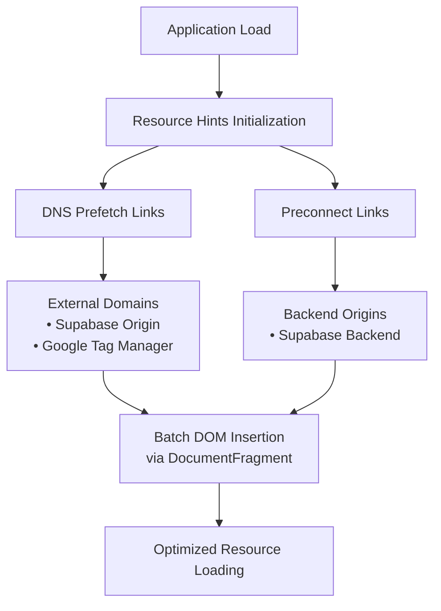
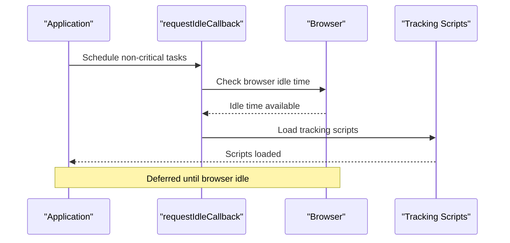
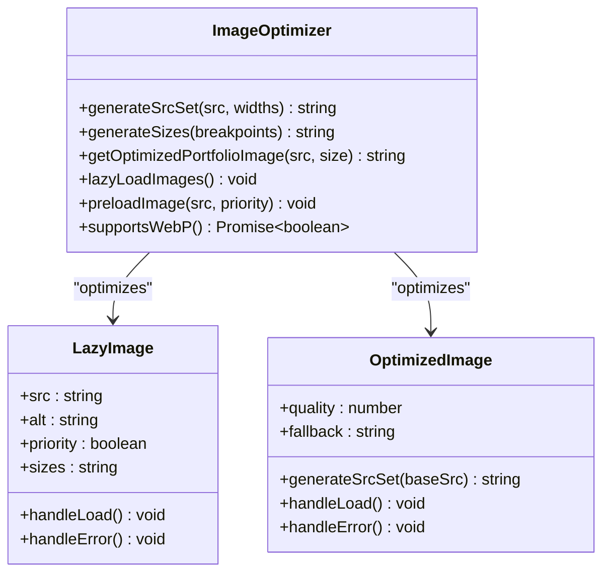
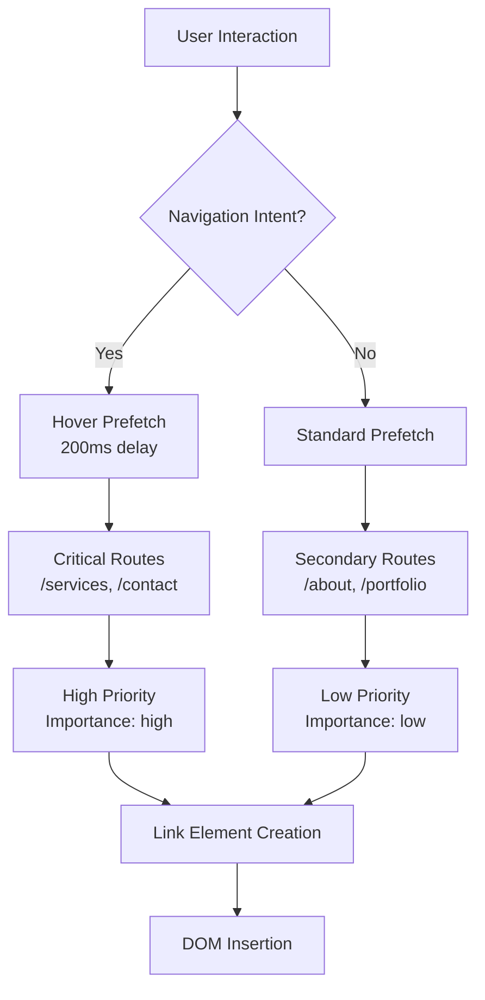
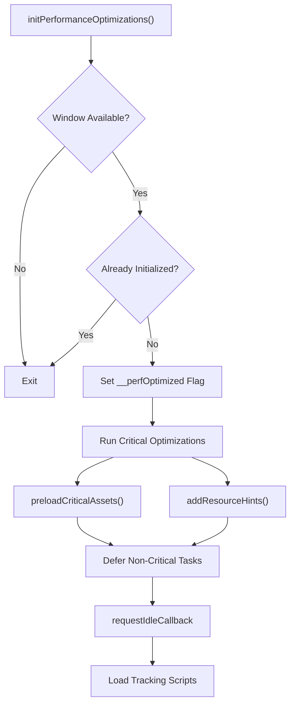
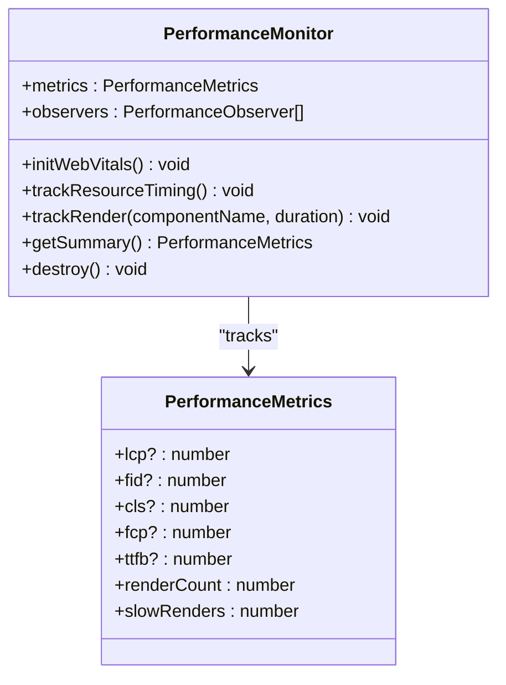

# Frontend Optimization Techniques

<cite>
**Referenced Files in This Document**
- [performanceOptimizer.ts](file://src/lib/performanceOptimizer.ts)
- [imageOptimizer.ts](file://src/lib/imageOptimizer.ts)
- [imagePreloader.ts](file://src/lib/imagePreloader.ts)
- [routePrefetch.ts](file://src/lib/routePrefetch.ts)
- [lazyLoadRoutes.ts](file://src/lib/lazyLoadRoutes.ts)
- [LazyImage.tsx](file://src/components/LazyImage.tsx)
- [OptimizedImage.tsx](file://src/components/OptimizedImage.tsx)
- [performanceMonitor.ts](file://src/lib/performanceMonitor.ts)
- [useCoreWebVitals.ts](file://src/hooks/useCoreWebVitals.ts)
- [main.tsx](file://src/main.tsx)
- [init-critical.js](file://public/init-critical.js)
- [vite.config.ts](file://vite.config.ts)
- [package.json](file://package.json)
</cite>

## Table of Contents
1. [Introduction](#introduction)
2. [Resource Hints Implementation](#resource-hints-implementation)
3. [RequestIdleCallback Optimization](#requestidlecallback-optimization)
4. [Image Optimization Strategy](#image-optimization-strategy)
5. [Route Prefetching Mechanism](#route-prefetching-mechanism)
6. [Performance Initialization Orchestration](#performance-initialization-orchestration)
7. [DOM Performance Optimizations](#dom-performance-optimizations)
8. [Monitoring and Analytics](#monitoring-and-analytics)
9. [Build-Time Optimizations](#build-time-optimizations)
10. [Best Practices and Rationale](#best-practices-and-rationale)

## Introduction

This Sleek App frontend implements a comprehensive suite of performance optimization techniques designed to enhance user experience through faster page loads, improved interactivity, and reduced resource consumption. The optimization strategy encompasses resource hints, intelligent image loading, predictive route prefetching, and sophisticated performance monitoring.

The optimization framework is built around several core principles: minimizing blocking resources, prioritizing critical content delivery, deferring non-essential operations, and continuously monitoring performance metrics to ensure optimal user experience across different devices and network conditions.

## Resource Hints Implementation

### DNS Prefetch and Preconnect Strategies

The application implements strategic resource hints to reduce connection latency and improve perceived performance. These optimizations target critical origins that the application depends on for core functionality.



**Diagram sources**
- [performanceOptimizer.ts](file://src/lib/performanceOptimizer.ts#L18-L53)

The resource hint implementation follows a systematic approach:

#### Critical Origin Configuration
The system identifies and optimizes connections to essential external services:

- **Supabase Origin**: `https://eqpftggctumujhutomom.supabase.co` - Primary backend service
- **Google Tag Manager**: `https://www.googletagmanager.com` - Analytics infrastructure

#### Batch DOM Operations
To minimize DOM manipulation overhead, the system employs DocumentFragment batching:

```typescript
// Batch insertion pattern for optimal DOM performance
const fragment = document.createDocumentFragment();
dnsPrefetch.forEach((domain) => {
  const link = document.createElement('link');
  link.rel = 'dns-prefetch';
  link.href = domain;
  fragment.appendChild(link);
});
document.head.appendChild(fragment);
```

**Section sources**
- [performanceOptimizer.ts](file://src/lib/performanceOptimizer.ts#L18-L53)

### Preconnect Implementation

Preconnect establishes early TCP connections to critical origins, reducing handshake latency for subsequent requests. The implementation includes cross-origin support for secure connections.

**Section sources**
- [performanceOptimizer.ts](file://src/lib/performanceOptimizer.ts#L44-L50)

## RequestIdleCallback Optimization

### Non-Critical Operation Deferral

The application leverages `requestIdleCallback` to defer non-critical operations until the browser is idle, ensuring that core functionality remains responsive during peak activity periods.



**Diagram sources**
- [performanceOptimizer.ts](file://src/lib/performanceOptimizer.ts#L68-L74)

### Polyfill Implementation

A robust polyfill ensures compatibility across all browsers, falling back to traditional `setTimeout` when native `requestIdleCallback` is unavailable:

```typescript
const requestIdleCallback = (cb: () => void, options?: { timeout?: number }) => {
  if ('requestIdleCallback' in window) {
    window.requestIdleCallback(cb, options);
  } else {
    setTimeout(cb, options?.timeout || 1);
  }
};
```

**Section sources**
- [performanceOptimizer.ts](file://src/lib/performanceOptimizer.ts#L77-L84)

### Tracking Script Loading Strategy

The tracking script loading follows a conditional approach based on document readiness:

- **Complete State**: Scripts load immediately on idle callback
- **Loading State**: Scripts wait for page load event before scheduling

**Section sources**
- [performanceOptimizer.ts](file://src/lib/performanceOptimizer.ts#L68-L74)

## Image Optimization Strategy

### Responsive Image Generation

The image optimization system implements sophisticated responsive image strategies to deliver optimal image quality across different devices and network conditions.



**Diagram sources**
- [imageOptimizer.ts](file://src/lib/imageOptimizer.ts#L5-L74)
- [LazyImage.tsx](file://src/components/LazyImage.tsx#L16-L126)
- [OptimizedImage.tsx](file://src/components/OptimizedImage.tsx#L29-L129)

### Progressive Loading Implementation

The system implements multiple layers of image optimization:

#### Intersection Observer Integration
High-performance lazy loading using modern Intersection Observer API:

```typescript
const imageObserver = new IntersectionObserver((entries, observer) => {
  entries.forEach(entry => {
    if (entry.isIntersecting) {
      const img = entry.target as HTMLImageElement;
      const src = img.dataset.src;
      const srcset = img.dataset.srcset;
      
      if (src) img.src = src;
      if (srcset) img.srcset = srcset;
      
      img.classList.remove('lazy');
      imageObserver.unobserve(img);
    }
  });
}, {
  rootMargin: '50px 0px',
  threshold: 0.01
});
```

**Section sources**
- [imageOptimizer.ts](file://src/lib/imageOptimizer.ts#L26-L51)

#### WebP Format Detection
Automatic format detection and fallback implementation:

```typescript
export const supportsWebP = (): Promise<boolean> => {
  return new Promise(resolve => {
    const webP = new Image();
    webP.onload = webP.onerror = () => {
      resolve(webP.height === 2);
    };
    webP.src = 'data:image/webp;base64,UklGRjoAAABXRUJQVlA4IC4AAACyAgCdASoCAAIALmk0mk0iIiIiIgBoSygABc6WWgAA/veff/0PP8bA//LwYAAA';
  });
};
```

**Section sources**
- [imageOptimizer.ts](file://src/lib/imageOptimizer.ts#L64-L74)

### Critical Image Preloading

The system implements predictive image preloading for key visual elements:

#### LCP Image Prioritization
Critical logo images receive highest priority preload treatment:

```typescript
const CRITICAL_IMAGES = ['/sleek-logo.webp'];
// High priority for LCP images
link.setAttribute('fetchpriority', 'high');
```

**Section sources**
- [imagePreloader.ts](file://src/lib/imagePreloader.ts#L5-L7)
- [imagePreloader.ts](file://src/lib/imagePreloader.ts#L24-L26)

## Route Prefetching Mechanism

### Intelligent Navigation Anticipation

The route prefetching system implements sophisticated heuristics to anticipate user navigation patterns and preload critical routes before explicit user action.



**Diagram sources**
- [routePrefetch.ts](file://src/lib/routePrefetch.ts#L85-L115)

### Prefetch Configuration Strategy

The system defines multiple prefetch tiers based on user behavior patterns:

#### Critical Route Prefetching
High-priority routes loaded after 2-second delay:

```typescript
const CRITICAL_ROUTES: PrefetchConfig = {
  routes: ['/services', '/contact'],
  delay: 2000,
  priority: 'high',
};
```

#### Secondary Route Prefetching
Lower-priority routes loaded after 5-second delay:

```typescript
const SECONDARY_ROUTES: PrefetchConfig = {
  routes: ['/about', '/portfolio', '/products'],
  delay: 5000,
  priority: 'low',
};
```

**Section sources**
- [routePrefetch.ts](file://src/lib/routePrefetch.ts#L11-L23)

### Hover-Based Prefetching

Intelligent prefetching triggers on user hover interactions with navigation elements:

```typescript
document.addEventListener('mouseover', (e) => {
  const target = e.target as HTMLElement;
  const link = target.closest('a[href^="/"]') as HTMLAnchorElement;
  
  if (!link) return;
  
  clearTimeout(hoverTimeout);
  
  hoverTimeout = setTimeout(() => {
    const href = link.getAttribute('href');
    if (href && href.startsWith('/')) {
      prefetchRoute(href, 'high');
    }
  }, 200);
});
```

**Section sources**
- [routePrefetch.ts](file://src/lib/routePrefetch.ts#L91-L109)

### Dynamic Chunk Prefetching

The system includes sophisticated chunk prefetching for Vite's dynamic imports, though this is currently disabled to prevent 404 errors from hardcoded chunk names.

**Section sources**
- [routePrefetch.ts](file://src/lib/routePrefetch.ts#L49-L52)

## Performance Initialization Orchestration

### Safeguarded Initialization

The performance optimization system implements comprehensive safeguards to prevent duplicate initialization and ensure reliable operation across different environments.



**Diagram sources**
- [performanceOptimizer.ts](file://src/lib/performanceOptimizer.ts#L55-L75)

### Global Flag Prevention

The system uses a global flag to prevent duplicate initialization:

```typescript
// Prevent double initialization
if ((window as any).__perfOptimized) return;
(window as any).__perfOptimized = true;
```

**Section sources**
- [performanceOptimizer.ts](file://src/lib/performanceOptimizer.ts#L59-L61)

### Critical Asset Management

The system removes unused assets to eliminate console warnings and improve efficiency:

```typescript
// Removed unused sleek-logo.webp preload to eliminate console warning
// Only preload assets that are actually used above the fold
```

**Section sources**
- [performanceOptimizer.ts](file://src/lib/performanceOptimizer.ts#L7-L10)

### Main Application Integration

Performance optimizations are seamlessly integrated into the application bootstrap process:

```typescript
// Initialize performance optimizations
initPerformanceOptimizations();

// Initialize performance monitoring
getPerformanceMonitor();

// Initialize intelligent route prefetching
initRoutePrefetching();
```

**Section sources**
- [main.tsx](file://src/main.tsx#L14-L21)

## DOM Performance Optimizations

### DocumentFragment Batch Insertion

The system employs DocumentFragment for efficient DOM manipulation, reducing layout thrashing and improving rendering performance.

```typescript
// Batch DOM insertions for optimal performance
const fragment = document.createDocumentFragment();
// ... append multiple elements
document.head.appendChild(fragment);
```

**Section sources**
- [performanceOptimizer.ts](file://src/lib/performanceOptimizer.ts#L35-L52)

### Critical CSS Loading

The application includes a dedicated critical CSS loader for asynchronous stylesheet loading:

```javascript
// Async CSS Loading Helper
function loadCSS(href, before, media, attributes) {
  var ss = doc.createElement('link');
  ss.rel = 'stylesheet';
  ss.href = href;
  ss.media = 'only x';
  
  // Load callback with media switching
  function loadCB() {
    ss.media = media || 'all';
  }
  
  return ss;
}
```

**Section sources**
- [init-critical.js](file://public/init-critical.js#L10-L72)

### Lazy Loading Polyfills

The system includes comprehensive polyfills for browsers without native lazy loading support:

```javascript
// Lazy Image Loading Polyfill
if (!supportsLoading && supportsIntersectionObserver) {
  var imageObserver = new IntersectionObserver(function(entries, observer) {
    entries.forEach(function(entry) {
      if (entry.isIntersecting) {
        var image = entry.target;
        if (image.dataset.src) {
          image.src = image.dataset.src;
          image.removeAttribute('data-src');
        }
        observer.unobserve(image);
      }
    });
  });
}
```

**Section sources**
- [init-critical.js](file://public/init-critical.js#L74-L103)

## Monitoring and Analytics

### Comprehensive Performance Tracking

The application implements advanced performance monitoring with Web Vitals tracking and custom metrics collection.



**Diagram sources**
- [performanceMonitor.ts](file://src/lib/performanceMonitor.ts#L6-L20)

### Web Vitals Implementation

The system tracks core Web Vitals metrics with comprehensive fallback strategies:

#### LCP (Largest Contentful Paint)
Monitored through PerformanceObserver with automatic reporting:

```typescript
// Largest Contentful Paint (LCP)
this.observeMetric('largest-contentful-paint', (entry: any) => {
  this.metrics.lcp = entry.renderTime || entry.loadTime;
  this.reportMetric('LCP', this.metrics.lcp);
});
```

#### FID (First Input Delay)
Tracks user interaction responsiveness:

```typescript
// First Input Delay (FID)
this.observeMetric('first-input', (entry: any) => {
  this.metrics.fid = entry.processingStart - entry.startTime;
  this.reportMetric('FID', this.metrics.fid);
});
```

#### CLS (Cumulative Layout Shift)
Monitors visual stability with input exclusion:

```typescript
// Cumulative Layout Shift (CLS)
let clsValue = 0;
this.observeMetric('layout-shift', (entry: any) => {
  if (!entry.hadRecentInput) {
    clsValue += entry.value;
    this.metrics.cls = clsValue;
  }
});
```

**Section sources**
- [performanceMonitor.ts](file://src/lib/performanceMonitor.ts#L30-L50)

### React Component Performance Tracking

The system includes specialized tracking for React component rendering performance:

```typescript
trackRender(componentName: string, duration: number) {
  this.metrics.renderCount++;
  
  if (duration > 16) { // Slower than 60fps
    this.metrics.slowRenders++;
    
    if (import.meta.env.DEV) {
      console.warn(`Slow render detected in ${componentName}: ${duration.toFixed(2)}ms`);
    }
  }
}
```

**Section sources**
- [performanceMonitor.ts](file://src/lib/performanceMonitor.ts#L141-L151)

## Build-Time Optimizations

### Vite Configuration

The build system incorporates multiple optimization strategies:

#### CSS Optimization
Critical CSS is transformed to prevent render-blocking:

```typescript
transformIndexHtml(html: string) {
  return html.replace(
    /<link rel="stylesheet" crossorigin href="(\/assets\/index-[^"]+\.css)">/g,
    (_match: string, cssPath: string) => {
      return `<link rel="preload" href="${cssPath}" as="style" onload="this.onload=null;this.rel='stylesheet'">
              <noscript><link rel="stylesheet" href="${cssPath}"></noscript>`;
    }
  );
}
```

**Section sources**
- [vite.config.ts](file://vite.config.ts#L36-L43)

#### Asset Compression
Multiple compression algorithms are applied for production builds:

```typescript
// Compression for production builds
mode === "production" && viteCompression({
  algorithm: 'gzip',
  ext: '.gz',
  threshold: 1024,
}),
mode === "production" && viteCompression({
  algorithm: 'brotliCompress',
  ext: '.br',
  threshold: 1024,
}),
```

**Section sources**
- [vite.config.ts](file://vite.config.ts#L55-L64)

#### Bundle Analysis
Comprehensive bundle analysis for optimization insights:

```typescript
mode === "production" && visualizer({
  filename: './dist/stats.html',
  open: false,
  gzipSize: true,
  brotliSize: true,
}),
```

**Section sources**
- [vite.config.ts](file://vite.config.ts#L66-L71)

### Dependency Deduplication

The build configuration includes dependency deduplication to prevent React duplication issues:

```typescript
resolve: {
  dedupe: ["react", "react-dom"],
},
```

**Section sources**
- [vite.config.ts](file://vite.config.ts#L77-L78)

## Best Practices and Rationale

### Performance Optimization Principles

The optimization strategy follows established performance principles:

#### Resource Prioritization
- **Above-the-fold content**: Critical assets loaded immediately
- **Non-critical content**: Deferred to idle periods
- **Predictive loading**: Anticipated navigation patterns

#### Progressive Enhancement
- Native API fallbacks for broad compatibility
- Graceful degradation for older browsers
- Feature detection before optimization application

#### Monitoring-Driven Optimization
- Continuous performance measurement
- Data-driven optimization decisions
- Real-time performance feedback

### Technical Debt Reduction

The optimization system addresses several technical debt areas:

#### Unused Asset Removal
Removed unused `sleek-logo.webp` preload eliminates console warnings and reduces unnecessary network requests.

#### Legacy Browser Support
Comprehensive polyfills ensure compatibility across diverse browser ecosystems.

#### Modular Architecture
Separation of concerns enables independent optimization of different performance aspects.

### Future Optimization Opportunities

The current implementation establishes foundations for advanced optimizations:

#### Image CDN Integration
Future enhancements could integrate with image CDNs for dynamic optimization.

#### Service Worker Integration
Potential for offline-first experiences through service worker caching.

#### Advanced Prefetching
Machine learning-based navigation prediction for enhanced prefetching accuracy.

**Section sources**
- [performanceOptimizer.ts](file://src/lib/performanceOptimizer.ts#L7-L10)
- [imagePreloader.ts](file://src/lib/imagePreloader.ts#L5-L7)