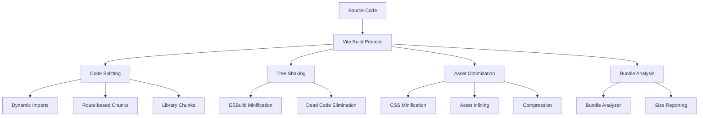
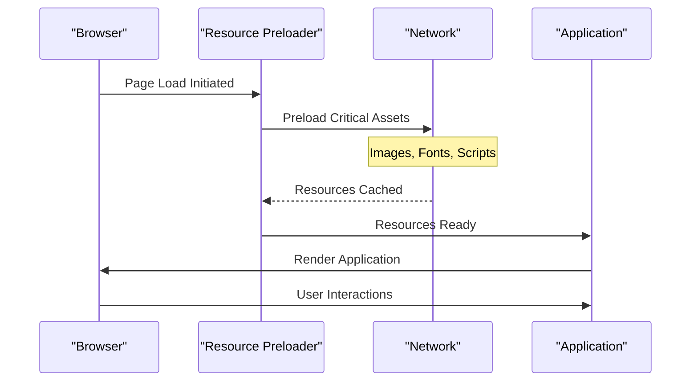
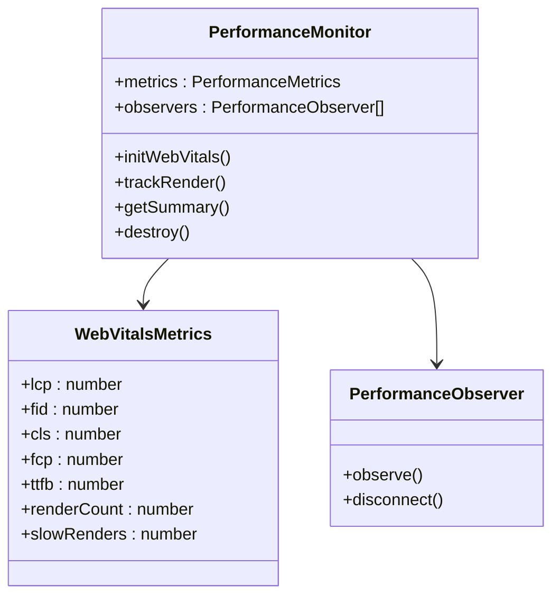
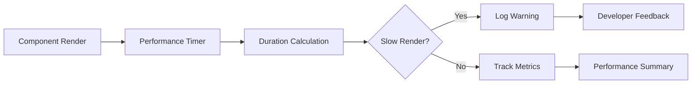
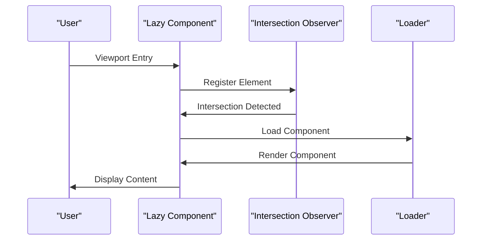
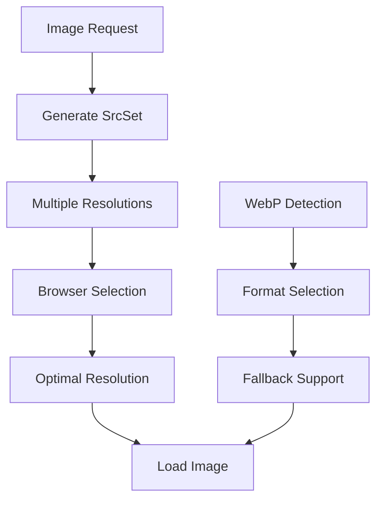
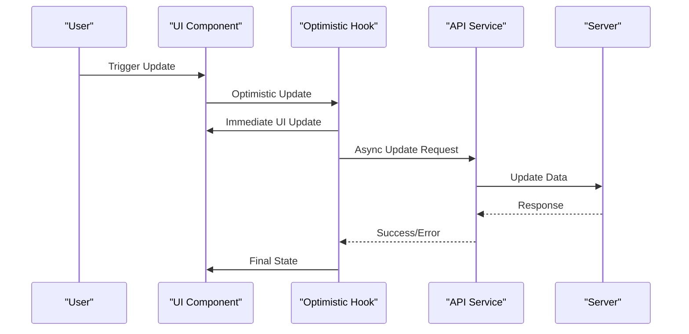
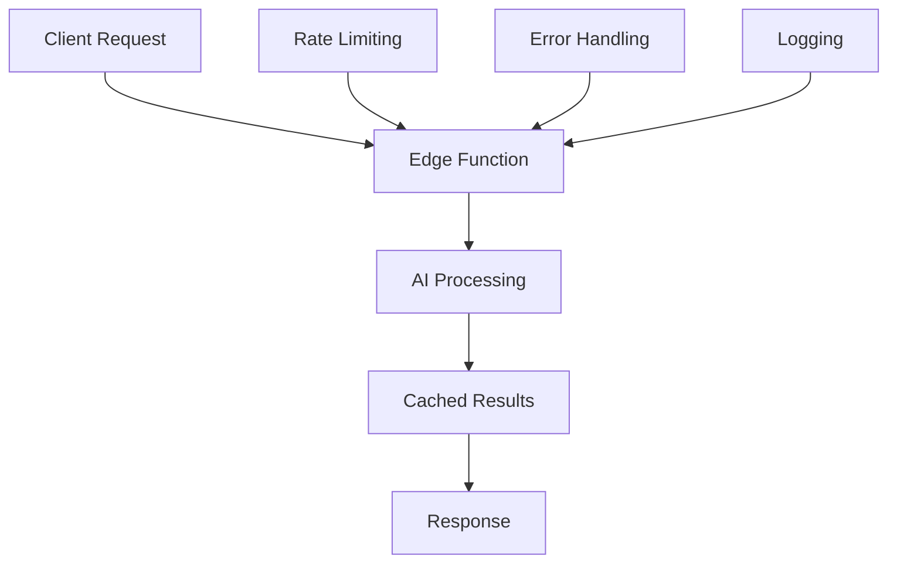
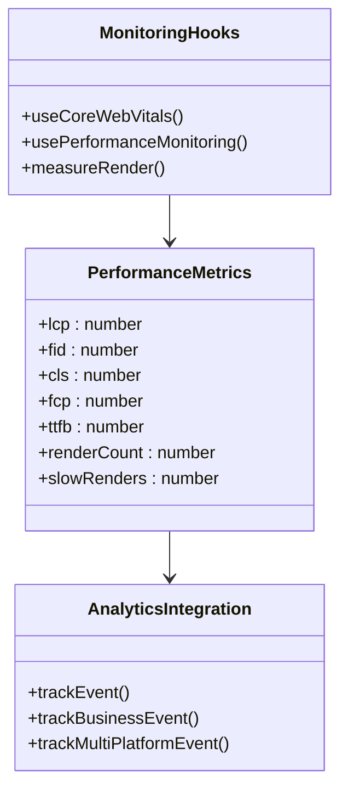

# Performance Optimization

<cite>
**Referenced Files in This Document**
- [vite.config.ts](file://vite.config.ts)
- [src/lib/performanceMonitor.ts](file://src/lib/performanceMonitor.ts)
- [src/lib/performanceOptimizer.ts](file://src/lib/performanceOptimizer.ts)
- [src/hooks/useLazyLoad.ts](file://src/hooks/useLazyLoad.ts)
- [src/hooks/useCoreWebVitals.ts](file://src/hooks/useCoreWebVitals.ts)
- [src/lib/lazyLoadRoutes.ts](file://src/lib/lazyLoadRoutes.ts)
- [src/lib/imageOptimizer.ts](file://src/lib/imageOptimizer.ts)
- [src/lib/routePrefetch.ts](file://src/lib/routePrefetch.ts)
- [supabase/functions/analytics-service/index.ts](file://supabase/functions/analytics-service/index.ts)
- [src/hooks/usePerformance.ts](file://src/hooks/usePerformance.ts)
- [src/components/LazyImage.tsx](file://src/components/LazyImage.tsx)
- [src/components/OptimizedImage.tsx](file://src/components/OptimizedImage.tsx)
- [src/lib/imagePreloader.ts](file://src/lib/imagePreloader.ts)
- [src/hooks/useOptimisticUpdate.ts](file://src/hooks/useOptimisticUpdate.ts)
- [src/lib/analytics.ts](file://src/lib/analytics.ts)
- [src/main.tsx](file://src/main.tsx)
</cite>

## Table of Contents
1. [Introduction](#introduction)
2. [Build-Time Optimizations](#build-time-optimizations)
3. [Runtime Performance Monitoring](#runtime-performance-monitoring)
4. [Frontend Optimization Techniques](#frontend-optimization-techniques)
5. [Backend Performance Considerations](#backend-performance-considerations)
6. [Performance Measurement Tools](#performance-measurement-tools)
7. [Performance Guidelines](#performance-guidelines)
8. [Troubleshooting Performance Issues](#troubleshooting-performance-issues)
9. [Best Practices Summary](#best-practices-summary)

## Introduction

The Sleek Apparels application implements a comprehensive performance optimization strategy that covers build-time optimizations, runtime monitoring, and efficient frontend/backend architectures. This document outlines the key performance optimization techniques, measurement tools, and guidelines for maintaining optimal application performance.

The application focuses on Core Web Vitals compliance, efficient resource loading, and real-time performance monitoring to deliver exceptional user experiences across all devices and network conditions.

## Build-Time Optimizations

### Vite Configuration for Performance

The application leverages Vite's powerful build system with extensive optimizations tailored for production deployments.

**Diagram sources**
- [vite.config.ts](file://vite.config.ts#L86-L209)

#### Code Splitting Strategy

The Vite configuration implements sophisticated code splitting to minimize initial bundle sizes:

- **Core React Libraries**: Separated into dedicated chunks (`react-core`, `react-dom`)
- **Routing**: Isolated routing logic in separate chunks
- **State Management**: React Query libraries split for efficient loading
- **UI Components**: Grouped by usage frequency and functionality
- **Heavy Libraries**: Lazy-loaded for non-critical features
- **Vendor Code**: Consolidated for better caching

#### Tree Shaking and Minification

The build process employs aggressive tree shaking and minification:

- **ESBuild Minification**: Fast JavaScript minification with ES2020 target
- **LightningCSS**: Optimized CSS processing
- **Treeshaking Configuration**: Configured for maximum dead code elimination
- **Source Maps**: Hidden in production for security and performance

#### Asset Optimization

- **CSS Code Splitting**: Disabled for better caching efficiency
- **Asset Inlining**: Small assets (< 4KB) inlined automatically
- **Compression**: Gzip and Brotli compression for production builds
- **Bundle Analysis**: Visualizer plugin generates detailed build statistics

**Section sources**
- [vite.config.ts](file://vite.config.ts#L86-L209)

### Critical Resource Preloading

The application implements intelligent resource preloading strategies to improve Core Web Vitals:

**Diagram sources**
- [src/lib/performanceOptimizer.ts](file://src/lib/performanceOptimizer.ts#L18-L53)
- [src/lib/imagePreloader.ts](file://src/lib/imagePreloader.ts#L9-L32)

**Section sources**
- [src/lib/performanceOptimizer.ts](file://src/lib/performanceOptimizer.ts#L18-L53)
- [src/lib/imagePreloader.ts](file://src/lib/imagePreloader.ts#L9-L32)

## Runtime Performance Monitoring

### Web Vitals Tracking

The application implements comprehensive Web Vitals monitoring using multiple approaches:

**Diagram sources**
- [src/lib/performanceMonitor.ts](file://src/lib/performanceMonitor.ts#L6-L195)

#### Core Web Vitals Implementation

The performance monitoring system tracks all major Core Web Vitals:

- **LCP (Largest Contentful Paint)**: Monitored with 2.5s and 4.0s thresholds
- **FID (First Input Delay)**: Measures interactivity responsiveness
- **CLS (Cumulative Layout Shift)**: Tracks visual stability
- **FCP (First Contentful Paint)**: Measures perceived load speed
- **TTFB (Time to First Byte)**: Server response time monitoring

#### Real-time Performance Tracking

The system provides real-time performance feedback:

- **Development Feedback**: Console warnings for slow renders (>16ms)
- **Production Analytics**: Integration with Google Analytics for trend analysis
- **Custom Metrics**: Application-specific performance indicators
- **Render Performance**: Component-level rendering time tracking

**Section sources**
- [src/lib/performanceMonitor.ts](file://src/lib/performanceMonitor.ts#L30-L195)
- [src/hooks/useCoreWebVitals.ts](file://src/hooks/useCoreWebVitals.ts#L19-L109)

### Component Performance Monitoring

The application includes specialized hooks for monitoring React component performance:

**Diagram sources**
- [src/lib/performanceMonitor.ts](file://src/lib/performanceMonitor.ts#L141-L151)

**Section sources**
- [src/lib/performanceMonitor.ts](file://src/lib/performanceMonitor.ts#L141-L151)

## Frontend Optimization Techniques

### Lazy Loading Strategies

The application implements multiple lazy loading approaches for optimal performance:

#### Intersection Observer-Based Lazy Loading

**Diagram sources**
- [src/hooks/useLazyLoad.ts](file://src/hooks/useLazyLoad.ts#L22-L48)
- [src/components/LazyImage.tsx](file://src/components/LazyImage.tsx#L34-L55)

#### Route-Level Code Splitting

The application uses dynamic imports for route-level code splitting:

- **Critical Routes**: Immediate loading for essential pages
- **Feature Routes**: Lazy-loaded for non-critical functionality
- **Admin Routes**: Separated for administrative interfaces
- **Service Pages**: Optimized for marketing and informational content

**Section sources**
- [src/hooks/useLazyLoad.ts](file://src/hooks/useLazyLoad.ts#L12-L52)
- [src/lib/lazyLoadRoutes.ts](file://src/lib/lazyLoadRoutes.ts#L4-L43)
- [src/components/LazyImage.tsx](file://src/components/LazyImage.tsx#L16-L126)

### Image Optimization

The application implements comprehensive image optimization strategies:

#### Responsive Image System

**Diagram sources**
- [src/lib/imageOptimizer.ts](file://src/lib/imageOptimizer.ts#L5-L17)
- [src/components/OptimizedImage.tsx](file://src/components/OptimizedImage.tsx#L85-L93)

#### Image Loading Strategies

- **Lazy Loading**: Intersection Observer for off-screen images
- **Progressive Loading**: Low-quality placeholders with blur transitions
- **Format Optimization**: WebP support with JPEG fallback
- **Responsive Sizing**: Automatic resolution selection based on viewport
- **Error Handling**: Graceful fallback for broken images

**Section sources**
- [src/lib/imageOptimizer.ts](file://src/lib/imageOptimizer.ts#L26-L74)
- [src/components/OptimizedImage.tsx](file://src/components/OptimizedImage.tsx#L29-L129)

### Efficient State Management

The application uses optimistic updates for improved user experience:

**Diagram sources**
- [src/hooks/useOptimisticUpdate.ts](file://src/hooks/useOptimisticUpdate.ts#L26-L66)

**Section sources**
- [src/hooks/useOptimisticUpdate.ts](file://src/hooks/useOptimisticUpdate.ts#L16-L176)

## Backend Performance Considerations

### Edge Functions Optimization

The application leverages Edge Functions for distributed computation:

**Diagram sources**
- [supabase/functions/analytics-service/index.ts](file://supabase/functions/analytics-service/index.ts#L29-L220)

#### Edge Function Performance Features

- **AI-Powered Analytics**: Distributed computing for complex analysis
- **Rate Limiting**: Built-in protection against abuse
- **Error Handling**: Comprehensive error management and reporting
- **Caching**: Intelligent caching for repeated requests
- **Scalability**: Automatic scaling based on demand

**Section sources**
- [supabase/functions/analytics-service/index.ts](file://supabase/functions/analytics-service/index.ts#L29-L220)

### Database Query Optimization

The application implements several database optimization strategies:

- **Indexed Queries**: Proper indexing for frequently accessed data
- **Batch Operations**: Efficient bulk data processing
- **Connection Pooling**: Optimized database connections
- **Query Optimization**: Efficient SQL query construction
- **Caching Layers**: Multi-level caching for frequently accessed data

## Performance Measurement Tools

### Built-in Monitoring Infrastructure

The application includes comprehensive performance measurement tools:

**Diagram sources**
- [src/lib/performanceMonitor.ts](file://src/lib/performanceMonitor.ts#L6-L14)
- [src/lib/analytics.ts](file://src/lib/analytics.ts#L34-L183)

### Key Performance Indicators

The application tracks multiple performance metrics:

| Metric Category | Specific Metrics | Thresholds | Purpose |
|----------------|------------------|------------|---------|
| **Core Web Vitals** | LCP, FID, CLS, FCP, TTFB | LCP: 2.5s/4.0s, FID: 100ms/300ms, CLS: 0.1/0.25 | User Experience Quality |
| **Rendering Performance** | Render Count, Slow Renders | >16ms threshold | Component Efficiency |
| **Network Performance** | Resource Loading, Request Timing | >1000ms slow resources | Network Optimization |
| **Business Metrics** | Page Views, Event Tracking | Custom thresholds | Business Performance |

**Section sources**
- [src/lib/performanceMonitor.ts](file://src/lib/performanceMonitor.ts#L126-L139)
- [src/lib/analytics.ts](file://src/lib/analytics.ts#L34-L183)

## Performance Guidelines

### Development Best Practices

#### Component Development Guidelines

- **Render Performance**: Keep individual component renders under 16ms
- **Memory Management**: Proper cleanup of event listeners and subscriptions
- **State Optimization**: Use appropriate state management patterns
- **Effect Optimization**: Minimize expensive operations in useEffect

#### Image Usage Guidelines

- **Format Selection**: Use WebP for modern browsers, JPEG as fallback
- **Resolution Strategy**: Serve appropriately sized images for different devices
- **Lazy Loading**: Implement lazy loading for off-screen images
- **Placeholder Strategy**: Use low-quality placeholders for better UX

#### Routing Optimization

- **Code Splitting**: Use dynamic imports for route-level splitting
- **Prefetching**: Implement intelligent route prefetching
- **Critical Path**: Prioritize critical routes for immediate loading
- **Bundle Size**: Monitor and optimize bundle sizes for each route

### Production Deployment Guidelines

#### Build Optimization

- **Environment Configuration**: Proper environment-specific optimizations
- **Asset Optimization**: Enable compression and optimization for production
- **Bundle Analysis**: Regular bundle size monitoring and analysis
- **Caching Strategy**: Implement effective caching headers

#### Monitoring and Maintenance

- **Performance Budgets**: Establish and monitor performance budgets
- **Regular Audits**: Conduct regular performance audits
- **User Feedback**: Monitor user-reported performance issues
- **Analytics Review**: Regular review of performance analytics data

## Troubleshooting Performance Issues

### Common Performance Problems

#### Slow Rendering Issues

**Symptoms**: UI feels sluggish, animations stutter, components take long to render

**Diagnosis Steps**:
1. Check component render times using performance monitoring
2. Identify components exceeding 16ms render threshold
3. Analyze component dependencies and re-render triggers
4. Review prop drilling and unnecessary re-renders

**Solutions**:
- Implement React.memo for expensive components
- Use useMemo and useCallback appropriately
- Break down large components into smaller ones
- Optimize component logic and calculations

#### Large Bundle Sizes

**Symptoms**: Long initial load times, high memory usage, slow navigation

**Diagnosis Steps**:
1. Analyze bundle composition using Vite bundle analyzer
2. Identify oversized dependencies
3. Check for duplicate dependencies
4. Review code splitting effectiveness

**Solutions**:
- Implement more granular code splitting
- Remove unused dependencies
- Use dynamic imports for heavy libraries
- Optimize asset bundling strategies

#### Poor Network Performance

**Symptoms**: Slow resource loading, timeouts, poor mobile performance

**Diagnosis Steps**:
1. Monitor network requests and timing
2. Check resource loading priorities
3. Analyze CDN and caching effectiveness
4. Review compression and optimization settings

**Solutions**:
- Implement resource prioritization
- Optimize image and asset delivery
- Improve caching strategies
- Use CDN for static assets

### Performance Debugging Tools

#### Browser Developer Tools

- **Performance Tab**: Record and analyze performance traces
- **Network Tab**: Monitor resource loading and timing
- **Memory Tab**: Analyze memory usage and leaks
- **Lighthouse**: Automated performance auditing

#### Application-Specific Tools

- **Performance Monitor**: Built-in performance tracking
- **Web Vitals Integration**: Core Web Vitals monitoring
- **Analytics Dashboard**: Performance metrics visualization
- **Error Tracking**: Performance-related error monitoring

## Best Practices Summary

### Performance Optimization Checklist

#### Build-Time Optimizations
- ✅ Configure code splitting for optimal bundle sizes
- ✅ Enable tree shaking and dead code elimination
- ✅ Implement asset optimization and compression
- ✅ Use modern JavaScript targets for better optimization
- ✅ Monitor bundle sizes and optimize regularly

#### Runtime Optimizations
- ✅ Implement lazy loading for non-critical resources
- ✅ Use intersection observer for image and component lazy loading
- ✅ Optimize image delivery with responsive sizing and formats
- ✅ Implement optimistic updates for better user experience
- ✅ Use performance monitoring to track Core Web Vitals

#### Monitoring and Maintenance
- ✅ Set up comprehensive performance monitoring
- ✅ Track key performance metrics continuously
- ✅ Establish performance budgets and alerts
- ✅ Regular performance audits and optimizations
- ✅ Monitor user-reported performance issues

### Future Optimization Opportunities

#### Advanced Techniques
- **Service Workers**: Implement offline capabilities and caching
- **Web Workers**: Offload computationally intensive tasks
- **Progressive Web App**: Enhance offline and performance capabilities
- **HTTP/3**: Leverage newer protocols for improved performance
- **Edge Computing**: Distribute computation closer to users

#### Monitoring Enhancements
- **Real User Monitoring**: Collect performance data from actual users
- **Custom Metrics**: Develop application-specific performance indicators
- **Predictive Analytics**: Use machine learning for performance prediction
- **Automated Optimization**: Implement automated performance optimization

The Sleek Apparels application demonstrates a comprehensive approach to performance optimization, combining build-time optimizations, runtime monitoring, and efficient development practices to deliver exceptional user experiences across all platforms and devices.