# Runtime Performance Monitoring

<cite>
**Referenced Files in This Document**   
- [performanceMonitor.ts](file://src/lib/performanceMonitor.ts)
- [useCoreWebVitals.ts](file://src/hooks/useCoreWebVitals.ts)
- [usePerformance.ts](file://src/hooks/usePerformance.ts)
- [main.tsx](file://src/main.tsx)
</cite>

## Table of Contents
1. [Introduction](#introduction)
2. [PerformanceMonitor Class Implementation](#performancemonitor-class-implementation)
3. [Core Web Vitals Tracking](#core-web-vitals-tracking)
4. [React Component Render Monitoring](#react-component-render-monitoring)
5. [Integration with Google Analytics](#integration-with-google-analytics)
6. [Development Console Logging](#development-console-logging)
7. [usePerformanceMonitoring Hook](#useperformancemonitoring-hook)
8. [Resource Timing Detection](#resource-timing-detection)
9. [Singleton Pattern Implementation](#singleton-pattern-implementation)
10. [Performance Metrics Thresholds](#performance-metrics-thresholds)

## Introduction
The runtime performance monitoring system provides comprehensive tracking of application performance metrics, focusing on Core Web Vitals and React component rendering performance. This system enables developers to identify performance bottlenecks, optimize user experience, and ensure the application meets modern web performance standards. The implementation combines browser performance APIs with custom monitoring utilities to provide detailed insights into application behavior.

## PerformanceMonitor Class Implementation

The PerformanceMonitor class serves as the central component of the runtime performance monitoring system, implementing a comprehensive solution for tracking various performance metrics. This class encapsulates the logic for monitoring Core Web Vitals, React component rendering performance, and resource loading times.


**Diagram sources**
- [performanceMonitor.ts](file://src/lib/performanceMonitor.ts#L6-L164)

**Section sources**
- [performanceMonitor.ts](file://src/lib/performanceMonitor.ts#L1-L194)

## Core Web Vitals Tracking

The system implements comprehensive tracking of Core Web Vitals metrics using the PerformanceObserver API. These metrics include Largest Contentful Paint (LCP), First Input Delay (FID), Cumulative Layout Shift (CLS), First Contentful Paint (FCP), and Time to First Byte (TTFB). Each metric is captured through specific performance entry types and processed according to web performance best practices.


**Diagram sources**
- [performanceMonitor.ts](file://src/lib/performanceMonitor.ts#L30-L67)

**Section sources**
- [performanceMonitor.ts](file://src/lib/performanceMonitor.ts#L30-L67)

## React Component Render Monitoring

The system includes specialized functionality for tracking React component render durations, identifying slow renders that exceed the 16ms threshold (corresponding to 60fps). This monitoring is implemented through the trackRender method, which counts total renders and identifies those that may impact user experience.


**Diagram sources**
- [performanceMonitor.ts](file://src/lib/performanceMonitor.ts#L142-L152)

**Section sources**
- [performanceMonitor.ts](file://src/lib/performanceMonitor.ts#L142-L152)

## Integration with Google Analytics

In production environments, the performance monitoring system integrates with Google Analytics via the gtag function to report Core Web Vitals and other performance metrics. This integration enables long-term tracking, analysis, and visualization of performance data across user sessions and application versions.


**Diagram sources**
- [performanceMonitor.ts](file://src/lib/performanceMonitor.ts#L102-L111)

**Section sources**
- [performanceMonitor.ts](file://src/lib/performanceMonitor.ts#L102-L111)

## Development Console Logging

During development, the system provides detailed console logging with emoji-based ratings to quickly convey the performance quality of various metrics. This visual feedback system uses green (🟢), yellow (🟡), and red (🔴) emojis to represent good, needs-improvement, and poor performance ratings respectively.

```mermaid
flowchart TD
A[Performance Metric] --> B{Get Rating}
B --> C["good: 🟢"]
B --> D["needs-improvement: 🟡"]
B --> E["poor: 🔴"]
C --> F[Log with green emoji]
D --> G[Log with yellow emoji]
E --> H[Log with red emoji]
F --> I[Console output]
G --> I
H --> I
```



**Diagram sources**
- [performanceMonitor.ts](file://src/lib/performanceMonitor.ts#L114-L124)

**Section sources**
- [performanceMonitor.ts](file://src/lib/performanceMonitor.ts#L114-L124)

## usePerformanceMonitoring Hook

The usePerformanceMonitoring hook provides a React-friendly interface for subscribing to paint and largest-contentful-paint events. This custom hook leverages the useEffect lifecycle to initialize performance observers and automatically clean up resources when components unmount, preventing memory leaks.


**Diagram sources**
- [usePerformance.ts](file://src/hooks/usePerformance.ts#L11-L80)

**Section sources**
- [usePerformance.ts](file://src/hooks/usePerformance.ts#L11-L80)

## Resource Timing Detection

The system detects slow resource loading using the PerformanceResourceTiming API, identifying assets that take longer than 1000ms to load. This functionality helps developers identify problematic network requests, large file sizes, or inefficient resource loading patterns that could impact overall application performance.


**Diagram sources**
- [performanceMonitor.ts](file://src/lib/performanceMonitor.ts#L84-L97)

**Section sources**
- [performanceMonitor.ts](file://src/lib/performanceMonitor.ts#L84-L97)

## Singleton Pattern Implementation

The performance monitoring system implements the singleton pattern to ensure a single monitor instance across the entire application. This prevents multiple instances from creating redundant performance observers and ensures consistent metric collection throughout the application lifecycle.

```mermaid
classDiagram
class getPerformanceMonitor {
+getPerformanceMonitor() : PerformanceMonitor
}
class PerformanceMonitor {
-instance : PerformanceMonitor
}
getPerformanceMonitor --> PerformanceMonitor : "creates/returns"
note right of getPerformanceMonitor
Ensures only one instance
of PerformanceMonitor exists
throughout the application
end note
```

**Diagram sources**
- [performanceMonitor.ts](file://src/lib/performanceMonitor.ts#L167-L174)

**Section sources**
- [performanceMonitor.ts](file://src/lib/performanceMonitor.ts#L167-L174)

## Performance Metrics Thresholds

The system implements a threshold-based rating system for each performance metric, categorizing results as 'good', 'needs-improvement', or 'poor' based on established web performance guidelines. These thresholds help developers quickly assess the quality of their application's performance.

```mermaid
erDiagram
METRIC_THRESHOLD {
string metric_name PK
number good_threshold
number poor_threshold
string description
}
METRIC_THRESHOLD ||--o{ PERFORMANCE_METRIC : "applies to"
PERFORMANCE_METRIC {
string name PK
number value
string rating
}
class Thresholds {
LCP: [2500, 4000]
FID: [100, 300]
CLS: [0.1, 0.25]
FCP: [1800, 3000]
TTFB: [800, 1800]
}
```

**Diagram sources**
- [performanceMonitor.ts](file://src/lib/performanceMonitor.ts#L127-L138)

**Section sources**
- [performanceMonitor.ts](file://src/lib/performanceMonitor.ts#L127-L138)