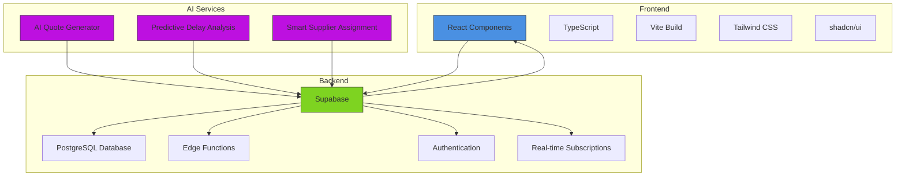
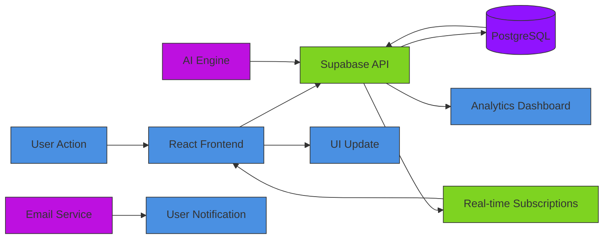
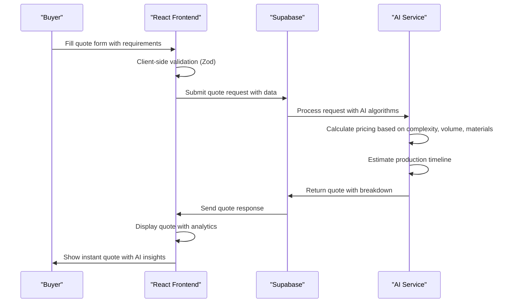
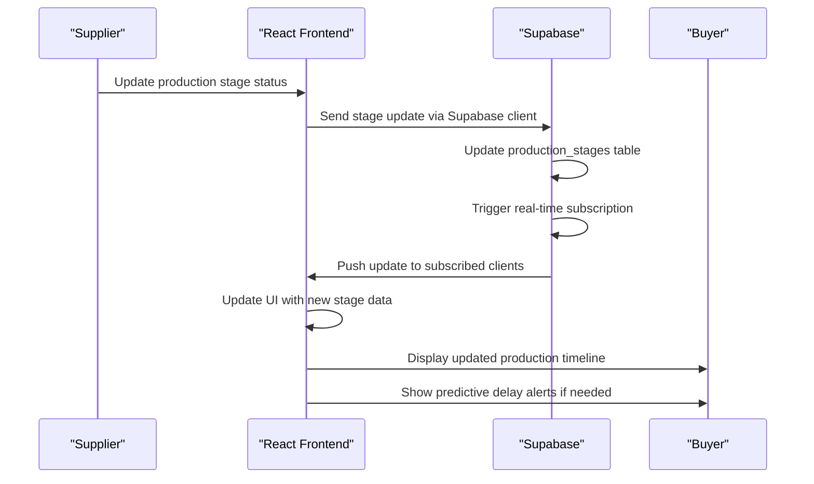

# Project Overview

<cite>
**Referenced Files in This Document**   
- [README.md](file://README.md)
- [package.json](file://package.json)
- [vite.config.ts](file://vite.config.ts)
- [App.tsx](file://src/App.tsx)
- [main.tsx](file://src/main.tsx)
- [client.ts](file://src/integrations/supabase/client.ts)
- [ProductionTracking.tsx](file://src/pages/ProductionTracking.tsx)
- [ProductionStageTimeline.tsx](file://src/components/production/ProductionStageTimeline.tsx)
- [ProductionStageCard.tsx](file://src/components/production/ProductionStageCard.tsx)
- [AIQuoteGenerator.tsx](file://src/components/AIQuoteGenerator.tsx)
- [PredictiveDelayAlert.tsx](file://src/components/production/PredictiveDelayAlert.tsx)
- [SupplierCoordinationPanel.tsx](file://src/components/production/SupplierCoordinationPanel.tsx)
- [ProductionAnalytics.tsx](file://src/components/production/ProductionAnalytics.tsx)
</cite>

## Table of Contents
1. [Introduction](#introduction)
2. [Core Features](#core-features)
3. [Technology Stack](#technology-stack)
4. [Architecture Overview](#architecture-overview)
5. [Implementation Details](#implementation-details)
6. [Workflow Examples](#workflow-examples)
7. [Conclusion](#conclusion)

## Introduction

The sleekapp-v100 project is a comprehensive full-stack platform designed for knitwear manufacturing and supply chain management. This application provides end-to-end visibility and control over the production process, from initial quoting to final delivery, with a focus on transparency, efficiency, and intelligent automation.

The platform serves three primary user roles: buyers (customers placing orders), suppliers (manufacturing partners), and administrators (platform managers). Each role has tailored interfaces and permissions that provide appropriate access to functionality while maintaining data security and workflow integrity.

At its core, the application combines modern frontend technologies with a robust backend infrastructure to deliver real-time data synchronization, AI-powered insights, and seamless user experiences across all touchpoints of the manufacturing lifecycle.

**Section sources**
- [README.md](file://README.md#L1-L362)

## Core Features

### LoopTrace™ Production Tracking

The LoopTrace™ Technology provides real-time production visibility across eight distinct manufacturing stages:

1. **Order Confirmation** - Initial order processing
2. **Fabric Sourcing** - Material procurement tracking
3. **Accessories Procurement** - Component sourcing
4. **Cutting & Pattern Making** - Pre-production setup
5. **Sewing & Assembly** - Main production phase
6. **Quality Control** - Inspection and validation
7. **Finishing & Packaging** - Final touches
8. **Shipment & Delivery** - Logistics tracking

Key capabilities include real-time stage updates with completion percentages, AI-powered predictive delay alerts, multi-supplier coordination panels, automated status notifications, production analytics dashboards, photo documentation at each stage, and direct messaging with suppliers.

### AI Quote Generator

The intelligent quote generation system provides instant pricing and production timelines with AI-powered insights. Key features include:

- Real-time market research integration
- OTP verification for security
- Historical quote comparison
- Alternative material suggestions
- Automated lead capture
- Volume discount calculations
- Complexity-based pricing
- Production timeline estimation

The system analyzes product type, quantity, complexity level, fabric type, and additional requirements to generate accurate quotes with breakdowns of unit pricing, total costs, and delivery timelines.

### Role-Based Access Control

The platform implements a comprehensive role-based access control system with four primary roles:

- **Buyers**: View their orders and track production progress
- **Suppliers**: Update production stages, upload documentation, and communicate with buyers
- **Admin/Staff**: Full oversight and management capabilities across all orders and users
- **Production Partners**: Specialized access for manufacturing partners

Each role has specific permissions that govern what data they can view and what actions they can perform within the system.

**Section sources**
- [README.md](file://README.md#L13-L33)
- [README.md](file://README.md#L38-L45)
- [README.md](file://README.md#L180-L190)

## Technology Stack

### Frontend Architecture

The frontend is built using a modern React-based technology stack:

- **React 18** as the core UI framework, providing component-based architecture and efficient rendering
- **TypeScript** for type safety and enhanced developer experience
- **Vite** as the build tool, offering fast development server startup and optimized production builds
- **shadcn/ui** component library for consistent, accessible UI components
- **Tailwind CSS** for utility-first styling approach
- **Framer Motion** for smooth animations and transitions
- **React Query** for data fetching, caching, and state management

### Backend Infrastructure

The application leverages Supabase as its Backend-as-a-Service (BaaS) solution, which provides:

- **PostgreSQL database** for structured data storage
- **Real-time subscriptions** for live data updates
- **Edge Functions** for serverless computing (Lovable AI)
- **Authentication & Authorization** for secure user management
- **Storage** for file and image management

### Key Libraries and Dependencies

The project utilizes several important libraries:

- **date-fns** for date manipulation and formatting
- **react-router-dom** for client-side routing
- **zod** for schema validation and type checking
- **lucide-react** for consistent iconography
- **@tanstack/react-query** for data fetching and caching
- **@radix-ui/react-* components** for accessible UI primitives

**Section sources**
- [README.md](file://README.md#L59-L81)
- [package.json](file://package.json#L1-L115)

## Architecture Overview

**Diagram sources**
- [App.tsx](file://src/App.tsx#L1-L344)
- [client.ts](file://src/integrations/supabase/client.ts#L1-L20)
- [ProductionTracking.tsx](file://src/pages/ProductionTracking.tsx#L1-L522)

### Data Flow Architecture

The application follows a unidirectional data flow pattern with real-time capabilities:

**Diagram sources**
- [ProductionTracking.tsx](file://src/pages/ProductionTracking.tsx#L63-L88)
- [SupplierCoordinationPanel.tsx](file://src/components/production/SupplierCoordinationPanel.tsx#L48-L67)
- [AIQuoteGenerator.tsx](file://src/components/AIQuoteGenerator.tsx#L156-L165)

## Implementation Details

### Vite Build Configuration

The Vite configuration is optimized for performance with several key features:

- **Code splitting** that separates critical dependencies (React, React Router, React Query) from heavy libraries (Framer Motion, Recharts)
- **Compression** with both gzip and brotli algorithms for production builds
- **CSS optimization** using lightningcss for faster minification
- **Preload transformation** that converts render-blocking CSS links to preload links
- **Bundle analysis** with visualizer plugin to identify optimization opportunities
- **Environment variable management** with secure defaults for Lovable deployment

The configuration implements intelligent chunking to ensure critical initial bundles load quickly while deferring non-essential code.

### TypeScript Configuration

The project uses a comprehensive TypeScript setup with:

- **Strict type checking** enabled
- **ESLint integration** for code quality
- **Prettier formatting** for consistent code style
- **Zod validation** for runtime type safety
- **Database type generation** from Supabase schema

The configuration includes three separate tsconfig files:
- `tsconfig.json` - Base configuration
- `tsconfig.app.json` - Application-specific settings
- `tsconfig.node.json` - Node.js environment settings

### shadcn/ui Component Library

The application leverages shadcn/ui for its component library, which provides:

- **Accessible components** built on Radix UI primitives
- **Customizable styling** through Tailwind CSS
- **Consistent design system** across all UI elements
- **Light/dark mode support** with next-themes
- **Server-side rendering compatibility**

Key components used throughout the application include Card, Button, Input, Select, Tabs, Badge, and Alert, all of which maintain a consistent visual language and interaction pattern.

**Section sources**
- [vite.config.ts](file://vite.config.ts#L1-L216)
- [tsconfig.json](file://tsconfig.json#L1-L10)
- [package.json](file://package.json#L14-L85)

## Workflow Examples

### Quote Generation Workflow

The AI Quote Generator follows a structured workflow to provide instant pricing:

**Diagram sources**
- [AIQuoteGenerator.tsx](file://src/components/AIQuoteGenerator.tsx#L118-L195)
- [aiQuote.ts](file://src/lib/api/aiQuote.ts#L1-L50)

### Production Tracking Workflow

The LoopTrace™ production tracking system enables real-time monitoring:

**Diagram sources**
- [ProductionTracking.tsx](file://src/pages/ProductionTracking.tsx#L63-L88)
- [ProductionStageCard.tsx](file://src/components/production/ProductionStageCard.tsx#L142-L173)
- [ProductionStageTimeline.tsx](file://src/components/production/ProductionStageTimeline.tsx#L52-L71)

## Conclusion

The sleekapp-v100 platform represents a sophisticated solution for knitwear manufacturing and supply chain management, combining modern web technologies with AI-powered insights to create a transparent and efficient production ecosystem.

The architecture effectively leverages React and TypeScript for a robust frontend, Supabase for a comprehensive backend solution, and Vite for optimized builds. The implementation of LoopTrace™ Technology provides unprecedented visibility into the manufacturing process, while the AI Quote Generator streamlines the initial quoting process with intelligent pricing and timeline estimation.

Key strengths of the platform include its real-time data synchronization, role-based access control, and predictive analytics capabilities. The use of established libraries like shadcn/ui and React Query ensures maintainability and scalability, while the Vite configuration optimizes performance for both development and production environments.

This platform successfully addresses the complex challenges of global manufacturing coordination, providing buyers with confidence in their orders and suppliers with the tools they need to deliver quality products on time.

**Section sources**
- [README.md](file://README.md#L1-L362)
- [package.json](file://package.json#L1-L115)
- [vite.config.ts](file://vite.config.ts#L1-L216)