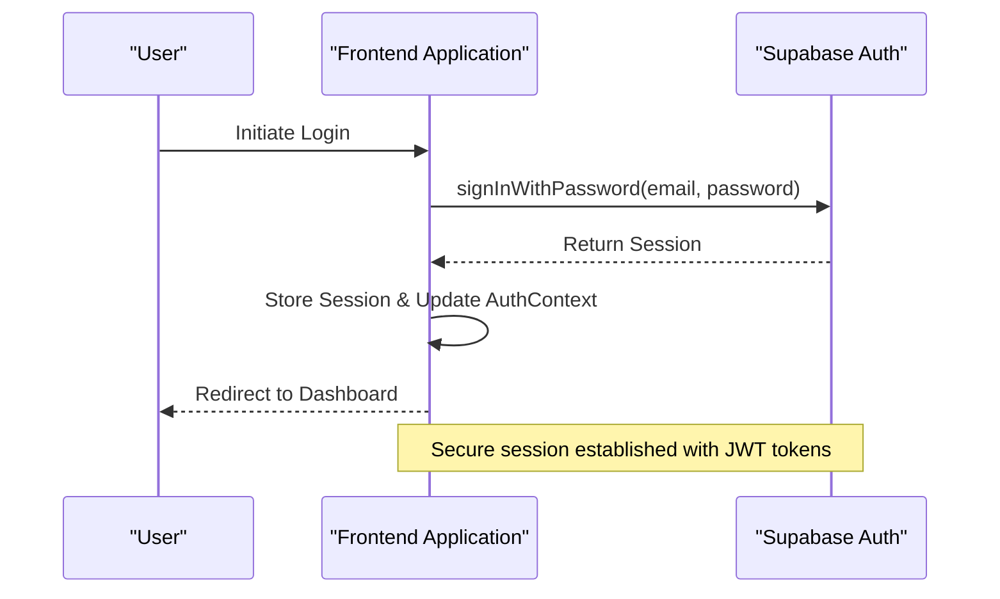
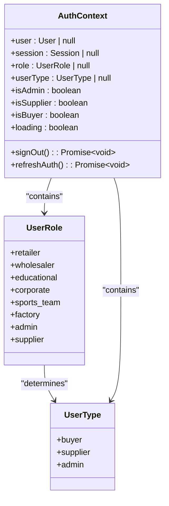
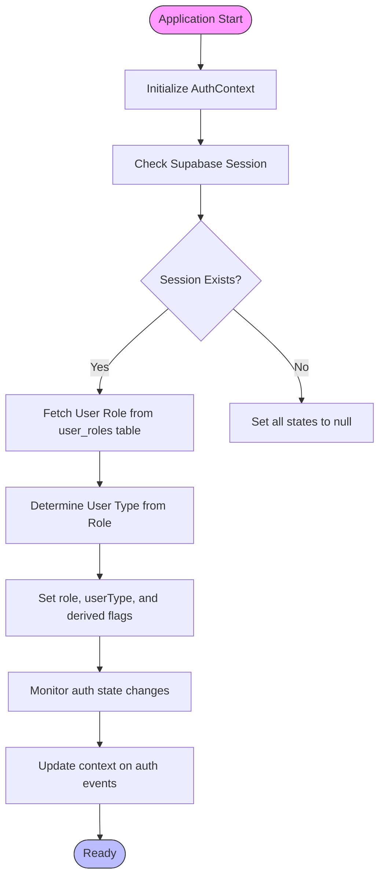
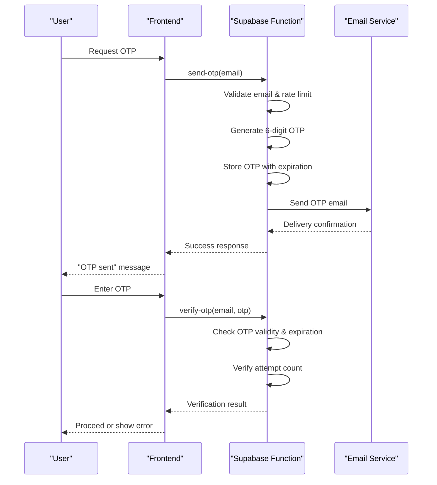
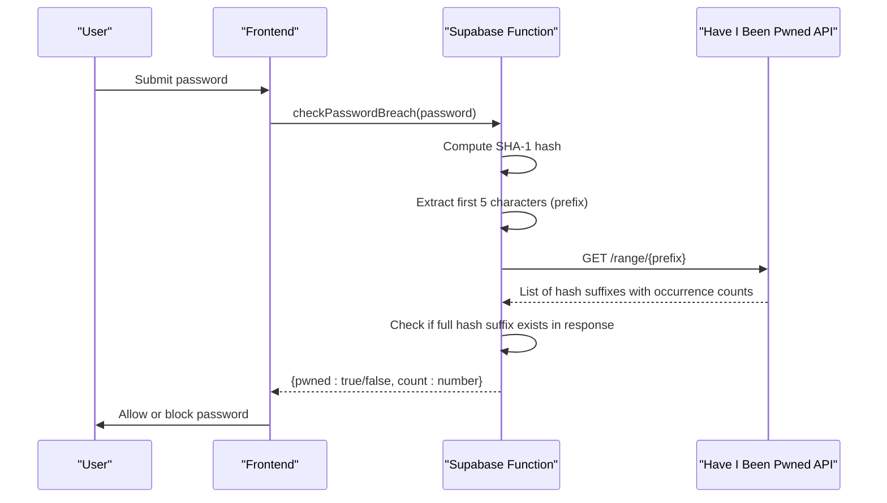
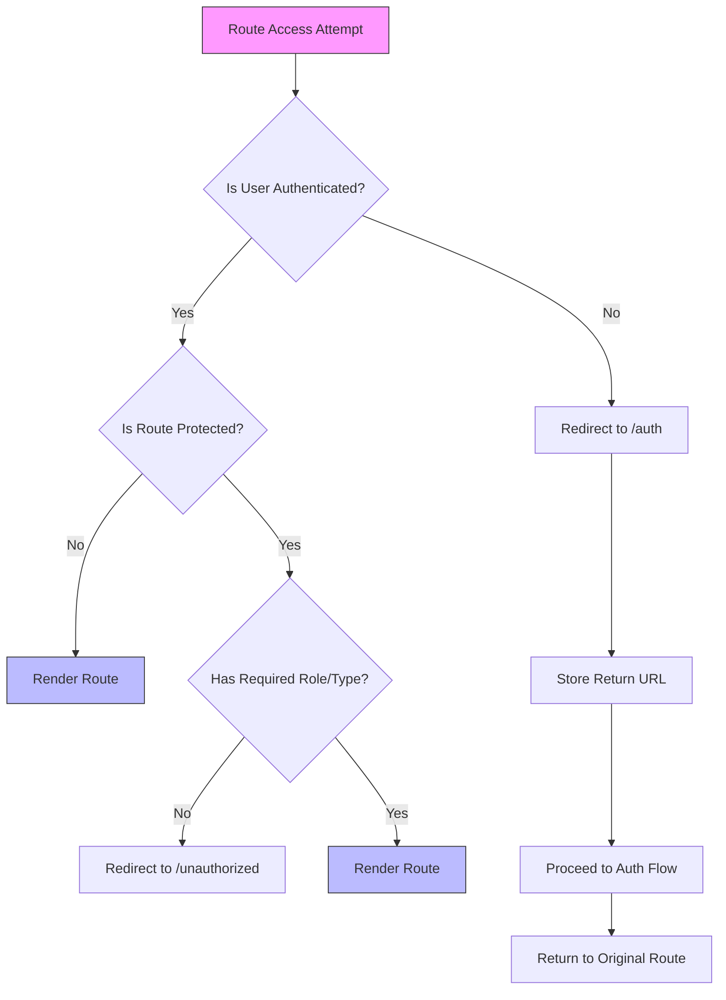
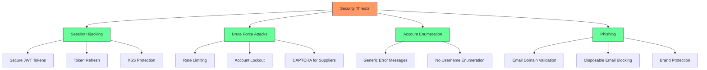

# Authentication and Authorization

<cite>
**Referenced Files in This Document**   
- [AuthContext.tsx](file://src/contexts/AuthContext.tsx)
- [ProtectedRoute.tsx](file://src/components/routes/ProtectedRoute.tsx)
- [RoleBasedRoute.tsx](file://src/components/routes/RoleBasedRoute.tsx)
- [Auth.tsx](file://src/pages/Auth.tsx)
- [client.ts](file://src/integrations/supabase/client.ts)
- [supabaseHelpers.ts](file://src/lib/supabaseHelpers.ts)
- [send-otp/index.ts](file://supabase/functions/send-otp/index.ts)
- [verify-otp/index.ts](file://supabase/functions/verify-otp/index.ts)
- [password-breach-check/index.ts](file://supabase/functions/password-breach-check/index.ts)
- [database.ts](file://src/types/database.ts)
</cite>

## Table of Contents
1. [Introduction](#introduction)
2. [Supabase Auth Implementation](#supabase-auth-implementation)
3. [Role-Based Access Control (RBAC)](#role-based-access-control-rbac)
4. [AuthContext Provider](#authcontext-provider)
5. [OTP-Based Verification Flow](#otp-based-verification-flow)
6. [Password Breach Detection](#password-breach-detection)
7. [Routing-Level Access Control](#routing-level-access-control)
8. [Security Considerations](#security-considerations)
9. [Implementation Guidelines](#implementation-guidelines)

## Introduction
The Sleek Apparels platform implements a robust authentication and authorization system using Supabase Auth with role-based access control (RBAC). This system ensures secure user access, proper role assignment, and granular permission management across different user types. The authentication flow incorporates modern security practices including OTP-based verification and password breach detection to protect user accounts and platform integrity.

**Section sources**
- [AuthContext.tsx](file://src/contexts/AuthContext.tsx)
- [Auth.tsx](file://src/pages/Auth.tsx)

## Supabase Auth Implementation
The authentication system is built on Supabase Auth, which provides a comprehensive identity management solution. The implementation uses Supabase's client library to handle user sessions, authentication states, and token management. The Supabase client is configured with proper security settings including session persistence, automatic token refresh, and localStorage integration.

The authentication flow supports multiple methods including email/password authentication and Google OAuth. When users sign in, the system establishes a secure session that is maintained across application restarts. The Supabase client configuration ensures that authentication tokens are securely stored and automatically refreshed before expiration.

**Diagram sources**
- [client.ts](file://src/integrations/supabase/client.ts)
- [AuthContext.tsx](file://src/contexts/AuthContext.tsx)

**Section sources**
- [client.ts](file://src/integrations/supabase/client.ts)
- [AuthContext.tsx](file://src/contexts/AuthContext.tsx)

## Role-Based Access Control (RBAC)
The platform implements a comprehensive role-based access control system with three primary user roles: admin, supplier, and buyer. These roles are further categorized into user types that determine access to specific application features and data.

The role hierarchy is defined as follows:
- **Admin**: Full access to all platform features, including user management, analytics, and system configuration
- **Supplier**: Access to production management, order fulfillment, and supplier-specific dashboards
- **Buyer**: Access to product browsing, quote requests, order tracking, and buyer-specific features

The RBAC system is implemented through a combination of database-level row-level security (RLS) policies and application-level access control checks. The user roles are stored in a dedicated `user_roles` table that maps user IDs to their assigned roles. This separation allows for flexible role management and easy role assignment changes without modifying user records directly.

**Diagram sources**
- [AuthContext.tsx](file://src/contexts/AuthContext.tsx)
- [database.ts](file://src/types/database.ts)

**Section sources**
- [AuthContext.tsx](file://src/contexts/AuthContext.tsx)
- [database.ts](file://src/types/database.ts)

## AuthContext Provider
The `AuthContext` provider is the central component for managing authentication state throughout the application. It uses React's Context API to make authentication data available to all components without prop drilling. The context provides essential information including the current user, session data, user role, user type, and helper functions for authentication operations.

The `AuthContext` implementation includes several key features:
- **State Management**: Maintains user, session, role, and userType states using React hooks
- **Role Determination**: Automatically determines the user type based on the assigned role
- **Session Refresh**: Provides a `refreshAuth` method to manually refresh authentication state
- **Sign Out**: Implements a secure sign-out function that clears all authentication data

The context also exposes computed properties like `isAdmin`, `isSupplier`, and `isBuyer` that simplify conditional rendering and access control checks in components. These boolean flags are derived from the user's role and type, making it easy to implement role-specific UI elements.

**Diagram sources**
- [AuthContext.tsx](file://src/contexts/AuthContext.tsx)

**Section sources**
- [AuthContext.tsx](file://src/contexts/AuthContext.tsx)

## OTP-Based Verification Flow
The platform implements a secure OTP-based verification flow for critical operations such as account creation and quote generation. This multi-factor authentication approach adds an additional layer of security by requiring users to verify their email address through a time-limited one-time password.

The OTP verification process consists of the following steps:
1. User initiates an action requiring verification (e.g., account creation)
2. System generates a 6-digit OTP and stores it securely with an expiration time
3. OTP is sent to the user's email address via a secure email service
4. User enters the received OTP in the application
5. System verifies the OTP against the stored value and checks expiration
6. If valid, the verification is completed and the original action proceeds

The OTP system includes several security features:
- 10-minute expiration window
- Maximum of 5 verification attempts per OTP
- Rate limiting of 1 request per 5 minutes
- Daily limit of 3 quote requests per email
- Disposable email domain blocking

**Diagram sources**
- [send-otp/index.ts](file://supabase/functions/send-otp/index.ts)
- [verify-otp/index.ts](file://supabase/functions/verify-otp/index.ts)
- [Auth.tsx](file://src/pages/Auth.tsx)

**Section sources**
- [send-otp/index.ts](file://supabase/functions/send-otp/index.ts)
- [verify-otp/index.ts](file://supabase/functions/verify-otp/index.ts)
- [Auth.tsx](file://src/pages/Auth.tsx)

## Password Breach Detection
The platform incorporates a password breach detection mechanism to enhance account security. This feature checks user passwords against known data breaches using the k-anonymity model provided by the "Have I Been Pwned" service, ensuring that passwords are never transmitted in plain text.

When a user creates an account or changes their password, the system performs the following steps:
1. Hashes the password using SHA-1 algorithm
2. Sends only the first 5 characters of the hash to the breach detection service
3. Receives a list of potential matches from the service
4. Compares the full hash locally to determine if the password has been compromised
5. Blocks the password if it appears in any known data breaches

This approach protects user privacy while still providing effective breach detection. The system also enforces strong password policies requiring a minimum of 8 characters with uppercase, lowercase, and numeric characters.

**Diagram sources**
- [password-breach-check/index.ts](file://supabase/functions/password-breach-check/index.ts)
- [Auth.tsx](file://src/pages/Auth.tsx)

**Section sources**
- [password-breach-check/index.ts](file://supabase/functions/password-breach-check/index.ts)
- [Auth.tsx](file://src/pages/Auth.tsx)

## Routing-Level Access Control
The platform implements routing-level access control through two specialized components: `ProtectedRoute` and `RoleBasedRoute`. These components ensure that users can only access routes for which they have appropriate permissions.

The `ProtectedRoute` component serves as a basic authentication gate, ensuring that only authenticated users can access protected routes. If a user is not authenticated, they are redirected to the authentication page while preserving their intended destination in the navigation state.

The `RoleBasedRoute` component provides more granular control by enforcing role-based access restrictions. It can restrict access based on specific roles (e.g., admin, supplier) or user types (e.g., buyer, supplier, admin). The component supports multiple allowed roles or user types, allowing for flexible access control configurations.

Both components display a loading spinner while authentication state is being determined, providing a smooth user experience during the authentication check process.

**Diagram sources**
- [ProtectedRoute.tsx](file://src/components/routes/ProtectedRoute.tsx)
- [RoleBasedRoute.tsx](file://src/components/routes/RoleBasedRoute.tsx)

**Section sources**
- [ProtectedRoute.tsx](file://src/components/routes/ProtectedRoute.tsx)
- [RoleBasedRoute.tsx](file://src/components/routes/RoleBasedRoute.tsx)

## Security Considerations
The authentication system addresses several critical security concerns to protect user accounts and platform integrity:

**Session Hijacking Mitigation**: The system implements multiple measures to prevent session hijacking:
- Secure JWT tokens with expiration and refresh mechanisms
- Automatic token refresh before expiration
- Storage of tokens in secure localStorage with XSS protection
- Immediate token invalidation on sign-out

**Rate Limiting**: To prevent brute force attacks and abuse, the system implements rate limiting at multiple levels:
- 5-minute cooldown between OTP requests
- 1-hour lockout after 3 failed OTP attempts
- Daily limit of 3 quote requests per email

**Input Validation**: All user inputs are rigorously validated:
- Email format validation with comprehensive regex
- Blocking of disposable email domains
- Password strength requirements
- Sanitization of email addresses to prevent header injection

**Audit Logging**: Security-critical actions are logged for monitoring and auditing:
- OTP request and verification attempts
- Failed login attempts
- Role assignment changes
- Admin actions

**Diagram sources**
- [send-otp/index.ts](file://supabase/functions/send-otp/index.ts)
- [verify-otp/index.ts](file://supabase/functions/verify-otp/index.ts)
- [password-breach-check/index.ts](file://supabase/functions/password-breach-check/index.ts)

**Section sources**
- [send-otp/index.ts](file://supabase/functions/send-otp/index.ts)
- [verify-otp/index.ts](file://supabase/functions/verify-otp/index.ts)
- [password-breach-check/index.ts](file://supabase/functions/password-breach-check/index.ts)

## Implementation Guidelines
When adding new features that require authentication or authorization, follow these guidelines to maintain security and consistency:

1. **Use AuthContext**: Always use the `useAuth()` hook to access authentication state rather than implementing custom authentication logic.

2. **Implement Proper Route Protection**: Wrap protected routes with `ProtectedRoute` and use `RoleBasedRoute` for role-specific access control.

3. **Follow Role Hierarchy**: Adhere to the established role hierarchy (admin, supplier, buyer) and user types when designing new features.

4. **Validate User Input**: Implement comprehensive input validation for all user-provided data, especially authentication credentials.

5. **Use Secure Functions**: For security-critical operations, use Supabase functions rather than client-side logic to prevent tampering.

6. **Implement Error Handling**: Provide clear, user-friendly error messages without revealing sensitive information about the authentication system.

7. **Test Edge Cases**: Test authentication flows for edge cases including expired sessions, network failures, and invalid inputs.

8. **Monitor Security Events**: Log security-relevant events and monitor for suspicious activity patterns.

By following these guidelines, new features will integrate seamlessly with the existing authentication system while maintaining the platform's security standards.

**Section sources**
- [AuthContext.tsx](file://src/contexts/AuthContext.tsx)
- [ProtectedRoute.tsx](file://src/components/routes/ProtectedRoute.tsx)
- [RoleBasedRoute.tsx](file://src/components/routes/RoleBasedRoute.tsx)