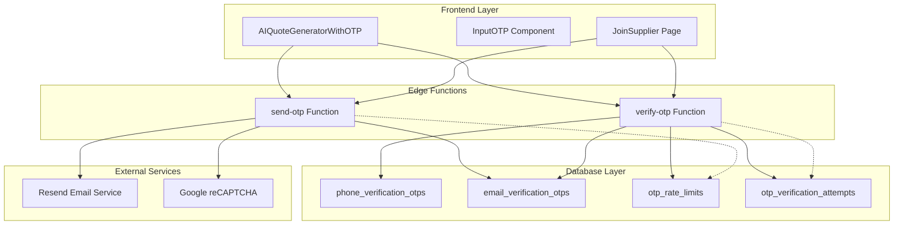
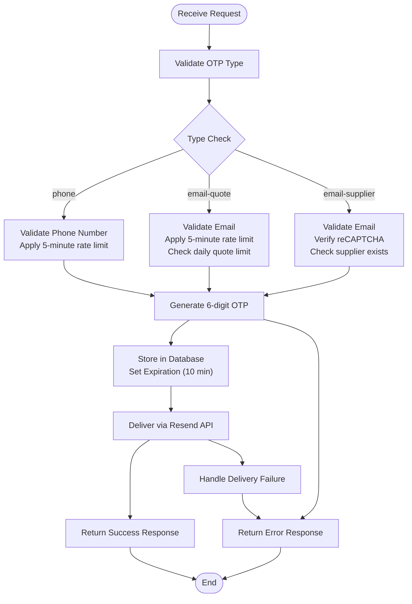
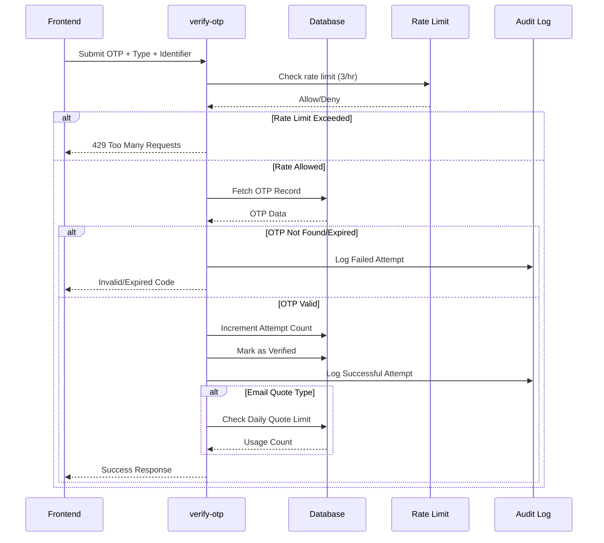
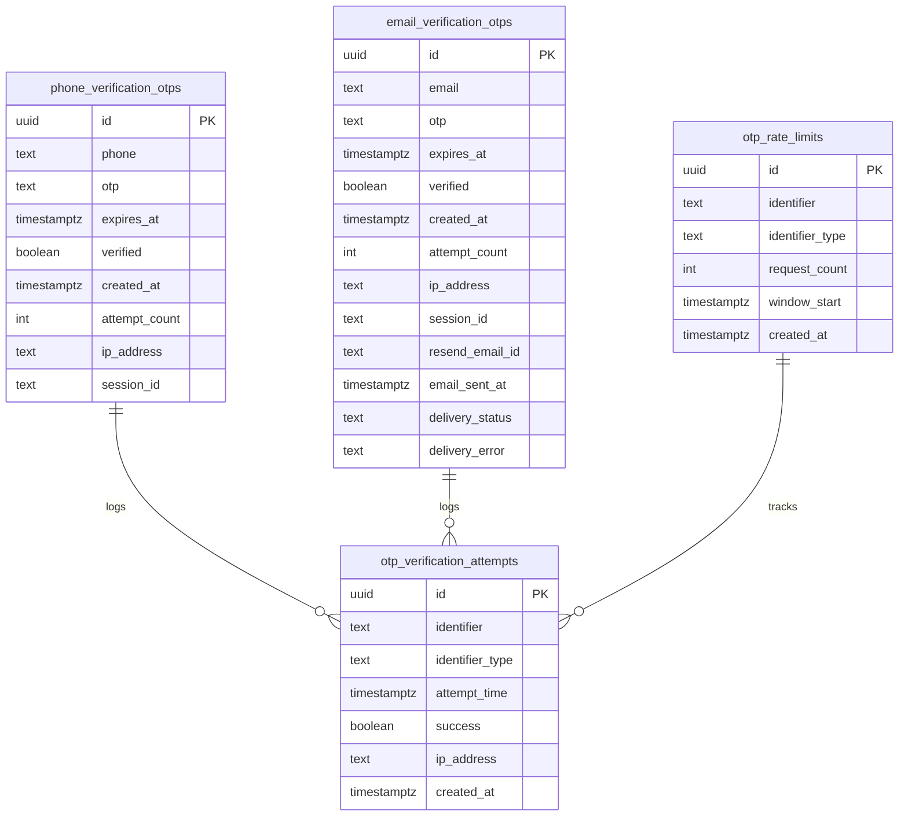

# OTP Verification System

<cite>
**Referenced Files in This Document**
- [send-otp/index.ts](file://supabase/functions/send-otp/index.ts)
- [verify-otp/index.ts](file://supabase/functions/verify-otp/index.ts)
- [AIQuoteGeneratorWithOTP.tsx](file://src/components/AIQuoteGeneratorWithOTP.tsx)
- [JoinSupplier.tsx](file://src/pages/JoinSupplier.tsx)
- [input-otp.tsx](file://src/components/ui/input-otp.tsx)
- [20251115150759_remix_migration_from_pg_dump.sql](file://supabase/migrations/20251115150759_remix_migration_from_pg_dump.sql)
- [20251119140029_887f03c6-bdb2-46d4-ac7b-4b4868f9a169.sql](file://supabase/migrations/20251119140029_887f03c6-bdb2-46d4-ac7b-4b4868f9a169.sql)
</cite>

## Table of Contents
1. [Introduction](#introduction)
2. [System Architecture](#system-architecture)
3. [OTP Types and Use Cases](#otp-types-and-use-cases)
4. [Core Edge Functions](#core-edge-functions)
5. [Rate Limiting and Security](#rate-limiting-and-security)
6. [Frontend Integration](#frontend-integration)
7. [Error Handling and User Experience](#error-handling-and-user-experience)
8. [Database Schema](#database-schema)
9. [Implementation Guidelines](#implementation-guidelines)
10. [Troubleshooting](#troubleshooting)

## Introduction

The OTP (One-Time Password) verification system in SleekApparels provides secure, multi-channel authentication for account access and sensitive operations. Built on Supabase Edge Functions, this system implements comprehensive security measures including rate limiting, email validation, disposable domain blocking, and anti-bot protections.

The system serves three primary use cases:
- **Phone Verification**: For user authentication and profile updates
- **Email Quote Requests**: For generating AI-powered quotes with daily limits
- **Supplier Registration**: For business account creation with CAPTCHA protection

## System Architecture

The OTP system follows a distributed architecture with clear separation of concerns between frontend presentation, backend processing, and database storage.



**Diagram sources**
- [send-otp/index.ts](file://supabase/functions/send-otp/index.ts#L1-L50)
- [verify-otp/index.ts](file://supabase/functions/verify-otp/index.ts#L1-L50)
- [AIQuoteGeneratorWithOTP.tsx](file://src/components/AIQuoteGeneratorWithOTP.tsx#L1-L100)

## OTP Types and Use Cases

The system supports three distinct OTP types, each optimized for specific business requirements:

### Phone OTP
**Use Case**: User authentication, profile updates, and SMS-based verification
- **Characteristics**: 6-digit numeric codes
- **Expiration**: 10 minutes
- **Rate Limit**: 1 attempt per 5 minutes
- **Storage**: `phone_verification_otps` table
- **Security**: IP-based logging, attempt tracking

### Email Quote OTP
**Use Case**: AI quote generation requests with daily quota enforcement
- **Characteristics**: 6-digit numeric codes
- **Expiration**: 10 minutes
- **Rate Limit**: 3 attempts per hour, 3 quotes per day
- **Storage**: `email_verification_otps` table
- **Additional Features**: Daily quote limit tracking, usage analytics

### Email Supplier OTP  
**Use Case**: Business supplier registration with anti-bot protection
- **Characteristics**: 6-digit numeric codes
- **Expiration**: 10 minutes
- **Rate Limit**: 1 attempt per 5 minutes
- **Security**: Google reCAPTCHA integration, disposable email blocking
- **Storage**: `email_verification_otps` table

**Section sources**
- [send-otp/index.ts](file://supabase/functions/send-otp/index.ts#L36-L44)
- [verify-otp/index.ts](file://supabase/functions/verify-otp/index.ts#L12-L18)

## Core Edge Functions

### Send OTP Function

The `send-otp` function handles OTP generation, validation, and delivery for all OTP types.



**Diagram sources**
- [send-otp/index.ts](file://supabase/functions/send-otp/index.ts#L131-L489)

#### Key Features:
- **Comprehensive Email Validation**: Regex-based validation with length checks, format verification, and disposable domain blocking
- **Rate Limiting**: 5-minute window for phone and email OTP requests
- **Retry Logic**: Automatic retry mechanism for transient email delivery failures
- **Security Logging**: Detailed audit trails for all operations
- **CAPTCHA Protection**: Google reCAPTCHA integration for supplier registration

**Section sources**
- [send-otp/index.ts](file://supabase/functions/send-otp/index.ts#L1-L489)

### Verify OTP Function

The `verify-otp` function provides robust verification with multiple security layers.



**Diagram sources**
- [verify-otp/index.ts](file://supabase/functions/verify-otp/index.ts#L26-L356)

#### Security Features:
- **Multi-Level Rate Limiting**: 3 attempts per hour with hourly reset
- **Attempt Tracking**: Per-OTP record maximum of 5 attempts
- **Expiration Checking**: Automatic cleanup of expired codes
- **IP Address Logging**: Comprehensive audit trail for security monitoring
- **Type-Specific Validation**: Different validation rules per OTP type

**Section sources**
- [verify-otp/index.ts](file://supabase/functions/verify-otp/index.ts#L1-L356)

## Rate Limiting and Security

### Rate Limiting Implementation

The system implements a dual-layer rate limiting strategy:

| Component | Phone OTP | Email Quote | Email Supplier |
|-----------|-----------|-------------|----------------|
| **Request Window** | 5 minutes | 5 minutes | 5 minutes |
| **Attempts per Window** | 1 | 1 | 1 |
| **Verification Attempts** | 3/hr (3 attempts) | 3/hr (3 attempts) | 3/hr (3 attempts) |
| **Max Attempts per OTP** | N/A | N/A | N/A |
| **Max Attempts per Record** | N/A | N/A | N/A |
| **Expiration** | 10 minutes | 10 minutes | 10 minutes |

### Security Measures

#### Email Validation and Blocking
- **Regex Validation**: Comprehensive email format checking
- **Length Limits**: 5-254 character constraint
- **Disposable Domain Blocking**: 12 known disposable email providers
- **Format Sanitization**: Header injection attack prevention

#### Anti-Bot Protections
- **reCAPTCHA v3**: Invisible challenge for supplier registration
- **CAPTCHA Token Validation**: Server-side verification
- **Rate Limiting**: Prevents automated abuse

#### Delivery Monitoring
- **Resend API Integration**: Reliable email delivery
- **Delivery Status Tracking**: Pending, sent, failed, bounced
- **Automatic Retry**: Up to 2 retry attempts for transient failures

**Section sources**
- [send-otp/index.ts](file://supabase/functions/send-otp/index.ts#L16-L23)
- [send-otp/index.ts](file://supabase/functions/send-otp/index.ts#L148-L179)

## Frontend Integration

### AIQuoteGeneratorWithOTP Component

The AIQuoteGeneratorWithOTP component demonstrates seamless OTP integration for quote generation.

```mermaid
stateDiagram-v2
[*] --> Form
Form --> OTP : Submit Quote Request
OTP --> Loading : Verify OTP
Loading --> Result : Quote Generated
OTP --> Form : Back to Form
Result --> Form : Generate Another Quote
state OTP {
[*] --> EnterOTP
EnterOTP --> VerifyOTP : Submit 6-digit Code
VerifyOTP --> OTP : Invalid/Expired
VerifyOTP --> Loading : Valid OTP
}
```

**Diagram sources**
- [AIQuoteGeneratorWithOTP.tsx](file://src/components/AIQuoteGeneratorWithOTP.tsx#L175-L345)

#### Key Integration Points:
- **Form Validation**: Zod schema validation before OTP request
- **OTP Input Component**: Custom InputOTP component with visual feedback
- **Toast Notifications**: Real-time status updates
- **State Management**: Multi-step workflow with proper state transitions
- **Error Recovery**: Graceful handling of network and validation errors

**Section sources**
- [AIQuoteGeneratorWithOTP.tsx](file://src/components/AIQuoteGeneratorWithOTP.tsx#L1-L800)

### JoinSupplier Page

The supplier registration flow showcases advanced OTP integration with CAPTCHA protection.

#### Supplier Registration Workflow:
1. **Form Submission**: Email validation and CAPTCHA verification
2. **OTP Request**: Send OTP with reCAPTCHA token
3. **OTP Verification**: Verify code and create user account
4. **Account Creation**: Auto-confirm email and create supplier profile

**Section sources**
- [JoinSupplier.tsx](file://src/pages/JoinSupplier.tsx#L1-L200)

### InputOTP Component

A reusable OTP input component with enhanced UX features:

- **Visual Feedback**: Active slot highlighting, caret animation
- **Accessibility**: Screen reader support, keyboard navigation
- **Validation**: Real-time digit validation, paste handling
- **Styling**: Consistent design system integration

**Section sources**
- [input-otp.tsx](file://src/components/ui/input-otp.tsx#L1-L62)

## Error Handling and User Experience

### Common Error Scenarios

| Error Type | Cause | Frontend Handling | Backend Response |
|------------|-------|-------------------|------------------|
| **Rate Limiting** | Too many requests | "Wait 5 minutes" | 429 status, retryAfter |
| **Expired Code** | Code older than 10 min | "Request new code" | 400 status, retry |
| **Invalid Attempts** | Max attempts reached | "Request new code" | 400 status, retry |
| **Delivery Failure** | Email service error | "Try again later" | 500 status, retry |
| **Network Timeout** | Server unreachable | "Check connection" | 500 status, retry |

### User Experience Enhancements

#### Progressive Loading States
- **Form Submission**: Loading indicators during OTP request
- **OTP Verification**: Stepped loading for quote generation
- **Success Confirmation**: Confetti animation and toast notifications

#### Error Recovery
- **Graceful Degradation**: Fallback to alternative verification methods
- **Clear Messaging**: User-friendly error descriptions
- **Retry Options**: Easy re-attempt mechanisms

#### Accessibility Features
- **Screen Reader Support**: Proper ARIA labels and announcements
- **Keyboard Navigation**: Full keyboard accessibility
- **Visual Feedback**: High contrast and clear visual cues

**Section sources**
- [AIQuoteGeneratorWithOTP.tsx](file://src/components/AIQuoteGeneratorWithOTP.tsx#L217-L235)
- [JoinSupplier.tsx](file://src/pages/JoinSupplier.tsx#L114-L125)

## Database Schema

### OTP Tables Structure



**Diagram sources**
- [20251115150759_remix_migration_from_pg_dump.sql](file://supabase/migrations/20251115150759_remix_migration_from_pg_dump.sql#L1351-L1361)
- [20251115150759_remix_migration_from_pg_dump.sql](file://supabase/migrations/20251115150759_remix_migration_from_pg_dump.sql#L1322-L1329)

### Delivery Tracking Enhancement

The email delivery tracking system provides comprehensive monitoring:

| Column | Purpose | Values | Index |
|--------|---------|--------|-------|
| `resend_email_id` | API tracking | Resend message ID | Yes |
| `email_sent_at` | Delivery timestamp | ISO datetime | Yes |
| `delivery_status` | Current status | pending, sent, failed, bounced, delivered | Yes |
| `delivery_error` | Error details | Error message | No |

**Section sources**
- [20251119140029_887f03c6-bdb2-46d4-ac7b-4b4868f9a169.sql](file://supabase/migrations/20251119140029_887f03c6-bdb2-46d4-ac7b-4b4868f9a169.sql#L1-L21)

## Implementation Guidelines

### Adding New Secure Features

When implementing new features requiring OTP verification:

#### 1. Choose Appropriate OTP Type
- **Phone OTP**: User authentication, profile updates
- **Email Quote**: AI quote generation, promotional offers
- **Email Supplier**: Business registrations, partner onboarding

#### 2. Implement Frontend Integration
```typescript
// Example integration pattern
const handleOTPRequest = async () => {
  const { data, error } = await supabase.functions.invoke('send-otp', {
    body: {
      type: 'email-quote', // or 'phone', 'email-supplier'
      email: userEmail,
      // Additional parameters as needed
    }
  });
};
```

#### 3. Configure Rate Limits
- Review and adjust rate limiting parameters in the respective Edge Function
- Consider business requirements for attempt limits and windows

#### 4. Implement Error Handling
- Provide clear user feedback for all error scenarios
- Implement graceful fallback mechanisms
- Log errors for monitoring and debugging

#### 5. Security Considerations
- Validate all input parameters
- Implement proper sanitization
- Use HTTPS for all communications
- Monitor for suspicious activity

### Best Practices

#### Performance Optimization
- **Caching**: Cache frequently accessed rate limit data
- **Batch Operations**: Group related database operations
- **Connection Pooling**: Optimize database connections

#### Monitoring and Maintenance
- **Logging**: Comprehensive audit trails for all operations
- **Alerting**: Notify on rate limit breaches and failures
- **Cleanup**: Regular cleanup of expired OTP records
- **Testing**: Automated testing of all error scenarios

## Troubleshooting

### Common Issues and Solutions

#### OTP Delivery Failures
**Symptoms**: Users don't receive verification emails
**Causes**: 
- Email service configuration issues
- Disposable domain blocking
- Network connectivity problems

**Solutions**:
1. Verify RESEND_API_KEY configuration
2. Check disposable domain blacklist
3. Implement retry logic with exponential backoff
4. Monitor Resend API status

#### Rate Limiting Problems
**Symptoms**: Users receive "too many requests" errors
**Causes**:
- Aggressive rate limiting
- Client-side caching issues
- Server clock synchronization problems

**Solutions**:
1. Adjust rate limiting thresholds
2. Implement client-side caching
3. Synchronize server clocks
4. Monitor rate limit violations

#### Verification Failures
**Symptoms**: Valid OTPs rejected
**Causes**:
- Timing issues
- Database synchronization problems
- Incorrect expiration handling

**Solutions**:
1. Implement proper timezone handling
2. Add database consistency checks
3. Review expiration logic
4. Add comprehensive logging

### Debugging Tools

#### Development Environment
- **Debug OTP**: Enable debug mode for development
- **Local Testing**: Mock external services
- **Logging**: Comprehensive audit trails

#### Production Monitoring
- **Rate Limit Alerts**: Monitor for breaches
- **Delivery Failures**: Track email delivery issues
- **Security Events**: Monitor for suspicious activity
- **Performance Metrics**: Track response times

### Support Procedures

#### Escalation Path
1. **Level 1**: Frontend validation errors
2. **Level 2**: Backend processing issues
3. **Level 3**: Infrastructure problems
4. **Level 4**: Security incidents

#### Incident Response
- **Detection**: Automated monitoring alerts
- **Assessment**: Impact evaluation
- **Resolution**: Systematic problem solving
- **Prevention**: Root cause analysis and fixes

**Section sources**
- [send-otp/index.ts](file://supabase/functions/send-otp/index.ts#L96-L102)
- [verify-otp/index.ts](file://supabase/functions/verify-otp/index.ts#L67-L88)