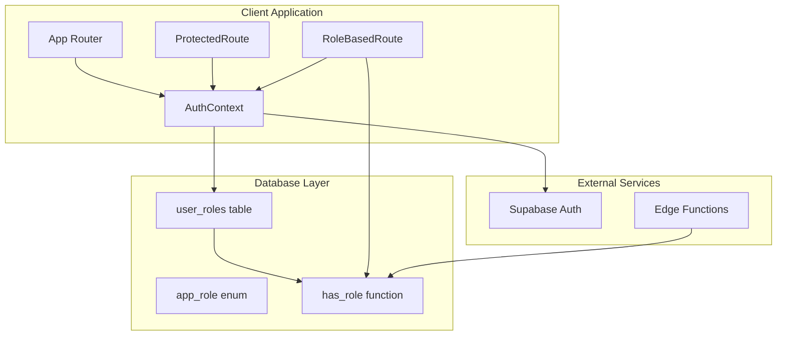
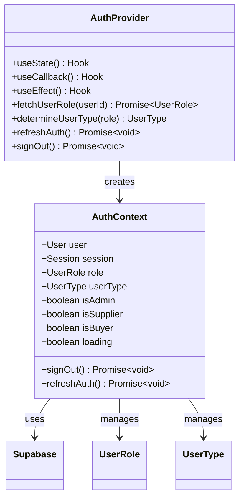
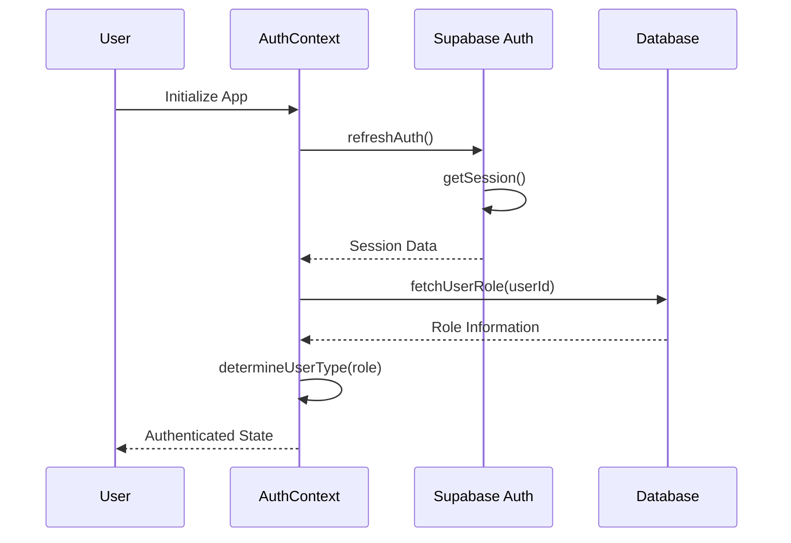
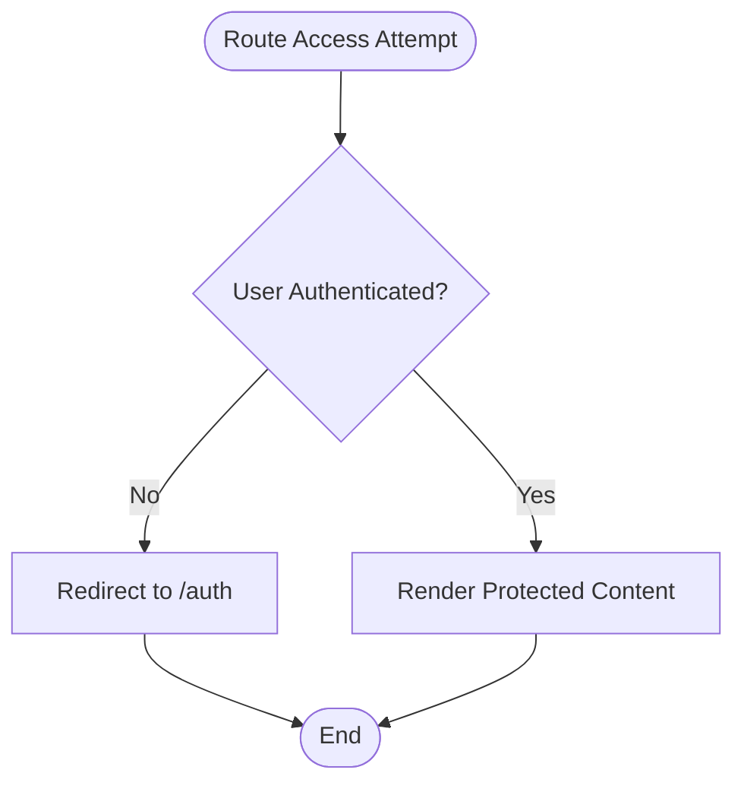
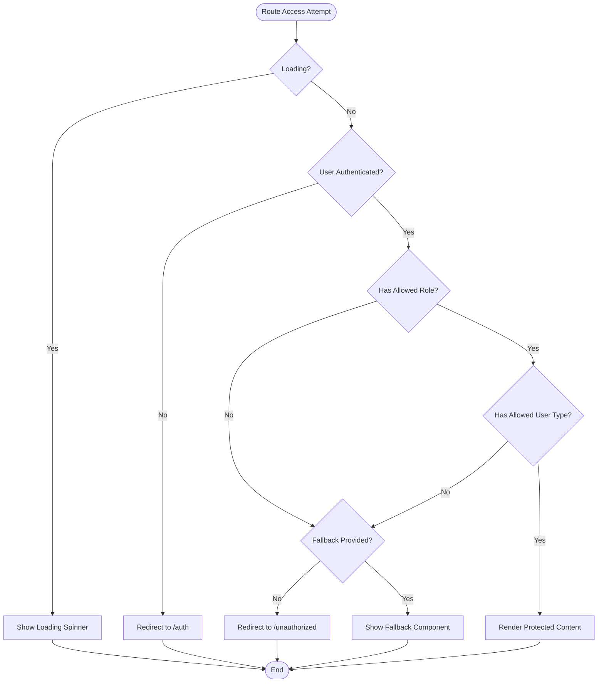
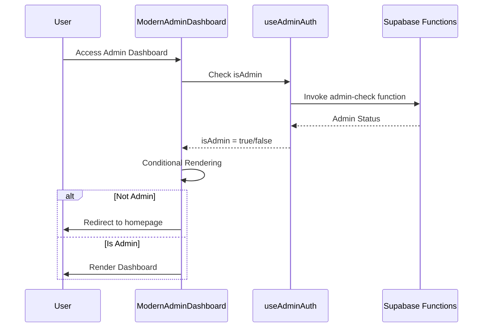
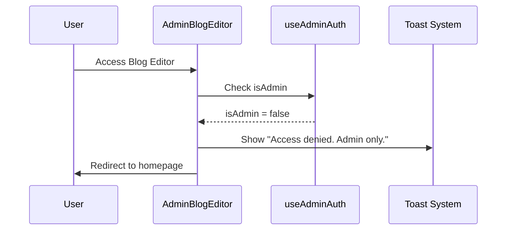
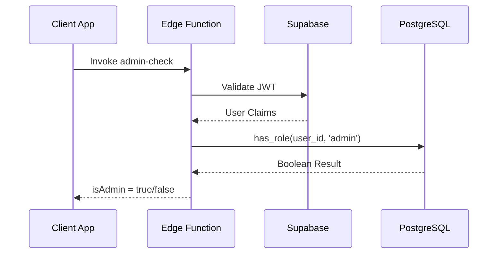
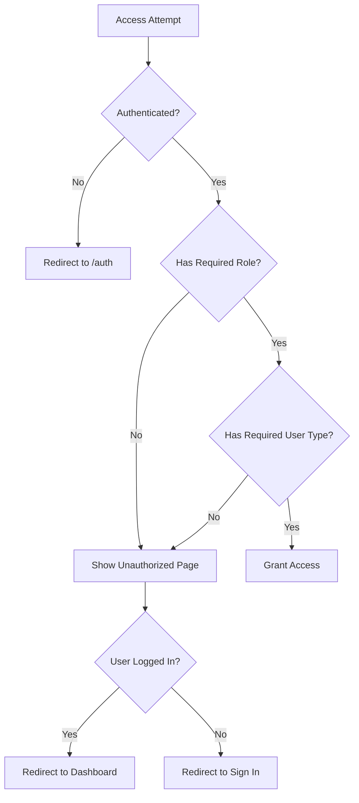

# Role-Based Access Control

<cite>
**Referenced Files in This Document**
- [AuthContext.tsx](file://src/contexts/AuthContext.tsx)
- [RoleBasedRoute.tsx](file://src/components/routes/RoleBasedRoute.tsx)
- [ProtectedRoute.tsx](file://src/components/routes/ProtectedRoute.tsx)
- [App.tsx](file://src/App.tsx)
- [ModernAdminDashboard.tsx](file://src/pages/ModernAdminDashboard.tsx)
- [AdminBlogEditor.tsx](file://src/pages/AdminBlogEditor.tsx)
- [Unauthorized.tsx](file://src/pages/Unauthorized.tsx)
- [useAdminAuth.ts](file://src/hooks/useAdminAuth.ts)
- [database.ts](file://src/types/database.ts)
- [20251115150759_remix_migration_from_pg_dump.sql](file://supabase/migrations/20251115150759_remix_migration_from_pg_dump.sql)
</cite>

## Table of Contents
1. [Introduction](#introduction)
2. [System Architecture](#system-architecture)
3. [User Roles and Types](#user-roles-and-types)
4. [Authentication Context](#authentication-context)
5. [Access Control Components](#access-control-components)
6. [Route Protection Implementation](#route-protection-implementation)
7. [Database Schema and Functions](#database-schema-and-functions)
8. [Common Access Control Patterns](#common-access-control-patterns)
9. [Error Handling and Redirection](#error-handling-and-redirection)
10. [Extending the System](#extending-the-system)
11. [Best Practices](#best-practices)

## Introduction

The Sleek Apparels platform implements a sophisticated role-based access control (RBAC) system that provides granular permissions based on both user roles and user types. This system ensures that users can only access resources and perform actions appropriate to their assigned permissions, maintaining security and operational integrity across the platform.

The RBAC system operates through three primary layers:
- **Authentication Layer**: Manages user sessions and role retrieval
- **Authorization Layer**: Enforces access control decisions
- **Presentation Layer**: Provides protected routing and UI components

## System Architecture

The RBAC system follows a multi-layered architecture that separates concerns and provides flexible access control mechanisms.



**Diagram sources**
- [AuthContext.tsx](file://src/contexts/AuthContext.tsx#L40-L166)
- [ProtectedRoute.tsx](file://src/components/routes/ProtectedRoute.tsx#L14-L36)
- [RoleBasedRoute.tsx](file://src/components/routes/RoleBasedRoute.tsx#L17-L60)

## User Roles and Types

The platform defines a comprehensive set of user roles and types that determine access levels and functionality availability.

### User Roles (UserRole Type)

The system recognizes seven distinct user roles stored in the `user_roles` table:

| Role | Description | Access Level |
|------|-------------|--------------|
| `admin` | Platform administrators with full system control | Highest privilege level |
| `supplier` | Manufacturing partners with production capabilities | Medium privilege level |
| `factory` | Specialized manufacturing facilities | Medium privilege level |
| `retailer` | Business customers purchasing products | Basic privilege level |
| `wholesaler` | Bulk purchasers and distributors | Basic privilege level |
| `educational` | Educational institutions and schools | Basic privilege level |
| `corporate` | Corporate clients and enterprise buyers | Basic privilege level |
| `sports_team` | Sports organizations and teams | Basic privilege level |

### User Types (UserType Type)

The system categorizes users into three primary user types for simplified access control:

| User Type | Roles Included | Dashboard Access |
|-----------|----------------|------------------|
| `admin` | `admin` role only | Admin Dashboard |
| `supplier` | `supplier`, `factory` roles | Supplier Dashboard |
| `buyer` | `retailer`, `wholesaler`, `educational`, `corporate`, `sports_team` roles | Buyer Dashboard |

**Section sources**
- [AuthContext.tsx](file://src/contexts/AuthContext.tsx#L5-L15)
- [database.ts](file://src/types/database.ts#L5-L6)

## Authentication Context

The `AuthContext` serves as the central hub for authentication and authorization state management, providing reactive access to user information and permissions.

### Context Structure



**Diagram sources**
- [AuthContext.tsx](file://src/contexts/AuthContext.tsx#L17-L166)

### Role Resolution Logic

The system implements intelligent role resolution that maps raw user roles to user types:

```typescript
// Role to User Type Mapping Logic
const determineUserType = (role: UserRole | null): UserType | null => {
  if (!role) return null;
  
  if (role === 'admin') return 'admin';
  if (role === 'supplier' || role === 'factory') return 'supplier';
  // retailer, wholesaler, educational, corporate, sports_team are buyers
  return 'buyer';
};
```

### Authentication Flow

The authentication process follows a reactive pattern that maintains synchronization between client state and server-side authentication:



**Diagram sources**
- [AuthContext.tsx](file://src/contexts/AuthContext.tsx#L76-L106)

**Section sources**
- [AuthContext.tsx](file://src/contexts/AuthContext.tsx#L40-L166)

## Access Control Components

The platform provides two primary components for enforcing access control: `ProtectedRoute` and `RoleBasedRoute`.

### ProtectedRoute Component

Provides basic authentication protection for routes requiring user authentication:



**Diagram sources**
- [ProtectedRoute.tsx](file://src/components/routes/ProtectedRoute.tsx#L14-L36)

### RoleBasedRoute Component

Enforces granular access control based on both roles and user types:



**Diagram sources**
- [RoleBasedRoute.tsx](file://src/components/routes/RoleBasedRoute.tsx#L17-L60)

### Component Interface

Both components provide a consistent interface for access control:

| Property | Type | Description |
|----------|------|-------------|
| `children` | `React.ReactNode` | Content to render if access granted |
| `allowedRoles` | `UserRole[]` | Array of allowed roles (optional) |
| `allowedUserTypes` | `UserType[]` | Array of allowed user types (optional) |
| `redirectTo` | `string` | Redirect path if access denied (default: `/unauthorized`) |
| `fallback` | `React.ReactNode` | Alternative content if access denied (optional) |

**Section sources**
- [RoleBasedRoute.tsx](file://src/components/routes/RoleBasedRoute.tsx#L5-L11)
- [ProtectedRoute.tsx](file://src/components/routes/ProtectedRoute.tsx#L5-L8)

## Route Protection Implementation

The platform implements comprehensive route protection through the main application router, demonstrating various access control patterns.

### Admin-Only Routes

Admin routes require the `admin` role and provide access to administrative functionality:

```typescript
// Example from App.tsx
{
  path: "/admin",
  element: <RoleBasedRoute allowedRoles={['admin']}><ModernAdminDashboard /></RoleBasedRoute>
},
{
  path: "/admin/blog/new",
  element: <RoleBasedRoute allowedRoles={['admin']}><AdminBlogEditor /></RoleBasedRoute>
}
```

### User-Type Specific Routes

Routes are protected based on user type rather than specific roles:

```typescript
// Buyer Dashboard - accessible to all buyer roles
{
  path: "/dashboard",
  element: <RoleBasedRoute allowedUserTypes={['buyer']}><ModernBuyerDashboard /></RoleBasedRoute>
},

// Supplier Dashboard - accessible to supplier and factory roles
{
  path: "/supplier-dashboard-modern",
  element: <RoleBasedRoute allowedUserTypes={['supplier']}><ModernSupplierDashboard /></RoleBasedRoute>
}
```

### Mixed Access Patterns

Some routes require either specific roles OR user types:

```typescript
// General authenticated routes accessible to all logged-in users
{
  path: "/settings",
  element: <ProtectedRoute><UserSettings /></ProtectedRoute>
}
```

### Real-World Implementation Examples

#### ModernAdminDashboard Protection

The admin dashboard demonstrates comprehensive access control with runtime checks:



**Diagram sources**
- [ModernAdminDashboard.tsx](file://src/pages/ModernAdminDashboard.tsx#L123-L152)
- [useAdminAuth.ts](file://src/hooks/useAdminAuth.ts#L14-L46)

#### AdminBlogEditor Protection

The blog editor showcases inline access control with immediate feedback:



**Diagram sources**
- [AdminBlogEditor.tsx](file://src/pages/AdminBlogEditor.tsx#L18-L41)

**Section sources**
- [App.tsx](file://src/App.tsx#L213-L242)
- [ModernAdminDashboard.tsx](file://src/pages/ModernAdminDashboard.tsx#L123-L152)
- [AdminBlogEditor.tsx](file://src/pages/AdminBlogEditor.tsx#L18-L41)

## Database Schema and Functions

The RBAC system relies on PostgreSQL functions and policies for server-side enforcement of access controls.

### Database Schema

The `user_roles` table stores the relationship between users and their assigned roles:

| Column | Type | Description |
|--------|------|-------------|
| `id` | `uuid` | Primary key |
| `user_id` | `uuid` | Foreign key to Supabase auth.users |
| `role` | `app_role` | Role enumeration |
| `created_at` | `timestampz` | Record creation timestamp |

### Role Checking Functions

The system provides several PostgreSQL functions for role validation:

#### has_role Function

```sql
CREATE FUNCTION public.has_role(_user_id uuid, _role app_role) 
RETURNS boolean
LANGUAGE sql STABLE SECURITY DEFINER
SET search_path TO 'public'
AS $$
  SELECT EXISTS (
    SELECT 1
    FROM public.user_roles
    WHERE user_id = _user_id
      AND role = _role
  )
$$;
```

#### has_any_role Function

```sql
CREATE FUNCTION public.has_any_role(_user_id uuid, _roles app_role[])
RETURNS boolean
LANGUAGE sql STABLE SECURITY DEFINER
SET search_path TO 'public'
AS $$
  SELECT EXISTS (
    SELECT 1 
    FROM public.user_roles
    WHERE user_id = _user_id 
      AND role = ANY(_roles)
  )
$$;
```

### Edge Function Validation

For critical administrative functions, the system uses edge functions for additional security:



**Diagram sources**
- [useAdminAuth.ts](file://src/hooks/useAdminAuth.ts#L25-L35)

**Section sources**
- [20251115150759_remix_migration_from_pg_dump.sql](file://supabase/migrations/20251115150759_remix_migration_from_pg_dump.sql#L133-L381)

## Common Access Control Patterns

The platform implements several common patterns for access control that developers can leverage.

### Pattern 1: Role-Based Access Control

Protect routes that require specific roles:

```typescript
// Protect admin-only routes
<Route path="/admin" element={
  <RoleBasedRoute allowedRoles={['admin']}>
    <AdminDashboard />
  </RoleBasedRoute>
} />
```

### Pattern 2: User Type-Based Access Control

Protect routes based on user classification:

```typescript
// Protect supplier-specific routes
<Route path="/supplier-dashboard" element={
  <RoleBasedRoute allowedUserTypes={['supplier']}>
    <SupplierDashboard />
  </RoleBasedRoute>
} />
```

### Pattern 3: Mixed Access Control

Combine role and user type restrictions:

```typescript
// Protect routes requiring both admin role AND admin user type
<Route path="/admin/settings" element={
  <RoleBasedRoute 
    allowedRoles={['admin']}
    allowedUserTypes={['admin']}
  >
    <AdminSettings />
  </RoleBasedRoute>
} />
```

### Pattern 4: Fallback Content

Provide alternative content when access is denied:

```typescript
<Route path="/restricted" element={
  <RoleBasedRoute 
    allowedRoles={['admin']}
    fallback={<p>You don't have access to this content</p>}
  >
    <RestrictedContent />
  </RoleBasedRoute>
} />
```

### Pattern 5: Inline Access Control

Implement access control within components:

```typescript
// In component that requires admin access
const { isAdmin, loading } = useAdminAuth();

if (loading) {
  return <LoadingSpinner />;
}

if (!isAdmin) {
  toast.error("Access denied. Admin only.");
  navigate("/");
  return null;
}
```

## Error Handling and Redirection

The RBAC system implements comprehensive error handling and user-friendly redirection mechanisms.

### Unauthorized Access Handling

When users attempt to access restricted resources, the system provides clear feedback and appropriate redirection:



**Diagram sources**
- [Unauthorized.tsx](file://src/pages/Unauthorized.tsx#L8-L26)

### Unauthorized Page Features

The unauthorized page provides contextual navigation based on user state:

| User State | Navigation Options |
|------------|-------------------|
| Not authenticated | "Sign In" button to authentication page |
| Admin user | "Go to Dashboard" button to admin panel |
| Supplier user | "Go to Dashboard" button to supplier panel |
| Buyer user | "Go to Dashboard" button to buyer panel |
| No user | "Go to Dashboard" button to homepage |

### Error Messages and Feedback

The system provides clear error messages for different scenarios:

- **Authentication Required**: "Please sign in to access this page"
- **Permission Denied**: "You don't have permission to access this page"
- **Account Issues**: "Please check your account permissions"

**Section sources**
- [Unauthorized.tsx](file://src/pages/Unauthorized.tsx#L8-L108)

## Extending the System

Adding new roles or modifying access permissions requires careful consideration of the existing architecture and security implications.

### Adding New Roles

To add a new role to the system:

1. **Update Database Schema**: Add the new role to the `app_role` enum in the database
2. **Update TypeScript Types**: Add the role to the `UserRole` type in `database.ts`
3. **Update Role Mapping**: Modify the `determineUserType` function in `AuthContext.tsx`
4. **Update Access Controls**: Add the new role to relevant route protections

### Creating New User Types

To introduce new user types:

1. **Define Type Logic**: Update the `determineUserType` function to include new role mappings
2. **Update Route Protections**: Add new user type restrictions to routes
3. **Update UI Components**: Modify dashboards and interfaces to handle new user types

### Modifying Access Permissions

When adjusting existing permissions:

1. **Database Changes**: Update role assignments in the `user_roles` table
2. **Function Updates**: Modify PostgreSQL functions if needed
3. **Client-Side Changes**: Update route protections and component access logic
4. **Testing**: Thoroughly test all affected routes and functionality

### Security Considerations

When extending the system:

- **Principle of Least Privilege**: Grant minimal necessary permissions
- **Defense in Depth**: Combine multiple access control mechanisms
- **Audit Logging**: Log all access control decisions
- **Regular Reviews**: Periodically review role assignments and permissions

## Best Practices

### Implementation Guidelines

1. **Use Appropriate Components**: Choose between `ProtectedRoute` and `RoleBasedRoute` based on requirements
2. **Combine Access Controls**: Use both role and user type restrictions when necessary
3. **Provide Fallback Content**: Offer alternative content for denied access
4. **Implement Graceful Degradation**: Handle loading states and errors appropriately
5. **Use Consistent Patterns**: Maintain uniform access control patterns throughout the application

### Security Best Practices

1. **Server-Side Validation**: Never rely solely on client-side access control
2. **Edge Function Validation**: Use edge functions for critical administrative operations
3. **Audit Logging**: Log all access control decisions and user actions
4. **Regular Permission Reviews**: Periodically review and update role assignments
5. **Principle of Least Privilege**: Grant minimal necessary permissions

### Performance Considerations

1. **Efficient Database Queries**: Use appropriate indexes on `user_roles` table
2. **Caching Strategies**: Cache role information where appropriate
3. **Lazy Loading**: Load access control components only when needed
4. **Optimized Functions**: Ensure PostgreSQL functions are properly indexed

### User Experience Guidelines

1. **Clear Error Messages**: Provide helpful feedback for access denials
2. **Contextual Navigation**: Offer appropriate redirect options
3. **Loading States**: Show loading indicators during authentication checks
4. **Graceful Degradation**: Handle network failures gracefully