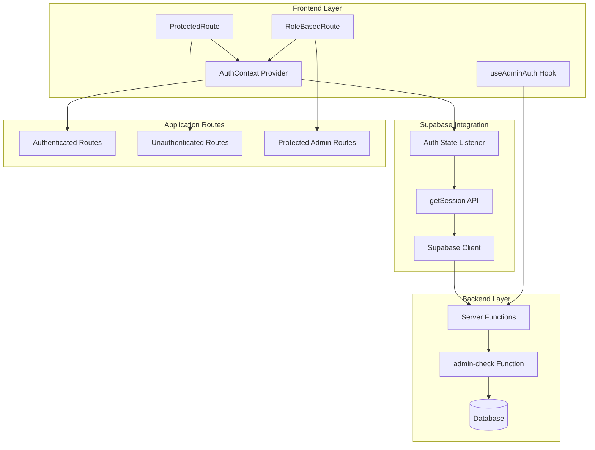
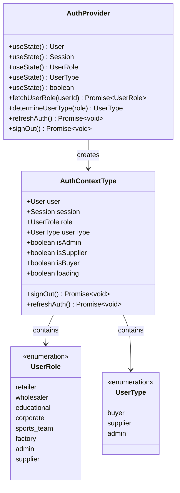
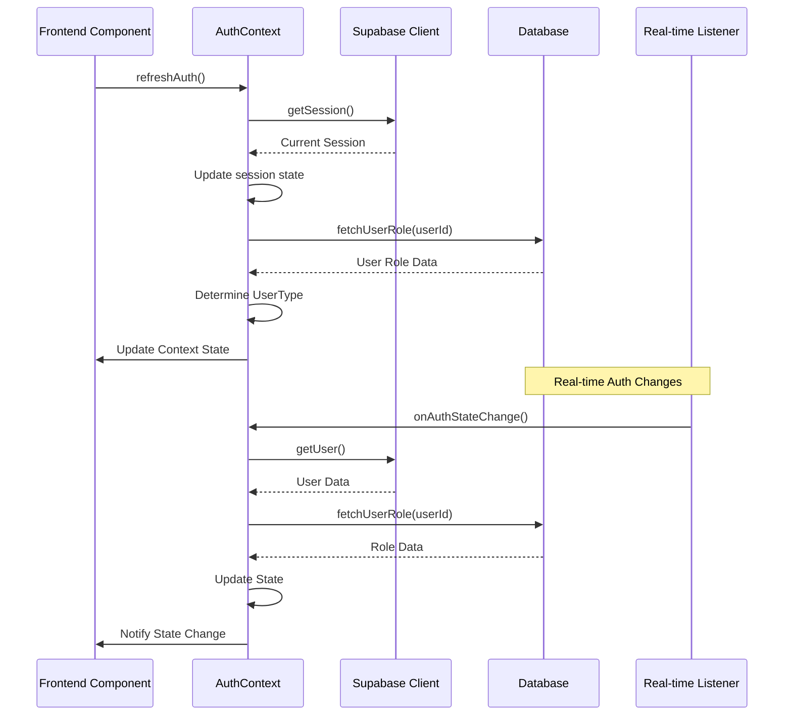
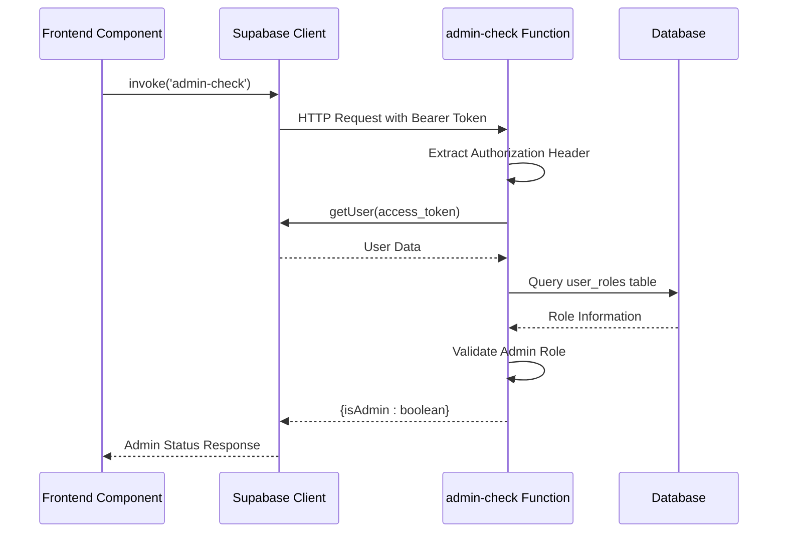
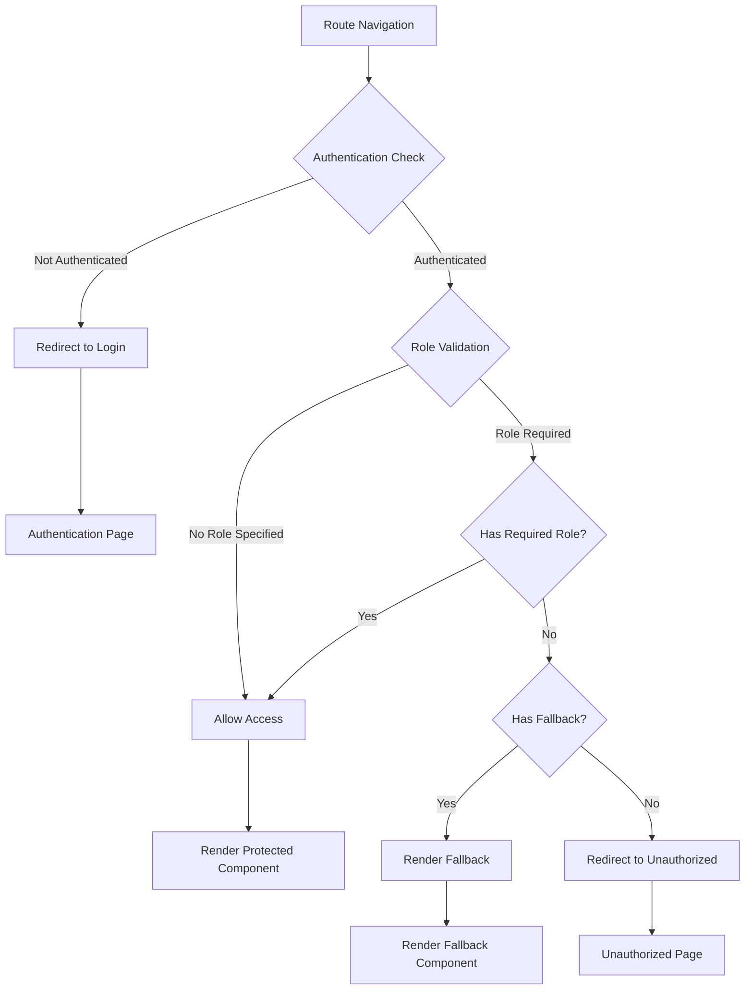

# Session Management

<cite>
**Referenced Files in This Document**
- [AuthContext.tsx](file://src/contexts/AuthContext.tsx)
- [admin-check/index.ts](file://supabase/functions/admin-check/index.ts)
- [useAdminAuth.ts](file://src/hooks/useAdminAuth.ts)
- [ProtectedRoute.tsx](file://src/components/routes/ProtectedRoute.tsx)
- [RoleBasedRoute.tsx](file://src/components/routes/RoleBasedRoute.tsx)
- [client.ts](file://src/integrations/supabase/client.ts)
- [AdminAnalytics.tsx](file://src/pages/AdminAnalytics.tsx)
- [App.tsx](file://src/App.tsx)
- [supabaseHelpers.ts](file://src/lib/supabaseHelpers.ts)
</cite>

## Table of Contents
1. [Introduction](#introduction)
2. [System Architecture](#system-architecture)
3. [AuthContext Implementation](#authcontext-implementation)
4. [Session State Management](#session-state-management)
5. [Server-Side Admin Validation](#server-side-admin-validation)
6. [Route Protection System](#route-protection-system)
7. [Common Issues and Solutions](#common-issues-and-solutions)
8. [Best Practices](#best-practices)
9. [Testing and Debugging](#testing-and-debugging)
10. [Conclusion](#conclusion)

## Introduction

The Sleek Apparels platform implements a sophisticated session management system built on Supabase's authentication framework. This system ensures secure, persistent authentication across page reloads while providing granular role-based access control for different user types including buyers, suppliers, and administrators. The implementation combines real-time session synchronization with server-side validation to maintain security boundaries between frontend and backend components.

The session management system operates through multiple layers: a React context for state management, Supabase's native auth listeners for real-time updates, serverless functions for privileged operations, and route protection mechanisms that enforce access controls based on user roles and permissions.

## System Architecture

The session management system follows a multi-layered architecture that separates concerns between authentication state, authorization enforcement, and security validation:

**Diagram sources**
- [AuthContext.tsx](file://src/contexts/AuthContext.tsx#L40-L165)
- [ProtectedRoute.tsx](file://src/components/routes/ProtectedRoute.tsx#L14-L35)
- [RoleBasedRoute.tsx](file://src/components/routes/RoleBasedRoute.tsx#L17-L59)
- [admin-check/index.ts](file://supabase/functions/admin-check/index.ts#L8-L74)

## AuthContext Implementation

The AuthContext serves as the central hub for authentication state management, providing a comprehensive interface for handling user sessions, roles, and authentication status across the application.

### Core Context Structure

The AuthContext defines a robust type system that captures all authentication-related state:

**Diagram sources**
- [AuthContext.tsx](file://src/contexts/AuthContext.tsx#L17-L28)
- [AuthContext.tsx](file://src/contexts/AuthContext.tsx#L5-L13)

### Session Initialization and Refresh

The `refreshAuth` function implements a critical synchronization mechanism that ensures the React context remains synchronized with the current Supabase session state:

**Diagram sources**
- [AuthContext.tsx](file://src/contexts/AuthContext.tsx#L76-L106)
- [AuthContext.tsx](file://src/contexts/AuthContext.tsx#L121-L144)

**Section sources**
- [AuthContext.tsx](file://src/contexts/AuthContext.tsx#L76-L106)
- [AuthContext.tsx](file://src/contexts/AuthContext.tsx#L121-L144)

## Session State Management

### Real-Time Authentication Monitoring

The system employs Supabase's `onAuthStateChange` listener to maintain real-time synchronization of authentication state across all connected clients:

The listener responds to various authentication events including sign-in, sign-out, token refresh, and session expiration. When triggered, it performs immediate state updates and role resolution to ensure the application reflects the current authentication reality.

### Token Persistence and Auto-Refresh

Supabase client configuration enables automatic token persistence and refresh capabilities:

The `persistSession: true` setting ensures sessions survive browser restarts, while `autoRefreshToken: true` handles token renewal transparently. This combination provides seamless user experience during normal operation while maintaining security boundaries.

### Concurrent Session Handling

The system manages concurrent session scenarios through careful state coordination. When multiple tabs or windows share the same session, the real-time listener ensures all instances remain synchronized, preventing stale state issues that could compromise security.

**Section sources**
- [AuthContext.tsx](file://src/contexts/AuthContext.tsx#L125-L144)
- [client.ts](file://src/integrations/supabase/client.ts#L14-L20)

## Server-Side Admin Validation

### Edge Function Architecture

The admin-check serverless function provides a critical security boundary by validating administrative privileges server-side, preventing potential bypasses through client-side manipulation:

**Diagram sources**
- [admin-check/index.ts](file://supabase/functions/admin-check/index.ts#L8-L74)
- [useAdminAuth.ts](file://src/hooks/useAdminAuth.ts#L24-L36)

### JWT Token Validation

The server-side validation process begins with extracting and validating the JWT token from the Authorization header. The function creates a dedicated Supabase client instance configured with the provided token, ensuring isolated authentication context separate from the client's primary session.

### Role-Based Access Control

The function queries the `user_roles` table to verify administrative privileges. The query specifically checks for the presence of an 'admin' role associated with the authenticated user, returning a boolean result that determines access authorization.

**Section sources**
- [admin-check/index.ts](file://supabase/functions/admin-check/index.ts#L14-L74)
- [useAdminAuth.ts](file://src/hooks/useAdminAuth.ts#L14-L46)

## Route Protection System

### Multi-Level Protection Architecture

The route protection system implements a hierarchical approach to access control, combining authentication requirements with role-based restrictions:

**Diagram sources**
- [ProtectedRoute.tsx](file://src/components/routes/ProtectedRoute.tsx#L14-L35)
- [RoleBasedRoute.tsx](file://src/components/routes/RoleBasedRoute.tsx#L17-L59)

### ProtectedRoute Implementation

The ProtectedRoute component provides basic authentication enforcement, redirecting unauthenticated users to the login page while preserving their intended destination URL in the navigation state.

### RoleBasedRoute Implementation

The RoleBasedRoute offers granular access control by allowing specification of required roles or user types. It supports both role-based and type-based authorization, enabling flexible access patterns for different user categories.

**Section sources**
- [ProtectedRoute.tsx](file://src/components/routes/ProtectedRoute.tsx#L14-L35)
- [RoleBasedRoute.tsx](file://src/components/routes/RoleBasedRoute.tsx#L17-L59)

## Common Issues and Solutions

### Session Expiration Handling

Session expiration presents several challenges that require careful handling:

**Token Refresh Failures**: When automatic token refresh fails, the system falls back to manual refresh through the `refreshAuth` function. This ensures users aren't abruptly disconnected from authenticated features.

**Concurrent Tab Issues**: Multiple browser tabs sharing the same session can lead to race conditions. The real-time listener ensures all tabs receive immediate updates when authentication state changes occur.

### Server-Side Validation Failures

Server-side admin validation can fail due to network issues, database connectivity problems, or temporary service unavailability. The client-side implementation includes graceful degradation strategies to maintain usability during these scenarios.

### Role Resolution Conflicts

Role conflicts can arise when user roles change between authentication state updates. The system implements immediate role revalidation upon authentication state changes to prevent stale role information from granting inappropriate access.

**Section sources**
- [AuthContext.tsx](file://src/contexts/AuthContext.tsx#L76-L106)
- [useAdminAuth.ts](file://src/hooks/useAdminAuth.ts#L14-L46)

## Best Practices

### Secure Session Management

When implementing new authenticated features, follow these established patterns:

**Always use the AuthContext**: Leverage the centralized authentication state management rather than maintaining separate session state. This ensures consistency across the application and reduces the risk of security vulnerabilities.

**Implement Proper Error Handling**: Include comprehensive error handling for authentication operations, particularly around token refresh and server-side validation failures. Provide appropriate user feedback while maintaining security boundaries.

**Validate Roles Server-Side**: Never rely solely on client-side role validation for sensitive operations. Always implement server-side validation for privileged actions.

### User Experience Considerations

**Provide Loading States**: Implement appropriate loading indicators during authentication operations to maintain user confidence during authentication transitions.

**Handle Network Issues Gracefully**: Design the system to handle network connectivity issues gracefully, providing clear messaging and recovery options when authentication services become temporarily unavailable.

**Maintain Session Persistence**: Ensure that user sessions persist across browser restarts while implementing appropriate timeout mechanisms to balance convenience with security.

## Testing and Debugging

### Authentication State Testing

The testing strategy focuses on comprehensive coverage of authentication state transitions, including successful authentication, session expiration, and role changes. Test suites verify that the AuthContext properly handles edge cases and maintains state consistency across component re-renders.

### Server-Side Validation Testing

Admin validation tests verify that the serverless function correctly validates JWT tokens and enforces role-based access controls. These tests include scenarios for invalid tokens, missing permissions, and network failure conditions.

### Integration Testing

End-to-end testing ensures that the complete authentication flow works correctly across all layers of the system, from initial authentication through protected route access and server-side validation.

**Section sources**
- [useAdminAuth.test.ts](file://src/hooks/__tests__/useAdminAuth.test.ts#L86-L134)
- [Auth.test.tsx](file://src/pages/__tests__/Auth.test.tsx#L444-L459)

## Conclusion

The Sleek Apparels session management system demonstrates a mature approach to authentication and authorization in modern web applications. By combining Supabase's robust authentication foundation with custom React context management and server-side validation, the system achieves both security and usability.

The multi-layered architecture ensures that authentication state remains consistent across the application while providing appropriate access controls for different user types. The real-time synchronization capabilities maintain user experience quality during normal operation, while the server-side validation provides security guarantees that client-side implementations alone cannot achieve.

Future enhancements to the system should focus on monitoring and observability improvements, expanding the role-based access control matrix, and implementing additional security measures such as device fingerprinting and behavioral analysis for enhanced threat detection.