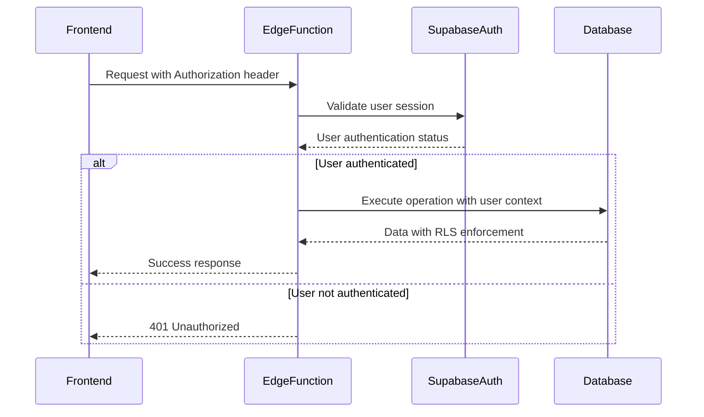
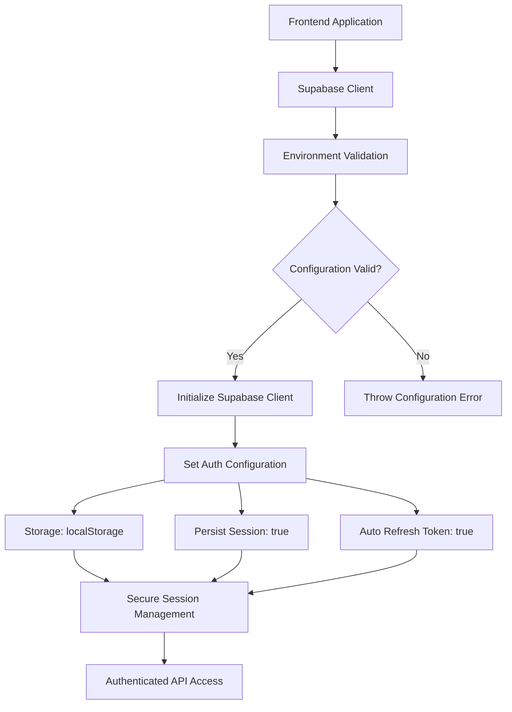
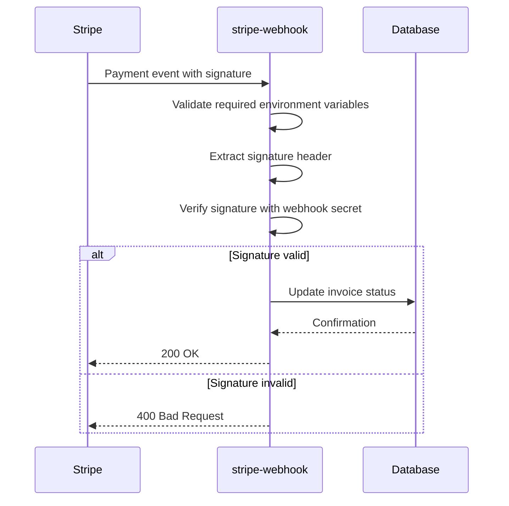
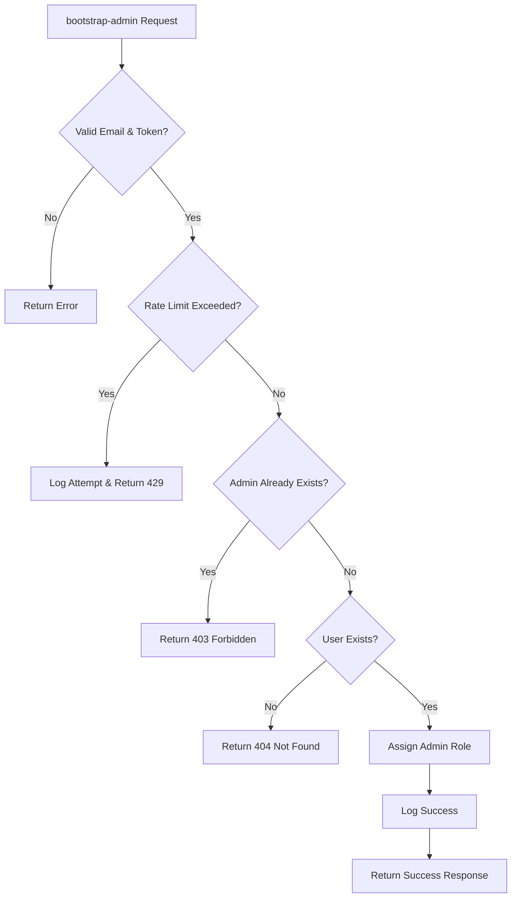
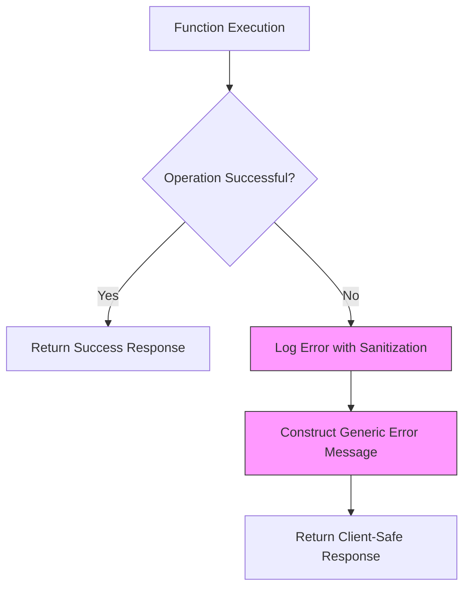
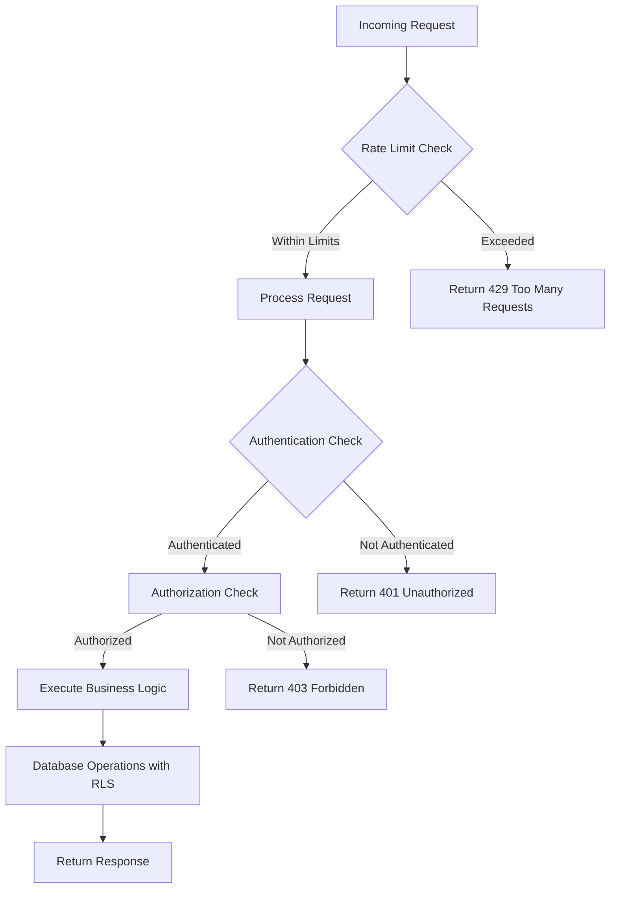

# Backend Security Mechanisms

<cite>
**Referenced Files in This Document**   
- [stripe-webhook/index.ts](file://supabase/functions/stripe-webhook/index.ts)
- [create-payment-intent/index.ts](file://supabase/functions/create-payment-intent/index.ts)
- [bootstrap-admin/index.ts](file://supabase/functions/bootstrap-admin/index.ts)
- [client.ts](file://src/integrations/supabase/client.ts)
- [logger.ts](file://supabase/functions/_shared/logger.ts)
- [securityLogger.ts](file://supabase/functions/shared/securityLogger.ts)
- [log-security-event/index.ts](file://supabase/functions/log-security-event/index.ts)
- [admin-check/index.ts](file://supabase/functions/admin-check/index.ts)
- [20250122000000_create_marketplace_system.sql](file://supabase/migrations/20250122000000_create_marketplace_system.sql)
- [database.ts](file://src/types/database.ts)
</cite>

## Table of Contents
1. [Introduction](#introduction)
2. [Supabase Edge Functions Security](#supabase-edge-functions-security)
3. [Row Level Security Policies](#row-level-security-policies)
4. [Supabase Client Configuration](#supabase-client-configuration)
5. [Critical Function Security Analysis](#critical-function-security-analysis)
6. [Secure Function Design Patterns](#secure-function-design-patterns)
7. [Threat Mitigation Strategies](#threat-mitigation-strategies)
8. [Security Implementation Guidelines](#security-implementation-guidelines)
9. [Conclusion](#conclusion)

## Introduction

The Sleek Apparels platform implements a comprehensive security infrastructure to protect sensitive data and ensure secure operations across its backend systems. This document details the security mechanisms implemented in Supabase Edge Functions, database-level Row Level Security (RLS) policies, and secure communication patterns between frontend and backend components. The security architecture is designed to prevent unauthorized access, protect against common server-side threats, and ensure data integrity throughout the application.

The platform leverages Supabase's robust security features, including RLS policies that enforce data access controls at the PostgreSQL level, authenticated Edge Functions that validate user permissions, and comprehensive logging mechanisms that track security events. These measures work together to create a defense-in-depth approach to security, protecting both customer data and business operations.

**Section sources**
- [SECURITY.md](file://SECURITY.md)
- [README.md](file://README.md)

## Supabase Edge Functions Security

The Supabase Edge Functions in the Sleek Apparels platform implement multiple layers of security to protect against unauthorized access and malicious activity. These functions serve as the primary interface between the frontend application and backend services, enforcing authentication, input validation, and rate limiting.

All Edge Functions implement CORS (Cross-Origin Resource Sharing) headers to control which domains can access the functions. The `corsHeaders` configuration allows requests from any origin (`Access-Control-Allow-Origin: '*'`) while specifying the allowed headers, including authorization tokens and content types. This configuration enables the frontend application to communicate with the Edge Functions while providing some protection against cross-site request forgery (CSRF) attacks.

Authentication is implemented through Supabase's built-in authentication system. Functions like `create-payment-intent` and `admin-check` verify the user's authentication status by checking the Authorization header and validating the user's session with Supabase Auth. The functions create authenticated Supabase clients that respect the user's permissions, ensuring that database operations are performed within the context of the authenticated user's privileges.



**Diagram sources**
- [create-payment-intent/index.ts](file://supabase/functions/create-payment-intent/index.ts#L19-L47)
- [admin-check/index.ts](file://supabase/functions/admin-check/index.ts#L15-L35)

**Section sources**
- [create-payment-intent/index.ts](file://supabase/functions/create-payment-intent/index.ts)
- [admin-check/index.ts](file://supabase/functions/admin-check/index.ts)
- [corsHeaders configuration](file://supabase/functions/*.ts)

## Row Level Security Policies

The Sleek Apparels platform implements comprehensive Row Level Security (RLS) policies in PostgreSQL to control data access at the database level. These policies ensure that users can only access data they are authorized to view, regardless of how they attempt to access it.

The RLS policies are defined in the database migration files, particularly in `20250122000000_create_marketplace_system.sql`. These policies are applied to multiple tables including `marketplace_products`, `product_inquiries`, `product_approval_log`, `product_analytics`, and `product_wishlist`. Each table has RLS enabled with specific policies that define who can perform SELECT, INSERT, UPDATE, and DELETE operations.

For the `marketplace_products` table, multiple policies work together to control access:
- "Anyone can view approved products" allows unauthenticated users to view products with status 'approved'
- "Suppliers can view their own products" enables suppliers to access products associated with their supplier account
- "Suppliers can create products" permits suppliers to add new products to their inventory
- "Suppliers can update their own products" allows suppliers to modify their existing products
- "Admins can view all products" grants administrators complete access to all products regardless of status

The policy implementation uses Supabase's `auth.uid()` function to retrieve the authenticated user's ID and checks against related tables to verify permissions. For example, the supplier policies verify that the product's supplier_id matches a supplier record associated with the authenticated user. Similarly, the admin policy checks the `user_roles` table for an 'admin' role assignment.

```mermaid
erDiagram
USER ||--o{ user_roles : "has"
user_roles }|--|| APP_ROLE : "is"
SUPPLIER ||--o{ marketplace_products : "lists"
USER ||--o{ product_inquiries : "creates"
marketplace_products ||--o{ product_inquiries : "receives"
USER ||--o{ product_wishlist : "manages"
marketplace_products ||--o{ product_wishlist : "included_in"
class USER "id: UUID\nemail: TEXT\ncreated_at: TIMESTAMPTZ"
class user_roles "user_id: UUID (FK)\nrole: TEXT\ncreated_at: TIMESTAMPTZ"
class SUPPLIER "id: UUID\nuser_id: UUID (FK)\ncompany_name: TEXT"
class marketplace_products "id: UUID\nsupplier_id: UUID (FK)\nstatus: TEXT\ncreated_at: TIMESTAMPTZ"
class product_inquiries "id: UUID\nproduct_id: UUID (FK)\nbuyer_id: UUID (FK)\nstatus: TEXT"
class product_wishlist "user_id: UUID (FK)\nproduct_id: UUID (FK)"
```

**Diagram sources**
- [20250122000000_create_marketplace_system.sql](file://supabase/migrations/20250122000000_create_marketplace_system.sql#L258-L297)
- [database.ts](file://src/types/database.ts)

**Section sources**
- [20250122000000_create_marketplace_system.sql](file://supabase/migrations/20250122000000_create_marketplace_system.sql)
- [database.ts](file://src/types/database.ts)

## Supabase Client Configuration

The Supabase client is configured to enforce secure communication between the frontend and backend through proper authentication and session management. The client configuration is centralized in `src/integrations/supabase/client.ts`, ensuring consistent security practices across the application.

The client is initialized with environment variables that contain the Supabase URL and publishable key, which are validated through an environment configuration system. This approach prevents hardcoded credentials and allows different configurations for development, staging, and production environments. The configuration uses the `env.getConfig()` method to validate required environment variables on import, ensuring that the application fails fast if security-critical configuration is missing.

Authentication is managed through Supabase's built-in auth system with localStorage persistence. The client configuration specifies that sessions should be persisted, automatically refreshed, and stored in localStorage. This configuration balances usability with security by maintaining user sessions while ensuring tokens are refreshed before expiration.



The client configuration also ensures that all database operations respect Row Level Security policies. When queries are executed through the client, they are performed in the context of the authenticated user, and the database enforces the RLS policies accordingly. This means that even if a malicious actor attempts to manipulate frontend code, they cannot bypass the server-side security controls.

**Diagram sources**
- [client.ts](file://src/integrations/supabase/client.ts#L14-L20)
- [env-validator.ts](file://src/lib/env-validator.ts)

**Section sources**
- [client.ts](file://src/integrations/supabase/client.ts)
- [env-validator.ts](file://src/lib/env-validator.ts)

## Critical Function Security Analysis

The Sleek Apparels platform includes several critical Edge Functions that handle sensitive operations, each implementing specific security measures tailored to their functionality. This section analyzes the security implementation of three key functions: `stripe-webhook`, `create-payment-intent`, and `bootstrap-admin`.

The `stripe-webhook` function processes payment events from Stripe and implements several security measures. It validates the Stripe signature using the webhook secret to ensure that events originate from Stripe and have not been tampered with. The function uses Stripe's `constructEvent` method to verify the signature, which prevents replay attacks and ensures message integrity. Additionally, it validates the presence of required environment variables (STRIPE_SECRET_KEY and STRIPE_WEBHOOK_SECRET) before processing events, preventing configuration-related vulnerabilities.



**Diagram sources**
- [stripe-webhook/index.ts](file://supabase/functions/stripe-webhook/index.ts#L16-L51)

The `create-payment-intent` function handles the creation of Stripe payment intents and implements comprehensive security checks. It verifies user authentication, ensures the user has authorization to pay for the specified order, and validates price integrity by comparing the order price with the original quote. The function implements a security check to prevent price manipulation by verifying that the order price falls within a 0.5% variance of the quote price. It also checks that the order is in a valid state for payment (not already paid) and implements logging with PII sanitization to prevent sensitive data exposure in logs.

The `bootstrap-admin` function enables the initial creation of an admin account and includes multiple security controls. It implements rate limiting to prevent brute force attacks, allowing only three attempts per IP address per hour. The function uses constant-time string comparison to validate the bootstrap token, preventing timing attacks. It also checks whether an admin account already exists before allowing bootstrap, ensuring that this functionality is only available during initial setup. The function captures the client IP address for logging and rate limiting purposes, providing an additional layer of security monitoring.



**Diagram sources**
- [bootstrap-admin/index.ts](file://supabase/functions/bootstrap-admin/index.ts#L33-L58)
- [bootstrap-admin/index.ts](file://supabase/functions/bootstrap-admin/index.ts#L70-L74)

**Section sources**
- [stripe-webhook/index.ts](file://supabase/functions/stripe-webhook/index.ts)
- [create-payment-intent/index.ts](file://supabase/functions/create-payment-intent/index.ts)
- [bootstrap-admin/index.ts](file://supabase/functions/bootstrap-admin/index.ts)

## Secure Function Design Patterns

The Edge Functions in the Sleek Apparels platform follow secure design patterns that mitigate common security risks and ensure robust error handling. These patterns include input validation, parameterized queries, error message sanitization, and structured logging with PII protection.

Input validation is implemented consistently across all functions to prevent injection attacks and ensure data integrity. Functions validate required parameters, check data types, and verify business logic constraints. For example, the `create-payment-intent` function validates that the order ID and payment type are provided, checks that the order price is valid and positive, and verifies that the payment amount meets minimum thresholds. This comprehensive validation prevents malformed requests from processing and reduces the attack surface.

The platform uses parameterized queries through the Supabase client, which automatically handles SQL injection prevention. When executing database operations, the Supabase client properly escapes parameters and uses prepared statements, eliminating the risk of SQL injection attacks. This is evident in functions like `create-payment-intent` that use the `.eq()` method to construct queries, ensuring that user input is treated as data rather than executable code.

Error handling is designed to avoid information leakage by sanitizing error messages before returning them to clients. The platform uses structured logging with PII sanitization to capture detailed error information for debugging while preventing sensitive data exposure. The shared logger utility automatically redacts sensitive fields such as emails, phone numbers, order IDs, and authentication tokens from log output. This ensures that logs contain sufficient information for troubleshooting without compromising user privacy.



The logging system implements automatic PII (Personally Identifiable Information) sanitization through the shared logger utility. Email addresses are partially redacted (showing only the first three characters), phone numbers display only the first four and last two digits, and order IDs show only the first eight characters. Fields containing "password", "token", or "secret" in the name are completely redacted. This pattern ensures that sensitive information is never exposed in logs while maintaining the ability to debug issues.

**Diagram sources**
- [logger.ts](file://supabase/functions/_shared/logger.ts#L14-L77)
- [securityLogger.ts](file://supabase/functions/shared/securityLogger.ts#L4-L11)

**Section sources**
- [logger.ts](file://supabase/functions/_shared/logger.ts)
- [securityLogger.ts](file://supabase/functions/shared/securityLogger.ts)

## Threat Mitigation Strategies

The Sleek Apparels platform implements comprehensive strategies to mitigate server-side security threats, particularly injection attacks and unauthorized access. These strategies combine technical controls, architectural patterns, and monitoring systems to create a robust defense against common vulnerabilities.

To prevent injection attacks, the platform relies on the Supabase client's parameterized query system, which automatically escapes user input and prevents SQL injection. All database operations use the Supabase client methods rather than raw SQL queries, ensuring that user input is never directly interpolated into database commands. This approach eliminates the primary vector for SQL injection attacks while maintaining developer productivity.

The platform implements multiple layers of authentication and authorization to prevent unauthorized access. Authentication is handled by Supabase Auth, which manages user sessions and JWT tokens. Authorization is enforced through Row Level Security policies at the database level and explicit role checks in Edge Functions. The combination of these controls ensures that users can only access data and functionality appropriate to their role, with admins, suppliers, and buyers having distinct permission sets.

Rate limiting is implemented to protect against brute force attacks and denial-of-service attempts. Functions like `ai-quote-generator` and `ai-market-research` implement rate limiting based on IP address, user session, or authenticated user ID. The rate limiting system tracks request counts in dedicated database tables and enforces limits such as 15 quotes per IP per day or 20 quotes per authenticated user per day. When limits are exceeded, the system returns appropriate HTTP 429 responses and logs the event for security monitoring.



The platform also implements origin validation to prevent unauthorized domains from accessing Edge Functions. Functions check the Origin and Referer headers against a whitelist of allowed domains, blocking requests from unauthorized sources. This control helps prevent cross-site request forgery (CSRF) attacks and ensures that only the legitimate frontend application can interact with the backend functions.

Security events are logged and monitored through dedicated systems. The `log-security-event` function captures security-related events such as rate limit violations, suspicious patterns, and captcha failures. These events include the IP address, user agent, and other contextual information, enabling security analysis and incident response. The logging system is designed to capture sufficient detail for investigation while protecting user privacy through PII sanitization.

**Diagram sources**
- [ai-quote-generator/index.ts](file://supabase/functions/ai-quote-generator/index.ts#L284-L317)
- [password-breach-check/index.ts](file://supabase/functions/password-breach-check/index.ts#L41-L87)
- [log-security-event/index.ts](file://supabase/functions/log-security-event/index.ts#L20-L40)

**Section sources**
- [ai-quote-generator/index.ts](file://supabase/functions/ai-quote-generator/index.ts)
- [password-breach-check/index.ts](file://supabase/functions/password-breach-check/index.ts)
- [log-security-event/index.ts](file://supabase/functions/log-security-event/index.ts)

## Security Implementation Guidelines

When implementing new Edge Functions for the Sleek Apparels platform, developers should follow these security guidelines to maintain the integrity of the security infrastructure:

1. **Authentication and Authorization**: Always verify user authentication for functions that handle user-specific data. Use the Supabase client with the request's Authorization header to create an authenticated client, then verify the user's role or permissions before proceeding with sensitive operations.

2. **Input Validation**: Implement comprehensive input validation for all function parameters. Validate data types, required fields, and business logic constraints. Use TypeScript interfaces to define expected input structures and validate against them.

3. **Error Handling**: Implement secure error handling that avoids information leakage. Use the structured logging system with PII sanitization to capture detailed error information, but return generic error messages to clients. Never expose stack traces or sensitive system information in client responses.

4. **Rate Limiting**: Implement rate limiting for functions that could be abused through excessive requests. Use dedicated rate limiting tables to track request counts by IP address, user session, or authenticated user ID. Return appropriate HTTP 429 responses when limits are exceeded.

5. **Logging**: Use the shared logging utilities for all function logging. The structured logger automatically sanitizes PII and provides consistent log formatting. Include sufficient context for debugging while avoiding sensitive data exposure.

6. **Database Access**: Always use the Supabase client for database operations rather than raw SQL queries. This ensures parameterized queries and prevents SQL injection. Design database schemas with Row Level Security in mind, defining appropriate policies for data access control.

7. **Environment Variables**: Store sensitive configuration in environment variables rather than hardcoded values. Use the environment validation system to ensure required variables are present before function execution.

8. **Origin Validation**: Implement origin validation for functions that should only be accessible from specific domains. Check the Origin and Referer headers against a whitelist of allowed domains to prevent unauthorized access.

9. **Security Monitoring**: Log security-relevant events using the dedicated security event logging system. Capture information such as IP address, user agent, and event context to enable security analysis and incident response.

10. **Code Review**: Ensure all new functions undergo security-focused code review, with particular attention to authentication, authorization, input validation, and error handling patterns.

**Section sources**
- [create-payment-intent/index.ts](file://supabase/functions/create-payment-intent/index.ts)
- [bootstrap-admin/index.ts](file://supabase/functions/bootstrap-admin/index.ts)
- [logger.ts](file://supabase/functions/_shared/logger.ts)

## Conclusion

The Sleek Apparels platform implements a comprehensive security infrastructure that protects against a wide range of threats through multiple layers of defense. The security architecture combines Supabase Edge Functions with robust Row Level Security policies, secure client configuration, and comprehensive threat mitigation strategies.

The platform's security model is built on the principle of defense in depth, with controls at multiple levels including authentication, authorization, input validation, rate limiting, and secure logging. These measures work together to prevent unauthorized access, protect sensitive data, and ensure the integrity of business operations.

Key strengths of the security implementation include the consistent use of Supabase's built-in security features, comprehensive input validation, automatic PII sanitization in logs, and multi-layered authentication and authorization controls. The platform also demonstrates good security practices through secure error handling, origin validation, and comprehensive monitoring of security events.

By following the established security patterns and guidelines, developers can extend the platform with new functionality while maintaining a high level of security. The documented secure design patterns provide a clear framework for implementing new features that adhere to the platform's security standards.