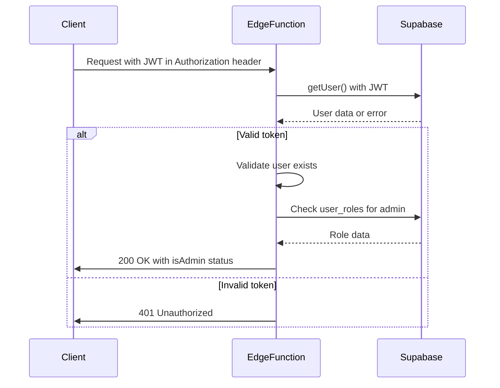
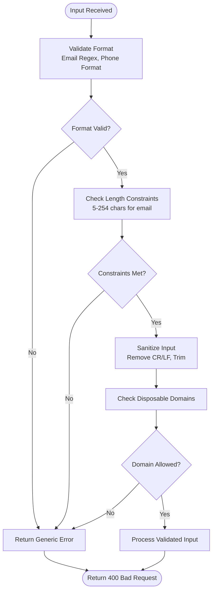
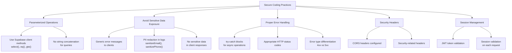
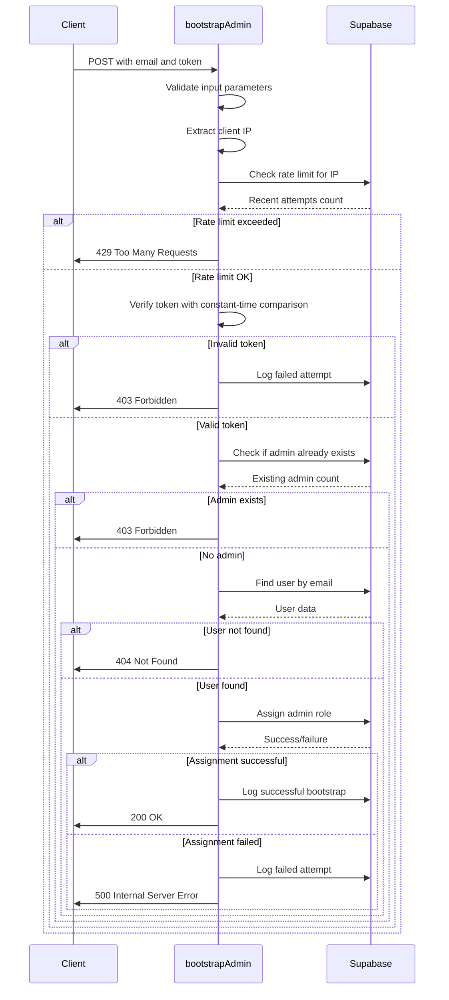
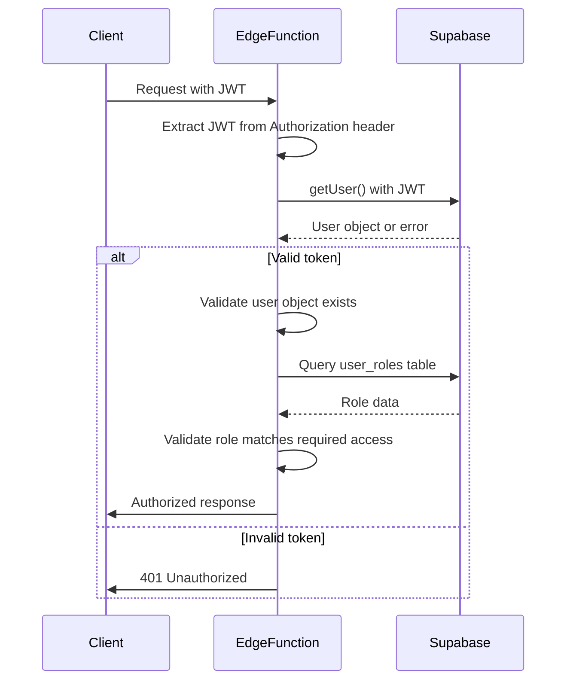
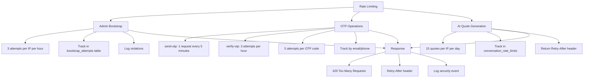

# Edge Function Security

<cite>
**Referenced Files in This Document**   
- [admin-check/index.ts](file://supabase/functions/admin-check/index.ts)
- [bootstrap-admin/index.ts](file://supabase/functions/bootstrap-admin/index.ts)
- [shared/securityLogger.ts](file://supabase/functions/shared/securityLogger.ts)
- [log-security-event/index.ts](file://supabase/functions/log-security-event/index.ts)
- [send-otp/index.ts](file://supabase/functions/send-otp/index.ts)
- [verify-otp/index.ts](file://supabase/functions/verify-otp/index.ts)
- [useAdminAuth.ts](file://src/hooks/useAdminAuth.ts)
- [ProtectedRoute.tsx](file://src/components/routes/ProtectedRoute.tsx)
- [RoleBasedRoute.tsx](file://src/components/routes/RoleBasedRoute.tsx)
- [AuthContext.tsx](file://src/contexts/AuthContext.tsx)
- [client.ts](file://src/integrations/supabase/client.ts)
- [logger.ts](file://supabase/functions/_shared/logger.ts)
- [20251115150759_remix_migration_from_pg_dump.sql](file://supabase/migrations/20251115150759_remix_migration_from_pg_dump.sql)
- [20251116162502_313dcba7-bfcf-494c-a64e-cf71fbf50750.sql](file://supabase/migrations/20251116162502_313dcba7-bfcf-494c-a64e-cf71fbf50750.sql)
- [20251119010413_442cc18c-60e2-4ddd-9a24-fdd07d75fe79.sql](file://supabase/migrations/20251119010413_442cc18c-60e2-4ddd-9a24-fdd07d75fe79.sql)
- [20251121152921_c535d0b2-b802-4dec-a8a5-e41029b44e99.sql](file://supabase/migrations/20251121152921_c535d0b2-b802-4dec-a8a5-e41029b44e99.sql)
- [20251126144147_80306377-6da5-45bd-bc8c-45d1c15989d0.sql](file://supabase/migrations/20251126144147_80306377-6da5-45bd-bc8c-45d1c15989d0.sql)
- [20251127194411_08e21416-fb07-4471-a062-d1c8e91e52c3.sql](file://supabase/migrations/20251127194411_08e21416-fb07-4471-a062-d1c8e91e52c3.sql)
</cite>

## Table of Contents
1. [Introduction](#introduction)
2. [Authentication Validation](#authentication-validation)
3. [Input Sanitization and Validation](#input-sanitization-and-validation)
4. [Role Verification Patterns](#role-verification-patterns)
5. [Secure Coding Practices](#secure-coding-practices)
6. [Critical Function Security](#critical-function-security)
7. [Security Logging](#security-logging)
8. [Vulnerability Mitigation](#vulnerability-mitigation)
9. [JWT Claim Validation](#jwt-claim-validation)
10. [Rate Limiting Implementation](#rate-limiting-implementation)
11. [Conclusion](#conclusion)

## Introduction

The Sleek Apparels platform implements a comprehensive security framework for its Edge Functions, designed to protect against common web vulnerabilities while ensuring secure access to privileged functionality. This document details the security mechanisms across authentication validation, input sanitization, role verification, and secure coding practices. The system leverages Supabase for authentication and database operations, with Edge Functions serving as the primary security enforcement layer. Key components include the admin-check and bootstrap-admin functions for privileged access control, a shared securityLogger utility for consistent event logging, and robust protection against vulnerabilities like IDOR (Insecure Direct Object Reference). The architecture follows security best practices including parameterized operations, proper error handling, and context-aware access checks.

**Section sources**
- [admin-check/index.ts](file://supabase/functions/admin-check/index.ts)
- [bootstrap-admin/index.ts](file://supabase/functions/bootstrap-admin/index.ts)
- [shared/securityLogger.ts](file://supabase/functions/shared/securityLogger.ts)

## Authentication Validation

The platform implements a multi-layered authentication validation system that ensures only authorized users can access protected resources. The process begins with JWT (JSON Web Token) validation from Supabase auth, where the Authorization header is extracted and verified. In the admin-check function, the system validates the presence of the authorization header and uses Supabase's getUser() method to verify the JWT token's authenticity and extract user information. This server-side validation prevents clients from spoofing authentication states.

The authentication flow follows a zero-trust principle, where client-side claims are never trusted. Instead, the Edge Function makes a direct call to Supabase to validate the token, ensuring that even if a client modifies local state, they cannot gain unauthorized access. The system also implements proper error handling for authentication failures, returning appropriate HTTP status codes (401 for unauthorized, 500 for server errors) without exposing sensitive information about the nature of the failure.

For OTP (One-Time Password) based authentication, the platform implements additional validation layers. The verify-otp function validates the OTP format (ensuring it's exactly 6 digits) and checks against the database record, preventing brute force attacks through rate limiting and attempt counting. The system also validates that the OTP has not expired and that it hasn't been previously used, ensuring the one-time nature of the verification code.



**Diagram sources**
- [admin-check/index.ts](file://supabase/functions/admin-check/index.ts)
- [verify-otp/index.ts](file://supabase/functions/verify-otp/index.ts)

**Section sources**
- [admin-check/index.ts](file://supabase/functions/admin-check/index.ts)
- [verify-otp/index.ts](file://supabase/functions/verify-otp/index.ts)
- [client.ts](file://src/integrations/supabase/client.ts)

## Input Sanitization and Validation

The platform implements rigorous input sanitization and validation at multiple levels to prevent common security vulnerabilities. For email inputs, the send-otp function employs comprehensive validation using a strict regex pattern that adheres to RFC 5322 standards, checking for proper format, length constraints (5-254 characters), and local part limitations (64 characters maximum). The system also blocks disposable email domains by maintaining a list of known temporary email services, preventing abuse of the verification system.

Email sanitization includes prevention of header injection attacks by removing carriage return and newline characters, which could otherwise be exploited for SMTP header injection. The system also implements proper encoding and escaping for email content, particularly in the HTML templates used for OTP emails, preventing XSS (Cross-Site Scripting) vulnerabilities.

For phone numbers, the system validates the format and implements sanitization to remove non-numeric characters while preserving the leading plus sign for international numbers. The sanitizePhone function in the shared logger utility masks phone numbers in logs by showing only the first 4 and last 2 digits, protecting user privacy while maintaining debuggability.

All input validation follows a fail-safe approach, where any validation failure results in rejection of the request with an appropriate error message. The system avoids providing detailed error messages that could aid attackers, instead using generic messages like "Invalid input data" while logging detailed information server-side for debugging purposes.



**Diagram sources**
- [send-otp/index.ts](file://supabase/functions/send-otp/index.ts)
- [logger.ts](file://supabase/functions/_shared/logger.ts)

**Section sources**
- [send-otp/index.ts](file://supabase/functions/send-otp/index.ts)
- [verify-otp/index.ts](file://supabase/functions/verify-otp/index.ts)
- [logger.ts](file://supabase/functions/_shared/logger.ts)

## Role Verification Patterns

The platform implements a robust role verification system that separates user types from application roles, providing fine-grained access control. The RoleBasedRoute component in the frontend enforces role-based access at the UI level, while the admin-check Edge Function provides server-side role verification that cannot be bypassed by client manipulation.

The role verification process follows a hierarchical approach. First, the system verifies the user's authentication status through Supabase. Then, it queries the user_roles table to determine the user's specific role (admin, supplier, factory, retailer, etc.). The determineUserType function in AuthContext.tsx maps these specific roles to broader user types (buyer, supplier, admin), enabling both granular and broad access control policies.

For admin verification, the system uses a dedicated Edge Function (admin-check) that performs the role check server-side. This prevents clients from spoofing admin status by modifying local state. The useAdminAuth hook in the frontend invokes this Edge Function, ensuring that admin status is always validated by the server. This pattern follows the principle of "never trust the client" and provides defense in depth.

The system also implements proper error handling for role verification failures, with appropriate HTTP status codes and generic error messages that don't reveal system details. The role verification is performed on every request that requires privileged access, preventing elevation of privilege attacks.

```mermaid
classDiagram
class AuthContext {
+user : User | null
+session : Session | null
+role : UserRole | null
+userType : UserType | null
+isAdmin : boolean
+isSupplier : boolean
+isBuyer : boolean
+loading : boolean
+signOut() : Promise~void~
+refreshAuth() : Promise~void~
}
class useAdminAuth {
+isAdmin : boolean
+loading : boolean
+checkAdminStatus() : Promise~void~
}
class RoleBasedRoute {
+children : ReactNode
+allowedRoles? : UserRole[]
+allowedUserTypes? : UserType[]
+redirectTo? : string
+fallback? : ReactNode
}
class ProtectedRoute {
+children : ReactNode
+redirectTo? : string
}
AuthContext --> useAdminAuth : "uses"
AuthContext --> RoleBasedRoute : "provides context"
AuthContext --> ProtectedRoute : "provides context"
useAdminAuth --> "admin-check" : "invokes"
```

**Diagram sources**
- [useAdminAuth.ts](file://src/hooks/useAdminAuth.ts)
- [RoleBasedRoute.tsx](file://src/components/routes/RoleBasedRoute.tsx)
- [ProtectedRoute.tsx](file://src/components/routes/ProtectedRoute.tsx)
- [AuthContext.tsx](file://src/contexts/AuthContext.tsx)

**Section sources**
- [useAdminAuth.ts](file://src/hooks/useAdminAuth.ts)
- [RoleBasedRoute.tsx](file://src/components/routes/RoleBasedRoute.tsx)
- [ProtectedRoute.tsx](file://src/components/routes/ProtectedRoute.tsx)
- [AuthContext.tsx](file://src/contexts/AuthContext.tsx)

## Secure Coding Practices

The platform adheres to industry-standard secure coding practices to minimize vulnerabilities and ensure robust security. One key practice is the use of parameterized operations for database queries, which prevents SQL injection attacks. All database operations use Supabase's client library methods (select, eq, gte, etc.) rather than string concatenation, ensuring that user inputs are properly escaped and parameterized.

The system avoids sensitive data exposure through multiple mechanisms. Error messages returned to clients are generic and don't reveal system details, while detailed error information is logged server-side for debugging. The shared logger utility automatically redacts sensitive information like email addresses, phone numbers, and order IDs in logs, showing only partial information (e.g., joh***@example.com, +880****90).

Proper error handling is implemented throughout the codebase, with try-catch blocks around all asynchronous operations and appropriate HTTP status codes returned for different error types. The system distinguishes between client errors (4xx) and server errors (5xx), providing appropriate responses without exposing implementation details.

Security headers are properly configured, with CORS headers allowing access from any origin (appropriate for a public API) while including necessary security-related headers. The system also implements proper session management, with JWT tokens handled securely and session validation performed on each request.



**Diagram sources**
- [admin-check/index.ts](file://supabase/functions/admin-check/index.ts)
- [bootstrap-admin/index.ts](file://supabase/functions/bootstrap-admin/index.ts)
- [logger.ts](file://supabase/functions/_shared/logger.ts)

**Section sources**
- [admin-check/index.ts](file://supabase/functions/admin-check/index.ts)
- [bootstrap-admin/index.ts](file://supabase/functions/bootstrap-admin/index.ts)
- [logger.ts](file://supabase/functions/_shared/logger.ts)

## Critical Function Security

The platform's critical security functions, particularly admin-check and bootstrap-admin, implement multiple layers of protection to secure privileged access. The admin-check function serves as the primary mechanism for verifying admin status, performing server-side validation that cannot be bypassed by client manipulation. It checks the user_roles table for the 'admin' role, ensuring that only users explicitly granted this role can access admin functionality.

The bootstrap-admin function implements even more stringent security measures, as it's responsible for creating the initial admin account. This function includes multiple security controls: rate limiting (maximum 3 attempts per IP per hour), constant-time token comparison to prevent timing attacks, and a check to ensure no admin already exists before allowing bootstrap. The constant-time comparison is implemented by comparing token length first, then performing a character-by-character comparison with a boolean accumulator, preventing attackers from using timing information to guess the token.

The bootstrap-admin function also implements proper input validation, requiring both email and token parameters, and captures the client IP for rate limiting purposes. It uses the service role key for database operations, providing elevated privileges necessary for user management while maintaining auditability. The function logs all attempts, both successful and failed, providing visibility into potential abuse.

These critical functions follow the principle of least privilege, performing only the necessary operations and failing securely when any validation fails. They also implement proper error handling, with specific error messages for different failure modes while avoiding information disclosure.



**Diagram sources**
- [admin-check/index.ts](file://supabase/functions/admin-check/index.ts)
- [bootstrap-admin/index.ts](file://supabase/functions/bootstrap-admin/index.ts)

**Section sources**
- [admin-check/index.ts](file://supabase/functions/admin-check/index.ts)
- [bootstrap-admin/index.ts](file://supabase/functions/bootstrap-admin/index.ts)

## Security Logging

The platform implements comprehensive security logging through the shared securityLogger utility, providing consistent event logging across all Edge Functions. The securityLogger exports two primary functions: logSecurityEvent for security-related events and logAICost for tracking AI service costs. Both functions write to dedicated database tables (security_events and ai_cost_tracking) with proper schema and Row Level Security (RLS) policies.

The logSecurityEvent function captures essential context for security analysis, including event type (captcha_failure, rate_limit_violation, suspicious_pattern, cost_alert), severity level, source function, IP address, user agent, and optional details. This structured logging enables effective monitoring and analysis of security events. The function automatically extracts IP address from headers (x-forwarded-for or x-real-ip) and user agent, providing valuable context for threat analysis.

The system implements proper RLS policies on the security_events and ai_cost_tracking tables, restricting access to the service_role only. This prevents unauthorized access to security logs while allowing Edge Functions to write events using the service role key. The logging system also includes client-side sanitization of PII (Personally Identifiable Information) through the sanitizeEmail and sanitizePhone functions, which mask sensitive data in logs while preserving enough information for debugging.

All security-critical operations include appropriate logging, with successful and failed attempts recorded. For example, the bootstrap-admin function logs both successful and failed attempts, providing an audit trail for this sensitive operation. The logging system follows a fail-safe approach, with try-catch blocks around logging operations to prevent logging failures from affecting primary functionality.

```mermaid
classDiagram
class securityLogger {
+logSecurityEvent(params, req)
+logAICost(params)
}
class SecurityEventParams {
+event_type : string
+severity : string
+source : string
+details? : any
+user_id? : string
+session_id? : string
}
class CostTrackingParams {
+function_name : string
+model : string
+request_tokens : number
+response_tokens : number
+session_id? : string
+user_id? : string
}
class LoggerUtils {
+sanitizeEmail(email)
+sanitizePhone(phone)
+sanitizeOrderId(orderId)
+sanitizeLogData(data)
}
securityLogger --> SecurityEventParams
securityLogger --> CostTrackingParams
securityLogger --> LoggerUtils
LoggerUtils --> "security_events table"
LoggerUtils --> "ai_cost_tracking table"
```

**Diagram sources**
- [shared/securityLogger.ts](file://supabase/functions/shared/securityLogger.ts)
- [logger.ts](file://supabase/functions/_shared/logger.ts)

**Section sources**
- [shared/securityLogger.ts](file://supabase/functions/shared/securityLogger.ts)
- [logger.ts](file://supabase/functions/_shared/logger.ts)
- [20251127194411_08e21416-fb07-4471-a062-d1c8e91e52c3.sql](file://supabase/migrations/20251127194411_08e21416-fb07-4471-a062-d1c8e91e52c3.sql)

## Vulnerability Mitigation

The platform implements comprehensive measures to mitigate common security vulnerabilities, particularly IDOR (Insecure Direct Object Reference) and other authorization bypass risks. The system follows a defense-in-depth approach, with multiple layers of protection at both the application and database levels.

For IDOR mitigation, the platform implements context-aware access checks in both Edge Functions and database RLS (Row Level Security) policies. The RLS policies in the database ensure that users can only access records they are authorized to view, based on their role and relationship to the data. For example, suppliers can only access their own orders, and buyers can only access orders they are involved in. The Edge Functions provide an additional layer of validation, performing the same access checks server-side to prevent bypass attempts.

The system also mitigates other common vulnerabilities through various mechanisms. CSRF (Cross-Site Request Forgery) is prevented by using JWT-based authentication rather than session cookies, and by validating the origin of requests through CORS policies. Rate limiting is implemented on multiple endpoints to prevent brute force attacks, with different limits for different operations (e.g., 3 attempts per hour for bootstrap-admin, 5 per hour for OTP verification).

The platform addresses security misconfigurations through regular audits and automated migrations that fix overly permissive policies. For example, multiple migrations have been implemented to remove public access to sensitive tables like sample_requests, sample_submissions, and product_interactions, restricting access to service_role or authenticated users with appropriate roles.

Input validation and output encoding prevent XSS (Cross-Site Scripting) attacks, with proper escaping in email templates and UI components. The system also implements proper error handling to avoid information disclosure, with generic error messages returned to clients and detailed logs stored server-side.

```mermaid
flowchart TD
A[Vulnerability Mitigation] --> B[IDOR Protection]
A --> C[CSRF Prevention]
A --> D[Rate Limiting]
A --> E[Security Misconfigurations]
A --> F[XSS Prevention]
A --> G[Information Disclosure]
B --> B1["Context-aware access checks"]
B --> B2["Database RLS policies"]
B --> B3["Server-side validation"]
C --> C1["JWT-based authentication"]
C --> C2["CORS policy enforcement"]
D --> D1["Rate limiting on sensitive endpoints"]
D --> D2["Different limits for different operations"]
D --> D3["IP and identifier-based tracking"]
E --> E1["Regular security audits"]
E --> E2["Automated policy fixes"]
E --> E3["Remove public access to sensitive data"]
F --> F1["Input validation"]
F --> F2["Output encoding"]
F --> F3["Proper escaping in templates"]
G --> G1["Generic error messages"]
G --> G2["Detailed server-side logging"]
G --> G3["PII redaction in logs"]
```



**Diagram sources**
- [20251115150759_remix_migration_from_pg_dump.sql](file://supabase/migrations/20251115150759_remix_migration_from_pg_dump.sql)
- [20251116162502_313dcba7-bfcf-494c-a64e-cf71fbf50750.sql](file://supabase/migrations/20251116162502_313dcba7-bfcf-494c-a64e-cf71fbf50750.sql)
- [20251119010413_442cc18c-60e2-4ddd-9a24-fdd07d75fe79.sql](file://supabase/migrations/20251119010413_442cc18c-60e2-4ddd-9a24-fdd07d75fe79.sql)

**Section sources**
- [20251115150759_remix_migration_from_pg_dump.sql](file://supabase/migrations/20251115150759_remix_migration_from_pg_dump.sql)
- [20251116162502_313dcba7-bfcf-494c-a64e-cf71fbf50750.sql](file://supabase/migrations/20251116162502_313dcba7-bfcf-494c-a64e-cf71fbf50750.sql)
- [20251119010413_442cc18c-60e2-4ddd-9a24-fdd07d75fe79.sql](file://supabase/migrations/20251119010413_442cc18c-60e2-4ddd-9a24-fdd07d75fe79.sql)

## JWT Claim Validation

The platform implements robust JWT claim validation to ensure the authenticity and integrity of authentication tokens. When validating JWT claims from Supabase auth, the system follows a multi-step process that verifies both the token signature and its claims. The validation is performed server-side in Edge Functions, preventing clients from bypassing security checks.

The validation process begins with extracting the JWT from the Authorization header and using Supabase's getUser() method to verify the token's signature and decode its claims. This method validates that the token is properly signed by Supabase, has not expired, and contains valid claims. The system then validates the user object returned by Supabase, ensuring that the user exists and is active.

For admin access, the system performs additional validation beyond the JWT claims. The admin-check function queries the user_roles table to verify that the user has the 'admin' role, rather than trusting a role claim in the JWT. This prevents privilege escalation attacks where an attacker might try to modify client-side state to appear as an admin.

The system also validates the token's audience and issuer claims implicitly through Supabase's validation process, ensuring that the token was issued by the correct Supabase project and is intended for the correct audience. The validation is performed on every request that requires authentication, preventing replay attacks and ensuring that revoked tokens are not accepted.



**Diagram sources**
- [admin-check/index.ts](file://supabase/functions/admin-check/index.ts)
- [client.ts](file://src/integrations/supabase/client.ts)

**Section sources**
- [admin-check/index.ts](file://supabase/functions/admin-check/index.ts)
- [client.ts](file://src/integrations/supabase/client.ts)

## Rate Limiting Implementation

The platform implements comprehensive rate limiting across multiple endpoints to prevent abuse and protect system resources. The rate limiting strategy varies by endpoint and sensitivity, with different limits and tracking mechanisms for different types of operations.

For high-risk operations like admin bootstrap, the system implements strict rate limiting of 3 attempts per IP address per hour. This prevents brute force attacks on the bootstrap functionality while allowing legitimate use. The rate limiting is implemented by querying the bootstrap_attempts table for recent attempts from the same IP address and rejecting requests that exceed the limit.

For OTP (One-Time Password) operations, the system implements multiple layers of rate limiting. The send-otp function limits requests to once every 5 minutes per email or phone number, preventing spamming of verification codes. The verify-otp function implements a limit of 3 attempts per hour per identifier (email or phone), preventing brute force attacks on the verification code. Additionally, each OTP record has a maximum of 5 verification attempts before it becomes invalid, providing per-code rate limiting.

The ai-quote-generator function implements rate limiting based on IP address, allowing 15 quotes per IP per day. This prevents abuse of the AI quote generation service while allowing reasonable usage. The rate limiting is implemented using a checkAndUpdateRateLimit function that tracks usage in the database.

All rate limiting implementations include proper logging of limit violations, with security events logged to the security_events table. The system also returns appropriate HTTP status codes (429 Too Many Requests) with retry-after headers when limits are exceeded, providing a good user experience while enforcing security policies.



**Diagram sources**
- [bootstrap-admin/index.ts](file://supabase/functions/bootstrap-admin/index.ts)
- [send-otp/index.ts](file://supabase/functions/send-otp/index.ts)
- [verify-otp/index.ts](file://supabase/functions/verify-otp/index.ts)
- [ai-quote-generator/index.ts](file://supabase/functions/ai-quote-generator/index.ts)

**Section sources**
- [bootstrap-admin/index.ts](file://supabase/functions/bootstrap-admin/index.ts)
- [send-otp/index.ts](file://supabase/functions/send-otp/index.ts)
- [verify-otp/index.ts](file://supabase/functions/verify-otp/index.ts)

## Conclusion

The Sleek Apparels platform implements a robust and comprehensive security framework for its Edge Functions, addressing authentication, authorization, input validation, and vulnerability mitigation. The system follows security best practices including server-side validation of all security-critical operations, defense in depth with multiple layers of protection, and proper error handling that avoids information disclosure.

Key security mechanisms include the admin-check and bootstrap-admin functions for privileged access control, with the latter implementing particularly stringent protections including rate limiting, constant-time token comparison, and single-use functionality. The shared securityLogger utility provides consistent and secure logging across all functions, with automatic PII redaction to protect user privacy.

The platform effectively mitigates common vulnerabilities like IDOR through context-aware access checks and database RLS policies, while implementing comprehensive rate limiting to prevent abuse. JWT claim validation is performed server-side, ensuring that client-side state cannot be trusted for security decisions.

Developers implementing new secure functions should follow the established patterns: use parameterized database operations, validate all inputs server-side, implement appropriate rate limiting for sensitive operations, use the securityLogger for consistent event logging, and always perform authorization checks in Edge Functions rather than trusting client-side state. The existing codebase provides clear examples of these patterns that can be followed for new functionality.

**Section sources**
- [admin-check/index.ts](file://supabase/functions/admin-check/index.ts)
- [bootstrap-admin/index.ts](file://supabase/functions/bootstrap-admin/index.ts)
- [shared/securityLogger.ts](file://supabase/functions/shared/securityLogger.ts)
- [send-otp/index.ts](file://supabase/functions/send-otp/index.ts)
- [verify-otp/index.ts](file://supabase/functions/verify-otp/index.ts)