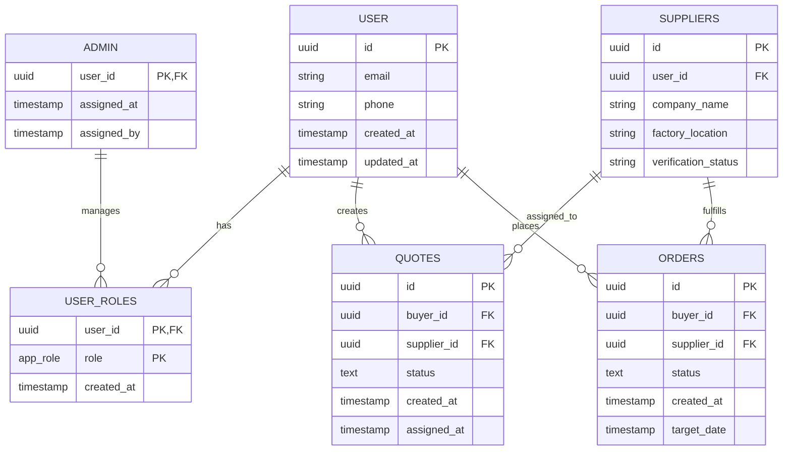
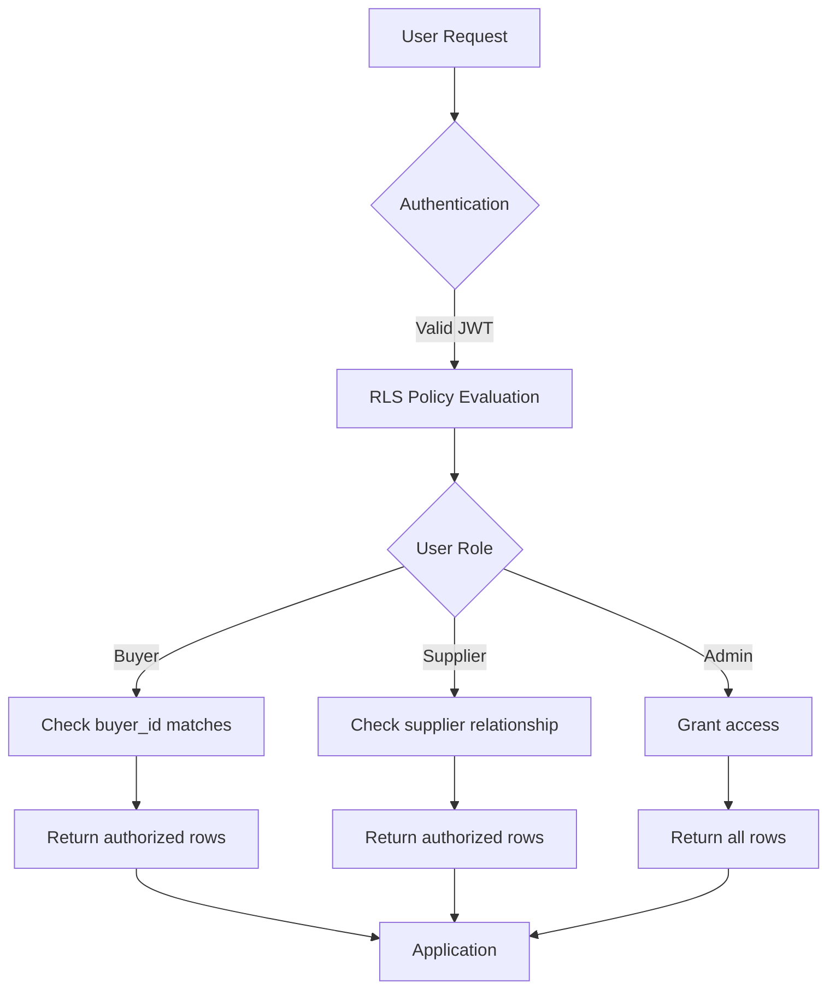
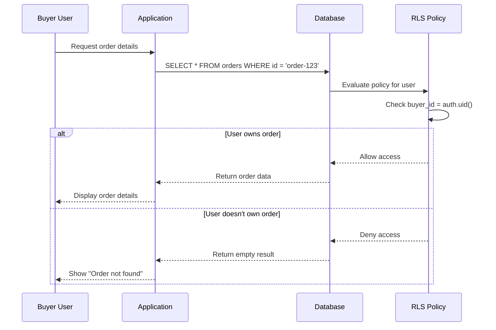

# Row Level Security (RLS) Policies

<cite>
**Referenced Files in This Document**   
- [20250122000000_create_marketplace_system.sql](file://supabase/migrations/20250122000000_create_marketplace_system.sql)
- [20251115150759_remix_migration_from_pg_dump.sql](file://supabase/migrations/20251115150759_remix_migration_from_pg_dump.sql)
- [20251120233928_2016afb8-d720-4858-9e12-7fb4ebbd5de0.sql](file://supabase/migrations/20251120233928_2016afb8-d720-4858-9e12-7fb4ebbd5de0.sql)
- [add_supplier_to_quotes.sql](file://supabase/migrations/add_supplier_to_quotes.sql)
- [AuthContext.tsx](file://src/contexts/AuthContext.tsx)
- [types.ts](file://src/integrations/supabase/types.ts)
</cite>

## Table of Contents
1. [Introduction](#introduction)
2. [User Roles and Authentication Integration](#user-roles-and-authentication-integration)
3. [Core RLS Policy Structure](#core-rls-policy-structure)
4. [Critical Table Policies](#critical-table-policies)
5. [Policy Logic and Expressions](#policy-logic-and-expressions)
6. [Real-World Access Scenarios](#real-world-access-scenarios)
7. [Performance Considerations and Indexing](#performance-considerations-and-indexing)
8. [Debugging RLS Access Issues](#debugging-rls-access-issues)
9. [Best Practices for RLS Implementation](#best-practices-for-rls-implementation)
10. [Conclusion](#conclusion)

## Introduction

Row Level Security (RLS) in the Sleek Apparels PostgreSQL database provides fine-grained access control to ensure data isolation between different user roles including buyers, suppliers, and administrators. Implemented through PostgreSQL's native RLS features integrated with Supabase authentication, these policies enforce that users can only access data they are authorized to view based on their role and ownership relationships. This documentation details the RLS policy implementation across critical tables such as quotes, orders, and production stages, explaining the policy logic, integration with Supabase authentication, and best practices for maintaining secure and performant access controls.

**Section sources**
- [20251115150759_remix_migration_from_pg_dump.sql](file://supabase/migrations/20251115150759_remix_migration_from_pg_dump.sql#L1-L200)
- [20250122000000_create_marketplace_system.sql](file://supabase/migrations/20250122000000_create_marketplace_system.sql#L250-L449)

## User Roles and Authentication Integration

The RLS system in Sleek Apparels is built around a role-based access control model with three primary roles: buyer, supplier, and admin. These roles are managed through the `user_roles` table which establishes the relationship between Supabase authentication users and their application roles. The `app_role` enum type defines the available roles including retailer, wholesaler, educational, corporate, sports_team, factory, admin, and supplier.

Authentication is tightly integrated with Supabase Auth, where each authenticated session provides the user's ID through `auth.uid()` which is used in all RLS policies to determine access. The system uses a helper function `has_role(auth.uid(), 'role'::public.app_role)` to check if a user has a specific role, which queries the `user_roles` table to verify role assignments. This integration ensures that only authenticated users with the appropriate roles can access protected data.

Role assignment is strictly controlled through server-side functions like `assign_admin_role()` and `assign_user_role()`, which can only be called by existing admin users. This prevents clients from self-assigning elevated privileges. When a new user signs up, they are automatically assigned a default buyer role (specifically 'retailer'), and supplier or admin roles must be assigned manually by existing administrators through secure administrative interfaces.



**Diagram sources**
- [20251115150759_remix_migration_from_pg_dump.sql](file://supabase/migrations/20251115150759_remix_migration_from_pg_dump.sql#L30-L40)
- [AuthContext.tsx](file://src/contexts/AuthContext.tsx#L47-L74)

**Section sources**
- [20251115150759_remix_migration_from_pg_dump.sql](file://supabase/migrations/20251115150759_remix_migration_from_pg_dump.sql#L30-L40)
- [AuthContext.tsx](file://src/contexts/AuthContext.tsx#L47-L74)
- [types.ts](file://src/integrations/supabase/types.ts#L3964-L3973)

## Core RLS Policy Structure

The RLS implementation in Sleek Apparels follows a consistent pattern across all tables, using PostgreSQL's `CREATE POLICY` statements with appropriate USING and WITH CHECK expressions. All tables that require access control have RLS enabled via `ALTER TABLE table_name ENABLE ROW LEVEL SECURITY`. The policies are designed to be specific, secure, and maintainable, with clear naming conventions that indicate the user role and operation type.

Policies are categorized by the type of operation they govern: SELECT (read), INSERT (create), UPDATE (modify), and DELETE (remove). For each operation, policies use either a USING clause (which defines the conditions for row visibility) or a WITH CHECK clause (which validates data being inserted or updated). The USING clause is used for SELECT and UPDATE operations to filter which rows a user can see or modify, while WITH CHECK is used for INSERT and UPDATE operations to validate that new data meets security requirements.

The policy structure emphasizes least privilege access, where users are granted only the minimum permissions necessary for their role. For example, suppliers can only view quotes assigned to them, while admins have broader access to manage all records. The system also implements cascading security through relationship checks, where access to child records is often dependent on access to parent records. This layered approach ensures comprehensive data protection across the entire application.

**Section sources**
- [20251115150759_remix_migration_from_pg_dump.sql](file://supabase/migrations/20251115150759_remix_migration_from_pg_dump.sql#L4736-L4799)
- [20251120233928_2016afb8-d720-4858-9e12-7fb4ebbd5de0.sql](file://supabase/migrations/20251120233928_2016afb8-d720-4858-9e12-7fb4ebbd5de0.sql#L129-L138)

## Critical Table Policies

### Quotes Table Policies

The quotes table implements comprehensive RLS policies to manage the quote lifecycle from creation to supplier assignment. Buyers can view and create quotes associated with their account, while suppliers can only access quotes explicitly assigned to them by administrators. The key policies include:

- **"Users can view their own quotes"**: Allows buyers to view quotes they created using `buyer_id = auth.uid()` check
- **"Suppliers can view assigned quotes"**: Enables suppliers to access quotes where they are assigned via `supplier_id IN (SELECT id FROM suppliers WHERE user_id = auth.uid())`
- **"Admins can view all quotes"**: Grants administrators unrestricted access to all quotes for management purposes
- **"Admins can update all quotes"**: Allows admins to modify any quote, including assigning suppliers

The addition of supplier assignment fields in the `add_supplier_to_quotes.sql` migration enhanced the RLS capabilities by adding `supplier_id`, `assigned_at`, and `assigned_by` columns, enabling explicit supplier assignment with proper audit trails.

### Orders Table Policies

The orders table implements strict access controls to protect sensitive order information. The policies ensure that only parties directly involved in an order can access its details:

- **"Users can view their own orders"**: Buyers can view orders where they are the buyer_id
- **"Suppliers can view their orders"**: Suppliers can access orders assigned to their supplier account
- **"Admins can view all orders"**: Administrators have complete visibility across all orders
- **"Admins can update all orders"**: Admins can modify order status and details as needed

These policies use relationship-based checks, verifying not just direct ownership but also through the suppliers table to ensure proper role-based access.

### Production Stages Policies

Production stage tracking implements granular access controls to maintain data integrity while allowing appropriate visibility:

- **"Users can view production stages for their orders"**: Both buyers and suppliers can track progress on orders they're involved in
- **"Suppliers can update production stages"**: Suppliers can advance stages for orders they're fulfilling
- **"Admins can manage all production stages"**: Administrators can view and modify any production stage

The policies use complex subqueries to verify user roles and relationships, ensuring that suppliers can only update stages for orders assigned to their factory.



**Diagram sources**
- [20251115150759_remix_migration_from_pg_dump.sql](file://supabase/migrations/20251115150759_remix_migration_from_pg_dump.sql#L4693-L4694)
- [add_supplier_to_quotes.sql](file://supabase/migrations/add_supplier_to_quotes.sql#L6-L9)
- [20251120233928_2016afb8-d720-4858-9e12-7fb4ebbd5de0.sql](file://supabase/migrations/20251120233928_2016afb8-d720-4858-9e12-7fb4ebbd5de0.sql#L151-L163)

**Section sources**
- [20251115150759_remix_migration_from_pg_dump.sql](file://supabase/migrations/20251115150759_remix_migration_from_pg_dump.sql#L4693-L4694)
- [add_supplier_to_quotes.sql](file://supabase/migrations/add_supplier_to_quotes.sql#L6-L9)
- [20251120233928_2016afb8-d720-4858-9e12-7fb4ebbd5de0.sql](file://supabase/migrations/20251120233928_2016afb8-d720-4858-9e12-7fb4ebbd5de0.sql#L151-L163)

## Policy Logic and Expressions

### USING Expressions

The USING expressions in Sleek Apparels' RLS policies implement the core access logic by defining the conditions under which rows are visible or modifiable. These expressions typically involve one or more of the following patterns:

**Direct Ownership Check**: The most basic form verifies that a user directly owns a record:
```sql
FOR SELECT USING (buyer_id = auth.uid())
```

**Relationship-Based Access**: More complex policies check relationships through other tables:
```sql
FOR SELECT USING (
  supplier_id IN (SELECT id FROM suppliers WHERE user_id = auth.uid())
)
```

**Role-Based Access**: Admin access is typically granted through role verification:
```sql
FOR ALL USING (public.has_role(auth.uid(), 'admin'::public.app_role))
```

**Combined Conditions**: Many policies use logical operators to combine multiple conditions:
```sql
FOR SELECT USING (
  sender_id = auth.uid() OR recipient_id = auth.uid()
)
```

### WITH CHECK Expressions

WITH CHECK expressions are used during INSERT and UPDATE operations to validate that new data meets security requirements:

**Ownership Enforcement**: Ensures users can only insert data they own:
```sql
FOR INSERT WITH CHECK (sender_id = auth.uid())
```

**Administrative Overrides**: Allows system-level operations while maintaining security:
```sql
FOR INSERT WITH CHECK (true)
```

**Data Integrity Constraints**: Combines security with business rules:
```sql
FOR INSERT WITH CHECK (
  supplier_id IN (SELECT id FROM suppliers WHERE user_id = auth.uid() AND can_list_products = true)
)
```

The policy expressions are designed to be both secure and performant, avoiding overly complex subqueries where possible and leveraging database indexes to ensure efficient evaluation. The use of the `has_role()` function centralizes role checking logic, making policies more maintainable and reducing duplication.

**Section sources**
- [20251120233928_2016afb8-d720-4858-9e12-7fb4ebbd5de0.sql](file://supabase/migrations/20251120233928_2016afb8-d720-4858-9e12-7fb4ebbd5de0.sql#L156-L163)
- [20250122000000_create_marketplace_system.sql](file://supabase/migrations/20250122000000_create_marketplace_system.sql#L269-L273)
- [20251115150759_remix_migration_from_pg_dump.sql](file://supabase/migrations/20251115150759_remix_migration_from_pg_dump.sql#L143-L144)

## Real-World Access Scenarios

### Supplier Access to Assigned Quotes

When a supplier logs into the system, they can only see quotes that have been explicitly assigned to them by an administrator. This is enforced by the RLS policy on the quotes table:

```sql
CREATE POLICY "Suppliers can view assigned quotes" ON public.quotes
  FOR SELECT USING (
    supplier_id IN (SELECT id FROM public.suppliers WHERE user_id = auth.uid())
  );
```

In the application, the `AssignedQuotesPanel` component queries the quotes table without specifying any filtering criteria. The RLS policy automatically limits the results to only those quotes where the supplier_id matches the supplier's record in the suppliers table, which is linked to their authentication user ID. This ensures data isolation while simplifying the frontend code.

### Admin Oversight of All Records

Administrators have comprehensive access to all system data through policies like:

```sql
CREATE POLICY "Admins can view all quotes" ON public.quotes
  FOR SELECT USING (public.has_role(auth.uid(), 'admin'::public.app_role));
```

This allows admin interfaces like the `AIQuoteDashboard` and `SupplierMatchingSystem` to display all quotes regardless of ownership, enabling administrators to manage the workflow, assign suppliers, and monitor system activity. The role check is performed server-side, preventing unauthorized access even if the client attempts to request data they shouldn't see.

### Buyer Order Tracking

Buyers can track their orders through the `BuyerOrderTracking` interface, which queries the orders table. The RLS policy ensures they can only see orders they created:

```sql
CREATE POLICY "Users can view their own orders" ON public.orders
  FOR SELECT USING (buyer_id = auth.uid());
```

Additionally, related data like production stages and messages are automatically filtered through their own RLS policies, creating a cohesive view of the order lifecycle while maintaining data security. The frontend doesn't need to implement any access logic—the database handles it transparently.



**Diagram sources**
- [20251115150759_remix_migration_from_pg_dump.sql](file://supabase/migrations/20251115150759_remix_migration_from_pg_dump.sql#L4693-L4694)
- [src/pages/BuyerOrderTracking.tsx](file://src/pages/BuyerOrderTracking.tsx#L27-L33)
- [src/components/supplier/AssignedQuotesPanel.tsx](file://src/components/supplier/AssignedQuotesPanel.tsx#L77-L80)

**Section sources**
- [20251115150759_remix_migration_from_pg_dump.sql](file://supabase/migrations/20251115150759_remix_migration_from_pg_dump.sql#L4693-L4694)
- [src/pages/BuyerOrderTracking.tsx](file://src/pages/BuyerOrderTracking.tsx#L27-L33)
- [src/components/supplier/AssignedQuotesPanel.tsx](file://src/components/supplier/AssignedQuotesPanel.tsx#L77-L80)

## Performance Considerations and Indexing

The RLS implementation in Sleek Apparels includes several performance optimizations to ensure efficient policy evaluation and query execution. Since RLS policies are evaluated for every row in a table during query execution, proper indexing is critical to maintain acceptable performance, especially as data volumes grow.

Key indexing strategies include:

**Role and Relationship Indexes**: Indexes on foreign key columns used in RLS policies:
```sql
CREATE INDEX idx_quotes_supplier_id ON quotes(supplier_id);
CREATE INDEX idx_quotes_buyer_id ON quotes(buyer_id);
CREATE INDEX idx_user_roles_user_id ON user_roles(user_id);
```

**Status and Workflow Indexes**: Indexes on frequently filtered columns:
```sql
CREATE INDEX idx_quotes_status ON quotes(status);
CREATE INDEX idx_orders_status ON orders(status);
```

**Composite Indexes**: For policies with multiple conditions:
```sql
CREATE INDEX idx_quotes_supplier_status ON quotes(supplier_id, status);
```

The system also considers the performance implications of subqueries in RLS policies. While relationship-based checks using subqueries (e.g., checking supplier relationships) are necessary for security, they can be expensive. To mitigate this, the database design minimizes nested subqueries and denormalizes critical relationships when appropriate.

Query patterns are optimized to work with RLS by ensuring that application queries are as specific as possible, using primary keys or indexed columns in WHERE clauses to minimize the number of rows that need policy evaluation. The use of Supabase's query builder in the frontend components automatically generates efficient queries that leverage these indexes.

**Section sources**
- [add_supplier_to_quotes.sql](file://supabase/migrations/add_supplier_to_quotes.sql#L11-L13)
- [20251120233928_2016afb8-d720-4858-9e12-7fb4ebbd5de0.sql](file://supabase/migrations/20251120233928_2016afb8-d720-4858-9e12-7fb4ebbd5de0.sql#L261-L278)

## Debugging RLS Access Issues

Debugging RLS-related access issues requires a systematic approach to identify whether problems stem from policy logic, authentication state, or query patterns. The following techniques are recommended:

**Verify Authentication State**: Ensure the user is properly authenticated and their session contains the expected claims. Use Supabase's authentication APIs to inspect the current session and user ID.

**Check Role Assignments**: Verify that the user has the expected roles in the `user_roles` table. A common issue is users not having the required role despite appearing to have the correct permissions in the application interface.

**Test Policies Directly**: Use PostgreSQL's `EXPLAIN` command to see how RLS policies affect query execution:
```sql
EXPLAIN SELECT * FROM quotes WHERE id = 'quote-123';
```

**Enable RLS Debugging**: Temporarily disable RLS on a table to determine if access issues are policy-related:
```sql
ALTER TABLE quotes DISABLE ROW LEVEL SECURITY;
-- Test access, then re-enable
ALTER TABLE quotes ENABLE ROW LEVEL SECURITY;
```

**Review Policy Order**: When multiple policies apply to the same operation, their order can affect the outcome. Policies are evaluated with OR logic for the same command and scope, so conflicting policies should be carefully reviewed.

**Check Data Relationships**: Verify that foreign key relationships are properly established, as broken relationships can cause RLS policies to fail. For example, ensure that a supplier's user_id correctly references their authentication user.

The system includes audit logging through the `admin_actions` and `admin_audit_logs` tables, which can help trace administrative operations that might affect access, such as role assignments or supplier verifications.

**Section sources**
- [20251120233928_2016afb8-d720-4858-9e12-7fb4ebbd5de0.sql](file://supabase/migrations/20251120233928_2016afb8-d720-4858-9e12-7fb4ebbd5de0.sql#L118-L127)
- [20251115150759_remix_migration_from_pg_dump.sql](file://supabase/migrations/20251115150759_remix_migration_from_pg_dump.sql#L446-L464)

## Best Practices for RLS Implementation

Based on the Sleek Apparels implementation, the following best practices are recommended for writing secure and maintainable RLS policies:

**Use Descriptive Policy Names**: Policy names should clearly indicate the user role and operation, making it easy to understand their purpose:
```sql
-- Good
CREATE POLICY "Suppliers can view assigned quotes" ON quotes
-- Avoid
CREATE POLICY "policy_1" ON quotes
```

**Implement Least Privilege**: Grant only the minimum permissions necessary for each role. Avoid overly permissive policies that could expose data.

**Centralize Role Logic**: Use helper functions like `has_role()` to centralize role checking logic, making it easier to modify role-based access across the system.

**Consider Performance Early**: Design policies with performance in mind, using indexed columns in policy conditions and avoiding expensive subqueries when possible.

**Document Policy Intent**: Include comments in migration files explaining the purpose of complex policies, especially those with non-obvious logic.

**Test Thoroughly**: Verify policies with multiple user roles and edge cases, including unauthenticated access attempts.

**Plan for Schema Evolution**: When extending the schema, consider how new fields might affect existing policies and whether new policies are needed.

**Use Parameterized Functions**: For complex access logic, implement database functions rather than embedding complex logic in policy expressions.

**Monitor Policy Effectiveness**: Regularly review audit logs and access patterns to ensure policies are working as intended and not blocking legitimate access.

These practices ensure that the RLS implementation remains secure, performant, and maintainable as the application evolves.

**Section sources**
- [20251115150759_remix_migration_from_pg_dump.sql](file://supabase/migrations/20251115150759_remix_migration_from_pg_dump.sql#L107-L162)
- [20251120233928_2016afb8-d720-4858-9e12-7fb4ebbd5de0.sql](file://supabase/migrations/20251120233928_2016afb8-d720-4858-9e12-7fb4ebbd5de0.sql#L140-L149)

## Conclusion

The Row Level Security implementation in the Sleek Apparels PostgreSQL database provides a robust foundation for data isolation and access control across the application's multi-tenant environment. By leveraging Supabase authentication and PostgreSQL's native RLS features, the system enforces fine-grained access controls that ensure buyers, suppliers, and administrators can only access data appropriate to their roles and responsibilities.

The policy design follows security best practices with clear separation of concerns, least privilege access, and comprehensive coverage of critical tables including quotes, orders, and production stages. The integration with Supabase authentication provides a seamless experience where security is enforced at the database layer, reducing the risk of client-side security bypasses.

As the system continues to evolve, maintaining the integrity of these RLS policies will be essential to protecting sensitive business data and ensuring compliance with data protection regulations. The documented patterns and best practices provide a solid foundation for extending the schema while preserving security and performance.

[No sources needed since this section summarizes without analyzing specific files]