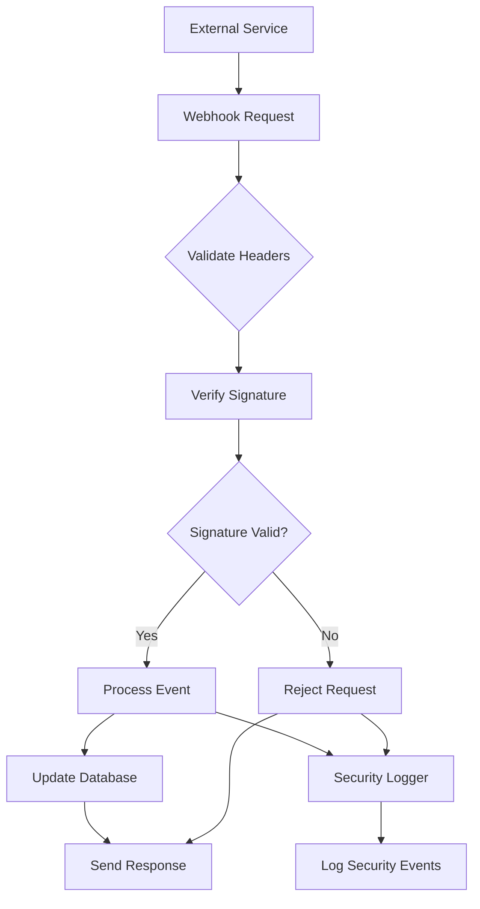
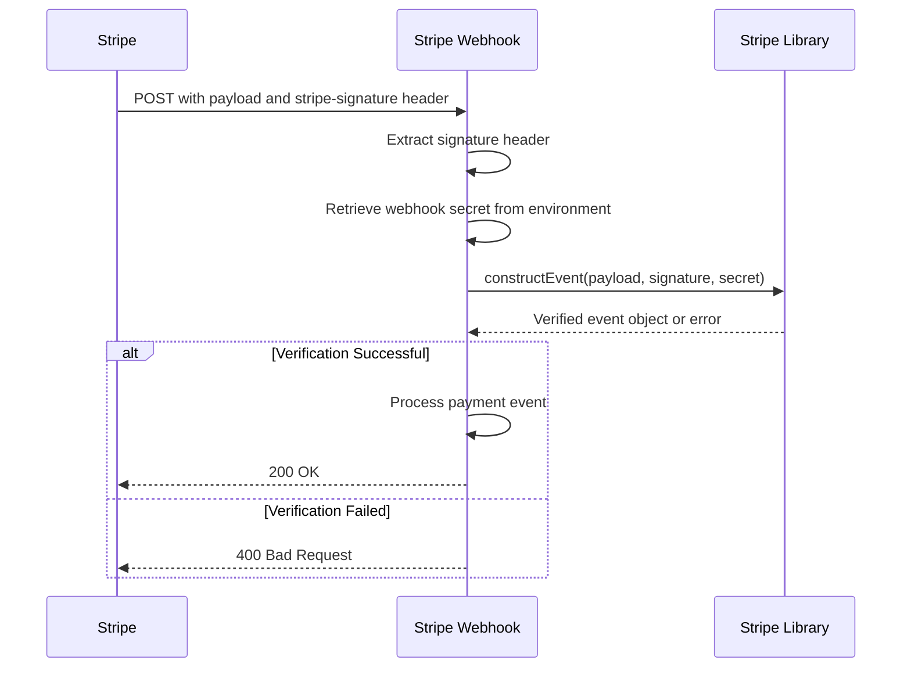
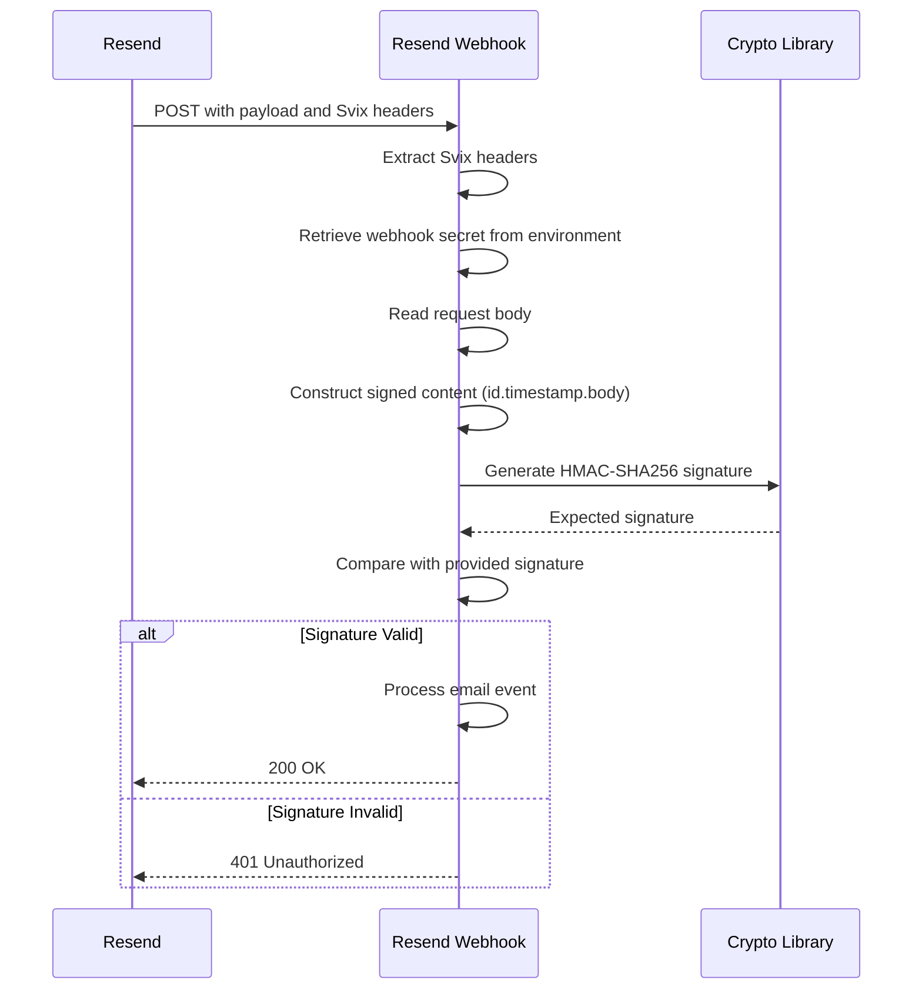
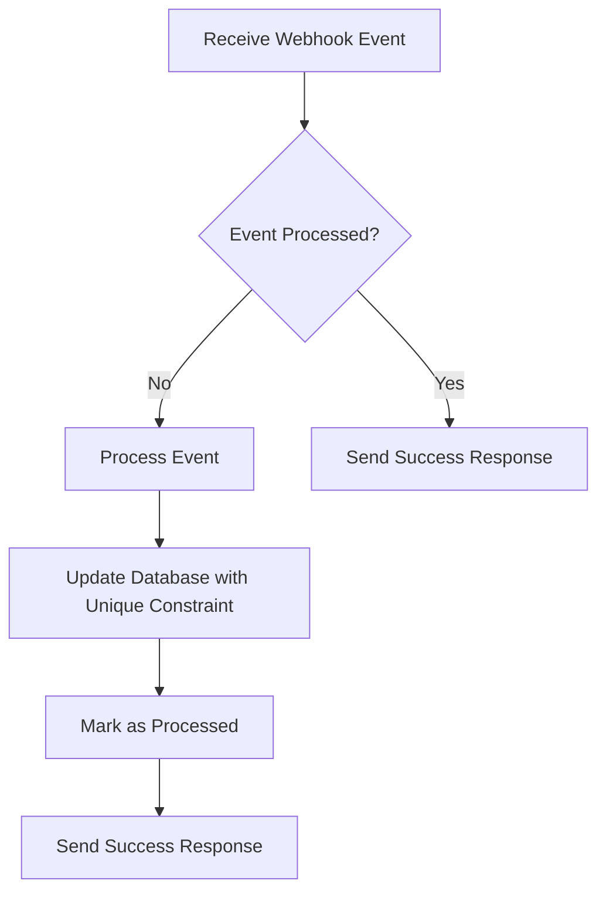
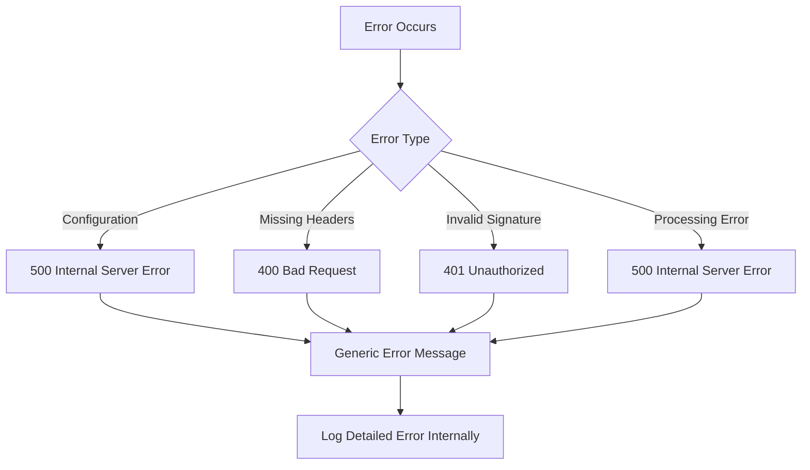
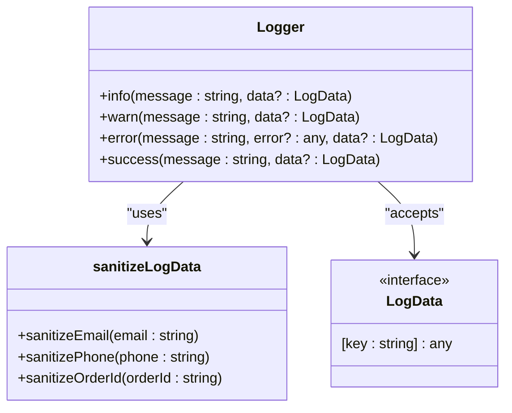
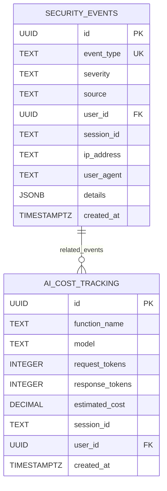

# Webhook Protection

<cite>
**Referenced Files in This Document**   
- [stripe-webhook\index.ts](file://supabase/functions/stripe-webhook/index.ts)
- [resend-webhook\index.ts](file://supabase/functions/resend-webhook/index.ts)
- [logger.ts](file://supabase/functions/_shared/logger.ts)
- [securityLogger.ts](file://supabase/functions/shared/securityLogger.ts)
- [config.toml](file://supabase/config.toml)
- [20251127194411_08e21416-fb07-4471-a062-d1c8e91e52c3.sql](file://supabase/migrations/20251127194411_08e21416-fb07-4471-a062-d1c8e91e52c3.sql)
- [SecurityMonitoringDashboard.tsx](file://src/components/admin/SecurityMonitoringDashboard.tsx)
</cite>

## Table of Contents
1. [Introduction](#introduction)
2. [Webhook Endpoints](#webhook-endpoints)
3. [Security Implementation](#security-implementation)
4. [Signature Verification Process](#signature-verification-process)
5. [Replay Attack Prevention](#replay-attack-prevention)
6. [Idempotency Handling](#idempotency-handling)
7. [Error Response Strategies](#error-response-strategies)
8. [Client Implementation Guidelines](#client-implementation-guidelines)
9. [Security Considerations](#security-considerations)
10. [Monitoring and Debugging](#monitoring-and-debugging)

## Introduction
This document provides comprehensive API documentation for webhook security implementation in the Sleek Apparels backend. It covers the secure handling of external webhook events from Stripe and other third-party services, focusing on cryptographic signature verification, replay attack prevention, and secure processing of payment-related events. The documentation details the implementation of webhook endpoints, security protocols, and monitoring systems that ensure the integrity and authenticity of incoming webhook events.

## Webhook Endpoints
The Sleek Apparels backend implements two primary webhook endpoints for handling external service notifications:

### Stripe Webhook Endpoint
- **URL**: `/functions/v1/stripe-webhook`
- **HTTP Method**: POST
- **Purpose**: Handles payment events from Stripe, including successful payments, failed payments, and other payment-related events
- **Authentication**: Cryptographic signature verification using Stripe's signing secret

### Resend Webhook Endpoint
- **URL**: `/functions/v1/resend-webhook`
- **HTTP Method**: POST
- **Purpose**: Handles email delivery events from Resend, including delivered, bounced, and delayed emails
- **Authentication**: Svix signature verification with HMAC-SHA256

**Section sources**
- [stripe-webhook\index.ts](file://supabase/functions/stripe-webhook/index.ts#L1-L114)
- [resend-webhook\index.ts](file://supabase/functions/resend-webhook/index.ts#L1-L118)

## Security Implementation
The webhook security implementation follows industry best practices for securing external event processing. The system employs multiple layers of security to ensure the authenticity and integrity of incoming webhook events.

**Diagram sources**
- [stripe-webhook\index.ts](file://supabase/functions/stripe-webhook/index.ts#L15-L51)
- [resend-webhook\index.ts](file://supabase/functions/resend-webhook/index.ts#L25-L51)

**Section sources**
- [stripe-webhook\index.ts](file://supabase/functions/stripe-webhook/index.ts#L1-L114)
- [resend-webhook\index.ts](file://supabase/functions/resend-webhook/index.ts#L1-L118)

## Signature Verification Process
The webhook endpoints implement robust signature verification processes to authenticate the source of incoming events and ensure payload integrity.

### Stripe Signature Verification
The Stripe webhook function validates payloads using Stripe's signing secret through the following process:

1. Extract the `stripe-signature` header from the incoming request
2. Retrieve the Stripe webhook secret from environment variables
3. Use Stripe's official library to construct and verify the event
4. Handle verification failures with appropriate error responses

**Diagram sources**
- [stripe-webhook\index.ts](file://supabase/functions/stripe-webhook/index.ts#L16-L51)

**Section sources**
- [stripe-webhook\index.ts](file://supabase/functions/stripe-webhook/index.ts#L16-L51)

### Resend Signature Verification
The Resend webhook uses Svix for signature verification with the following process:

1. Extract Svix headers (`svix-id`, `svix-timestamp`, `svix-signature`) from the request
2. Retrieve the Resend webhook secret from environment variables
3. Construct the signed content string using the Svix headers and request body
4. Generate the expected signature using HMAC-SHA256
5. Compare the expected signature with the provided signature

**Diagram sources**
- [resend-webhook\index.ts](file://supabase/functions/resend-webhook/index.ts#L25-L51)

**Section sources**
- [resend-webhook\index.ts](file://supabase/functions/resend-webhook/index.ts#L16-L51)

## Replay Attack Prevention
The webhook implementation includes mechanisms to prevent replay attacks by validating the authenticity and freshness of incoming requests.

### Timestamp Validation
Both webhook endpoints validate the timing of incoming requests to prevent replay attacks:

- **Stripe Webhook**: The Stripe library automatically validates the event timestamp as part of the signature verification process
- **Resend Webhook**: The Svix signature includes a timestamp that is validated during the verification process

### Request Freshness
The system ensures that webhook requests are processed only if they are recent and have not been previously processed:

- **Stripe**: The Stripe library handles deduplication of events using unique event IDs
- **Resend**: The Svix signature verification process includes timestamp validation to prevent replay attacks

**Section sources**
- [stripe-webhook\index.ts](file://supabase/functions/stripe-webhook/index.ts#L44-L45)
- [resend-webhook\index.ts](file://supabase/functions/resend-webhook/index.ts#L41-L44)

## Idempotency Handling
The webhook system implements idempotency to prevent duplicate processing of events, ensuring that repeated delivery of the same event does not result in duplicate actions.

### Idempotency Keys
The system uses unique identifiers from the external services to ensure idempotent processing:

- **Stripe Events**: Uses the Stripe event ID as a unique identifier
- **Resend Events**: Uses the email ID from the Resend event data

### Database Operations
All database updates are performed with unique constraints and conditional updates to prevent duplicate processing:

**Diagram sources**
- [stripe-webhook\index.ts](file://supabase/functions/stripe-webhook/index.ts#L67-L74)
- [resend-webhook\index.ts](file://supabase/functions/resend-webhook/index.ts#L71-L77)

**Section sources**
- [stripe-webhook\index.ts](file://supabase/functions/stripe-webhook/index.ts#L60-L79)
- [resend-webhook\index.ts](file://supabase/functions/resend-webhook/index.ts#L69-L78)

## Error Response Strategies
The webhook endpoints implement comprehensive error handling and response strategies to provide clear feedback while maintaining security.

### Error Response Codes
The system uses appropriate HTTP status codes for different error conditions:

- **400 Bad Request**: Missing required headers or invalid request format
- **401 Unauthorized**: Invalid signature verification
- **403 Forbidden**: Unauthorized access attempts
- **500 Internal Server Error**: Internal processing errors

### Error Response Content
Error responses include minimal information to prevent information leakage:

- Generic error messages that do not reveal implementation details
- No stack traces or sensitive information in error responses
- Consistent response format for all error conditions

**Diagram sources**
- [stripe-webhook\index.ts](file://supabase/functions/stripe-webhook/index.ts#L22-L25)
- [resend-webhook\index.ts](file://supabase/functions/resend-webhook/index.ts#L19-L22)

**Section sources**
- [stripe-webhook\index.ts](file://supabase/functions/stripe-webhook/index.ts#L20-L33)
- [resend-webhook\index.ts](file://supabase/functions/resend-webhook/index.ts#L16-L35)

## Client Implementation Guidelines
This section provides guidelines for securely sending webhooks to the Sleek Apparels platform.

### Secure Configuration
- Store webhook secrets securely in environment variables
- Never expose webhook secrets in client-side code or version control
- Use different secrets for development, staging, and production environments

### Request Headers
Ensure proper headers are included in webhook requests:

- **Stripe**: Include the `stripe-signature` header with the signed payload
- **Resend**: Include Svix headers (`svix-id`, `svix-timestamp`, `svix-signature`)

### Testing Webhooks
- Use test mode in external services for development and testing
- Verify webhook functionality in a staging environment before production deployment
- Monitor webhook delivery and processing using the provided monitoring tools

**Section sources**
- [stripe-webhook\index.ts](file://supabase/functions/stripe-webhook/index.ts#L17-L18)
- [resend-webhook\index.ts](file://supabase/functions/resend-webhook/index.ts#L16-L17)

## Security Considerations
The webhook implementation addresses several critical security considerations to protect the system from various threats.

### Secret Rotation
The system supports secure secret rotation:

- Webhook secrets are stored in environment variables
- Secrets can be rotated without code changes
- The system automatically uses the current secret from the environment

### Logging Without Sensitive Data
The system implements secure logging practices to prevent exposure of sensitive information:

- **PII Sanitization**: Email addresses, phone numbers, and order IDs are automatically sanitized in logs
- **Redaction**: Passwords, tokens, and secrets are redacted from log output
- **Structured Logging**: Logs include context and metadata without sensitive data

**Diagram sources**
- [logger.ts](file://supabase/functions/_shared/logger.ts#L93-L165)

**Section sources**
- [logger.ts](file://supabase/functions/_shared/logger.ts#L6-L81)

### Monitoring for Suspicious Activity
The system includes comprehensive monitoring for detecting and responding to suspicious webhook activity:

- **Security Event Logging**: All security-related events are logged to the `security_events` table
- **Real-time Alerts**: Critical and high-severity events trigger immediate notifications
- **Anomaly Detection**: Unusual patterns in webhook requests are flagged for review

## Monitoring and Debugging
The system provides robust tools for monitoring webhook activity and debugging integration issues.

### Security Monitoring Dashboard
The admin interface includes a comprehensive security monitoring dashboard that displays:

- Real-time security events
- AI cost tracking
- Daily security summaries
- Historical event trends

**Diagram sources**
- [20251127194411_08e21416-fb07-4471-a062-d1c8e91e52c3.sql](file://supabase/migrations/20251127194411_08e21416-fb07-4471-a062-d1c8e91e52c3.sql#L4-L38)
- [SecurityMonitoringDashboard.tsx](file://src/components/admin/SecurityMonitoringDashboard.tsx#L1-L297)

**Section sources**
- [securityLogger.ts](file://supabase/functions/shared/securityLogger.ts#L1-L38)
- [20251127194411_08e21416-fb07-4471-a062-d1c8e91e52c3.sql](file://supabase/migrations/20251127194411_08e21416-fb07-4471-a062-d1c8e91e52c3.sql#L4-L38)

### Debugging Tools
The following tools are available for debugging webhook integration issues:

- **Structured Logs**: Detailed, sanitized logs of webhook processing
- **Event Tracing**: Unique identifiers for tracing webhook events through the system
- **Real-time Monitoring**: Live feed of webhook events and processing status
- **Error Diagnostics**: Clear error messages and troubleshooting guidance

The webhook security implementation in Sleek Apparels provides a robust, secure, and reliable system for handling external events from third-party services. By following the guidelines and best practices outlined in this document, developers can ensure secure and reliable webhook integrations that protect the integrity of the platform and its data.