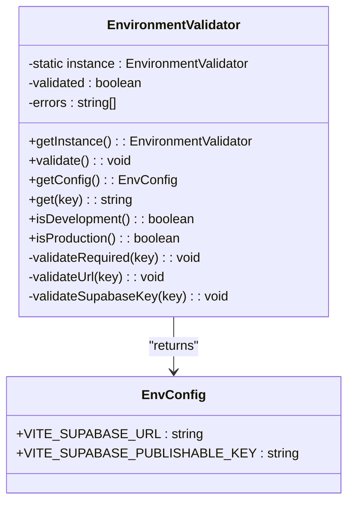
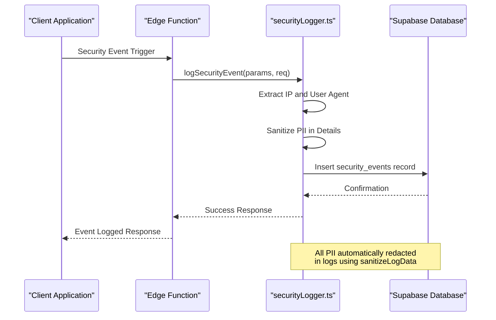
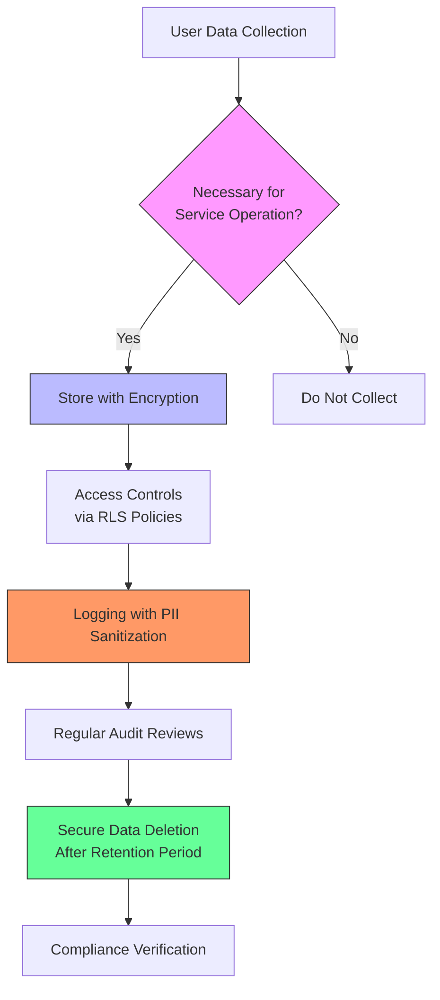
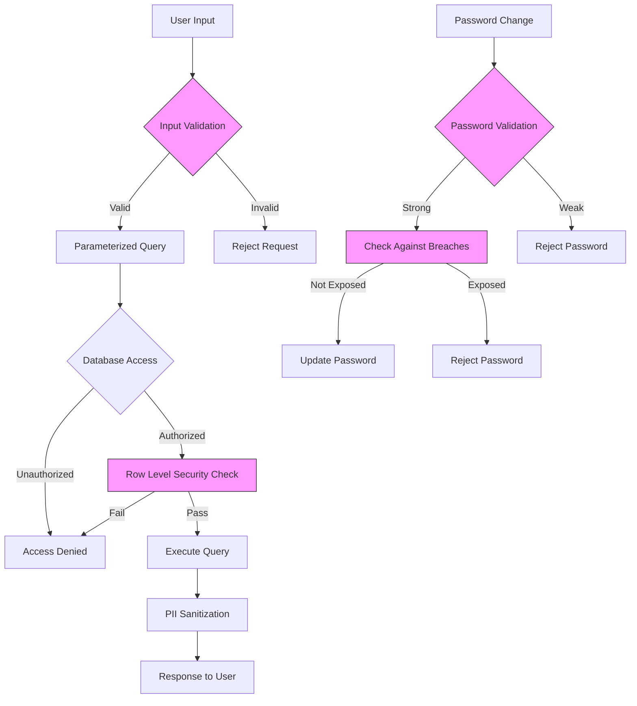

# Data Security and Privacy

<cite>
**Referenced Files in This Document**   
- [env-validator.ts](file://src/lib/env-validator.ts)
- [securityLogger.ts](file://supabase/functions/shared/securityLogger.ts)
- [log-security-event/index.ts](file://supabase/functions/log-security-event/index.ts)
- [password-breach-check/index.ts](file://supabase/functions/password-breach-check/index.ts)
- [logger.ts](file://supabase/functions/_shared/logger.ts)
- [SecurityMonitoringDashboard.tsx](file://src/components/admin/SecurityMonitoringDashboard.tsx)
- [enhancedAuditLog.ts](file://src/lib/enhancedAuditLog.ts)
- [auditLog.ts](file://src/lib/auditLog.ts)
- [ChangePasswordDialog.tsx](file://src/components/ChangePasswordDialog.tsx)
- [supabase/migrations](file://supabase/migrations)
</cite>

## Table of Contents
1. [Introduction](#introduction)
2. [Environment Variable Validation](#environment-variable-validation)
3. [Data Encryption Practices](#data-encryption-practices)
4. [Logging and Monitoring Mechanisms](#logging-and-monitoring-mechanisms)
5. [Privacy Measures and Regulatory Compliance](#privacy-measures-and-regulatory-compliance)
6. [Secure Data Access Patterns](#secure-data-access-patterns)
7. [Vulnerability Prevention](#vulnerability-prevention)
8. [Best Practices for Sensitive Data Handling](#best-practices-for-sensitive-data-handling)
9. [Conclusion](#conclusion)

## Introduction
The Sleek Apparels platform implements a comprehensive security framework to protect user data and ensure privacy compliance. This document details the implementation of critical security features including environment variable validation, data encryption, logging and monitoring, privacy measures, secure data access patterns, and vulnerability prevention mechanisms. The platform follows industry best practices and regulatory requirements to safeguard sensitive information both at rest and in transit.

**Section sources**
- [SECURITY.md](file://SECURITY.md)
- [README.md](file://README.md)

## Environment Variable Validation

The platform implements robust environment variable validation through the `env-validator.ts` module to prevent configuration leaks and ensure proper setup. This validation occurs at application startup and verifies all required environment variables are present and correctly formatted.

The `EnvironmentValidator` class uses a singleton pattern to ensure consistent validation across the application. It performs multiple validation checks:
- Required variable presence and non-empty values
- URL format validation for Supabase URL
- Basic format validation for Supabase publishable key
- Automatic validation in production environments

The validation process is designed to fail fast in production, preventing the application from running with incorrect configuration that could lead to security vulnerabilities or service disruptions.



**Diagram sources**
- [env-validator.ts](file://src/lib/env-validator.ts#L11-L143)

**Section sources**
- [env-validator.ts](file://src/lib/env-validator.ts#L1-L143)

## Data Encryption Practices

The Sleek Apparels platform implements multiple layers of data encryption to protect sensitive information both at rest and in transit. The security architecture follows the principle of defense in depth, ensuring that even if one layer is compromised, additional protections remain in place.

For data in transit, all communications between the client and server use HTTPS with modern TLS protocols. The platform enforces secure connections through CORS policies and origin validation in edge functions. Additionally, sensitive operations such as password changes and authentication use encrypted channels to prevent interception.

For data at rest, the platform leverages Supabase's built-in encryption capabilities for database storage. Sensitive fields like passwords are hashed using industry-standard algorithms before storage. The password breach detection system uses SHA-1 hashing with k-anonymity to check passwords against known breaches without exposing the actual password.

The platform also implements client-side encryption for certain sensitive operations and uses environment variables to store cryptographic keys and secrets, which are validated at startup to prevent accidental exposure.

**Section sources**
- [env-validator.ts](file://src/lib/env-validator.ts#L1-L143)
- [password-breach-check/index.ts](file://supabase/functions/password-breach-check/index.ts#L1-L141)
- [supabase/config.toml](file://supabase/config.toml)

## Logging and Monitoring Mechanisms

The platform implements comprehensive logging and monitoring through the `securityLogger.ts` and related components to capture security-relevant events and enable proactive threat detection.

The security logging system consists of two main components:

1. **Security Event Logging**: The `logSecurityEvent` function captures security-related events such as CAPTCHA failures, rate limit violations, and suspicious patterns. These events are stored in the `security_events` table with details including IP address, user agent, severity level, and event source.

2. **AI Cost Tracking**: The `logAICost` function monitors AI service usage and costs, helping detect potential abuse or unexpected usage patterns that could indicate security issues.

The logging system includes automatic PII (Personally Identifiable Information) sanitization to ensure sensitive data is not inadvertently logged. The `logger.ts` utility provides structured logging with automatic redaction of sensitive fields such as emails, phone numbers, order IDs, passwords, tokens, and secrets.



**Diagram sources**
- [securityLogger.ts](file://supabase/functions/shared/securityLogger.ts#L1-L88)
- [logger.ts](file://supabase/functions/_shared/logger.ts#L1-L173)
- [log-security-event/index.ts](file://supabase/functions/log-security-event/index.ts#L1-L61)

**Section sources**
- [securityLogger.ts](file://supabase/functions/shared/securityLogger.ts#L1-L88)
- [logger.ts](file://supabase/functions/_shared/logger.ts#L1-L173)
- [SecurityMonitoringDashboard.tsx](file://src/components/admin/SecurityMonitoringDashboard.tsx#L214-L236)

## Privacy Measures and Regulatory Compliance

The Sleek Apparels platform implements comprehensive privacy measures to comply with data protection regulations and protect user data throughout its lifecycle.

Key privacy features include:

1. **Data Minimization**: The platform collects only necessary information for business operations and clearly communicates data collection practices in the Privacy Policy.

2. **User Consent Management**: The CookieConsentBanner component ensures users provide informed consent before non-essential cookies are used.

3. **Right to Access and Deletion**: Users can access their data through their profile and request deletion through established procedures.

4. **Data Retention Policies**: The platform implements appropriate data retention periods and securely deletes data when no longer needed.

5. **PII Sanitization**: All logging systems automatically redact sensitive information using the sanitization functions in `logger.ts`, which mask emails, phone numbers, order IDs, and authentication credentials.

6. **Regular Security Audits**: The platform conducts regular security assessments and maintains an audit log of administrative actions.

The platform also implements specific privacy controls in user-facing components such as the ChangePasswordDialog, which validates password strength and checks against known breaches before allowing password changes.



**Diagram sources**
- [logger.ts](file://supabase/functions/_shared/logger.ts#L14-L56)
- [ChangePasswordDialog.tsx](file://src/components/ChangePasswordDialog.tsx#L1-L157)
- [Privacy.tsx](file://src/pages/Privacy.tsx)

**Section sources**
- [logger.ts](file://supabase/functions/_shared/logger.ts#L1-L173)
- [ChangePasswordDialog.tsx](file://src/components/ChangePasswordDialog.tsx#L1-L157)
- [enhancedAuditLog.ts](file://src/lib/enhancedAuditLog.ts#L49-L228)

## Secure Data Access Patterns

The platform implements robust secure data access patterns using Supabase Row Level Security (RLS) policies to ensure users can only access data they are authorized to view.

The RLS policy implementation follows the principle of least privilege, where users are granted the minimum necessary permissions to perform their required tasks. The policies are defined at the database level, providing an additional security layer that cannot be bypassed by application logic errors.

Key RLS policies include:

- **User-specific data access**: Users can only view their own data (orders, payments, messages)
- **Role-based access control**: Admin users have elevated privileges for management tasks
- **Supplier-specific access**: Suppliers can only access data related to their organization
- **Public read access**: Certain content like active CMS content is available to all users

The platform also implements type-safe data access through helper functions in `supabaseHelpers.ts`, which provide compile-time type checking and reduce the risk of injection attacks by using parameterized queries.

```mermaid
erDiagram
USER ||--o{ ORDER : "places"
USER ||--o{ MESSAGE : "sends/receives"
SUPPLIER ||--o{ WORK_ORDER : "manages"
ADMIN ||--o{ CMS_CONTENT : "manages"
USER ||--o{ PAYMENT_HISTORY : "views"
USER {
uuid id PK
text email
text encrypted_password
timestamp created_at
}
ORDER {
uuid id PK
uuid buyer_id FK
uuid supplier_id FK
jsonb order_data
timestamp created_at
}
MESSAGE {
uuid id PK
uuid sender_id FK
uuid recipient_id FK
text content
timestamp created_at
}
WORK_ORDER {
uuid id PK
uuid supplier_id FK
uuid order_id FK
text specifications
timestamp created_at
}
CMS_CONTENT {
uuid id PK
text title
text content
boolean active
timestamp created_at
}
PAYMENT_HISTORY {
uuid id PK
uuid paid_by FK
uuid paid_to FK
decimal amount
text status
timestamp created_at
}
class USER <<RLS Policy>> {
Own data only
}
class ORDER <<RLS Policy>> {
Buyer/Supplier access
}
class MESSAGE <<RLS Policy>> {
Sender/Recipient access
}
class WORK_ORDER <<RLS Policy>> {
Supplier access only
}
class CMS_CONTENT <<RLS Policy>> {
Admin manage, Public read
}
class PAYMENT_HISTORY <<RLS Policy>> {
Involved parties access
}
```

**Diagram sources**
- [supabase/migrations/20251120233928_2016afb8-d720-4858-9e12-7fb4ebbd5de0.sql](file://supabase/migrations/20251120233928_2016afb8-d720-4858-9e12-7fb4ebbd5de0.sql#L156-L218)
- [supabase/migrations/20251115150759_remix_migration_from_pg_dump.sql](file://supabase/migrations/20251115150759_remix_migration_from_pg_dump.sql#L4806-L5046)
- [supabaseHelpers.ts](file://src/lib/supabaseHelpers.ts#L1-L376)

**Section sources**
- [supabase/migrations/20251120233928_2016afb8-d720-4858-9e12-7fb4ebbd5de0.sql](file://supabase/migrations/20251120233928_2016afb8-d720-4858-9e12-7fb4ebbd5de0.sql#L156-L218)
- [supabaseHelpers.ts](file://src/lib/supabaseHelpers.ts#L1-L376)
- [types/README.md](file://src/types/README.md#L1-L239)

## Vulnerability Prevention

The platform implements multiple layers of protection against common vulnerabilities such as data exposure and injection attacks.

### Data Exposure Prevention
The system prevents data exposure through:
- **Row Level Security**: Database-level policies ensure users can only access authorized data
- **PII Sanitization**: Automatic redaction of sensitive information in logs and error messages
- **Environment Validation**: Prevention of configuration leaks through environment variable validation
- **Origin Validation**: Edge functions validate request origins to prevent unauthorized access

### Injection Attack Prevention
The platform mitigates injection attacks through:
- **Parameterized Queries**: All database operations use parameterized queries via the Supabase client
- **Input Validation**: Strict validation of user inputs using Zod schemas
- **Edge Function Isolation**: Sensitive operations are isolated in edge functions with limited privileges
- **Rate Limiting**: Protection against brute force attacks and abuse

### Authentication Security
The platform enhances authentication security with:
- **Password Breach Detection**: Integration with Have I Been Pwned API using k-anonymity
- **Multi-factor Authentication**: Support for OTP-based verification
- **Session Management**: Secure session handling with refresh tokens



**Diagram sources**
- [password-breach-check/index.ts](file://supabase/functions/password-breach-check/index.ts#L1-L141)
- [env-validator.ts](file://src/lib/env-validator.ts#L1-L143)
- [logger.ts](file://supabase/functions/_shared/logger.ts#L1-L173)
- [ChangePasswordDialog.tsx](file://src/components/ChangePasswordDialog.tsx#L1-L157)

**Section sources**
- [password-breach-check/index.ts](file://supabase/functions/password-breach-check/index.ts#L1-L141)
- [submit-quote/index.ts](file://supabase/functions/submit-quote/index.ts#L29-L109)
- [ai-quote-generator/index.ts](file://supabase/functions/ai-quote-generator/index.ts#L168-L206)

## Best Practices for Sensitive Data Handling

When extending the Sleek Apparels platform, developers should follow these best practices for handling sensitive data:

1. **Environment Variables**: Store all sensitive configuration in environment variables and validate them at startup using the `env-validator.ts` module.

2. **Data Minimization**: Collect only the minimum necessary data required for functionality.

3. **Encryption**: Ensure sensitive data is encrypted both in transit (HTTPS/TLS) and at rest (database encryption).

4. **Access Controls**: Implement Row Level Security policies to restrict data access to authorized users.

5. **Logging Security**: Never log sensitive information such as passwords, tokens, or full PII. Use the PII sanitization utilities.

6. **Input Validation**: Validate all user inputs on both client and server sides.

7. **Error Handling**: Ensure error messages do not leak sensitive information about the system.

8. **Regular Audits**: Use the audit logging system to track sensitive operations and conduct regular security reviews.

9. **Dependency Management**: Keep all dependencies updated and monitor for security vulnerabilities.

10. **Security Testing**: Implement automated security testing in the development pipeline.

**Section sources**
- [env-validator.ts](file://src/lib/env-validator.ts#L1-L143)
- [securityLogger.ts](file://supabase/functions/shared/securityLogger.ts#L1-L88)
- [enhancedAuditLog.ts](file://src/lib/enhancedAuditLog.ts#L49-L228)
- [logger.ts](file://supabase/functions/_shared/logger.ts#L1-L173)

## Conclusion

The Sleek Apparels platform implements a comprehensive security and privacy framework that protects user data and ensures regulatory compliance. Through environment variable validation, data encryption, robust logging and monitoring, privacy-preserving practices, secure data access patterns, and vulnerability prevention mechanisms, the platform maintains a strong security posture.

The implementation follows security best practices including defense in depth, least privilege, and secure by default principles. The combination of client-side validation, server-side enforcement, database-level security policies, and comprehensive monitoring creates multiple layers of protection against potential threats.

As the platform evolves, these security practices should be maintained and enhanced to address emerging threats and ensure continued protection of user data and privacy.