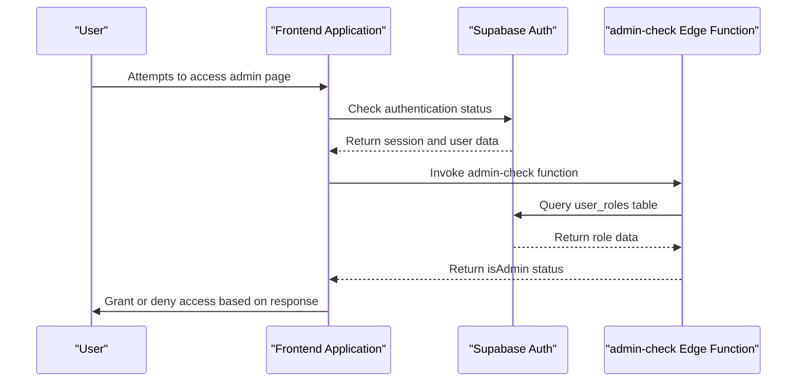
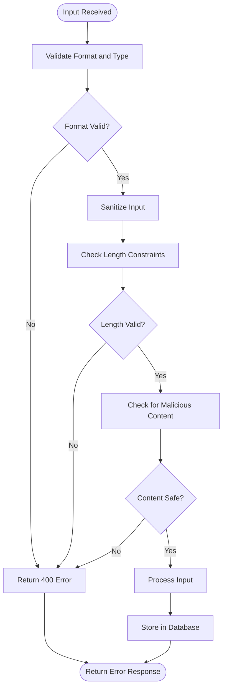
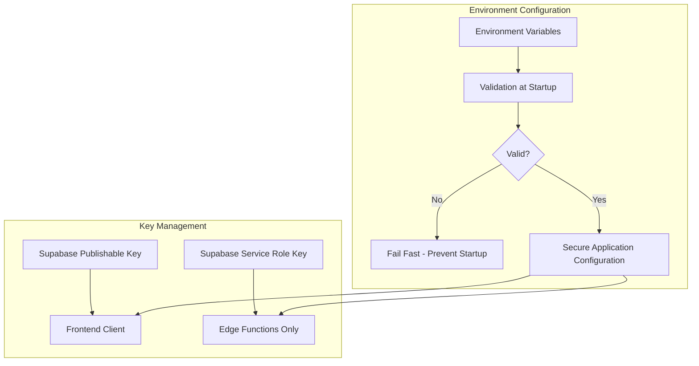
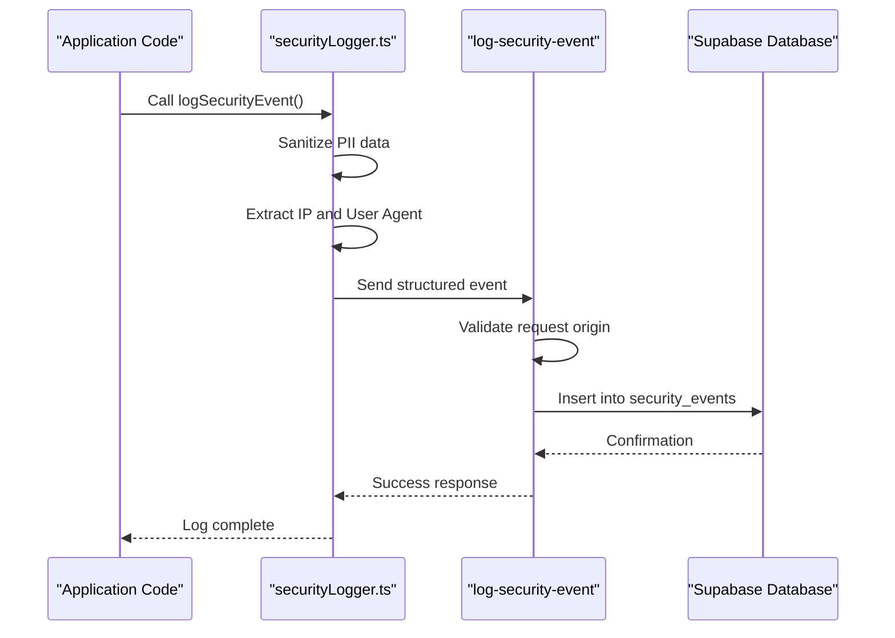

# Security Considerations

<cite>
**Referenced Files in This Document**   
- [AuthContext.tsx](file://src/contexts/AuthContext.tsx)
- [client.ts](file://src/integrations/supabase/client.ts)
- [useAdminAuth.ts](file://src/hooks/useAdminAuth.ts)
- [ProtectedRoute.tsx](file://src/components/routes/ProtectedRoute.tsx)
- [RoleBasedRoute.tsx](file://src/components/routes/RoleBasedRoute.tsx)
- [env-validator.ts](file://src/lib/env-validator.ts)
- [log-security-event/index.ts](file://supabase/functions/log-security-event/index.ts)
- [admin-check/index.ts](file://supabase/functions/admin-check/index.ts)
- [shared/securityLogger.ts](file://supabase/functions/shared/securityLogger.ts)
- [password-breach-check/index.ts](file://supabase/functions/password-breach-check/index.ts)
- [SECURITY.md](file://SECURITY.md)
- [20251120233928_2016afb8-d720-4858-9e12-7fb4ebbd5de0.sql](file://supabase/migrations/20251120233928_2016afb8-d720-4858-9e12-7fb4ebbd5de0.sql)
- [20251127194411_08e21416-fb07-4471-a062-d1c8e91e52c3.sql](file://supabase/migrations/20251127194411_08e21416-fb07-4471-a062-d1c8e91e52c3.sql)
- [_shared/logger.ts](file://supabase/functions/_shared/logger.ts)
</cite>

## Table of Contents
1. [Authentication and Authorization](#authentication-and-authorization)
2. [Row Level Security Policies](#row-level-security-policies)
3. [Input Validation and Sanitization](#input-validation-and-sanitization)
4. [Secure Environment Configuration](#secure-environment-configuration)
5. [Security Logging and Monitoring](#security-logging-and-monitoring)
6. [Data Protection and Privacy Compliance](#data-protection-and-privacy-compliance)
7. [Secure Communication](#secure-communication)
8. [Common Security Vulnerabilities and Mitigations](#common-security-vulnerabilities-and-mitigations)
9. [Secure Development Practices](#secure-development-practices)

## Authentication and Authorization

The Sleek Apparels platform implements a robust authentication and authorization system using Supabase Auth with role-based access control (RBAC). The system is designed to provide secure access to different user types including buyers, suppliers, and administrators.

Authentication is handled through Supabase's authentication service, which supports email/password, social logins, and magic links. The `AuthContext.tsx` file implements a React context that manages the user session, role, and authentication state across the application. When a user logs in, the system retrieves their role from the `user_roles` table and determines their user type (buyer, supplier, or admin) based on the role.

Authorization is implemented through a multi-layered approach. The frontend uses two key components: `ProtectedRoute.tsx` and `RoleBasedRoute.tsx`. The `ProtectedRoute` component ensures that only authenticated users can access protected pages, redirecting unauthenticated users to the login page. The `RoleBasedRoute` component provides more granular control by allowing access only to users with specific roles or user types.

For administrative functions, the platform implements an additional security layer through the `useAdminAuth.ts` hook and the `admin-check` Edge Function. This server-side validation ensures that even if a user's role is somehow compromised on the client side, they cannot access admin functionality without proper server-side verification. The `admin-check` function queries the `user_roles` table to verify if the user has the 'admin' role before granting access.



**Diagram sources**
- [AuthContext.tsx](file://src/contexts/AuthContext.tsx#L1-L166)
- [useAdminAuth.ts](file://src/hooks/useAdminAuth.ts#L1-L47)
- [admin-check/index.ts](file://supabase/functions/admin-check/index.ts#L1-L74)

**Section sources**
- [AuthContext.tsx](file://src/contexts/AuthContext.tsx#L1-L166)
- [ProtectedRoute.tsx](file://src/components/routes/ProtectedRoute.tsx#L1-L36)
- [RoleBasedRoute.tsx](file://src/components/routes/RoleBasedRoute.tsx#L1-L60)

## Row Level Security Policies

The Sleek Apparels platform implements comprehensive Row Level Security (RLS) policies in the Supabase database to ensure that users can only access data they are authorized to view or modify. These policies are defined in SQL migration files and enforced at the database level, providing a critical security layer that cannot be bypassed by client-side code.

The RLS policies follow the principle of least privilege, granting users the minimum permissions necessary to perform their functions. For example, suppliers can only view and update work orders associated with their supplier ID, while buyers can only access their own orders and quotes. The policies are implemented using PostgreSQL's RLS features and leverage Supabase's authentication context through the `auth.uid()` function.

Key RLS policies include:
- Suppliers can view and update their own work orders based on supplier ID
- Users can view messages where they are either the sender or recipient
- Users can send messages only with their own user ID as the sender
- Users can update messages only when they are the recipient
- Admins can manage all CMS content through role-based checks
- Anyone can view active CMS content, but only admins can modify it
- Admins can view all payment history, while users can only view their own payments

The platform also implements RLS for internal monitoring tables such as `security_events` and `ai_cost_tracking`. These tables have policies that restrict access to the service role only, preventing even administrative users from directly accessing or modifying security monitoring data.

```mermaid
erDiagram
USER ||--o{ WORK_ORDER : "creates"
USER ||--o{ MESSAGE : "sends/receives"
USER ||--o{ PAYMENT_HISTORY : "initiates/receives"
ADMIN ||--o{ CMS_CONTENT : "manages"
SUPPLIER ||--o{ WORK_ORDER : "fulfills"
class WORK_ORDER {
+id
+supplier_id FK
+order_id FK
+status
+created_at
}
class MESSAGE {
+id
+sender_id FK
+recipient_id FK
+content
+created_at
}
class PAYMENT_HISTORY {
+id
+paid_by FK
+paid_to FK
+amount
+status
}
class CMS_CONTENT {
+id
+title
+content
+active
+created_at
}
```

**Diagram sources**
- [20251120233928_2016afb8-d720-4858-9e12-7fb4ebbd5de0.sql](file://supabase/migrations/20251120233928_2016afb8-d720-4858-9e12-7fb4ebbd5de0.sql#L156-L189)
- [20251127194411_08e21416-fb07-4471-a062-d1c8e91e52c3.sql](file://supabase/migrations/20251127194411_08e21416-fb07-4471-a062-d1c8e91e52c3.sql#L64-L78)

**Section sources**
- [20251120233928_2016afb8-d720-4858-9e12-7fb4ebbd5de0.sql](file://supabase/migrations/20251120233928_2016afb8-d720-4858-9e12-7fb4ebbd5de0.sql#L156-L189)

## Input Validation and Sanitization

The Sleek Apparels platform implements comprehensive input validation and sanitization at multiple levels to prevent common security vulnerabilities such as injection attacks, cross-site scripting (XSS), and data integrity issues.

On the client side, the application uses React's built-in protections against XSS and implements form validation using the React Hook Form library. The `env-validator.ts` file validates environment variables at application startup, ensuring that critical configuration values like Supabase URLs and keys are present and properly formatted. This validation includes checks for required fields, URL format validation, and basic key format verification.

The platform's Edge Functions implement rigorous input validation to prevent malicious data from reaching the database. For example, the `password-breach-check` function validates that the password parameter is a non-empty string before processing. The `send-otp` function includes email sanitization to prevent header injection attacks by removing carriage returns and line feeds from email addresses.

Email validation is particularly robust, implementing multiple layers of protection:
- Format validation using a comprehensive regex pattern
- Length constraints (minimum 5 characters, maximum 254 characters)
- Disposable email domain blocking
- Sanitization to prevent header injection attacks

The platform also implements rate limiting to prevent abuse of public endpoints. The `submit-quote` function includes a rate limiter that restricts users to 10 requests per hour from the same IP address, helping to prevent automated attacks and denial-of-service attempts.



**Diagram sources**
- [env-validator.ts](file://src/lib/env-validator.ts#L1-L143)
- [send-otp/index.ts](file://supabase/functions/send-otp/index.ts#L34-L81)
- [password-breach-check/index.ts](file://supabase/functions/password-breach-check/index.ts#L98-L104)

**Section sources**
- [env-validator.ts](file://src/lib/env-validator.ts#L1-L143)
- [send-otp/index.ts](file://supabase/functions/send-otp/index.ts#L34-L81)

## Secure Environment Configuration

The Sleek Apparels platform implements secure environment configuration practices to protect sensitive credentials and ensure proper application configuration across different environments.

Environment variables are managed through a validation system implemented in `env-validator.ts`. This system validates required environment variables at application startup, specifically checking for `VITE_SUPABASE_URL` and `VITE_SUPABASE_PUBLISHABLE_KEY`. The validation includes format checks to ensure the Supabase URL is a valid URL and that the publishable key has appropriate length, helping to catch configuration errors early.

In production environments, the validation is enforced strictly, with the application failing to start if required variables are missing or invalid. This fail-fast approach prevents the application from running with potentially insecure or incorrect configurations. The validation also includes development mode detection, allowing for more flexible configuration during development while maintaining strict requirements in production.

The platform follows the principle of least privilege in its environment configuration. The frontend client uses the publishable key rather than the service role key, limiting its database access to what is permitted by Row Level Security policies. The service role key is only used in trusted server environments like Edge Functions, preventing it from being exposed to client-side code.



**Diagram sources**
- [client.ts](file://src/integrations/supabase/client.ts#L1-L20)
- [env-validator.ts](file://src/lib/env-validator.ts#L1-L143)

**Section sources**
- [client.ts](file://src/integrations/supabase/client.ts#L1-L20)
- [env-validator.ts](file://src/lib/env-validator.ts#L1-L143)

## Security Logging and Monitoring

The Sleek Apparels platform implements comprehensive security logging and monitoring through Supabase Edge Functions to detect and respond to potential security incidents.

The platform uses a dedicated `log-security-event` Edge Function to record security-related events in a `security_events` table. This function captures critical information including event type, severity level, source, IP address, user agent, and additional details. The function is designed to be called from various parts of the application when security-relevant events occur, such as failed login attempts or suspicious activity patterns.

A shared `securityLogger.ts` utility provides consistent logging capabilities across multiple Edge Functions. This utility includes functions for logging security events and AI cost tracking, ensuring standardized format and handling across different services. The logger automatically captures IP address and user agent information from request headers, providing valuable context for security analysis.

All log data is sanitized to protect personally identifiable information (PII). The `_shared/logger.ts` file includes sanitization functions for email addresses, phone numbers, and order IDs, which redact sensitive information while preserving enough data for debugging and analysis. For example, email addresses are displayed with only the first three characters visible, followed by asterisks and the domain.

The platform also implements structured logging with timestamp formatting to ensure consistent log entries that can be easily parsed and analyzed. Security events are categorized by severity levels (low, medium, high, critical) to facilitate prioritization of incident response.



**Diagram sources**
- [log-security-event/index.ts](file://supabase/functions/log-security-event/index.ts#L1-L61)
- [shared/securityLogger.ts](file://supabase/functions/shared/securityLogger.ts#L1-L88)
- [_shared/logger.ts](file://supabase/functions/_shared/logger.ts#L1-L88)

**Section sources**
- [log-security-event/index.ts](file://supabase/functions/log-security-event/index.ts#L1-L61)
- [shared/securityLogger.ts](file://supabase/functions/shared/securityLogger.ts#L1-L88)

## Data Protection and Privacy Compliance

The Sleek Apparels platform implements robust data protection measures and privacy compliance practices to safeguard user information and meet regulatory requirements.

Personal data is protected through multiple layers of security controls. The platform uses Supabase's built-in encryption for data at rest and TLS for data in transit. Sensitive personal information such as email addresses, phone numbers, and order IDs are automatically sanitized in logs through the PII sanitization utilities in `_shared/logger.ts`, ensuring that sensitive data is not exposed in debugging or monitoring systems.

The platform implements data minimization principles, collecting only the information necessary for business operations. User roles are stored in a separate `user_roles` table rather than as part of user profiles, allowing for more granular access control without exposing role information unnecessarily.

For privacy compliance, the platform provides users with appropriate controls over their data. The `SECURITY.md` file outlines the project's security policy, including supported versions and vulnerability reporting procedures. The system is designed to support data subject rights under privacy regulations, with data access and deletion operations properly logged through the audit logging system.

The platform also implements proper session management with secure cookie settings, automatic session expiration, and the ability for users to sign out and invalidate their sessions across all devices.

**Section sources**
- [AuthContext.tsx](file://src/contexts/AuthContext.tsx#L1-L166)
- [_shared/logger.ts](file://supabase/functions/_shared/logger.ts#L1-L88)
- [SECURITY.md](file://SECURITY.md#L1-L22)

## Secure Communication

The Sleek Apparels platform implements secure communication practices to protect data in transit and prevent common web vulnerabilities.

All communication between the client and server occurs over HTTPS, with mixed content prevented through proper configuration. The Edge Functions implement CORS (Cross-Origin Resource Sharing) policies to restrict which domains can access the APIs. Each Edge Function includes CORS headers that specify allowed origins, preventing unauthorized domains from making requests to the functions.

The platform implements origin validation in production environments to prevent cross-site request forgery (CSRF) attacks. Functions like `password-breach-check`, `submit-quote`, and `ai-quote-generator` validate the request origin against a whitelist of allowed domains, including the production domain, localhost for development, and approved preview environments. The validation parses the origin hostname properly and supports subdomains, ensuring legitimate requests are accepted while blocking unauthorized ones.

API endpoints are protected against unauthorized access through a combination of authentication, authorization, and origin validation. The platform uses Supabase's built-in authentication tokens to verify user identity, role-based access control to ensure users have appropriate permissions, and origin validation to confirm requests come from trusted domains.

**Section sources**
- [password-breach-check/index.ts](file://supabase/functions/password-breach-check/index.ts#L1-L141)
- [submit-quote/index.ts](file://supabase/functions/submit-quote/index.ts#L29-L109)
- [ai-quote-generator/index.ts](file://supabase/functions/ai-quote-generator/index.ts#L168-L206)

## Common Security Vulnerabilities and Mitigations

The Sleek Apparels platform addresses several common security vulnerabilities through proactive mitigation strategies:

**Authentication Vulnerabilities**: The platform mitigates weak authentication through the `password-breach-check` Edge Function, which integrates with the Have I Been Pwned API to prevent users from using passwords that have been exposed in data breaches. This function uses the k-anonymity model, sending only the first five characters of a SHA-1 hash to the external service, ensuring the full password is never transmitted.

**Injection Attacks**: The platform prevents SQL injection through the use of Supabase's query builder and parameterized queries, which separate code from data. No raw SQL is constructed from user input anywhere in the application.

**Cross-Site Scripting (XSS)**: Client-side XSS is prevented through React's automatic escaping of variables and proper use of JSX. The platform avoids using `dangerouslySetInnerHTML` except in controlled circumstances with proper sanitization.

**Cross-Site Request Forgery (CSRF)**: CSRF protection is implemented through origin validation in Edge Functions and the use of Supabase's authentication tokens, which are required for all privileged operations.

**Insecure Direct Object References**: This vulnerability is mitigated through Row Level Security policies that ensure users can only access data they are authorized to view, regardless of the object ID they request.

**Security Misconfiguration**: The platform prevents misconfiguration through environment validation at startup and the use of fail-safe defaults in security policies.

**Sensitive Data Exposure**: Data exposure is prevented through encryption in transit and at rest, PII sanitization in logs, and strict access controls.

**Rate Limiting**: The platform implements rate limiting on public endpoints like `submit-quote` to prevent abuse and denial-of-service attacks.

**Insecure Dependencies**: The platform maintains up-to-date dependencies and follows Supabase's security updates to ensure underlying components are secure.

**Section sources**
- [password-breach-check/index.ts](file://supabase/functions/password-breach-check/index.ts#L1-L141)
- [20251120233928_2016afb8-d720-4858-9e12-7fb4ebbd5de0.sql](file://supabase/migrations/20251120233928_2016afb8-d720-4858-9e12-7fb4ebbd5de0.sql#L156-L189)
- [env-validator.ts](file://src/lib/env-validator.ts#L1-L143)

## Secure Development Practices

When extending the Sleek Apparels codebase, developers should follow these secure development practices:

1. **Always validate and sanitize input**: Never trust client-provided data. Validate all inputs for type, format, length, and range. Sanitize data to remove potentially malicious content.

2. **Follow the principle of least privilege**: Grant users and services only the minimum permissions they need to perform their functions. Use role-based access control and Row Level Security policies to enforce this principle.

3. **Use parameterized queries**: Always use Supabase's query builder or parameterized queries to prevent SQL injection attacks. Never concatenate user input into SQL strings.

4. **Implement proper error handling**: Avoid exposing sensitive information in error messages. Use generic error messages for users while logging detailed errors for administrators.

5. **Protect sensitive data**: Never store or transmit sensitive information in plaintext. Use encryption for data at rest and TLS for data in transit. Sanitize PII in logs and error messages.

6. **Validate authentication and authorization**: Always verify user authentication status and authorization level on the server side, even if the client appears to have the necessary permissions.

7. **Implement rate limiting**: Protect public endpoints from abuse by implementing rate limiting based on IP address or user ID.

8. **Use secure dependencies**: Keep all dependencies up to date and monitor for security vulnerabilities in third-party packages.

9. **Log security events**: Use the `log-security-event` function to record security-relevant events with appropriate severity levels.

10. **Test security controls**: Regularly test authentication, authorization, and input validation controls to ensure they function as intended.

11. **Review code for security issues**: Conduct security-focused code reviews, paying particular attention to authentication, authorization, input validation, and data handling.

12. **Follow environment configuration best practices**: Use environment-specific configuration and never commit sensitive credentials to version control.

**Section sources**
- [client.ts](file://src/integrations/supabase/client.ts#L1-L20)
- [AuthContext.tsx](file://src/contexts/AuthContext.tsx#L1-L166)
- [env-validator.ts](file://src/lib/env-validator.ts#L1-L143)
- [log-security-event/index.ts](file://supabase/functions/log-security-event/index.ts#L1-L61)