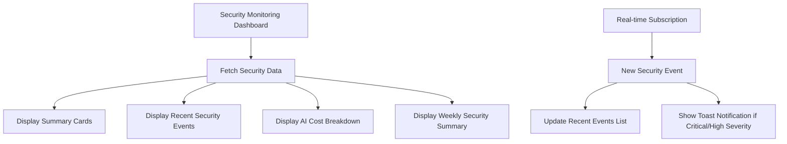
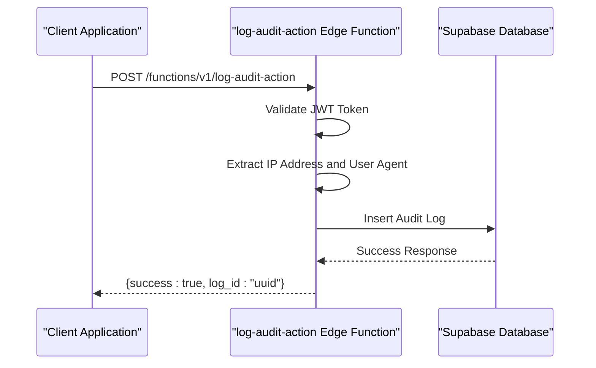
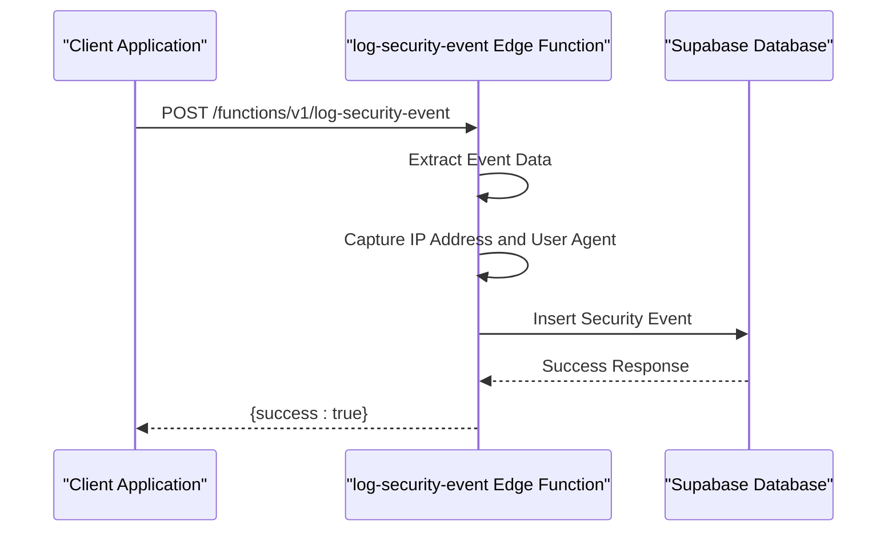
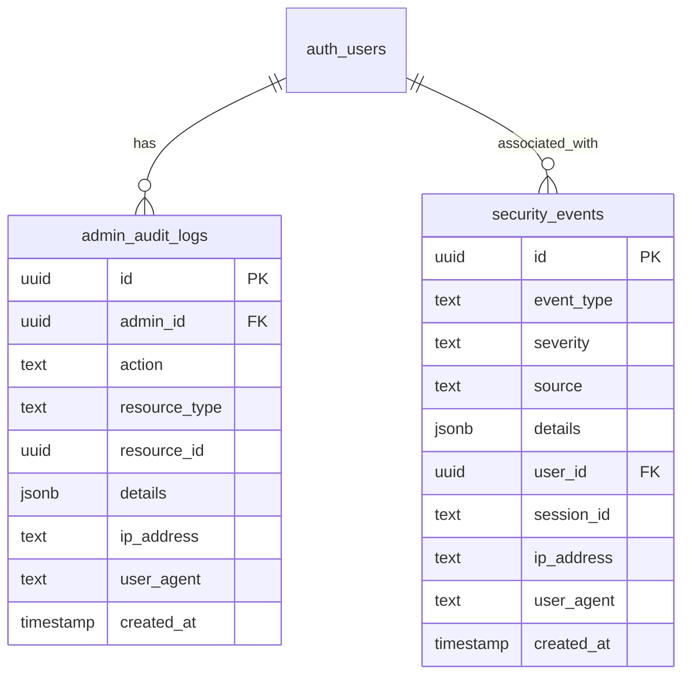
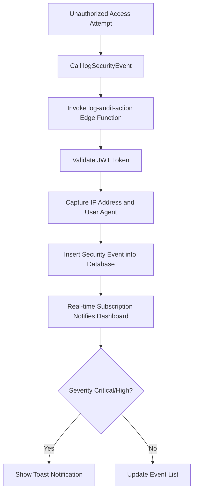
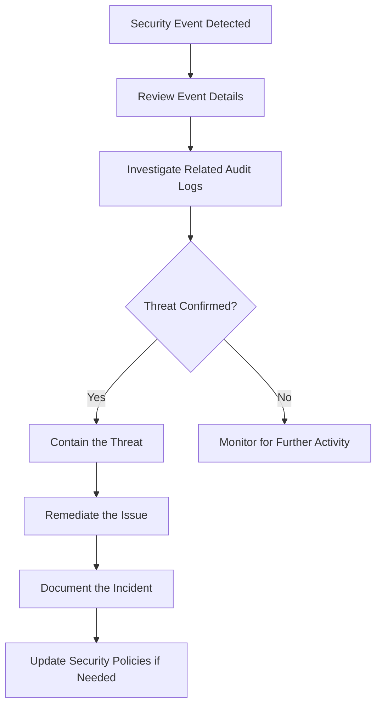
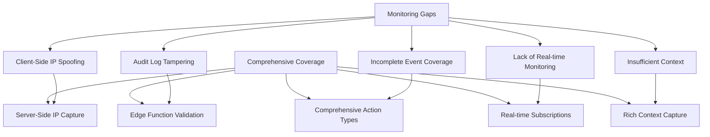
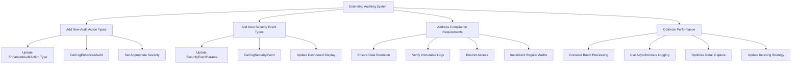

# Security Monitoring and Auditing

<cite>
**Referenced Files in This Document**   
- [SecurityMonitoringDashboard.tsx](file://src/components/admin/SecurityMonitoringDashboard.tsx)
- [log-audit-action/index.ts](file://supabase/functions/log-audit-action/index.ts)
- [log-security-event/index.ts](file://supabase/functions/log-security-event/index.ts)
- [enhancedAuditLog.ts](file://src/lib/enhancedAuditLog.ts)
- [auditLog.ts](file://src/lib/auditLog.ts)
- [AdminAuditLogs.tsx](file://src/pages/AdminAuditLogs.tsx)
- [securityLogger.ts](file://supabase/functions/shared/securityLogger.ts)
- [remix_migration_from_pg_dump.sql](file://supabase/migrations/20251115150759_remix_migration_from_pg_dump.sql)
</cite>

## Table of Contents
1. [Introduction](#introduction)
2. [Security Monitoring Dashboard](#security-monitoring-dashboard)
3. [Audit Logging System](#audit-logging-system)
4. [Security Event Logging](#security-event-logging)
5. [Data Model for Audit and Security Logs](#data-model-for-audit-and-security-logs)
6. [Implementation of Audit and Security Logging](#implementation-of-audit-and-security-logging)
7. [Security Event Triggers and Examples](#security-event-triggers-and-examples)
8. [Administrator Monitoring and Incident Response](#administrator-monitoring-and-incident-response)
9. [Monitoring Gaps and Comprehensive Coverage](#monitoring-gaps-and-comprehensive-coverage)
10. [Extending the Auditing System](#extending-the-auditing-system)
11. [Conclusion](#conclusion)

## Introduction

The security monitoring and auditing system in the SleekApp platform provides comprehensive visibility into user actions, security events, and system activities. This documentation details the implementation of the SecurityMonitoringDashboard, the audit logging system through Edge Functions, the data model for audit logs, and how administrators can use these tools to detect suspicious activities and respond to security incidents. The system is designed to ensure comprehensive coverage of all critical operations while providing extensibility for new features and compliance requirements.

**Section sources**
- [SecurityMonitoringDashboard.tsx](file://src/components/admin/SecurityMonitoringDashboard.tsx)
- [enhancedAuditLog.ts](file://src/lib/enhancedAuditLog.ts)

## Security Monitoring Dashboard

The SecurityMonitoringDashboard provides real-time visibility into security events and AI cost tracking. It displays critical metrics such as critical events, high-priority events, daily AI costs, and total events through summary cards. The dashboard fetches recent security events, cost data, and security summaries from the database and updates in real-time through Supabase's real-time subscription capabilities.

The dashboard includes three main sections:
1. **Recent Security Events**: A live feed of security events and suspicious activity with severity indicators, event types, sources, IP addresses, and detailed information.
2. **AI API Cost Breakdown**: Hourly cost analysis by function and model, showing the financial impact of AI operations.
3. **Weekly Security Summary**: Aggregated security events by type and severity, providing insights into security trends over time.

The dashboard uses real-time subscriptions to receive new security events as they occur, and displays toast notifications for critical and high-severity events to ensure immediate administrator awareness.



**Diagram sources**
- [SecurityMonitoringDashboard.tsx](file://src/components/admin/SecurityMonitoringDashboard.tsx)

**Section sources**
- [SecurityMonitoringDashboard.tsx](file://src/components/admin/SecurityMonitoringDashboard.tsx)

## Audit Logging System

The audit logging system captures user actions and administrative operations through the `log-audit-action` Edge Function. This function validates the user's JWT token to ensure the authenticity of the logged user and captures the IP address and user agent from the request headers for comprehensive audit trails.

The audit logging process involves:
1. **Authentication Validation**: The function validates the JWT token from the Authorization header to authenticate the user.
2. **IP and User Agent Capture**: The function extracts the client's IP address from headers like `x-forwarded-for` or `x-real-ip` and the user agent from the request headers.
3. **Database Insertion**: The audit log is inserted into the `admin_audit_logs` table with the validated user ID, action, resource type, resource ID, details, IP address, and user agent.

The system uses a service role key for database operations, ensuring that the function has the necessary permissions to write to the audit logs table. Error handling is implemented to log any issues during the audit logging process and return appropriate error responses.



**Diagram sources**
- [log-audit-action/index.ts](file://supabase/functions/log-audit-action/index.ts)

**Section sources**
- [log-audit-action/index.ts](file://supabase/functions/log-audit-action/index.ts)
- [enhancedAuditLog.ts](file://src/lib/enhancedAuditLog.ts)

## Security Event Logging

The security event logging system captures security-relevant events through the `log-security-event` Edge Function. This function is designed to log events such as unauthorized access attempts, suspicious activities, and rate limit violations.

The security event logging process involves:
1. **Event Data Extraction**: The function extracts event data from the request body, including event type, severity, source, details, user ID, and session ID.
2. **IP and User Agent Capture**: Similar to the audit logging system, the function captures the client's IP address and user agent from the request headers.
3. **Database Insertion**: The security event is inserted into the `security_events` table with all relevant information.

The system is designed to be called from various parts of the application to log security events in real-time. The function includes comprehensive error handling to ensure that security events are logged even in error conditions.



**Diagram sources**
- [log-security-event/index.ts](file://supabase/functions/log-security-event/index.ts)

**Section sources**
- [log-security-event/index.ts](file://supabase/functions/log-security-event/index.ts)
- [securityLogger.ts](file://supabase/functions/shared/securityLogger.ts)

## Data Model for Audit and Security Logs

The data model for audit and security logs is designed to capture comprehensive information about user actions and security events. The database schema includes two main tables: `admin_audit_logs` for audit logs and `security_events` for security events.

### Admin Audit Logs Table

The `admin_audit_logs` table stores audit logs for administrative actions and user operations. The table structure is as follows:

| Column | Type | Description |
|--------|------|-------------|
| id | uuid | Unique identifier for the audit log |
| admin_id | uuid | ID of the admin user who performed the action |
| action | text | Type of action performed |
| resource_type | text | Type of resource affected by the action |
| resource_id | uuid | ID of the specific resource affected |
| details | jsonb | Additional details about the action |
| ip_address | text | IP address of the client |
| user_agent | text | User agent string of the client |
| created_at | timestamp with time zone | Timestamp when the log was created |

The table includes indexes on `admin_id`, `created_at`, and `(resource_type, resource_id)` for efficient querying. Row-level security policies ensure that only authenticated users with admin role can view audit logs.

### Security Events Table

The `security_events` table stores security events such as unauthorized access attempts and suspicious activities. The table structure is as follows:

| Column | Type | Description |
|--------|------|-------------|
| id | uuid | Unique identifier for the security event |
| event_type | text | Type of security event |
| severity | text | Severity level (low, medium, high, critical) |
| source | text | Source of the security event |
| details | jsonb | Additional details about the event |
| user_id | uuid | ID of the user associated with the event |
| session_id | text | Session ID associated with the event |
| ip_address | text | IP address of the client |
| user_agent | text | User agent string of the client |
| created_at | timestamp with time zone | Timestamp when the event was created |

The table is designed to capture comprehensive information about security events for forensic analysis and incident response.



**Diagram sources**
- [remix_migration_from_pg_dump.sql](file://supabase/migrations/20251115150759_remix_migration_from_pg_dump.sql)

**Section sources**
- [remix_migration_from_pg_dump.sql](file://supabase/migrations/20251115150759_remix_migration_from_pg_dump.sql)

## Implementation of Audit and Security Logging

The implementation of audit and security logging involves both client-side and server-side components. The system uses a layered approach with different logging utilities for different use cases.

### Enhanced Audit Logging

The `enhancedAuditLog.ts` file provides a comprehensive audit logging system with enhanced features. It defines a rich set of audit action types covering various domains:

- **Blog operations**: blog_post_created, blog_post_updated, etc.
- **User & role operations**: user_role_assigned, user_created, etc.
- **Order operations**: order_created, order_status_changed, etc.
- **Payment operations**: payment_initiated, payment_completed, etc.
- **Quote operations**: quote_created, quote_approved, etc.
- **Supplier operations**: supplier_created, supplier_verified, etc.
- **Product operations**: product_created, product_updated, etc.
- **Production operations**: production_stage_updated, quality_check_completed, etc.
- **Security operations**: security_breach_detected, suspicious_activity, etc.
- **Data access operations**: sensitive_data_accessed, data_exported, etc.
- **System operations**: backup_created, settings_changed, etc.

The enhanced audit logging system uses the `log-audit-action` Edge Function to ensure server-side validation and IP capture. It includes error handling and fallback logging to ensure audit integrity even when the Edge Function fails.

### Security Event Implementation

The security event implementation includes specialized functions for logging different types of security events:

- `logSecurityEvent`: Logs critical security events such as security breaches and unauthorized access attempts.
- `logDataAccess`: Logs access to sensitive data with appropriate severity levels based on the operation type.

The system also includes a shared `securityLogger.ts` utility that can be used across multiple Edge Functions to maintain consistency in security event logging.

```mermaid
classDiagram
class EnhancedAuditLog {
+logEnhancedAudit(params)
+logSecurityEvent(action, details)
+logDataAccess(resourceType, resourceId, operation, details)
+getEnhancedAuditLogs(filters)
}
class SecurityLogger {
+logSecurityEvent(params, req)
+logAICost(params)
}
EnhancedAuditLog --> SecurityLogger : "uses"
EnhancedAuditLog --> "log-audit-action" : "invokes"
SecurityLogger --> "security_events" : "writes to"
SecurityLogger --> "ai_cost_tracking" : "writes to"
```

**Diagram sources**
- [enhancedAuditLog.ts](file://src/lib/enhancedAuditLog.ts)
- [securityLogger.ts](file://supabase/functions/shared/securityLogger.ts)

**Section sources**
- [enhancedAuditLog.ts](file://src/lib/enhancedAuditLog.ts)
- [securityLogger.ts](file://supabase/functions/shared/securityLogger.ts)

## Security Event Triggers and Examples

Security events are triggered throughout the application lifecycle in response to various conditions. The system is designed to capture events at critical points to ensure comprehensive monitoring coverage.

### Common Security Event Triggers

1. **Authentication and Authorization Events**:
   - Failed login attempts
   - Unauthorized access attempts to restricted resources
   - Role assignment changes
   - Password reset requests

2. **Rate Limiting Events**:
   - Rate limit exceeded for API endpoints
   - Suspicious pattern of rapid requests
   - CAPTCHA failures

3. **Data Access Events**:
   - Access to sensitive data
   - Data export operations
   - Bulk data deletion

4. **System and Configuration Events**:
   - Security configuration changes
   - Backup and restore operations
   - System maintenance activities

5. **AI and Cost Monitoring Events**:
   - AI cost threshold exceeded
   - Unusual AI usage patterns
   - High-cost AI operations

### Example Implementation

When a user attempts to access a restricted resource without proper authorization, the following sequence occurs:

1. The application detects the unauthorized access attempt.
2. The `logSecurityEvent` function is called with the action `unauthorized_access_attempt` and relevant details.
3. The function calls the `log-audit-action` Edge Function with server-side validation.
4. The Edge Function validates the user's JWT token, captures the IP address and user agent, and inserts the security event into the database.
5. The SecurityMonitoringDashboard receives the new security event via real-time subscription and displays a notification if the severity is critical or high.

This implementation ensures that all security events are properly logged with accurate user information and client metadata, even if the client-side data is manipulated.



**Diagram sources**
- [enhancedAuditLog.ts](file://src/lib/enhancedAuditLog.ts)
- [log-audit-action/index.ts](file://supabase/functions/log-audit-action/index.ts)

**Section sources**
- [enhancedAuditLog.ts](file://src/lib/enhancedAuditLog.ts)
- [log-audit-action/index.ts](file://supabase/functions/log-audit-action/index.ts)

## Administrator Monitoring and Incident Response

Administrators use the SecurityMonitoringDashboard to detect suspicious activities and respond to security incidents. The dashboard provides several features to support effective monitoring and incident response.

### Real-time Monitoring

The dashboard provides real-time monitoring of security events through:
- **Live Feed**: A continuously updated list of recent security events with severity indicators.
- **Summary Cards**: Key metrics such as critical events, high-priority events, and daily AI costs.
- **Weekly Summary**: Aggregated security events by type and severity to identify trends.

The real-time subscription ensures that administrators are immediately notified of critical and high-severity events through toast notifications.

### Incident Response Workflow

When a security incident is detected, administrators can follow this workflow:

1. **Identify the Incident**: Review the security event details in the dashboard, including the event type, severity, source, IP address, and additional details.
2. **Investigate the Context**: Use the AdminAuditLogs page to investigate related audit logs for the same user, IP address, or time period.
3. **Contain the Threat**: Take appropriate actions to contain the threat, such as suspending user accounts or blocking IP addresses.
4. **Remediate the Issue**: Address the root cause of the security incident and implement measures to prevent recurrence.
5. **Document the Incident**: Record the incident details and response actions in the audit logs for future reference.

### Audit Log Analysis

The AdminAuditLogs page provides a comprehensive view of all administrative actions, allowing administrators to:
- Filter logs by action type, resource type, or user
- View detailed information about each action, including parameters and changes made
- Identify patterns of suspicious activity
- Verify compliance with security policies

The audit logs include the user agent and IP address for each action, providing valuable context for incident investigation.



**Diagram sources**
- [SecurityMonitoringDashboard.tsx](file://src/components/admin/SecurityMonitoringDashboard.tsx)
- [AdminAuditLogs.tsx](file://src/pages/AdminAuditLogs.tsx)

**Section sources**
- [SecurityMonitoringDashboard.tsx](file://src/components/admin/SecurityMonitoringDashboard.tsx)
- [AdminAuditLogs.tsx](file://src/pages/AdminAuditLogs.tsx)

## Monitoring Gaps and Comprehensive Coverage

The security monitoring and auditing system is designed to address common monitoring gaps and ensure comprehensive coverage of all critical operations.

### Addressed Monitoring Gaps

1. **Client-Side IP Spoofing**: The system addresses the common gap of unreliable client-side IP capture by using Edge Functions to capture the true client IP from headers like `x-forwarded-for` and `x-real-ip`.

2. **Audit Log Tampering**: The system prevents audit log tampering by using server-side validation and Edge Functions with service role keys, ensuring that audit logs cannot be forged by client applications.

3. **Incomplete Event Coverage**: The comprehensive set of audit action types ensures that all critical operations are covered, from user management to production operations.

4. **Lack of Real-time Monitoring**: The real-time subscription capability provides immediate visibility into security events, enabling rapid response to incidents.

5. **Insufficient Context**: The system captures rich context for each event, including IP address, user agent, and detailed parameters, providing valuable information for incident investigation.

### Comprehensive Coverage

The system ensures comprehensive coverage through:

1. **Layered Logging Approach**: Multiple logging mechanisms (enhanced audit logs, security events, AI cost tracking) provide coverage for different types of events.

2. **Consistent Implementation**: The use of shared utilities like `securityLogger.ts` ensures consistent logging across different Edge Functions.

3. **Extensible Design**: The system is designed to be easily extended with new audit action types and security event types as new features are added.

4. **Automated Logging**: Critical operations are automatically logged through centralized logging functions, reducing the risk of missing important events.

5. **Comprehensive Data Model**: The database schema is designed to capture all relevant information for forensic analysis and compliance reporting.



**Diagram sources**
- [log-audit-action/index.ts](file://supabase/functions/log-audit-action/index.ts)
- [log-security-event/index.ts](file://supabase/functions/log-security-event/index.ts)
- [enhancedAuditLog.ts](file://src/lib/enhancedAuditLog.ts)

**Section sources**
- [log-audit-action/index.ts](file://supabase/functions/log-audit-action/index.ts)
- [log-security-event/index.ts](file://supabase/functions/log-security-event/index.ts)
- [enhancedAuditLog.ts](file://src/lib/enhancedAuditLog.ts)

## Extending the Auditing System

The auditing system is designed to be extensible for new features and compliance requirements. The following guidelines should be followed when extending the system:

### Adding New Audit Action Types

When adding new features that require audit logging, follow these steps:

1. **Define the Action Type**: Add the new action type to the `EnhancedAuditAction` union type in `enhancedAuditLog.ts`.
2. **Determine Resource Type**: Use an existing resource type or add a new one to `EnhancedAuditResourceType` if necessary.
3. **Implement Logging**: Call `logEnhancedAudit` with appropriate parameters when the action occurs.
4. **Set Appropriate Severity**: Choose the appropriate severity level based on the sensitivity of the action.

### Adding New Security Event Types

For security-relevant events, follow these steps:

1. **Define the Event Type**: Add the new event type to the `SecurityEventParams` interface in `securityLogger.ts`.
2. **Determine Severity**: Choose the appropriate severity level based on the potential impact.
3. **Implement Logging**: Call `logSecurityEvent` or the shared `securityLogger` utility when the event occurs.
4. **Update Monitoring Dashboard**: Ensure the SecurityMonitoringDashboard displays the new event type appropriately.

### Compliance Considerations

When extending the system for compliance requirements:

1. **Data Retention**: Ensure audit logs are retained for the required period as specified by compliance standards.
2. **Immutable Logs**: The current implementation with server-side logging and Edge Functions provides immutability, but consider additional measures like write-once storage for highly regulated environments.
3. **Access Controls**: Ensure that access to audit logs is restricted to authorized personnel only.
4. **Regular Audits**: Implement regular audits of the audit logging system itself to ensure its integrity.

### Performance Optimization

When adding extensive logging:

1. **Batch Processing**: Consider batching audit log writes for high-frequency events to reduce database load.
2. **Asynchronous Logging**: Use asynchronous logging where immediate feedback is not required.
3. **Selective Detail Capture**: Capture only essential details in the `details` field to avoid excessive data storage.
4. **Indexing Strategy**: Update database indexes as needed to maintain query performance with new log types.



**Diagram sources**
- [enhancedAuditLog.ts](file://src/lib/enhancedAuditLog.ts)
- [securityLogger.ts](file://supabase/functions/shared/securityLogger.ts)

**Section sources**
- [enhancedAuditLog.ts](file://src/lib/enhancedAuditLog.ts)
- [securityLogger.ts](file://supabase/functions/shared/securityLogger.ts)

## Conclusion

The security monitoring and auditing system in the SleekApp platform provides a comprehensive solution for tracking user actions, detecting security events, and ensuring compliance. The system combines real-time monitoring through the SecurityMonitoringDashboard with robust audit logging through Edge Functions and a well-designed data model.

Key strengths of the system include:
- Real-time visibility into security events with immediate notifications
- Server-side validation and IP capture to prevent log tampering
- Comprehensive coverage of administrative actions and security events
- Extensible design that supports new features and compliance requirements
- Rich context capture for effective incident investigation

The system effectively addresses common monitoring gaps and provides administrators with the tools they need to detect suspicious activities and respond to security incidents. By following the guidelines for extending the auditing system, the platform can maintain its security posture as new features are added and compliance requirements evolve.

**Section sources**
- [SecurityMonitoringDashboard.tsx](file://src/components/admin/SecurityMonitoringDashboard.tsx)
- [enhancedAuditLog.ts](file://src/lib/enhancedAuditLog.ts)
- [log-audit-action/index.ts](file://supabase/functions/log-audit-action/index.ts)
- [log-security-event/index.ts](file://supabase/functions/log-security-event/index.ts)