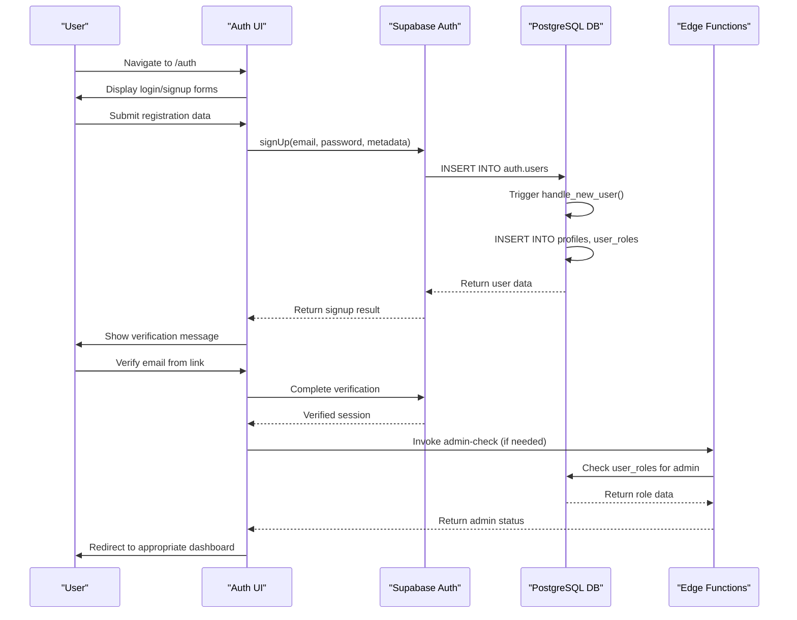
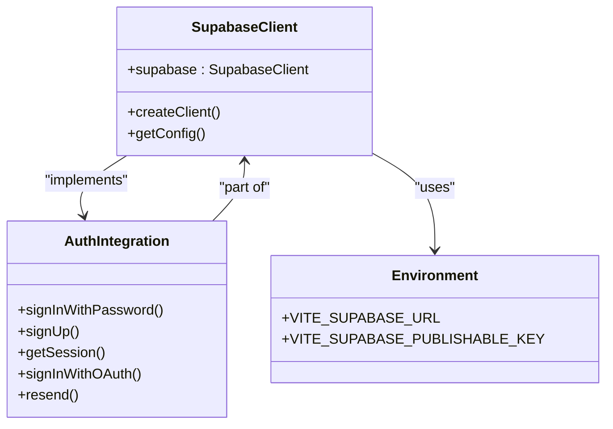
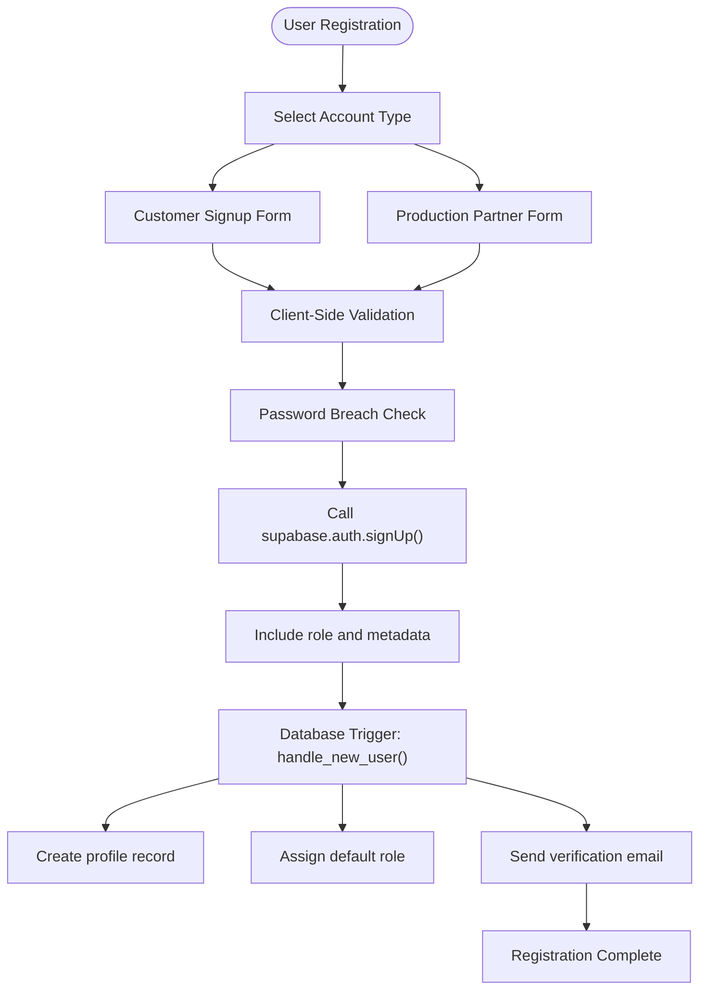
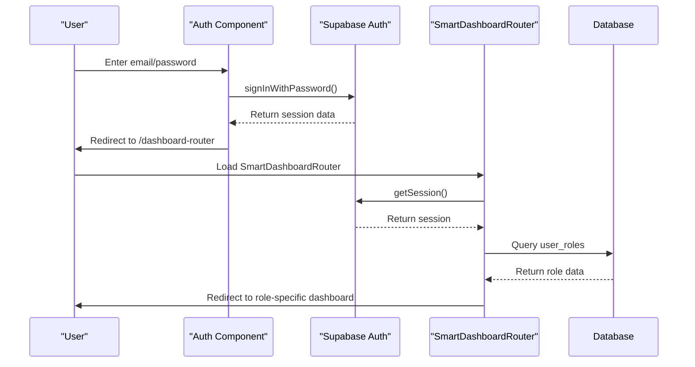
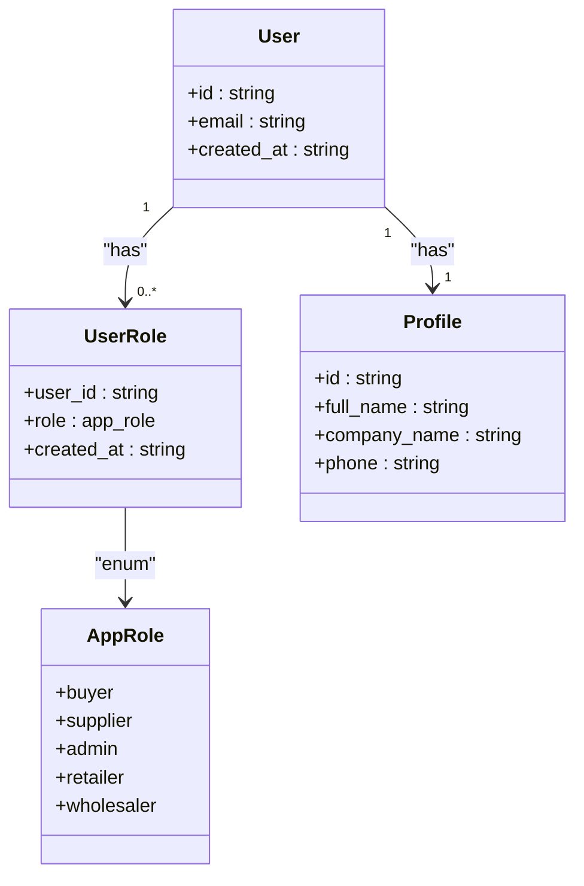
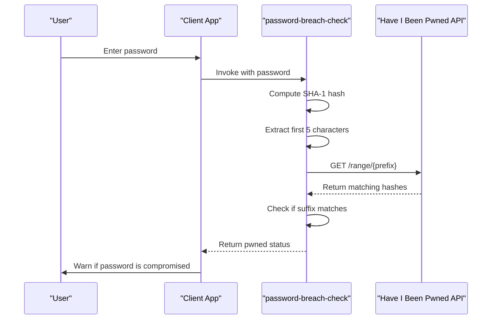

# Authentication Mechanism

<cite>
**Referenced Files in This Document**   
- [Auth.tsx](file://src/pages/Auth.tsx)
- [CustomerSignupForm.tsx](file://src/components/auth/CustomerSignupForm.tsx)
- [ProductionPartnerSignupForm.tsx](file://src/components/auth/ProductionPartnerSignupForm.tsx)
- [client.ts](file://src/integrations/supabase/client.ts)
- [types.ts](file://src/integrations/supabase/types.ts)
- [useAdminAuth.ts](file://src/hooks/useAdminAuth.ts)
- [SmartDashboardRouter.tsx](file://src/components/SmartDashboardRouter.tsx)
- [handle_new_user()](file://supabase/COMPLETE_SETUP.sql#L332-L348)
- [password-breach-check/index.ts](file://supabase/functions/password-breach-check/index.ts)
- [admin-check/index.ts](file://supabase/functions/admin-check/index.ts)
</cite>

## Table of Contents
1. [Introduction](#introduction)
2. [Authentication Overview](#authentication-overview)
3. [Supabase Integration](#supabase-integration)
4. [User Registration Process](#user-registration-process)
5. [Login and Session Management](#login-and-session-management)
6. [Role-Based Access Control](#role-based-access-control)
7. [Security Features](#security-features)
8. [Protected Routes and Redirection](#protected-routes-and-redirection)
9. [Common Authentication Patterns](#common-authentication-patterns)
10. [Troubleshooting Authentication Issues](#troubleshooting-authentication-issues)

## Introduction

The authentication mechanism in sleekapp-v100 is built on Supabase Auth, providing a robust and secure system for user management. This document details the implementation of email/password authentication, role assignment, session handling, and security features that enable seamless user experiences across the platform. The system supports different user types including buyers, suppliers, and administrators, with appropriate access controls and workflows for each role.

The authentication system is designed with security as a priority, incorporating features like password breach checking, email verification, and secure role assignment. It integrates with Supabase's authentication service while extending functionality through custom database triggers and edge functions to meet the specific needs of the apparel manufacturing and sourcing platform.

**Section sources**
- [Auth.tsx](file://src/pages/Auth.tsx#L1-L688)
- [client.ts](file://src/integrations/supabase/client.ts#L1-L20)

## Authentication Overview

The authentication system in sleekapp-v100 follows a comprehensive flow from user registration to session validation and role-based access. The process begins with user registration through email/password authentication, where users provide their information and create secure credentials. During registration, metadata is captured and stored to determine the user's role and preferences within the platform.

Once registered, users must verify their email address before gaining full access to the application. The login process validates user credentials against Supabase Auth and establishes a session that persists across application restarts. Session management is handled automatically by Supabase, with token refresh mechanisms ensuring uninterrupted user experiences.

After successful authentication, the system determines the appropriate dashboard based on the user's role, redirecting them to the buyer, supplier, or admin interface. This role-based routing ensures users immediately access the functionality relevant to their account type.



**Diagram sources **
- [Auth.tsx](file://src/pages/Auth.tsx#L1-L688)
- [handle_new_user()](file://supabase/COMPLETE_SETUP.sql#L332-L348)
- [admin-check/index.ts](file://supabase/functions/admin-check/index.ts#L1-L74)

## Supabase Integration

The application integrates with Supabase Auth through a dedicated client configuration that establishes the connection to the Supabase backend. The integration is implemented in `client.ts`, which exports a configured Supabase client instance that can be imported throughout the application.

The Supabase client is initialized with environment variables for the Supabase URL and publishable key, ensuring secure configuration management. The client is configured with specific authentication settings including localStorage for session persistence, automatic session persistence, and token auto-refresh to maintain active sessions.



**Diagram sources **
- [client.ts](file://src/integrations/supabase/client.ts#L1-L20)
- [types.ts](file://src/integrations/supabase/types.ts#L1-L800)

The integration also includes type definitions in `types.ts` that provide TypeScript support for the database schema, ensuring type safety when interacting with Supabase. This allows for autocompletion and compile-time checking when working with database tables and their relationships.

The Supabase client is used throughout the application via the imported `supabase` instance, eliminating the need to create multiple client instances and ensuring consistent configuration across all components and services that require authentication functionality.

**Section sources**
- [client.ts](file://src/integrations/supabase/client.ts#L1-L20)
- [types.ts](file://src/integrations/supabase/types.ts#L1-L800)

## User Registration Process

The user registration process in sleekapp-v100 supports multiple user types through specialized signup forms that capture relevant information for each role. The system distinguishes between customer (buyer) and production partner (supplier) registration, with each form collecting specific metadata that informs the user's role and capabilities within the platform.

The registration flow begins with client-side validation using Zod schema validation to ensure required fields are properly formatted before submission. The validation checks include email format, password strength requirements (minimum 8 characters with uppercase, lowercase, and number), and required fields like full name.



**Diagram sources **
- [Auth.tsx](file://src/pages/Auth.tsx#L155-L309)
- [CustomerSignupForm.tsx](file://src/components/auth/CustomerSignupForm.tsx#L1-L203)
- [ProductionPartnerSignupForm.tsx](file://src/components/auth/ProductionPartnerSignupForm.tsx#L1-L288)

When a user submits the registration form, the application first performs client-side validation using the defined schema. If validation passes, the system checks the password against known breaches using the `password-breach-check` edge function before proceeding with the Supabase authentication call.

The registration process includes role assignment through metadata passed to Supabase during signup. For customers, the role is set to 'buyer' with additional metadata including customer type, expected volume, and product interest. For production partners, the role is set to 'supplier' with metadata about partner type, location, capacity, certifications, and specialization.

After successful registration, the system automatically creates a profile record and assigns the appropriate role through the `handle_new_user()` database trigger. Users receive a verification email and must click the verification link before they can log in to the application.

**Section sources**
- [Auth.tsx](file://src/pages/Auth.tsx#L155-L309)
- [CustomerSignupForm.tsx](file://src/components/auth/CustomerSignupForm.tsx#L1-L203)
- [ProductionPartnerSignupForm.tsx](file://src/components/auth/ProductionPartnerSignupForm.tsx#L1-L288)

## Login and Session Management

The login process in sleekapp-v100 is implemented through the Auth component, which handles user authentication and session establishment. When a user submits their credentials, the application calls `supabase.auth.signInWithPassword()` with the provided email and password.

The session management system is configured to persist sessions in localStorage and automatically refresh tokens, ensuring users remain authenticated across browser sessions. The Supabase client handles token refresh transparently, minimizing the impact of token expiration on the user experience.

After successful authentication, users are redirected to the SmartDashboardRouter component, which determines the appropriate destination based on the user's role. This component queries the user_roles table to identify whether the user is a buyer, supplier, or admin, and redirects accordingly.



**Diagram sources **
- [Auth.tsx](file://src/pages/Auth.tsx#L403-L459)
- [SmartDashboardRouter.tsx](file://src/components/SmartDashboardRouter.tsx#L1-L138)

The system includes error handling for common login issues such as incorrect credentials, network errors, and unverified email addresses. When a user attempts to log in with an unverified email, the application displays a message instructing them to verify their email and provides a "Resend Email" button to facilitate the verification process.

Session validation occurs on application load and when accessing protected routes. The SmartDashboardRouter component includes retry logic and timeout handling to ensure reliable role determination, with a fallback to the buyer dashboard if role information cannot be retrieved within a reasonable timeframe.

**Section sources**
- [Auth.tsx](file://src/pages/Auth.tsx#L403-L459)
- [SmartDashboardRouter.tsx](file://src/components/SmartDashboardRouter.tsx#L1-L138)

## Role-Based Access Control

The role-based access control system in sleekapp-v100 uses a combination of database storage and server-side validation to ensure secure role assignment and verification. User roles are stored in the user_roles database table, which maintains the relationship between user IDs and their assigned roles.

Role assignment occurs through two mechanisms: automatic assignment via database triggers during user creation, and manual assignment through administrative processes. The `handle_new_user()` trigger automatically assigns a default role based on the metadata provided during signup, while administrators can later modify roles through secure administrative interfaces.



**Diagram sources **
- [handle_new_user()](file://supabase/COMPLETE_SETUP.sql#L332-L348)
- [types.ts](file://src/integrations/supabase/types.ts#L1-L800)

The system includes a dedicated edge function `admin-check` that performs server-side validation of admin status. This function is invoked from the client-side `useAdminAuth` hook, which queries the user_roles table to determine if the current user has admin privileges. This approach ensures that role verification cannot be bypassed by client-side manipulation.

The `useAdminAuth` hook provides a React hook interface for components that need to conditionally render content based on admin status. It handles the asynchronous nature of role checking and provides loading states while the verification is in progress.

Role-based redirection is implemented in the SmartDashboardRouter component, which queries the user_roles table after authentication to determine the appropriate destination. This ensures that users are directed to the dashboard that matches their role and permissions within the system.

**Section sources**
- [useAdminAuth.ts](file://src/hooks/useAdminAuth.ts#L1-L47)
- [SmartDashboardRouter.tsx](file://src/components/SmartDashboardRouter.tsx#L1-L138)
- [handle_new_user()](file://supabase/COMPLETE_SETUP.sql#L332-L348)

## Security Features

The authentication system in sleekapp-v100 incorporates several security features to protect user accounts and prevent common vulnerabilities. The most prominent security feature is the password breach check, which verifies user passwords against known data breaches using the Have I Been Pwned k-anonymity API.

The password breach check is implemented as an edge function `password-breach-check` that runs on the server side. When a user registers or changes their password, the application sends the password to this function, which computes the SHA-1 hash and queries the HIBP API to determine if the password has been compromised in previous data breaches.



**Diagram sources **
- [password-breach-check/index.ts](file://supabase/functions/password-breach-check/index.ts#L1-L141)
- [Auth.tsx](file://src/pages/Auth.tsx#L137-L153)

The system also implements email verification to ensure users control the email address they register with. After registration, users must click a verification link sent to their email before they can log in. The application provides a "Resend Email" option for users who don't receive the initial verification email.

Additional security measures include:
- Client-side validation of password strength requirements
- Secure storage of session data in localStorage with Supabase's encryption
- Server-side role validation to prevent privilege escalation
- CORS protection in edge functions to prevent unauthorized access
- Input validation and error handling to prevent injection attacks

The change password functionality includes re-authentication with the current password before allowing a change, preventing unauthorized password changes if a user's session is compromised.

**Section sources**
- [password-breach-check/index.ts](file://supabase/functions/password-breach-check/index.ts#L1-L141)
- [Auth.tsx](file://src/pages/Auth.tsx#L137-L153)
- [ChangePasswordDialog.tsx](file://src/components/ChangePasswordDialog.tsx#L36-L76)

## Protected Routes and Redirection

The protected routes system in sleekapp-v100 ensures that users can only access content appropriate to their role and authentication status. The primary mechanism for protected routing is the SmartDashboardRouter component, which serves as an intermediary between authentication and the role-specific dashboards.

When an unauthenticated user attempts to access a protected route, they are redirected to the Auth component. After successful authentication, they are sent to the SmartDashboardRouter, which determines their role and redirects them to the appropriate dashboard. This prevents direct access to role-specific routes and ensures proper role-based routing.

```mermaid
flowchart TD
A[/auth] --> |Login| B[/dashboard-router]
B --> C{Check user role}
C --> |buyer| D[/dashboard]
C --> |supplier| E[/supplier-dashboard]
C --> |admin| F[/admin]
G[/any route] --> |Not authenticated| A
H[/admin/*] --> |Not admin| D
```

**Diagram sources **
- [SmartDashboardRouter.tsx](file://src/components/SmartDashboardRouter.tsx#L1-L138)
- [Auth.tsx](file://src/pages/Auth.tsx#L1-L688)

The system includes client-side hooks like `useAdminAuth` that allow components to conditionally render content based on the user's role. These hooks handle the asynchronous nature of role verification and provide loading states while the authentication status is being determined.

For routes that should only be accessible to specific roles, the application uses role checking before rendering the content. If a user attempts to access a route they don't have permission for, they are redirected to the appropriate dashboard for their role.

The redirection system includes timeout handling and retry logic to accommodate potential delays in database operations, ensuring that users are eventually directed to the correct destination even if there are temporary issues with role retrieval.

**Section sources**
- [SmartDashboardRouter.tsx](file://src/components/SmartDashboardRouter.tsx#L1-L138)
- [useAdminAuth.ts](file://src/hooks/useAdminAuth.ts#L1-L47)

## Common Authentication Patterns

The authentication system in sleekapp-v100 implements several common patterns that address typical requirements for web applications. These patterns provide reusable solutions for authentication-related functionality that can be applied across different parts of the application.

### Protected Route Pattern
The protected route pattern is implemented through the SmartDashboardRouter component, which acts as a gatekeeper for role-specific dashboards. This pattern ensures that users cannot directly access protected routes without proper authentication and role verification.

### Role-Based Redirection Pattern
The role-based redirection pattern automatically directs users to the appropriate dashboard based on their role. This eliminates the need for users to manually navigate to their dashboard and ensures they immediately access the functionality relevant to their account type.

### Session Persistence Pattern
The session persistence pattern uses Supabase's built-in session management to maintain user authentication across browser sessions. The configuration in `client.ts` enables localStorage persistence and automatic token refresh, providing a seamless user experience.

### Secure Role Assignment Pattern
The secure role assignment pattern separates role assignment from client-side control by using database triggers and server-side functions. This prevents clients from manipulating their roles and ensures that role changes are properly validated and logged.

### Password Security Pattern
The password security pattern combines client-side validation with server-side breach checking to ensure strong password practices. This multi-layered approach provides immediate feedback to users while also protecting against known compromised passwords.

These patterns work together to create a robust authentication system that balances security, usability, and maintainability.

**Section sources**
- [SmartDashboardRouter.tsx](file://src/components/SmartDashboardRouter.tsx#L1-L138)
- [useAdminAuth.ts](file://src/hooks/useAdminAuth.ts#L1-L47)
- [client.ts](file://src/integrations/supabase/client.ts#L1-L20)
- [password-breach-check/index.ts](file://supabase/functions/password-breach-check/index.ts#L1-L141)

## Troubleshooting Authentication Issues

Common authentication issues in sleekapp-v100 and their solutions include:

### Session Expiration
When sessions expire, users are automatically redirected to the login page. The Supabase client handles token refresh automatically, but if a session has expired completely, users must log in again. The system includes error handling that displays appropriate messages when session-related errors occur.

### Email Verification Issues
Users who don't receive verification emails can use the "Resend Email" feature in the login form. This invokes `supabase.auth.resend()` with the 'signup' type to send a new verification email. Ensure the application's URL is included in the allowed URLs in the Supabase dashboard to prevent email delivery issues.

### Password Breach Warnings
When a user attempts to use a password that appears in data breaches, the system displays a warning message and prevents account creation or password change. Users should be advised to choose a unique, strong password that hasn't been compromised in previous breaches.

### Network Errors
Network errors during authentication are typically caused by CORS issues or connectivity problems. Ensure the application's URL is added to the allowed URLs in the Supabase dashboard, and verify that the environment variables for the Supabase URL and publishable key are correctly configured.

### Role Assignment Delays
In rare cases, there may be a delay between user creation and role assignment due to database trigger processing. The SmartDashboardRouter includes retry logic to handle this scenario, but if issues persist, verify that the `on_auth_user_created` trigger is properly configured in the database.

### Google Sign-In Issues
For Google authentication issues, ensure that Google is enabled as an authentication provider in the Supabase dashboard and that the redirect URLs are properly configured. The application specifies the redirect URL as `${window.location.origin}/dashboard` in the OAuth configuration.

**Section sources**
- [Auth.tsx](file://src/pages/Auth.tsx#L1-L688)
- [SmartDashboardRouter.tsx](file://src/components/SmartDashboardRouter.tsx#L1-L138)
- [useAdminAuth.ts](file://src/hooks/useAdminAuth.ts#L1-L47)