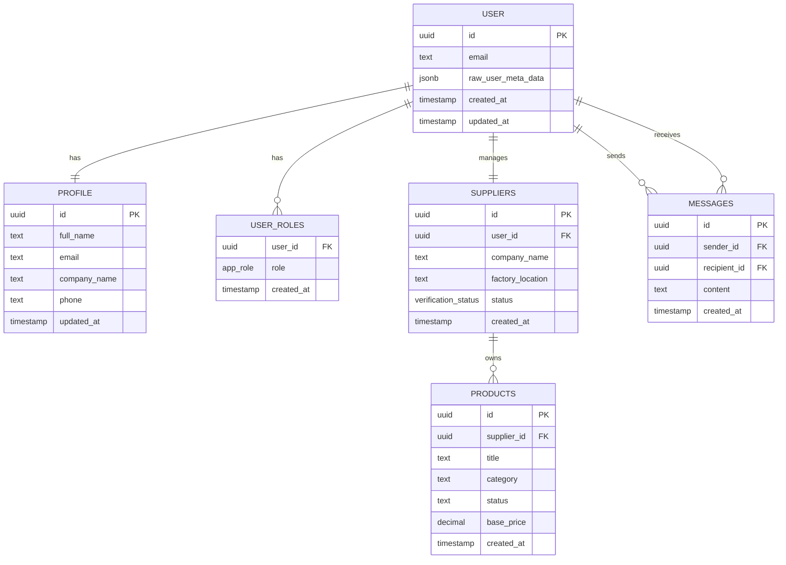

# Authorization Policies

<cite>
**Referenced Files in This Document**
- [20250122000000_create_marketplace_system.sql](file://supabase/migrations/20250122000000_create_marketplace_system.sql)
- [20251120233928_2016afb8-d720-4858-9e12-7fb4ebbd5de0.sql](file://supabase/migrations/20251120233928_2016afb8-d720-4858-9e12-7fb4ebbd5de0.sql)
- [20251121001333_f0e74faa-4a90-4b82-a0ae-86267b97afb3.sql](file://supabase/migrations/20251121001333_f0e74faa-4a90-4b82-a0ae-86267b97afb3.sql)
- [20251120131648_76091c3c-ec15-4a1a-a0bc-3d265c494103.sql](file://supabase/migrations/20251120131648_76091c3c-ec15-4a1a-a0bc-3d265c494103.sql)
- [20251124221407_01714e2f-51ac-4c7b-a04c-180e829dc504.sql](file://supabase/migrations/20251124221407_01714e2f-51ac-4c7b-a04c-180e829dc504.sql)
- [20251115150759_remix_migration_from_pg_dump.sql](file://supabase/migrations/20251115150759_remix_migration_from_pg_dump.sql)
- [TABLES_ONLY.sql](file://supabase/TABLES_ONLY.sql)
- [BASE_MIGRATION_SAFE.sql](file://supabase/BASE_MIGRATION_SAFE.sql)
- [COMPLETE_SETUP.sql](file://supabase/COMPLETE_SETUP.sql)
- [admin-check/index.ts](file://supabase/functions/admin-check/index.ts)
- [bootstrap-admin/index.ts](file://supabase/functions/bootstrap-admin/index.ts)
- [useAdminAuth.ts](file://src/hooks/useAdminAuth.ts)
- [useSuppliers.ts](file://src/hooks/queries/useSuppliers.ts)
- [SupplierVerification.tsx](file://src/pages/admin/SupplierVerification.tsx)
</cite>

## Table of Contents
1. [Introduction](#introduction)
2. [Domain Model Overview](#domain-model-overview)
3. [Row-Level Security Implementation](#row-level-security-implementation)
4. [User Roles and Permissions](#user-roles-and-permissions)
5. [Concrete Policy Examples](#concrete-policy-examples)
6. [Security Functions and Helper Functions](#security-functions-and-helper-functions)
7. [Server-Side Permission Verification](#server-side-permission-verification)
8. [Common Issues and Solutions](#common-issues-and-solutions)
9. [Best Practices](#best-practices)
10. [Troubleshooting Guide](#troubleshooting-guide)

## Introduction

The Sleek Apparels system implements a comprehensive Row-Level Security (RLS) framework built on PostgreSQL and Supabase to enforce fine-grained data access control based on user roles. This authorization system ensures that users can only access data appropriate to their role within the B2B marketplace ecosystem, protecting sensitive information while enabling seamless collaboration between buyers, suppliers, and administrators.

The RLS implementation follows the principle of least privilege, where users receive minimal access rights necessary to perform their job functions. The system supports multiple user types including retailers, suppliers, administrators, and educational institutions, each with distinct access patterns and capabilities.

## Domain Model Overview

The authorization system is built around several core entities that define the access control landscape:



**Diagram sources**
- [TABLES_ONLY.sql](file://supabase/TABLES_ONLY.sql#L15-L24)
- [20250122000000_create_marketplace_system.sql](file://supabase/migrations/20250122000000_create_marketplace_system.sql#L42-L118)

### Core Entity Relationships

The domain model establishes clear relationships between users, their roles, and the resources they can access:

- **User Profiles**: Each authenticated user has a corresponding profile record containing personal and business information
- **User Roles**: The `user_roles` table maps users to their functional roles within the system
- **Supplier Relationships**: Suppliers are linked to users through the `user_id` field, enabling role-based access to supplier-specific data
- **Resource Ownership**: Products, messages, and other resources are owned by suppliers or users, restricting access based on ownership

**Section sources**
- [TABLES_ONLY.sql](file://supabase/TABLES_ONLY.sql#L15-L24)
- [BASE_MIGRATION_SAFE.sql](file://supabase/BASE_MIGRATION_SAFE.sql#L121-L161)

## Row-Level Security Implementation

### Enabling RLS on Tables

The system enables Row-Level Security (RLS) on all sensitive tables to ensure data isolation:

```sql
-- Enable RLS on core tables
ALTER TABLE marketplace_products ENABLE ROW LEVEL SECURITY;
ALTER TABLE product_inquiries ENABLE ROW LEVEL SECURITY;
ALTER TABLE product_wishlist ENABLE ROW LEVEL SECURITY;
ALTER TABLE suppliers ENABLE ROW LEVEL SECURITY;
ALTER TABLE messages ENABLE ROW LEVEL SECURITY;
```

### Policy Categories

The RLS implementation follows a structured approach with four main policy categories:

1. **Public Access Policies**: Allow read-only access to anonymous or authenticated users
2. **Owner-Based Policies**: Restrict access to data owned by the authenticated user
3. **Role-Based Policies**: Grant access based on user roles (admin, supplier, retailer)
4. **Hybrid Policies**: Combine multiple conditions for complex access scenarios

**Section sources**
- [20250122000000_create_marketplace_system.sql](file://supabase/migrations/20250122000000_create_marketplace_system.sql#L250-L256)
- [20251120233928_2016afb8-d720-4858-9e12-7fb4ebbd5de0.sql](file://supabase/migrations/20251120233928_2016afb8-d720-4858-9e12-7fb4ebbd5de0.sql#L156-L189)

## User Roles and Permissions

### App Role Enumeration

The system defines a comprehensive set of user roles through the `app_role` enum:

```sql
CREATE TYPE public.app_role AS ENUM (
    'retailer',      -- Fashion brand owners and buyers
    'wholesaler',    -- Bulk purchasers
    'educational',   -- Educational institutions
    'corporate',     -- Corporate buyers
    'sports_team',   -- Sports team buyers
    'factory',       -- Manufacturing facilities
    'admin',         -- System administrators
    'supplier'       -- Product suppliers
);
```

### Role Assignment Mechanisms

Users receive roles through multiple mechanisms:

1. **Automatic Role Assignment**: New users are automatically assigned the 'retailer' role during account creation
2. **Admin-Driven Assignment**: System administrators can assign roles through dedicated functions
3. **Self-Registration**: Suppliers can register and self-assign the 'supplier' role
4. **Bulk Operations**: Administrative bulk role assignments for organizational management

### Role-Based Access Patterns

Each role follows specific access patterns:

- **Retailers**: Can view marketplace products, create product inquiries, manage wishlists
- **Suppliers**: Can view and manage their own products, respond to inquiries, view assigned orders
- **Administrators**: Full access to all system data with administrative privileges
- **Wholesalers/Educational/Corporate**: Specialized access patterns based on business needs

**Section sources**
- [TABLES_ONLY.sql](file://supabase/TABLES_ONLY.sql#L15-L24)
- [BASE_MIGRATION_SAFE.sql](file://supabase/BASE_MIGRATION_SAFE.sql#L121-L161)

## Concrete Policy Examples

### Admins Can Manage Products Policy

The most powerful policy grants administrators full control over all products:

```sql
CREATE POLICY "Admins can manage all products" ON public.marketplace_products
FOR ALL USING (
    EXISTS (
        SELECT 1 FROM public.user_roles 
        WHERE user_id = auth.uid() AND role = 'admin'
    )
);
```

This policy allows administrators to:
- View all products regardless of status
- Create, update, and delete any product
- Override supplier restrictions
- Perform administrative operations

### Suppliers Can View Their Orders Policy

Supplier-specific policies ensure data isolation:

```sql
CREATE POLICY "Suppliers can view their assigned orders" ON public.supplier_orders
FOR SELECT USING (
    supplier_id IN (
        SELECT id FROM public.suppliers 
        WHERE user_id = auth.uid()
    )
);
```

This policy restricts order visibility to:
- Orders assigned to suppliers who own the supplier profile
- Prevents cross-supplier order access
- Maintains operational security

### Users Can View Their Messages Policy

Personal communication protection:

```sql
CREATE POLICY "Users can view their messages" ON public.messages
FOR SELECT USING (sender_id = auth.uid() OR recipient_id = auth.uid());
```

This policy ensures:
- Users can only see messages they sent or received
- Message content remains private
- Prevents unauthorized message snooping

### Anyone Can View Active CMS Content

Public read access for marketing content:

```sql
CREATE POLICY "Anyone can view active CMS content" ON public.cms_content
FOR SELECT USING (active = true);
```

This policy enables:
- Public website access to published content
- Controlled exposure of marketing materials
- No authentication requirement for public content

**Section sources**
- [20250122000000_create_marketplace_system.sql](file://supabase/migrations/20250122000000_create_marketplace_system.sql#L282-L296)
- [20251120233928_2016afb8-d720-4858-9e12-7fb4ebbd5de0.sql](file://supabase/migrations/20251120233928_2016afb8-d720-4858-9e12-7fb4ebbd5de0.sql#L156-L189)

## Security Functions and Helper Functions

### Role Validation Functions

The system provides robust role validation through SQL functions:

```sql
CREATE FUNCTION public.has_role(_user_id uuid, _role public.app_role) 
RETURNS boolean
LANGUAGE sql STABLE SECURITY DEFINER
AS $$
  SELECT EXISTS (
    SELECT 1 
    FROM public.user_roles
    WHERE user_id = _user_id AND role = _role
  )
$$;
```

### Multi-Role Validation

For complex access scenarios, the system supports multiple role checks:

```sql
CREATE FUNCTION public.has_any_role(_user_id uuid, _roles public.app_role[]) 
RETURNS boolean
LANGUAGE sql STABLE SECURITY DEFINER
AS $$
  SELECT EXISTS (
    SELECT 1 
    FROM public.user_roles
    WHERE user_id = _user_id AND role = ANY(_roles)
  )
$$;
```

### Function Security Patterns

All security-critical functions use the `SECURITY DEFINER` pattern:

```sql
CREATE FUNCTION public.assign_user_role(target_user_id uuid, target_role public.app_role) 
RETURNS void
LANGUAGE plpgsql SECURITY DEFINER
AS $$
BEGIN
  -- Only admins can assign roles
  IF NOT public.has_role(auth.uid(), 'admin') THEN
    RAISE EXCEPTION 'Unauthorized: Only admins can assign roles';
  END IF;
  
  -- Role assignment logic...
END;
$$;
```

This pattern ensures:
- Functions execute with the privileges of the function owner
- Proper authorization checks occur before data access
- Prevents privilege escalation through function misuse

**Section sources**
- [BASE_MIGRATION_SAFE.sql](file://supabase/BASE_MIGRATION_SAFE.sql#L133-L161)
- [BASE_MIGRATION_SAFE.sql](file://supabase/BASE_MIGRATION_SAFE.sql#L352-L378)

## Server-Side Permission Verification

### Edge Function Authentication

The system implements server-side admin verification through edge functions:

```typescript
// admin-check/index.ts - Server-side admin validation
export const checkAdminStatus = async () => {
  try {
    const { data: { session } } = await supabase.auth.getSession();
    
    if (!session?.user) {
      return { isAdmin: false };
    }
    
    // Server-side role verification
    const { data: roles, error } = await supabase
      .from('user_roles')
      .select('role')
      .eq('user_id', user.id)
      .eq('role', 'admin')
      .limit(1);
    
    const isAdmin = Array.isArray(roles) && roles.length > 0;
    return { isAdmin };
  } catch (error) {
    console.error('Admin check failed:', error);
    return { isAdmin: false };
  }
};
```

### Bootstrap Administration

Secure admin role assignment through controlled bootstrap:

```typescript
// bootstrap-admin/index.ts - Secure admin assignment
const assignAdminRole = async (email: string, token: string) => {
  // Verify bootstrap token with constant-time comparison
  let isValidToken = token.length === ADMIN_BOOTSTRAP_TOKEN.length;
  for (let i = 0; i < token.length; i++) {
    isValidToken = isValidToken && (token.charCodeAt(i) === ADMIN_BOOTSTRAP_TOKEN.charCodeAt(i));
  }
  
  if (!isValidToken) {
    throw new Error('Invalid token');
  }
  
  // Check for existing admins
  const { data: existingAdmins } = await supabase
    .from('user_roles')
    .select('id')
    .eq('role', 'admin')
    .limit(1);
    
  if (existingAdmins && existingAdmins.length > 0) {
    throw new Error('Admin already exists');
  }
  
  // Assign admin role securely
  const { error: insertError } = await supabase
    .from('user_roles')
    .insert({ user_id: targetUser.id, role: 'admin' });
};
```

### Frontend Integration

Client-side hooks integrate with server-side verification:

```typescript
// useAdminAuth.ts - Client-side admin detection
export const useAdminAuth = () => {
  const checkAdminStatus = async () => {
    // Server-side admin validation using edge function
    const { data, error } = await supabase.functions.invoke('admin-check', {
      headers: { Authorization: `Bearer ${session.access_token}` },
    });
    
    if (error) {
      console.error('Admin check failed:', error);
      setIsAdmin(false);
    } else {
      setIsAdmin(data?.isAdmin || false);
    }
  };
};
```

**Section sources**
- [admin-check/index.ts](file://supabase/functions/admin-check/index.ts#L14-L74)
- [bootstrap-admin/index.ts](file://supabase/functions/bootstrap-admin/index.ts#L14-L178)
- [useAdminAuth.ts](file://src/hooks/useAdminAuth.ts#L14-L47)

## Common Issues and Solutions

### Issue 1: Bypassing RLS Through Improper Function Security

**Problem**: Functions with incorrect security settings can bypass RLS policies.

**Example of Vulnerable Code**:
```sql
CREATE FUNCTION public.unsafe_function()
RETURNS void
LANGUAGE plpgsql
AS $$
BEGIN
  -- This function bypasses RLS because it lacks SECURITY DEFINER
  UPDATE marketplace_products SET status = 'approved' WHERE id = some_id;
END;
$$;
```

**Solution**: Always use SECURITY DEFINER for functions that modify data:

```sql
CREATE FUNCTION public.safe_function()
RETURNS void
LANGUAGE plpgsql
SECURITY DEFINER
AS $$
BEGIN
  -- This function respects RLS because it runs with function owner privileges
  UPDATE marketplace_products SET status = 'approved' WHERE id = some_id;
END;
$$;
```

### Issue 2: Insufficient Role Checks in Functions

**Problem**: Functions that don't verify user roles before executing sensitive operations.

**Example of Vulnerable Code**:
```sql
CREATE FUNCTION public.update_product_status(product_id uuid, new_status text)
RETURNS void
LANGUAGE plpgsql
SECURITY DEFINER
AS $$
BEGIN
  -- No role check - anyone can update product status
  UPDATE marketplace_products 
  SET status = new_status 
  WHERE id = product_id;
END;
$$;
```

**Solution**: Implement proper role verification:

```sql
CREATE FUNCTION public.update_product_status(product_id uuid, new_status text)
RETURNS void
LANGUAGE plpgsql
SECURITY DEFINER
AS $$
BEGIN
  -- Verify user is admin or supplier of the product
  IF NOT (
    public.has_role(auth.uid(), 'admin') OR
    EXISTS (
      SELECT 1 FROM marketplace_products 
      WHERE id = product_id 
      AND supplier_id IN (
        SELECT id FROM suppliers 
        WHERE user_id = auth.uid()
      )
    )
  ) THEN
    RAISE EXCEPTION 'Unauthorized: Insufficient privileges';
  END IF;
  
  UPDATE marketplace_products 
  SET status = new_status 
  WHERE id = product_id;
END;
$$;
```

### Issue 3: Cross-Supplier Data Access

**Problem**: Users can access supplier data belonging to other suppliers.

**Example of Vulnerable Policy**:
```sql
CREATE POLICY "Suppliers can view orders" ON public.supplier_orders
FOR SELECT USING (true); -- Too permissive!
```

**Solution**: Implement proper ownership checks:

```sql
CREATE POLICY "Suppliers can view their orders" ON public.supplier_orders
FOR SELECT USING (
  supplier_id IN (
    SELECT id FROM public.suppliers 
    WHERE user_id = auth.uid()
  )
);
```

### Issue 4: Message Spoofing

**Problem**: Users can send messages pretending to be others.

**Example of Vulnerable Policy**:
```sql
CREATE POLICY "Users can send messages" ON public.messages
FOR INSERT WITH CHECK (true); -- No sender verification
```

**Solution**: Implement sender verification:

```sql
CREATE POLICY "Users can send messages" ON public.messages
FOR INSERT WITH CHECK (sender_id = auth.uid());
```

### Issue 5: Storage Bucket Misconfiguration

**Problem**: Storage buckets allow unauthorized file access.

**Example of Vulnerable Policy**:
```sql
CREATE POLICY "Users can upload files" ON storage.objects
FOR INSERT TO authenticated
WITH CHECK (bucket_id = 'message-attachments'); -- Missing ownership check
```

**Solution**: Implement proper ownership verification:

```sql
CREATE POLICY "Users can upload their own attachments"
ON storage.objects FOR INSERT
TO authenticated
WITH CHECK (
  bucket_id = 'message-attachments' AND
  auth.uid()::text = (storage.foldername(name))[1]
);
```

**Section sources**
- [20251121001333_f0e74faa-4a90-4b82-a0ae-86267b97afb3.sql](file://supabase/migrations/20251121001333_f0e74faa-4a90-4b82-a0ae-86267b97afb3.sql#L1-L15)
- [20251120131648_76091c3c-ec15-4a1a-a0bc-3d265c494103.sql](file://supabase/migrations/20251120131648_76091c3c-ec15-4a1a-a0bc-3d265c494103.sql#L1-L31)
- [20251124221407_01714e2f-51ac-4c7b-a04c-180e829dc504.sql](file://supabase/migrations/20251124221407_01714e2f-51ac-4c7b-a04c-180e829dc504.sql#L1-L21)

## Best Practices

### 1. Principle of Least Privilege

Always grant users the minimum permissions necessary for their role:

```sql
-- Good: Specific role-based access
CREATE POLICY "Suppliers can view their products" ON marketplace_products
FOR SELECT USING (
  supplier_id IN (
    SELECT id FROM suppliers 
    WHERE user_id = auth.uid()
  )
);

-- Bad: Overly permissive access
CREATE POLICY "Anyone can view products" ON marketplace_products
FOR SELECT USING (true);
```

### 2. Use SECURITY DEFINER Consistently

All functions that modify data should use SECURITY DEFINER:

```sql
CREATE FUNCTION public.secure_operation()
RETURNS void
LANGUAGE plpgsql
SECURITY DEFINER
AS $$
BEGIN
  -- Function logic with proper authorization
  PERFORM public.verify_user_permissions();
  -- Safe data modification
END;
$$;
```

### 3. Implement Multi-Factor Authorization

Combine multiple authorization checks for sensitive operations:

```sql
CREATE FUNCTION public.admin_operation()
RETURNS void
LANGUAGE plpgsql
SECURITY DEFINER
AS $$
BEGIN
  -- Verify admin role AND additional business logic
  IF NOT (public.has_role(auth.uid(), 'admin') AND 
          public.check_business_rules()) THEN
    RAISE EXCEPTION 'Unauthorized operation';
  END IF;
  
  -- Proceed with operation
END;
$$;
```

### 4. Regular Policy Audits

Implement regular security audits of RLS policies:

```sql
-- Audit script to check for overly permissive policies
SELECT 
  schemaname, tablename, polname, 
  permissive, roles, cmd, qual
FROM pg_policy
WHERE qual LIKE '%true%' OR qual IS NULL;
```

### 5. Monitor and Log Access

Implement comprehensive logging for authorization events:

```sql
CREATE FUNCTION public.log_authorization_event(action text, resource text)
RETURNS void
LANGUAGE plpgsql
SECURITY DEFINER
AS $$
BEGIN
  INSERT INTO authorization_logs (
    user_id, action, resource, timestamp, ip_address
  ) VALUES (
    auth.uid(), action, resource, now(), 
    inet_client_addr()
  );
END;
$$;
```

## Troubleshooting Guide

### Problem: Users Cannot Access Expected Data

**Symptoms**: Users receive "permission denied" errors despite having appropriate roles.

**Diagnosis Steps**:
1. Verify RLS is enabled on the table:
```sql
SELECT relrowsecurity FROM pg_class WHERE relname = 'table_name';
```

2. Check existing policies:
```sql
SELECT * FROM pg_policies WHERE tablename = 'table_name';
```

3. Verify user role assignment:
```sql
SELECT * FROM user_roles WHERE user_id = auth.uid();
```

**Solutions**:
- Enable RLS if disabled: `ALTER TABLE table_name ENABLE ROW LEVEL SECURITY;`
- Review and adjust policies to match intended access patterns
- Verify user role assignments are correct

### Problem: Functions Not Respecting RLS

**Symptoms**: Functions bypass RLS policies and can access restricted data.

**Diagnosis**:
- Check function security setting: `SELECT prosrc FROM pg_proc WHERE proname = 'function_name';`
- Look for `SECURITY DEFINER` in the function definition

**Solutions**:
- Add `SECURITY DEFINER` to function definition
- Implement explicit authorization checks within functions
- Use `SET search_path` to control function execution context

### Problem: Storage Bucket Access Issues

**Symptoms**: Users cannot upload or access files in storage buckets.

**Diagnosis**:
- Check bucket policies: `SELECT * FROM storage.buckets;`
- Verify object policies: `SELECT * FROM storage.policies;`

**Solutions**:
- Implement proper ownership-based policies for storage objects
- Use `auth.uid()` in policy conditions
- Ensure bucket names and paths are correctly referenced

### Problem: Edge Function Authentication Failures

**Symptoms**: Server-side admin checks consistently return false positives.

**Diagnosis**:
- Verify function invocation headers include valid JWT tokens
- Check function permissions and service role assignments
- Review function logs for error messages

**Solutions**:
- Ensure proper JWT token forwarding in function calls
- Verify service role has necessary database permissions
- Implement proper error handling and logging in edge functions

**Section sources**
- [admin-check/index.ts](file://supabase/functions/admin-check/index.ts#L14-L74)
- [bootstrap-admin/index.ts](file://supabase/functions/bootstrap-admin/index.ts#L14-L178)