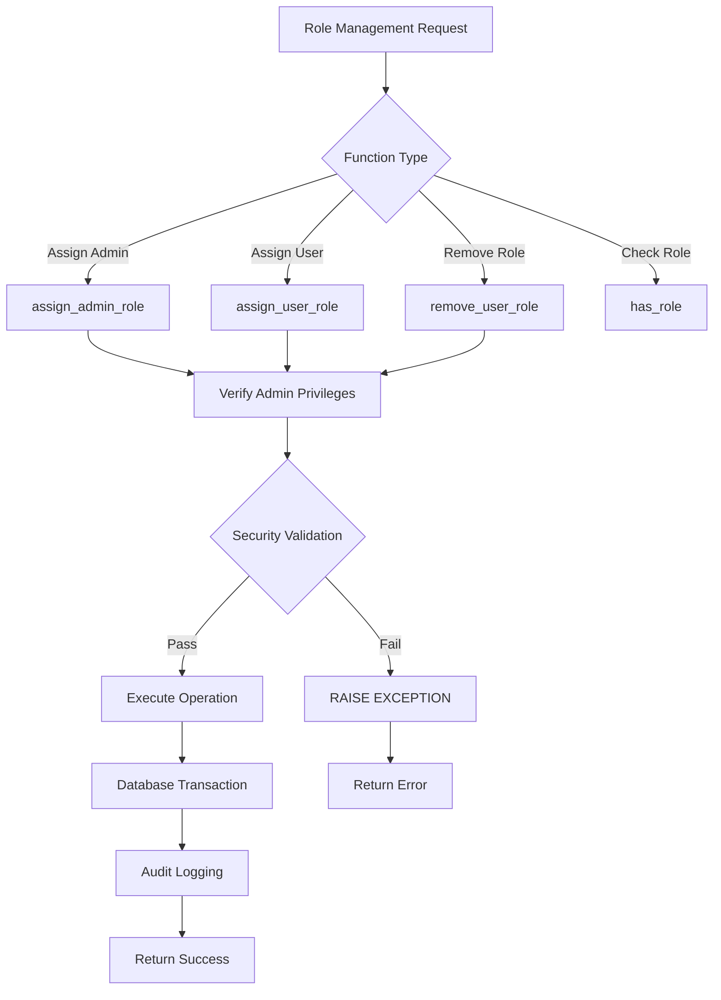
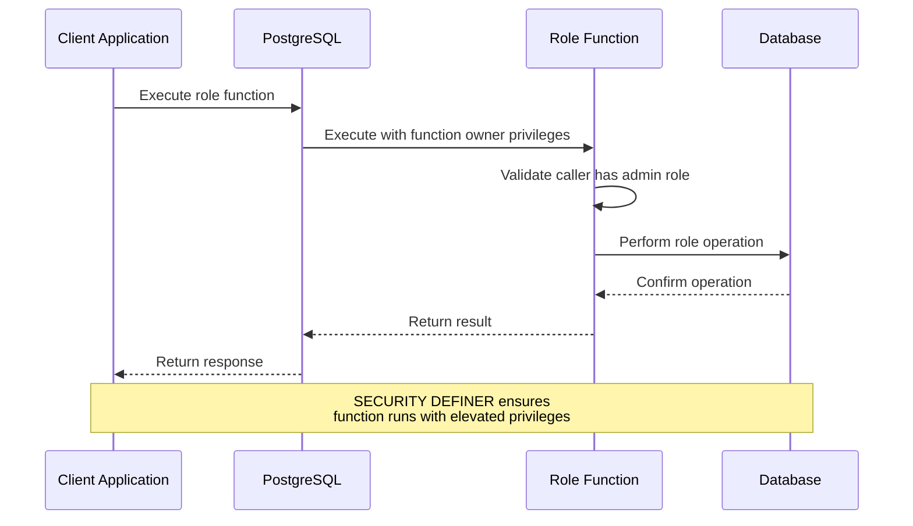

# Role Management Functions

<cite>
**Referenced Files in This Document**
- [20251115150759_remix_migration_from_pg_dump.sql](file://supabase/migrations/20251115150759_remix_migration_from_pg_dump.sql)
- [BASE_MIGRATION_SAFE.sql](file://supabase/BASE_MIGRATION_SAFE.sql)
- [bootstrap-admin/index.ts](file://supabase/functions/bootstrap-admin/index.ts)
- [useAdminAuth.ts](file://src/hooks/useAdminAuth.ts)
- [supabaseHelpers.ts](file://src/lib/supabaseHelpers.ts)
- [AdminAnalytics.tsx](file://src/pages/AdminAnalytics.tsx)
- [Auth.tsx](file://src/pages/Auth.tsx)
- [SmartDashboardRouter.tsx](file://src/components/SmartDashboardRouter.tsx)
</cite>

## Table of Contents
1. [Introduction](#introduction)
2. [Domain Model](#domain-model)
3. [Core Functions Overview](#core-functions-overview)
4. [Security Architecture](#security-architecture)
5. [Function Implementation Details](#function-implementation-details)
6. [Database Schema](#database-schema)
7. [Frontend Integration](#frontend-integration)
8. [Race Condition Prevention](#race-condition-prevention)
9. [Common Issues and Solutions](#common-issues-and-solutions)
10. [Best Practices](#best-practices)

## Introduction

The SleekApp role management system provides a comprehensive PostgreSQL-based solution for managing user permissions and administrative privileges. Built with security-first principles, the system enforces strict access controls through PostgreSQL functions with `SECURITY DEFINER` privileges, preventing unauthorized role modifications and ensuring data integrity.

The role management system consists of four primary functions: `assign_admin_role()`, `assign_user_role()`, `remove_user_role()`, and `has_role()`. These functions work together to create a robust permission framework that prevents privilege escalation and maintains audit trails for all role modifications.

## Domain Model

The role management system operates on a simple yet powerful domain model centered around user roles and permissions:

```mermaid
erDiagram
USER {
uuid id PK
string email UK
timestamp created_at
timestamp updated_at
}
USER_ROLES {
uuid user_id FK
app_role role
timestamp created_at
PRIMARY KEY (user_id, role)
}
APP_ROLE {
enum role_type
"retailer"
"wholesaler"
"educational"
"corporate"
"sports_team"
"factory"
"admin"
"supplier"
}
ADMIN_AUDIT_LOGS {
uuid id PK
uuid admin_id FK
string action
string resource_type
uuid resource_id
jsonb details
timestamp created_at
}
USER ||--o{ USER_ROLES : has
APP_ROLE ||--o{ USER_ROLES : defines
USER ||--o{ ADMIN_AUDIT_LOGS : performs
```

**Diagram sources**
- [20251115150759_remix_migration_from_pg_dump.sql](file://supabase/migrations/20251115150759_remix_migration_from_pg_dump.sql#L28-L40)

### Core Entities

| Entity | Purpose | Key Constraints |
|--------|---------|-----------------|
| `USER` | Authentication and identity management | UUID primary key, unique email |
| `USER_ROLES` | Role assignments and permissions | Composite primary key (user_id, role) |
| `APP_ROLE` | Available role types enumeration | Predefined role categories |
| `ADMIN_AUDIT_LOGS` | Administrative action tracking | Foreign key to admin users |

**Section sources**
- [20251115150759_remix_migration_from_pg_dump.sql](file://supabase/migrations/20251115150759_remix_migration_from_pg_dump.sql#L28-L40)

## Core Functions Overview

The role management system provides four essential functions that handle different aspects of role administration:



**Diagram sources**
- [20251115150759_remix_migration_from_pg_dump.sql](file://supabase/migrations/20251115150759_remix_migration_from_pg_dump.sql#L107-L161)
- [20251115150759_remix_migration_from_pg_dump.sql](file://supabase/migrations/20251115150759_remix_migration_from_pg_dump.sql#L499-L515)

### Function Categories

| Function Category | Purpose | Security Level |
|-------------------|---------|----------------|
| **Administrative Assignment** | `assign_admin_role()` | Highest - Admin-only |
| **Standard Assignment** | `assign_user_role()` | High - Admin-only |
| **Removal Operations** | `remove_user_role()` | High - Admin-only |
| **Validation Checks** | `has_role()`, `has_any_role()` | Medium - Public access |

## Security Architecture

The role management system employs multiple layers of security to prevent unauthorized access and privilege escalation:

### SECURITY DEFINER Pattern

All role management functions use the `SECURITY DEFINER` attribute, which executes the function with the privileges of the function owner rather than the caller. This ensures that only authorized database users can perform role modifications.



**Diagram sources**
- [20251115150759_remix_migration_from_pg_dump.sql](file://supabase/migrations/20251115150759_remix_migration_from_pg_dump.sql#L110-L130)

### Multi-Factor Authentication

The system implements multiple authentication layers:

1. **Database-Level**: `SECURITY DEFINER` functions
2. **Application-Level**: Supabase authentication tokens
3. **Function-Level**: Role validation within each function
4. **Edge Function**: Server-side admin validation

**Section sources**
- [20251115150759_remix_migration_from_pg_dump.sql](file://supabase/migrations/20251115150759_remix_migration_from_pg_dump.sql#L110-L130)
- [useAdminAuth.ts](file://src/hooks/useAdminAuth.ts#L24-L46)

## Function Implementation Details

### assign_admin_role()

The `assign_admin_role()` function provides the highest level of administrative privilege assignment, specifically designed for creating initial administrators.

#### Input Parameters
- `target_user_id uuid`: The UUID of the user receiving admin privileges

#### Security Checks
1. **Caller Validation**: Uses `public.has_role(auth.uid(), 'admin')` to verify current user has admin privileges
2. **User Existence**: Confirms the target user exists in the `auth.users` table
3. **Role Assignment**: Inserts the 'admin' role into the `user_roles` table

#### Implementation Details
```sql
CREATE FUNCTION public.assign_admin_role(target_user_id uuid) RETURNS void
LANGUAGE plpgsql SECURITY DEFINER
SET search_path TO 'public'
AS $$
BEGIN
  -- Only existing admins can assign admin role
  IF NOT public.has_role(auth.uid(), 'admin') THEN
    RAISE EXCEPTION 'Unauthorized: Only admins can assign admin role';
  END IF;
  
  -- Verify target user exists
  IF NOT EXISTS (SELECT 1 FROM auth.users WHERE id = target_user_id) THEN
    RAISE EXCEPTION 'User not found';
  END IF;
  
  -- Insert admin role
  INSERT INTO public.user_roles (user_id, role)
  VALUES (target_user_id, 'admin'::public.app_role)
  ON CONFLICT (user_id, role) DO NOTHING;
END;
$$;
```

**Section sources**
- [20251115150759_remix_migration_from_pg_dump.sql](file://supabase/migrations/20251115150759_remix_migration_from_pg_dump.sql#L107-L130)

### assign_user_role()

The `assign_user_role()` function handles standard role assignments for non-admin roles, providing granular permission control.

#### Input Parameters
- `target_user_id uuid`: The UUID of the user receiving the role
- `target_role public.app_role`: The role to assign (cannot be 'admin')

#### Security Checks
1. **Admin Authorization**: Verifies caller has admin privileges
2. **Role Validation**: Prevents assignment of 'admin' role through this function
3. **User Verification**: Confirms target user exists
4. **Duplicate Prevention**: Uses `ON CONFLICT DO NOTHING` to prevent duplicate entries

#### Implementation Details
```sql
CREATE FUNCTION public.assign_user_role(target_user_id uuid, target_role public.app_role) RETURNS void
LANGUAGE plpgsql SECURITY DEFINER
SET search_path TO 'public'
AS $$
BEGIN
  -- Only admins can assign roles
  IF NOT public.has_role(auth.uid(), 'admin') THEN
    RAISE EXCEPTION 'Unauthorized: Only admins can assign roles';
  END IF;
  
  -- Prevent assigning admin role through this function
  IF target_role = 'admin' THEN
    RAISE EXCEPTION 'Use assign_admin_role() function to assign admin role';
  END IF;
  
  -- Verify target user exists
  IF NOT EXISTS (SELECT 1 FROM auth.users WHERE id = target_user_id) THEN
    RAISE EXCEPTION 'User not found';
  END IF;
  
  -- Insert role
  INSERT INTO public.user_roles (user_id, role)
  VALUES (target_user_id, target_role)
  ON CONFLICT (user_id, role) DO NOTHING;
END;
$$;
```

**Section sources**
- [20251115150759_remix_migration_from_pg_dump.sql](file://supabase/migrations/20251115150759_remix_migration_from_pg_dump.sql#L137-L161)

### remove_user_role()

The `remove_user_role()` function provides controlled role removal capabilities with comprehensive security validation.

#### Input Parameters
- `target_user_id uuid`: The UUID of the user losing the role
- `target_role public.app_role`: The role to remove

#### Security Checks
1. **Admin Authorization**: Ensures only admins can remove roles
2. **Role Removal**: Deletes the specific role assignment from the database

#### Implementation Details
```sql
CREATE FUNCTION public.remove_user_role(target_user_id uuid, target_role public.app_role) RETURNS void
LANGUAGE plpgsql SECURITY DEFINER
SET search_path TO 'public'
AS $$
BEGIN
  -- Only admins can remove roles
  IF NOT public.has_role(auth.uid(), 'admin') THEN
    RAISE EXCEPTION 'Unauthorized: Only admins can remove roles';
  END IF;
  
  -- Delete the role
  DELETE FROM public.user_roles
  WHERE user_id = target_user_id AND role = target_role;
END;
$$;
```

**Section sources**
- [20251115150759_remix_migration_from_pg_dump.sql](file://supabase/migrations/20251115150759_remix_migration_from_pg_dump.sql#L499-L515)

### has_role() and has_any_role()

These validation functions provide efficient role checking capabilities for both individual and multiple role validation scenarios.

#### has_role() Function
- **Purpose**: Checks if a user has a specific role
- **Input**: `_user_id uuid`, `_role public.app_role`
- **Output**: `boolean` indicating role existence
- **Implementation**: Uses `EXISTS` query for optimal performance

#### has_any_role() Function
- **Purpose**: Checks if a user has any role from a provided array
- **Input**: `_user_id uuid`, `_roles public.app_role[]`
- **Output**: `boolean` indicating any role match
- **Implementation**: Uses `ANY()` operator for array membership testing

**Section sources**
- [20251115150759_remix_migration_from_pg_dump.sql](file://supabase/migrations/20251115150759_remix_migration_from_pg_dump.sql#L371-L381)
- [20251115150759_remix_migration_from_pg_dump.sql](file://supabase/migrations/20251115150759_remix_migration_from_pg_dump.sql#L351-L366)

## Database Schema

The role management system relies on several key database components that work together to provide comprehensive role management capabilities.

### Table Structure

| Table | Purpose | Key Columns |
|-------|---------|-------------|
| `user_roles` | Role assignments | `user_id`, `role`, `created_at` |
| `app_role` | Role type enumeration | Predefined role values |
| `admin_audit_logs` | Administrative actions | `admin_id`, `action`, `details` |

### Constraints and Indexes

```mermaid
erDiagram
USER_ROLES {
uuid user_id PK,FK
app_role role PK
timestamp created_at
PRIMARY KEY (user_id, role)
FOREIGN KEY (user_id) REFERENCES auth.users(id)
}
ADMIN_AUDIT_LOGS {
uuid id PK
uuid admin_id FK
string action
string resource_type
uuid resource_id
jsonb details
timestamp created_at
FOREIGN KEY (admin_id) REFERENCES user_roles(user_id)
}
USER_ROLES ||--o{ ADMIN_AUDIT_LOGS : logs
```

**Diagram sources**
- [20251115150759_remix_migration_from_pg_dump.sql](file://supabase/migrations/20251115150759_remix_migration_from_pg_dump.sql#L28-L40)

**Section sources**
- [20251115150759_remix_migration_from_pg_dump.sql](file://supabase/migrations/20251115150759_remix_migration_from_pg_dump.sql#L28-L40)

## Frontend Integration

The role management system integrates seamlessly with the React frontend through multiple layers of abstraction and security enforcement.

### Authentication Hooks

The `useAdminAuth` hook provides server-side validation of administrative privileges:

```typescript
export const useAdminAuth = () => {
  const [isAdmin, setIsAdmin] = useState(false);
  const [loading, setLoading] = useState(true);
  
  const checkAdminStatus = async () => {
    try {
      const { data: { session } } = await supabase.auth.getSession();
      
      if (!session?.user) {
        setIsAdmin(false);
        return;
      }
      
      // Server-side admin validation using edge function
      const { data, error } = await supabase.functions.invoke('admin-check', {
        headers: { Authorization: `Bearer ${session.access_token}` },
      });
      
      setIsAdmin(data?.isAdmin || false);
    } catch (error) {
      console.error('Error checking admin status:', error);
      setIsAdmin(false);
    }
  };
};
```

**Section sources**
- [useAdminAuth.ts](file://src/hooks/useAdminAuth.ts#L15-L46)

### Role Helper Functions

The `roleHelpers` module provides type-safe access to role management functionality:

```typescript
export const roleHelpers = {
  async getUserRole(userId: string) {
    const { data, error } = await supabase
      .from('user_roles')
      .select('*')
      .eq('user_id', userId)
      .maybeSingle();
    return { data: data as UserRole | null, error };
  },
  
  async hasRole(userId: string, role: string) {
    const { data, error } = await supabase
      .from('user_roles')
      .select('role')
      .eq('user_id', userId)
      .eq('role', role as any)
      .maybeSingle();
    return { hasRole: !!data, error };
  },
  
  async assignRole(userId: string, role: string) {
    const { data, error } = await supabase
      .from('user_roles')
      .insert({ user_id: userId, role: role as any } as any)
      .select()
      .single();
    return { data: data as UserRole | null, error };
  },
};
```

**Section sources**
- [supabaseHelpers.ts](file://src/lib/supabaseHelpers.ts#L228-L255)

### Router Protection

The `SmartDashboardRouter` implements client-side protection with retry logic to handle race conditions:

```typescript
// Small delay to ensure database trigger has created role
await new Promise(resolve => setTimeout(resolve, 1000));

// Get user role with retry logic
let roleData = null;
let attempts = 0;
const maxAttempts = 3;

while (attempts < maxAttempts && !roleData) {
  const { data, error: roleError } = await supabase
    .from('user_roles')
    .select('role')
    .eq('user_id', user.id)
    .maybeSingle();
  
  if (roleError) {
    console.error('Role fetch error:', roleError);
  } else {
    roleData = data;
  }
  
  if (!roleData && attempts < maxAttempts - 1) {
    await new Promise(resolve => setTimeout(resolve, 500));
  }
}
```

**Section sources**
- [SmartDashboardRouter.tsx](file://src/components/SmartDashboardRouter.tsx#L56-L73)

## Race Condition Prevention

The role management system implements multiple strategies to prevent race conditions during concurrent role operations.

### Transaction Isolation

PostgreSQL's `ON CONFLICT DO NOTHING` clause prevents duplicate role assignments during concurrent operations:

```sql
-- Prevents race conditions during role assignment
INSERT INTO public.user_roles (user_id, role)
VALUES (target_user_id, target_role)
ON CONFLICT (user_id, role) DO NOTHING;
```

### Client-Side Retry Logic

The frontend implements exponential backoff retry logic to handle temporary inconsistencies:

```typescript
// Exponential backoff retry mechanism
let attempts = 0;
const maxAttempts = 3;

while (attempts < maxAttempts && !roleData) {
  const { data, error: roleError } = await supabase
    .from('user_roles')
    .select('role')
    .eq('user_id', userId)
    .maybeSingle();
  
  if (!roleData && attempts < maxAttempts - 1) {
    await new Promise(resolve => setTimeout(resolve, 500 * Math.pow(2, attempts)));
  }
  
  attempts++;
}
```

### Database Triggers

The system uses database triggers to automatically assign roles during user registration:

```sql
CREATE FUNCTION public.handle_new_user() RETURNS trigger
LANGUAGE plpgsql SECURITY DEFINER
SET search_path TO 'public'
AS $$
BEGIN
  -- SECURITY FIX: Always default to 'retailer', ignore client-supplied role
  INSERT INTO public.user_roles (user_id, role)
  VALUES (new.id, 'retailer'::public.app_role);
  
  RETURN new;
END;
$$;
```

**Section sources**
- [20251115150759_remix_migration_from_pg_dump.sql](file://supabase/migrations/20251115150759_remix_migration_from_pg_dump.sql#L306-L328)

## Common Issues and Solutions

### Issue 1: Role Assignment Failures

**Problem**: Role assignments fail due to missing admin privileges or invalid user IDs.

**Solution**: Comprehensive error handling with specific exception messages:

```sql
-- Clear error messages for different failure scenarios
IF NOT public.has_role(auth.uid(), 'admin') THEN
  RAISE EXCEPTION 'Unauthorized: Only admins can assign roles';
END IF;

IF NOT EXISTS (SELECT 1 FROM auth.users WHERE id = target_user_id) THEN
  RAISE EXCEPTION 'User not found';
END IF;
```

### Issue 2: Race Conditions During Role Changes

**Problem**: Concurrent role assignments cause conflicts or inconsistent states.

**Solution**: Multi-layered prevention approach:

1. **Database Constraints**: Unique composite keys prevent duplicates
2. **Transaction Isolation**: `ON CONFLICT DO NOTHING` handles concurrent inserts
3. **Client-Side Retries**: Exponential backoff for eventual consistency
4. **Audit Logging**: Tracks all role changes for troubleshooting

### Issue 3: Frontend Role Validation Delays

**Problem**: Immediate role checks return incorrect results due to database trigger delays.

**Solution**: Implemented client-side delays and retry mechanisms:

```typescript
// Wait for database trigger to complete
await new Promise(resolve => setTimeout(resolve, 1000));

// Retry with exponential backoff
let roleData = null;
for (let attempt = 0; attempt < 3 && !roleData; attempt++) {
  const { data } = await supabase.from('user_roles').select('role')
    .eq('user_id', userId).maybeSingle();
  if (data) roleData = data;
  if (!roleData && attempt < 2) {
    await new Promise(resolve => setTimeout(resolve, 500 * Math.pow(2, attempt)));
  }
}
```

### Issue 4: Bootstrap Admin Token Security

**Problem**: Secure bootstrap token exposure in logs or network traffic.

**Solution**: Constant-time comparison and rate limiting:

```typescript
// Constant-time token comparison to prevent timing attacks
let isValidToken = token.length === ADMIN_BOOTSTRAP_TOKEN.length;
for (let i = 0; i < token.length; i++) {
  isValidToken = isValidToken && (token.charCodeAt(i) === ADMIN_BOOTSTRAP_TOKEN.charCodeAt(i));
}

// Rate limiting prevents brute force attacks
const recentAttempts = await supabase
  .from('bootstrap_attempts')
  .select('*')
  .eq('ip_address', clientIP)
  .gte('created_at', oneHourAgo);

if (recentAttempts && recentAttempts.length >= 3) {
  // Block further attempts
}
```

**Section sources**
- [bootstrap-admin/index.ts](file://supabase/functions/bootstrap-admin/index.ts#L70-L85)
- [bootstrap-admin/index.ts](file://supabase/functions/bootstrap-admin/index.ts#L33-L57)

## Best Practices

### Security Best Practices

1. **Principle of Least Privilege**: Only grant minimal necessary permissions
2. **Multi-Factor Authentication**: Combine database, application, and edge function validation
3. **Constant-Time Comparisons**: Use secure token validation to prevent timing attacks
4. **Audit Logging**: Maintain comprehensive logs of all administrative actions
5. **Rate Limiting**: Implement IP-based rate limiting for sensitive operations

### Performance Best Practices

1. **Index Optimization**: Ensure proper indexing on `user_id` and `role` columns
2. **Query Efficiency**: Use `EXISTS` for role validation to minimize data transfer
3. **Connection Pooling**: Optimize database connection management
4. **Caching Strategies**: Implement appropriate caching for frequently accessed role data

### Development Best Practices

1. **Type Safety**: Use TypeScript for database operation type safety
2. **Error Handling**: Implement comprehensive error handling with meaningful messages
3. **Testing**: Create unit tests for all role management functions
4. **Documentation**: Maintain up-to-date documentation for all functions
5. **Monitoring**: Implement monitoring for role management operations

### Operational Best Practices

1. **Backup Strategies**: Regular backups of role assignment data
2. **Disaster Recovery**: Procedures for role data restoration
3. **Change Management**: Controlled deployment processes for role management changes
4. **Security Audits**: Regular security reviews of role management systems
5. **User Training**: Educate administrators on proper role management procedures

The role management system demonstrates enterprise-grade security and reliability through its multi-layered approach to privilege management, comprehensive audit capabilities, and robust protection against common security vulnerabilities.