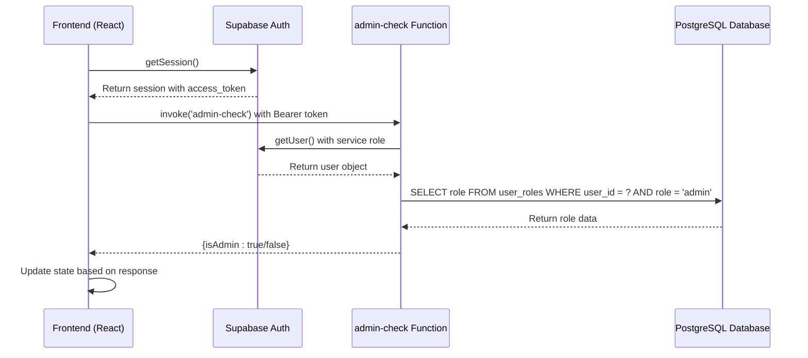
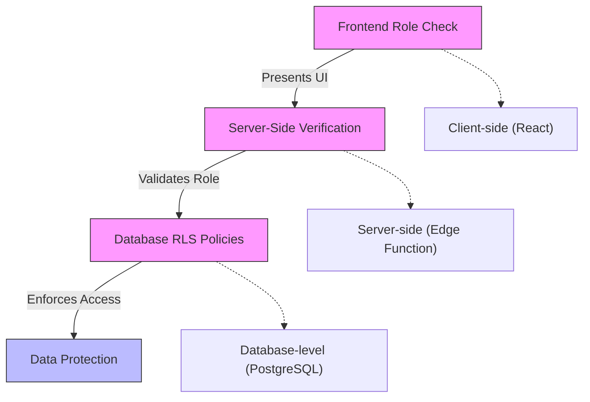
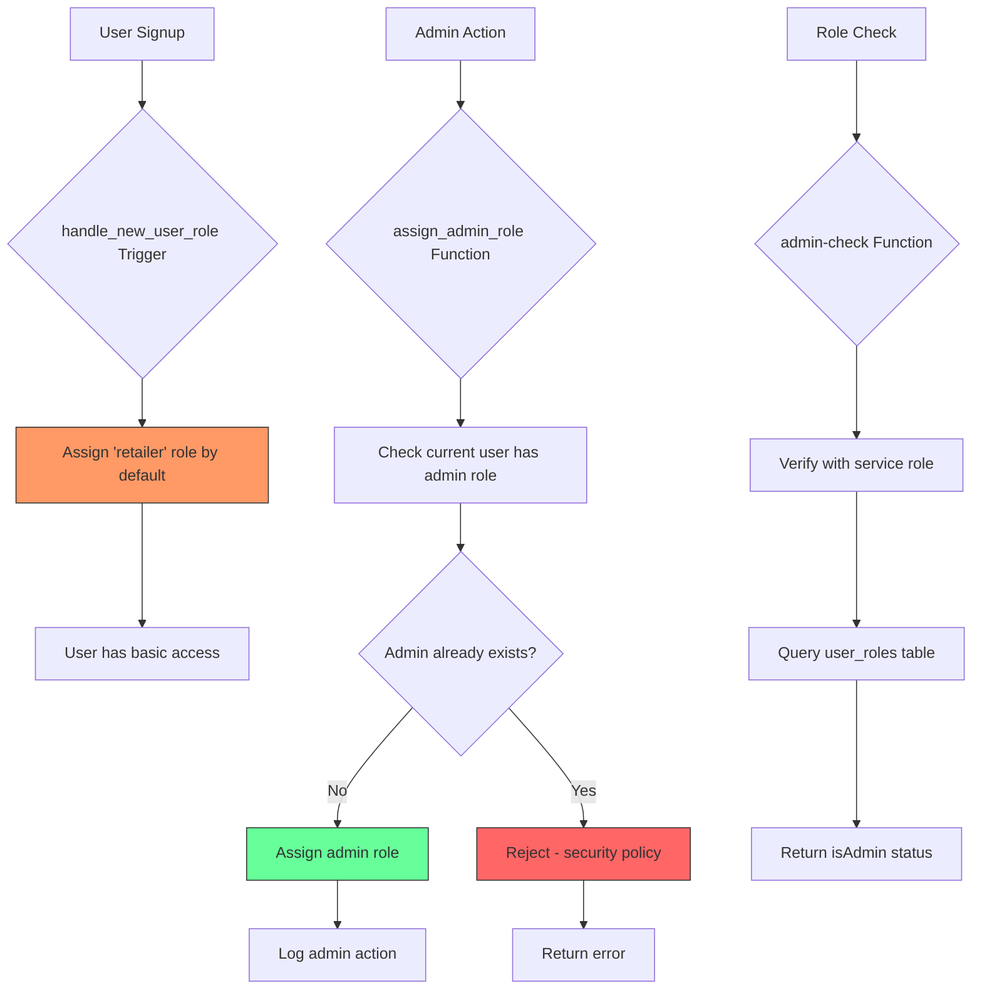

# Access Validation

<cite>
**Referenced Files in This Document**   
- [useAdminAuth.ts](file://src/hooks/useAdminAuth.ts)
- [admin-check/index.ts](file://supabase/functions/admin-check/index.ts)
- [AdminSidebar.tsx](file://src/components/AdminSidebar.tsx)
- [AdminLayout.tsx](file://src/pages/admin/AdminLayout.tsx)
- [COMPLETE_SETUP.sql](file://supabase/COMPLETE_SETUP.sql)
- [bootstrap-admin/index.ts](file://supabase/functions/bootstrap-admin/index.ts)
</cite>

## Table of Contents
1. [Frontend Role Validation](#frontend-role-validation)
2. [Backend Role Verification](#backend-role-verification)
3. [Defense-in-Depth Security Architecture](#defense-in-depth-security-architecture)
4. [Handling Stale Role Information](#handling-stale-role-information)
5. [Role Management and Security Controls](#role-management-and-security-controls)

## Frontend Role Validation

The frontend access validation system uses the `useAdminAuth` custom React hook to determine if the current user has administrative privileges. This hook manages state for both the admin status and loading state, providing a clean interface for components to check permissions.

The hook initializes by calling `checkAdminStatus()` when the component mounts. It first retrieves the current session from Supabase Auth, then invokes the `admin-check` edge function to verify admin status on the server side. This ensures that role validation cannot be bypassed by manipulating client-side state.

Components like `AdminSidebar.tsx` use this hook to conditionally render admin-specific navigation items. The sidebar displays a comprehensive set of administrative tools including dashboard, orders, supplier management, products, quotes, analytics, and blog management. However, the mere presence of these UI elements is not sufficient for security - they are only accessible when combined with backend validation.

**Section sources**
- [useAdminAuth.ts](file://src/hooks/useAdminAuth.ts#L5-L46)
- [AdminSidebar.tsx](file://src/components/AdminSidebar.tsx#L1-L69)

## Backend Role Verification

The backend role verification system is implemented through Supabase Edge Functions, specifically the `admin-check` function. This architecture ensures that role validation occurs server-side, preventing clients from bypassing security checks by manipulating local state or pretending to have admin privileges.

The `admin-check` function receives the user's access token via the Authorization header and uses Supabase's service role to query the database directly. It checks the `user_roles` table for a record with the role 'admin' associated with the authenticated user's ID. The function returns a simple JSON response with the `isAdmin` boolean flag, which the frontend uses to determine access.

This server-side validation is critical for security, as it means the frontend never makes the final authorization decision. Even if a malicious user could modify the frontend code to display admin interfaces, they would be unable to make actual API calls to protected resources without proper server-side authorization.

**Diagram sources**
- [useAdminAuth.ts](file://src/hooks/useAdminAuth.ts#L25-L29)
- [admin-check/index.ts](file://supabase/functions/admin-check/index.ts#L44-L60)

## Defense-in-Depth Security Architecture

The access validation system implements a defense-in-depth security strategy by combining multiple layers of protection. This approach ensures that even if one security mechanism is compromised, others remain in place to protect sensitive functionality and data.

The first layer is the frontend role check using the `useAdminAuth` hook, which provides a good user experience by quickly showing or hiding admin interfaces. However, this is purely cosmetic and cannot be trusted for actual security enforcement.

The second layer is the server-side role verification via the `admin-check` edge function. This ensures that only users with the proper database role can access admin functionality, regardless of what the frontend displays.

The third and most critical layer is Row Level Security (RLS) policies in the PostgreSQL database. These policies are defined in the Supabase migration files and automatically enforce access control at the database level. For example, the CMS content table has a policy that requires the `has_role(auth.uid(), 'admin')` function to return true for any operations on the `cms_content` table.

This multi-layered approach creates a robust security model where each layer reinforces the others. Even if an attacker could bypass the frontend and server-side checks (which is highly unlikely), they would still be blocked by the database-level RLS policies.

**Diagram sources**
- [useAdminAuth.ts](file://src/hooks/useAdminAuth.ts#L25-L29)
- [admin-check/index.ts](file://supabase/functions/admin-check/index.ts#L44-L60)
- [COMPLETE_SETUP.sql](file://supabase/COMPLETE_SETUP.sql#L6913-L6914)

## Handling Stale Role Information

The system addresses potential issues with stale role information through several mechanisms. When a user's role changes (such as being promoted to admin), there could be a delay between when the role is assigned in the database and when all systems recognize the change.

The `SmartDashboardRouter.tsx` component implements a retry mechanism when fetching user roles, attempting up to three times with a delay between attempts. This helps handle cases where database triggers may not have completed immediately after user creation.

Additionally, the system uses Supabase's real-time capabilities to minimize stale data. Components can subscribe to changes in the `user_roles` table, allowing them to update their state when role assignments change. The `useRealtimeMessages` hook demonstrates this pattern, establishing a subscription to receive real-time updates when new messages are inserted.

For critical operations, the system always revalidates roles on the server side rather than relying on cached information. The `admin-check` function queries the database directly each time it's called, ensuring that the most current role information is used for authorization decisions.

The combination of retry logic, real-time subscriptions, and server-side revalidation creates a robust system that minimizes the window during which stale role information could be a problem.

**Section sources**
- [SmartDashboardRouter.tsx](file://src/components/SmartDashboardRouter.tsx#L59-L72)
- [useRealtimeMessages.ts](file://src/hooks/useRealtimeMessages.ts#L1-L61)

## Role Management and Security Controls

Role management in the system is tightly controlled through secure database functions that enforce proper authorization. The `assign_admin_role` and `assign_user_role` functions in the database schema ensure that only existing admins can assign roles to other users, preventing privilege escalation.

The system includes a secure bootstrap mechanism for creating the first admin account via the `bootstrap-admin` edge function. This function implements several security controls including rate limiting (maximum 3 attempts per IP per hour), constant-time token comparison to prevent timing attacks, and automatic disabling once the first admin account exists.

All role-related operations are logged through audit logging functions like `log_admin_action`, creating a complete audit trail of who changed roles and when. This supports accountability and allows for forensic analysis if security incidents occur.

The system also implements a principle of least privilege by defaulting new users to the 'retailer' role through the `handle_new_user_role` database trigger. This ensures that users cannot self-assign elevated privileges during signup, and any role elevation must occur through properly authenticated and authorized administrative processes.

**Diagram sources**
- [bootstrap-admin/index.ts](file://supabase/functions/bootstrap-admin/index.ts#L91-L106)
- [BASE_MIGRATION_SAFE.sql](file://supabase/BASE_MIGRATION_SAFE.sql#L325-L326)
- [COMPLETE_SETUP.sql](file://supabase/COMPLETE_SETUP.sql#L121-L129)