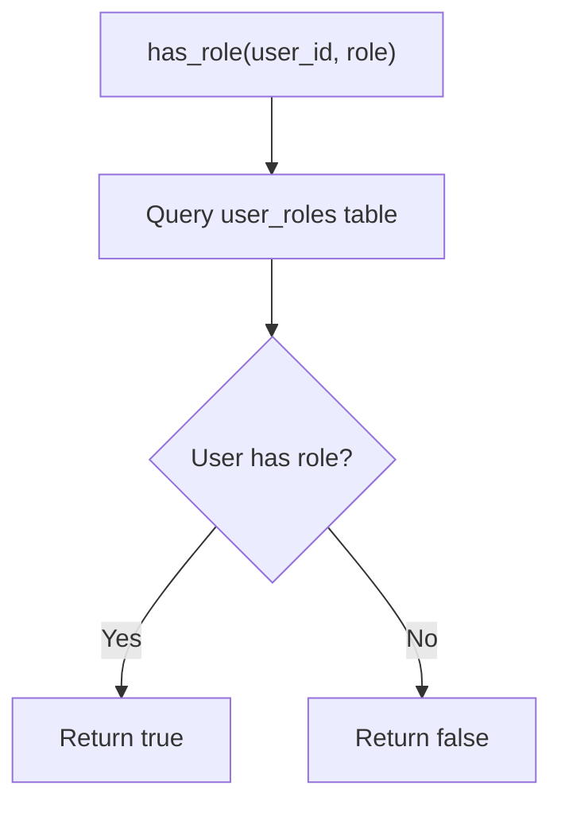
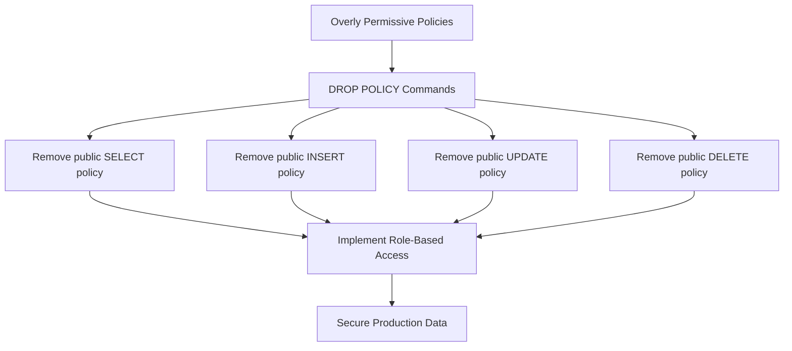
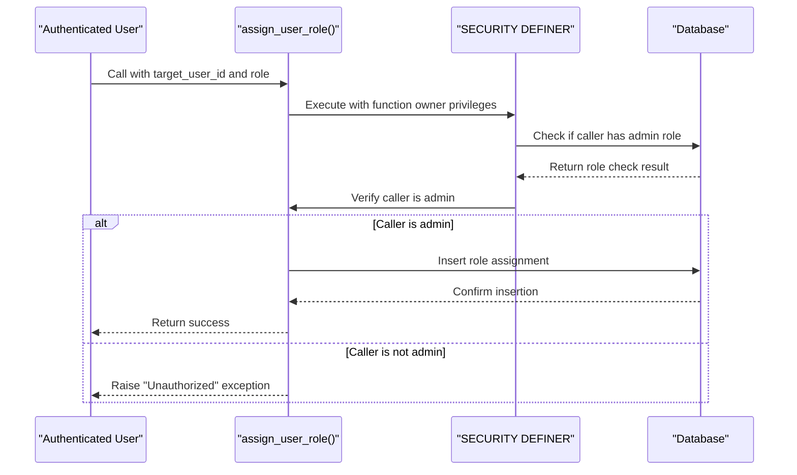
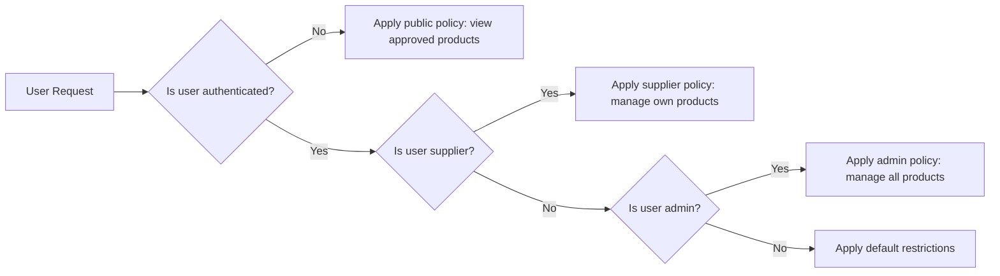

# Permission Policies

<cite>
**Referenced Files in This Document**   
- [COMPLETE_SETUP.sql](file://supabase/COMPLETE_SETUP.sql)
- [BASE_MIGRATION_SAFE.sql](file://supabase/BASE_MIGRATION_SAFE.sql)
- [20251115150759_remix_migration_from_pg_dump.sql](file://supabase/migrations/20251115150759_remix_migration_from_pg_dump.sql)
- [20251121014007_e1ea3a7e-b3b2-4082-a10a-c5eff6b1135b.sql](file://supabase/migrations/20251121014007_e1ea3a7e-b3b2-4082-a10a-c5eff6b1135b.sql)
- [20251119005557_d0e64af9-ad20-4d7c-b2be-501eb80476de.sql](file://supabase/migrations/20251119005557_d0e64af9-ad20-4d7c-b2be-501eb80476de.sql)
- [20251120233928_2016afb8-d720-4858-9e12-7fb4ebbd5de0.sql](file://supabase/migrations/20251120233928_2016afb8-d720-4858-9e12-7fb4ebbd5de0.sql)
- [20251124153707_081333e0-a3e1-48b0-bf13-2cea6f895f71.sql](file://supabase/migrations/20251124153707_081333e0-a3e1-48b0-bf13-2cea6f895f71.sql)
</cite>

## Table of Contents
1. [Introduction](#introduction)
2. [Role Management Functions](#role-management-functions)
3. [Row-Level Security Implementation](#row-level-security-implementation)
4. [Critical Security Fixes](#critical-security-fixes)
5. [Function Security and Privilege Separation](#function-security-and-privilege-separation)
6. [Policy Chaining and Access Control](#policy-chaining-and-access-control)
7. [Conclusion](#conclusion)

## Introduction

This document provides a comprehensive analysis of the permission policies implemented in the Supabase database system for the SleekApparels application. The security architecture is built around Row-Level Security (RLS) to ensure that users can only access data appropriate to their roles. The system implements a robust role-based access control mechanism using custom SQL functions like `has_role()` and `has_any_role()` to enforce access policies across various tables including orders, supplier_orders, and production_stages. This documentation will explain the implementation details, security considerations, and best practices used in the system, making it accessible to both beginners and experienced developers.

## Role Management Functions

The permission system is centered around two key SQL functions that determine user access: `has_role()` and `has_any_role()`. These functions serve as the foundation for all Row-Level Security policies in the database.

The `has_role()` function checks whether a specific user has been assigned a particular role. It takes two parameters: the user ID and the role to check. The function queries the `user_roles` table to determine if a matching record exists. This function is implemented with `SECURITY DEFINER` to ensure it can access the user roles table regardless of the caller's permissions, while still validating that the caller has the appropriate authorization.



**Diagram sources**
- [20251115150759_remix_migration_from_pg_dump.sql](file://supabase/migrations/20251115150759_remix_migration_from_pg_dump.sql#L370-L381)

The `has_any_role()` function extends this capability by allowing checks against multiple roles simultaneously. It accepts an array of roles and returns true if the user has any of the specified roles. This is particularly useful for implementing hierarchical access where certain operations can be performed by users with different but related roles.

Both functions are marked as `STABLE` and use `SECURITY DEFINER` to ensure consistent behavior and proper privilege separation. The `SECURITY DEFINER` attribute means the function executes with the privileges of the user who created it (typically a superuser), rather than the privileges of the calling user. This is critical for security functions that need to access system tables or perform operations that the calling user should not be able to perform directly.

**Section sources**
- [20251115150759_remix_migration_from_pg_dump.sql](file://supabase/migrations/20251115150759_remix_migration_from_pg_dump.sql#L354-L381)

## Row-Level Security Implementation

The application implements Row-Level Security on multiple tables to restrict data access based on user roles. The RLS policies are carefully designed to ensure that users can only access data relevant to their role and responsibilities.

For the `orders` table, policies are implemented to ensure that buyers can only view their own orders, suppliers can only access orders assigned to them, and admins have full access. The policy for buyers uses the `has_role()` function to verify the user's role and then checks if the order belongs to them through the `buyer_id` field.

```mermaid
erDiagram
USER_ROLES ||--o{ ORDERS : "has_role"
SUPPLIERS ||--o{ SUPPLIER_ORDERS : "assigned_to"
SUPPLIER_ORDERS }|--|| PRODUCTION_STAGES : "contains"
ADMIN ||--o{ ALL_TABLES : "full_access"
class USER_ROLES "User Roles"
class ORDERS "Orders"
class SUPPLIER_ORDERS "Supplier Orders"
class PRODUCTION_STAGES "Production Stages"
class ADMIN "Admin Role"
```

**Diagram sources**
- [COMPLETE_SETUP.sql](file://supabase/COMPLETE_SETUP.sql#L6893-L6902)
- [20251120233928_2016afb8-d720-4858-9e12-7fb4ebbd5de0.sql](file://supabase/migrations/20251120233928_2016afb8-d720-4858-9e12-7fb4ebbd5de0.sql#L140-L164)

The `supplier_orders` table has policies that allow suppliers to view and update only the orders assigned to them. This is achieved by checking if the supplier ID in the order matches the supplier ID associated with the authenticated user. The policy uses a subquery to find the supplier ID from the `suppliers` table where the `user_id` matches the authenticated user's ID.

The `production_stages` table implements a more complex set of policies due to the sensitive nature of production data. Buyers can view production stages for their own orders, suppliers can view and update stages for orders assigned to them, and admins have full access. Additionally, a service role is granted full access to support edge functions that need to perform operations on behalf of users.

**Section sources**
- [COMPLETE_SETUP.sql](file://supabase/COMPLETE_SETUP.sql#L4265-L4365)
- [20251120233928_2016afb8-d720-4858-9e12-7fb4ebbd5de0.sql](file://supabase/migrations/20251120233928_2016afb8-d720-4858-9e12-7fb4ebbd5de0.sql#L140-L164)

## Critical Security Fixes

The codebase includes several critical security fixes that address potential vulnerabilities in the RLS implementation. One significant fix involved removing overly permissive policies on the `production_stages` table that previously allowed public access to production data.

The security fix, documented in migration `20251119005557_d0e64af9-ad20-4d7c-b2be-501eb80476de.sql`, removed public DELETE, UPDATE, INSERT, and SELECT policies on the `production_stages` table. This was a critical security measure to prevent attackers from deleting, modifying, or viewing production data without proper authentication.



**Diagram sources**
- [20251119005557_d0e64af9-ad20-4d7c-b2be-501eb80476de.sql](file://supabase/migrations/20251119005557_d0e64af9-ad20-4d7c-b2be-501eb80476de.sql#L1-L23)

The fix was followed by implementing properly restrictive policies that scope access to authenticated users with appropriate permissions. These include policies for admins, suppliers, and order participants, all of which require proper authentication and role verification before allowing access to production data.

Another security enhancement was the implementation of the `SECURITY DEFINER` attribute on critical functions like `has_role()` and `assign_user_role()`. This ensures that these functions execute with the privileges of the function owner rather than the caller, preventing privilege escalation attacks.

**Section sources**
- [20251119005557_d0e64af9-ad20-4d7c-b2be-501eb80476de.sql](file://supabase/migrations/20251119005557_d0e64af9-ad20-4d7c-b2be-501eb80476de.sql#L1-L23)
- [20251121014007_e1ea3a7e-b3b2-4082-a10a-c5eff6b1135b.sql](file://supabase/migrations/20251121014007_e1ea3a7e-b3b2-4082-a10a-c5eff6b1135b.sql#L1-L62)

## Function Security and Privilege Separation

The system implements strict privilege separation through the use of `SECURITY DEFINER` functions and careful role management. This approach ensures that sensitive operations can only be performed through controlled interfaces, preventing direct manipulation of critical data.

The `assign_user_role()` function is a prime example of this principle. It can only be called by users with the admin role, as verified by the `has_role()` function. This prevents unauthorized users from assigning roles to themselves or others. The function also includes a safeguard that prevents the assignment of the admin role through this function, requiring the use of a separate `assign_admin_role()` function for that purpose.



**Diagram sources**
- [20251115150759_remix_migration_from_pg_dump.sql](file://supabase/migrations/20251115150759_remix_migration_from_pg_dump.sql#L137-L162)

The `SECURITY DEFINER` attribute is also used in the `get_product_engagement_metrics()` function, which wraps access to a materialized view containing sensitive analytics data. This function first revokes direct access to the materialized view from anonymous and authenticated users, then grants access only through the security-definer function. The function itself checks if the calling user has the admin role before returning any data.

This approach creates a secure gateway to sensitive data, ensuring that even if an attacker gains access to an authenticated session, they cannot bypass the role checks implemented in the security-definer functions.

**Section sources**
- [20251115150759_remix_migration_from_pg_dump.sql](file://supabase/migrations/20251115150759_remix_migration_from_pg_dump.sql#L137-L162)
- [20251119000211_9226dde4-e684-42c1-82f5-ece2d376a236.sql](file://supabase/migrations/20251119000211_9226dde4-e684-42c1-82f5-ece2d376a236.sql#L1-L21)

## Policy Chaining and Access Control

The permission system implements policy chaining to create a comprehensive access control framework. This approach combines multiple policies to create a layered security model that addresses different aspects of data access.

For example, the `marketplace_products` table implements three distinct policies that work together to control access:

1. A policy that allows anyone to view approved products
2. A policy that allows suppliers to manage their own products
3. A policy that allows admins to manage all products



**Diagram sources**
- [20251124153707_081333e0-a3e1-48b0-bf13-2cea6f895f71.sql](file://supabase/migrations/20251124153707_081333e0-a3e1-48b0-bf13-2cea6f895f71.sql#L36-L53)

This policy chaining approach ensures that users have the minimum necessary permissions to perform their tasks while preventing unauthorized access to sensitive data. The policies are evaluated in a specific order, with more restrictive policies taking precedence over more permissive ones.

The system also implements policy chaining through the use of multiple RLS policies on the same table. For instance, the `production_stages` table has separate policies for SELECT, UPDATE, and DELETE operations, each with different conditions based on user roles. This allows for fine-grained control over what operations different users can perform on the data.

**Section sources**
- [20251124153707_081333e0-a3e1-48b0-bf13-2cea6f895f71.sql](file://supabase/migrations/20251124153707_081333e0-a3e1-48b0-bf13-2cea6f895f71.sql#L36-L53)
- [20251121014007_e1ea3a7e-b3b2-4082-a10a-c5eff6b1135b.sql](file://supabase/migrations/20251121014007_e1ea3a7e-b3b2-4082-a10a-c5eff6b1135b.sql#L1-L62)

## Conclusion

The permission policies implemented in the SleekApparels application demonstrate a robust and well-considered approach to database security. By leveraging Supabase's Row-Level Security system, the application ensures that users can only access data appropriate to their roles and responsibilities. The use of custom SQL functions like `has_role()` and `has_any_role()` provides a flexible foundation for implementing role-based access control across the system.

The implementation includes several best practices for database security, including the use of `SECURITY DEFINER` functions to enforce privilege separation, careful policy chaining to create layered access controls, and regular security audits to identify and fix potential vulnerabilities. The critical security fixes implemented in the codebase demonstrate a proactive approach to security, addressing potential issues before they can be exploited.

For developers working with this system, it's important to understand that all data access is controlled through these RLS policies. When implementing new features or modifying existing ones, care must be taken to ensure that the appropriate policies are in place to protect sensitive data. The use of security-definer functions should be limited to cases where privilege separation is necessary, and all such functions should include appropriate authorization checks.

Overall, the permission system provides a solid foundation for secure data access in the application, balancing the need for functionality with the imperative of data protection.