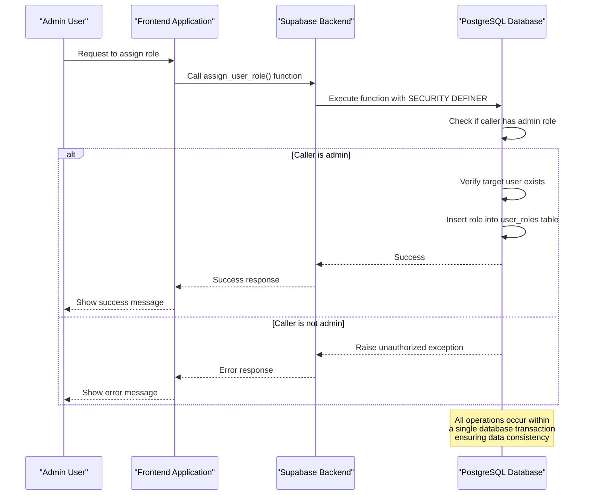
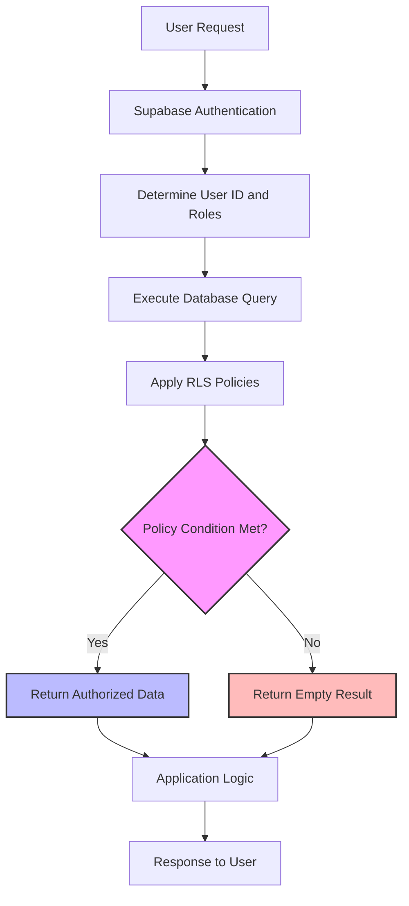

# Role Management

<cite>
**Referenced Files in This Document**   
- [BASE_MIGRATION_SAFE.sql](file://supabase/BASE_MIGRATION_SAFE.sql)
- [COMPLETE_SETUP.sql](file://supabase/COMPLETE_SETUP.sql)
- [20251115150759_remix_migration_from_pg_dump.sql](file://supabase/migrations/20251115150759_remix_migration_from_pg_dump.sql)
- [bootstrap-admin/index.ts](file://supabase/functions/bootstrap-admin/index.ts)
</cite>

## Table of Contents
1. [Introduction](#introduction)
2. [Domain Model and Data Structure](#domain-model-and-data-structure)
3. [Role Assignment Functions](#role-assignment-functions)
4. [Row-Level Security Implementation](#row-level-security-implementation)
5. [Security Considerations](#security-considerations)
6. [Role-Based Access Control in Practice](#role-based-access-control-in-practice)
7. [Conclusion](#conclusion)

## Introduction

The role management system in the SleekApparels platform is built on Supabase's Row-Level Security (RLS) framework, providing a robust and secure method for managing user permissions. This system enables fine-grained access control across the application, ensuring that users can only access data and perform actions appropriate to their roles. The implementation combines PostgreSQL's powerful function system with Supabase's authentication and authorization features to create a secure, scalable role-based access control (RBAC) system.

The core of this system revolves around the `app_role` enum type, which defines the various roles within the application, including admin, supplier, retailer, and others. User roles are managed through a combination of database functions and RLS policies that enforce security at the database level, providing defense in depth against unauthorized access.

**Section sources**
- [BASE_MIGRATION_SAFE.sql](file://supabase/BASE_MIGRATION_SAFE.sql#L28-L40)
- [20251115150759_remix_migration_from_pg_dump.sql](file://supabase/migrations/20251115150759_remix_migration_from_pg_dump.sql#L28-L40)

## Domain Model and Data Structure

The role management system is built around three key database components: the `auth.users` table from Supabase Auth, the `user_roles` table that maps users to their application roles, and various application-specific tables like `suppliers` and `orders` that contain business data.

The `app_role` enum type defines the available roles in the system:
```sql
CREATE TYPE public.app_role AS ENUM (
    'retailer',
    'wholesaler',
    'educational',
    'corporate',
    'sports_team',
    'factory',
    'admin',
    'supplier'
);
```

The `user_roles` table establishes the many-to-many relationship between users and roles:
```sql
CREATE TABLE public.user_roles (
    user_id UUID REFERENCES auth.users(id) ON DELETE CASCADE,
    role public.app_role,
    created_at TIMESTAMPTZ DEFAULT NOW(),
    PRIMARY KEY (user_id, role)
);
```

This design allows users to have multiple roles simultaneously, providing flexibility in access control. For example, a user could have both 'supplier' and 'retailer' roles if they participate in the platform in multiple capacities.

The relationship between the authentication system and application data is established through foreign key relationships. For instance, the `suppliers` table references the `profiles` table, which in turn is linked to `auth.users` via the user ID. This creates a secure chain of identity from the authentication layer through to application-specific data.

```mermaid
erDiagram
auth.users {
uuid id PK
text email UK
jsonb raw_user_meta_data
timestamp created_at
timestamp updated_at
}
public.profiles {
uuid id PK FK
string full_name
string company_name
string phone
timestamp created_at
timestamp updated_at
}
public.user_roles {
uuid user_id PK FK
app_role role PK
timestamp created_at
}
public.suppliers {
uuid id PK
uuid user_id FK
string company_name
string country
verification_status verification_status
supplier_tier tier
}
public.orders {
uuid id PK
uuid buyer_id FK
uuid supplier_id FK
order_workflow_status workflow_status
timestamp created_at
timestamp updated_at
}
auth.users ||--o{ public.profiles : "1:1"
auth.users ||--o{ public.user_roles : "1:M"
public.profiles ||--o{ public.suppliers : "1:1"
public.user_roles }o--|| auth.users : "M:1"
public.suppliers }o--|| public.orders : "suppliers supply"
public.profiles }o--|| public.orders : "buyers order"
```

**Diagram sources**
- [BASE_MIGRATION_SAFE.sql](file://supabase/BASE_MIGRATION_SAFE.sql#L28-L40)
- [BASE_MIGRATION_SAFE.sql](file://supabase/BASE_MIGRATION_SAFE.sql#L322-L328)
- [BASE_MIGRATION_SAFE.sql](file://supabase/BASE_MIGRATION_SAFE.sql#L1370-L1376)

**Section sources**
- [BASE_MIGRATION_SAFE.sql](file://supabase/BASE_MIGRATION_SAFE.sql#L28-L40)
- [BASE_MIGRATION_SAFE.sql](file://supabase/BASE_MIGRATION_SAFE.sql#L322-L328)

## Role Assignment Functions

The system provides three main SQL functions for managing user roles: `assign_admin_role()`, `assign_user_role()`, and `remove_user_role()`. These functions are implemented as PostgreSQL functions with `SECURITY DEFINER` to ensure they execute with the privileges of the function owner rather than the calling user.

### assign_admin_role()

The `assign_admin_role()` function is a privileged function that allows existing administrators to grant admin privileges to other users:

```sql
CREATE FUNCTION public.assign_admin_role(target_user_id uuid) RETURNS void
    LANGUAGE plpgsql SECURITY DEFINER
    SET search_path TO 'public'
    AS $$
BEGIN
  -- Only existing admins can assign admin role
  IF NOT public.has_role(auth.uid(), 'admin') THEN
    RAISE EXCEPTION 'Unauthorized: Only admins can assign admin role';
  END IF;
  
  -- Verify target user exists
  IF NOT EXISTS (SELECT 1 FROM auth.users WHERE id = target_user_id) THEN
    RAISE EXCEPTION 'User not found';
  END IF;
  
  -- Insert admin role
  INSERT INTO public.user_roles (user_id, role)
  VALUES (target_user_id, 'admin'::public.app_role)
  ON CONFLICT (user_id, role) DO NOTHING;
END;
$$;
```

This function includes several security measures:
1. It verifies that the calling user has the 'admin' role using the `has_role()` function
2. It checks that the target user exists in the `auth.users` table
3. It uses an `ON CONFLICT` clause to prevent duplicate entries
4. It runs with `SECURITY DEFINER` to bypass RLS policies that might otherwise prevent the insertion

### assign_user_role()

The `assign_user_role()` function allows administrators to assign non-admin roles to users:

```sql
CREATE FUNCTION public.assign_user_role(target_user_id uuid, target_role public.app_role) RETURNS void
    LANGUAGE plpgsql SECURITY DEFINER
    SET search_path TO 'public'
    AS $$
BEGIN
  -- Only admins can assign roles
  IF NOT public.has_role(auth.uid(), 'admin') THEN
    RAISE EXCEPTION 'Unauthorized: Only admins can assign roles';
  END IF;
  
  -- Prevent assigning admin role through this function (use assign_admin_role instead)
  IF target_role = 'admin' THEN
    RAISE EXCEPTION 'Use assign_admin_role() function to assign admin role';
  END IF;
  
  -- Verify target user exists
  IF NOT EXISTS (SELECT 1 FROM auth.users WHERE id = target_user_id) THEN
    RAISE EXCEPTION 'User not found';
  END IF;
  
  -- Insert role
  INSERT INTO public.user_roles (user_id, role)
  VALUES (target_user_id, target_role)
  ON CONFLICT (user_id, role) DO NOTHING;
END;
$$;
```

Key security features of this function include:
1. Admin-only access control
2. Explicit prevention of admin role assignment (forcing the use of the dedicated `assign_admin_role()` function)
3. User existence verification
4. Conflict handling to prevent duplicate role assignments

### remove_user_role()

The `remove_user_role()` function allows administrators to revoke roles from users:

```sql
CREATE FUNCTION public.remove_user_role(target_user_id uuid, target_role public.app_role) RETURNS void
    LANGUAGE plpgsql SECURITY DEFINER
    SET search_path TO 'public'
    AS $$
BEGIN
  -- Only admins can remove roles
  IF NOT public.has_role(auth.uid(), 'admin') THEN
    RAISE EXCEPTION 'Unauthorized: Only admins can remove roles';
  END IF;
  
  -- Delete the role
  DELETE FROM public.user_roles
  WHERE user_id = target_user_id AND role = target_role;
END;
$$;
```

This function ensures that only administrators can remove roles, preventing privilege escalation attacks.



**Diagram sources**
- [BASE_MIGRATION_SAFE.sql](file://supabase/BASE_MIGRATION_SAFE.sql#L107-L130)
- [BASE_MIGRATION_SAFE.sql](file://supabase/BASE_MIGRATION_SAFE.sql#L137-L162)
- [BASE_MIGRATION_SAFE.sql](file://supabase/BASE_MIGRATION_SAFE.sql#L501-L515)

**Section sources**
- [BASE_MIGRATION_SAFE.sql](file://supabase/BASE_MIGRATION_SAFE.sql#L107-L162)
- [BASE_MIGRATION_SAFE.sql](file://supabase/BASE_MIGRATION_SAFE.sql#L501-L515)

## Row-Level Security Implementation

Row-Level Security (RLS) is the cornerstone of the application's security model, ensuring that users can only access data they are authorized to see. RLS policies are defined on each table and evaluated for every query, automatically filtering rows based on the current user's identity and roles.

### Policy Examples

The system implements various RLS policies across different tables:

**Products Table - Admin Access**
```sql
CREATE POLICY "Admins can manage products" ON public.products 
USING (public.has_role(auth.uid(), 'admin'::public.app_role));
```

**User Roles Table - Admin Management**
```sql
CREATE POLICY "Admins can update roles" ON public.user_roles FOR UPDATE 
TO authenticated 
USING (public.has_role(auth.uid(), 'admin'::public.app_role)) 
WITH CHECK (public.has_role(auth.uid(), 'admin'::public.app_role));
```

**Orders Table - User-Specific Access**
```sql
CREATE POLICY "Users can view their orders" ON public.orders FOR SELECT 
USING (
    buyer_id = auth.uid() 
    OR supplier_id IN (SELECT id FROM public.suppliers WHERE user_id = auth.uid())
);
```

These policies work in conjunction with the role management functions to create a comprehensive security model. When a user queries a table, Supabase automatically applies the relevant RLS policies, filtering the results to only include rows that match the policy conditions.

The `has_role()` and `has_any_role()` helper functions are used extensively in RLS policies to check user roles:

```sql
CREATE FUNCTION public.has_role(_user_id uuid, _role public.app_role) RETURNS boolean
    LANGUAGE sql STABLE SECURITY DEFINER
    SET search_path TO 'public'
    AS $$
  SELECT EXISTS (
    SELECT 1
    FROM public.user_roles
    WHERE user_id = _user_id
      AND role = _role
  )
$$;
```



**Diagram sources**
- [BASE_MIGRATION_SAFE.sql](file://supabase/BASE_MIGRATION_SAFE.sql#L373-L378)
- [BASE_MIGRATION_SAFE.sql](file://supabase/BASE_MIGRATION_SAFE.sql#L3654-L3682)

**Section sources**
- [BASE_MIGRATION_SAFE.sql](file://supabase/BASE_MIGRATION_SAFE.sql#L3654-L3682)
- [BASE_MIGRATION_SAFE.sql](file://supabase/BASE_MIGRATION_SAFE.sql#L373-L378)

## Security Considerations

The role management system incorporates several security best practices to prevent common vulnerabilities and ensure the integrity of the access control system.

### SECURITY DEFINER and Privilege Escalation

The use of `SECURITY DEFINER` in the role management functions is a critical security feature. By default, PostgreSQL functions execute with the privileges of the calling user (`SECURITY INVOKER`). However, for role management functions, this would create a circular problem: users need permission to modify the `user_roles` table to change roles, but the permissions to modify that table are determined by the roles themselves.

Using `SECURITY DEFINER` allows these functions to execute with the privileges of the function owner (typically a superuser or service role), bypassing the normal RLS policies. This is safe because the functions themselves contain authorization checks (e.g., verifying the caller has the 'admin' role) before performing any privileged operations.

### Initial Admin Bootstrap

The system includes a secure mechanism for creating the initial admin user through the `bootstrap-admin` function. This function is designed to be used only once during initial setup:

```typescript
// Check if any admin exists
const { data: existingAdmins } = await supabaseClient
  .from('user_roles')
  .select('id')
  .eq('role', 'admin')
  .limit(1);

if (existingAdmins && existingAdmins.length > 0) {
  return new Response(
    JSON.stringify({ error: 'Admin already exists. Bootstrap disabled for security.' }),
    { status: 403 }
  );
}
```

This prevents the bootstrap function from being used to create additional admin accounts after the initial setup, mitigating the risk of unauthorized privilege escalation.

### Input Validation and Error Handling

All role management functions include comprehensive input validation and error handling:

1. **User existence verification**: Before modifying roles, functions verify that the target user exists
2. **Role validation**: The use of the `app_role` enum type ensures that only valid roles can be assigned
3. **Conflict handling**: The `ON CONFLICT` clause prevents errors when attempting to assign a role that already exists
4. **Comprehensive error messages**: Functions provide clear error messages to aid debugging while avoiding information disclosure

### Security Audits and Fixes

The codebase shows evidence of security audits and subsequent fixes, particularly in the migration files that address overly permissive RLS policies:

```sql
-- Fix payment_history table
DROP POLICY IF EXISTS "System can create payments" ON public.payment_history;

CREATE POLICY "Service role can create payments" ON public.payment_history
  FOR INSERT 
  WITH CHECK (auth.role() = 'service_role');
```

These fixes demonstrate a proactive approach to security, regularly reviewing and tightening access controls across the system.

**Section sources**
- [bootstrap-admin/index.ts](file://supabase/functions/bootstrap-admin/index.ts#L91-L107)
- [BASE_MIGRATION_SAFE.sql](file://supabase/BASE_MIGRATION_SAFE.sql#L143-L150)
- [20251121001333_f0e74faa-4a90-4b82-a0ae-86267b97afb3.sql](file://supabase/migrations/20251121001333_f0e74faa-4a90-4b82-a0ae-86267b97afb3.sql#L1-L15)

## Role-Based Access Control in Practice

The role management system enables different user types to interact with the platform according to their business needs:

### Admin Users

Admin users have broad access across the system, allowing them to:
- Manage user roles and permissions
- Oversee all orders and transactions
- Configure system settings and policies
- Monitor platform performance and analytics

The RLS policies grant admins access to data through explicit policies like:
```sql
CREATE POLICY "Admins can update all profiles" ON public.profiles FOR UPDATE 
USING (public.has_role(auth.uid(), 'admin'::public.app_role));
```

### Supplier Users

Supplier users can manage their own supplier profile, view and fulfill orders assigned to them, and access relevant production data. Their access is constrained by policies that limit data to their own supplier entity:
```sql
CREATE POLICY "Suppliers can view their work orders" ON public.work_orders 
FOR SELECT USING (
    supplier_id IN (SELECT id FROM public.suppliers WHERE user_id = auth.uid())
);
```

### Retailer/Buyer Users

Retailer users (also referred to as buyers) can create orders, track order status, and communicate with suppliers. Their access is limited to orders they have created or are involved in:
```sql
CREATE POLICY "Users can view messages for their orders" ON public.order_messages FOR SELECT 
USING ((EXISTS (SELECT 1 FROM public.orders o WHERE ((o.id = order_messages.order_id) AND ((o.buyer_id = auth.uid()) OR (o.supplier_id IN (SELECT s.id FROM public.suppliers s WHERE (s.user_id = auth.uid()))))))));
```

This role-based approach ensures that each user type has the appropriate level of access for their role in the business process, maintaining data privacy and security while enabling collaboration.

**Section sources**
- [BASE_MIGRATION_SAFE.sql](file://supabase/BASE_MIGRATION_SAFE.sql#L3654-L3682)
- [COMPLETE_SETUP.sql](file://supabase/COMPLETE_SETUP.sql#L6893-L6900)
- [BASE_MIGRATION_SAFE.sql](file://supabase/BASE_MIGRATION_SAFE.sql#L4616-L4621)

## Conclusion

The role management system in the SleekApparels platform demonstrates a robust implementation of role-based access control using Supabase's Row-Level Security and PostgreSQL's advanced features. By combining database-level security with well-designed application architecture, the system provides a secure, flexible, and maintainable approach to user permissions.

Key strengths of the implementation include:
- Use of PostgreSQL enums for type-safe role definitions
- Comprehensive RLS policies that enforce security at the database level
- Secure role management functions with proper authorization checks
- Defense in depth through multiple layers of security controls
- Regular security audits and policy improvements

The system effectively balances security with usability, allowing administrators to manage user roles efficiently while preventing unauthorized access to sensitive data. This approach ensures that the platform can scale securely as it grows, maintaining data integrity and user privacy across all interactions.