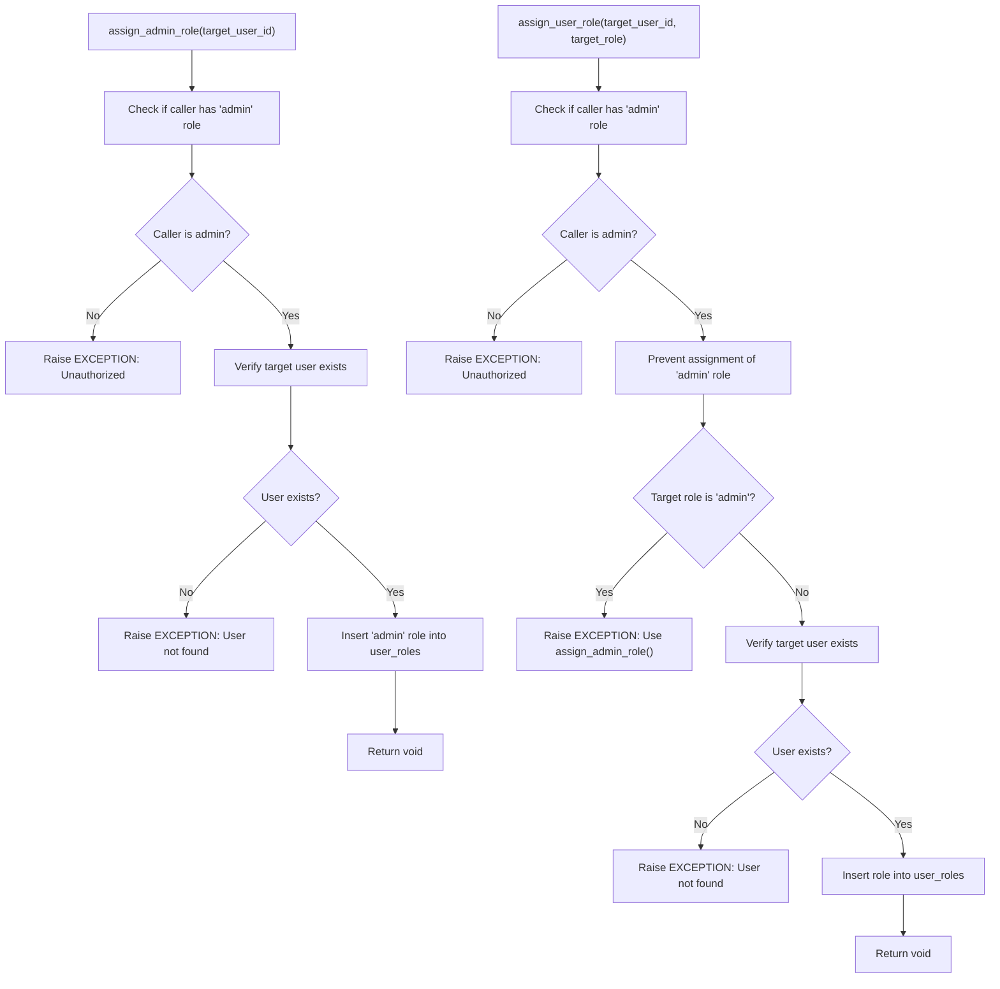
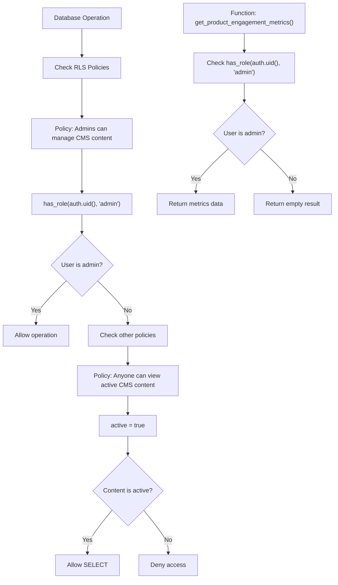
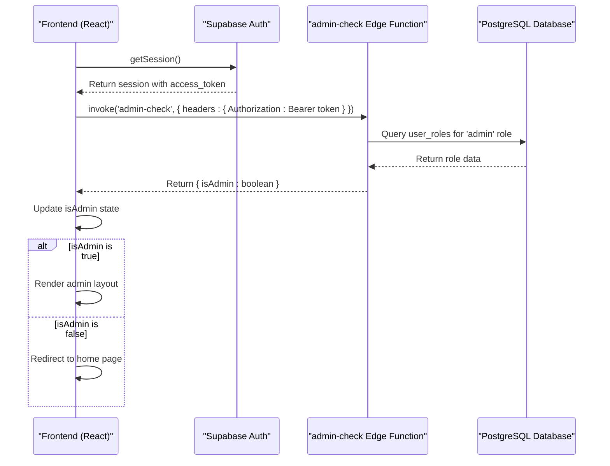

# Role-Based Access Control

<cite>
**Referenced Files in This Document**   
- [admin-check\index.ts](file://supabase/functions/admin-check/index.ts)
- [remix_migration_from_pg_dump.sql](file://supabase/migrations/20251115150759_remix_migration_from_pg_dump.sql)
- [BASE_MIGRATION_SAFE.sql](file://supabase/BASE_MIGRATION_SAFE.sql)
- [COMPLETE_SETUP.sql](file://supabase/COMPLETE_SETUP.sql)
- [seed_SIMPLE.sql](file://supabase/seed_SIMPLE.sql)
- [seed_ULTRA_MINIMAL.sql](file://supabase/seed_ULTRA_MINIMAL.sql)
- [seed_MINIMAL.sql](file://supabase/seed_MINIMAL.sql)
- [seed_FIXED.sql](file://supabase/seed_FIXED.sql)
- [seed_READY_TO_RUN.sql](file://supabase/seed_READY_TO_RUN.sql)
- [seed_comprehensive_test_data.sql](file://supabase/seed_comprehensive_test_data.sql)
- [useAdminAuth.ts](file://src/hooks/useAdminAuth.ts)
- [AdminLayout.tsx](file://src/pages/admin/AdminLayout.tsx)
- [supabase-adapter.ts](file://src/lib/firebase/supabase-adapter.ts)
- [config.toml](file://supabase/config.toml)
</cite>

## Table of Contents
1. [Introduction](#introduction)
2. [Core Components](#core-components)
3. [Domain Model](#domain-model)
4. [Role Management Functions](#role-management-functions)
5. [Row-Level Security Implementation](#row-level-security-implementation)
6. [Frontend Role Verification](#frontend-role-verification)
7. [Security Considerations](#security-considerations)
8. [Common Issues and Solutions](#common-issues-and-solutions)

## Introduction
The Role-Based Access Control (RBAC) system in SleekApparels is built on Supabase's Row-Level Security (RLS) framework, providing a robust security model that ensures users can only access data and functionality appropriate to their roles. This system implements a comprehensive access control mechanism using PostgreSQL enums, custom functions, and RLS policies to enforce security at the database level. The RBAC system supports multiple user roles including admin, supplier, and retailer, with fine-grained permissions that control access to different parts of the application. This documentation provides a detailed explanation of the implementation, covering the domain model, role management functions, RLS policies, and frontend integration patterns.

## Core Components
The RBAC system consists of several core components that work together to provide secure access control. At the foundation is the `app_role` enum type that defines all possible roles in the system. This is complemented by the `user_roles` table that establishes the many-to-many relationship between users and roles. The system includes custom PostgreSQL functions like `has_role()` and `has_any_role()` that are used extensively in RLS policies to determine access permissions. These functions are called with the current authenticated user's ID (obtained via `auth.uid()`) to check if they possess the required role for a given operation. The system also includes specialized functions for role assignment and removal, with appropriate security checks to prevent unauthorized privilege escalation.

**Section sources**
- [remix_migration_from_pg_dump.sql](file://supabase/migrations/20251115150759_remix_migration_from_pg_dump.sql#L30-L381)
- [BASE_MIGRATION_SAFE.sql](file://supabase/BASE_MIGRATION_SAFE.sql#L121-L378)

## Domain Model
The domain model for the RBAC system centers around the relationship between Supabase authentication users, application roles, and business entities. The core entities include:

- `auth.users`: Supabase's built-in user table containing authentication information
- `app_role`: PostgreSQL enum type defining all possible application roles
- `user_roles`: Junction table linking users to their roles
- Business-specific tables like `suppliers`, `orders`, and `quotes` that have RLS policies based on user roles

The `app_role` enum includes values such as admin, supplier, retailer, wholesaler, educational, corporate, sports_team, and factory. Each user can have multiple roles, allowing for flexible permission models. The relationship between these entities ensures that authentication (handled by Supabase Auth) is separated from authorization (handled by the application's RBAC system). When a user authenticates, their roles are retrieved from the `user_roles` table and used to determine their permissions throughout the application.

```mermaid
erDiagram
auth.users {
uuid id PK
text email
jsonb raw_user_meta_data
timestamp created_at
timestamp updated_at
}
public.app_role {
enum values
"admin"
"supplier"
"retailer"
"wholesaler"
"educational"
"corporate"
"sports_team"
"factory"
}
public.user_roles {
uuid id PK
uuid user_id FK
app_role role
timestamp created_at
}
public.suppliers {
uuid id PK
uuid user_id FK
text company_name
supplier_tier tier
verification_status status
}
public.orders {
uuid id PK
uuid supplier_id FK
uuid buyer_id FK
order_workflow_status status
}
auth.users ||--o{ public.user_roles : "has"
public.user_roles }o--|| public.app_role : "is"
auth.users ||--o{ public.suppliers : "owns"
public.suppliers ||--o{ public.orders : "fulfills"
auth.users ||--o{ public.orders : "places"
```

**Diagram sources **
- [remix_migration_from_pg_dump.sql](file://supabase/migrations/20251115150759_remix_migration_from_pg_dump.sql#L30-L1886)
- [BASE_MIGRATION_SAFE.sql](file://supabase/BASE_MIGRATION_SAFE.sql#L14-L875)

## Role Management Functions
The RBAC system implements several PostgreSQL functions to manage user roles securely. The `has_role(_user_id uuid, _role app_role)` function returns a boolean indicating whether a specific user has a particular role. This function is marked with `SECURITY DEFINER` and `STABLE` attributes, ensuring it executes with the privileges of the function owner and can be efficiently cached. Similarly, the `has_any_role(_user_id uuid, _roles app_role[])` function checks if a user has any of the specified roles, providing flexibility for complex permission scenarios.

For role assignment, the system provides specialized functions with security checks. The `assign_admin_role(target_user_id uuid)` function can only be called by existing admins and specifically assigns the admin role, preventing privilege escalation through other role assignment functions. The `assign_user_role(target_user_id uuid, target_role app_role)` function allows admins to assign non-admin roles to users, with explicit checks to prevent assignment of the admin role through this function. Both functions verify that the target user exists and enforce authorization rules before making changes. The `remove_user_role(target_user_id uuid, target_role app_role)` function follows the same security pattern, ensuring only admins can remove roles from users.



**Diagram sources **
- [remix_migration_from_pg_dump.sql](file://supabase/migrations/20251115150759_remix_migration_from_pg_dump.sql#L110-L162)
- [BASE_MIGRATION_SAFE.sql](file://supabase/BASE_MIGRATION_SAFE.sql#L137-L162)

**Section sources**
- [remix_migration_from_pg_dump.sql](file://supabase/migrations/20251115150759_remix_migration_from_pg_dump.sql#L110-L205)
- [BASE_MIGRATION_SAFE.sql](file://supabase/BASE_MIGRATION_SAFE.sql#L137-L162)

## Row-Level Security Implementation
Row-Level Security (RLS) is implemented through PostgreSQL policies that control access to database tables based on the authenticated user's roles. These policies use the `has_role()` and `has_any_role()` functions to determine if a user should be allowed to perform specific operations (SELECT, INSERT, UPDATE, DELETE) on table rows. For example, the policy "Admins can manage CMS content" on the `cms_content` table uses `FOR ALL USING (public.has_role(auth.uid(), 'admin'::public.app_role))` to restrict all operations to users with the admin role.

The RLS policies are carefully designed to balance security and functionality. Some tables have multiple policies to handle different access scenarios. For instance, the `payment_history` table has separate policies: "Admins can view all payments" for comprehensive access by administrators, and "Users can view their own payments" allowing users to see transactions involving them. The `messages` table has distinct policies for different operations: users can view messages where they are sender or recipient, send messages as themselves, and update messages they have received.

Security has been enhanced by restricting direct access to sensitive data. For example, the `product_engagement_metrics` materialized view has access revoked from `anon` and `authenticated` roles, with access provided only through the `get_product_engagement_metrics()` function that includes a role check. This layered approach ensures that even if RLS policies are bypassed, the function-level security provides an additional barrier.



**Diagram sources **
- [COMPLETE_SETUP.sql](file://supabase/COMPLETE_SETUP.sql#L6893-L6955)
- [remix_migration_from_pg_dump.sql](file://supabase/migrations/20251115150759_remix_migration_from_pg_dump.sql#L6893-L6955)

**Section sources**
- [COMPLETE_SETUP.sql](file://supabase/COMPLETE_SETUP.sql#L6893-L6955)
- [remix_migration_from_pg_dump.sql](file://supabase/migrations/20251115150759_remix_migration_from_pg_dump.sql#L6893-L6955)

## Frontend Role Verification
The frontend implements role verification through a combination of React hooks and Supabase edge functions. The `useAdminAuth` hook demonstrates this pattern by checking the user's admin status and controlling access to admin-only routes. When the hook is used, it first retrieves the current session and then invokes the `admin-check` edge function with the user's access token. This server-side verification ensures that role checks cannot be bypassed by client-side manipulation.

The `admin-check` edge function implements the actual role verification logic by querying the `user_roles` table for the 'admin' role. This approach separates authentication (handled by Supabase Auth) from authorization (handled by the application's RBAC system). The use of edge functions for role verification provides several security benefits: it prevents client-side tampering, allows for complex authorization logic, and enables centralized policy enforcement. The `AdminLayout` component uses this hook to redirect non-admin users to the home page, ensuring that admin interfaces are only accessible to authorized users.



**Diagram sources **
- [useAdminAuth.ts](file://src/hooks/useAdminAuth.ts#L1-L46)
- [admin-check\index.ts](file://supabase/functions/admin-check/index.ts#L44-L65)
- [AdminLayout.tsx](file://src/pages/admin/AdminLayout.tsx#L1-L44)

**Section sources**
- [useAdminAuth.ts](file://src/hooks/useAdminAuth.ts#L1-L46)
- [admin-check\index.ts](file://supabase/functions/admin-check/index.ts#L44-L65)
- [AdminLayout.tsx](file://src/pages/admin/AdminLayout.tsx#L1-L44)

## Security Considerations
The RBAC implementation addresses several critical security considerations to prevent common vulnerabilities. The use of `SECURITY DEFINER` clauses in database functions ensures that these functions execute with elevated privileges, preventing privilege escalation attacks. However, each function includes explicit authorization checks using the `has_role()` function to verify that the calling user has the necessary permissions before performing sensitive operations.

A key security measure is the separation of role assignment functions. The `assign_admin_role()` function is specifically designed for admin role assignment and can only be called by existing admins, while the `assign_user_role()` function explicitly prevents assignment of the admin role. This separation prevents a scenario where a user with role assignment privileges could escalate their own privileges.

The system also addresses the risk of client-side role manipulation by not trusting role information from the client. When users sign up, the system defaults to assigning the 'retailer' role regardless of any client-supplied role metadata. Admin roles must be assigned through secure, server-side functions that verify the administrator's credentials. This approach ensures that role assignment is controlled and auditable.

Additionally, the system has been hardened against overly permissive RLS policies. Security audits identified policies that allowed system operations without proper role checks, which were subsequently fixed to require the `service_role` for system-level operations. This change ensures that only Supabase's service role can perform system-level data modifications, preventing potential abuse of these capabilities.

**Section sources**
- [remix_migration_from_pg_dump.sql](file://supabase/migrations/20251115150759_remix_migration_from_pg_dump.sql#L110-L162)
- [COMPLETE_SETUP.sql](file://supabase/COMPLETE_SETUP.sql#L342-L345)
- [migrations\20251121001333_f0e74faa-4a90-4b82-a0ae-86267b97afb3.sql](file://supabase/migrations/20251121001333_f0e74faa-4a90-4b82-a0ae-86267b97afb3.sql#L1-L15)

## Common Issues and Solutions
Several common issues in RBAC implementations have been addressed in this system. One frequent problem is privilege escalation, where users attempt to gain unauthorized access to higher-level roles. This is prevented through the separation of role assignment functions and explicit checks in the `assign_user_role()` function that prohibit assignment of the admin role through that function.

Another common issue is over-permissive RLS policies that grant excessive access. This was identified in policies like "System can create payments" which initially used `WITH CHECK (true)` allowing any authenticated user to create payments. The solution was to restrict these policies to require the `service_role`, ensuring that only system processes can perform these operations.

Race conditions in role assignment are mitigated through the use of `ON CONFLICT (user_id, role) DO NOTHING` in role insertion statements. This prevents duplicate role assignments and ensures data consistency even under high concurrency. The use of UUIDs for user identification also prevents enumeration attacks that could occur with sequential IDs.

A potential issue with client-side role verification is addressed by implementing server-side role checks through edge functions. Client-side checks could be bypassed by modifying JavaScript code, but by verifying roles on the server through the `admin-check` function, the system ensures that authorization decisions are made in a trusted environment.

Finally, the system addresses the challenge of role initialization during user signup. Rather than trusting client-provided role information, the system uses a trigger function `handle_new_user_role()` that extracts the role from signup metadata but defaults to 'retailer' if no role is specified or if the role is invalid. This ensures consistent role assignment while still allowing for role-specific onboarding flows.

**Section sources**
- [remix_migration_from_pg_dump.sql](file://supabase/migrations/20251115150759_remix_migration_from_pg_dump.sql#L336-L348)
- [COMPLETE_SETUP.sql](file://supabase/COMPLETE_SETUP.sql#L356-L369)
- [migrations\20251121001333_f0e74faa-4a90-4b82-a0ae-86267b97afb3.sql](file://supabase/migrations/20251121001333_f0e74faa-4a90-4b82-a0ae-86267b97afb3.sql#L1-L15)