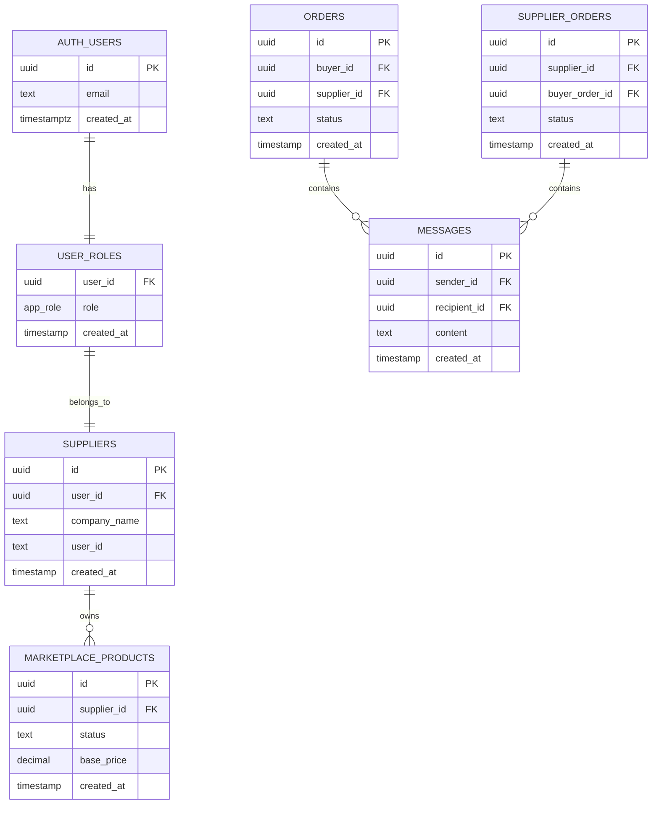

# Row-Level Security Policies

<cite>
**Referenced Files in This Document**
- [20250122000000_create_marketplace_system.sql](file://supabase/migrations/20250122000000_create_marketplace_system.sql)
- [20251116120215_71189c74-c2d3-4f3e-a1af-87d7e6b5f8fa.sql](file://supabase/migrations/20251116120215_71189c74-c2d3-4f3e-a1af-87d7e6b5f8fa.sql)
- [20251116151325_f86b3dc7-7db0-47f7-9ded-5e38d31a360a.sql](file://supabase/migrations/20251116151325_f86b3dc7-7db0-47f7-9ded-5e38d31a360a.sql)
- [20251116162502_313dcba7-bfcf-494c-a64e-cf71fbf50750.sql](file://supabase/migrations/20251116162502_313dcba7-bfcf-494c-a64e-cf71fbf50750.sql)
- [20251116162906_3f25464d-5887-4c7d-8b37-5b07b75794a6.sql](file://supabase/migrations/20251116162906_3f25464d-5887-4c7d-8b37-5b07b75794a6.sql)
- [20251124221407_01714e2f-51ac-4c7b-a04c-180e829dc504.sql](file://supabase/migrations/20251124221407_01714e2f-51ac-4c7b-a04c-180e829dc504.sql)
- [COMPLETE_SETUP.sql](file://supabase/COMPLETE_SETUP.sql)
- [BASE_MIGRATION_SAFE.sql](file://supabase/BASE_MIGRATION_SAFE.sql)
- [TABLES_ONLY.sql](file://supabase/TABLES_ONLY.sql)
- [admin-check/index.ts](file://supabase/functions/admin-check/index.ts)
</cite>

## Table of Contents
1. [Introduction](#introduction)
2. [Understanding Row-Level Security](#understanding-row-level-security)
3. [Core RLS Concepts](#core-rls-concepts)
4. [Database Schema Overview](#database-schema-overview)
5. [Implementation Examples](#implementation-examples)
6. [Policy Syntax and Components](#policy-syntax-and-components)
7. [Role-Based Access Control](#role-based-access-control)
8. [Server-Side Function Security](#server-side-function-security)
9. [Common Issues and Solutions](#common-issues-and-solutions)
10. [Best Practices](#best-practices)
11. [Troubleshooting Guide](#troubleshooting-guide)
12. [Conclusion](#conclusion)

## Introduction

Row-Level Security (RLS) in Supabase provides fine-grained access control at the database level, ensuring that users can only access data they're authorized to see. This comprehensive system enforces data isolation based on user roles, preventing unauthorized access to sensitive information while maintaining efficient data retrieval.

The Sleek Apparels marketplace implements sophisticated RLS policies that protect different types of data across multiple user roles including buyers, suppliers, and administrators. These policies are designed to prevent data leakage while enabling seamless collaboration between different stakeholders in the supply chain ecosystem.

## Understanding Row-Level Security

Row-Level Security operates at the PostgreSQL database level, providing automatic data filtering for every query executed against protected tables. Unlike application-level security, RLS ensures that even direct database access is properly restricted, providing defense-in-depth security.

### How RLS Works

RLS policies are automatically applied to all queries against protected tables. When a user accesses data:
1. The database engine evaluates the RLS policy
2. It checks if the user's authentication context (`auth.uid()`) satisfies the policy conditions
3. Only rows meeting the criteria are returned to the user
4. Operations (SELECT, INSERT, UPDATE, DELETE) are restricted based on policy permissions

### Benefits of RLS

- **Automatic Protection**: Security is built into the database layer
- **Defense-in-Depth**: Complements application-level security
- **Performance**: Filtering occurs at the database level
- **Auditability**: All access attempts are logged and tracked
- **Scalability**: Reduces application complexity by moving security logic to the database

## Core RLS Concepts

### Policy Types

RLS policies support four operation types:

| Operation Type | Description | Example Use Case |
|----------------|-------------|------------------|
| `FOR SELECT` | Controls data visibility | Viewing products, orders, or messages |
| `FOR INSERT` | Controls data creation | Creating new records |
| `FOR UPDATE` | Controls data modification | Updating existing records |
| `FOR DELETE` | Controls data removal | Deleting records |

### Policy Expressions

RLS policies use two types of expressions:

- **USING**: Determines which rows are visible to the user
- **WITH CHECK**: Determines which modifications are allowed

### Authentication Context

The `auth.uid()` function provides the currently authenticated user's ID, serving as the primary mechanism for user identification in RLS policies.

**Section sources**
- [20250122000000_create_marketplace_system.sql](file://supabase/migrations/20250122000000_create_marketplace_system.sql#L248-L347)
- [BASE_MIGRATION_SAFE.sql](file://supabase/BASE_MIGRATION_SAFE.sql#L4227-L4641)

## Database Schema Overview

The marketplace system implements RLS across multiple interconnected tables, each with specialized policies tailored to their data sensitivity and access patterns.



**Diagram sources**
- [TABLES_ONLY.sql](file://supabase/TABLES_ONLY.sql#L560-L886)
- [20250122000000_create_marketplace_system.sql](file://supabase/migrations/20250122000000_create_marketplace_system.sql#L42-L118)

### Protected Tables and Their Purposes

| Table | Purpose | RLS Complexity | Access Patterns |
|-------|---------|----------------|-----------------|
| `marketplace_products` | Product listings and inventory | Medium-High | Supplier CRUD, Public view |
| `product_inquiries` | Buyer-supplier communication | Medium | Buyer/Supplier specific |
| `messages` | Internal messaging system | Medium | Sender/Recipient based |
| `orders` | Order management | High | Multi-party coordination |
| `supplier_orders` | Supplier-specific orders | High | Supplier assignment |
| `notifications` | User notifications | Low-Medium | User-specific |

**Section sources**
- [20250122000000_create_marketplace_system.sql](file://supabase/migrations/20250122000000_create_marketplace_system.sql#L248-L347)

## Implementation Examples

### Example 1: Admins Can Manage Products

This policy demonstrates administrative oversight over product listings:

```sql
CREATE POLICY "Admins can manage products" 
ON marketplace_products
FOR ALL
USING (
  EXISTS (
    SELECT 1 FROM user_roles 
    WHERE user_id = auth.uid() AND role = 'admin'
  )
);
```

**Key Features:**
- Uses `EXISTS` subquery for role verification
- Applies to all operations (SELECT, INSERT, UPDATE, DELETE)
- Requires explicit admin role membership
- Provides comprehensive administrative control

### Example 2: Suppliers Can View Their Orders

This policy enables supplier access to orders assigned to them:

```sql
CREATE POLICY "Suppliers can view their orders" 
ON supplier_orders
FOR SELECT
TO authenticated
USING (
  supplier_id IN (
    SELECT id FROM suppliers 
    WHERE user_id = auth.uid()
  )
);
```

**Key Features:**
- Uses `IN` operator with correlated subquery
- Limits access to supplier-specific orders
- Requires authenticated user context
- Separates supplier data from other users

### Example 3: Users Can View Their Messages

This policy implements private messaging with strict access controls:

```sql
CREATE POLICY "Users can view their messages" 
ON messages
FOR SELECT
USING (
  sender_id = auth.uid() OR 
  recipient_id = auth.uid()
);
```

**Key Features:**
- Implements bidirectional access (sender/recipient)
- Uses simple equality comparisons
- Provides immediate privacy guarantees
- Supports real-time messaging scenarios

**Section sources**
- [20250122000000_create_marketplace_system.sql](file://supabase/migrations/20250122000000_create_marketplace_system.sql#L282-L328)
- [BASE_MIGRATION_SAFE.sql](file://supabase/BASE_MIGRATION_SAFE.sql#L4355-L4380)

## Policy Syntax and Components

### Basic Policy Structure

RLS policies follow a standardized syntax pattern:

```sql
CREATE POLICY policy_name
ON table_name
FOR operation_type
TO role_specification
USING(expression)
[WITH CHECK(expression)];
```

### Operation Types and Permissions

| Operation Type | Permission Level | Typical Use Cases |
|----------------|------------------|-------------------|
| `FOR SELECT` | Visibility control | Data browsing, reporting |
| `FOR INSERT` | Creation control | Form submissions, API endpoints |
| `FOR UPDATE` | Modification control | Edit forms, status updates |
| `FOR DELETE` | Removal control | Archive operations, soft deletes |

### Expression Types

#### USING Expressions
Control data visibility and filtering:

```sql
-- Simple equality
USING (user_id = auth.uid())

-- Subquery with EXISTS
USING (EXISTS (
  SELECT 1 FROM suppliers 
  WHERE suppliers.user_id = auth.uid()
))

-- Correlated subquery
USING (supplier_id IN (
  SELECT id FROM suppliers 
  WHERE user_id = auth.uid()
))
```

#### WITH CHECK Expressions
Control data modification permissions:

```sql
-- Insert validation
WITH CHECK (sender_id = auth.uid())

-- Update validation
WITH CHECK (recipient_id = auth.uid())

-- Complex validation
WITH CHECK (
  supplier_id IN (
    SELECT id FROM suppliers 
    WHERE user_id = auth.uid()
  )
)
```

### Role Specification Options

| Role Specifier | Scope | Use Case |
|----------------|-------|----------|
| `TO authenticated` | Logged-in users | Most application data |
| `TO anon` | Anonymous users | Public content |
| `TO public` | Everyone | Open data |
| `TO service_role` | System functions | Administrative tasks |

**Section sources**
- [20250122000000_create_marketplace_system.sql](file://supabase/migrations/20250122000000_create_marketplace_system.sql#L258-L328)
- [20251116162906_3f25464d-5887-4c7d-8b37-5b07b75794a6.sql](file://supabase/migrations/20251116162906_3f25464d-5887-4c7d-8b37-5b07b75794a6.sql#L9-L70)

## Role-Based Access Control

### User Roles System

The application implements a hierarchical role system using the `app_role` enumeration:

```sql
CREATE TYPE public.app_role AS ENUM (
    'retailer',
    'wholesaler', 
    'educational',
    'corporate',
    'sports_team',
    'factory',
    'admin',
    'supplier'
);
```

### Role Verification Functions

The system provides robust role verification through SQL functions:

```sql
-- Single role check
CREATE FUNCTION public.has_role(
  _user_id uuid, 
  _role app_role
) RETURNS boolean
LANGUAGE sql STABLE SECURITY DEFINER
AS $$
  SELECT EXISTS (
    SELECT 1 
    FROM public.user_roles
    WHERE user_id = _user_id 
      AND role = _role
  )
$$;
```

### Role-Based Policy Examples

#### Admin-Only Policies
```sql
CREATE POLICY "Admins can manage CMS content" 
ON cms_content
FOR ALL
USING (
  public.has_role(auth.uid(), 'admin'::public.app_role)
);
```

#### Multi-Role Policies
```sql
CREATE POLICY "Users can view their own data" 
ON profiles
FOR SELECT
USING (
  id = auth.uid() OR 
  public.has_role(auth.uid(), 'admin'::public.app_role)
);
```

### Role Assignment and Management

Role assignment follows a secure pattern:

1. **Default Role Assignment**: New users receive default roles during signup
2. **Administrative Assignment**: Admins can assign specific roles through secure functions
3. **Role Verification**: Functions verify role membership before granting access

**Section sources**
- [TABLES_ONLY.sql](file://supabase/TABLES_ONLY.sql#L15-L24)
- [BASE_MIGRATION_SAFE.sql](file://supabase/BASE_MIGRATION_SAFE.sql#L137-L162)
- [admin-check/index.ts](file://supabase/functions/admin-check/index.ts#L44-L73)

## Server-Side Function Security

### SECURITY DEFINER Pattern

Critical functions use the `SECURITY DEFINER` attribute to elevate privileges:

```sql
CREATE FUNCTION public.assign_user_role(
  target_user_id uuid, 
  target_role app_role
) RETURNS void
LANGUAGE plpgsql SECURITY DEFINER
AS $$
BEGIN
  -- Only admins can assign roles
  IF NOT public.has_role(auth.uid(), 'admin') THEN
    RAISE EXCEPTION 'Unauthorized: Only admins can assign roles';
  END IF;
  
  -- Role assignment logic...
END;
$$;
```

### Function Security Levels

| Security Level | Privilege Level | Use Case | Risk Level |
|----------------|-----------------|----------|------------|
| `SECURITY DEFINER` | Elevated | Administrative functions | High - requires careful validation |
| `SECURITY INVOKER` | Standard | User-facing operations | Medium - inherits user permissions |
| Default | Standard | Normal operations | Low - typical user permissions |

### Function Validation Patterns

#### Input Validation
```sql
CREATE FUNCTION validate_message_recipient()
RETURNS trigger
LANGUAGE plpgsql
SECURITY DEFINER
AS $$
BEGIN
  -- Validate recipient exists in profiles table
  IF NOT EXISTS (
    SELECT 1 FROM public.profiles 
    WHERE id = NEW.recipient_id
  ) THEN
    RAISE EXCEPTION 'Invalid recipient';
  END IF;
  
  RETURN NEW;
END;
$$;
```

#### Permission Checking
```sql
CREATE FUNCTION check_order_access()
RETURNS trigger
LANGUAGE plpgsql
SECURITY DEFINER
AS $$
BEGIN
  -- Verify user has access to order
  IF NOT EXISTS (
    SELECT 1 FROM orders 
    WHERE id = NEW.order_id 
    AND (buyer_id = auth.uid() OR supplier_id = auth.uid())
  ) THEN
    RAISE EXCEPTION 'Access denied';
  END IF;
  
  RETURN NEW;
END;
$$;
```

**Section sources**
- [20251116120215_71189c74-c2d3-4f3e-a1af-87d7e6b5f8fa.sql](file://supabase/migrations/20251116120215_71189c74-c2d3-4f3e-a1af-87d7e6b5f8fa.sql#L28-L49)
- [20251124221407_01714e2f-51ac-4c7b-a04c-180e829dc504.sql](file://supabase/migrations/20251124221407_01714e2f-51ac-4c7b-a04c-180e829dc504.sql#L4-L21)

## Common Issues and Solutions

### Issue 1: Bypassing RLS Through Improper Function Security

**Problem**: Functions with incorrect security settings allow unauthorized access.

**Symptoms**:
- Unexpected data access patterns
- Security breaches despite RLS policies
- Unauthorized modifications

**Solution**: Use `SECURITY DEFINER` with proper validation:

```sql
-- Incorrect - allows bypass
CREATE FUNCTION vulnerable_function() RETURNS void
LANGUAGE plpgsql
AS $$
BEGIN
  -- Direct database access without validation
  UPDATE sensitive_table SET data = 'modified' WHERE id = 1;
END;
$$;

-- Correct - with validation
CREATE FUNCTION secure_function() RETURNS void
LANGUAGE plpgsql SECURITY DEFINER
AS $$
BEGIN
  -- Validate user permissions
  IF NOT public.has_role(auth.uid(), 'admin') THEN
    RAISE EXCEPTION 'Unauthorized';
  END IF;
  
  -- Safe database access
  UPDATE sensitive_table SET data = 'modified' WHERE id = 1;
END;
$$;
```

### Issue 2: Role-Based Access Failures

**Problem**: Users cannot access data despite having correct roles.

**Symptoms**:
- "Access denied" errors
- Role assignments appear correct but don't work
- Inconsistent access patterns

**Solution**: Verify role assignment and policy evaluation:

```sql
-- Debug role assignment
SELECT * FROM user_roles 
WHERE user_id = auth.uid();

-- Check policy evaluation
EXPLAIN ANALYZE
SELECT * FROM protected_table 
WHERE auth.uid() = user_id;
```

### Issue 3: Complex Policy Performance Problems

**Problem**: RLS policies cause slow query performance.

**Symptoms**:
- Slow data loading
- Timeout errors
- High database load

**Solution**: Optimize policy expressions and indexing:

```sql
-- Before (inefficient)
CREATE POLICY "Complex access" ON sensitive_table
FOR SELECT
USING (
  EXISTS (
    SELECT 1 FROM complex_join_table ct
    JOIN another_table at ON ct.related_id = at.id
    WHERE ct.user_id = auth.uid()
    AND ct.table_id = sensitive_table.id
  )
);

-- After (optimized)
CREATE INDEX idx_sensitive_table_user ON sensitive_table(user_id);
CREATE POLICY "Simple access" ON sensitive_table
FOR SELECT
USING (user_id = auth.uid());
```

### Issue 4: Cross-Table Access Conflicts

**Problem**: Policies conflict between related tables.

**Symptoms**:
- Inconsistent data visibility
- Circular dependency errors
- Access denial for legitimate users

**Solution**: Implement coordinated policies across related tables:

```sql
-- Policy on main table
CREATE POLICY "Order participants view" ON orders
FOR SELECT
USING (
  buyer_id = auth.uid() OR 
  supplier_id = auth.uid()
);

-- Policy on related table
CREATE POLICY "Order participants view related" ON order_documents
FOR SELECT
USING (
  EXISTS (
    SELECT 1 FROM orders 
    WHERE orders.id = order_documents.order_id
    AND (orders.buyer_id = auth.uid() OR orders.supplier_id = auth.uid())
  )
);
```

**Section sources**
- [20251116151325_f86b3dc7-7db0-47f7-9ded-5e38d31a360a.sql](file://supabase/migrations/20251116151325_f86b3dc7-7db0-47f7-9ded-5e38d31a360a.sql#L1-L39)
- [20251116162502_313dcba7-bfcf-494c-a64e-cf71fbf50750.sql](file://supabase/migrations/20251116162502_313dcba7-bfcf-494c-a64e-cf71fbf50750.sql#L1-L15)

## Best Practices

### Policy Design Principles

1. **Principle of Least Privilege**: Grant minimal necessary access
2. **Defense in Depth**: Combine RLS with application-level security
3. **Explicit Over Implicit**: Use clear, unambiguous policy conditions
4. **Performance Awareness**: Optimize expressions for query efficiency
5. **Auditability**: Design policies that support logging and monitoring

### Policy Naming Conventions

```sql
-- Good: Descriptive and specific
CREATE POLICY "Suppliers can manage their products" ON products;
CREATE POLICY "Admins can view all orders" ON orders;

-- Bad: Vague and ambiguous
CREATE POLICY "Policy1" ON products;
CREATE POLICY "Access" ON orders;
```

### Security Function Guidelines

```sql
-- Use SECURITY DEFINER for administrative functions
CREATE FUNCTION secure_admin_function()
RETURNS void
LANGUAGE plpgsql SECURITY DEFINER
AS $$
BEGIN
  -- Validate permissions
  PERFORM public.assert_admin(auth.uid());
  
  -- Perform operation
  UPDATE sensitive_table SET data = 'protected';
END;
$$;
```

### Testing and Validation

```sql
-- Test policy effectiveness
DO $$
DECLARE
  test_user_id uuid := 'test-user-id';
  has_access boolean;
BEGIN
  -- Test SELECT access
  SELECT EXISTS (
    SELECT 1 FROM protected_table 
    WHERE auth_uid() = test_user_id
  ) INTO has_access;
  
  RAISE NOTICE 'Access test result: %', has_access;
END;
$$;
```

### Monitoring and Maintenance

1. **Regular Policy Reviews**: Audit policies quarterly
2. **Access Logging**: Monitor policy violations
3. **Performance Monitoring**: Track query performance impact
4. **Documentation Updates**: Keep policy documentation current

## Troubleshooting Guide

### Diagnostic Queries

#### Check RLS Status
```sql
-- List all tables with RLS enabled
SELECT schemaname, tablename, rls_enabled
FROM pg_tables
WHERE schemaname = 'public';

-- Check specific table policies
SELECT policyname, permissivetype, cmd, qual
FROM pg_policy
WHERE tablename = 'protected_table';
```

#### Test Policy Evaluation
```sql
-- Test if user has access to specific record
EXPLAIN ANALYZE
SELECT * FROM protected_table
WHERE id = 'specific-record-id'
AND auth.uid() = user_id;
```

#### Role Verification
```sql
-- Verify user roles
SELECT role FROM user_roles 
WHERE user_id = auth.uid();

-- Check has_role function
SELECT public.has_role(auth.uid(), 'admin');
```

### Common Error Messages and Solutions

| Error Message | Cause | Solution |
|---------------|-------|----------|
| `permission denied for table` | RLS prevents access | Check policy conditions |
| `undefined function auth.uid()` | Auth extension missing | Enable auth extension |
| `invalid input syntax for type uuid` | Malformed user ID | Validate input format |
| `subquery returns more than 1 row` | Non-unique result | Add LIMIT or DISTINCT |

### Performance Optimization

#### Indexing Strategies
```sql
-- Create indexes for common RLS conditions
CREATE INDEX idx_protected_table_user_id ON protected_table(user_id);
CREATE INDEX idx_user_roles_user_id ON user_roles(user_id);
CREATE INDEX idx_user_roles_role ON user_roles(role);
```

#### Query Optimization
```sql
-- Use efficient expressions
-- Instead of: USING (EXISTS (SELECT 1 FROM large_table WHERE user_id = auth.uid()))
-- Use: USING (user_id = auth.uid())

-- Avoid expensive operations in policies
-- Instead of: USING (LENGTH(complex_column) > 10)
-- Use: USING (simple_column = 'value')
```

**Section sources**
- [20251116162906_3f25464d-5887-4c7d-8b37-5b07b75794a6.sql](file://supabase/migrations/20251116162906_3f25464d-5887-4c7d-8b37-5b07b75794a6.sql#L9-L70)

## Conclusion

Row-Level Security in the Sleek Apparels marketplace provides a robust foundation for data protection, implementing sophisticated access control mechanisms that safeguard sensitive information while enabling collaborative workflows. The system demonstrates best practices in database security through:

- **Comprehensive Coverage**: RLS policies protect all major data entities
- **Role-Based Design**: Fine-grained access control based on user roles
- **Secure Function Patterns**: Proper use of `SECURITY DEFINER` with validation
- **Performance Optimization**: Efficient policy expressions and indexing strategies
- **Defensive Programming**: Multiple layers of security validation

The implementation serves as an excellent example of how to build secure, scalable applications with PostgreSQL's native security features. By combining RLS with application-level security, the system achieves defense-in-depth protection that safeguards against both accidental and intentional data exposure.

Future enhancements could include dynamic policy evaluation, real-time access auditing, and automated policy optimization based on access patterns. The current implementation provides a solid foundation for these advanced security features while maintaining simplicity and reliability.