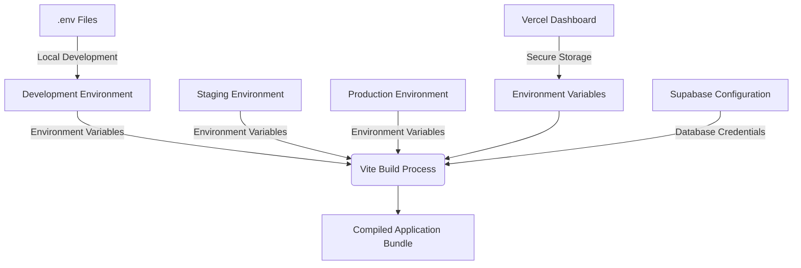
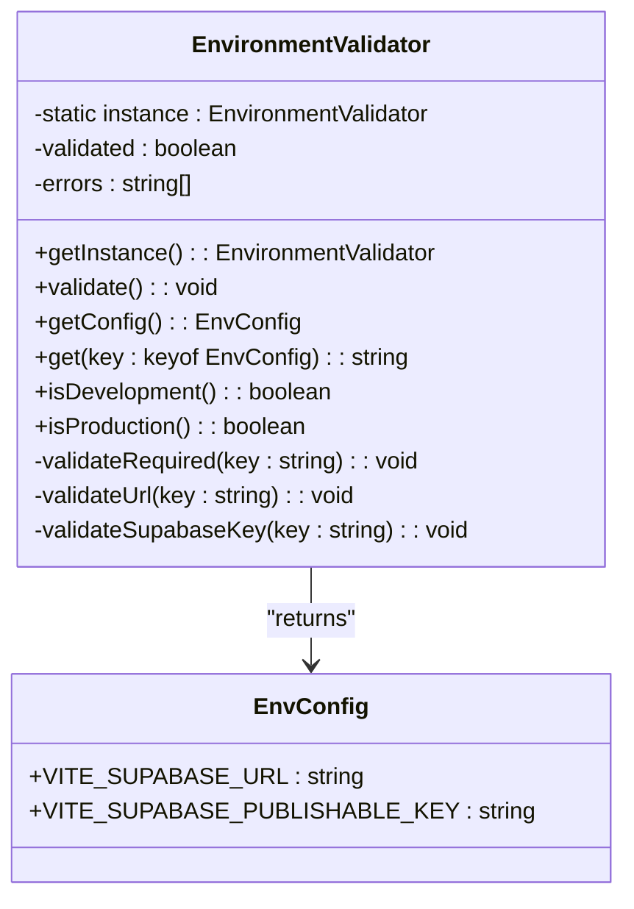
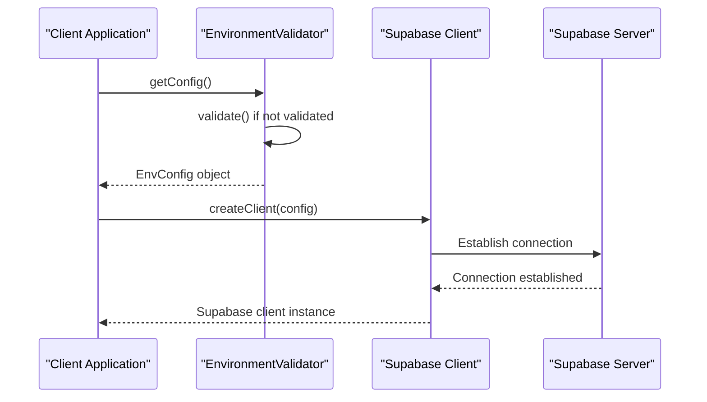
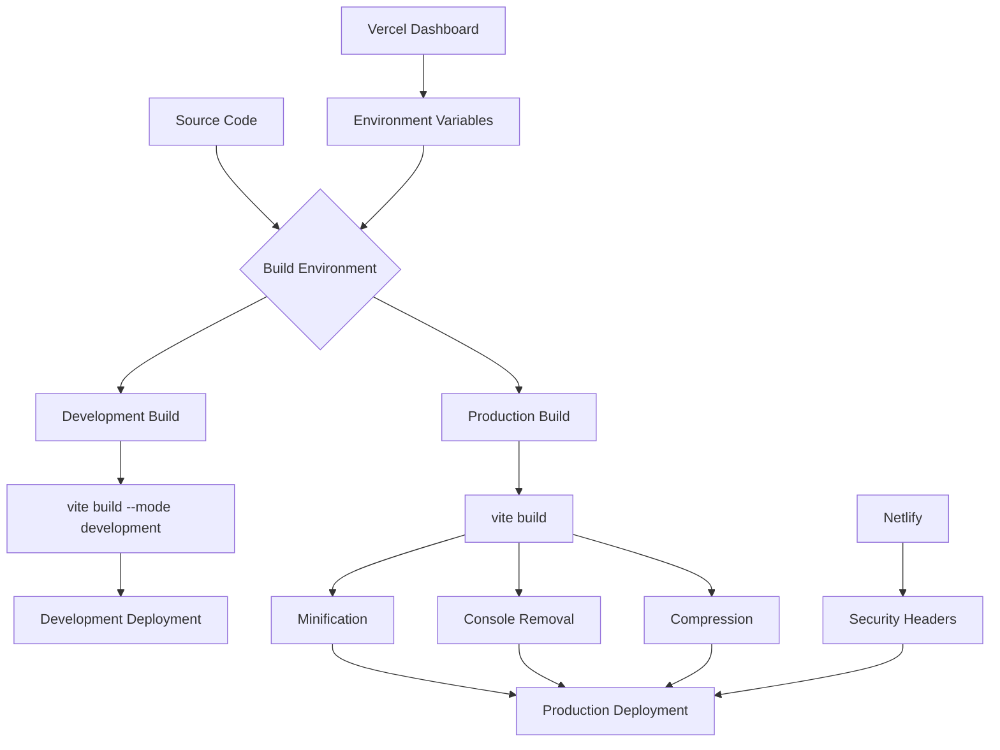
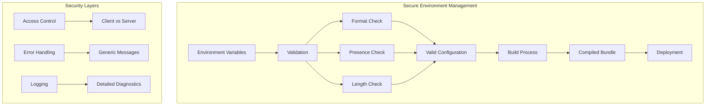

# Environment Security

<cite>
**Referenced Files in This Document**   
- [env-validator.ts](file://src/lib/env-validator.ts)
- [client.ts](file://src/integrations/supabase/client.ts)
- [vite.config.ts](file://vite.config.ts)
- [setup-database.js](file://scripts/setup-database.js)
- [ai-quote-generator/index.ts](file://supabase/functions/ai-quote-generator/index.ts)
- [netlify.toml](file://netlify.toml)
- [vercel.json](file://vercel.json)
</cite>

## Table of Contents
1. [Introduction](#introduction)
2. [Environment Management Overview](#environment-management-overview)
3. [Environment Validation System](#environment-validation-system)
4. [Supabase Integration and Security](#supabase-integration-and-security)
5. [Deployment Configuration](#deployment-configuration)
6. [Secure Handling of Sensitive Data](#secure-handling-of-sensitive-data)
7. [Environment-Specific Configuration](#environment-specific-configuration)
8. [Best Practices and Recommendations](#best-practices-and-recommendations)

## Introduction
This document provides comprehensive guidance on environment-level security in sleekapp-v100, focusing on the secure management of environment variables across development, staging, and production environments. The system leverages Vercel and Supabase configuration to ensure proper separation of concerns and protection of sensitive credentials. The documentation covers the implementation of the env-validator.ts utility that validates required environment variables at startup, preventing misconfigurations that could lead to security vulnerabilities. The content is designed to serve both beginners seeking conceptual understanding and experienced developers requiring technical implementation details.

## Environment Management Overview
The sleekapp-v100 application implements a robust environment management system that ensures secure handling of configuration variables across different deployment stages. The architecture follows the principle of environment separation, where each environment (development, staging, production) maintains its own set of configuration values while sharing a consistent structure. The system uses Vite's environment variable handling mechanism with the import.meta.env syntax, which allows for compile-time injection of environment variables into the application bundle. This approach prevents runtime exposure of sensitive data while maintaining flexibility across deployment environments.

The environment management system is designed to work seamlessly with Vercel's deployment platform, which provides built-in support for environment variables through its dashboard interface. This integration allows team members to manage sensitive credentials without exposing them in version control. The system also incorporates Supabase configuration, which requires specific environment variables for database connectivity and authentication. The combination of these technologies creates a secure environment management pipeline that protects sensitive information while enabling smooth deployment workflows.

**Diagram sources**
- [vite.config.ts](file://vite.config.ts#L79-L85)
- [env-validator.ts](file://src/lib/env-validator.ts#L7-L9)

**Section sources**
- [vite.config.ts](file://vite.config.ts#L1-L216)
- [env-validator.ts](file://src/lib/env-validator.ts#L1-L143)

## Environment Validation System
The env-validator.ts module implements a comprehensive environment validation system that ensures all required environment variables are present and correctly formatted before the application starts. This singleton class performs multiple validation checks on startup, including verification of required variables, URL format validation, and basic key format validation. The validation process is critical for preventing misconfigurations that could lead to security vulnerabilities or application failures in production environments.

The EnvironmentValidator class uses a multi-step validation approach. First, it checks for the presence of required environment variables such as VITE_SUPABASE_URL and VITE_SUPABASE_PUBLISHABLE_KEY. Then, it validates the URL format of the Supabase URL using JavaScript's built-in URL constructor. Finally, it performs a basic check on the Supabase publishable key format, ensuring it appears to be a valid JWT-like string by verifying minimum length requirements. If any validation fails, the system logs detailed error messages and throws an exception, preventing the application from starting with invalid configuration.

**Diagram sources**
- [env-validator.ts](file://src/lib/env-validator.ts#L11-L128)

**Section sources**
- [env-validator.ts](file://src/lib/env-validator.ts#L1-L143)

## Supabase Integration and Security
The application's integration with Supabase follows security best practices for handling database credentials and API keys. The client.ts file in the integrations/supabase directory demonstrates how the application securely accesses Supabase services by using the validated environment configuration. The integration imports the env validator instance and retrieves configuration values through its getConfig() method, ensuring that all environment variables have been validated before use.

The system distinguishes between different types of Supabase keys with varying permission levels. The VITE_SUPABASE_PUBLISHABLE_KEY is used in the client-side application for authentication and data access, while the SUPABASE_SERVICE_ROLE_KEY is reserved for server-side functions with elevated privileges. This separation of concerns prevents client-side code from accessing sensitive database operations that should only be performed server-side. The service role key is never exposed to the client-side application, eliminating the risk of unauthorized database access.

In server-side functions, such as those in the supabase/functions directory, the application uses Deno.env.get() to access environment variables securely. These functions implement additional validation to ensure required environment variables are present before executing sensitive operations. The error handling in these functions is designed to provide generic error messages to clients while logging detailed diagnostic information server-side, preventing information disclosure vulnerabilities.

**Diagram sources**
- [client.ts](file://src/integrations/supabase/client.ts#L1-L20)
- [env-validator.ts](file://src/lib/env-validator.ts#L94-L103)
- [ai-quote-generator/index.ts](file://supabase/functions/ai-quote-generator/index.ts#L228-L245)

**Section sources**
- [client.ts](file://src/integrations/supabase/client.ts#L1-L20)
- [ai-quote-generator/index.ts](file://supabase/functions/ai-quote-generator/index.ts#L228-L245)

## Deployment Configuration
The deployment configuration for sleekapp-v100 is managed through multiple files that work together to ensure secure and reliable deployments across different platforms. The vercel.json file contains routing configuration that directs all requests to the index.html file, enabling client-side routing for the single-page application. This simple configuration works in conjunction with Vercel's environment variable management system to provide a seamless deployment experience.

The netlify.toml file contains comprehensive security headers that enhance the application's security posture in production. These headers include X-Frame-Options to prevent clickjacking attacks, X-Content-Type-Options to prevent MIME type sniffing, and X-XSS-Protection to enable browser XSS protection. The file also configures caching policies for different asset types, ensuring optimal performance while maintaining security.

The vite.config.ts file plays a crucial role in the deployment process by defining environment-specific build configurations. It includes a define section that maps environment variables to their actual values during the build process, ensuring that sensitive credentials are properly injected without being exposed in the source code. The configuration also includes production-specific optimizations such as console log removal and bundle compression, which enhance both security and performance.

**Diagram sources**
- [vite.config.ts](file://vite.config.ts#L79-L85)
- [vercel.json](file://vercel.json#L1-L6)
- [netlify.toml](file://netlify.toml#L1-L123)

**Section sources**
- [vite.config.ts](file://vite.config.ts#L1-L216)
- [vercel.json](file://vercel.json#L1-L6)
- [netlify.toml](file://netlify.toml#L1-L123)

## Secure Handling of Sensitive Data
The application implements multiple layers of protection for sensitive data, particularly API keys, database connection strings, and third-party service credentials. The primary mechanism is the use of environment variables with proper naming conventions, where client-accessible variables are prefixed with VITE_ and server-only variables have no prefix. This convention ensures that only intended variables are exposed to the client-side application during the build process.

The env-validator.ts module provides an additional layer of security by validating the format and presence of environment variables before the application starts. This prevents common misconfiguration issues such as missing variables or incorrectly formatted URLs that could lead to security vulnerabilities. The validation process includes checks for minimum key length, which helps identify placeholder values that might have been accidentally committed to version control.

For server-side functions, the application uses Supabase's environment variable system through Deno.env.get(), which securely stores sensitive credentials like the SUPABASE_SERVICE_ROLE_KEY. These functions implement their own validation routines to ensure required environment variables are present before executing sensitive operations. The error handling is designed to provide generic error messages to clients while logging detailed diagnostic information server-side, preventing information disclosure vulnerabilities.

The system also addresses the common issue of accidental exposure of secrets in client-side bundles through proper .env file management and build-time injection. Environment variables are never stored in version control but are instead managed through the deployment platform's dashboard. During the build process, Vite injects the environment variables directly into the compiled code, eliminating the need to load them at runtime and reducing the attack surface.

**Diagram sources**
- [env-validator.ts](file://src/lib/env-validator.ts#L34-L43)
- [setup-database.js](file://scripts/setup-database.js#L15-L16)
- [ai-quote-generator/index.ts](file://supabase/functions/ai-quote-generator/index.ts#L228-L235)

**Section sources**
- [env-validator.ts](file://src/lib/env-validator.ts#L1-L143)
- [setup-database.js](file://scripts/setup-database.js#L1-L308)

## Environment-Specific Configuration
The application implements environment-specific configuration through a combination of Vite's mode system and conditional logic in the configuration files. The vite.config.ts file demonstrates this approach by using the mode parameter to apply different plugins and optimizations based on whether the build is for development or production. For example, the remove-console plugin is only applied in production builds to improve performance and security by removing debug statements.

The environment validation system also adapts its behavior based on the current environment. In production mode, the system automatically validates environment variables on import, ensuring that any configuration issues are caught immediately. In development mode, this automatic validation is disabled to provide a smoother development experience, though the validation can still be manually triggered when needed.

The system supports different deployment targets through configuration files like vercel.json and netlify.toml, which can be customized for specific environments. This allows the application to maintain consistent behavior across different hosting platforms while adapting to their specific requirements. The configuration also includes fallback values for certain environment variables, which are used during local development to simplify setup while ensuring that production deployments use the actual configured values.

This environment-specific configuration approach enables the application to maintain high security standards in production while providing flexibility and convenience during development. The system ensures that sensitive credentials are properly protected in production environments while allowing developers to work efficiently in local environments without compromising security.

**Section sources**
- [vite.config.ts](file://vite.config.ts#L11-L216)
- [env-validator.ts](file://src/lib/env-validator.ts#L133-L141)

## Best Practices and Recommendations
Based on the analysis of the environment security implementation in sleekapp-v100, several best practices and recommendations can be identified for secure environment management. First, always use environment variables for configuration rather than hardcoding values in source code. This practice ensures that sensitive credentials are not exposed in version control and can be easily changed between environments.

Second, implement comprehensive validation of environment variables at application startup. The env-validator.ts module demonstrates this principle by checking for required variables, validating their format, and preventing the application from starting with invalid configuration. This proactive approach helps catch configuration issues early and prevents security vulnerabilities caused by misconfiguration.

Third, follow the principle of least privilege when configuring environment variables. Use different keys with appropriate permission levels for client-side and server-side operations. The application correctly separates the VITE_SUPABASE_PUBLISHABLE_KEY (client-side) from the SUPABASE_SERVICE_ROLE_KEY (server-side), ensuring that client-side code cannot perform privileged operations.

Fourth, use proper naming conventions for environment variables to clearly indicate their purpose and scope. The VITE_ prefix convention used in this application clearly identifies variables that are exposed to the client-side application, making it easier to audit and manage sensitive data.

Finally, implement comprehensive error handling that provides generic error messages to clients while logging detailed diagnostic information server-side. This approach prevents information disclosure vulnerabilities while still enabling effective debugging and monitoring. The server-side functions in the supabase/functions directory demonstrate this practice by logging detailed error codes internally while returning generic error messages to clients.

**Section sources**
- [env-validator.ts](file://src/lib/env-validator.ts#L1-L143)
- [vite.config.ts](file://vite.config.ts#L79-L85)
- [ai-quote-generator/index.ts](file://supabase/functions/ai-quote-generator/index.ts#L228-L245)