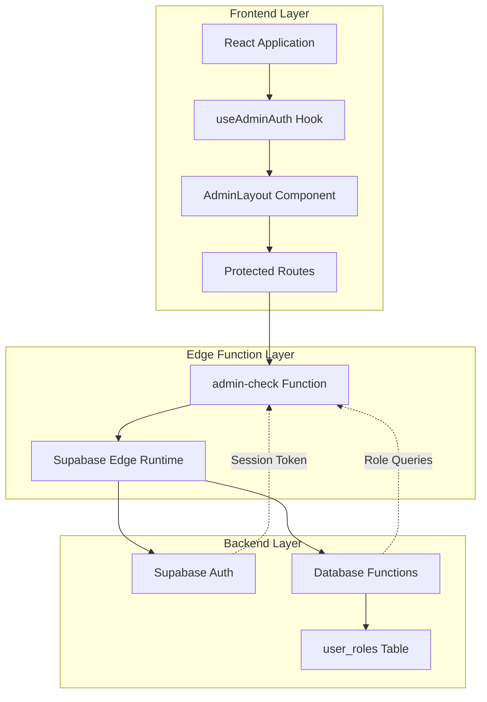
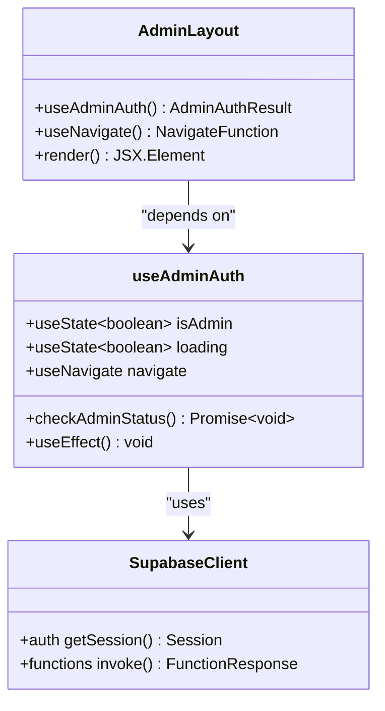
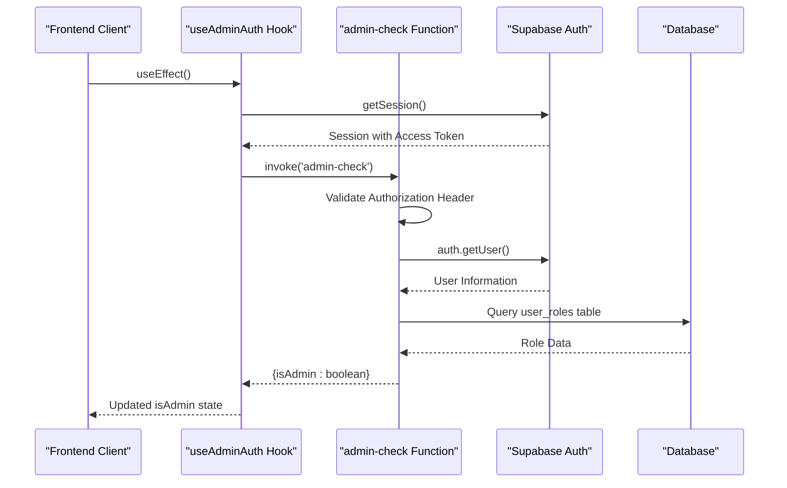
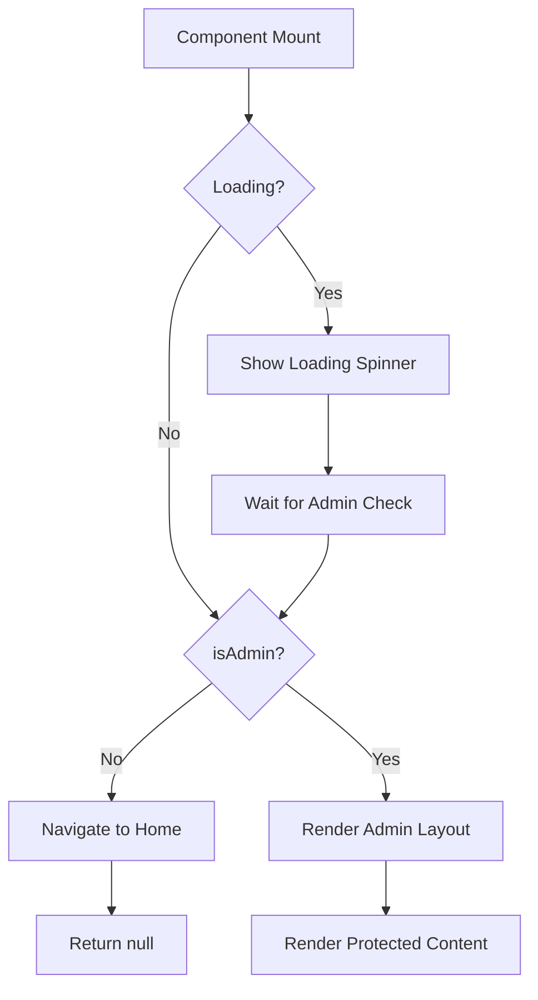
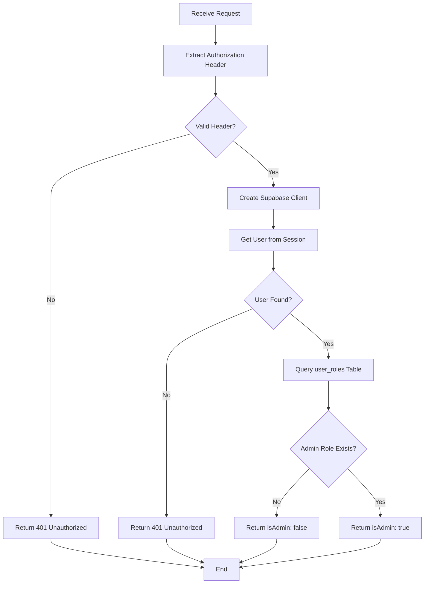
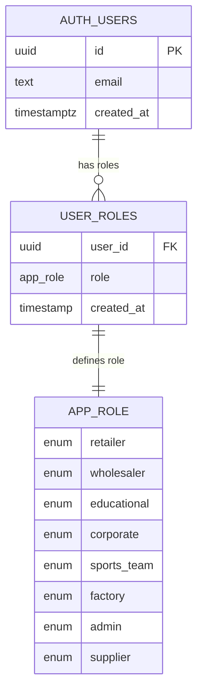
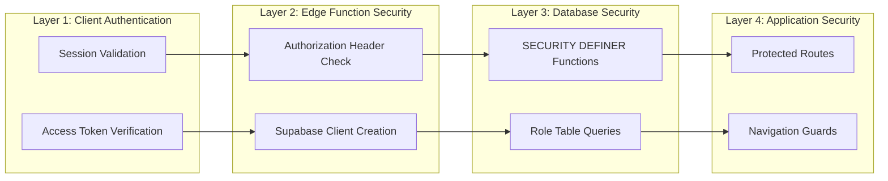
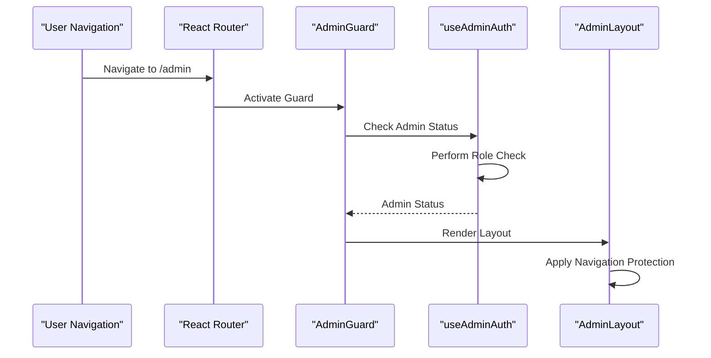
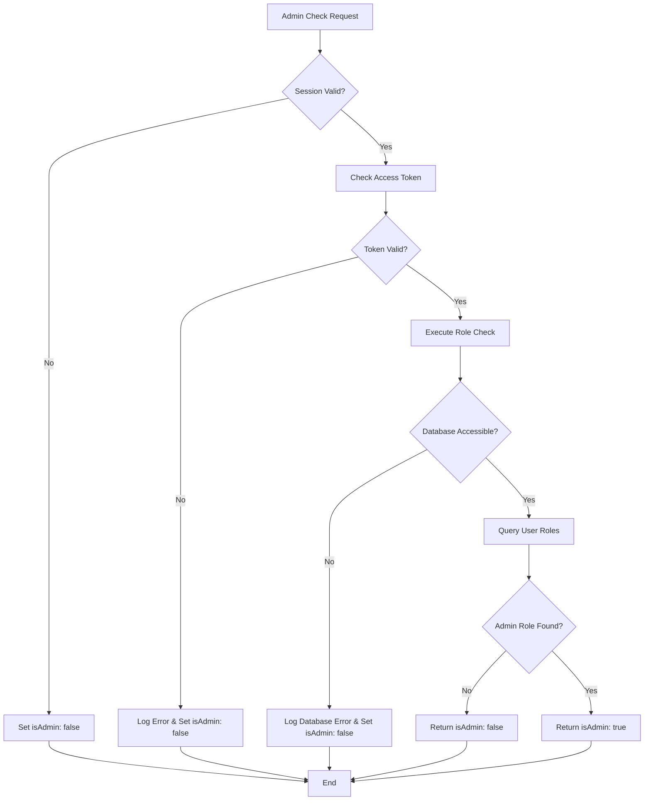

# Admin Role Verification System

<cite>
**Referenced Files in This Document**
- [useAdminAuth.ts](file://src/hooks/useAdminAuth.ts)
- [admin-check/index.ts](file://supabase/functions/admin-check/index.ts)
- [AdminLayout.tsx](file://src/pages/admin/AdminLayout.tsx)
- [AdminSidebar.tsx](file://src/components/AdminSidebar.tsx)
- [client.ts](file://src/integrations/supabase/client.ts)
- [has_role function](file://supabase/migrations/20251115150759_remix_migration_from_pg_dump.sql#L371-L381)
- [assign_admin_role function](file://supabase/migrations/20251115150759_remix_migration_from_pg_dump.sql#L110-L129)
- [bootstrap-admin/index.ts](file://supabase/functions/bootstrap-admin/index.ts)
- [useAdminAuth.test.ts](file://src/hooks/__tests__/useAdminAuth.test.ts)
</cite>

## Table of Contents
1. [Introduction](#introduction)
2. [System Architecture](#system-architecture)
3. [Core Components](#core-components)
4. [Frontend Implementation](#frontend-implementation)
5. [Backend Implementation](#backend-implementation)
6. [Database Schema](#database-schema)
7. [Security Context](#security-context)
8. [Integration Patterns](#integration-patterns)
9. [Error Handling and Edge Cases](#error-handling-and-edge-cases)
10. [Testing and Validation](#testing-and-validation)
11. [Best Practices](#best-practices)
12. [Troubleshooting Guide](#troubleshooting-guide)

## Introduction

The admin role verification system in sleekapp-v100 provides a robust, secure mechanism for authenticating and authorizing administrative users. Built on Supabase's edge functions and React hooks, this system ensures that only authorized administrators can access sensitive admin functionalities while maintaining strong security boundaries.

The system implements a multi-layered approach combining client-side role checking, server-side validation, and database-level security controls to prevent unauthorized access to administrative features.

## System Architecture

The admin role verification system follows a distributed architecture pattern with clear separation of concerns:

**Diagram sources**
- [useAdminAuth.ts](file://src/hooks/useAdminAuth.ts#L1-L46)
- [admin-check/index.ts](file://supabase/functions/admin-check/index.ts#L1-L74)
- [AdminLayout.tsx](file://src/pages/admin/AdminLayout.tsx#L1-L43)

## Core Components

### useAdminAuth Hook

The `useAdminAuth` hook serves as the primary interface for admin role verification in the frontend application. It provides a reactive way to check and manage admin status with comprehensive error handling.

**Diagram sources**
- [useAdminAuth.ts](file://src/hooks/useAdminAuth.ts#L5-L46)
- [AdminLayout.tsx](file://src/pages/admin/AdminLayout.tsx#L9-L43)

**Section sources**
- [useAdminAuth.ts](file://src/hooks/useAdminAuth.ts#L1-L46)

### admin-check Edge Function

The `admin-check` edge function provides server-side validation of admin privileges, ensuring that role verification occurs in a secure, isolated environment.

**Diagram sources**
- [useAdminAuth.ts](file://src/hooks/useAdminAuth.ts#L14-L42)
- [admin-check/index.ts](file://supabase/functions/admin-check/index.ts#L14-L73)

**Section sources**
- [admin-check/index.ts](file://supabase/functions/admin-check/index.ts#L1-L74)

## Frontend Implementation

### Hook Initialization and Lifecycle

The `useAdminAuth` hook implements a clean initialization pattern using React's `useEffect` hook to perform admin status checks when the component mounts.

Key implementation details:
- **Automatic Initialization**: The hook automatically triggers admin status checks when mounted
- **Loading State Management**: Provides clear feedback during role verification
- **Error Recovery**: Gracefully handles network failures and authentication issues
- **Manual Re-check Capability**: Allows components to manually trigger role verification

### Navigation Protection Pattern

The AdminLayout component demonstrates the navigation protection pattern that prevents unauthorized access to admin routes:

**Diagram sources**
- [AdminLayout.tsx](file://src/pages/admin/AdminLayout.tsx#L13-L24)

**Section sources**
- [AdminLayout.tsx](file://src/pages/admin/AdminLayout.tsx#L1-L43)
- [useAdminAuth.ts](file://src/hooks/useAdminAuth.ts#L10-L12)

### Access Token Handling

The system securely passes access tokens through HTTP headers using the Authorization bearer token pattern:

| Header Field | Value Format | Purpose |
|--------------|--------------|---------|
| Authorization | `Bearer <access_token>` | Authenticates the request to the edge function |
| Content-Type | `application/json` | Specifies request payload format |
| CORS Headers | Various | Enables cross-origin requests |

**Section sources**
- [useAdminAuth.ts](file://src/hooks/useAdminAuth.ts#L25-L30)

## Backend Implementation

### Database Role Checking

The admin-check function implements a secure database query to verify admin privileges:

**Diagram sources**
- [admin-check/index.ts](file://supabase/functions/admin-check/index.ts#L14-L73)

**Section sources**
- [admin-check/index.ts](file://supabase/functions/admin-check/index.ts#L44-L61)

### Security Context with SECURITY DEFINER

The system leverages PostgreSQL's SECURITY DEFINER feature to ensure that role checks execute with elevated privileges:

| Security Feature | Implementation | Purpose |
|------------------|----------------|---------|
| SECURITY DEFINER | Database functions | Execute with database owner privileges |
| Session Validation | Supabase auth.getUser() | Verify user authenticity |
| Role Table Query | user_roles table | Check admin membership |
| CORS Headers | Edge function | Enable browser communication |

**Section sources**
- [admin-check/index.ts](file://supabase/functions/admin-check/index.ts#L1-L74)

## Database Schema

### Role Management Structure

The system uses a normalized database schema for role management:

**Diagram sources**
- [20251115150759_remix_migration_from_pg_dump.sql](file://supabase/migrations/20251115150759_remix_migration_from_pg_dump.sql#L27-L40)

### Role Validation Functions

The database includes several role validation functions that support the admin verification system:

| Function | Purpose | SECURITY DEFINER |
|----------|---------|------------------|
| `has_role()` | Check single role membership | Yes |
| `has_any_role()` | Check multiple role membership | Yes |
| `assign_admin_role()` | Secure admin assignment | Yes |
| `assign_user_role()` | General role assignment | Yes |

**Section sources**
- [20251115150759_remix_migration_from_pg_dump.sql](file://supabase/migrations/20251115150759_remix_migration_from_pg_dump.sql#L371-L381)
- [20251115150759_remix_migration_from_pg_dump.sql](file://supabase/migrations/20251115150759_remix_migration_from_pg_dump.sql#L351-L366)

## Security Context

### Multi-Layer Security Model

The admin role verification system implements defense-in-depth security principles:

**Diagram sources**
- [admin-check/index.ts](file://supabase/functions/admin-check/index.ts#L14-L73)
- [AdminLayout.tsx](file://src/pages/admin/AdminLayout.tsx#L10-L24)

### Bootstrap Administration

The system includes a secure bootstrap mechanism for initial admin setup:

**Section sources**
- [bootstrap-admin/index.ts](file://supabase/functions/bootstrap-admin/index.ts#L71-L177)

## Integration Patterns

### Protected Route Architecture

The system integrates with React Router to provide automatic route protection:

**Diagram sources**
- [AdminLayout.tsx](file://src/pages/admin/AdminLayout.tsx#L9-L43)

### Sidebar Navigation Integration

The AdminSidebar component integrates with the admin role verification system to show/hide admin-specific navigation items:

**Section sources**
- [AdminSidebar.tsx](file://src/components/AdminSidebar.tsx#L1-L69)

## Error Handling and Edge Cases

### Common Error Scenarios

The system handles various error conditions gracefully:

| Error Type | Handling Strategy | Recovery Action |
|------------|-------------------|-----------------|
| Network Failure | Catch and log errors | Set isAdmin: false |
| Session Expiration | Validate session state | Clear admin status |
| Database Errors | Graceful degradation | Return false for admin check |
| Invalid Tokens | Authorization failure | Redirect to login |
| Role Table Issues | Error logging | Fallback to non-admin access |

### Session Invalidation Handling

The system provides robust handling for session-related issues:

**Diagram sources**
- [useAdminAuth.ts](file://src/hooks/useAdminAuth.ts#L14-L42)

**Section sources**
- [useAdminAuth.ts](file://src/hooks/useAdminAuth.ts#L31-L42)
- [admin-check/index.ts](file://supabase/functions/admin-check/index.ts#L52-L73)

## Testing and Validation

### Comprehensive Test Coverage

The system includes extensive testing for various scenarios:

**Section sources**
- [useAdminAuth.test.ts](file://src/hooks/__tests__/useAdminAuth.test.ts#L1-L380)

### Test Categories

| Test Category | Coverage | Purpose |
|---------------|----------|---------|
| Successful Admin Check | Valid admin user | Verify positive role detection |
| Non-Admin User | Regular user | Confirm role restriction |
| No Session | Anonymous user | Test guest access handling |
| Network Errors | Function invocation failure | Validate error recovery |
| Session Validation | Expired/expired tokens | Test session expiration |
| Malformed Responses | Unexpected data format | Ensure graceful parsing |

## Best Practices

### Role-Based Access Control (RBAC) Implementation

The system follows RBAC best practices:

1. **Principle of Least Privilege**: Only grant admin access when absolutely necessary
2. **Separation of Concerns**: Keep role logic separate from business logic
3. **Defense in Depth**: Multiple layers of security validation
4. **Audit Logging**: Track all admin actions for accountability
5. **Secure Defaults**: Assume denial until proven otherwise

### Performance Considerations

- **Caching Strategy**: Consider implementing client-side caching for role status
- **Network Efficiency**: Minimize redundant role checks
- **Database Optimization**: Use indexed queries on user_id and role columns
- **Edge Function Caching**: Leverage Supabase edge function caching capabilities

### Security Recommendations

1. **Token Rotation**: Implement regular access token rotation
2. **Rate Limiting**: Add rate limiting to admin-check endpoint
3. **IP Whitelisting**: Consider IP-based restrictions for admin access
4. **Multi-Factor Authentication**: Implement MFA for admin accounts
5. **Audit Trails**: Maintain comprehensive logs of admin activities

## Troubleshooting Guide

### Common Issues and Solutions

#### Issue: Admin Check Always Returns False

**Symptoms**: Users are never recognized as admins despite having admin roles

**Possible Causes**:
- Incorrect role assignment in database
- Session token issues
- Edge function configuration problems

**Solutions**:
1. Verify role assignment: `SELECT * FROM user_roles WHERE user_id = '<user-id>' AND role = 'admin'`
2. Check session validity: Inspect browser cookies and local storage
3. Review edge function logs: Monitor Supabase edge function execution

#### Issue: Role Checks Fail with Network Errors

**Symptoms**: Intermittent role verification failures

**Possible Causes**:
- Network connectivity issues
- Supabase service outages
- Edge function timeout

**Solutions**:
1. Implement retry logic with exponential backoff
2. Add circuit breaker pattern for edge function calls
3. Monitor Supabase service status

#### Issue: Admin Routes Still Accessible Without Login

**Symptoms**: Non-authenticated users can access admin pages

**Possible Causes**:
- Client-side validation bypass
- Race condition in route protection
- Incorrect hook implementation

**Solutions**:
1. Verify AdminLayout component implementation
2. Check for proper loading state handling
3. Ensure server-side validation is also implemented

### Debugging Tools and Techniques

| Tool | Purpose | Usage |
|------|---------|-------|
| Browser DevTools | Monitor network requests | Check admin-check function calls |
| Supabase Console | Database query monitoring | Verify role table queries |
| Edge Function Logs | Function execution tracing | Debug edge function issues |
| React Developer Tools | Component state inspection | Verify hook state updates |

**Section sources**
- [useAdminAuth.ts](file://src/hooks/useAdminAuth.ts#L37-L42)
- [admin-check/index.ts](file://supabase/functions/admin-check/index.ts#L67-L73)