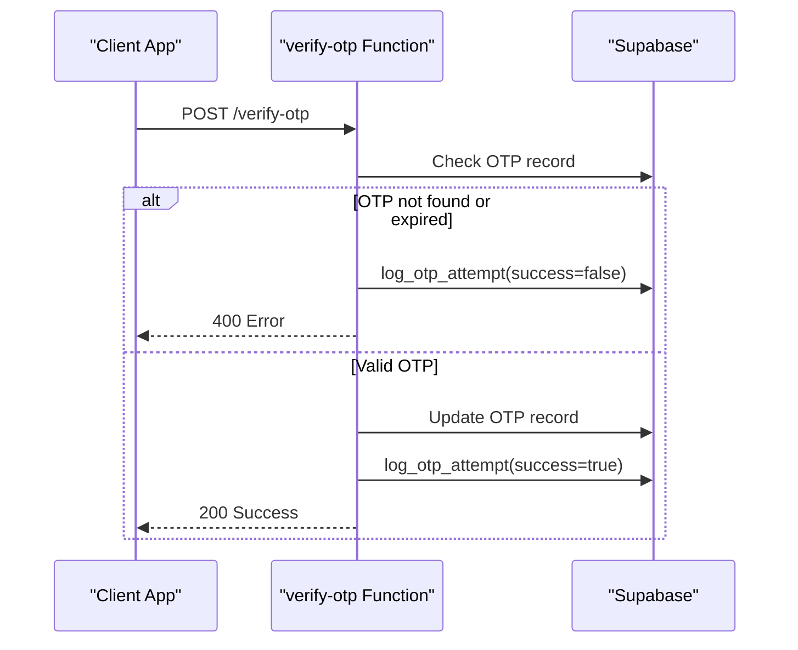
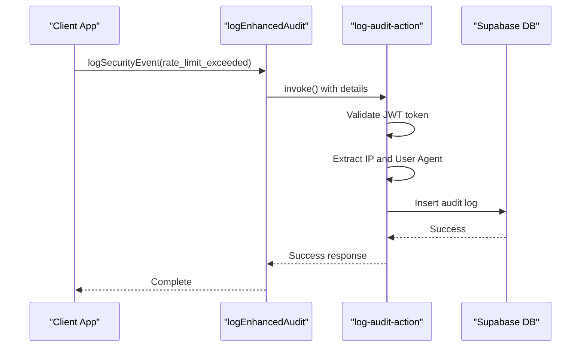
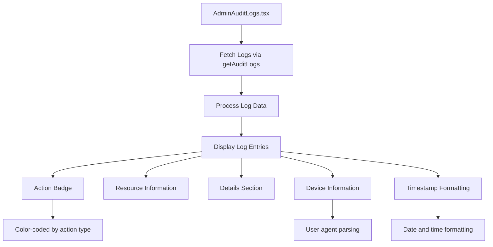

# Audit Logging and Monitoring

<cite>
**Referenced Files in This Document**   
- [verify-otp/index.ts](file://supabase/functions/verify-otp/index.ts)
- [log-audit-action/index.ts](file://supabase/functions/log-audit-action/index.ts)
- [AdminAuditLogs.tsx](file://src/pages/AdminAuditLogs.tsx)
- [auditLog.ts](file://src/lib/auditLog.ts)
- [enhancedAuditLog.ts](file://src/lib/enhancedAuditLog.ts)
- [TABLES_ONLY.sql](file://supabase/TABLES_ONLY.sql)
- [COMPLETE_SETUP.sql](file://supabase/COMPLETE_SETUP.sql)
</cite>

## Table of Contents
1. [Introduction](#introduction)
2. [OTP Attempt Logging](#otp-attempt-logging)
3. [Enhanced Audit Logging System](#enhanced-audit-logging-system)
4. [Audit Log Storage and Schema](#audit-log-storage-and-schema)
5. [Admin Audit Logs Interface](#admin-audit-logs-interface)
6. [Error Handling and Security Events](#error-handling-and-security-events)
7. [Log Filtering and Querying](#log-filtering-and-querying)
8. [Rate Limiting and Monitoring](#rate-limiting-and-monitoring)
9. [Compliance and Retention](#compliance-and-retention)
10. [Troubleshooting Guide](#troubleshooting-guide)

## Introduction
The audit logging and monitoring system in sleekapp-v100 provides comprehensive security observability for OTP flows and other critical operations. This documentation details the implementation of audit logging for all OTP attempts, integration with the enhanced audit logging system for security events, storage mechanisms, and administrative interfaces for monitoring and analysis.

**Section sources**
- [verify-otp/index.ts](file://supabase/functions/verify-otp/index.ts#L1-L356)

## OTP Attempt Logging
The system implements detailed audit logging for all OTP verification attempts through the `log_otp_attempt` RPC function. This logging occurs in the `verify-otp` edge function, which captures essential information for each OTP attempt.

When a user attempts to verify an OTP, the system logs the identifier (phone number or email), identifier type, success status, and IP address. The logging occurs for both successful and failed attempts, providing a complete audit trail. The IP address is captured from the request headers using `x-forwarded-for` or `x-real-ip`.

For phone OTP verification, the system logs attempts when:
- Invalid or expired codes are provided
- Database update errors occur
- Verification is successful

For email OTP verification, similar logging occurs for:
- Expired verification codes
- Maximum attempt limits reached (5 attempts per OTP)
- Invalid codes
- Successful verification

The `log_otp_attempt` function is implemented as a PostgreSQL function that inserts records into the `otp_verification_attempts` table, capturing all relevant details for security analysis and monitoring.

**Diagram sources **
- [verify-otp/index.ts](file://supabase/functions/verify-otp/index.ts#L1-L356)

**Section sources**
- [verify-otp/index.ts](file://supabase/functions/verify-otp/index.ts#L1-L356)
- [COMPLETE_SETUP.sql](file://supabase/COMPLETE_SETUP.sql#L494-L495)

## Enhanced Audit Logging System
The enhanced audit logging system provides comprehensive security event tracking through the `logEnhancedAudit` utility function. This system is designed to capture security-critical events with additional context and severity levels.

The `logEnhancedAudit` function accepts parameters including action, resource type, resource ID, details, and severity level (info, warning, error, or critical). It uses the `log-audit-action` edge function to securely log events with server-side validation.

For security events like `rate_limit_exceeded`, the system uses the `logSecurityEvent` wrapper function, which automatically sets the severity to 'critical' and the resource type to 'system'. This ensures that security-critical events are properly prioritized and visible in monitoring systems.

The enhanced audit logging system captures additional context such as:
- Severity level for prioritization
- Timestamp in ISO format
- User agent information
- Full IP address (captured server-side)
- JWT-validated user ID

The system uses edge functions to ensure that IP addresses are captured reliably from request headers, avoiding the limitations of client-side IP detection which can be affected by proxies and VPNs.

**Diagram sources **
- [enhancedAuditLog.ts](file://src/lib/enhancedAuditLog.ts#L101-L137)
- [log-audit-action/index.ts](file://supabase/functions/log-audit-action/index.ts#L1-L97)

**Section sources**
- [enhancedAuditLog.ts](file://src/lib/enhancedAuditLog.ts#L1-L229)
- [log-audit-action/index.ts](file://supabase/functions/log-audit-action/index.ts#L1-L97)

## Audit Log Storage and Schema
Audit logs are stored in the `admin_audit_logs` table with a comprehensive schema designed for security and compliance. The table captures detailed information for each audit event, enabling thorough analysis and investigation.

The `admin_audit_logs` table schema includes the following columns:
- `id`: UUID primary key
- `admin_id`: UUID reference to the user who performed the action
- `action`: Text describing the action performed
- `resource_type`: Text indicating the type of resource affected
- `resource_id`: UUID reference to the specific resource
- `details`: JSONB field for additional context and metadata
- `ip_address`: Text field storing the full IP address
- `user_agent`: Text field storing browser/device information
- `created_at`: Timestamp with time zone for event time

The table is designed to support efficient querying and filtering, with indexes on key fields like `created_at`, `action`, and `admin_id`. The JSONB `details` column allows for flexible storage of additional context, including severity levels for security events.

The system also maintains the `otp_verification_attempts` table specifically for OTP-related events, with fields for identifier, identifier type, success status, and IP address. This separation allows for specialized analysis of authentication attempts while maintaining the integrity of the main audit log.

**Section sources**
- [TABLES_ONLY.sql](file://supabase/TABLES_ONLY.sql#L65-L84)
- [COMPLETE_SETUP.sql](file://supabase/COMPLETE_SETUP.sql#L756-L775)

## Admin Audit Logs Interface
The AdminAuditLogs.tsx interface provides administrators with a comprehensive view of all audit logs through a user-friendly dashboard. The interface displays logs with device information and formatted timestamps for easy analysis.

The interface fetches logs using the `getAuditLogs` function, which retrieves records from the `admin_audit_logs` table. Logs are displayed in reverse chronological order, with the most recent events first. Each log entry shows:
- Action type with color-coded badges
- Resource type and ID
- Additional details when available
- Device information from user agent
- Formatted timestamp (date and time)

The interface includes visual indicators for different action types, using color-coded badges to distinguish between created, updated, deleted, published, and unpublished actions. For security events, critical severity is highlighted with appropriate visual cues.

Device information is extracted from the user agent string and displayed in a truncated format to maintain readability while providing sufficient information for analysis. Timestamps are formatted using date-fns to show the date in "MMM dd, yyyy" format and time in "HH:mm:ss" format.

**Diagram sources **
- [AdminAuditLogs.tsx](file://src/pages/AdminAuditLogs.tsx#L1-L154)
- [auditLog.ts](file://src/lib/auditLog.ts#L75-L88)

**Section sources**
- [AdminAuditLogs.tsx](file://src/pages/AdminAuditLogs.tsx#L1-L154)
- [auditLog.ts](file://src/lib/auditLog.ts#L75-L88)

## Error Handling and Security Events
The audit logging system implements robust error handling in the `log-audit-action` edge function to ensure reliable logging even during failures. The function includes comprehensive error handling for various failure scenarios.

In the `log-audit-action` function, errors are handled at multiple levels:
- Authorization errors (missing or invalid JWT tokens)
- Database insertion errors
- Network and runtime errors

When an error occurs, the function logs the error details and returns appropriate HTTP status codes:
- 401 for unauthorized access
- 400 for bad requests
- 500 for server errors

For security events like `rate_limit_exceeded`, the system uses the enhanced audit logging system to capture additional context. The `logSecurityEvent` function automatically includes severity level, timestamp, and other relevant details in the log entry.

The error handling system also includes client-side error logging through the `logError` function, which captures errors and context for debugging purposes. This ensures that even if audit logging fails, the failure itself is recorded for investigation.

**Section sources**
- [log-audit-action/index.ts](file://supabase/functions/log-audit-action/index.ts#L1-L97)
- [enhancedAuditLog.ts](file://src/lib/enhancedAuditLog.ts#L4-L6)

## Log Filtering and Querying
The system provides robust filtering capabilities through the `getEnhancedAuditLogs` function, allowing administrators to query logs based on various criteria. This enables targeted analysis of specific events or time periods.

The `getEnhancedAuditLogs` function supports filtering by:
- Action type
- Resource type
- User ID
- Date range (start and end dates)
- Severity level
- Result limit

The function constructs a Supabase query with appropriate filters and returns the results in descending order by creation time. For severity-based filtering, the function uses the `contains` operator to search within the JSONB `details` field.

The filtering system is designed to be efficient, with proper indexing on the database to support fast queries even with large volumes of log data. The function includes error handling to gracefully handle query failures and return empty arrays when appropriate.

Administrators can use these filtering capabilities to investigate specific security events, monitor user activity, or analyze system behavior during specific time periods.

**Section sources**
- [enhancedAuditLog.ts](file://src/lib/enhancedAuditLog.ts#L180-L228)

## Rate Limiting and Monitoring
The system implements rate limiting for OTP attempts to prevent abuse and brute force attacks. The rate limiting system is integrated with the audit logging system to provide comprehensive monitoring of potential security threats.

The `check_otp_rate_limit` function enforces a limit of 3 attempts per hour per identifier (phone or email). When this limit is exceeded, the system logs a `rate_limit_exceeded` event with critical severity through the enhanced audit logging system.

The rate limiting system uses the `otp_rate_limits` table to track request counts within time windows. This allows for accurate enforcement of rate limits while providing data for monitoring and analysis.

The system includes a `RateLimitMonitoringDashboard` component that provides real-time monitoring of rate limit usage across various endpoints. The dashboard displays metrics including:
- Total requests
- Unique identifiers
- Maximum requests per identifier
- Average requests per identifier
- High-usage identifiers

This monitoring capability enables administrators to detect and respond to potential abuse patterns proactively.

**Section sources**
- [verify-otp/index.ts](file://supabase/functions/verify-otp/index.ts#L67-L87)
- [TABLES_ONLY.sql](file://supabase/TABLES_ONLY.sql#L479-L486)
- [COMPLETE_SETUP.sql](file://supabase/COMPLETE_SETUP.sql#L245-L269)
- [RateLimitMonitoringDashboard.tsx](file://src/components/admin/RateLimitMonitoringDashboard.tsx#L1-L204)

## Compliance and Retention
The audit logging system is designed to meet compliance requirements for security and data protection. The system captures all necessary information for regulatory compliance, including user actions, timestamps, IP addresses, and device information.

Log retention policies are implemented to balance compliance requirements with storage efficiency. While specific retention periods are not defined in the code, the system architecture supports configurable retention through database policies or external archiving systems.

The system ensures the integrity of audit logs by:
- Using server-side logging for critical events
- Capturing IP addresses from trusted headers
- Validating user identities through JWT tokens
- Storing logs in a dedicated, secured table

For compliance with privacy regulations, the system captures only necessary information and provides mechanisms for data subject access requests through the administrative interface.

**Section sources**
- [log-audit-action/index.ts](file://supabase/functions/log-audit-action/index.ts#L1-L97)
- [enhancedAuditLog.ts](file://src/lib/enhancedAuditLog.ts#L1-L229)

## Troubleshooting Guide
When troubleshooting issues with the audit logging system, consider the following common scenarios:

**Missing audit logs**: Verify that the edge functions are properly deployed and accessible. Check the function logs for errors during execution.

**Incomplete IP addresses**: Ensure that the `log-audit-action` edge function is used for security events, as it captures IP addresses from request headers server-side.

**Rate limit issues**: Check the `otp_rate_limits` table for existing rate limit records and verify the time window calculations.

**Permission errors**: Ensure that the service role key is properly configured and that the function has appropriate permissions to write to the audit log table.

**Performance issues**: Monitor the database performance and consider adding indexes on frequently queried fields if log volume is high.

For security event monitoring, regularly review logs for `rate_limit_exceeded` and other critical severity events to identify potential abuse patterns.

**Section sources**
- [log-audit-action/index.ts](file://supabase/functions/log-audit-action/index.ts#L1-L97)
- [verify-otp/index.ts](file://supabase/functions/verify-otp/index.ts#L1-L356)
- [enhancedAuditLog.ts](file://src/lib/enhancedAuditLog.ts#L1-L229)