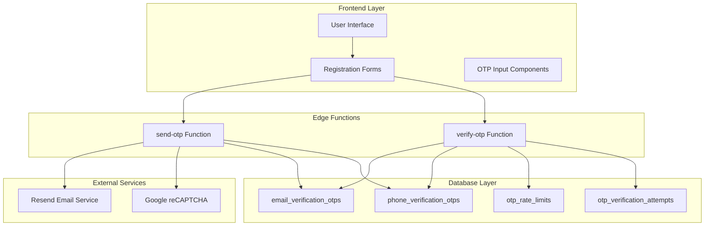
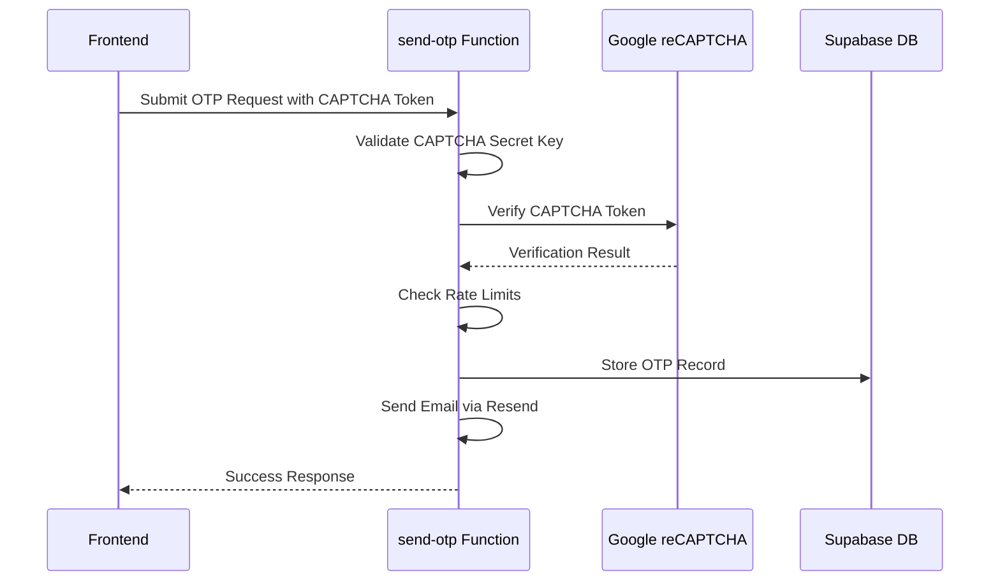
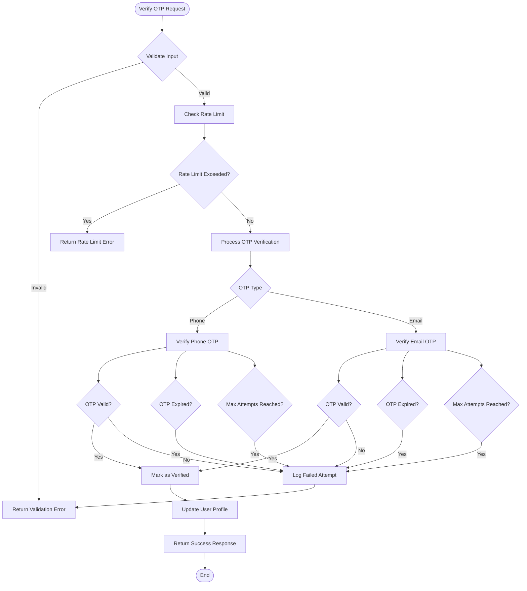
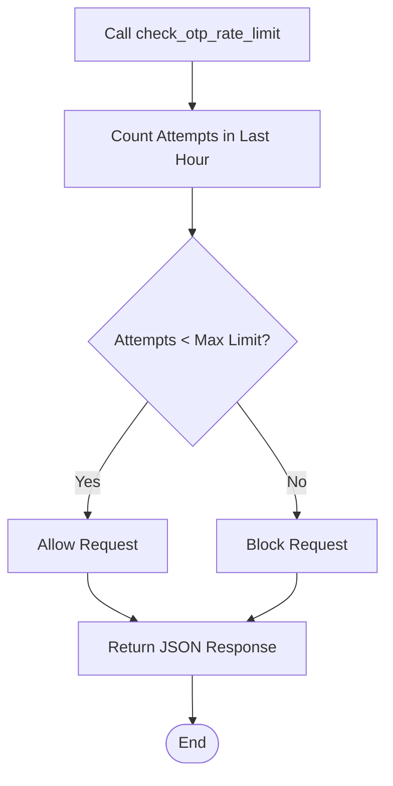
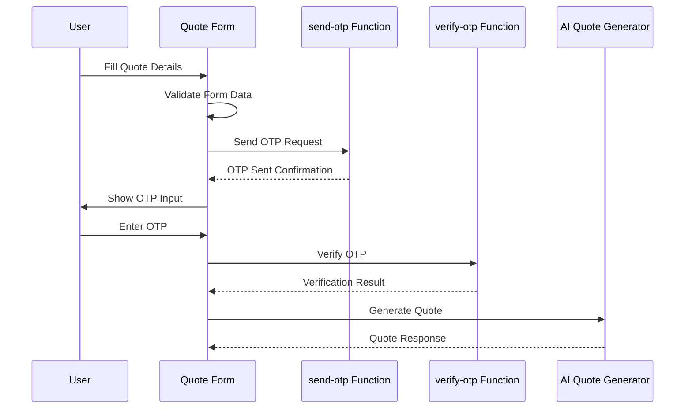

# OTP Authentication System

<cite>
**Referenced Files in This Document**
- [send-otp/index.ts](file://supabase/functions/send-otp/index.ts)
- [verify-otp/index.ts](file://supabase/functions/verify-otp/index.ts)
- [AIQuoteGeneratorWithOTP.tsx](file://src/components/AIQuoteGeneratorWithOTP.tsx)
- [JoinSupplier.tsx](file://src/pages/JoinSupplier.tsx)
- [log_otp_attempt.sql](file://supabase/migrations/20251115150759_remix_migration_from_pg_dump.sql)
- [check_otp_rate_limit.sql](file://supabase/migrations/20251115150759_remix_migration_from_pg_dump.sql)
- [email_verification_otps.sql](file://supabase/migrations/20251115150759_remix_migration_from_pg_dump.sql)
- [phone_verification_otps.sql](file://supabase/migrations/20251115150759_remix_migration_from_pg_dump.sql)
- [otp_rate_limits.sql](file://supabase/migrations/20251115150759_remix_migration_from_pg_dump.sql)
- [otp_verification_attempts.sql](file://supabase/migrations/20251115150759_remix_migration_from_pg_dump.sql)
</cite>

## Table of Contents
1. [Introduction](#introduction)
2. [System Architecture](#system-architecture)
3. [OTP Generation and Storage](#otp-generation-and-storage)
4. [Send OTP Function](#send-otp-function)
5. [Verify OTP Function](#verify-otp-function)
6. [Rate Limiting and Security](#rate-limiting-and-security)
7. [Frontend Integration](#frontend-integration)
8. [Database Schema](#database-schema)
9. [Security Features](#security-features)
10. [Common Issues and Debugging](#common-issues-and-debugging)
11. [Best Practices](#best-practices)

## Introduction

The OTP (One-Time Password) authentication system in sleekapp-v100 provides secure verification capabilities for three distinct use cases: phone verification, email quote requests, and supplier registrations. This comprehensive system implements robust security measures including rate limiting, brute force protection, email validation, and anti-bot measures using CAPTCHA integration.

The system supports three OTP types:
- **phone**: For mobile phone number verification
- **email-quote**: For email-based quote requests with daily limits
- **email-supplier**: For supplier registration with CAPTCHA protection

## System Architecture

The OTP authentication system follows a serverless architecture with Supabase Edge Functions handling the core authentication logic. The system integrates with external services for email delivery and CAPTCHA verification.



**Diagram sources**
- [send-otp/index.ts](file://supabase/functions/send-otp/index.ts#L1-L489)
- [verify-otp/index.ts](file://supabase/functions/verify-otp/index.ts#L1-L356)

## OTP Generation and Storage

### OTP Generation Process

The system generates 6-digit random OTP codes using JavaScript's `Math.random()` function combined with mathematical operations to ensure proper digit distribution.

```mermaid
flowchart TD
Start([OTP Generation Request]) --> ValidateType{Validate OTP Type}
ValidateType --> |Valid| GenerateOTP[Generate 6-Digit Random Code]
GenerateOTP --> CalculateExpiry[Calculate Expiration (10 Minutes)]
CalculateExpiry --> StoreOTP[Store in Database]
StoreOTP --> CheckType{Check OTP Type}
CheckType --> |Phone| SendSMS[Send via SMS Service]
CheckType --> |Email| SendEmail[Send via Email Service]
SendEmail --> TrackDelivery[Track Email Delivery Status]
SendSMS --> Success[Return Success Response]
TrackDelivery --> Success
Success --> End([End])
```

**Diagram sources**
- [send-otp/index.ts](file://supabase/functions/send-otp/index.ts#L224-L248)
- [send-otp/index.ts](file://supabase/functions/send-otp/index.ts#L344-L361)

### Storage Mechanisms

The system maintains separate tables for different OTP types:

| Table | Purpose | Storage Duration | Key Fields |
|-------|---------|------------------|------------|
| `phone_verification_otps` | Mobile phone verification | 10 minutes | phone, otp, expires_at, verified |
| `email_verification_otps` | Email-based verification | 10 minutes | email, otp, expires_at, verified, attempt_count, delivery_status |

**Section sources**
- [email_verification_otps.sql](file://supabase/migrations/20251115150759_remix_migration_from_pg_dump.sql#L1077-L1090)
- [phone_verification_otps.sql](file://supabase/migrations/20251115150759_remix_migration_from_pg_dump.sql#L1348-L1365)

## Send OTP Function

The `send-otp` function handles the generation and delivery of verification codes across all three OTP types.

### Core Implementation Features

#### Type-Specific Processing

The function implements specialized logic for each OTP type:

**Phone OTP Processing:**
- Validates phone number format
- Implements 5-minute rate limiting
- Stores phone number masking for privacy
- Logs successful generation events

**Email OTP Processing:**
- Comprehensive email validation with regex
- Disposable email domain filtering
- Sanitization against header injection attacks
- Daily quote limits for email-quote type
- Supplier-specific duplicate checking

#### CAPTCHA Integration

For supplier registrations, the system integrates Google reCAPTCHA v3 for bot protection:



**Diagram sources**
- [send-otp/index.ts](file://supabase/functions/send-otp/index.ts#L154-L187)

#### Email Delivery with Retry Logic

The system implements robust email delivery with exponential backoff retry logic:

**Section sources**
- [send-otp/index.ts](file://supabase/functions/send-otp/index.ts#L104-L129)
- [send-otp/index.ts](file://supabase/functions/send-otp/index.ts#L370-L478)

## Verify OTP Function

The `verify-otp` function provides comprehensive verification logic with multiple security layers.

### Verification Workflow



**Diagram sources**
- [verify-otp/index.ts](file://supabase/functions/verify-otp/index.ts#L26-L356)

### Security Measures

#### Brute Force Protection

The system implements multiple layers of brute force protection:

1. **Rate Limiting**: 3 attempts per hour per identifier
2. **Maximum Attempts**: 5 attempts per OTP record
3. **IP Tracking**: Logs all verification attempts with IP addresses
4. **Audit Logging**: Comprehensive logging via `log_otp_attempt` RPC

#### Attempt Monitoring

Each OTP verification tracks attempt counts and logs failures for security monitoring.

**Section sources**
- [verify-otp/index.ts](file://supabase/functions/verify-otp/index.ts#L67-L88)
- [verify-otp/index.ts](file://supabase/functions/verify-otp/index.ts#L245-L262)

## Rate Limiting and Security

### Rate Limiting Implementation

The system implements tiered rate limiting to prevent abuse while maintaining usability.

#### Global Rate Limits

| Identifier Type | Attempts Per Hour | Cooldown Period | Max Attempts Per OTP |
|----------------|-------------------|-----------------|---------------------|
| Phone | Unlimited | 5 minutes | N/A |
| Email | 3 attempts | 1 hour | 5 attempts |

#### Rate Limiting Function

The `check_otp_rate_limit` function provides centralized rate limiting logic:



**Diagram sources**
- [check_otp_rate_limit.sql](file://supabase/migrations/20251115150759_remix_migration_from_pg_dump.sql#L223-L248)

### Security Audit Logging

All OTP attempts are logged through the `log_otp_attempt` RPC function, providing comprehensive audit trails for security monitoring and compliance.

**Section sources**
- [log_otp_attempt.sql](file://supabase/migrations/20251115150759_remix_migration_from_pg_dump.sql#L472-L494)

## Frontend Integration

### OTP Input Components

The frontend implements specialized OTP input components with validation and user experience enhancements.

#### AI Quote Generator Integration

The `AIQuoteGeneratorWithOTP` component demonstrates seamless OTP integration for quote requests:



**Diagram sources**
- [AIQuoteGeneratorWithOTP.tsx](file://src/components/AIQuoteGeneratorWithOTP.tsx#L175-L344)

#### Supplier Registration Flow

The supplier registration process includes CAPTCHA verification and comprehensive form validation:

**Section sources**
- [JoinSupplier.tsx](file://src/pages/JoinSupplier.tsx#L74-L113)
- [JoinSupplier.tsx](file://src/pages/JoinSupplier.tsx#L128-L269)

### Timeout Handling with Promise.race

The system implements robust timeout handling using `Promise.race` to prevent hanging requests:

**Section sources**
- [JoinSupplier.tsx](file://src/pages/JoinSupplier.tsx#L83-L92)
- [AIQuoteGeneratorWithOTP.tsx](file://src/components/AIQuoteGeneratorWithOTP.tsx#L192-L201)

## Database Schema

### OTP Tables Structure

The system maintains separate tables for different OTP types with comprehensive indexing and constraints.

#### Email Verification OTPs

| Column | Type | Constraints | Purpose |
|--------|------|-------------|---------|
| `id` | UUID | PRIMARY KEY | Unique identifier |
| `email` | TEXT | NOT NULL | Target email address |
| `otp` | TEXT | NOT NULL | Verification code |
| `expires_at` | TIMESTAMP WITH TIME ZONE | NOT NULL | Expiration timestamp |
| `verified` | BOOLEAN | DEFAULT false | Verification status |
| `created_at` | TIMESTAMP WITH TIME ZONE | DEFAULT now() | Creation timestamp |
| `attempt_count` | INTEGER | DEFAULT 0 | Failed attempt counter |
| `delivery_status` | TEXT | CHECK constraint | Email delivery status |
| `resend_email_id` | TEXT | NULLABLE | Resend API tracking |

#### Phone Verification OTPs

| Column | Type | Constraints | Purpose |
|--------|------|-------------|---------|
| `id` | UUID | PRIMARY KEY | Unique identifier |
| `phone` | TEXT | NOT NULL | Target phone number |
| `otp` | TEXT | NOT NULL | Verification code |
| `expires_at` | TIMESTAMP WITH TIME ZONE | NOT NULL | Expiration timestamp |
| `verified` | BOOLEAN | DEFAULT false | Verification status |
| `created_at` | TIMESTAMP WITH TIME ZONE | DEFAULT now() | Creation timestamp |
| `attempt_count` | INTEGER | DEFAULT 0 | Failed attempt counter |

#### Rate Limiting Tables

| Table | Purpose | Key Columns |
|-------|---------|-------------|
| `otp_rate_limits` | Track request frequency | identifier, identifier_type, request_count |
| `otp_verification_attempts` | Audit logging | identifier, identifier_type, success, ip_address |

**Section sources**
- [email_verification_otps.sql](file://supabase/migrations/20251115150759_remix_migration_from_pg_dump.sql#L1077-L1090)
- [phone_verification_otps.sql](file://supabase/migrations/20251115150759_remix_migration_from_pg_dump.sql#L1348-L1365)
- [otp_rate_limits.sql](file://supabase/migrations/20251115150759_remix_migration_from_pg_dump.sql#L1320-L1331)
- [otp_verification_attempts.sql](file://supabase/migrations/20251115150759_remix_migration_from_pg_dump.sql#L1333-L1346)

## Security Features

### Email Validation and Sanitization

The system implements comprehensive email validation to prevent various attack vectors:

#### Validation Rules

1. **Format Validation**: RFC-compliant email format checking
2. **Length Restrictions**: Maximum 254 characters for full email, 64 for local part
3. **Disposable Domain Blocking**: Blocks temporary email providers
4. **Header Injection Prevention**: Sanitizes email addresses to prevent injection attacks

#### Email Delivery Security

- **Resend API Integration**: Uses enterprise-grade email delivery service
- **Delivery Tracking**: Monitors email status (sent, failed, bounced)
- **Retry Logic**: Handles transient delivery failures with exponential backoff

### Anti-Bot Protection

#### CAPTCHA Integration

For supplier registrations, the system implements Google reCAPTCHA v3:

- **Score-Based Validation**: Evaluates user behavior scores
- **Bot Detection**: Identifies automated registration attempts
- **Non-Intrusive**: Provides seamless user experience

#### Phone Verification Security

- **Rate Limiting**: 5-minute cooldown between requests
- **Privacy Protection**: Masks phone numbers in logs
- **Session Tracking**: Links OTPs to user sessions

**Section sources**
- [send-otp/index.ts](file://supabase/functions/send-otp/index.ts#L51-L94)
- [send-otp/index.ts](file://supabase/functions/send-otp/index.ts#L154-L187)

## Common Issues and Debugging

### Frequently Encountered Problems

#### OTP Delivery Failures

**Symptoms:**
- "Failed to send verification email" errors
- Email delivery status remains "pending"
- Missing OTP in user's inbox

**Debugging Steps:**
1. Check Resend API key configuration
2. Verify email domain reputation
3. Review disposable email filtering
4. Monitor email delivery logs

#### Rate Limiting Issues

**Symptoms:**
- "Too many verification attempts" errors
- "Please wait 5 minutes" messages
- Blocked legitimate users

**Debugging Steps:**
1. Check rate limit counters in `otp_verification_attempts`
2. Verify IP address logging accuracy
3. Review attempt timing patterns

#### Verification Failures

**Symptoms:**
- "Invalid or expired verification code" errors
- Maximum attempts reached messages
- Verification status not updating

**Debugging Steps:**
1. Verify OTP expiration timestamps
2. Check attempt count increments
3. Review database transaction logs

### Debugging Tools and Headers

The system provides response headers for debugging:

- **Retry-After**: Indicates cooldown periods
- **Rate-Limit-Remaining**: Shows remaining attempts
- **Debug-OTP**: Available in development mode for testing

**Section sources**
- [send-otp/index.ts](file://supabase/functions/send-otp/index.ts#L215-L221)
- [verify-otp/index.ts](file://supabase/functions/verify-otp/index.ts#L80-L87)

## Best Practices

### Implementation Guidelines

#### Secure OTP Generation

1. **Randomness**: Use cryptographically secure random number generation
2. **Length**: Maintain 6-digit format for user convenience
3. **Expiration**: Set appropriate TTL (10 minutes for OTPs, 5 minutes for rate limits)
4. **Storage**: Encrypt sensitive data in database

#### Rate Limiting Strategy

1. **Tiered Limits**: Different thresholds for different user types
2. **Sliding Windows**: Use time-based windows for accurate rate limiting
3. **Graceful Degradation**: Provide clear error messages and retry guidance
4. **Monitoring**: Track rate limit violations for security analysis

#### User Experience Optimization

1. **Clear Messaging**: Provide specific error messages for different failure scenarios
2. **Timeout Handling**: Implement reasonable timeouts with user feedback
3. **Mobile Optimization**: Ensure OTP input works well on mobile devices
4. **Accessibility**: Support screen readers and keyboard navigation

#### Security Hardening

1. **Input Validation**: Validate all user inputs comprehensively
2. **Logging**: Maintain detailed audit logs for security monitoring
3. **Error Handling**: Avoid information leakage in error messages
4. **Monitoring**: Implement alerts for suspicious activity patterns

### Performance Considerations

#### Database Optimization

- **Indexing**: Proper indexes on frequently queried columns
- **Partitioning**: Consider partitioning large tables by time
- **Caching**: Implement caching for frequently accessed rate limit data
- **Connection Pooling**: Use connection pooling for database operations

#### Scalability Planning

- **Horizontal Scaling**: Design for distributed deployments
- **Load Balancing**: Distribute traffic across multiple instances
- **CDN Integration**: Serve static assets efficiently
- **Monitoring**: Implement comprehensive performance monitoring

The OTP authentication system in sleekapp-v100 provides a robust, secure, and scalable solution for multi-purpose verification needs. Its comprehensive security features, flexible architecture, and developer-friendly implementation make it suitable for production environments requiring high reliability and security standards.