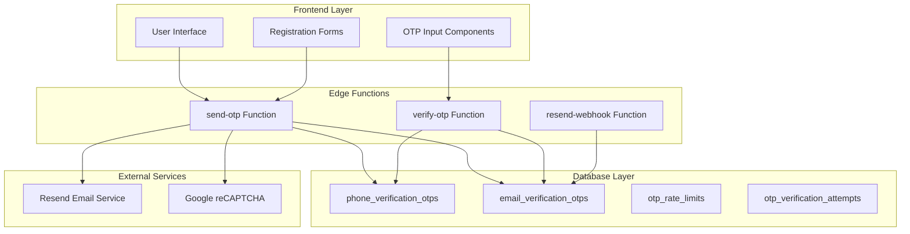
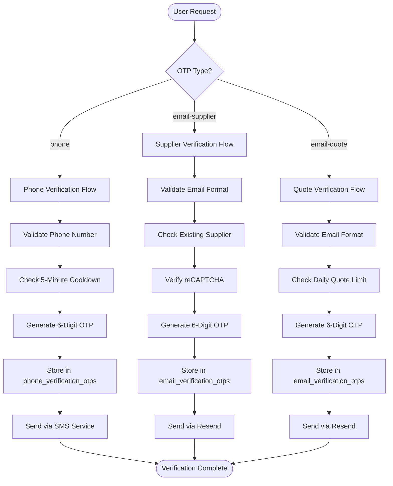
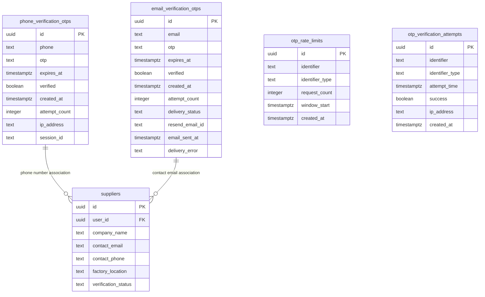
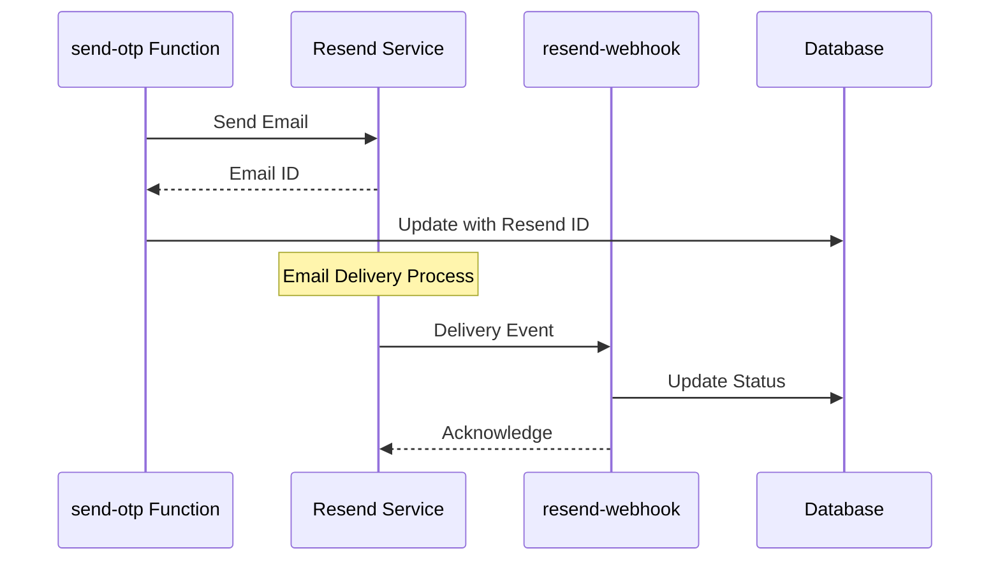

# OTP Sending Mechanism

<cite>
**Referenced Files in This Document**
- [supabase/functions/send-otp/index.ts](file://supabase/functions/send-otp/index.ts)
- [supabase/functions/verify-otp/index.ts](file://supabase/functions/verify-otp/index.ts)
- [src/pages/JoinSupplier.tsx](file://src/pages/JoinSupplier.tsx)
- [src/components/AIQuoteGeneratorWithOTP.tsx](file://src/components/AIQuoteGeneratorWithOTP.tsx)
- [src/components/quote/EmailQuoteModal.tsx](file://src/components/quote/EmailQuoteModal.tsx)
- [supabase/functions/resend-webhook/index.ts](file://supabase/functions/resend-webhook/index.ts)
- [supabase/functions/_shared/logger.ts](file://supabase/functions/_shared/logger.ts)
- [supabase/migrations/20251116162502_313dcba7-bfcf-494c-a64e-cf71fbf50750.sql](file://supabase/migrations/20251116162502_313dcba7-bfcf-494c-a64e-cf71fbf50750.sql)
- [supabase/migrations/20251119140029_887f03c6-bdb2-46d4-ac7b-4b4868f9a169.sql](file://supabase/migrations/20251119140029_887f03c6-bdb2-46d4-ac7b-4b4868f9a169.sql)
- [supabase/COMPLETE_SETUP.sql](file://supabase/COMPLETE_SETUP.sql)
</cite>

## Table of Contents
1. [Introduction](#introduction)
2. [System Architecture](#system-architecture)
3. [OTP Types and Verification Flows](#otp-types-and-verification-flows)
4. [Core Edge Functions](#core-edge-functions)
5. [Database Schema and Security](#database-schema-and-security)
6. [Email Delivery and Resend Integration](#email-delivery-and-resend-integration)
7. [Frontend Implementation](#frontend-implementation)
8. [Security Features](#security-features)
9. [Rate Limiting and Anti-Abuse Measures](#rate-limiting-and-anti-abuse-measures)
10. [Error Handling and Debugging](#error-handling-and-debugging)
11. [Common Issues and Troubleshooting](#common-issues-and-troubleshooting)
12. [Best Practices](#best-practices)

## Introduction

The OTP (One-Time Password) sending mechanism in sleekapp-v100 provides a secure, multi-channel verification system for user authentication and email validation. The system supports three distinct verification flows: phone-based verification, email-quote requests, and email-supplier registrations, each with specialized validation and security measures.

Built on Supabase Edge Functions, the system implements comprehensive security controls including rate limiting, disposable email detection, CAPTCHA integration, and robust error handling. The architecture ensures compliance with security best practices while maintaining excellent user experience through features like automatic retry logic and delivery status tracking.

## System Architecture

The OTP system follows a distributed architecture with clear separation of concerns across multiple components:



**Diagram sources**
- [supabase/functions/send-otp/index.ts](file://supabase/functions/send-otp/index.ts#L131-L489)
- [supabase/functions/verify-otp/index.ts](file://supabase/functions/verify-otp/index.ts#L21-L356)
- [supabase/functions/resend-webhook/index.ts](file://supabase/functions/resend-webhook/index.ts#L1-L117)

## OTP Types and Verification Flows

The system supports three distinct OTP verification types, each designed for specific use cases:

### 1. Phone Verification (`phone`)
- **Purpose**: Mobile phone number validation for user authentication
- **Implementation**: Generates 6-digit numeric codes with SMS integration points
- **Storage**: `phone_verification_otps` table with phone number masking
- **Expiration**: 10-minute validity period
- **Rate Limiting**: 5-minute cooldown between requests

### 2. Email-Supplier Verification (`email-supplier`)
- **Purpose**: Supplier registration email validation
- **Additional Security**: CAPTCHA verification for bot prevention
- **Duplicate Prevention**: Checks against existing supplier records
- **Storage**: `email_verification_otps` with comprehensive delivery tracking
- **Expiration**: 10-minute validity period

### 3. Email-Quote Verification (`email-quote`)
- **Purpose**: Quote request email validation with daily limits
- **Rate Limiting**: Maximum 3 quotes per day per email address
- **Integration**: Seamless quote generation workflow
- **Storage**: `email_verification_otps` with attempt counting
- **Expiration**: 10-minute validity period



**Diagram sources**
- [supabase/functions/send-otp/index.ts](file://supabase/functions/send-otp/index.ts#L195-L489)

**Section sources**
- [supabase/functions/send-otp/index.ts](file://supabase/functions/send-otp/index.ts#L36-L44)
- [supabase/functions/verify-otp/index.ts](file://supabase/functions/verify-otp/index.ts#L12-L19)

## Core Edge Functions

### send-otp Function

The primary edge function handles OTP generation and delivery across all verification types:

#### Key Features:
- **Type-Specific Processing**: Handles phone, email-quote, and email-supplier flows
- **Comprehensive Validation**: Email format validation with regex and disposable domain detection
- **Rate Limiting**: 5-minute cooldown enforcement for both phone and email requests
- **Retry Logic**: Automatic retry mechanism for transient email delivery failures
- **Delivery Tracking**: Full email delivery status monitoring via Resend webhooks

#### OTP Generation Logic:
The system generates 6-digit numeric codes using JavaScript's `Math.random()` function:

```typescript
const otp = Math.floor(100000 + Math.random() * 900000).toString();
```

This approach ensures uniform distribution and prevents predictable patterns while maintaining simplicity.

#### Email Validation Pipeline:
The email validation system implements multiple layers of security:

1. **Format Validation**: Comprehensive regex pattern matching
2. **Length Constraints**: Local part (64 chars max), total (254 chars max)
3. **Disposable Domain Blocking**: Blacklist of temporary email providers
4. **Header Injection Protection**: Email sanitization to prevent malicious content

#### Storage Implementation:
Each OTP type uses dedicated database tables with appropriate field structures:

**Phone OTP Table Structure:**
- `id`: UUID primary key
- `phone`: Phone number with masking
- `otp`: Generated 6-digit code
- `expires_at`: 10-minute expiration timestamp
- `verified`: Boolean verification status
- `created_at`: Record creation timestamp
- `attempt_count`: Failed attempt counter
- `ip_address`: Client IP address
- `session_id`: Session correlation ID

**Email OTP Table Structure:**
- `id`: UUID primary key
- `email`: Sanitized email address
- `otp`: Generated 6-digit code
- `expires_at`: 10-minute expiration timestamp
- `verified`: Boolean verification status
- `created_at`: Record creation timestamp
- `attempt_count`: Failed attempt counter
- `delivery_status`: Email delivery status tracking
- `resend_email_id`: Resend API email identifier
- `email_sent_at`: Successful delivery timestamp
- `delivery_error`: Error message for failed deliveries

**Section sources**
- [supabase/functions/send-otp/index.ts](file://supabase/functions/send-otp/index.ts#L131-L489)
- [supabase/migrations/20251119140029_887f03c6-bdb2-46d4-ac7b-4b4868f9a169.sql](file://supabase/migrations/20251119140029_887f03c6-bdb2-46d4-ac7b-4b4868f9a169.sql#L1-L21)

### verify-otp Function

The verification endpoint validates submitted OTP codes and manages the completion of verification workflows:

#### Verification Process:
1. **Rate Limit Check**: 3 attempts per hour per identifier
2. **OTP Retrieval**: Fetch latest unverified OTP for identifier
3. **Expiration Validation**: Verify code hasn't expired (10 minutes)
4. **Attempt Limit**: Prevent brute force attacks (5 attempts per OTP)
5. **Code Matching**: Compare submitted code with stored value
6. **Success Handling**: Mark as verified and update user profiles

#### Type-Specific Responses:
Different OTP types return tailored success responses:

- **Phone Verification**: Updates user profile with verified phone number
- **Email-Supplier**: Completes supplier registration workflow
- **Email-Quote**: Provides daily quote usage statistics

**Section sources**
- [supabase/functions/verify-otp/index.ts](file://supabase/functions/verify-otp/index.ts#L21-L356)

## Database Schema and Security

### Table Structure and Relationships

The OTP system utilizes several specialized tables with carefully designed schemas:



**Diagram sources**
- [supabase/COMPLETE_SETUP.sql](file://supabase/COMPLETE_SETUP.sql#L6683-L6705)
- [supabase/TABLES_ONLY.sql](file://supabase/TABLES_ONLY.sql#L474-L506)

### Security Hardening

The system implements comprehensive security measures through database migrations and access controls:

#### Service Role Isolation
Critical OTP table access is restricted to service role only:

```sql
-- Security Hardening: Remove public OTP access and enable password breach protection
DROP POLICY IF EXISTS "Users can verify their own phone OTPs" ON phone_verification_otps;
DROP POLICY IF EXISTS "Allow public to insert phone OTPs" ON phone_verification_otps;
DROP POLICY IF EXISTS "Users can verify their own email OTPs" ON email_verification_otps;
DROP POLICY IF EXISTS "Allow public to insert email OTPs" ON email_verification_otps;
```

This restriction ensures that only authorized edge functions can access OTP data, preventing unauthorized access through the public API.

#### Delivery Status Tracking
Enhanced email delivery monitoring provides visibility into email deliverability:

- **Delivery Status**: Tracks email state (pending, sent, failed, bounced, delivered)
- **Resend Integration**: Links to Resend API email IDs for webhook processing
- **Error Logging**: Captures detailed error information for troubleshooting
- **Index Optimization**: Database indexes for efficient delivery status queries

**Section sources**
- [supabase/migrations/20251116162502_313dcba7-bfcf-494c-a64e-cf71fbf50750.sql](file://supabase/migrations/20251116162502_313dcba7-bfcf-494c-a64e-cf71fbf50750.sql#L1-L15)
- [supabase/migrations/20251119140029_887f03c6-bdb2-46d4-ac7b-4b4868f9a169.sql](file://supabase/migrations/20251119140029_887f03c6-bdb2-46d4-ac7b-4b4868f9a169.sql#L1-L21)

## Email Delivery and Resend Integration

### Resend Email Service Integration

The system integrates with Resend for reliable email delivery with comprehensive tracking:

#### Email Template System
Custom HTML templates provide branded verification experiences:

```html
<!DOCTYPE html>
<html>
<head>
    <meta charset="utf-8">
    <meta name="viewport" content="width=device-width, initial-scale=1.0">
    <title>${emailSubject}</title>
</head>
<body style="font-family: -apple-system, BlinkMacSystemFont, 'Segoe UI', Roboto, 'Helvetica Neue', Arial, sans-serif; line-height: 1.6; color: #333;">
    <!-- Branding and OTP Display -->
    <div style="background: linear-gradient(135deg, #667eea 0%, #764ba2 100%);">
        <h1 style="color: white;">Sleek Apparels</h1>
    </div>
    <div style="background: #ffffff; padding: 40px;">
        <h2 style="color: #333;">Your Verification Code</h2>
        <div style="background: #f8f9fa; border: 2px dashed #667eea; padding: 20px;">
            <div style="font-size: 36px; font-weight: bold;">${otp}</div>
        </div>
        <p style="color: #999;">Expires in 10 minutes</p>
    </div>
</body>
</html>
```

#### Delivery Status Monitoring
The webhook system provides real-time email delivery feedback:



**Diagram sources**
- [supabase/functions/resend-webhook/index.ts](file://supabase/functions/resend-webhook/index.ts#L69-L103)
- [supabase/functions/send-otp/index.ts](file://supabase/functions/send-otp/index.ts#L404-L444)

#### Retry Logic Implementation
Transient delivery failures are handled through intelligent retry mechanisms:

- **Exponential Backoff**: Delays increase with each retry attempt
- **Configurable Retries**: Maximum 2 retry attempts for email delivery
- **Error Classification**: Distinguishes between retryable and permanent failures
- **Logging**: Comprehensive logging for troubleshooting

**Section sources**
- [supabase/functions/send-otp/index.ts](file://supabase/functions/send-otp/index.ts#L104-L129)
- [supabase/functions/resend-webhook/index.ts](file://supabase/functions/resend-webhook/index.ts#L1-L117)

## Frontend Implementation

### JoinSupplier Component

The supplier registration form demonstrates comprehensive OTP integration:

#### CAPTCHA Integration
Google reCAPTCHA provides bot protection for supplier registrations:

```typescript
// CAPTCHA verification in JoinSupplier.tsx
const captchaToken = await recaptchaRef.current?.executeAsync();
if (!captchaToken) {
  toast.error("Please complete the CAPTCHA verification");
  return;
}

const { data, error } = await supabase.functions.invoke('send-otp', {
  body: { type: 'email-supplier', email: formData.email, captchaToken }
});
```

#### Timeout Handling
Frontend timeout management prevents hanging requests:

```typescript
const timeoutPromise = new Promise((_, reject) => 
  setTimeout(() => reject(new Error('Request timed out')), 30000)
);

const { data, error } = await Promise.race([otpPromise, timeoutPromise]);
```

#### Error Handling Patterns
Comprehensive error handling covers various failure scenarios:

- **Rate Limiting**: 5-minute cooldown notifications
- **Disposable Emails**: Clear messaging for blocked domains
- **Network Issues**: Graceful degradation with user feedback
- **Server Errors**: Meaningful error messages with retry suggestions

**Section sources**
- [src/pages/JoinSupplier.tsx](file://src/pages/JoinSupplier.tsx#L72-L125)

### AIQuoteGeneratorWithOTP Component

The quote generation system showcases email-quote OTP flow:

#### Form Validation and Submission
The component implements comprehensive form validation:

```typescript
const validated = quoteFormSchema.parse({
  ...formData,
  quantity: parseInt(formData.quantity),
  complexityLevel: formData.complexityLevel || 'medium',
  fabricType: formData.fabricType || undefined,
  additionalRequirements: formData.additionalRequirements || undefined,
});
```

#### OTP Request Flow
Quote requests trigger OTP generation with country and email validation:

```typescript
const { data, error } = await supabase.functions.invoke('send-otp', {
  body: {
    type: 'email-quote',
    email: validated.customerEmail,
    country: validated.country,
  }
});
```

#### Success and Error Management
The component provides seamless user experience through:

- **Immediate Feedback**: Toast notifications for success/failure
- **State Management**: Smooth transitions between form, OTP, and result states
- **Error Recovery**: Clear instructions for retrying failed operations

**Section sources**
- [src/components/AIQuoteGeneratorWithOTP.tsx](file://src/components/AIQuoteGeneratorWithOTP.tsx#L175-L200)

## Security Features

### Disposable Email Detection

The system implements comprehensive disposable email protection:

#### Domain Blacklist
Maintained list of temporary email providers:

```typescript
const DISPOSABLE_DOMAINS = [
  'tempmail.com', 'throwaway.email', '10minutemail.com', 'guerrillamail.com',
  'mailinator.com', 'maildrop.cc', 'trashmail.com', 'yopmail.com',
  'temp-mail.org', 'fakeinbox.com', 'sharklasers.com', 'getnada.com'
];
```

#### Validation Logic
Multiple validation layers prevent disposable email abuse:

1. **Domain Check**: Immediate rejection of blacklisted domains
2. **Format Validation**: Comprehensive email format verification
3. **Length Constraints**: Enforces reasonable email lengths
4. **Sanitization**: Prevents header injection attacks

### Rate Limiting Implementation

The system implements multiple layers of rate limiting:

#### OTP Attempt Rate Limiting
Stored procedure `check_otp_rate_limit` enforces:
- **3 attempts per hour** per identifier
- **5 attempts per OTP record** maximum
- **Window-based counting** for temporal analysis

#### Request Rate Limiting
Edge function level rate limiting:
- **5-minute cooldown** between OTP requests
- **Type-specific limits** for different verification flows
- **IP-based tracking** for abuse prevention

#### Stored Procedure Implementation
```sql
CREATE FUNCTION public.check_otp_rate_limit(p_identifier text, p_identifier_type text) 
RETURNS jsonb AS $$
DECLARE
  v_attempt_count INTEGER;
  v_time_window INTERVAL := '1 hour';
  v_max_attempts INTEGER := 3;
BEGIN
  SELECT COUNT(*)
  INTO v_attempt_count
  FROM public.otp_verification_attempts
  WHERE identifier = p_identifier
    AND identifier_type = p_identifier_type
    AND attempt_time > (now() - v_time_window);
  
  RETURN jsonb_build_object(
    'allowed', v_attempt_count < v_max_attempts,
    'attempts_used', v_attempt_count,
    'max_attempts', v_max_attempts,
    'attempts_remaining', GREATEST(0, v_max_attempts - v_attempt_count)
  );
END;
$$;
```

**Section sources**
- [supabase/functions/send-otp/index.ts](file://supabase/functions/send-otp/index.ts#L18-L23)
- [supabase/functions/verify-otp/index.ts](file://supabase/functions/verify-otp/index.ts#L67-L88)

## Rate Limiting and Anti-Abuse Measures

### Multi-Level Protection System

The OTP system implements a comprehensive anti-abuse framework:

#### 1. Request-Level Rate Limiting
- **5-minute cooldown**: Prevents rapid-fire OTP requests
- **Type-specific enforcement**: Different limits for phone vs. email
- **IP-based tracking**: Identifies suspicious patterns

#### 2. Verification Attempt Rate Limiting
- **3 attempts per hour**: Stored procedure enforced
- **5 attempts per OTP**: Per-record attempt limiting
- **Temporal windows**: Hour-based counting for fairness

#### 3. Daily Quote Limits
Email-quote verification includes daily usage restrictions:
- **Maximum 3 quotes per day** per email address
- **Usage tracking**: Real-time quota monitoring
- **Clear messaging**: Informative error responses

### Abuse Detection and Mitigation

#### Logging and Monitoring
Structured logging captures all security-relevant events:

```typescript
// Example logging patterns from the codebase
logger.info('Email OTP request', { type, email: maskEmail(email) });
logger.warn('Rate limit exceeded', { identifierType, identifier: sanitizedId });
logger.error('Email send attempt failed', error, { attempt, maxRetries });
```

#### PII Sanitization
Sensitive data is automatically masked in logs:

- **Emails**: `john.doe@example.com` → `joh***@example.com`
- **Phone Numbers**: `+8801234567890` → `+880****90`
- **Order IDs**: `550e8400-e29b-41d4-a716-446655440000` → `550e8400-****`

**Section sources**
- [supabase/functions/_shared/logger.ts](file://supabase/functions/_shared/logger.ts#L14-L44)
- [supabase/functions/verify-otp/index.ts](file://supabase/functions/verify-otp/index.ts#L67-L88)

## Error Handling and Debugging

### Comprehensive Error Management

The system provides detailed error handling across all components:

#### Backend Error Categories
1. **Validation Errors**: Invalid input formats and missing required fields
2. **Rate Limiting Errors**: Cooldown periods and attempt limits
3. **Delivery Failures**: Email service issues and network problems
4. **Database Errors**: Storage and retrieval failures
5. **System Errors**: Infrastructure and configuration issues

#### Frontend Error Handling Patterns
The frontend implements graceful error recovery:

```typescript
// Timeout handling with Promise.race
const timeoutPromise = new Promise((_, reject) => 
  setTimeout(() => reject(new Error('Request timed out')), 30000)
);

const { data, error } = await Promise.race([otpPromise, timeoutPromise]);
```

#### Error Response Standardization
Consistent error response formats across all edge functions:

```typescript
{
  "error": "Descriptive error message",
  "code": "ERROR_CODE",
  "retryAfter": 300 // Optional: seconds until retry allowed
}
```

### Debugging Tools and Techniques

#### Logging Infrastructure
Structured logging with automatic PII sanitization:

```typescript
// Logger usage examples
logger.info('Phone OTP request', { phone: maskPhone(phone) });
logger.error('Email OTP insert error', insertError, { email: maskEmail(sanitizedEmail) });
logger.warn('CAPTCHA verification failed', { errorCodes: captchaData['error-codes'] });
```

#### Response Headers for Debugging
Edge functions provide diagnostic information:

- **Content-Type**: Application/json for structured responses
- **Access-Control-Allow-Origin**: CORS headers for cross-origin requests
- **Custom Headers**: Debug information for development

#### Webhook Debugging
Resend webhook system enables delivery troubleshooting:

- **Event Tracking**: Real-time delivery status updates
- **Error Propagation**: Failed delivery details in webhook events
- **Correlation IDs**: Link between edge function requests and webhook events

**Section sources**
- [supabase/functions/send-otp/index.ts](file://supabase/functions/send-otp/index.ts#L482-L488)
- [supabase/functions/verify-otp/index.ts](file://supabase/functions/verify-otp/index.ts#L348-L356)

## Common Issues and Troubleshooting

### Failed OTP Delivery

#### Symptoms
- Users report not receiving verification emails
- "Failed to send verification email" error messages
- Delayed or bounced delivery notifications

#### Diagnostic Steps
1. **Check Resend Configuration**: Verify API key and domain setup
2. **Review Delivery Logs**: Examine webhook event history
3. **Validate Email Format**: Ensure proper email address formatting
4. **Check Disposable Domains**: Verify email isn't from blacklisted provider
5. **Monitor Rate Limits**: Confirm request frequency compliance

#### Resolution Strategies
- **Retry Logic**: Automatic retry for transient failures
- **Alternative Delivery**: Fallback to phone verification
- **Manual Intervention**: Support team assistance for persistent issues

### Handling of Disposable Emails

#### Problem Scenario
Users attempting to register with temporary email addresses

#### Solution Implementation
The system automatically detects and blocks disposable domains:

```typescript
// Disposable domain validation
if (DISPOSABLE_DOMAINS.includes(domain)) {
  return { valid: false, error: 'Disposable email addresses are not allowed' };
}
```

#### User Experience Enhancement
Clear error messaging guides users toward permanent email addresses:

- **Specific Messaging**: "Disposable email addresses are not allowed"
- **Alternative Suggestions**: Encourage use of business or personal email
- **Graceful Degradation**: Allow retry with corrected email

### CAPTCHA Integration Issues

#### Common Problems
- **reCAPTCHA Timeout**: Users taking too long to complete verification
- **Network Issues**: CAPTCHA service unavailability
- **Configuration Errors**: Incorrect secret keys or site keys

#### Troubleshooting Approach
1. **Verify Configuration**: Check environment variables for CAPTCHA secrets
2. **Test Network Connectivity**: Ensure access to Google reCAPTCHA endpoints
3. **Monitor Response Times**: Track CAPTCHA verification latency
4. **Fallback Mechanisms**: Alternative verification methods when CAPTCHA fails

**Section sources**
- [supabase/functions/send-otp/index.ts](file://supabase/functions/send-otp/index.ts#L154-L187)
- [src/pages/JoinSupplier.tsx](file://src/pages/JoinSupplier.tsx#L72-L87)

## Best Practices

### Security Implementation Guidelines

#### 1. Service Role Isolation
- **Database Access**: Restrict OTP table access to service role only
- **Edge Function Authentication**: Use service keys exclusively
- **API Gateway Security**: Implement proper authentication for edge functions

#### 2. Input Validation
- **Comprehensive Regex**: Use robust email format validation
- **Length Constraints**: Enforce reasonable input limits
- **Sanitization**: Prevent header injection and XSS attacks

#### 3. Rate Limiting Strategy
- **Multi-Level Protection**: Combine request and attempt rate limiting
- **Temporal Windows**: Use hourly-based counting for fairness
- **Dynamic Adjustment**: Monitor and adjust limits based on usage patterns

### Performance Optimization

#### 1. Database Efficiency
- **Index Optimization**: Create indexes for frequently queried fields
- **Query Optimization**: Use efficient SQL patterns for OTP lookups
- **Connection Pooling**: Optimize database connection management

#### 2. Caching Strategies
- **Rate Limit Caching**: Cache rate limit calculations
- **Validation Results**: Cache email format validation results
- **Template Caching**: Cache email template rendering

#### 3. Monitoring and Alerting
- **Delivery Metrics**: Track email delivery success rates
- **Performance Monitoring**: Monitor edge function execution times
- **Error Rate Tracking**: Alert on unusual error patterns

### User Experience Enhancements

#### 1. Progressive Loading
- **Timeout Handling**: Implement 30-second timeouts for user experience
- **Loading States**: Provide clear feedback during OTP processing
- **Error Messages**: Use meaningful error messages with actionable guidance

#### 2. Accessibility Considerations
- **Screen Reader Support**: Ensure OTP input fields are accessible
- **Mobile Responsiveness**: Optimize for mobile device usage
- **Keyboard Navigation**: Support full keyboard accessibility

#### 3. Internationalization
- **Multilingual Support**: Consider localization for international users
- **Time Zone Awareness**: Handle expiration timestamps correctly
- **Regional Compliance**: Adhere to regional email regulations

### Maintenance and Monitoring

#### 1. Regular Audits
- **Security Reviews**: Periodic security assessments of OTP flows
- **Performance Analysis**: Monitor system performance metrics
- **Error Rate Analysis**: Investigate and resolve recurring issues

#### 2. Documentation Maintenance
- **API Documentation**: Keep edge function documentation current
- **Troubleshooting Guides**: Maintain comprehensive troubleshooting resources
- **Developer Onboarding**: Provide clear implementation guidelines

#### 3. Continuous Improvement
- **Feature Requests**: Gather user feedback for enhancements
- **Performance Optimization**: Continuously optimize system performance
- **Security Updates**: Stay current with security best practices