# OTP Verification Process

<cite>
**Referenced Files in This Document**
- [supabase/functions/verify-otp/index.ts](file://supabase/functions/verify-otp/index.ts)
- [supabase/functions/send-otp/index.ts](file://supabase/functions/send-otp/index.ts)
- [src/pages/Auth.tsx](file://src/pages/Auth.tsx)
- [src/pages/__tests__/Auth.test.tsx](file://src/pages/__tests__/Auth.test.tsx)
- [supabase/functions/_shared/logger.ts](file://supabase/functions/_shared/logger.ts)
- [supabase/functions/log-audit-action/index.ts](file://supabase/functions/log-audit-action/index.ts)
- [supabase/COMPLETE_SETUP.sql](file://supabase/COMPLETE_SETUP.sql)
- [supabase/TABLES_ONLY.sql](file://supabase/TABLES_ONLY.sql)
</cite>

## Table of Contents
1. [Introduction](#introduction)
2. [System Architecture](#system-architecture)
3. [OTP Types and Security Model](#otp-types-and-security-model)
4. [Verify OTP Edge Function](#verify-otp-edge-function)
5. [Rate Limiting Implementation](#rate-limiting-implementation)
6. [Audit Logging System](#audit-logging-system)
7. [Type-Specific Responses](#type-specific-responses)
8. [Security Features](#security-features)
9. [Test Coverage](#test-coverage)
10. [Common Issues and Debugging](#common-issues-and-debugging)
11. [Troubleshooting Guide](#troubleshooting-guide)
12. [Conclusion](#conclusion)

## Introduction

The OTP (One-Time Password) verification process in sleekapp-v100 provides a robust, secure, and user-friendly authentication mechanism for both phone and email verification. The system implements comprehensive security measures including rate limiting, audit logging, and type-specific validation to protect against abuse while maintaining excellent user experience.

The OTP verification system consists of two primary edge functions: `send-otp` for generating and delivering verification codes, and `verify-otp` for validating submitted codes against stored records. Both functions work together with Supabase's edge runtime to provide a seamless verification workflow.

## System Architecture

The OTP verification system follows a distributed architecture with clear separation of concerns between edge functions, database storage, and client-side validation.

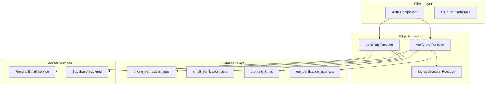

**Diagram sources**
- [supabase/functions/send-otp/index.ts](file://supabase/functions/send-otp/index.ts#L1-L50)
- [supabase/functions/verify-otp/index.ts](file://supabase/functions/verify-otp/index.ts#L1-L50)
- [supabase/functions/log-audit-action/index.ts](file://supabase/functions/log-audit-action/index.ts#L1-L50)

**Section sources**
- [supabase/functions/send-otp/index.ts](file://supabase/functions/send-otp/index.ts#L1-L100)
- [supabase/functions/verify-otp/index.ts](file://supabase/functions/verify-otp/index.ts#L1-L100)

## OTP Types and Security Model

The system supports three distinct OTP types, each with specific security characteristics and use cases:

### OTP Type Definitions

| Type | Purpose | Authentication Method | Security Level |
|------|---------|----------------------|----------------|
| `phone` | Phone number verification | Anon key with session auth | Medium |
| `email-quote` | Email quote requests | Service role key | High |
| `email-supplier` | Supplier registration | Service role key | High |

### Security Model Implementation

The security model employs different authentication approaches based on the OTP type:

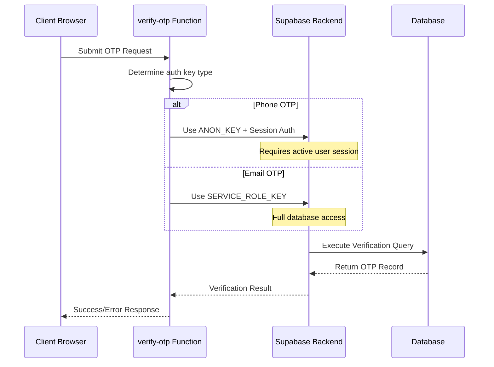

**Diagram sources**
- [supabase/functions/verify-otp/index.ts](file://supabase/functions/verify-otp/index.ts#L43-L54)

**Section sources**
- [supabase/functions/verify-otp/index.ts](file://supabase/functions/verify-otp/index.ts#L12-L18)
- [supabase/functions/verify-otp/index.ts](file://supabase/functions/verify-otp/index.ts#L43-L54)

## Verify OTP Edge Function

The `verify-otp` edge function serves as the core verification engine, implementing comprehensive validation logic for both phone and email OTPs.

### Function Architecture

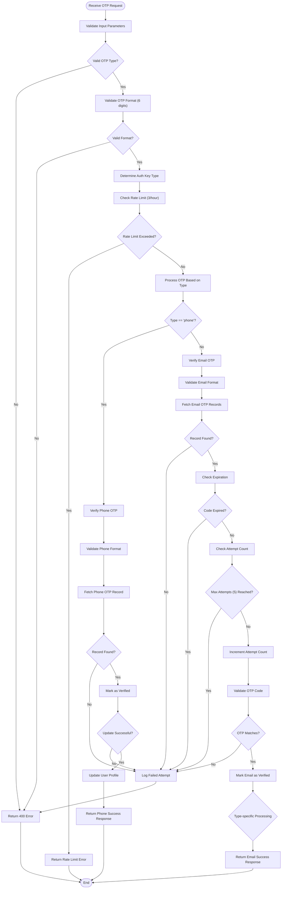

**Diagram sources**
- [supabase/functions/verify-otp/index.ts](file://supabase/functions/verify-otp/index.ts#L21-L356)

### Phone OTP Verification Process

Phone OTP verification involves session-based authentication and user profile updates:

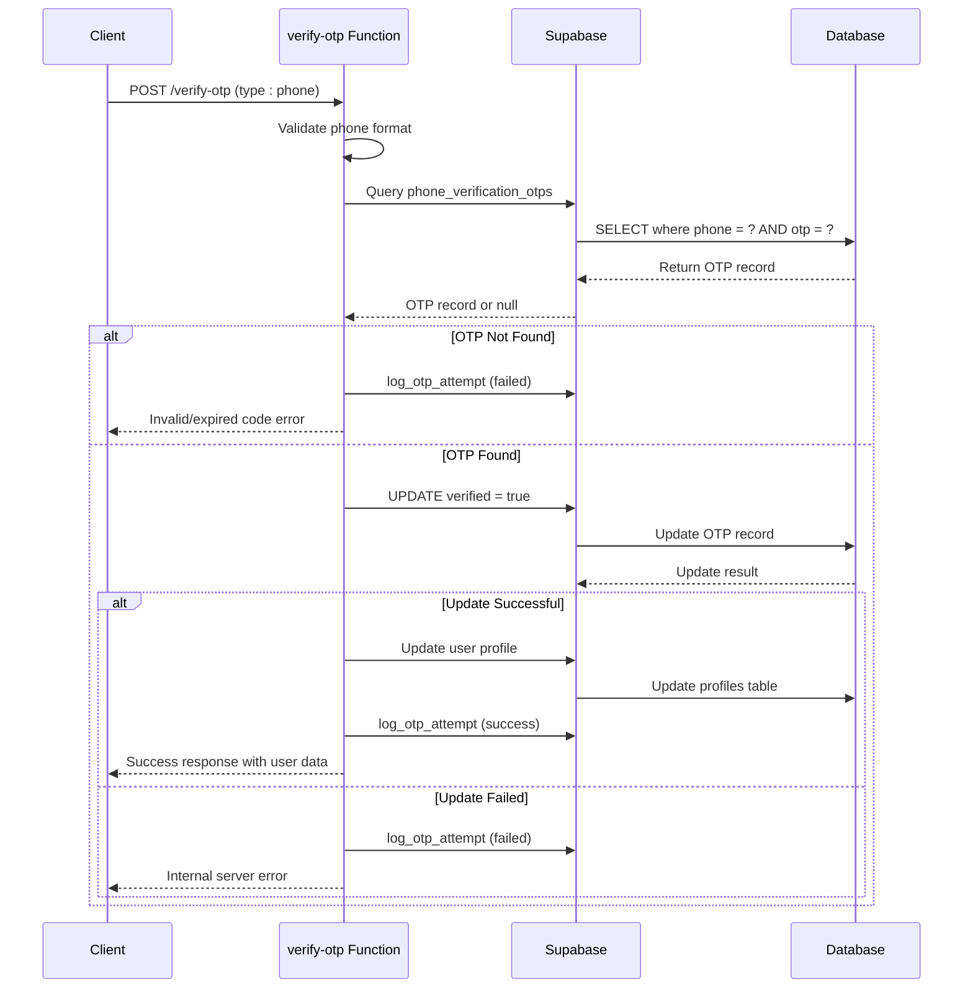

**Diagram sources**
- [supabase/functions/verify-otp/index.ts](file://supabase/functions/verify-otp/index.ts#L90-L178)

### Email OTP Verification Process

Email OTP verification implements stricter validation with attempt limits and daily quotas:

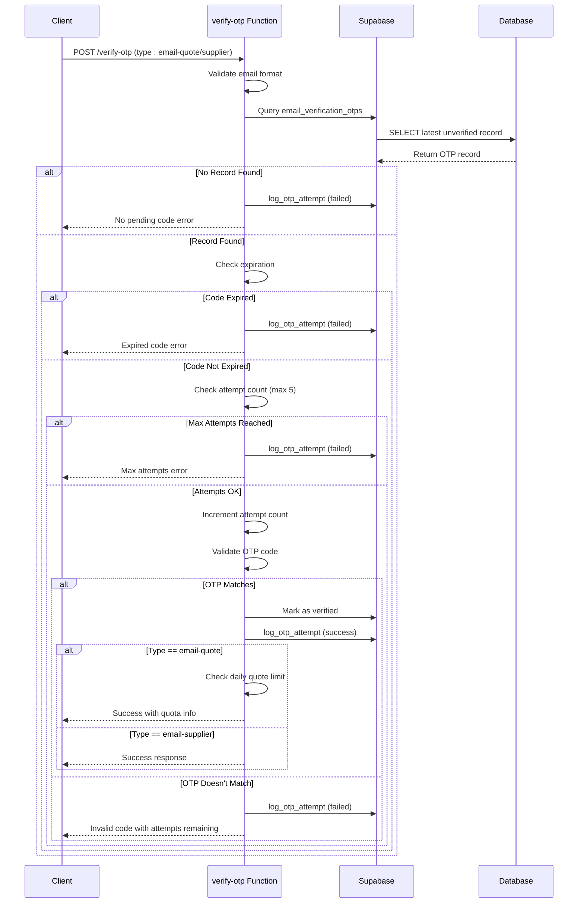

**Diagram sources**
- [supabase/functions/verify-otp/index.ts](file://supabase/functions/verify-otp/index.ts#L180-L347)

**Section sources**
- [supabase/functions/verify-otp/index.ts](file://supabase/functions/verify-otp/index.ts#L21-L356)

## Rate Limiting Implementation

The system implements a sophisticated rate limiting mechanism through the `check_otp_rate_limit` RPC function, providing protection against brute force attacks while maintaining good user experience.

### Rate Limiting Architecture

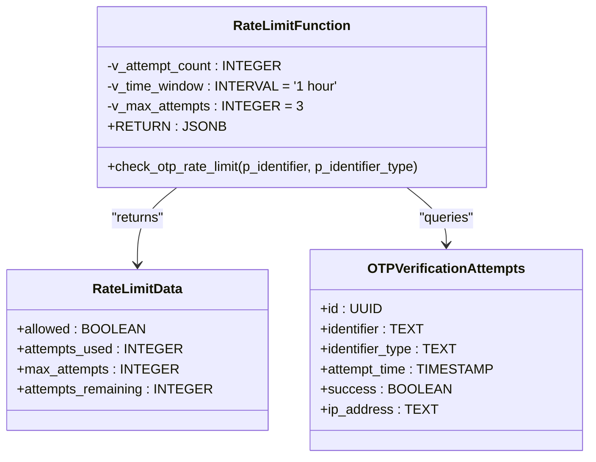

**Diagram sources**
- [supabase/COMPLETE_SETUP.sql](file://supabase/COMPLETE_SETUP.sql#L245-L269)

### Rate Limiting Logic

The rate limiting system operates on a sliding window principle:

| Parameter | Value | Purpose |
|-----------|-------|---------|
| Time Window | 1 hour | Period during which attempts are counted |
| Max Attempts | 3 | Maximum allowed attempts per window |
| Identifier Type | phone/email | Separate limits for different identifier types |
| Storage | otp_rate_limits table | Tracks attempt counts per identifier |

### Rate Limiting Flow

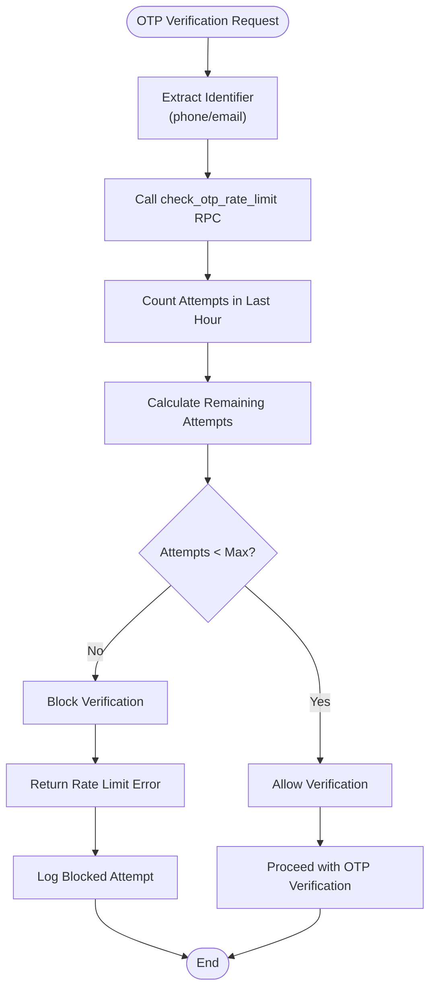

**Diagram sources**
- [supabase/functions/verify-otp/index.ts](file://supabase/functions/verify-otp/index.ts#L67-L88)

**Section sources**
- [supabase/COMPLETE_SETUP.sql](file://supabase/COMPLETE_SETUP.sql#L245-L269)
- [supabase/functions/verify-otp/index.ts](file://supabase/functions/verify-otp/index.ts#L67-L88)

## Audit Logging System

The OTP verification system implements comprehensive audit logging through the `log_otp_attempt` RPC function, capturing all verification attempts for security monitoring and compliance.

### Audit Logging Architecture

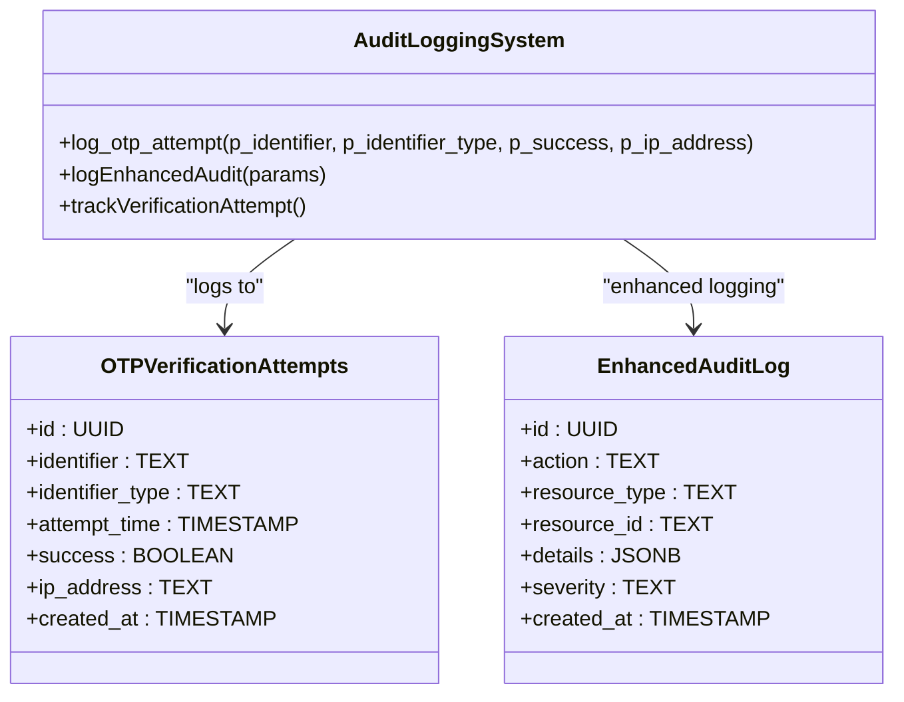

**Diagram sources**
- [supabase/COMPLETE_SETUP.sql](file://supabase/COMPLETE_SETUP.sql#L472-L516)
- [src/lib/enhancedAuditLog.ts](file://src/lib/enhancedAuditLog.ts#L49-L106)

### IP Address Capture Mechanism

The system captures IP addresses from HTTP headers for security analysis:

| Header Priority | Purpose | Fallback |
|----------------|---------|----------|
| `x-forwarded-for` | Production environments | `x-real-ip` |
| `x-real-ip` | Load balancer environments | None |
| None | Unknown origin | Null value |

### Audit Log Data Structure

Each audit log entry contains comprehensive information for security analysis:

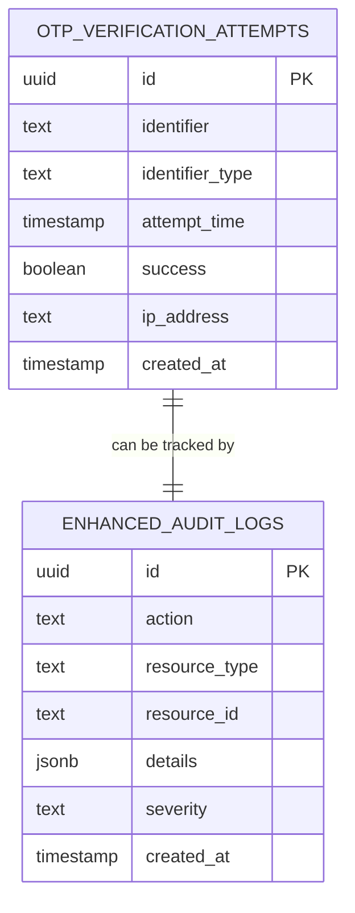

**Diagram sources**
- [supabase/TABLES_ONLY.sql](file://supabase/TABLES_ONLY.sql#L487-L495)

**Section sources**
- [supabase/COMPLETE_SETUP.sql](file://supabase/COMPLETE_SETUP.sql#L472-L516)
- [supabase/functions/verify-otp/index.ts](file://supabase/functions/verify-otp/index.ts#L111-L117)
- [supabase/functions/verify-otp/index.ts](file://supabase/functions/verify-otp/index.ts#L207-L213)

## Type-Specific Responses

The OTP verification system provides tailored responses based on the OTP type, enabling different user experiences and business logic implementations.

### Daily Quote Limit Tracking (email-quote)

For email-quote verifications, the system implements daily quote request limits:

| Configuration | Value | Purpose |
|---------------|-------|---------|
| Max Quotes Per Day | 3 | Prevent spam and abuse |
| Reset Time | Midnight UTC | Daily reset |
| Tracking Method | Count verified emails | Accurate quota tracking |

### Response Data Structure

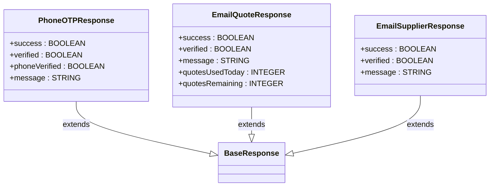

**Diagram sources**
- [supabase/functions/verify-otp/index.ts](file://supabase/functions/verify-otp/index.ts#L316-L336)

### Type-Specific Validation Rules

Each OTP type implements specific validation and business logic:

| OTP Type | Validation Rules | Business Logic |
|----------|------------------|----------------|
| phone | Phone format, session auth | Updates user profile |
| email-quote | Email format, daily quota | Tracks quote requests |
| email-supplier | Email format, CAPTCHA | Supplier registration |

**Section sources**
- [supabase/functions/verify-otp/index.ts](file://supabase/functions/verify-otp/index.ts#L316-L347)

## Security Features

The OTP verification system incorporates multiple layers of security to protect against various attack vectors and ensure system integrity.

### Brute Force Protection

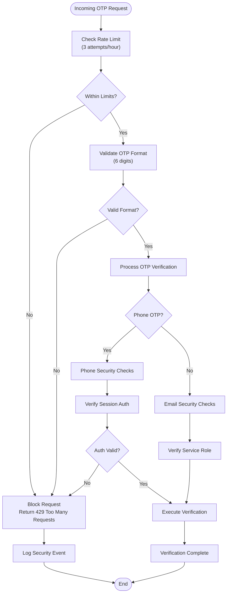

**Diagram sources**
- [supabase/functions/verify-otp/index.ts](file://supabase/functions/verify-otp/index.ts#L67-L88)

### Anti-Abuse Measures

The system implements several anti-abuse mechanisms:

| Measure | Implementation | Purpose |
|---------|----------------|---------|
| Rate Limiting | 3 attempts/hour per identifier | Prevent brute force attacks |
| Attempt Limits | 5 attempts per OTP record | Limit guessing attempts |
| Expiration | 10-minute validity | Reduce attack window |
| IP Logging | Capture x-forwarded-for | Security analysis |
| PII Sanitization | Mask sensitive data in logs | Privacy protection |

### Input Validation and Sanitization

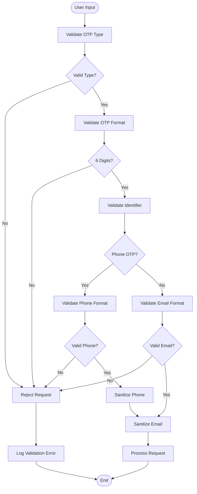

**Diagram sources**
- [supabase/functions/verify-otp/index.ts](file://supabase/functions/verify-otp/index.ts#L26-L41)

**Section sources**
- [supabase/functions/verify-otp/index.ts](file://supabase/functions/verify-otp/index.ts#L67-L88)
- [supabase/functions/verify-otp/index.ts](file://supabase/functions/verify-otp/index.ts#L110-L122)
- [supabase/functions/verify-otp/index.ts](file://supabase/functions/verify-otp/index.ts#L224-L262)

## Test Coverage

The OTP verification system includes comprehensive test coverage through the `Auth.test.tsx` file, validating both successful and failed verification scenarios.

### Test Coverage Areas

The test suite covers multiple verification scenarios:

| Test Category | Scenarios Tested | Purpose |
|---------------|------------------|---------|
| Phone Verification | Valid/invalid OTP, expired codes, rate limits | End-to-end phone flow |
| Email Verification | Quote vs supplier types, daily limits, attempt limits | Email-specific logic |
| Error Handling | Network errors, validation failures, edge cases | Robustness testing |
| Rate Limiting | Multiple attempts, timing windows, IP tracking | Security validation |

### Phone Verification Test Examples

The test suite demonstrates phone verification workflows:

```typescript
// Phone OTP sending test
it('sends OTP to phone number', async () => {
  const user = userEvent.setup();
  mockSupabase.functions.invoke.mockResolvedValue({
    data: { success: true, expiresAt: new Date().toISOString() },
    error: null,
  });
  
  const phoneInput = screen.getByPlaceholderText(/\+1234567890/i);
  await user.type(phoneInput, '+1234567890');
  await user.click(screen.getByRole('button', { name: /Send Code/i }));
  
  await waitFor(() => {
    expect(mockSupabase.functions.invoke).toHaveBeenCalledWith('send-otp', {
      body: { type: 'phone', phone: '+1234567890' },
    });
  });
});

// Phone OTP verification test
it('verifies OTP code', async () => {
  const user = userEvent.setup();
  // Mock OTP verification response
  mockSupabase.functions.invoke.mockResolvedValue({
    data: { success: true, verified: true },
    error: null,
  });
  
  // Enter OTP code
  const otpInputs = screen.getAllByRole('textbox');
  for (let i = 0; i < 6; i++) {
    await user.type(otpInputs[i], String(i));
  }
  
  await waitFor(() => {
    expect(mockSupabase.functions.invoke).toHaveBeenCalledWith('verify-otp', {
      body: { type: 'phone', phone: '+1234567890', otp: expect.any(String) },
    });
  });
});
```

### Email Verification Test Examples

Email verification tests cover type-specific scenarios:

```typescript
// Email quote verification test
it('handles invalid OTP code', async () => {
  const user = userEvent.setup();
  
  // Mock failed verification
  mockSupabase.functions.invoke.mockResolvedValueOnce({
    data: null,
    error: { message: 'Invalid verification code' },
  });
  
  const otpInputs = screen.getAllByRole('textbox');
  for (let i = 0; i < 6; i++) {
    await user.type(otpInputs[i], String(i));
  }
  
  await waitFor(() => {
    expect(toast.error).toHaveBeenCalledWith('Invalid verification code');
  });
});
```

**Section sources**
- [src/pages/__tests__/Auth.test.tsx](file://src/pages/__tests__/Auth.test.tsx#L266-L460)

## Common Issues and Debugging

Understanding common issues and their solutions helps developers and support teams quickly resolve verification problems.

### Brute Force Protection Issues

**Problem**: Users receive "Too many verification attempts" errors
**Causes**:
- Multiple failed attempts from same IP
- Rate limit exceeded (3 attempts/hour)
- Session timeouts causing repeated requests

**Solutions**:
1. Wait for rate limit reset (1 hour)
2. Clear browser cache/session
3. Check for automated script activity
4. Review audit logs for suspicious patterns

### Maximum Attempt Limits

**Problem**: Email OTPs fail after 5 attempts
**Causes**:
- Incorrect OTP code entered multiple times
- Bot or automated attempts
- System bugs causing repeated attempts

**Solutions**:
1. Request new OTP code
2. Check email spam folder
3. Verify OTP format (6 digits)
4. Monitor attempt count in audit logs

### Email Delivery Issues

**Problem**: Verification emails not received
**Causes**:
- Email blocked by spam filters
- Disposable email domains detected
- SMTP service failures
- Rate limiting (5-minute cooldown)

**Solutions**:
1. Check spam/junk folders
2. Use a different email address
3. Verify email format and domain
4. Contact support for delivery issues

### Debugging Failed Verifications

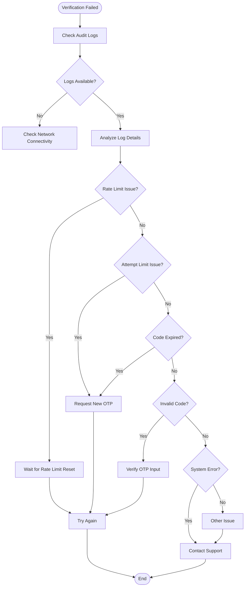

**Diagram sources**
- [supabase/functions/verify-otp/index.ts](file://supabase/functions/verify-otp/index.ts#L110-L122)
- [supabase/functions/verify-otp/index.ts](file://supabase/functions/verify-otp/index.ts#L207-L221)

**Section sources**
- [supabase/functions/verify-otp/index.ts](file://supabase/functions/verify-otp/index.ts#L67-L88)
- [supabase/functions/verify-otp/index.ts](file://supabase/functions/verify-otp/index.ts#L110-L122)

## Troubleshooting Guide

### Step-by-Step Troubleshooting Process

#### 1. Initial Diagnosis

**Check Request Status Codes**:
- `400`: Bad request (invalid input)
- `429`: Rate limited (too many attempts)
- `500`: Server error (internal issue)

**Verify Input Parameters**:
```javascript
// Expected request format
{
  type: 'phone' | 'email-quote' | 'email-supplier',
  phone?: string,  // Required for phone type
  email?: string,  // Required for email types
  otp: string      // 6-digit code
}
```

#### 2. Rate Limiting Issues

**Symptoms**: "Too many verification attempts" error
**Resolution Steps**:
1. Check remaining attempts in rate limit response
2. Wait for rate limit reset (1 hour)
3. Verify IP address isn't being blocked
4. Review audit logs for suspicious activity

#### 3. OTP Validation Failures

**Symptoms**: "Invalid or expired verification code" error
**Resolution Steps**:
1. Verify OTP format (6 digits only)
2. Check email/spam folders for new codes
3. Ensure code hasn't expired (>10 minutes)
4. Confirm correct OTP type selected

#### 4. Email Delivery Problems

**Symptoms**: No verification email received
**Resolution Steps**:
1. Check spam/junk folders
2. Verify email format and domain
3. Wait for 5-minute cooldown period
4. Try with a different email address

### Monitoring and Alerting

The system provides comprehensive monitoring capabilities:

| Metric | Purpose | Threshold |
|--------|---------|-----------|
| Verification Attempts | Track usage patterns | Monitor spikes |
| Success Rate | Measure system health | <95% warning |
| Rate Limit Hits | Detect abuse attempts | Monitor trends |
| Email Delivery Failures | Monitor external service | Track reliability |

### Support Procedures

**For Developers**:
1. Check edge function logs in Supabase dashboard
2. Review audit logs for detailed error information
3. Verify environment variable configurations
4. Test with different OTP types and scenarios

**For Support Teams**:
1. Access audit logs through admin interface
2. Monitor rate limiting metrics
3. Coordinate with development team for complex issues
4. Escalate to appropriate team based on error type

**Section sources**
- [supabase/functions/verify-otp/index.ts](file://supabase/functions/verify-otp/index.ts#L67-L88)
- [supabase/functions/verify-otp/index.ts](file://supabase/functions/verify-otp/index.ts#L110-L122)
- [supabase/functions/verify-otp/index.ts](file://supabase/functions/verify-otp/index.ts#L207-L221)

## Conclusion

The OTP verification process in sleekapp-v100 represents a comprehensive, secure, and user-friendly authentication solution. The system successfully balances security requirements with usability through:

**Key Strengths**:
- Multi-layered security with rate limiting and attempt controls
- Type-specific validation for different use cases
- Comprehensive audit logging for security monitoring
- Robust error handling and user feedback
- Extensive test coverage ensuring reliability

**Security Features**:
- 3-attempt-per-hour rate limiting prevents brute force attacks
- 5-attempt-per-OTP limit for email verifications
- IP address capture for security analysis
- PII sanitization in logs maintains privacy
- Different authentication methods for different OTP types

**User Experience**:
- Clear error messages with actionable guidance
- Real-time validation and feedback
- Type-specific responses with relevant information
- Graceful degradation for edge cases

The modular architecture allows for easy maintenance and future enhancements while providing a solid foundation for secure user authentication. The combination of client-side validation, edge function processing, and database storage creates a reliable system capable of handling high-volume verification requests while maintaining strict security standards.

For developers implementing similar systems, this OTP verification process demonstrates best practices in authentication security, user experience design, and system monitoring that can be adapted to various use cases and requirements.