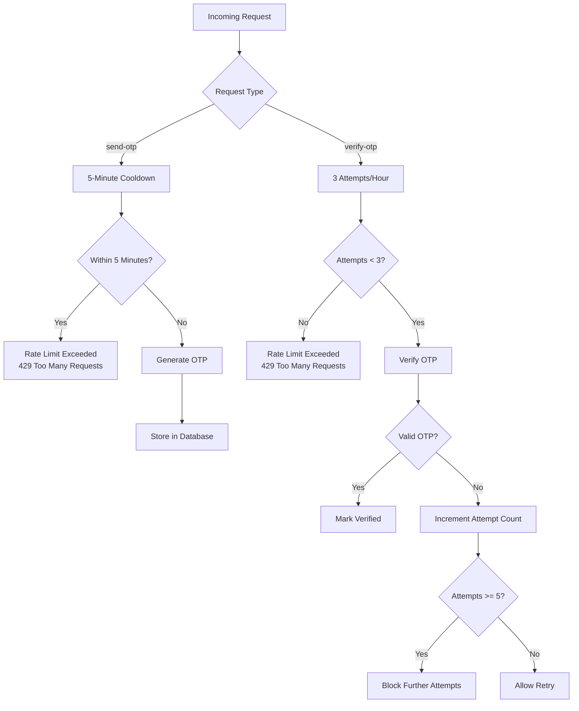
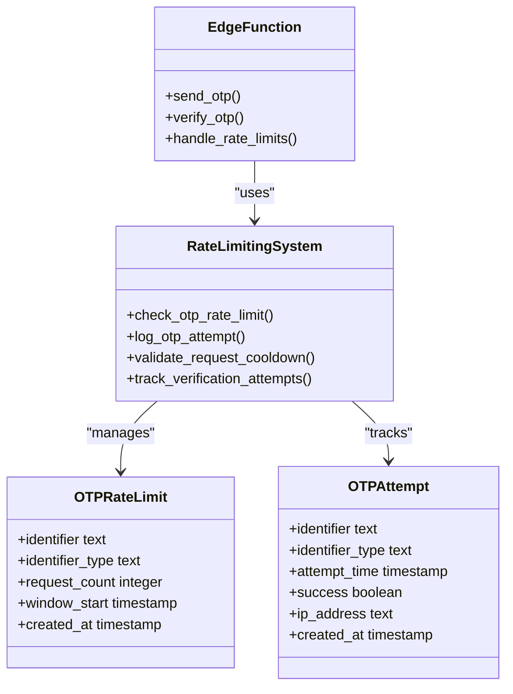
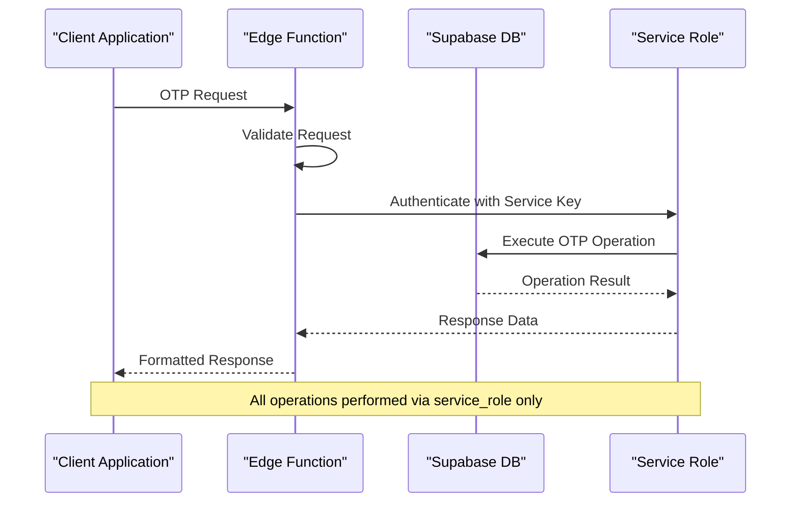
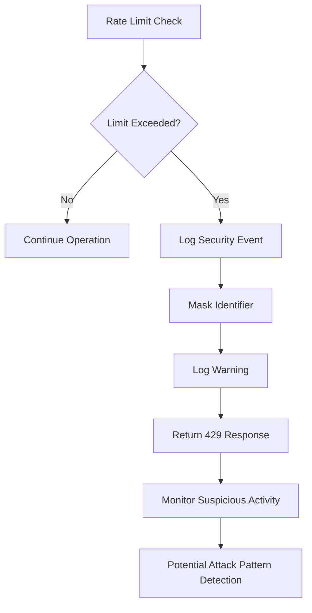
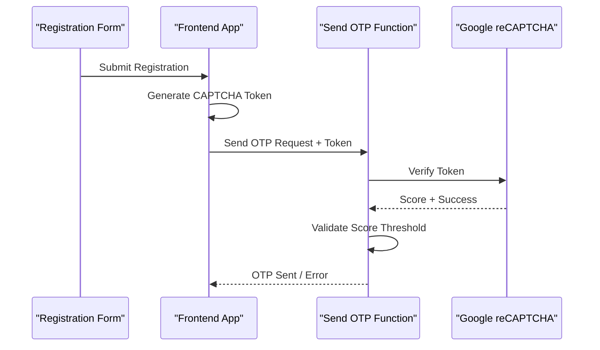
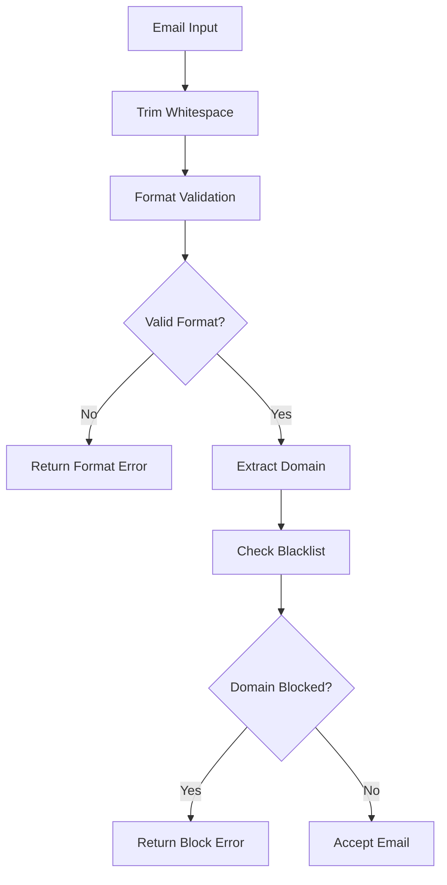

# Rate Limiting and Security Controls

<cite>
**Referenced Files in This Document**
- [send-otp/index.ts](file://supabase/functions/send-otp/index.ts)
- [verify-otp/index.ts](file://supabase/functions/verify-otp/index.ts)
- [logger.ts](file://supabase/functions/_shared/logger.ts)
- [20251116162502_313dcba7-bfcf-494c-a64e-cf71fbf50750.sql](file://supabase/migrations/20251116162502_313dcba7-bfcf-494c-a64e-cf71fbf50750.sql)
- [20251127091524_dd83810a-55c9-494a-8878-c84278881cc9.sql](file://supabase/migrations/20251127091524_dd83810a-55c9-494a-8878-c84278881cc9.sql)
- [check_otp_rate_limit](file://supabase/COMPLETE_SETUP.sql#L245-L269)
- [log_otp_attempt](file://supabase/COMPLETE_SETUP.sql#L472-L494)
- [enhancedAuditLog.ts](file://src/lib/enhancedAuditLog.ts)
- [RateLimitMonitoringDashboard.tsx](file://src/components/admin/RateLimitMonitoringDashboard.tsx)
</cite>

## Table of Contents
1. [Introduction](#introduction)
2. [Rate Limiting Architecture](#rate-limiting-architecture)
3. [Endpoint-Specific Rate Limits](#endpoint-specific-rate-limits)
4. [Security Hardening Measures](#security-hardening-measures)
5. [Audit Logging Strategy](#audit-logging-strategy)
6. [CAPTCHA and Anti-Bot Protection](#captcha-and-anti-bot-protection)
7. [Disposal Email Blocking](#disposal-email-blocking)
8. [Edge Function Security](#edge-function-security)
9. [Monitoring and Alerting](#monitoring-and-alerting)
10. [Common Issues and Solutions](#common-issues-and-solutions)
11. [Best Practices](#best-practices)
12. [Troubleshooting Guide](#troubleshooting-guide)

## Introduction

The sleekapp-v100 OTP (One-Time Password) system implements comprehensive rate limiting and security controls to protect against abuse, automated attacks, and unauthorized access attempts. This system employs multiple layers of defense including endpoint-specific rate limits, sophisticated audit logging, CAPTCHA enforcement, disposable email blocking, and strict access controls through edge functions and service roles.

The security architecture focuses on preventing:
- Brute force attacks through verification attempts
- Spam and bot registrations via CAPTCHA and rate limiting
- Email enumeration attacks through masked logging
- Unauthorized access through service role restrictions
- Abuse patterns through behavioral monitoring

## Rate Limiting Architecture

The OTP system implements a dual-layer rate limiting strategy with separate controls for different types of operations and endpoints.



**Diagram sources**
- [send-otp/index.ts](file://supabase/functions/send-otp/index.ts#L205-L222)
- [verify-otp/index.ts](file://supabase/functions/verify-otp/index.ts#L67-L88)

### Core Rate Limiting Components

The system uses dedicated RPC functions for rate limiting checks, ensuring consistent enforcement across all endpoints:



**Diagram sources**
- [check_otp_rate_limit](file://supabase/COMPLETE_SETUP.sql#L245-L269)
- [log_otp_attempt](file://supabase/COMPLETE_SETUP.sql#L472-L494)

**Section sources**
- [check_otp_rate_limit](file://supabase/COMPLETE_SETUP.sql#L245-L269)
- [send-otp/index.ts](file://supabase/functions/send-otp/index.ts#L205-L222)
- [verify-otp/index.ts](file://supabase/functions/verify-otp/index.ts#L67-L88)

## Endpoint-Specific Rate Limits

### Send OTP Endpoint (5-Minute Cooldown)

The `/send-otp` endpoint implements a strict 5-minute cooldown period to prevent spam and abuse:

**Implementation Details:**
- **Time Window:** 5 minutes (300 seconds)
- **Storage Location:** `phone_verification_otps` and `email_verification_otps` tables
- **Check Method:** Database query filtering by identifier and time range
- **Response:** 429 status code with retry-after header

**Technical Implementation:**
The cooldown check uses a simple database query to detect recent OTP requests:

```typescript
// Pseudocode representation of the cooldown logic
const fiveMinutesAgo = new Date(Date.now() - 5 * 60 * 1000).toISOString();
const { data: recentOTPs } = await supabase
  .from('email_verification_otps')
  .select('id')
  .eq('email', sanitizedEmail)
  .gt('created_at', fiveMinutesAgo)
  .limit(1);
```

**Section sources**
- [send-otp/index.ts](file://supabase/functions/send-otp/index.ts#L205-L222)
- [send-otp/index.ts](file://supabase/functions/send-otp/index.ts#L298-L314)

### Verify OTP Endpoint (3 Attempts Per Hour)

The `/verify-otp` endpoint enforces a more restrictive rate limit with hourly boundaries:

**Implementation Details:**
- **Time Window:** 1 hour
- **Maximum Attempts:** 3 attempts per hour
- **Storage Location:** `otp_verification_attempts` table
- **RPC Function:** `check_otp_rate_limit()`
- **Response:** 429 status code with detailed rate limit information

**Technical Implementation:**
The verification rate limit uses a stored procedure for centralized enforcement:

```sql
-- Stored procedure for verification rate limiting
CREATE FUNCTION check_otp_rate_limit(p_identifier text, p_identifier_type text)
RETURNS jsonb AS $$
DECLARE
  v_attempt_count INTEGER;
  v_time_window INTERVAL := '1 hour';
  v_max_attempts INTEGER := 3;
BEGIN
  -- Count attempts in the last hour
  SELECT COUNT(*)
  INTO v_attempt_count
  FROM public.otp_verification_attempts
  WHERE identifier = p_identifier
    AND identifier_type = p_identifier_type
    AND attempt_time > (now() - v_time_window);
  
  -- Return rate limit info
  RETURN jsonb_build_object(
    'allowed', v_attempt_count < v_max_attempts,
    'attempts_used', v_attempt_count,
    'max_attempts', v_max_attempts,
    'attempts_remaining', GREATEST(0, v_max_attempts - v_attempt_count)
  );
END;
$$;
```

**Section sources**
- [verify-otp/index.ts](file://supabase/functions/verify-otp/index.ts#L67-L88)
- [check_otp_rate_limit](file://supabase/COMPLETE_SETUP.sql#L245-L269)

### Additional Rate Limiting Features

#### Daily Quote Limits for Email-Quote Type

The email-quote type includes an additional daily limit:

- **Maximum Quotes Per Day:** 3
- **Tracking Method:** Count verified OTPs per email
- **Enforcement Point:** Before OTP generation
- **Response:** 429 status code with limit information

#### Attempt Limits Per OTP Record

Each OTP record has its own attempt counter:

- **Maximum Attempts Per Record:** 5 attempts
- **Tracking Method:** `attempt_count` field in OTP tables
- **Enforcement Point:** During verification attempts
- **Response:** 400 status code with attempt count information

**Section sources**
- [send-otp/index.ts](file://supabase/functions/send-otp/index.ts#L317-L341)
- [verify-otp/index.ts](file://supabase/functions/verify-otp/index.ts#L245-L262)

## Security Hardening Measures

### Removal of Public RLS Policies (Migration 20251116162502)

The security hardening migration removed all public Row Level Security (RLS) policies from OTP tables, ensuring exclusive access through service roles:

**Changes Implemented:**
1. **Removed Public Access:** Eliminated all public SELECT, INSERT, UPDATE, and DELETE permissions
2. **Service Role Exclusive Access:** Restricted all OTP table operations to service_role only
3. **No RLS Policies Needed:** Edge functions handle all OTP operations directly

**Before Changes:**
```sql
-- Previous vulnerable policies
DROP POLICY IF EXISTS "Users can verify their own OTPs" ON email_verification_otps;
DROP POLICY IF EXISTS "Allow public to insert OTPs" ON email_verification_otps;
```

**After Changes:**
```sql
-- Secure policies using service_role
CREATE POLICY "Service role manages OTPs"
ON email_verification_otps FOR ALL
TO service_role
USING (true) WITH CHECK (true);
```

**Section sources**
- [20251116162502_313dcba7-bfcf-494c-a64e-cf71fbf50750.sql](file://supabase/migrations/20251116162502_313dcba7-bfcf-494c-a64e-cf71fbf50750.sql#L1-L15)

### Enhanced Service Role Access Control

The system implements strict service role access controls across all OTP-related operations:



**Diagram sources**
- [send-otp/index.ts](file://supabase/functions/send-otp/index.ts#L43-L54)
- [verify-otp/index.ts](file://supabase/functions/verify-otp/index.ts#L43-L54)

**Section sources**
- [20251127091524_dd83810a-55c9-494a-8878-c84278881cc9.sql](file://supabase/migrations/20251127091524_dd83810a-55c9-494a-8878-c84278881cc9.sql#L10-L37)

## Audit Logging Strategy

### OTP Attempt Logging with Enhanced Metadata

The system implements comprehensive audit logging through the `log_otp_attempt` RPC function, capturing detailed information about each OTP operation:

**Logging Fields Captured:**
- **Identifier:** User's email or phone number (masked for privacy)
- **Identifier Type:** 'email' or 'phone'
- **Success Status:** Boolean indicating verification outcome
- **IP Address:** Client IP address from request headers
- **Timestamp:** Attempt creation time
- **User Agent:** Client browser/device information

**Technical Implementation:**
```sql
CREATE FUNCTION log_otp_attempt(
  p_identifier text, 
  p_identifier_type text, 
  p_success boolean, 
  p_ip_address text
) RETURNS uuid AS $$
DECLARE
  v_attempt_id UUID;
BEGIN
  INSERT INTO public.otp_verification_attempts (
    identifier,
    identifier_type,
    success,
    ip_address
  ) VALUES (
    p_identifier,
    p_identifier_type,
    p_success,
    p_ip_address
  ) RETURNING id INTO v_attempt_id;
  
  RETURN v_attempt_id;
END;
$$;
```

### Enhanced Audit Logs with IP Address Capture

The enhanced audit logging system captures additional metadata for security monitoring:

**Additional Fields:**
- **User ID:** Authenticated user identifier (nullable)
- **Session ID:** Current session information
- **Timestamp:** Precise operation timing
- **User Agent:** Browser and device identification
- **Source IP:** Forwarded or real IP address

**Section sources**
- [log_otp_attempt](file://supabase/COMPLETE_SETUP.sql#L472-L494)
- [enhancedAuditLog.ts](file://src/lib/enhancedAuditLog.ts)

### Security Event Logging for Rate Limit Exceeded Actions

The system automatically logs security events when rate limits are exceeded:



**Diagram sources**
- [verify-otp/index.ts](file://supabase/functions/verify-otp/index.ts#L76-L87)
- [logger.ts](file://supabase/functions/_shared/logger.ts#L116-L130)

**Section sources**
- [verify-otp/index.ts](file://supabase/functions/verify-otp/index.ts#L76-L87)
- [logger.ts](file://supabase/functions/_shared/logger.ts#L116-L130)

## CAPTCHA and Anti-Bot Protection

### Google reCAPTCHA Integration for Supplier Registration

The system implements Google reCAPTCHA v3 for anti-bot protection during supplier registration:

**Implementation Details:**
- **CAPTCHA Type:** reCAPTCHA v3 (invisible)
- **Trigger Condition:** Only for `email-supplier` type requests
- **Secret Key:** Configured via `RECAPTCHA_SECRET_KEY` environment variable
- **Threshold:** Automatic scoring-based validation

**CAPTCHA Verification Flow:**


**Diagram sources**
- [send-otp/index.ts](file://supabase/functions/send-otp/index.ts#L154-L187)

**Error Handling:**
- **Missing Secret Key:** Returns 500 error with "CAPTCHA verification unavailable"
- **Failed Verification:** Returns 400 error with "CAPTCHA verification failed"
- **Network Errors:** Returns 500 error with "CAPTCHA verification error"

**Section sources**
- [send-otp/index.ts](file://supabase/functions/send-otp/index.ts#L154-L187)

## Disposal Email Blocking

### Comprehensive Disposable Email Domain Filtering

The system implements robust filtering to block disposable email addresses:

**Blocked Domains List:**
- `tempmail.com`, `throwaway.email`, `10minutemail.com`
- `guerrillamail.com`, `mailinator.com`, `maildrop.cc`
- `trashmail.com`, `yopmail.com`, `temp-mail.org`
- `fakeinbox.com`, `sharklasers.com`, `getnada.com`

**Validation Process:**
1. **Domain Extraction:** Parse email to extract domain portion
2. **Blacklist Check:** Compare against blocked domains list
3. **Validation Failure:** Return appropriate error message
4. **Error Message:** "Disposable email addresses are not allowed"

**Email Validation Pipeline:**


**Diagram sources**
- [send-otp/index.ts](file://supabase/functions/send-otp/index.ts#L51-L94)

**Additional Email Security Measures:**
- **Length Validation:** Minimum 5 characters, maximum 254 characters
- **Consecutive Dots Check:** Prevents malformed email addresses
- **Local Part Length:** Maximum 64 characters before @ symbol
- **Header Injection Prevention:** Removes newline characters

**Section sources**
- [send-otp/index.ts](file://supabase/functions/send-otp/index.ts#L17-L23)
- [send-otp/index.ts](file://supabase/functions/send-otp/index.ts#L51-L94)

## Edge Function Security

### Service Role Authentication

All edge functions implement strict service role authentication:

**Authentication Mechanisms:**
- **Service Role Keys:** Dedicated keys for each edge function
- **Environment Variables:** Secure storage of authentication credentials
- **Request Headers:** Proper authorization header handling
- **Key Rotation:** Regular credential updates

**Security Implementation:**
```typescript
// Service role authentication example
const supabaseKey = Deno.env.get('SUPABASE_SERVICE_ROLE_KEY')!;
const supabase = createClient(supabaseUrl, supabaseKey);
```

### Request Validation and Sanitization

Edge functions implement comprehensive input validation:

**Validation Layers:**
1. **Type Checking:** Ensure proper data types
2. **Format Validation:** Regex patterns for emails and phone numbers
3. **Length Constraints:** Minimum and maximum character limits
4. **Sanitization:** Remove potentially harmful characters

**Error Handling:**
- **Graceful Degradation:** Fail-safe responses for edge cases
- **Structured Errors:** Consistent error response format
- **Logging:** Comprehensive error logging with context

**Section sources**
- [send-otp/index.ts](file://supabase/functions/send-otp/index.ts#L43-L54)
- [verify-otp/index.ts](file://supabase/functions/verify-otp/index.ts#L43-L54)

## Monitoring and Alerting

### Rate Limit Monitoring Dashboard

The system includes a comprehensive monitoring dashboard for tracking rate limiting metrics:

**Key Metrics Monitored:**
- **Requests Per Second:** Real-time request volume
- **Rate Limit Violations:** Number of exceeded limits
- **Successful Verifications:** Verification success rates
- **Failed Attempts:** Failed verification attempts
- **Suspicious Activity:** Abnormal usage patterns

**Monitoring Features:**
- **Real-time Dashboards:** Live metric visualization
- **Historical Trends:** Long-term usage patterns
- **Alert Thresholds:** Configurable warning levels
- **Export Capabilities:** Data export for analysis

**Section sources**
- [RateLimitMonitoringDashboard.tsx](file://src/components/admin/RateLimitMonitoringDashboard.tsx#L133-L165)

### Suspicious Activity Detection

The system implements behavioral monitoring for detecting potential attacks:

**Detection Patterns:**
- **Rapid Successive Requests:** Unusual request frequency
- **Multiple Failed Attempts:** Brute force indicators
- **Geographic Anomalies:** Suspicious IP patterns
- **Device Fingerprinting:** Browser/device correlation

**Automated Responses:**
- **Temporary Blocks:** Automatic temporary rate limit increases
- **Manual Review:** Flagged activities for administrator review
- **Alert Generation:** Security team notifications

## Common Issues and Solutions

### Edge Function Failures

**Issue:** Edge functions returning 500 errors
**Causes:**
- Missing environment variables
- Network connectivity issues
- Database connection problems
- Service role key expiration

**Solutions:**
1. **Verify Environment Variables:** Check SUPABASE_SERVICE_ROLE_KEY and other required keys
2. **Monitor Function Health:** Use health check endpoints
3. **Implement Retry Logic:** Add exponential backoff for transient failures
4. **Error Boundary Handling:** Graceful degradation for edge function failures

### Rate Limit Conflicts

**Issue:** Legitimate users experiencing rate limit errors
**Causes:**
- Aggressive rate limiting thresholds
- Concurrent requests from same identifier
- Time synchronization issues

**Solutions:**
1. **Adjust Thresholds:** Increase rate limits for legitimate use cases
2. **Implement Token Bucket:** Allow burst capacity within limits
3. **User Education:** Clear messaging about rate limit policies
4. **Monitoring Alerts:** Proactive notification of approaching limits

### CAPTCHA Integration Issues

**Issue:** CAPTCHA verification failures
**Causes:**
- Missing RECAPTCHA_SECRET_KEY
- Network connectivity to Google servers
- Invalid CAPTCHA tokens
- Score threshold violations

**Solutions:**
1. **Environment Configuration:** Verify RECAPTCHA_SECRET_KEY setup
2. **Fallback Mechanisms:** Alternative verification methods
3. **Error Messaging:** Clear instructions for users
4. **Monitoring:** Track CAPTCHA success rates

### Email Delivery Problems

**Issue:** OTP emails not being delivered
**Causes:**
- Email service provider issues
- Disposable email blocking
- Spam filters
- Network connectivity

**Solutions:**
1. **Retry Logic:** Implement exponential backoff for delivery attempts
2. **Alternative Methods:** SMS fallback for email delivery failures
3. **Domain Whitelisting:** Work with email providers for deliverability
4. **User Feedback:** Clear messaging about delivery issues

## Best Practices

### Implementation Guidelines

**For Developers:**
1. **Always Use Service Roles:** Never expose user-facing keys
2. **Implement Proper Logging:** Capture all security-relevant events
3. **Validate Inputs:** Comprehensive input validation and sanitization
4. **Handle Errors Gracefully:** Provide meaningful error messages
5. **Monitor Metrics:** Track all rate limiting and security metrics

**For Operations:**
1. **Regular Audits:** Periodic security reviews and updates
2. **Incident Response:** Established procedures for security incidents
3. **Backup Plans:** Alternative verification methods
4. **Documentation:** Clear operational procedures

### Security Considerations

**Privacy Protection:**
- **PII Sanitization:** Mask sensitive information in logs
- **Data Retention:** Implement appropriate data lifecycle policies
- **Access Controls:** Principle of least privilege

**Performance Optimization:**
- **Caching Strategies:** Intelligent caching for rate limit checks
- **Database Indexing:** Proper indexing for rate limit queries
- **Async Processing:** Non-blocking operations where possible

**Compliance Requirements:**
- **GDPR Compliance:** Data protection and user rights
- **Regulatory Reporting:** Required security reporting
- **Audit Trails:** Complete and tamper-proof logging

## Troubleshooting Guide

### Diagnostic Steps

**Step 1: Verify Environment Configuration**
```bash
# Check required environment variables
echo $SUPABASE_SERVICE_ROLE_KEY
echo $RESEND_API_KEY
echo $RECAPTCHA_SECRET_KEY
```

**Step 2: Test Edge Function Connectivity**
```bash
# Health check endpoint
curl -X GET https://your-supabase-url/functions/v1/health
```

**Step 3: Monitor Rate Limit Behavior**
```sql
-- Check current rate limits
SELECT * FROM otp_rate_limits WHERE identifier = 'test@example.com';

-- Check attempt history
SELECT * FROM otp_verification_attempts 
WHERE identifier = 'test@example.com' 
ORDER BY attempt_time DESC LIMIT 10;
```

### Common Error Messages

**"Rate limit exceeded"**
- **Cause:** Too many requests within time window
- **Solution:** Wait for cooldown period or adjust limits
- **Code:** 429 Too Many Requests

**"CAPTCHA verification failed"**
- **Cause:** Invalid or missing CAPTCHA token
- **Solution:** Verify reCAPTCHA configuration and token generation
- **Code:** 400 Bad Request

**"Disposable email addresses are not allowed"**
- **Cause:** Email domain on blacklist
- **Solution:** Use a valid, non-disposable email address
- **Code:** 400 Bad Request

**"Failed to send verification email"**
- **Cause:** Email delivery service issues
- **Solution:** Check email service status and retry
- **Code:** 500 Internal Server Error

### Performance Tuning

**Database Optimization:**
- Ensure proper indexing on `identifier` and `attempt_time` columns
- Monitor query performance for rate limit checks
- Implement connection pooling for database access

**Edge Function Optimization:**
- Minimize external API calls
- Implement efficient caching strategies
- Optimize memory usage for large operations

**Monitoring and Alerting:**
- Set up alerts for rate limit violations
- Monitor edge function error rates
- Track suspicious activity patterns

**Section sources**
- [send-otp/index.ts](file://supabase/functions/send-otp/index.ts#L116-L126)
- [verify-otp/index.ts](file://supabase/functions/verify-otp/index.ts#L110-L122)