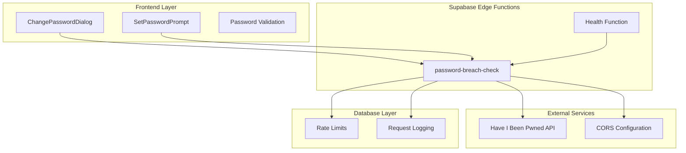
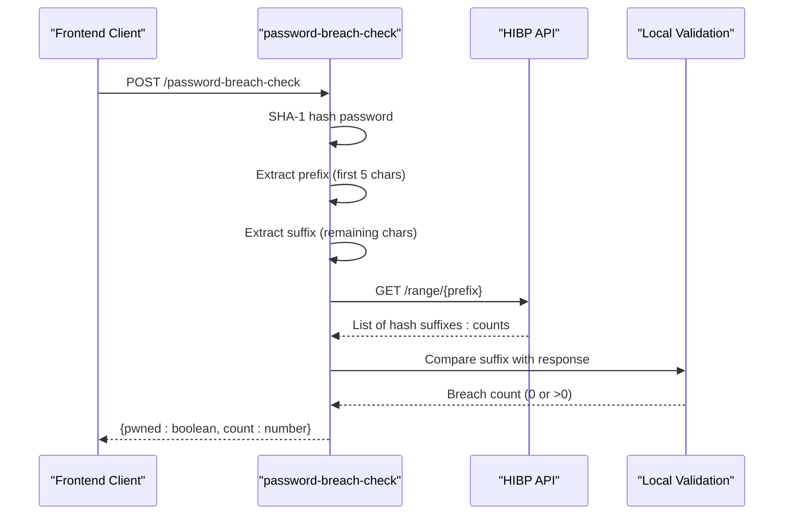
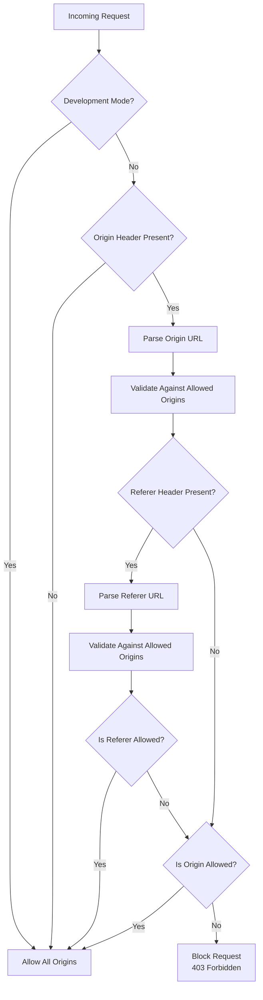
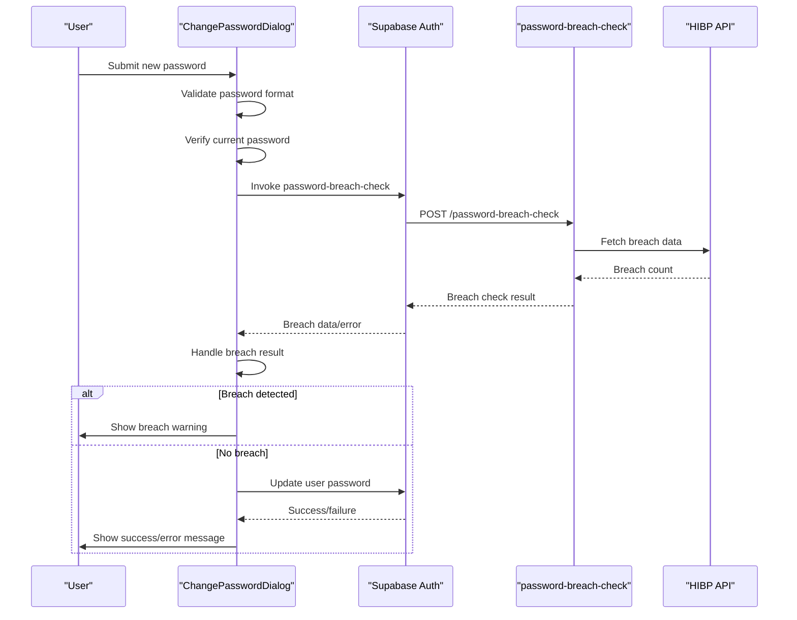
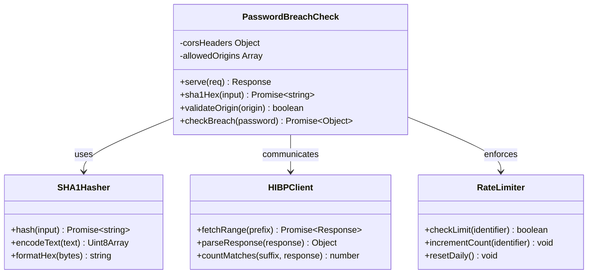
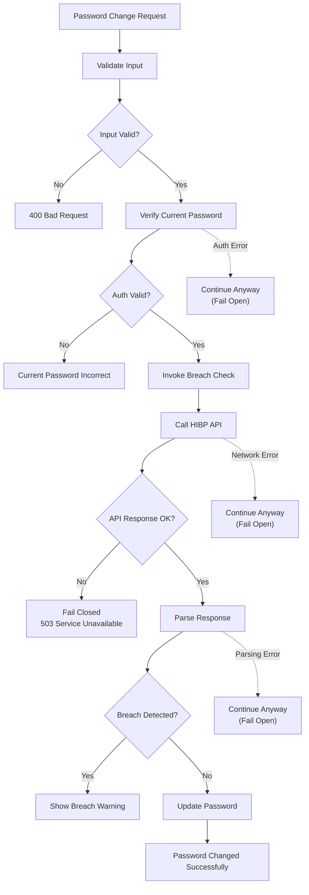
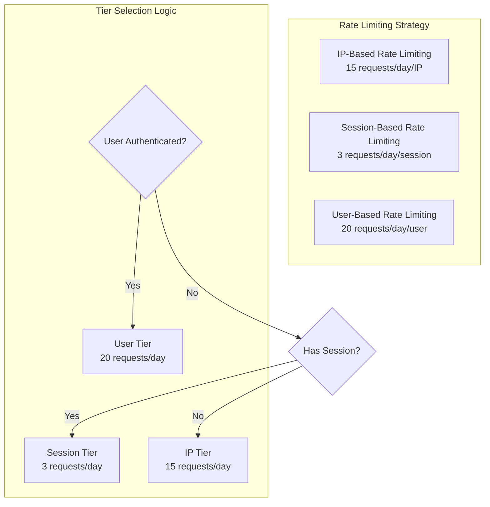
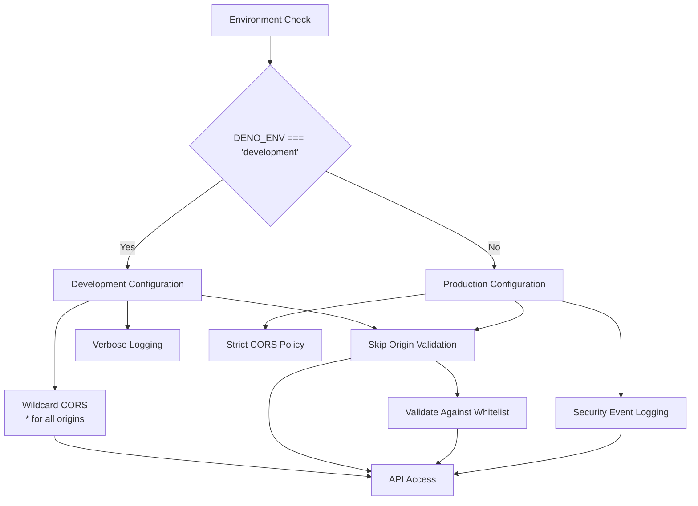

# Password Breach Protection

<cite>
**Referenced Files in This Document**
- [ChangePasswordDialog.tsx](file://src/components/ChangePasswordDialog.tsx)
- [SetPasswordPrompt.tsx](file://src/components/SetPasswordPrompt.tsx)
- [password-breach-check/index.ts](file://supabase/functions/password-breach-check/index.ts)
- [client.ts](file://src/integrations/supabase/client.ts)
- [RateLimitMonitoringDashboard.tsx](file://src/components/admin/RateLimitMonitoringDashboard.tsx)
- [ai-quote-generator/index.ts](file://supabase/functions/ai-quote-generator/index.ts)
- [health/index.ts](file://supabase/functions/health/index.ts)
</cite>

## Table of Contents
1. [Introduction](#introduction)
2. [System Architecture](#system-architecture)
3. [Core Components](#core-components)
4. [Implementation Details](#implementation-details)
5. [Security Features](#security-features)
6. [Frontend Integration](#frontend-integration)
7. [Backend Implementation](#backend-implementation)
8. [Error Handling and Fallback Behavior](#error-handling-and-fallback-behavior)
9. [Rate Limiting and API Management](#rate-limiting-and-api-management)
10. [Development vs Production Differences](#development-vs-production-differences)
11. [Common Issues and Troubleshooting](#common-issues-and-troubleshooting)
12. [Best Practices](#best-practices)

## Introduction

The password breach protection system in sleekapp-v100 implements a comprehensive security solution that protects user accounts by checking passwords against the Have I Been Pwned (HIBP) database using k-anonymity. This system prevents users from setting compromised passwords while maintaining strict privacy controls and providing graceful degradation when external services are unavailable.

The system consists of three main components: a React frontend that validates and submits passwords, a Supabase Edge Function that performs the breach check using k-anonymity, and robust error handling that ensures security even when external services fail.

## System Architecture

The password breach protection system follows a layered architecture that separates concerns between frontend validation, backend processing, and external service integration:

**Diagram sources**
- [ChangePasswordDialog.tsx](file://src/components/ChangePasswordDialog.tsx#L33-L86)
- [password-breach-check/index.ts](file://supabase/functions/password-breach-check/index.ts#L31-L141)

## Core Components

### Frontend Components

The system includes two primary frontend components that handle password changes and initial password setting:

#### ChangePasswordDialog Component
- Validates password strength using Zod schema
- Implements re-authentication with current password
- Integrates with the breach check API
- Provides user feedback and error handling

#### SetPasswordPrompt Component  
- Handles initial password creation during account setup
- Validates password complexity requirements
- Updates user account with new password

### Backend Edge Function

The `password-breach-check` Edge Function serves as the core breach detection service:

- Implements SHA-1 hashing for k-anonymity
- Communicates with HIBP API using prefix-suffix pattern
- Enforces CORS security policies
- Provides graceful fallback behavior

**Section sources**
- [ChangePasswordDialog.tsx](file://src/components/ChangePasswordDialog.tsx#L25-L158)
- [SetPasswordPrompt.tsx](file://src/components/SetPasswordPrompt.tsx#L29-L120)
- [password-breach-check/index.ts](file://supabase/functions/password-breach-check/index.ts#L1-L142)

## Implementation Details

### SHA-1 Hashing and K-Anonymity

The system implements k-anonymity by hashing passwords server-side and only sending the first 5 characters (prefix) to the HIBP API. This approach protects user privacy while still enabling breach detection:

**Diagram sources**
- [password-breach-check/index.ts](file://supabase/functions/password-breach-check/index.ts#L106-L130)

### Password Validation Schema

Both frontend components use a comprehensive Zod schema for password validation:

| Requirement | Pattern | Description |
|-------------|---------|-------------|
| Minimum Length | `min(8)` | At least 8 characters |
| Uppercase Letter | `regex(/[A-Z]/)` | Contains at least one uppercase letter |
| Lowercase Letter | `regex(/[a-z]/)` | Contains at least one lowercase letter |
| Number | `regex(/[0-9]/)` | Contains at least one numeric digit |

**Section sources**
- [ChangePasswordDialog.tsx](file://src/components/ChangePasswordDialog.tsx#L19-L23)
- [SetPasswordPrompt.tsx](file://src/components/SetPasswordPrompt.tsx#L18-L22)

## Security Features

### Origin Validation and CORS

The system implements strict origin validation for production environments:

**Diagram sources**
- [password-breach-check/index.ts](file://supabase/functions/password-breach-check/index.ts#L37-L95)

### Production Allowed Origins

The system maintains a comprehensive list of allowed origins for production security:

| Environment | Domains | Purpose |
|-------------|---------|---------|
| Production | `sleekapparels.com`, `www.sleekapparels.com` | Official production domains |
| Development | `localhost:5173`, `localhost:3000` | Local development environments |
| Preview | `lovableproject.com`, `lovable.app` | Preview deployments |
| Hosting | `netlify.app`, `vercel.app` | Third-party hosting platforms |

### Fail-Safe Security Model

The system implements a "fail closed" security model for breach checks:

- **Service Unavailable**: Returns 503 status with breach service unavailable message
- **Network Errors**: Continues with password change despite breach check failure
- **Invalid Input**: Returns 400 status for malformed requests
- **Authentication Failures**: Prevents password changes when current password verification fails

**Section sources**
- [password-breach-check/index.ts](file://supabase/functions/password-breach-check/index.ts#L112-L118)
- [ChangePasswordDialog.tsx](file://src/components/ChangePasswordDialog.tsx#L73-L76)

## Frontend Integration

### ChangePasswordDialog Integration

The ChangePasswordDialog component integrates with the breach check service through Supabase functions:

**Diagram sources**
- [ChangePasswordDialog.tsx](file://src/components/ChangePasswordDialog.tsx#L33-L86)

### SetPasswordPrompt Integration

The SetPasswordPrompt component provides a simpler flow for initial password setup:

- Validates password complexity
- Confirms password matching
- Updates user account directly
- No breach check integration (initial setup scenario)

**Section sources**
- [ChangePasswordDialog.tsx](file://src/components/ChangePasswordDialog.tsx#L68-L86)
- [SetPasswordPrompt.tsx](file://src/components/SetPasswordPrompt.tsx#L35-L61)

## Backend Implementation

### Deno Edge Function Architecture

The password-breach-check Edge Function is built on Deno's edge runtime with comprehensive error handling:

**Diagram sources**
- [password-breach-check/index.ts](file://supabase/functions/password-breach-check/index.ts#L22-L28)
- [password-breach-check/index.ts](file://supabase/functions/password-breach-check/index.ts#L106-L130)

### SHA-1 Implementation

The system uses native Web Crypto API for SHA-1 hashing:

- **Input Encoding**: Converts password string to UTF-8 bytes
- **Hash Generation**: Uses `crypto.subtle.digest("SHA-1", data)`
- **Output Formatting**: Converts binary hash to uppercase hexadecimal string
- **Performance**: Leverages browser-native cryptographic functions

### HIBP API Integration

The system communicates with the HIBP API using the k-anonymity pattern:

1. **Hash Calculation**: SHA-1(password) → hex string
2. **Prefix Extraction**: hash.slice(0, 5) → prefix
3. **API Request**: GET `https://api.pwnedpasswords.com/range/{prefix}`
4. **Response Parsing**: Compare suffix against returned hash list
5. **Breached Detection**: Match found → breached = true

**Section sources**
- [password-breach-check/index.ts](file://supabase/functions/password-breach-check/index.ts#L22-L28)
- [password-breach-check/index.ts](file://supabase/functions/password-breach-check/index.ts#L106-L130)

## Error Handling and Fallback Behavior

### Graceful Degradation Strategy

The system implements multiple layers of error handling to ensure security even when external services fail:

**Diagram sources**
- [ChangePasswordDialog.tsx](file://src/components/ChangePasswordDialog.tsx#L73-L76)
- [password-breach-check/index.ts](file://supabase/functions/password-breach-check/index.ts#L112-L118)

### Error Categories and Responses

| Error Type | Status Code | Behavior | User Impact |
|------------|-------------|----------|-------------|
| Invalid Input | 400 | Reject request immediately | Clear validation message |
| Authentication Failure | 403 | Block password change | "Current password incorrect" |
| HIBP Service Unavailable | 503 | Fail closed | "Service temporarily unavailable" |
| Network Timeout | 503 | Fail closed | "Service temporarily unavailable" |
| API Rate Limit | 429 | Retry suggested | "Try again later" |
| Internal Error | 500 | Log and fail | Generic error message |

### False Negative Mitigation

The system handles potential false negatives from the HIBP API:

- **Partial Matches**: Only exact suffix matches count as breaches
- **Rate Limiting**: Respects HIBP's rate limits to avoid blocking legitimate requests
- **Graceful Fallback**: Continues with password change if breach check fails
- **Logging**: Records all errors for monitoring and debugging

**Section sources**
- [password-breach-check/index.ts](file://supabase/functions/password-breach-check/index.ts#L112-L118)
- [ChangePasswordDialog.tsx](file://src/components/ChangePasswordDialog.tsx#L73-L76)

## Rate Limiting and API Management

### Multi-Level Rate Limiting

The system implements tiered rate limiting to prevent abuse while maintaining usability:

**Diagram sources**
- [ai-quote-generator/index.ts](file://supabase/functions/ai-quote-generator/index.ts#L320-L334)

### Rate Limit Monitoring

The system includes comprehensive monitoring for rate limiting effectiveness:

| Metric | Purpose | Threshold |
|--------|---------|-----------|
| Requests Per Hour | Monitor API usage patterns | 1000/hour |
| Unique Identifiers | Track user distribution | >100/day |
| Max Requests Per Identifier | Detect abuse patterns | >50/day |
| Average Requests Per Identifier | Measure normal usage | <10/day |
| High Usage Identifiers | Identify potential abuse | >80/day |

### API Health Monitoring

The system includes health check endpoints for monitoring service availability:

- **Endpoint**: `/health`
- **Method**: GET
- **Response**: `{ok: true, timestamp: ISOString, service: "edge-functions"}`
- **Status**: 200 OK or 500 Internal Server Error

**Section sources**
- [RateLimitMonitoringDashboard.tsx](file://src/components/admin/RateLimitMonitoringDashboard.tsx#L18-L80)
- [health/index.ts](file://supabase/functions/health/index.ts#L6-L33)

## Development vs Production Differences

### Environment Configuration

The system adapts its behavior based on the deployment environment:

**Diagram sources**
- [password-breach-check/index.ts](file://supabase/functions/password-breach-check/index.ts#L37-L40)

### Configuration Differences

| Aspect | Development | Production |
|--------|-------------|------------|
| CORS Policy | Wildcard (`*`) | Strict whitelist validation |
| Origin Validation | Disabled | Enabled with domain matching |
| Error Messages | Verbose | Generic error messages |
| Logging Level | Debug | Security-focused |
| Rate Limits | Relaxed | Strict enforcement |
| Health Checks | Full details | Minimal response |

### Testing and Development Support

The system provides enhanced support for development and testing:

- **Localhost Support**: Allows localhost origins for local development
- **Verbose Error Messages**: Detailed error information for debugging
- **Relaxed Rate Limits**: Higher limits for development testing
- **Mockable Endpoints**: Easy to test and simulate failures

**Section sources**
- [password-breach-check/index.ts](file://supabase/functions/password-breach-check/index.ts#L37-L40)

## Common Issues and Troubleshooting

### API Rate Limiting Issues

**Problem**: Frequent "Password breach service unavailable" errors
**Cause**: HIBP API rate limiting or network connectivity issues
**Solution**: 
- Implement exponential backoff in frontend
- Add caching mechanism for previously checked passwords
- Monitor rate limit metrics in production

### False Negative Scenarios

**Problem**: Legitimate breached passwords being accepted
**Cause**: 
- HIBP API delays in updating breach database
- Network timeouts during API calls
- Parsing errors in response handling

**Solution**:
- Implement retry logic with exponential backoff
- Add local cache for recently checked passwords
- Monitor API response times and reliability

### Cross-Origin Request Failures

**Problem**: CORS errors in production deployments
**Cause**: Origin not included in allowed origins list
**Solution**:
- Verify domain configuration in allowedOrigins array
- Check for protocol (http/https) mismatches
- Ensure subdomain matching works correctly

### Authentication Flow Issues

**Problem**: "Current password is incorrect" errors
**Cause**: 
- User session expired
- Password change attempted without proper authentication
- Race conditions in authentication state

**Solution**:
- Implement automatic session refresh
- Add authentication state validation
- Use optimistic UI updates with proper error handling

### Performance Issues

**Problem**: Slow password change responses
**Cause**: 
- Network latency to HIBP API
- SHA-1 hashing on large numbers of requests
- Database write operations timing out

**Solution**:
- Implement client-side caching for breach results
- Add timeout mechanisms for external API calls
- Optimize database transactions

**Section sources**
- [ChangePasswordDialog.tsx](file://src/components/ChangePasswordDialog.tsx#L63-L65)
- [password-breach-check/index.ts](file://supabase/functions/password-breach-check/index.ts#L112-L118)

## Best Practices

### Security Implementation Guidelines

1. **Never Send Full Passwords**: Always use k-anonymity pattern with SHA-1 hashing
2. **Implement Fail-Safe Logic**: Design systems to fail securely when external services are unavailable
3. **Validate All Inputs**: Use comprehensive validation schemas for all user inputs
4. **Enforce Strong Password Policies**: Implement multi-factor requirements
5. **Monitor and Alert**: Set up comprehensive monitoring for security events

### Performance Optimization

1. **Implement Caching**: Cache breach check results for frequently used passwords
2. **Use CDN for Static Assets**: Improve frontend load times
3. **Optimize Database Queries**: Use appropriate indexes for rate limiting tables
4. **Implement Connection Pooling**: Manage database connections efficiently
5. **Monitor API Response Times**: Track external service performance

### Development and Deployment

1. **Environment-Specific Configuration**: Use different settings for development and production
2. **Comprehensive Testing**: Test all error scenarios and edge cases
3. **Security Audits**: Regularly review security implementations
4. **Documentation**: Maintain clear documentation for all security features
5. **Incident Response**: Prepare procedures for security incidents

### User Experience Considerations

1. **Clear Error Messages**: Provide actionable feedback for validation failures
2. **Loading States**: Show progress indicators for long-running operations
3. **Graceful Degradation**: Maintain functionality when optional features fail
4. **Accessibility**: Ensure all security features are accessible to all users
5. **Mobile Optimization**: Test security features on mobile devices

The password breach protection system in sleekapp-v100 demonstrates enterprise-grade security implementation with privacy-preserving techniques, robust error handling, and comprehensive monitoring capabilities. By following these guidelines and best practices, developers can maintain a secure and reliable password protection system that enhances user trust and security.