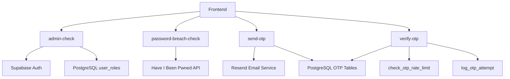
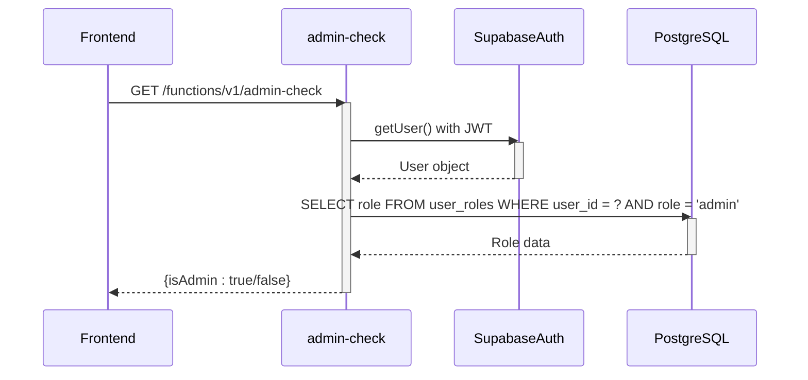
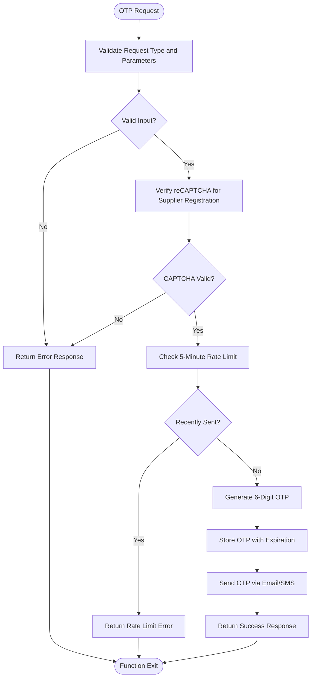
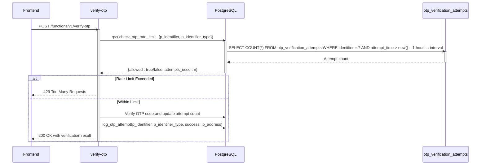
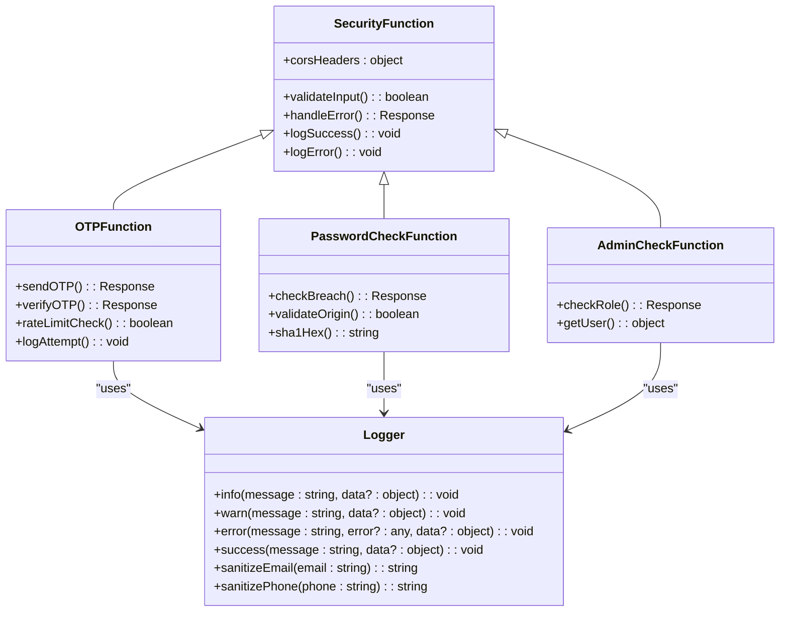

# Security Functions

<cite>
**Referenced Files in This Document**   
- [admin-check\index.ts](file://supabase/functions/admin-check/index.ts)
- [password-breach-check\index.ts](file://supabase/functions/password-breach-check/index.ts)
- [send-otp\index.ts](file://supabase/functions/send-otp/index.ts)
- [verify-otp\index.ts](file://supabase/functions/verify-otp/index.ts)
- [COMPLETE_SETUP.sql](file://supabase/COMPLETE_SETUP.sql)
- [migrations\20251121014007_e1ea3a7e-b3b2-4082-a10a-c5eff6b1135b.sql](file://supabase/migrations/20251121014007_e1ea3a7e-b3b2-4082-a10a-c5eff6b1135b.sql)
- [migrations\20251115150759_remix_migration_from_pg_dump.sql](file://supabase/migrations/20251115150759_remix_migration_from_pg_dump.sql)
- [_shared\logger.ts](file://supabase/functions/_shared/logger.ts)
</cite>

## Table of Contents
1. [Introduction](#introduction)
2. [Core Security Functions](#core-security-functions)
3. [Authentication and Authorization](#authentication-and-authorization)
4. [OTP-Based Authentication Flows](#otp-based-authentication-flows)
5. [Rate Limiting and Brute Force Protection](#rate-limiting-and-brute-force-protection)
6. [Secure Token Validation](#secure-token-validation)
7. [Security Implementation Details](#security-implementation-details)
8. [Frontend Integration](#frontend-integration)
9. [Common Security Issues and Mitigations](#common-security-issues-and-mitigations)
10. [Best Practices](#best-practices)

## Introduction

The sleekapp-v100 application implements a comprehensive security architecture centered around serverless functions, PostgreSQL Row Level Security (RLS) policies, and robust authentication mechanisms. This document details the security-critical serverless functions that protect the application against common threats such as unauthorized access, brute force attacks, and password breaches.

The security model is built on several key components: role-based access control using the `has_role()` function, password breach detection via external APIs, OTP-based authentication flows with rate limiting, and secure token validation. These functions are implemented as Supabase Edge Functions using Deno runtime, providing low-latency execution and tight integration with the PostgreSQL database.

The architecture follows security best practices including the principle of least privilege, defense in depth, and secure defaults. All sensitive operations are protected by multiple layers of security controls, and comprehensive audit logging is implemented to track security-relevant events.

**Section sources**
- [admin-check\index.ts](file://supabase/functions/admin-check/index.ts)
- [password-breach-check\index.ts](file://supabase/functions/password-breach-check/index.ts)

## Core Security Functions

The sleekapp-v100 application implements several critical security functions as Supabase Edge Functions. These functions provide essential security services including role verification, password breach checking, OTP management, and secure token validation.

The `admin-check` function verifies whether a user has administrative privileges by checking their role in the `user_roles` table. This function is used to protect admin-only pages and functionality, ensuring that only users with the 'admin' role can access sensitive administrative features.

The `password-breach-check` function integrates with the Have I Been Pwned API to check if user passwords have been exposed in data breaches. Using k-anonymity principles, it securely checks passwords without transmitting the full password to external services, protecting user credentials while providing strong security.

The OTP functions (`send-otp` and `verify-otp`) implement a comprehensive one-time password system for email and phone verification. These functions include rate limiting, disposable email blocking, and CAPTCHA verification for supplier registration, providing robust protection against automated attacks.

**Diagram sources**
- [admin-check\index.ts](file://supabase/functions/admin-check/index.ts)
- [password-breach-check\index.ts](file://supabase/functions/password-breach-check/index.ts)
- [send-otp\index.ts](file://supabase/functions/send-otp/index.ts)
- [verify-otp\index.ts](file://supabase/functions/verify-otp/index.ts)

**Section sources**
- [admin-check\index.ts](file://supabase/functions/admin-check/index.ts)
- [password-breach-check\index.ts](file://supabase/functions/password-breach-check/index.ts)
- [send-otp\index.ts](file://supabase/functions/send-otp/index.ts)
- [verify-otp\index.ts](file://supabase/functions/verify-otp/index.ts)

## Authentication and Authorization

The authentication and authorization system in sleekapp-v100 is built on Supabase Auth with a custom role-based access control (RBAC) implementation. The system uses the `has_role()` function to verify user roles and enforce access policies across the application.

The `admin-check` function serves as the primary mechanism for role verification. When invoked, it extracts the user's JWT from the Authorization header and queries the `user_roles` table to determine if the user has the 'admin' role. This function is designed to be called from the frontend before accessing admin-only resources, providing a lightweight way to check permissions without requiring full authentication on every request.

**Diagram sources**
- [admin-check\index.ts](file://supabase/functions/admin-check/index.ts)
- [migrations\20251115150759_remix_migration_from_pg_dump.sql](file://supabase/migrations/20251115150759_remix_migration_from_pg_dump.sql)

**Section sources**
- [admin-check\index.ts](file://supabase/functions/admin-check/index.ts)
- [migrations\20251115150759_remix_migration_from_pg_dump.sql](file://supabase/migrations/20251115150759_remix_migration_from_pg_dump.sql)

## OTP-Based Authentication Flows

The OTP-based authentication system in sleekapp-v100 provides secure verification for email and phone numbers, with different flows for quote generation and supplier registration. The system is implemented through two primary functions: `send-otp` and `verify-otp`.

The `send-otp` function handles OTP generation and delivery via email or SMS. It supports three types of OTP requests: phone verification, email verification for quotes, and email verification for supplier registration. Each type has specific validation rules and security controls. For supplier registration, the function requires reCAPTCHA verification to prevent automated bot attacks.

The `verify-otp` function validates the provided OTP against stored values, with comprehensive security measures including rate limiting, expiration checks, and attempt counting. The function integrates with the `check_otp_rate_limit` PostgreSQL function to prevent brute force attacks and the `log_otp_attempt` function to maintain audit logs of all verification attempts.

**Diagram sources**
- [send-otp\index.ts](file://supabase/functions/send-otp/index.ts)
- [verify-otp\index.ts](file://supabase/functions/verify-otp/index.ts)

**Section sources**
- [send-otp\index.ts](file://supabase/functions/send-otp/index.ts)
- [verify-otp\index.ts](file://supabase/functions/verify-otp/index.ts)

## Rate Limiting and Brute Force Protection

The application implements comprehensive rate limiting and brute force protection through a combination of server-side functions and database-level controls. The primary mechanism is the `check_otp_rate_limit` PostgreSQL function, which enforces a limit of 3 verification attempts per hour per identifier.

The rate limiting system operates at multiple levels:
1. Per-OTP record: Maximum of 5 attempts per generated OTP code
2. Per-identifier: 3 attempts per hour across all OTP codes
3. Per-time window: 5-minute cooldown between OTP requests

The `verify-otp` function calls the `check_otp_rate_limit` RPC to verify that the current request does not exceed the allowed attempt threshold. If the limit is exceeded, the function returns a 429 status code with appropriate messaging to prevent brute force attacks.

Additionally, the system maintains detailed audit logs of all OTP attempts through the `log_otp_attempt` function, which records successful and failed attempts with IP addresses and timestamps. This provides visibility into potential attack patterns and enables post-incident analysis.

**Diagram sources**
- [verify-otp\index.ts](file://supabase/functions/verify-otp/index.ts)
- [COMPLETE_SETUP.sql](file://supabase/COMPLETE_SETUP.sql)

**Section sources**
- [verify-otp\index.ts](file://supabase/functions/verify-otp/index.ts)
- [COMPLETE_SETUP.sql](file://supabase/COMPLETE_SETUP.sql)

## Secure Token Validation

The token validation system in sleekapp-v100 ensures the integrity and security of authentication tokens through multiple layers of validation and verification. The system leverages Supabase Auth's built-in JWT validation while adding additional application-specific security checks.

The `verify-otp` function implements secure token validation by first validating the OTP format (6-digit numeric code) and then verifying it against stored values in the database. The function uses parameterized queries to prevent SQL injection and validates all inputs to ensure they meet expected formats.

For phone verification, the function uses the Supabase anon key, while for email verification, it uses the service role key, following the principle of least privilege. The function also validates the identifier (email or phone) format before processing the request, preventing malformed inputs from reaching the database.

The system includes automatic cleanup of expired OTPs through database constraints and定期清理机制, ensuring that old verification codes cannot be used for unauthorized access. Successful verifications update user profiles to mark contact methods as verified, providing a complete verification workflow.

**Section sources**
- [verify-otp\index.ts](file://supabase/functions/verify-otp/index.ts)
- [send-otp\index.ts](file://supabase/functions/send-otp/index.ts)

## Security Implementation Details

The security functions are implemented with multiple layers of protection and follow security best practices throughout. Each function includes comprehensive error handling, input validation, and logging to ensure robust security.

The `send-otp` function includes several security features:
- Email validation with comprehensive regex and length checks
- Blocking of disposable email domains
- reCAPTCHA verification for supplier registration
- Rate limiting to prevent abuse
- Email header injection prevention through input sanitization

The `password-breach-check` function implements security through:
- Origin validation to prevent unauthorized access
- Comprehensive input validation
- Secure SHA-1 hashing in the edge function
- k-anonymity protocol with Have I Been Pwned API
- Fail-closed behavior when the external service is unavailable

All functions use structured logging with PII sanitization through the shared logger utility, which automatically redacts sensitive information like emails, phone numbers, and authentication tokens from logs.

**Diagram sources**
- [send-otp\index.ts](file://supabase/functions/send-otp/index.ts)
- [verify-otp\index.ts](file://supabase/functions/verify-otp/index.ts)
- [password-breach-check\index.ts](file://supabase/functions/password-breach-check/index.ts)
- [admin-check\index.ts](file://supabase/functions/admin-check/index.ts)
- [_shared\logger.ts](file://supabase/functions/_shared/logger.ts)

**Section sources**
- [send-otp\index.ts](file://supabase/functions/send-otp/index.ts)
- [verify-otp\index.ts](file://supabase/functions/verify-otp/index.ts)
- [password-breach-check\index.ts](file://supabase/functions/password-breach-check/index.ts)
- [admin-check\index.ts](file://supabase/functions/admin-check/index.ts)
- [_shared\logger.ts](file://supabase/functions/_shared/logger.ts)

## Frontend Integration

The security functions are integrated with the frontend through the Supabase client library, providing a seamless security experience for users. The frontend components use the Supabase client to call the edge functions with appropriate parameters and handle the responses.

For admin protection, components like `AdminSidebar` and admin dashboard pages call the `admin-check` function before rendering sensitive content. If the user is not an admin, they are redirected to an unauthorized page.

The OTP system is integrated with various frontend components:
- `AIQuoteGeneratorWithOTP` uses email OTP verification for quote generation
- `ProductionPartnerSignupForm` uses email OTP with CAPTCHA for supplier registration
- Phone verification is used in user profile management components

The integration follows a consistent pattern: initiate OTP request, display verification interface, submit OTP for verification, and handle success or error responses appropriately.

**Section sources**
- [src\components\AIQuoteGeneratorWithOTP.tsx](file://src/components/AIQuoteGeneratorWithOTP.tsx)
- [src\components\auth\ProductionPartnerSignupForm.tsx](file://src/components/auth/ProductionPartnerSignupForm.tsx)
- [src\components\AdminSidebar.tsx](file://src/components/AdminSidebar.tsx)

## Common Security Issues and Mitigations

The security architecture addresses several common security issues through targeted mitigations:

**Brute Force Attacks**: Mitigated through multiple layers of rate limiting (3 attempts per hour, 5 attempts per OTP, 5-minute cooldown between requests) and account lockout mechanisms.

**Password Breaches**: Prevented by checking all passwords against the Have I Been Pwned database using k-anonymity to protect user credentials.

**Automated Bots**: Addressed through reCAPTCHA verification for supplier registration and disposable email domain blocking.

**Account Enumeration**: Prevented by returning generic error messages that don't distinguish between non-existent users and incorrect credentials.

**Session Hijacking**: Mitigated through short-lived OTPs (10-minute expiration) and single-use verification codes.

**Email/SMS Bombing**: Prevented by rate limiting OTP requests and requiring reCAPTCHA for high-risk operations.

The system also implements comprehensive audit logging through the `log_otp_attempt` function and structured logging with PII sanitization, providing visibility into security events while protecting user privacy.

**Section sources**
- [verify-otp\index.ts](file://supabase/functions/verify-otp/index.ts)
- [send-otp\index.ts](file://supabase/functions/send-otp/index.ts)
- [password-breach-check\index.ts](file://supabase/functions/password-breach-check/index.ts)
- [COMPLETE_SETUP.sql](file://supabase/COMPLETE_SETUP.sql)

## Best Practices

The security implementation follows several best practices:

1. **Principle of Least Privilege**: Functions use the minimum required permissions, with different API keys for different operations.

2. **Defense in Depth**: Multiple layers of security controls protect against various attack vectors.

3. **Secure Defaults**: The system is configured securely by default, with strict rate limiting and validation.

4. **Comprehensive Logging**: All security-relevant events are logged with PII sanitization.

5. **Input Validation**: All inputs are validated against expected formats and ranges.

6. **Error Handling**: Errors are handled gracefully without exposing sensitive information.

7. **Regular Security Reviews**: The codebase includes security-focused migrations that fix vulnerabilities.

8. **Third-Party Integration Security**: External services are integrated securely with proper error handling and fail-closed behavior.

These practices ensure that the application maintains a high security posture while providing a good user experience.

**Section sources**
- [send-otp\index.ts](file://supabase/functions/send-otp/index.ts)
- [verify-otp\index.ts](file://supabase/functions/verify-otp/index.ts)
- [password-breach-check\index.ts](file://supabase/functions/password-breach-check/index.ts)
- [admin-check\index.ts](file://supabase/functions/admin-check/index.ts)
- [_shared\logger.ts](file://supabase/functions/_shared/logger.ts)