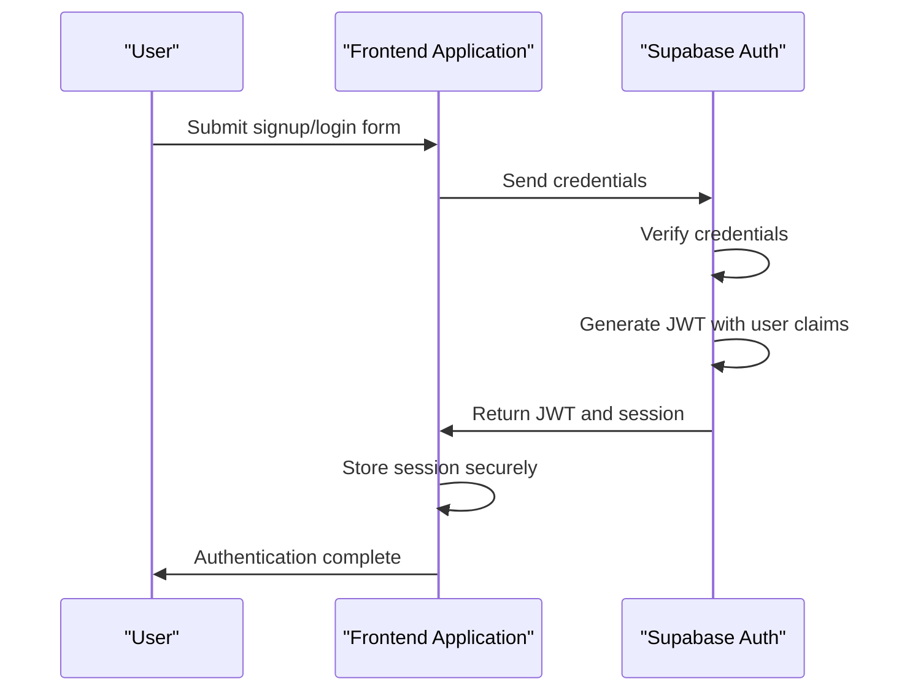
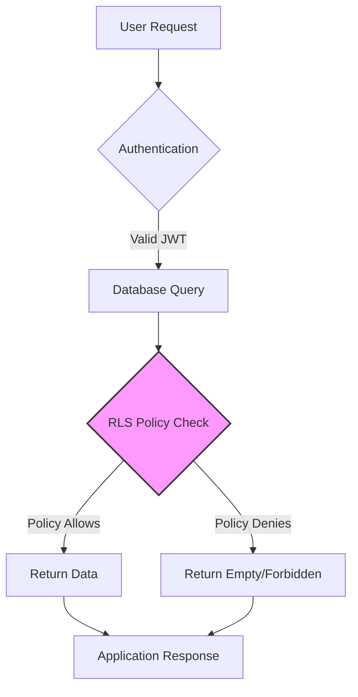
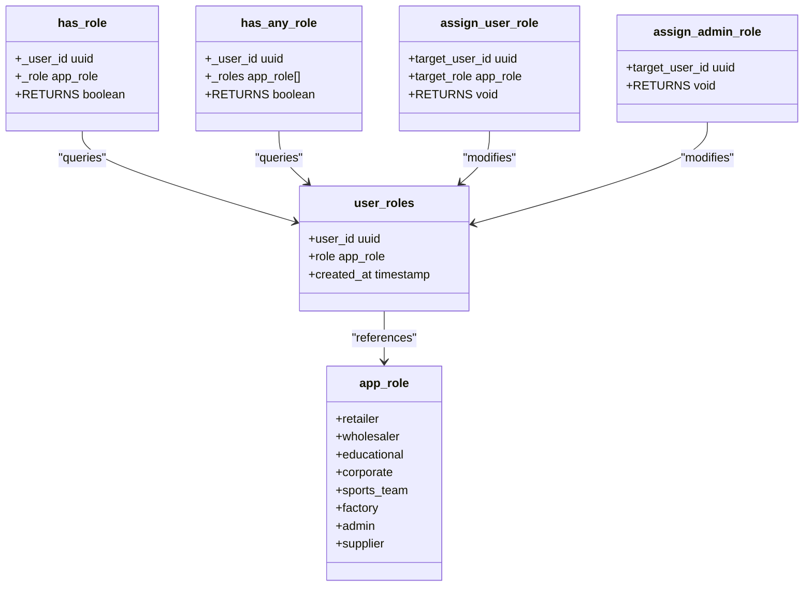
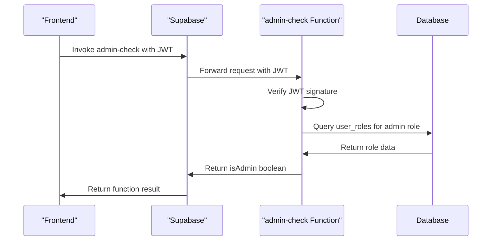

# Security Model

<cite>
**Referenced Files in This Document**   
- [COMPLETE_SETUP.sql](file://supabase/COMPLETE_SETUP.sql)
- [TABLES_ONLY.sql](file://supabase/TABLES_ONLY.sql)
- [BASE_MIGRATION_SAFE.sql](file://supabase/BASE_MIGRATION_SAFE.sql)
- [admin-check/index.ts](file://supabase/functions/admin-check/index.ts)
- [useAdminAuth.ts](file://src/hooks/useAdminAuth.ts)
- [client.ts](file://src/integrations/supabase/client.ts)
- [env-validator.ts](file://src/lib/env-validator.ts)
- [config.toml](file://supabase/config.toml)
- [seed.sql](file://supabase/seed.sql)
</cite>

## Table of Contents
1. [Introduction](#introduction)
2. [Authentication with Supabase Auth](#authentication-with-supabase-auth)
3. [Authorization via Row-Level Security](#authorization-via-row-level-security)
4. [Role-Based Access Control](#role-based-access-control)
5. [Serverless Function Security](#serverless-function-security)
6. [Environment Variable Protection](#environment-variable-protection)
7. [Security Implementation Examples](#security-implementation-examples)
8. [Common Security Issues and Solutions](#common-security-issues-and-solutions)
9. [Conclusion](#conclusion)

## Introduction

The security model of sleekapp-v100 is a multi-layered approach designed to protect user data, ensure proper access control, and maintain system integrity. The architecture combines Supabase Auth for user authentication, Row-Level Security (RLS) policies for data access control, role-based permissions, and serverless functions for secure operations. This document explains each security layer in detail, providing both conceptual overviews for beginners and technical details for experienced developers.

The system implements a robust role-based access control mechanism using the `app_role` enum with values including admin, supplier, retailer, and other business-specific roles. Security is enforced at multiple levels: authentication verifies user identity, authorization determines what authenticated users can access based on their roles, and function-level access control ensures sensitive operations are properly protected.

**Section sources**
- [COMPLETE_SETUP.sql](file://supabase/COMPLETE_SETUP.sql#L329-L8072)
- [TABLES_ONLY.sql](file://supabase/TABLES_ONLY.sql#L15-L24)

## Authentication with Supabase Auth

The authentication system in sleekapp-v100 is built on Supabase Auth, which provides secure user management and session handling. When a user signs up or logs in, Supabase Auth verifies their credentials and issues a JSON Web Token (JWT) that contains user information and permissions. This JWT is then used for subsequent requests to authenticate the user.

The authentication flow begins with user registration through dedicated signup forms for customers and production partners. During signup, user profile information is captured and stored securely. The system includes a security enhancement that automatically defaults new users to the 'retailer' role regardless of any client-supplied role information, preventing role escalation attacks during registration.



**Diagram sources**
- [client.ts](file://src/integrations/supabase/client.ts#L1-L20)
- [COMPLETE_SETUP.sql](file://supabase/COMPLETE_SETUP.sql#L329-L348)

**Section sources**
- [client.ts](file://src/integrations/supabase/client.ts#L1-L20)
- [CustomerSignupForm.tsx](file://src/components/auth/CustomerSignupForm.tsx)
- [ProductionPartnerSignupForm.tsx](file://src/components/auth/ProductionPartnerSignupForm.tsx)

## Authorization via Row-Level Security

Row-Level Security (RLS) is the cornerstone of data protection in sleekapp-v100, ensuring that users can only access data they are authorized to see. RLS policies are implemented at the database level in PostgreSQL, providing a robust security layer that cannot be bypassed by application logic.

The system employs a comprehensive set of RLS policies across various tables to enforce data isolation based on user roles and ownership. For example, the `work_orders` table has policies that restrict suppliers to only view and update work orders associated with their supplier account:

```sql
CREATE POLICY "Suppliers can view their work orders" ON public.work_orders
  FOR SELECT USING (
    supplier_id IN (SELECT id FROM public.suppliers WHERE user_id = auth.uid())
  );

CREATE POLICY "Suppliers can update their work orders" ON public.work_orders
  FOR UPDATE USING (
    supplier_id IN (SELECT id FROM public.suppliers WHERE user_id = auth.uid())
  );
```

Similarly, the messaging system implements RLS to ensure users can only access messages where they are either the sender or recipient:

```sql
CREATE POLICY "Users can view their messages" ON public.messages
  FOR SELECT USING (sender_id = auth.uid() OR recipient_id = auth.uid());

CREATE POLICY "Users can send messages" ON public.messages
  FOR INSERT WITH CHECK (sender_id = auth.uid());
```

These policies are enforced at the database level, meaning that even if an attacker gains access to the application layer, they cannot retrieve data they are not authorized to access. The system also includes policies for CMS content, payment history, and other sensitive data, with appropriate restrictions based on user roles.



**Diagram sources**
- [COMPLETE_SETUP.sql](file://supabase/COMPLETE_SETUP.sql#L6893-L6911)
- [migrations/20251120233928_2016afb8-d720-4858-9e12-7fb4ebbd5de0.sql](file://supabase/migrations/20251120233928_2016afb8-d720-4858-9e12-7fb4ebbd5de0.sql#L156-L173)

**Section sources**
- [COMPLETE_SETUP.sql](file://supabase/COMPLETE_SETUP.sql#L6893-L6926)
- [migrations/20251120233928_2016afb8-d720-4858-9e12-7fb4ebbd5de0.sql](file://supabase/migrations/20251120233928_2016afb8-d720-4858-9e12-7fb4ebbd5de0.sql#L156-L189)

## Role-Based Access Control

The role-based access control system in sleekapp-v100 is centered around the `app_role` enum type, which defines the various user roles within the application. The available roles include: retailer, wholesaler, educational, corporate, sports_team, factory, admin, and supplier. This enum ensures type safety and prevents invalid role assignments.

The system implements several security-critical functions to manage and verify user roles:

- `has_role(_user_id uuid, _role app_role)`: Returns boolean indicating if a user has a specific role
- `has_any_role(_user_id uuid, _roles app_role[])`: Returns boolean indicating if a user has any of the specified roles
- `assign_user_role(target_user_id uuid, target_role app_role)`: Allows admins to assign non-admin roles to users
- `assign_admin_role(target_user_id uuid)`: Special function for assigning admin role with additional security checks

The `has_role()` function is particularly important as it is used throughout RLS policies to determine access permissions. For example, the policy for CMS content management uses this function to restrict access to admins:

```sql
CREATE POLICY "Admins can manage CMS content" ON public.cms_content
  FOR ALL USING (public.has_role(auth.uid(), 'admin'::public.app_role));
```

Role assignment is tightly controlled to prevent privilege escalation. The `assign_user_role` function includes security checks that:
1. Verify the calling user is an admin
2. Prevent assignment of the admin role through this function (requiring the separate `assign_admin_role` function)
3. Validate that the target user exists

User roles are stored in the `user_roles` table with a composite primary key of user_id and role, preventing duplicate role assignments. The system also includes a trigger function `handle_new_user_role()` that automatically assigns roles based on signup metadata, ensuring consistent role assignment during user creation.



**Diagram sources**
- [TABLES_ONLY.sql](file://supabase/TABLES_ONLY.sql#L15-L24)
- [BASE_MIGRATION_SAFE.sql](file://supabase/BASE_MIGRATION_SAFE.sql#L370-L378)
- [BASE_MIGRATION_SAFE.sql](file://supabase/BASE_MIGRATION_SAFE.sql#L137-L162)

**Section sources**
- [TABLES_ONLY.sql](file://supabase/TABLES_ONLY.sql#L15-L24)
- [BASE_MIGRATION_SAFE.sql](file://supabase/BASE_MIGRATION_SAFE.sql#L121-L378)

## Serverless Function Security

Serverless functions in sleekapp-v100 implement an additional layer of security for sensitive operations, acting as gatekeepers for privileged functionality. These functions run in a secure environment and can perform operations that would be unsafe to expose directly to client applications.

The `admin-check` function is a critical security component that verifies whether a user has admin privileges. This function runs on the server side and performs the following steps:
1. Validates the authorization header containing the JWT
2. Extracts the user information from the JWT
3. Queries the database to check if the user has the 'admin' role
4. Returns a boolean response indicating admin status

```typescript
// supabase/functions/admin-check/index.ts
const { data: { user } } = await supabaseClient.auth.getUser();

const { data: roles, error } = await supabaseClient
  .from('user_roles')
  .select('role')
  .eq('user_id', user.id)
  .eq('role', 'admin')
  .limit(1);

const isAdmin = Array.isArray(roles) && roles.length > 0;
```

The function is configured in `supabase/config.toml` with `verify_jwt = true`, ensuring that only requests with valid JWTs can invoke it:

```toml
[functions.admin-check]
verify_jwt = true
```

Client applications use the `useAdminAuth` hook to securely check admin status without exposing sensitive logic to the frontend:

```typescript
// src/hooks/useAdminAuth.ts
const { data, error } = await supabase.functions.invoke('admin-check', {
  headers: {
    Authorization: `Bearer ${session.access_token}`,
  },
});
```

This approach ensures that admin status verification happens server-side, preventing clients from bypassing security checks. The system also includes other secure functions like `bootstrap-admin` for initial admin setup and `log-audit-action` for recording security-relevant events.



**Diagram sources**
- [admin-check/index.ts](file://supabase/functions/admin-check/index.ts#L1-L74)
- [useAdminAuth.ts](file://src/hooks/useAdminAuth.ts#L1-L47)
- [config.toml](file://supabase/config.toml#L15-L17)

**Section sources**
- [admin-check/index.ts](file://supabase/functions/admin-check/index.ts#L1-L74)
- [useAdminAuth.ts](file://src/hooks/useAdminAuth.ts#L1-L47)
- [config.toml](file://supabase/config.toml#L1-L73)

## Environment Variable Protection

Environment variable protection in sleekapp-v100 is implemented through a combination of secure storage, validation, and runtime protection mechanisms. The system ensures that sensitive configuration data such as Supabase URLs and API keys are properly protected from unauthorized access.

The `env-validator.ts` module implements comprehensive validation of environment variables at application startup. This class validates that required variables exist, have proper formats, and meet security requirements:

```typescript
class EnvironmentValidator {
  private validateRequired(key: string): void {
    const value = import.meta.env[key];
    if (!value || value.trim() === '') {
      this.errors.push(`❌ Missing required environment variable: ${key}`);
    }
  }

  private validateUrl(key: string): void {
    try {
      new URL(value);
    } catch {
      this.errors.push(`❌ Invalid URL format for ${key}: ${value}`);
    }
  }

  private validateSupabaseKey(key: string): void {
    if (value.length < 20) {
      this.errors.push(`❌ ${key} appears to be too short (expected JWT-like key)`);
    }
  }
}
```

The system uses a `.env.local` file for local development, which is git-ignored to prevent accidental exposure of credentials. The `update-supabase-key.sh` script provides a safe way to update the Supabase key without manually editing environment files:

```bash
#!/bin/bash
cat > .env.local << EOF
VITE_SUPABASE_URL=https://eqpftggctumujhutomom.supabase.co
VITE_SUPABASE_PUBLISHABLE_KEY=$ANON_KEY
EOF
```

In production, environment variables are stored securely in the hosting platform's configuration system. The validator automatically runs in production mode to ensure all required variables are present and valid before the application starts, failing fast if security requirements are not met.

**Section sources**
- [env-validator.ts](file://src/lib/env-validator.ts#L1-L142)
- [update-supabase-key.sh](file://update-supabase-key.sh#L1-L54)
- [client.ts](file://src/integrations/supabase/client.ts#L1-L20)

## Security Implementation Examples

This section provides practical examples of common security patterns implemented in sleekapp-v100, demonstrating how the various security layers work together to protect the application.

### Protecting Admin-Only Functions

The `AdminAnalytics` page demonstrates how to protect admin-only functionality using both client-side checks and server-side validation:

```typescript
// src/pages/AdminAnalytics.tsx
const checkAdminAndFetchData = async () => {
  const { data: { session } } = await supabase.auth.getSession();
  
  // Client-side role check
  const { data: roleData } = await roleHelpers.getUserRole(session.user.id);
  
  if (roleData?.role !== 'admin') {
    toast.error("Access denied. Admin only.");
    navigate("/dashboard");
    return;
  }
  
  setIsAdmin(true);
  await fetchAnalytics();
};
```

This implementation combines:
1. Authentication check to ensure the user is logged in
2. Role verification to confirm admin status
3. Redirect to a safe location if access is denied
4. UI rendering only after successful authorization

### Restricting Supplier Data Access

The RLS policy for supplier work orders demonstrates how to restrict data access based on ownership:

```sql
CREATE POLICY "Suppliers can view their work orders" ON public.work_orders
  FOR SELECT USING (
    supplier_id IN (SELECT id FROM public.suppliers WHERE user_id = auth.uid())
  );
```

This policy ensures that suppliers can only access work orders associated with their supplier account by:
1. Getting the current user's ID from the JWT (`auth.uid()`)
2. Finding the supplier record associated with that user
3. Only allowing access to work orders where the supplier_id matches

### Secure Function Invocation

The pattern for securely invoking the admin-check function shows proper authentication and error handling:

```typescript
const { data, error } = await supabase.functions.invoke('admin-check', {
  headers: {
    Authorization: `Bearer ${session.access_token}`,
  },
});

if (error) {
  console.error('Admin check failed:', error);
  setIsAdmin(false);
} else {
  setIsAdmin(data?.isAdmin || false);
}
```

Best practices demonstrated:
1. Including the JWT in the Authorization header
2. Proper error handling to prevent information leakage
3. Defaulting to least privilege (false) on error
4. Using the service role for sensitive operations

**Section sources**
- [AdminAnalytics.tsx](file://src/pages/AdminAnalytics.tsx#L1-L200)
- [COMPLETE_SETUP.sql](file://supabase/COMPLETE_SETUP.sql#L6893-L6895)
- [useAdminAuth.ts](file://src/hooks/useAdminAuth.ts#L1-L47)

## Common Security Issues and Solutions

This section addresses common security issues in web applications and how sleekapp-v100 addresses them.

### Role Escalation During Registration

**Issue**: Attackers might attempt to register with elevated privileges by manipulating client-side role parameters.

**Solution**: The system implements a security fix that ignores client-supplied role information during registration and defaults all new users to the 'retailer' role:

```sql
-- SECURITY FIX: Always default to 'retailer', ignore client-supplied role
INSERT INTO public.user_roles (user_id, role)
VALUES (new.id, 'retailer'::public.app_role);
```

Admin roles must be assigned through a separate, secure admin-only function, preventing self-assignment of elevated privileges.

### Overly Permissive RLS Policies

**Issue**: Insecure default policies might allow unauthorized data access.

**Solution**: The system actively removes overly permissive policies and replaces them with restrictive ones:

```sql
-- Drop the dangerous public DELETE policy
DROP POLICY IF EXISTS "production_stages_delete_policy" ON public.production_stages;

-- Drop the public UPDATE policy
DROP POLICY IF EXISTS "production_stages_update_policy" ON public.production_stages;
```

Only properly restrictive policies that scope access to authenticated users with appropriate permissions are maintained.

### Insecure Function Exposure

**Issue**: Serverless functions might be accessible without proper authentication.

**Solution**: Functions are configured with appropriate JWT verification settings in `config.toml`:

```toml
[functions.admin-check]
verify_jwt = true

[functions.stripe-webhook]
verify_jwt = false
```

Functions that require authentication have `verify_jwt = true`, ensuring only requests with valid JWTs can invoke them, while webhook receivers that need to accept external requests have it disabled.

### Environment Variable Exposure

**Issue**: Sensitive configuration data might be exposed through client-side code or version control.

**Solution**: The system implements multiple protections:
1. Environment variables are validated at runtime
2. The `.env.local` file is git-ignored
3. A dedicated script (`update-supabase-key.sh`) provides safe updates
4. Production variables are stored in the hosting platform's secure configuration

**Section sources**
- [COMPLETE_SETUP.sql](file://supabase/COMPLETE_SETUP.sql#L342-L345)
- [COMPLETE_SETUP.sql](file://supabase/COMPLETE_SETUP.sql#L6546-L6567)
- [config.toml](file://supabase/config.toml#L1-L73)
- [env-validator.ts](file://src/lib/env-validator.ts#L1-L142)

## Conclusion

The security model of sleekapp-v100 provides a comprehensive, multi-layered approach to protecting user data and system integrity. By combining Supabase Auth for authentication, Row-Level Security for data access control, role-based permissions, and secure serverless functions, the system creates multiple defense layers that work together to prevent unauthorized access.

Key security features include:
- Strict role-based access control using the `app_role` enum
- Comprehensive RLS policies that enforce data isolation
- Secure serverless functions for privileged operations
- Environment variable protection and validation
- Protection against common vulnerabilities like role escalation

The implementation follows security best practices by defaulting to least privilege, validating inputs, and failing securely. The system is designed to be both secure and maintainable, with clear separation of concerns between authentication, authorization, and data access layers.

For developers working with the system, it's important to understand that security is enforced at multiple levels and that bypassing one layer (such as client-side checks) does not compromise the system due to the additional server-side and database-level protections. Always use the provided security functions and patterns rather than implementing custom solutions to maintain consistency and security across the application.