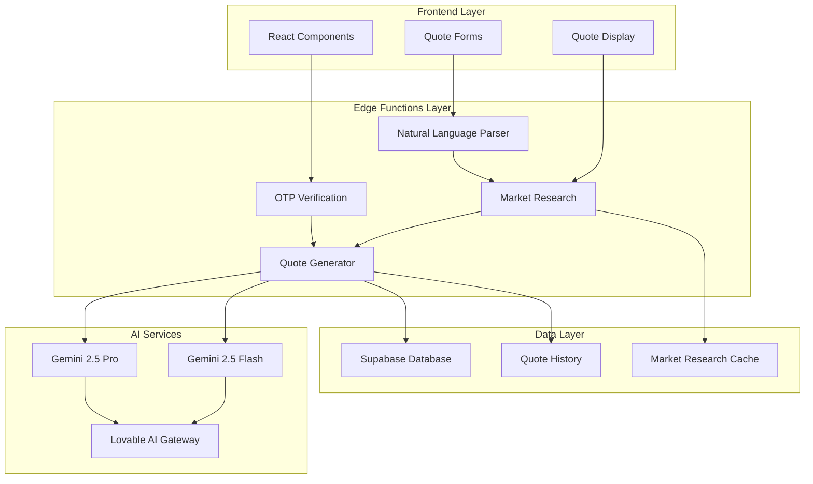
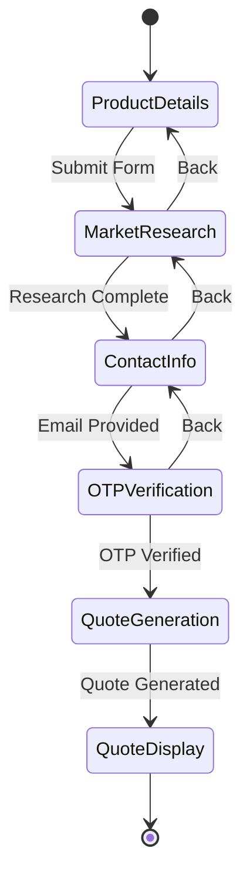
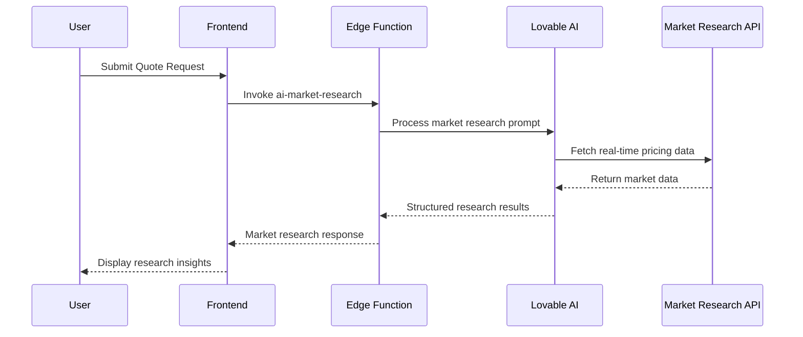
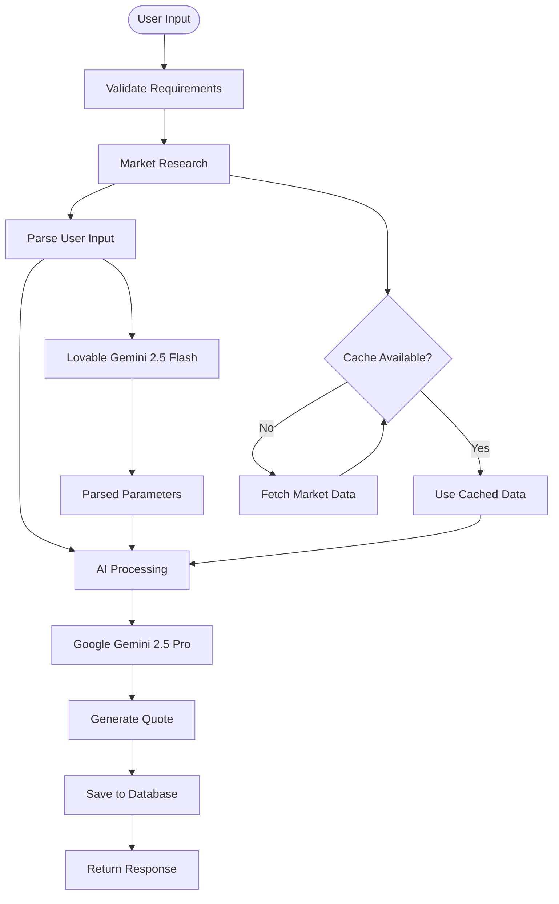
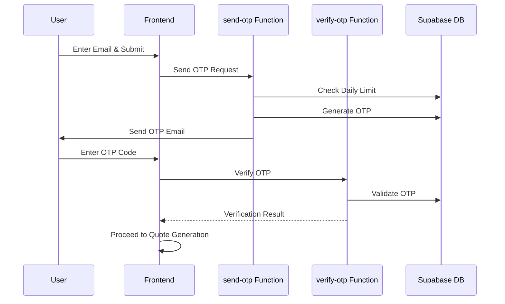
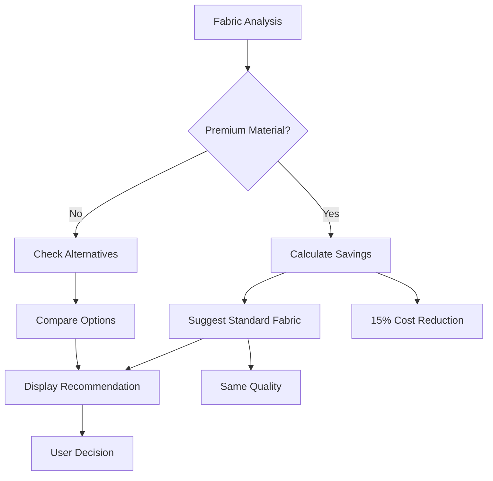
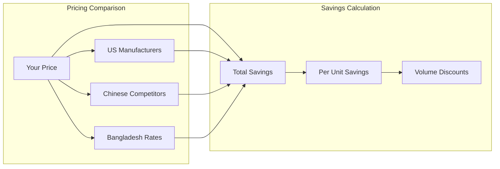
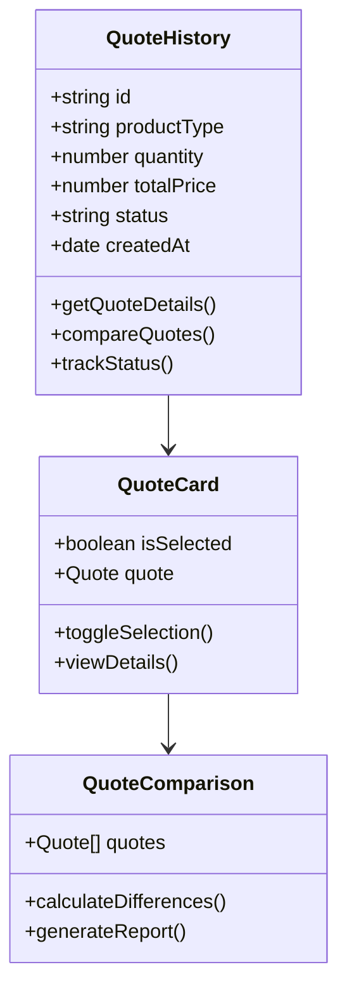

# AI Quote Generator

<cite>
**Referenced Files in This Document**
- [ConversationalQuoteBuilder.tsx](file://src/components/quote/ConversationalQuoteBuilder.tsx)
- [AIQuoteGeneratorWithOTP.tsx](file://src/components/AIQuoteGeneratorWithOTP.tsx)
- [NaturalLanguageQuoteInput.tsx](file://src/components/quote/NaturalLanguageQuoteInput.tsx)
- [PriceComparison.tsx](file://src/components/quote/PriceComparison.tsx)
- [SmartRecommendations.tsx](file://src/components/quote/SmartRecommendations.tsx)
- [MarketResearchInsights.tsx](file://src/components/quote/MarketResearchInsights.tsx)
- [InteractiveQuoteDisplay.tsx](file://src/components/quote/InteractiveQuoteDisplay.tsx)
- [QuoteHistoryCard.tsx](file://src/components/quote/QuoteHistoryCard.tsx)
- [ai-conversational-quote/index.ts](file://supabase/functions/ai-conversational-quote/index.ts)
- [parse-quote-description/index.ts](file://supabase/functions/parse-quote-description/index.ts)
- [aiQuote.ts](file://src/lib/api/aiQuote.ts)
- [bangladeshManufacturing.ts](file://src/lib/bangladeshManufacturing.ts)
- [QuoteGenerator.tsx](file://src/pages/QuoteGenerator.tsx)
</cite>

## Table of Contents
1. [Introduction](#introduction)
2. [System Architecture](#system-architecture)
3. [Core Components](#core-components)
4. [AI Pipeline Implementation](#ai-pipeline-implementation)
5. [Security and Verification](#security-and-verification)
6. [Data Flow Patterns](#data-flow-patterns)
7. [Smart Recommendation Engine](#smart-recommendation-engine)
8. [Price Comparison and Benchmarking](#price-comparison-and-benchmarking)
9. [Historical Quote Management](#historical-quote-management)
10. [Technical Implementation Details](#technical-implementation-details)
11. [Performance Considerations](#performance-considerations)
12. [Troubleshooting Guide](#troubleshooting-guide)
13. [Conclusion](#conclusion)

## Introduction

The AI Quote Generator is a sophisticated conversational pricing system that leverages artificial intelligence to provide instant, market-researched quotes for apparel manufacturing. Built on a modern React frontend with Supabase Edge Functions backend, this system combines natural language processing, real-time market research, and intelligent pricing algorithms to deliver accurate, competitive quotes within seconds.

The system serves as a bridge between customers seeking apparel manufacturing solutions and verified Bangladesh-based factories, offering transparency, speed, and competitive pricing through advanced AI capabilities. It transforms traditional quote generation from a manual, time-consuming process into an automated, intelligent experience.

## System Architecture

The AI Quote Generator follows a microservices architecture with clear separation between frontend components, backend Edge Functions, and data storage layers.

**Diagram sources**
- [ConversationalQuoteBuilder.tsx](file://src/components/quote/ConversationalQuoteBuilder.tsx#L1-L363)
- [AIQuoteGeneratorWithOTP.tsx](file://src/components/AIQuoteGeneratorWithOTP.tsx#L1-L1046)
- [ai-conversational-quote/index.ts](file://supabase/functions/ai-conversational-quote/index.ts#L1-L385)

**Section sources**
- [ConversationalQuoteBuilder.tsx](file://src/components/quote/ConversationalQuoteBuilder.tsx#L1-L363)
- [AIQuoteGeneratorWithOTP.tsx](file://src/components/AIQuoteGeneratorWithOTP.tsx#L1-L1046)

## Core Components

### ConversationalQuoteBuilder

The primary interface component that guides users through the quote generation process with a conversational approach. It handles form collection, market research coordination, and quote display.

**Diagram sources**
- [ConversationalQuoteBuilder.tsx](file://src/components/quote/ConversationalQuoteBuilder.tsx#L43-L363)

### NaturalLanguageQuoteInput

Enables users to describe their requirements in plain English, which is automatically parsed into structured quote parameters using AI-powered natural language processing.

### SmartRecommendations

Provides intelligent suggestions for optimizing quotes based on volume discounts, material alternatives, timeline adjustments, and risk mitigation strategies.

**Section sources**
- [ConversationalQuoteBuilder.tsx](file://src/components/quote/ConversationalQuoteBuilder.tsx#L43-L363)
- [NaturalLanguageQuoteInput.tsx](file://src/components/quote/NaturalLanguageQuoteInput.tsx#L1-L131)
- [SmartRecommendations.tsx](file://src/components/quote/SmartRecommendations.tsx#L1-L137)

## AI Pipeline Implementation

### Market Research Integration

The system integrates with real-time market research APIs to gather current pricing data from verified Bangladesh manufacturers.

**Diagram sources**
- [ai-conversational-quote/index.ts](file://supabase/functions/ai-conversational-quote/index.ts#L149-L192)

### Quote Generation Pipeline

The core AI pipeline processes user requirements through multiple stages to generate intelligent pricing.

**Diagram sources**
- [ai-conversational-quote/index.ts](file://supabase/functions/ai-conversational-quote/index.ts#L196-L285)
- [parse-quote-description/index.ts](file://supabase/functions/parse-quote-description/index.ts#L33-L126)

**Section sources**
- [ai-conversational-quote/index.ts](file://supabase/functions/ai-conversational-quote/index.ts#L149-L285)
- [parse-quote-description/index.ts](file://supabase/functions/parse-quote-description/index.ts#L33-L126)

## Security and Verification

### OTP Verification System

The system implements a robust OTP (One-Time Password) verification mechanism to prevent abuse and ensure legitimate quote requests.

**Diagram sources**
- [AIQuoteGeneratorWithOTP.tsx](file://src/components/AIQuoteGeneratorWithOTP.tsx#L175-L344)

### Rate Limiting and Abuse Prevention

The system implements multiple layers of protection including IP-based rate limiting, email-based request limits, and CAPTCHA verification.

**Section sources**
- [AIQuoteGeneratorWithOTP.tsx](file://src/components/AIQuoteGeneratorWithOTP.tsx#L175-L344)
- [ai-conversational-quote/index.ts](file://supabase/functions/ai-conversational-quote/index.ts#L42-L146)

## Data Flow Patterns

### Quote Generation Workflow

The system follows a structured data flow pattern that ensures consistency and reliability across all quote generation processes.

```mermaid
flowchart LR
subgraph "Input Collection"
A[Product Details] --> B[Quantity & Fabric]
B --> C[Complexity Level]
C --> D[Additional Requirements]
end
subgraph "Processing Pipeline"
E[Market Research] --> F[AI Analysis]
F --> G[Pricing Calculation]
G --> H[Timeline Estimation]
end
subgraph "Output Generation"
I[Quote Structure] --> J[Price Breakdown]
J --> K[Recommendations]
K --> L[Suggestions]
end
D --> E
H --> I
L --> M[Final Quote]
```

**Diagram sources**
- [ai-conversational-quote/index.ts](file://supabase/functions/ai-conversational-quote/index.ts#L196-L285)
- [bangladeshManufacturing.ts](file://src/lib/bangladeshManufacturing.ts#L99-L309)

### Historical Data Management

The system maintains comprehensive historical records of all quote requests and responses for future reference and trend analysis.

**Section sources**
- [ai-conversational-quote/index.ts](file://supabase/functions/ai-conversational-quote/index.ts#L288-L313)
- [aiQuote.ts](file://src/lib/api/aiQuote.ts#L216-L274)

## Smart Recommendation Engine

### Material Alternatives

The recommendation engine analyzes fabric choices and suggests cost-effective alternatives while maintaining quality standards.

**Diagram sources**
- [SmartRecommendations.tsx](file://src/components/quote/SmartRecommendations.tsx#L44-L72)

### Volume Optimization

The system identifies optimal order quantities that maximize volume discounts while minimizing premium charges.

### Timeline Flexibility

Recommendations for adjusting production timelines to optimize costs and improve delivery schedules.

**Section sources**
- [SmartRecommendations.tsx](file://src/components/quote/SmartRecommendations.tsx#L29-L137)
- [bangladeshManufacturing.ts](file://src/lib/bangladeshManufacturing.ts#L212-L309)

## Price Comparison and Benchmarking

### Competitive Pricing Analysis

The system provides comprehensive price comparisons against industry benchmarks and competitor pricing.

**Diagram sources**
- [PriceComparison.tsx](file://src/components/quote/PriceComparison.tsx#L1-L124)

### Market Positioning

The system highlights the competitive advantages of Bangladesh manufacturing, emphasizing quality, cost-effectiveness, and reliability.

**Section sources**
- [PriceComparison.tsx](file://src/components/quote/PriceComparison.tsx#L1-L124)

## Historical Quote Management

### Quote Tracking and History

Users can track their quote history, compare previous requests, and monitor the status of their quote submissions.

**Diagram sources**
- [QuoteHistoryCard.tsx](file://src/components/quote/QuoteHistoryCard.tsx#L1-L130)

### Quote Export and Sharing

The system enables easy export and sharing of quotes through multiple channels including email, WhatsApp, and direct links.

**Section sources**
- [QuoteHistoryCard.tsx](file://src/components/quote/QuoteHistoryCard.tsx#L1-L130)
- [aiQuote.ts](file://src/lib/api/aiQuote.ts#L216-L274)

## Technical Implementation Details

### Backend Edge Function Architecture

The backend consists of specialized Edge Functions that handle different aspects of the quote generation process.

| Function | Purpose | AI Model | Input Parameters |
|----------|---------|----------|------------------|
| `ai-conversational-quote` | Main quote generation | Gemini 2.5 Pro | Product details, market research, user context |
| `parse-quote-description` | Natural language parsing | Gemini 2.5 Flash | Raw description text |
| `ai-market-research` | Market data retrieval | Gemini 2.5 Pro | Product type, quantity, fabric |
| `send-otp` | OTP generation and sending | N/A | Email, country, type |
| `verify-otp` | OTP validation | N/A | Email, OTP code, type |

### Data Structures and Types

The system uses strongly typed interfaces to ensure data consistency and prevent runtime errors.

**Section sources**
- [ai-conversational-quote/index.ts](file://supabase/functions/ai-conversational-quote/index.ts#L11-L24)
- [aiQuote.ts](file://src/lib/api/aiQuote.ts#L6-L26)

## Performance Considerations

### Caching Strategies

The system implements intelligent caching mechanisms to reduce latency and improve user experience:

- **Market Research Cache**: Stores recent market data to avoid redundant API calls
- **Quote Session Cache**: Maintains user session data for seamless navigation
- **AI Response Cache**: Caches AI-generated responses for similar inputs

### Optimization Techniques

- **Parallel Processing**: Market research and AI processing occur concurrently
- **Lazy Loading**: Components load only when needed to improve initial page load
- **Retry Logic**: Automatic retry mechanisms handle transient failures gracefully

### Scalability Features

- **Edge Function Deployment**: Functions deploy globally for low-latency access
- **Database Optimization**: Indexed queries and optimized schemas for fast data retrieval
- **Rate Limiting**: Prevents abuse while maintaining system stability

## Troubleshooting Guide

### Common Issues and Solutions

**Quote Generation Failures**
- Verify internet connectivity and API availability
- Check OTP verification status
- Ensure all required fields are completed
- Review rate limit status

**Market Research Errors**
- Confirm product type and quantity are valid
- Check fabric type spelling and availability
- Verify complexity level selection
- Review additional requirements formatting

**AI Parsing Issues**
- Use clear, specific language in natural language descriptions
- Include essential details like product type, quantity, and fabric
- Avoid ambiguous terms or incomplete sentences
- Check character limits for descriptions

### Debugging Tools

The system provides built-in debugging capabilities for development and troubleshooting:

- **Console Logging**: Comprehensive logging throughout the pipeline
- **Error Boundaries**: Graceful error handling with user-friendly messages
- **Development Mode**: Special handling for development environments
- **Retry Mechanisms**: Automatic retry logic for transient failures

**Section sources**
- [ai-conversational-quote/index.ts](file://supabase/functions/ai-conversational-quote/index.ts#L371-L384)
- [parse-quote-description/index.ts](file://supabase/functions/parse-quote-description/index.ts#L116-L126)

## Conclusion

The AI Quote Generator represents a significant advancement in apparel manufacturing quote generation, combining cutting-edge AI technology with practical business logic to deliver exceptional user experiences. Through its conversational interface, intelligent recommendation engine, and robust security measures, the system democratizes access to professional manufacturing quotes while maintaining the highest standards of accuracy and reliability.

The modular architecture ensures scalability and maintainability, while the comprehensive data flow patterns guarantee consistency across all quote generation processes. The integration of real-time market research, competitive pricing analysis, and historical quote management creates a powerful platform that empowers businesses to make informed decisions quickly and confidently.

As the system continues to evolve, it sets a new standard for AI-powered quote generation, demonstrating how advanced technologies can transform traditional business processes into efficient, transparent, and user-friendly experiences.