# Conversational Quote Builder

<cite>
**Referenced Files in This Document**
- [ConversationalQuoteBuilder.tsx](file://src/components/quote/ConversationalQuoteBuilder.tsx)
- [NaturalLanguageQuoteInput.tsx](file://src/components/quote/NaturalLanguageQuoteInput.tsx)
- [AIAssistantChat.tsx](file://src/components/AIAssistantChat.tsx)
- [SmartReplyButtons.tsx](file://src/components/SmartReplyButtons.tsx)
- [AIQuoteGenerator.tsx](file://src/components/AIQuoteGenerator.tsx)
- [AIQuoteGeneratorWithOTP.tsx](file://src/components/AIQuoteGeneratorWithOTP.tsx)
- [useConversation.ts](file://src/hooks/useConversation.ts)
- [conversational-assistant/index.ts](file://supabase/functions/conversational-assistant/index.ts)
- [parse-quote-description/index.ts](file://supabase/functions/parse-quote-description/index.ts)
- [aiQuote.ts](file://src/lib/api/aiQuote.ts)
</cite>

## Table of Contents
1. [Introduction](#introduction)
2. [System Architecture](#system-architecture)
3. [Frontend Components](#frontend-components)
4. [AI-Powered Conversation Flow](#ai-powered-conversation-flow)
5. [Data Processing Pipeline](#data-processing-pipeline)
6. [Session Management](#session-management)
7. [Error Handling and Retry Logic](#error-handling-and-retry-logic)
8. [Integration Points](#integration-points)
9. [Performance Considerations](#performance-considerations)
10. [Troubleshooting Guide](#troubleshooting-guide)
11. [Conclusion](#conclusion)

## Introduction

The Conversational Quote Builder is an advanced AI-powered feature that enables users to generate instant quotes for custom apparel manufacturing through natural language interactions. This system combines sophisticated natural language understanding with real-time AI processing to provide an intuitive, multi-step conversation flow that guides users through the quoting process while maintaining data persistence and error resilience.

The system operates through multiple interconnected components: a frontend React application with conversational UI elements, Edge Functions for AI processing and data extraction, and backend services for quote generation and session management. Users can interact with the system through traditional form inputs or natural language descriptions, receiving structured quotes with detailed pricing, timelines, and manufacturing insights.

## System Architecture

The Conversational Quote Builder follows a distributed architecture pattern with clear separation of concerns across frontend, backend, and AI processing layers.

**Diagram sources**
- [ConversationalQuoteBuilder.tsx](file://src/components/quote/ConversationalQuoteBuilder.tsx#L43-L363)
- [AIAssistantChat.tsx](file://src/components/AIAssistantChat.tsx#L99-L337)
- [conversational-assistant/index.ts](file://supabase/functions/conversational-assistant/index.ts#L22-L621)

## Frontend Components

### ConversationalQuoteBuilder Component

The main component orchestrates the multi-step quote generation process through a structured workflow with three distinct phases.

**Diagram sources**
- [ConversationalQuoteBuilder.tsx](file://src/components/quote/ConversationalQuoteBuilder.tsx#L44-L363)

The component manages state for product specifications, market research results, and final quote data. It integrates with the AI market research service to provide contextual pricing information before quote generation.

**Section sources**
- [ConversationalQuoteBuilder.tsx](file://src/components/quote/ConversationalQuoteBuilder.tsx#L43-L363)

### NaturalLanguageQuoteInput Component

This component enables users to input product requirements in natural language, which is then processed by AI to extract structured data for quote generation.

**Diagram sources**
- [NaturalLanguageQuoteInput.tsx](file://src/components/quote/NaturalLanguageQuoteInput.tsx#L27-L75)
- [parse-quote-description/index.ts](file://supabase/functions/parse-quote-description/index.ts#L89-L126)

The component includes robust error handling with retry logic and provides user feedback through loading states and toast notifications.

**Section sources**
- [NaturalLanguageQuoteInput.tsx](file://src/components/quote/NaturalLanguageQuoteInput.tsx#L22-L131)

### AI Assistant Chat Interface

The AI Assistant provides real-time conversational guidance through an embedded chat interface with intelligent quick reply buttons.

**Diagram sources**
- [AIAssistantChat.tsx](file://src/components/AIAssistantChat.tsx#L9-L337)

**Section sources**
- [AIAssistantChat.tsx](file://src/components/AIAssistantChat.tsx#L99-L337)

### Smart Reply Buttons

Context-aware quick reply buttons enhance user experience by providing relevant response options based on the conversation context.

**Section sources**
- [SmartReplyButtons.tsx](file://src/components/SmartReplyButtons.tsx#L1-L68)

## AI-Powered Conversation Flow

### Conversational Assistant Function

The core AI processing is handled by the conversational-assistant Edge Function, which implements a sophisticated state machine for guiding users through the quote generation process.

**Diagram sources**
- [conversational-assistant/index.ts](file://supabase/functions/conversational-assistant/index.ts#L22-L621)

The function implements strict state validation to ensure logical conversation flow and provides fallback responses for unexpected inputs.

**Section sources**
- [conversational-assistant/index.ts](file://supabase/functions/conversational-assistant/index.ts#L22-L621)

### Data Extraction and Validation

The parse-quote-description function processes natural language descriptions to extract structured product specifications.

**Diagram sources**
- [parse-quote-description/index.ts](file://supabase/functions/parse-quote-description/index.ts#L89-L126)

**Section sources**
- [parse-quote-description/index.ts](file://supabase/functions/parse-quote-description/index.ts#L89-L126)

## Data Processing Pipeline

### Quote Generation Workflow

The AI quote generation process involves multiple stages of data processing, validation, and AI-driven pricing calculation.

**Diagram sources**
- [AIQuoteGenerator.tsx](file://src/components/AIQuoteGenerator.tsx#L123-L235)
- [AIQuoteGeneratorWithOTP.tsx](file://src/components/AIQuoteGeneratorWithOTP.tsx#L273-L327)

**Section sources**
- [AIQuoteGenerator.tsx](file://src/components/AIQuoteGenerator.tsx#L123-L235)
- [AIQuoteGeneratorWithOTP.tsx](file://src/components/AIQuoteGeneratorWithOTP.tsx#L273-L327)

### Session Persistence

The system maintains conversation state across browser sessions using localStorage with automatic synchronization to the backend database.

**Diagram sources**
- [useConversation.ts](file://src/hooks/useConversation.ts#L40-L62)

**Section sources**
- [useConversation.ts](file://src/hooks/useConversation.ts#L40-L62)

## Session Management

### Conversation State Management

The useConversation hook provides centralized state management for the conversational quote builder with automatic persistence and error handling.

**Diagram sources**
- [useConversation.ts](file://src/hooks/useConversation.ts#L5-L30)

**Section sources**
- [useConversation.ts](file://src/hooks/useConversation.ts#L32-L177)

### OTP Authentication Flow

The AIQuoteGeneratorWithOTP component implements a secure email verification process before quote generation.

**Diagram sources**
- [AIQuoteGeneratorWithOTP.tsx](file://src/components/AIQuoteGeneratorWithOTP.tsx#L175-L345)

**Section sources**
- [AIQuoteGeneratorWithOTP.tsx](file://src/components/AIQuoteGeneratorWithOTP.tsx#L175-L345)

## Error Handling and Retry Logic

### Comprehensive Error Management

The system implements multiple layers of error handling with intelligent retry mechanisms and user-friendly error messages.

```mermaid
flowchart TD
Request[API Request] --> Try{Try Operation}
Try --> |Success| Success[Return Result]
Try --> |Network Error| Network[Network Retry]
Try --> |Validation Error| Validation[Client-side Error]
Try --> |Server Error| Server[Server Retry]
Network --> Check{Retry Count < 3?}
Check --> |Yes| Wait[Wait 1s × retry]
Check --> |No| FinalError[Final Error]
Wait --> Try
Server --> CheckServer{Retryable?}
CheckServer --> |Yes| WaitServer[Wait 5s]
CheckServer --> |No| FinalError
WaitServer --> Try
Validation --> UserError[Show User Error]
FinalError --> UserError
UserError --> Log[Log Error]
```

**Diagram sources**
- [useConversation.ts](file://src/hooks/useConversation.ts#L121-L147)
- [NaturalLanguageQuoteInput.tsx](file://src/components/quote/NaturalLanguageQuoteInput.tsx#L37-L75)

### Retry Strategies

The system implements exponential backoff retry logic for transient failures with maximum retry limits and user notification.

**Section sources**
- [useConversation.ts](file://src/hooks/useConversation.ts#L121-L147)
- [NaturalLanguageQuoteInput.tsx](file://src/components/quote/NaturalLanguageQuoteInput.tsx#L37-L75)

## Integration Points

### API Endpoints

The system integrates with multiple Supabase Edge Functions for core functionality:

| Endpoint | Purpose | Input | Output |
|----------|---------|-------|--------|
| `conversational-assistant` | AI conversation processing | Messages, session context | AI response with quick replies |
| `parse-quote-description` | Natural language parsing | Product description | Structured quote data |
| `ai-quote-generator` | Quote generation | Product specifications | Calculated quote with timeline |
| `send-otp` | Email verification | Email, country | OTP code |
| `verify-otp` | OTP validation | OTP code, email | Verification result |

**Section sources**
- [aiQuote.ts](file://src/lib/api/aiQuote.ts#L230-L273)

### Data Flow Architecture

**Diagram sources**
- [AIQuoteGeneratorWithOTP.tsx](file://src/components/AIQuoteGeneratorWithOTP.tsx#L192-L304)

## Performance Considerations

### Optimization Strategies

The system implements several performance optimization techniques:

- **Lazy Loading**: Components are loaded on-demand to reduce initial bundle size
- **Caching**: Conversation state is cached locally and synced periodically
- **Progressive Loading**: Quote generation uses loading stages to provide user feedback
- **Debounced Input**: User input is debounced to reduce unnecessary API calls
- **Image Optimization**: File uploads are optimized for size and format

### Scalability Features

- **Rate Limiting**: Built-in rate limiting prevents abuse and ensures fair usage
- **Session Management**: Efficient session handling reduces database load
- **Edge Computing**: AI processing occurs at the edge to reduce latency
- **Graceful Degradation**: System continues functioning during temporary failures

## Troubleshooting Guide

### Common Issues and Solutions

| Issue | Symptoms | Solution |
|-------|----------|----------|
| Conversation not persisting | State lost on refresh | Check localStorage availability and permissions |
| AI responses slow | Long loading times | Verify internet connection and API availability |
| OTP verification fails | Email not received | Check spam folder and email format |
| Natural language parsing fails | Description not recognized | Simplify description and use clear language |
| Quote generation timeout | Request hangs | Reduce complexity or try again later |

### Debugging Tools

The system includes built-in diagnostic capabilities:

- **Console Logging**: Detailed logs for development and debugging
- **Error Boundaries**: Graceful error handling with user feedback
- **Health Checks**: Automatic monitoring of system components
- **Performance Metrics**: Tracking of response times and success rates

**Section sources**
- [AIQuoteGeneratorWithOTP.tsx](file://src/components/AIQuoteGeneratorWithOTP.tsx#L285-L338)

## Conclusion

The Conversational Quote Builder represents a sophisticated integration of AI, frontend engineering, and backend services that transforms traditional quote generation into an engaging, user-friendly experience. Through its multi-layered architecture, comprehensive error handling, and intelligent data processing, the system delivers reliable, scalable quote generation capabilities that adapt to various user interaction patterns.

The combination of natural language processing, conversational AI, and automated data extraction creates a seamless user experience that reduces friction while maintaining the precision required for professional manufacturing quotes. The system's robust error handling, session persistence, and retry logic ensure reliability across various network conditions and user scenarios.

Future enhancements could include expanded product categories, enhanced natural language understanding capabilities, and additional integration points with external systems for order management and fulfillment.