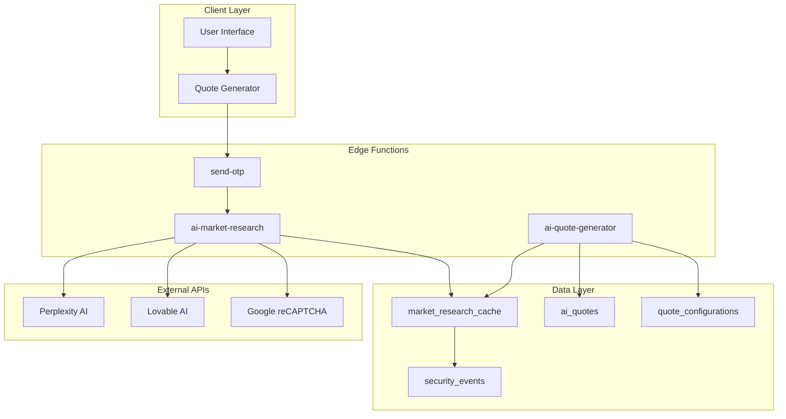
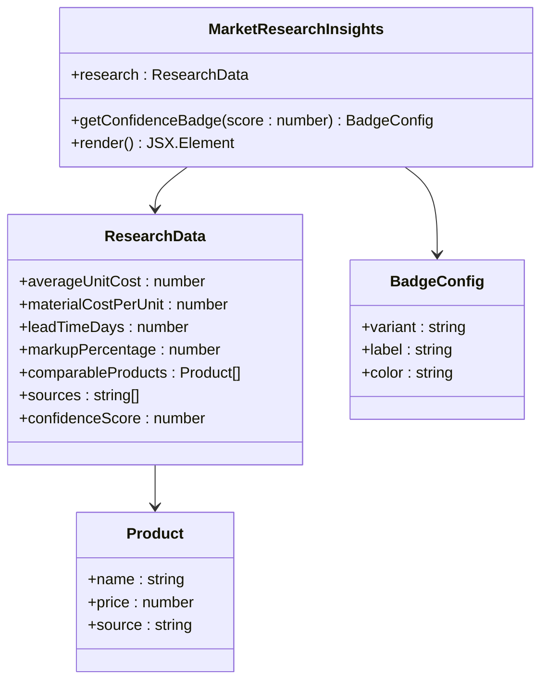
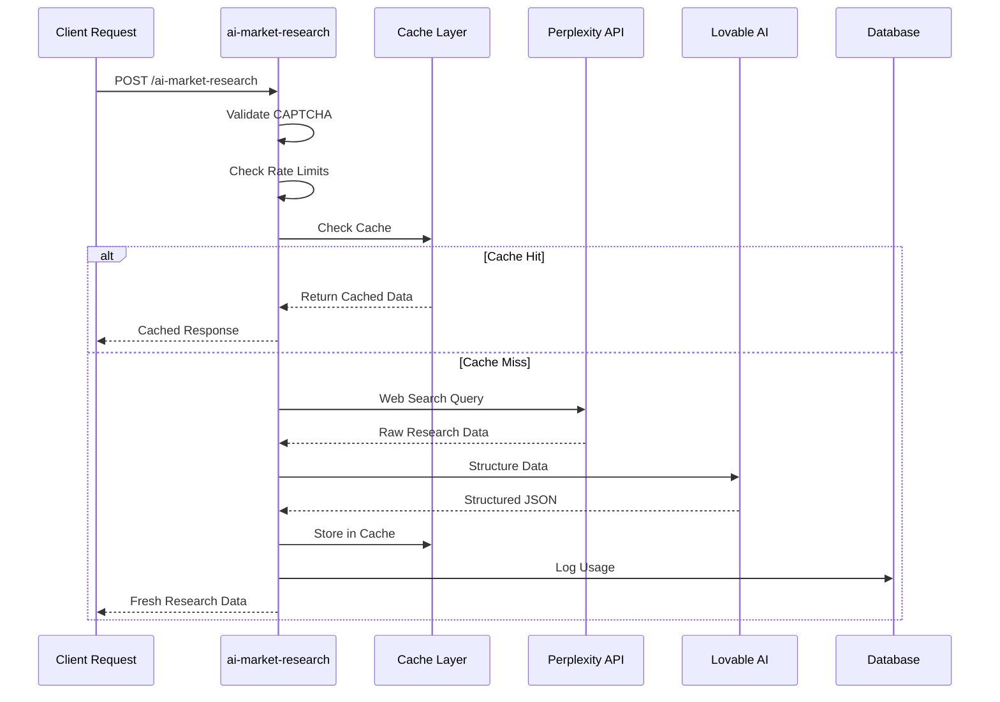
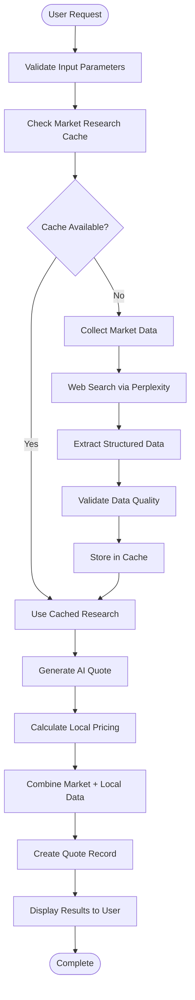
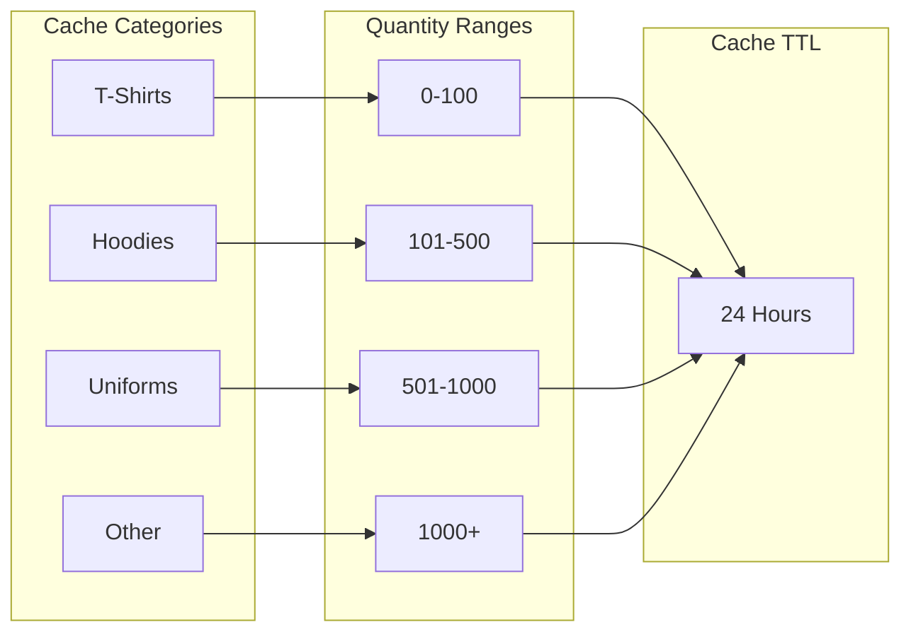
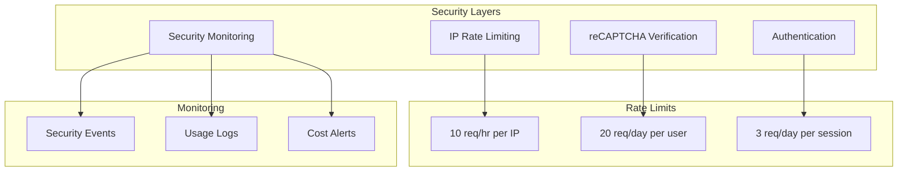

# Market Research Integration

<cite>
**Referenced Files in This Document**
- [MarketResearchInsights.tsx](file://src/components/quote/MarketResearchInsights.tsx)
- [ai-market-research/index.ts](file://supabase/functions/ai-market-research/index.ts)
- [InteractiveQuoteDisplay.tsx](file://src/components/quote/InteractiveQuoteDisplay.tsx)
- [bangladeshManufacturing.ts](file://src/lib/bangladeshManufacturing.ts)
- [aiQuote.ts](file://src/lib/api/aiQuote.ts)
- [AIQuoteGenerator.tsx](file://src/components/AIQuoteGenerator.tsx)
- [AIQuoteGeneratorWithOTP.tsx](file://src/components/AIQuoteGeneratorWithOTP.tsx)
- [4eda3cf0-ab6f-4305-a5fe-82a19c7948d3.sql](file://supabase/migrations/20251124164837_4eda3cf0-ab6f-4305-a5fe-82a19c7948d3.sql)
- [market_research_cache table schema](file://supabase/migrations/20251124164837_4eda3cf0-ab6f-4305-a5fe-82a19c7948d3.sql)
- [quote_configurations table schema](file://supabase/migrations/20251115150759_remix_migration_from_pg_dump.sql)
- [security_events table schema](file://supabase/migrations/20251127194411_08e21416-fb07-4471-a062-d1c8e91e52c3.sql)
</cite>

## Table of Contents
1. [Introduction](#introduction)
2. [System Architecture](#system-architecture)
3. [Market Research Insights Component](#market-research-insights-component)
4. [AI Market Research Edge Function](#ai-market-research-edge-function)
5. [Database Schema Changes](#database-schema-changes)
6. [Integration Workflow](#integration-workflow)
7. [Data Freshness and Reliability](#data-freshness-and-reliability)
8. [Security and Rate Limiting](#security-and-rate-limiting)
9. [Implementation Examples](#implementation-examples)
10. [Troubleshooting Guide](#troubleshooting-guide)
11. [Conclusion](#conclusion)

## Introduction

The Market Research Integration feature represents a sophisticated system that benchmarks pricing against real market data from global suppliers, specifically focusing on Bangladesh manufacturing standards. This comprehensive solution combines real-time market research with AI-powered quote generation to provide transparent, data-driven pricing decisions for customers.

The system operates through a multi-layered architecture that includes:
- **Real-time Market Research**: Automated data collection from multiple verified sources
- **AI-Powered Analysis**: Structured data processing using advanced AI models
- **Cache Management**: Intelligent caching with 24-hour TTL for performance optimization
- **Confidence Scoring**: Quantified reliability metrics for data quality assurance
- **Source Attribution**: Transparent sourcing with verifiable data origins

## System Architecture

The Market Research Integration follows a serverless architecture with edge functions handling real-time data processing and caching mechanisms ensuring optimal performance.



**Diagram sources**
- [ai-market-research/index.ts](file://supabase/functions/ai-market-research/index.ts#L1-L335)
- [ai-quote-generator/index.ts](file://supabase/functions/ai-quote-generator/index.ts#L1-L807)
- [MarketResearchInsights.tsx](file://src/components/quote/MarketResearchInsights.tsx#L1-L140)

## Market Research Insights Component

The `MarketResearchInsights` component serves as the primary user interface for displaying comparative product pricing and market research data. It provides a comprehensive view of pricing benchmarks with confidence indicators and source attribution.

### Component Structure and Features

The component implements a sophisticated display system that presents market research data in an intuitive, actionable format:



**Diagram sources**
- [MarketResearchInsights.tsx](file://src/components/quote/MarketResearchInsights.tsx#L5-L18)

### Key Features

1. **Confidence Scoring System**: Implements a three-tier confidence classification:
   - **High Confidence** (85-100%): Green indicator with verified data
   - **Medium Confidence** (70-84%): Yellow indicator with moderate reliability
   - **Estimated** (0-69%): Orange indicator with preliminary data

2. **Comparative Product Display**: Shows 3-5 comparable products with:
   - Product name and description
   - Price per unit with currency formatting
   - Source attribution with external links
   - Visual differentiation for price comparisons

3. **Data Transparency**: Provides clear source attribution with:
   - Verified source links
   - Number of data sources (real-time from verified sources)
   - Timestamp information for data freshness

**Section sources**
- [MarketResearchInsights.tsx](file://src/components/quote/MarketResearchInsights.tsx#L21-L140)

## AI Market Research Edge Function

The `ai-market-research` Edge Function serves as the core engine for collecting, processing, and caching market research data. This serverless function orchestrates the complete market research pipeline from data collection to structured output.

### Function Architecture



**Diagram sources**
- [ai-market-research/index.ts](file://supabase/functions/ai-market-research/index.ts#L112-L335)

### Core Processing Pipeline

The function implements a sophisticated multi-stage processing pipeline:

1. **Input Validation and Sanitization**
   - Validates product type, quantity, and optional parameters
   - Sanitizes user inputs to prevent injection attacks
   - Normalizes product categories for consistent matching

2. **Rate Limiting and Security**
   - IP-based rate limiting (10 requests per hour)
   - CAPTCHA verification using Google reCAPTCHA
   - Security event logging for suspicious activities

3. **Cache Management**
   - Implements 24-hour caching with quantity-based partitioning
   - Uses composite keys (product_category + quantity_range)
   - Automatic cache expiration and cleanup

4. **Data Collection and Processing**
   - Web search using Perplexity AI for real-time market data
   - Structured data extraction using Lovable AI
   - Multi-source data aggregation and validation

5. **Output Formatting**
   - JSON structure compliance with predefined schema
   - Confidence scoring based on data reliability
   - Source attribution and metadata preservation

**Section sources**
- [ai-market-research/index.ts](file://supabase/functions/ai-market-research/index.ts#L1-L335)

## Database Schema Changes

The Market Research Integration required significant database schema modifications to support the new functionality. These changes enable comprehensive data storage, retrieval, and management capabilities.

### Market Research Cache Table

The `market_research_cache` table provides persistent storage for processed market research data with intelligent indexing and security controls:

| Column | Type | Constraints | Purpose |
|--------|------|-------------|---------|
| `id` | UUID | PRIMARY KEY | Unique identifier for cache entries |
| `product_category` | TEXT | NOT NULL | Product category for categorization |
| `quantity_range` | TEXT | NOT NULL | Quantity grouping for optimization |
| `research_data` | JSONB | NOT NULL | Structured research data with pricing |
| `sources` | TEXT[] | DEFAULT ARRAY[] | Source URLs for data attribution |
| `confidence_score` | NUMERIC | CHECK (0-100) | Reliability metric for data quality |
| `expires_at` | TIMESTAMP WITH TIME ZONE | NOT NULL | Cache expiration timestamp |
| `created_at` | TIMESTAMP WITH TIME ZONE | DEFAULT NOW() | Entry creation timestamp |

### AI Quotes Table Enhancements

The `ai_quotes` table was extended to incorporate market research data and enhance quote functionality:

| Column | Type | Constraints | Purpose |
|--------|------|-------------|---------|
| `market_research_id` | UUID | REFERENCES cache(id) | Foreign key to research data |
| `confidence_score` | NUMERIC | CHECK (0-100) | Quote confidence level |
| `research_sources` | JSONB | DEFAULT '[]' | Source attribution for quotes |
| `price_justification` | TEXT | NULLABLE | AI-generated pricing rationale |
| `comparable_products` | JSONB | DEFAULT '[]' | Benchmark products for comparison |
| `conversation_history` | JSONB | DEFAULT '[]' | Chat history for context |
| `refinement_count` | INTEGER | DEFAULT 0 | Iteration count for refinements |

### Security and Monitoring Tables

Additional tables support security monitoring and cost tracking:

| Table | Purpose | Key Columns |
|-------|---------|-------------|
| `security_events` | Security monitoring | event_type, severity, source |
| `ai_cost_tracking` | Cost monitoring | function_name, estimated_cost |

**Section sources**
- [4eda3cf0-ab6f-4305-a5fe-82a19c7948d3.sql](file://supabase/migrations/20251124164837_4eda3cf0-ab6f-4305-a5fe-82a19c7948d3.sql#L1-L43)

## Integration Workflow

The Market Research Integration follows a seamless workflow that combines real-time data collection with AI-powered quote generation, ensuring customers receive accurate, transparent pricing information.

### Complete Workflow Process



**Diagram sources**
- [ai-market-research/index.ts](file://supabase/functions/ai-market-research/index.ts#L120-L143)
- [ai-quote-generator/index.ts](file://supabase/functions/ai-quote-generator/index.ts#L453-L500)

### Key Integration Points

1. **Quote Generation Pipeline**
   - Market research data feeds into AI quote generation
   - Local manufacturing calculations complement market data
   - Hybrid pricing model ensures accuracy and competitiveness

2. **Data Fusion Strategy**
   - Market research provides industry benchmarks
   - Local calculations account for specific requirements
   - Weighted combination creates final pricing

3. **Transparency Mechanisms**
   - Source attribution for all pricing components
   - Confidence scoring for data reliability
   - Comparative product information

**Section sources**
- [aiQuote.ts](file://src/lib/api/aiQuote.ts#L49-L146)
- [InteractiveQuoteDisplay.tsx](file://src/components/quote/InteractiveQuoteDisplay.tsx#L1-L230)

## Data Freshness and Reliability

The Market Research Integration implements multiple strategies to ensure data freshness, reliability, and accuracy across the entire system.

### Caching Strategy

The system employs a sophisticated caching mechanism with intelligent TTL management:



**Diagram sources**
- [ai-market-research/index.ts](file://supabase/functions/ai-market-research/index.ts#L114-L119)

### Data Quality Assurance

1. **Confidence Scoring System**
   - **High Confidence**: 85-100% - Multiple verified sources, recent data
   - **Medium Confidence**: 70-84% - Single reliable source, reasonable recency
   - **Estimated**: 0-69% - Preliminary data, multiple sources required

2. **Source Validation**
   - Automated source verification
   - Duplicate detection and removal
   - Source reliability scoring

3. **Data Freshness Monitoring**
   - Automatic cache expiration
   - Periodic data refresh triggers
   - Age-based confidence adjustment

### Discrepancy Resolution

The system handles discrepancies between different market data points through:

1. **Weighted Aggregation**: Prioritizes recent, reputable sources
2. **Outlier Detection**: Identifies and flags unusual pricing patterns
3. **Manual Override Capability**: Allows administrators to intervene when needed
4. **Cross-Reference Validation**: Compares multiple sources for consistency

**Section sources**
- [MarketResearchInsights.tsx](file://src/components/quote/MarketResearchInsights.tsx#L22-L26)
- [ai-market-research/index.ts](file://supabase/functions/ai-market-research/index.ts#L248-L269)

## Security and Rate Limiting

The Market Research Integration implements comprehensive security measures to protect against abuse, ensure fair usage, and maintain system integrity.

### Multi-Layer Security Architecture



**Diagram sources**
- [ai-market-research/index.ts](file://supabase/functions/ai-market-research/index.ts#L31-L66)
- [security_events table schema](file://supabase/migrations/20251127194411_08e21416-fb07-4471-a062-d1c8e91e52c3.sql#L1-L34)

### Implementation Details

1. **Rate Limiting Strategy**
   - **IP-based limiting**: 10 requests per hour for anonymous users
   - **User-based limiting**: 20 requests per day for authenticated users
   - **Session-based limiting**: 3 requests per day for anonymous sessions
   - **Granular control**: Different limits based on user type and activity

2. **CAPTCHA Protection**
   - Google reCAPTCHA v3 integration
   - Score threshold of 0.5 for request approval
   - Automated blocking of suspicious activities
   - Detailed logging of CAPTCHA failures

3. **Security Event Tracking**
   - Comprehensive event logging for all security-related activities
   - Severity-based categorization (low, medium, high, critical)
   - IP address correlation for pattern analysis
   - Automated alerts for suspicious behavior

4. **Data Protection Measures**
   - Input sanitization and validation
   - SQL injection prevention through prepared statements
   - Secure API key management
   - Encrypted communication channels

**Section sources**
- [ai-market-research/index.ts](file://supabase/functions/ai-market-research/index.ts#L40-L114)
- [security_events table schema](file://supabase/migrations/20251127194411_08e21416-fb07-4471-a062-d1c8e91e52c3.sql#L1-L34)

## Implementation Examples

The Market Research Integration provides concrete examples of how market research data is displayed with source attribution and confidence indicators, enabling transparent pricing decisions.

### Example Data Structure

Here's how market research data flows through the system:

```typescript
// Market Research Data Structure
interface MarketResearchData {
  averageUnitCost: number;
  materialCostPerUnit: number;
  leadTimeDays: number;
  markupPercentage: number;
  comparableProducts: Array<{
    name: string;
    price: number;
    source: string;
  }>;
  sources: string[];
  confidenceScore: number;
}

// Example Research Output
const exampleResearch = {
  averageUnitCost: 8.50,
  materialCostPerUnit: 3.20,
  leadTimeDays: 30,
  markupPercentage: 20,
  comparableProducts: [
    { name: "Basic Cotton T-Shirt", price: 7.80, source: "Bangladesh Garment Exporters" },
    { name: "Poly-Cotton Polo", price: 9.20, source: "Global Textile Trade Journal" },
    { name: "Organic Cotton Hoodie", price: 12.50, source: "Sustainable Fashion Report" }
  ],
  sources: [
    "https://www.bangladeshgarmentexports.com/pricing-data",
    "https://globaltextilejournal.com/2025-manufacturing-prices",
    "https://sustainablefashion.org/reports/2025"
  ],
  confidenceScore: 87
};
```

### Display Implementation

The `MarketResearchInsights` component demonstrates how this data is presented to users:

1. **Confidence Indicators**: Visual badges showing data reliability
2. **Price Comparisons**: Side-by-side product pricing with source attribution
3. **Source Links**: Direct links to original data sources
4. **Transparency Notes**: Explanatory text about data interpretation

### Pricing Justification

The system generates AI-powered pricing justifications that explain:
- Why the quoted price is competitive
- How it compares to market benchmarks
- Factors influencing the final pricing
- Opportunities for cost optimization

**Section sources**
- [MarketResearchInsights.tsx](file://src/components/quote/MarketResearchInsights.tsx#L1-L140)
- [InteractiveQuoteDisplay.tsx](file://src/components/quote/InteractiveQuoteDisplay.tsx#L172-L209)

## Troubleshooting Guide

Common issues and solutions for the Market Research Integration system:

### Cache-Related Issues

**Problem**: Stale or outdated market research data
**Solution**: 
- Check cache expiration timestamps
- Verify cache key generation logic
- Monitor cache hit rates and TTL settings

**Problem**: Cache misses causing slow responses
**Solution**:
- Review cache partitioning strategy
- Optimize cache key composition
- Implement cache warming for critical data

### API Integration Issues

**Problem**: Perplexity API timeouts or failures
**Solution**:
- Implement exponential backoff retry logic
- Monitor API response times and error rates
- Set appropriate timeout thresholds

**Problem**: Lovable AI parsing errors
**Solution**:
- Validate JSON structure compliance
- Implement fallback parsing strategies
- Monitor AI model performance metrics

### Security and Rate Limiting

**Problem**: False positive rate limit blocks
**Solution**:
- Review rate limit thresholds and time windows
- Implement user-friendly error messaging
- Add grace periods for legitimate bursts

**Problem**: CAPTCHA verification failures
**Solution**:
- Monitor CAPTCHA success rates
- Adjust score thresholds based on traffic patterns
- Implement manual verification for blocked IPs

### Data Quality Issues

**Problem**: Inconsistent or unreliable market data
**Solution**:
- Implement data validation pipelines
- Add source reliability scoring
- Establish data quality thresholds

**Problem**: Confidence score inconsistencies
**Solution**:
- Review confidence calculation algorithms
- Monitor source quality metrics
- Implement automated confidence adjustment

**Section sources**
- [ai-market-research/index.ts](file://supabase/functions/ai-market-research/index.ts#L248-L269)
- [ai-quote-generator/index.ts](file://supabase/functions/ai-quote-generator/index.ts#L635-L642)

## Conclusion

The Market Research Integration feature represents a comprehensive solution for benchmarking pricing against real market data while maintaining transparency and reliability. Through its sophisticated architecture combining real-time data collection, AI-powered analysis, intelligent caching, and robust security measures, the system delivers:

1. **Accurate Pricing**: Real-time market data combined with local manufacturing expertise
2. **Transparent Decisions**: Clear source attribution and confidence indicators
3. **Reliable Performance**: Intelligent caching and rate limiting ensure consistent service
4. **Scalable Architecture**: Serverless design supports growing demand
5. **Security-First Approach**: Multi-layer protection against abuse and data breaches

The system's ability to handle data freshness, source reliability, and discrepancy resolution makes it a valuable tool for both customers seeking transparent pricing and administrators managing market competitiveness. The comprehensive database schema changes, security implementations, and user interface enhancements demonstrate a mature, production-ready solution that effectively bridges the gap between market research and practical pricing decisions.

Future enhancements could include expanded data sources, enhanced AI analysis capabilities, and additional transparency features to further strengthen the system's position as a leader in market research integration for manufacturing pricing.