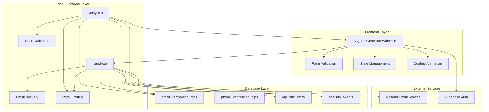
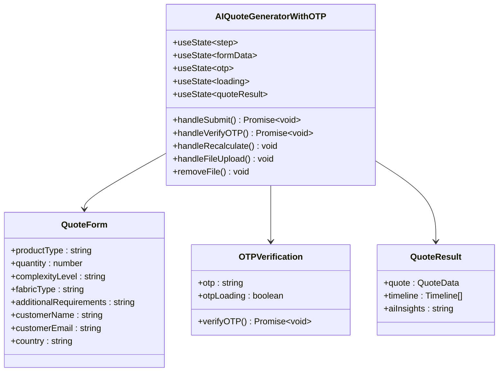
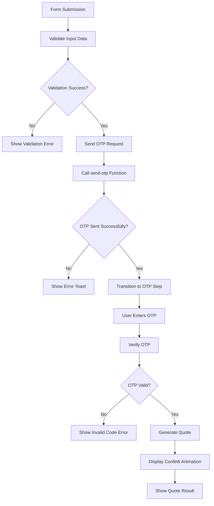
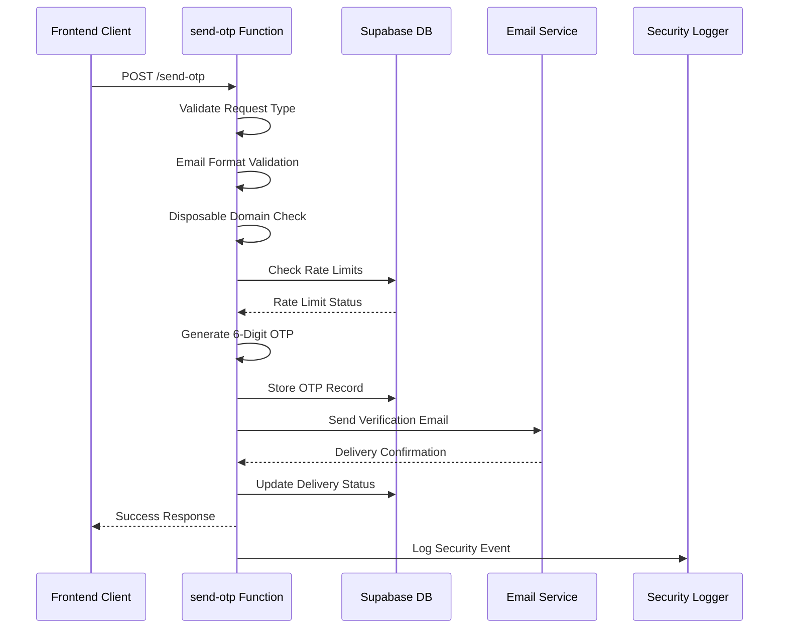
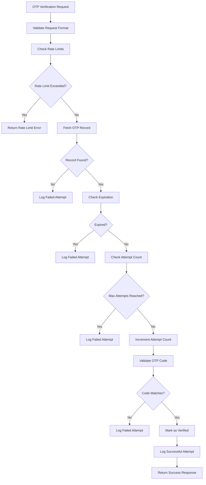
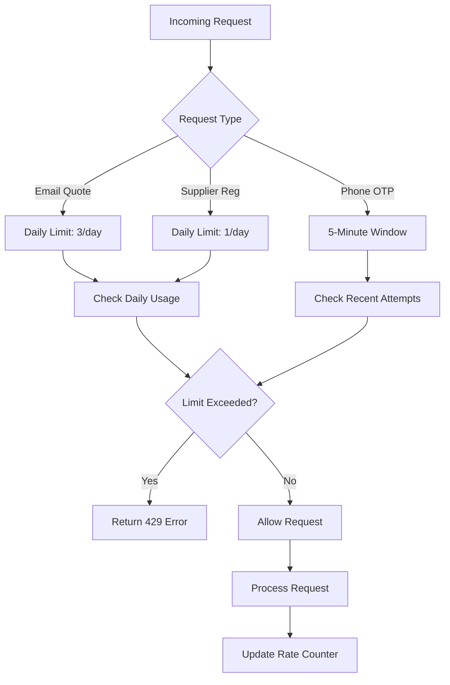
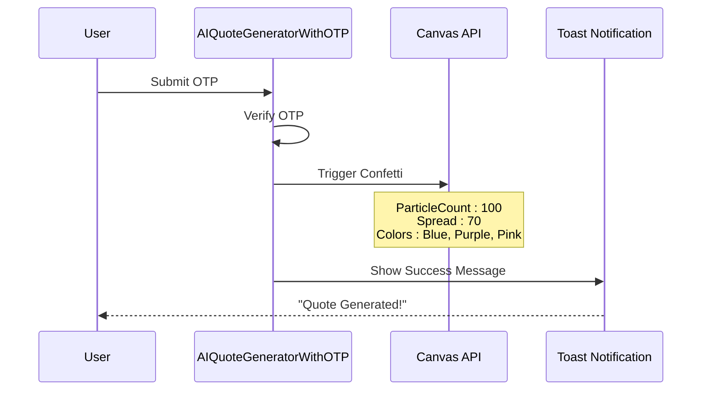
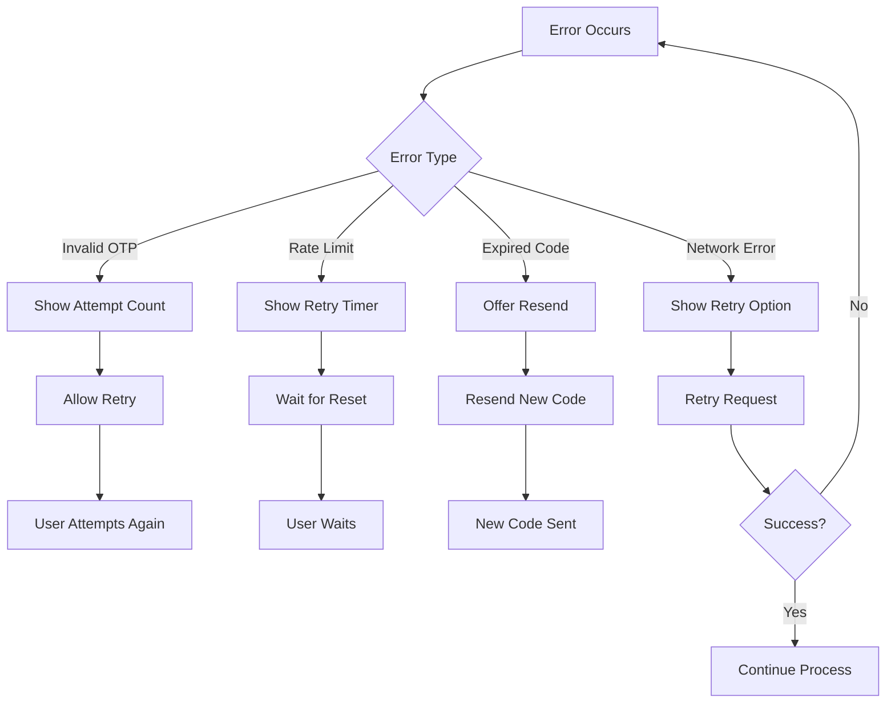
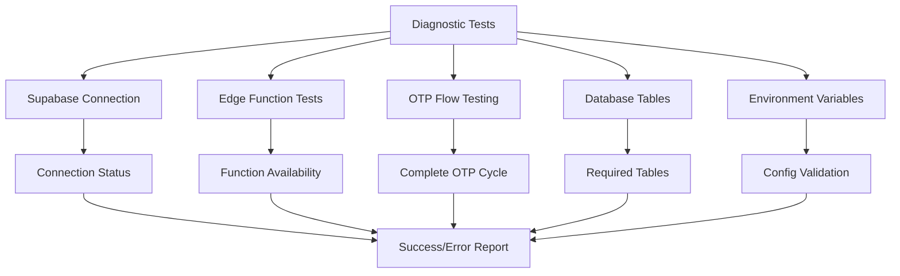
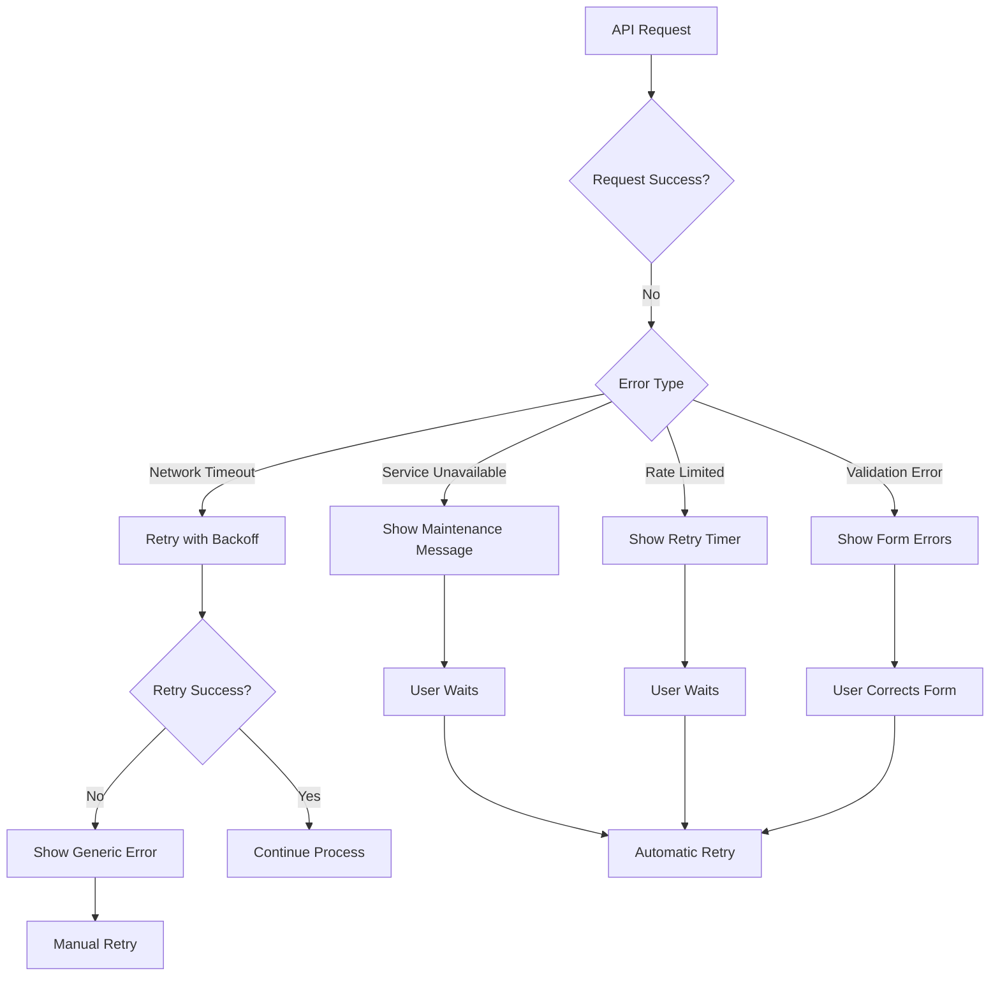

# OTP Verification Security Layer

<cite>
**Referenced Files in This Document**
- [AIQuoteGeneratorWithOTP.tsx](file://src/components/AIQuoteGeneratorWithOTP.tsx)
- [send-otp/index.ts](file://supabase/functions/send-otp/index.ts)
- [verify-otp/index.ts](file://supabase/functions/verify-otp/index.ts)
- [diagnostics.ts](file://src/lib/diagnostics.ts)
- [email_verification_otps table schema](file://supabase/migrations/20251115150759_remix_migration_from_pg_dump.sql)
- [phone_verification_otps table schema](file://supabase/migrations/20251115150759_remix_migration_from_pg_dump.sql)
- [Security Monitoring Dashboard](file://src/components/admin/SecurityMonitoringDashboard.tsx)
- [Rate Limit Monitoring Dashboard](file://src/components/admin/RateLimitMonitoringDashboard.tsx)
</cite>

## Table of Contents
1. [Introduction](#introduction)
2. [System Architecture](#system-architecture)
3. [AIQuoteGeneratorWithOTP Component](#aiquotegeneratorwithotp-component)
4. [Edge Functions Implementation](#edge-functions-implementation)
5. [Database Schema and Security](#database-schema-and-security)
6. [Security Measures](#security-measures)
7. [User Experience Features](#user-experience-features)
8. [Testing and Diagnostics](#testing-and-diagnostics)
9. [Error Handling and Recovery](#error-handling-and-recovery)
10. [Performance Considerations](#performance-considerations)
11. [Troubleshooting Guide](#troubleshooting-guide)

## Introduction

The OTP (One-Time Password) Verification system serves as a critical security layer protecting the AI Quote Generator from automated abuse while providing a seamless user experience. This comprehensive system implements multi-factor authentication through email verification, combining robust security measures with intuitive user interfaces to prevent quote generation spam while maintaining accessibility for legitimate users.

The system protects against automated quote generation abuse by requiring email verification before processing quote requests. It implements a sophisticated multi-step flow that guides users through form submission, OTP entry, and quote delivery, incorporating advanced security measures including rate limiting, brute force protection, and comprehensive logging.

## System Architecture

The OTP Verification system follows a distributed architecture with clear separation of concerns between frontend components, Edge Functions, and database storage. The system is built on Supabase infrastructure, leveraging Edge Functions for secure backend operations and PostgreSQL for persistent data storage.



**Diagram sources**
- [AIQuoteGeneratorWithOTP.tsx](file://src/components/AIQuoteGeneratorWithOTP.tsx#L56-L1046)
- [send-otp/index.ts](file://supabase/functions/send-otp/index.ts#L131-L489)
- [verify-otp/index.ts](file://supabase/functions/verify-otp/index.ts#L21-L356)

## AIQuoteGeneratorWithOTP Component

The AIQuoteGeneratorWithOTP component serves as the primary orchestrator for the multi-step OTP verification flow. Built with React and TypeScript, it manages complex state transitions, handles user interactions, and coordinates between frontend validation and backend verification.

### Component Architecture



**Diagram sources**
- [AIQuoteGeneratorWithOTP.tsx](file://src/components/AIQuoteGeneratorWithOTP.tsx#L56-L75)

### State Management Flow

The component implements a sophisticated state management system with four distinct steps:

1. **Form Step**: Initial quote request form with validation
2. **OTP Step**: Email verification code entry
3. **Loading Step**: Quote generation progress indication
4. **Result Step**: Final quote display with actions

### Form Submission and Validation

The form submission process includes comprehensive validation using Zod schemas and handles various edge cases:



**Diagram sources**
- [AIQuoteGeneratorWithOTP.tsx](file://src/components/AIQuoteGeneratorWithOTP.tsx#L175-L344)

**Section sources**
- [AIQuoteGeneratorWithOTP.tsx](file://src/components/AIQuoteGeneratorWithOTP.tsx#L56-L344)

## Edge Functions Implementation

The OTP system consists of two primary Edge Functions that handle the complete verification lifecycle: `send-otp` for code generation and delivery, and `verify-otp` for code validation and user authentication.

### send-otp Function

The send-otp function implements comprehensive security measures including email validation, rate limiting, and anti-abuse protections.

#### Security Features



**Diagram sources**
- [send-otp/index.ts](file://supabase/functions/send-otp/index.ts#L131-L489)

#### Email Validation and Anti-Abuse Measures

The function implements multiple layers of validation:

| Validation Layer | Purpose | Implementation |
|------------------|---------|----------------|
| Format Validation | Basic email structure | Regex pattern matching |
| Length Constraints | Prevent buffer overflow | Character limit enforcement |
| Domain Validation | Block disposable emails | Blacklist filtering |
| Rate Limiting | Prevent abuse | Database-based throttling |
| Retry Logic | Handle delivery failures | Exponential backoff |

#### Rate Limiting Implementation

The system implements tiered rate limiting based on request type:

- **Email Quote Requests**: 3 requests per day per email address
- **Supplier Registrations**: 1 request per day per email address  
- **Phone Verification**: 1 request every 5 minutes per phone number
- **OTP Attempts**: 5 attempts per OTP code, 3 attempts per hour per identifier

**Section sources**
- [send-otp/index.ts](file://supabase/functions/send-otp/index.ts#L131-L489)

### verify-otp Function

The verify-otp function provides robust code validation with comprehensive security logging and abuse detection.

#### Verification Process



**Diagram sources**
- [verify-otp/index.ts](file://supabase/functions/verify-otp/index.ts#L21-L356)

#### Security Logging and Monitoring

The function implements comprehensive logging for security monitoring:

- **Successful Attempts**: Logged with timestamp and IP address
- **Failed Attempts**: Recorded with attempt count and IP geolocation
- **Rate Limit Violations**: Tracked for abuse detection
- **Suspicious Activity**: Monitored for potential attacks

**Section sources**
- [verify-otp/index.ts](file://supabase/functions/verify-otp/index.ts#L21-L356)

## Database Schema and Security

The OTP system utilizes dedicated tables for storing verification codes and tracking security events, with comprehensive Row Level Security (RLS) policies ensuring data isolation and privacy.

### OTP Tables Structure

#### email_verification_otps Table

| Column | Type | Purpose | Security Notes |
|--------|------|---------|----------------|
| id | UUID | Primary key | Generated automatically |
| email | TEXT | Target email address | Indexed for fast lookup |
| otp | TEXT | Verification code | Stored as plain text |
| expires_at | TIMESTAMPTZ | Code expiration time | TTL-based cleanup |
| verified | BOOLEAN | Verification status | Default: false |
| created_at | TIMESTAMPTZ | Record creation time | Automatic timestamp |
| ip_address | TEXT | Client IP address | For security tracking |
| session_id | TEXT | User session identifier | Cross-request correlation |
| attempt_count | INTEGER | Number of verification attempts | Brute force prevention |

#### phone_verification_otps Table

| Column | Type | Purpose | Security Notes |
|--------|------|---------|----------------|
| id | UUID | Primary key | Generated automatically |
| phone | TEXT | Target phone number | Stored as plain text |
| otp | TEXT | Verification code | Stored as plain text |
| expires_at | TIMESTAMPTZ | Code expiration time | TTL-based cleanup |
| verified | BOOLEAN | Verification status | Default: false |
| created_at | TIMESTAMPTZ | Record creation time | Automatic timestamp |
| attempt_count | INTEGER | Number of verification attempts | Brute force prevention |
| ip_address | TEXT | Client IP address | For security tracking |
| session_id | TEXT | User session identifier | Cross-request correlation |

### Security Policies

The database implements strict RLS policies:

- **Service Role Access**: Full CRUD permissions for OTP management
- **User Access**: Read-only access to own OTP records
- **Admin Monitoring**: Select access for security dashboards
- **Automatic Cleanup**: Expired records purged periodically

**Section sources**
- [email_verification_otps table schema](file://supabase/migrations/20251115150759_remix_migration_from_pg_dump.sql#L1080-L1090)
- [phone_verification_otps table schema](file://supabase/migrations/20251115150759_remix_migration_from_pg_dump.sql#L1351-L1361)

## Security Measures

The OTP system implements multiple layers of security to protect against various attack vectors while maintaining usability for legitimate users.

### Code Generation and Storage

#### Random Code Generation

The system generates 6-digit numeric codes using cryptographically secure random number generation:

```typescript
// Code generation example
const otp = Math.floor(100000 + Math.random() * 900000).toString();
```

#### Code Expiration

All OTP codes have a 10-minute expiration window with automatic cleanup:

- **Creation Timestamp**: Stored with each code
- **Expiration Check**: Verified on each attempt
- **Automatic Cleanup**: Database cleanup job removes expired codes

### Rate Limiting and Abuse Prevention

#### Multi-Level Rate Limiting



**Diagram sources**
- [send-otp/index.ts](file://supabase/functions/send-otp/index.ts#L297-L342)

#### Brute Force Protection

- **Attempt Limit**: Maximum 5 attempts per OTP code
- **Rate Limit**: 3 attempts per hour per identifier
- **Lockout Period**: 1-hour cooldown after rate limit exceeded
- **Logging**: All failed attempts logged for monitoring

### Email Security Features

#### Disposable Email Detection

The system maintains a comprehensive blacklist of disposable email domains:

- **Common Providers**: tempmail.com, throwaway.email, 10minutemail.com
- **Validation**: Real-time domain checking during registration
- **Blocking**: Immediate rejection of disposable addresses

#### Email Format Validation

Comprehensive validation prevents common attack vectors:

- **Length Limits**: Maximum 254 characters
- **Format Checking**: RFC-compliant email validation
- **Header Injection**: Prevention of malicious header injection
- **Consecutive Dots**: Blocked to prevent SMTP issues

**Section sources**
- [send-otp/index.ts](file://supabase/functions/send-otp/index.ts#L16-L89)

## User Experience Features

The OTP system prioritizes user experience through intuitive interfaces, helpful feedback, and engaging visual elements.

### Confetti Animation System

The system includes a celebratory confetti animation upon successful verification:



**Diagram sources**
- [AIQuoteGeneratorWithOTP.tsx](file://src/components/AIQuoteGeneratorWithOTP.tsx#L314-L326)

### Error Recovery Mechanisms

#### Graceful Error Handling

The system provides multiple recovery options:

- **Resend OTP**: Option to request new code
- **Back Navigation**: Return to form from OTP step
- **Clear Instructions**: Helpful error messages
- **Retry Logic**: Automatic retry for transient failures

#### User Guidance



**Diagram sources**
- [AIQuoteGeneratorWithOTP.tsx](file://src/components/AIQuoteGeneratorWithOTP.tsx#L240-L247)

### Form Validation and Feedback

#### Real-Time Validation

- **Immediate Feedback**: Validation occurs as user types
- **Visual Indicators**: Clear error states and success indicators
- **Helpful Messages**: Specific guidance for corrections
- **Accessibility**: Screen reader support and keyboard navigation

**Section sources**
- [AIQuoteGeneratorWithOTP.tsx](file://src/components/AIQuoteGeneratorWithOTP.tsx#L240-L344)

## Testing and Diagnostics

The system includes comprehensive testing capabilities and diagnostic tools for monitoring and troubleshooting.

### Diagnostic Testing Framework

The diagnostics system provides automated testing of critical components:



**Diagram sources**
- [diagnostics.ts](file://src/lib/diagnostics.ts#L148-L269)

### OTP Flow Testing

The diagnostic system includes specialized OTP flow testing:

#### Test Scenario
1. **Send OTP**: Calls send-otp function with test email
2. **Verify OTP**: Manual verification required
3. **Error Handling**: Tests various failure scenarios
4. **Rate Limiting**: Validates rate limiting functionality

#### Diagnostic Results

| Test Category | Expected Outcome | Error Handling |
|---------------|------------------|----------------|
| Function Availability | Success response | Deployment warnings |
| Email Delivery | Successful send | API key validation |
| Code Verification | Validated code | Attempt tracking |
| Rate Limiting | Respected limits | Cooldown periods |

**Section sources**
- [diagnostics.ts](file://src/lib/diagnostics.ts#L125-L145)

## Error Handling and Recovery

The system implements comprehensive error handling with graceful degradation and user-friendly recovery mechanisms.

### Error Categories and Responses

#### Network and Service Errors



#### Security Error Handling

The system handles security-related errors gracefully:

- **Rate Limit Exceeded**: Informative message with retry timing
- **Invalid Codes**: Progressive hints about remaining attempts
- **Expired Codes**: Clear instructions to request new code
- **Failed Deliveries**: Alternative verification methods

### Recovery Strategies

#### Automatic Recovery

- **Retry Logic**: Exponential backoff for transient failures
- **Fallback Options**: Alternative verification methods
- **State Preservation**: Maintain user progress across reloads

#### Manual Recovery

- **Clear Instructions**: Step-by-step recovery guidance
- **Contact Information**: Support options for complex issues
- **Alternative Methods**: Backup verification approaches

**Section sources**
- [AIQuoteGeneratorWithOTP.tsx](file://src/components/AIQuoteGeneratorWithOTP.tsx#L286-L344)

## Performance Considerations

The OTP system is optimized for performance while maintaining security, with careful attention to latency and resource utilization.

### Database Optimization

#### Indexing Strategy

- **Email/Phone Columns**: Indexed for fast lookups
- **Expiration Columns**: Indexed for cleanup efficiency
- **Composite Indexes**: Used for multi-column queries

#### Query Optimization

- **Single Record Fetches**: Optimized queries for individual OTP records
- **Batch Operations**: Efficient handling of cleanup operations
- **Connection Pooling**: Optimized database connections

### Edge Function Performance

#### Cold Start Mitigation

- **Warm-up Strategies**: Pre-warming critical functions
- **Resource Allocation**: Adequate memory and CPU allocation
- **Caching**: Intelligent caching of frequently accessed data

#### Response Time Targets

| Operation | Target Response Time | Monitoring |
|-----------|---------------------|------------|
| OTP Generation | < 200ms | SLA monitoring |
| Code Verification | < 300ms | Performance alerts |
| Email Delivery | < 1000ms | Delivery tracking |
| Rate Limit Check | < 100ms | Latency metrics |

### Caching Strategies

#### OTP Caching

- **Recent Records**: Cache recently accessed OTP records
- **Rate Limit Data**: Cache rate limit counters
- **Security Events**: Cache security event logs

#### Session Management

- **Session Persistence**: Efficient session storage
- **Cross-Request State**: Maintain state across OTP steps
- **Cleanup Automation**: Automated cleanup of expired sessions

## Troubleshooting Guide

This section provides comprehensive guidance for diagnosing and resolving common issues with the OTP Verification system.

### Common Issues and Solutions

#### OTP Not Received

**Symptoms**: User submits email but receives no verification code

**Diagnosis Steps**:
1. Check email delivery logs in Resend dashboard
2. Verify email format validation
3. Check disposable email blacklist
4. Review rate limiting status

**Solutions**:
- Verify email address format
- Check spam/junk folders
- Request new OTP after 5-minute cooldown
- Contact support for persistent issues

#### Invalid OTP Errors

**Symptoms**: User enters correct code but receives "Invalid OTP" message

**Diagnosis Steps**:
1. Check OTP expiration status
2. Verify attempt count hasn't exceeded limits
3. Review security logs for suspicious activity
4. Confirm OTP record exists in database

**Solutions**:
- Request new OTP code
- Clear browser cache and cookies
- Check for typos in entered code
- Wait for rate limit cooldown period

#### Rate Limit Exceeded

**Symptoms**: User receives "Too many attempts" or "Please wait" messages

**Diagnosis Steps**:
1. Check rate limit counters in database
2. Review recent attempt logs
3. Verify IP address association
4. Monitor for potential abuse patterns

**Solutions**:
- Wait for automatic cooldown period (1 hour)
- Clear browser data and try again
- Use different device or network
- Contact support for exceptional cases

### Monitoring and Alerting

#### Security Monitoring

The system includes comprehensive monitoring for security events:

- **Failed Attempt Tracking**: All invalid OTP attempts logged
- **Rate Limit Violations**: Automatic detection of abuse patterns
- **Suspicious Activity**: Anomaly detection for potential attacks
- **Geographic Analysis**: IP address tracking and analysis

#### Performance Monitoring

- **Response Time Tracking**: API endpoint performance metrics
- **Error Rate Monitoring**: Service availability tracking
- **Resource Utilization**: Database and Edge Function usage
- **Capacity Planning**: Growth trend analysis

### Debug Mode Features

#### Development Environment

The system includes debug mode features for development and testing:

- **Debug OTP Display**: Show generated OTP codes in development
- **Verbose Logging**: Detailed operation logs
- **Test Data Isolation**: Separate environments for testing
- **Mock Services**: Simulated external service responses

**Section sources**
- [diagnostics.ts](file://src/lib/diagnostics.ts#L125-L145)
- [AIQuoteGeneratorWithOTP.tsx](file://src/components/AIQuoteGeneratorWithOTP.tsx#L203-L208)