# Price Comparison

<cite>
**Referenced Files in This Document**
- [PriceComparison.tsx](file://src/components/quote/PriceComparison.tsx)
- [QuoteComparison.tsx](file://src/components/quote/QuoteComparison.tsx)
- [PricingSavingsCard.tsx](file://src/components/aggregation/PricingSavingsCard.tsx)
- [InteractiveQuoteDisplay.tsx](file://src/components/quote/InteractiveQuoteDisplay.tsx)
- [ConversationalQuoteBuilder.tsx](file://src/components/quote/ConversationalQuoteBuilder.tsx)
- [useQuotes.ts](file://src/hooks/useQuotes.ts)
- [QuoteHistory.tsx](file://src/pages/QuoteHistory.tsx)
- [QuoteHistoryCard.tsx](file://src/components/quote/QuoteHistoryCard.tsx)
</cite>

## Table of Contents
1. [Introduction](#introduction)
2. [Core Components Overview](#core-components-overview)
3. [PriceComparison Component](#pricecomparison-component)
4. [QuoteComparison Component](#quotecomparison-component)
5. [PricingSavingsCard Component](#pricingsavingscard-component)
6. [Implementation Architecture](#implementation-architecture)
7. [Data Flow and Calculations](#data-flow-and-calculations)
8. [UI Visualization Patterns](#ui-visualization-patterns)
9. [Integration Examples](#integration-examples)
10. [Performance Considerations](#performance-considerations)
11. [Best Practices](#best-practices)
12. [Conclusion](#conclusion)

## Introduction

The Price Comparison feature is a sophisticated system designed to help buyers make informed purchasing decisions by providing transparent cost comparisons between their AI-generated quotes and standard market rates from US and Chinese manufacturers. This comprehensive solution combines real-time market data analysis with intuitive visualizations to build trust and demonstrate value.

The system operates on the principle that transparency in pricing creates trust, while comparative analysis empowers buyers to understand the competitive positioning of their quotes. By leveraging real-time market research and intelligent calculations, the feature provides actionable insights that go beyond simple price points to include quality benchmarks and strategic savings opportunities.

## Core Components Overview

The Price Comparison ecosystem consists of three primary components, each serving distinct but complementary functions in the overall pricing analysis workflow:

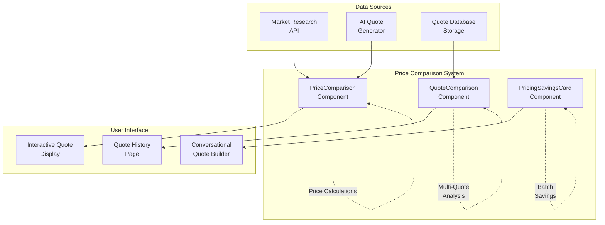

**Diagram sources**
- [PriceComparison.tsx](file://src/components/quote/PriceComparison.tsx#L1-L124)
- [QuoteComparison.tsx](file://src/components/quote/QuoteComparison.tsx#L1-L185)
- [PricingSavingsCard.tsx](file://src/components/aggregation/PricingSavingsCard.tsx#L1-L87)

Each component specializes in different aspects of price analysis: PriceComparison focuses on direct market comparisons, QuoteComparison enables side-by-side analysis of multiple quotes, and PricingSavingsCard handles bulk ordering savings calculations.

## PriceComparison Component

The PriceComparison component serves as the primary visualization tool for comparing a buyer's AI-generated quote against industry benchmarks. It provides a comprehensive view of competitive positioning through proportional bar charts and clear savings indicators.

### Component Architecture

The PriceComparison component implements a sophisticated pricing comparison system with the following key characteristics:

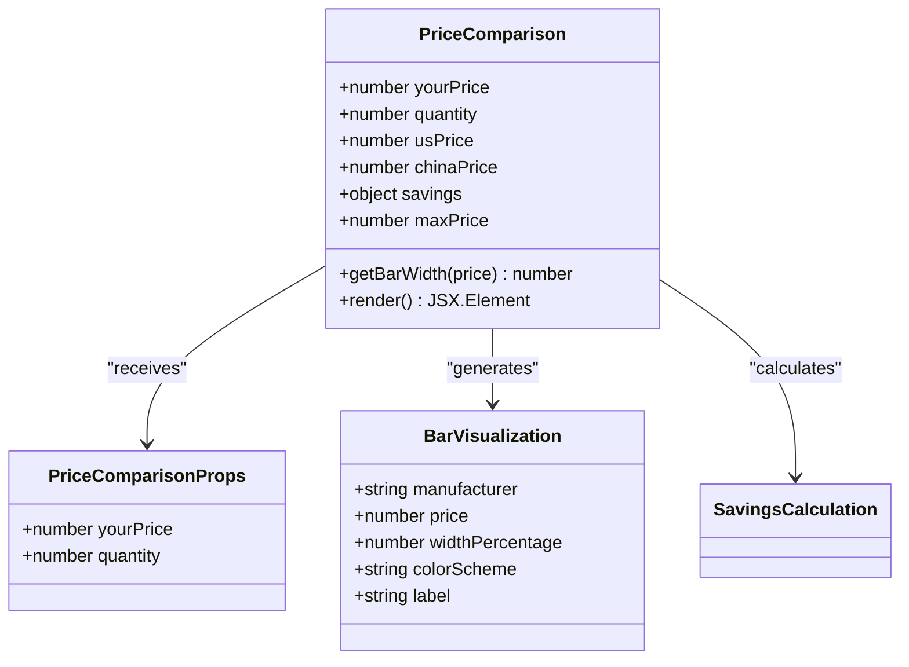

**Diagram sources**
- [PriceComparison.tsx](file://src/components/quote/PriceComparison.tsx#L5-L8)

### Price Calculation Logic

The component implements a multi-tier pricing comparison system that establishes benchmarks against major global manufacturing hubs:

| Comparison Tier | Multiplier Factor | Benchmark Region | Quality Standard |
|----------------|-------------------|------------------|------------------|
| US Manufacturers | ×1.8 | North America | Premium domestic production |
| Chinese Competitors | ×1.3 | Asia-Pacific | Mass-market quality |
| Local Provider | Base Price | Bangladesh | Competitive regional pricing |

The calculation logic transforms the buyer's base price into comparative benchmarks using predefined multipliers that reflect market realities and quality expectations.

### Visual Bar Implementation

The component utilizes proportional bar charts to visually represent price relationships:

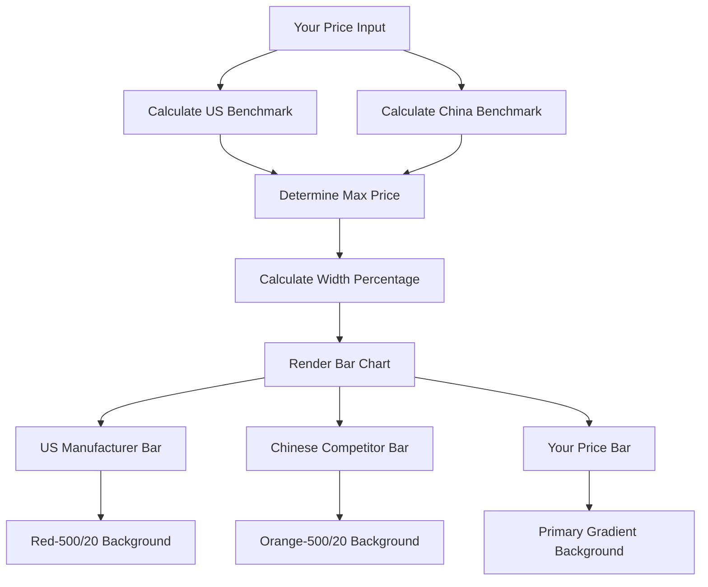

**Diagram sources**
- [PriceComparison.tsx](file://src/components/quote/PriceComparison.tsx#L11-L22)

### Icon-Based Competitive Positioning

The system employs a sophisticated iconography system to communicate competitive positioning:

| Icon | Color | Meaning | Position |
|------|-------|---------|----------|
| TrendingDown | Primary | Lowest price, best value | Your quote |
| CheckCircle2 | Green | Best value designation | Your quote badge |
| Red Border | Red | Higher than US benchmark | US manufacturer bar |
| Orange Border | Orange | Competitive with China | Chinese competitor bar |

**Section sources**
- [PriceComparison.tsx](file://src/components/quote/PriceComparison.tsx#L1-L124)

## QuoteComparison Component

The QuoteComparison component enables comprehensive side-by-side analysis of multiple quotes, providing detailed specification breakdowns and price analysis capabilities. This component serves as a powerful decision-making tool for buyers managing multiple quote options.

### Multi-Quote Analysis System

The QuoteComparison component implements a sophisticated analysis engine that processes multiple quote datasets simultaneously:

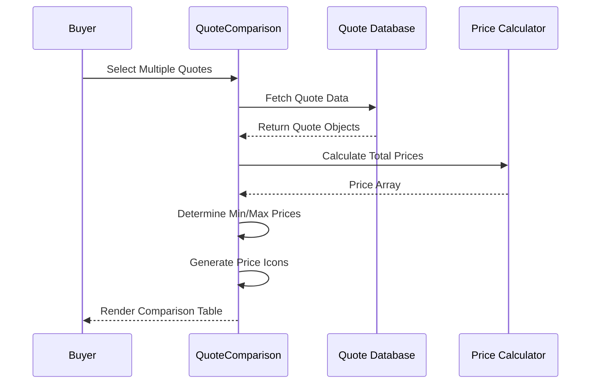

**Diagram sources**
- [QuoteComparison.tsx](file://src/components/quote/QuoteComparison.tsx#L20-L94)

### Specification Comparison Matrix

The component organizes comparison data into a comprehensive matrix structure:

| Specification Category | Data Type | Comparison Method | Visual Indicator |
|------------------------|-----------|-------------------|------------------|
| Product Type | String | Exact Match | Text Display |
| Quantity | Number | Numeric Comparison | Formatted Display |
| Total Price | Currency | Min/Max Analysis | Trending Icons |
| Unit Price | Currency | Per-unit Comparison | Highlighted Rows |
| Lead Time | Days | Timeline Analysis | Status Indicators |
| Fabric Type | String | Quality Match | Text Display |
| Status | Enum | Workflow State | Badge System |
| Created Date | DateTime | Chronological | Formatted Text |

### Dynamic Icon System

The QuoteComparison component implements an intelligent icon system that dynamically reflects price competitiveness:

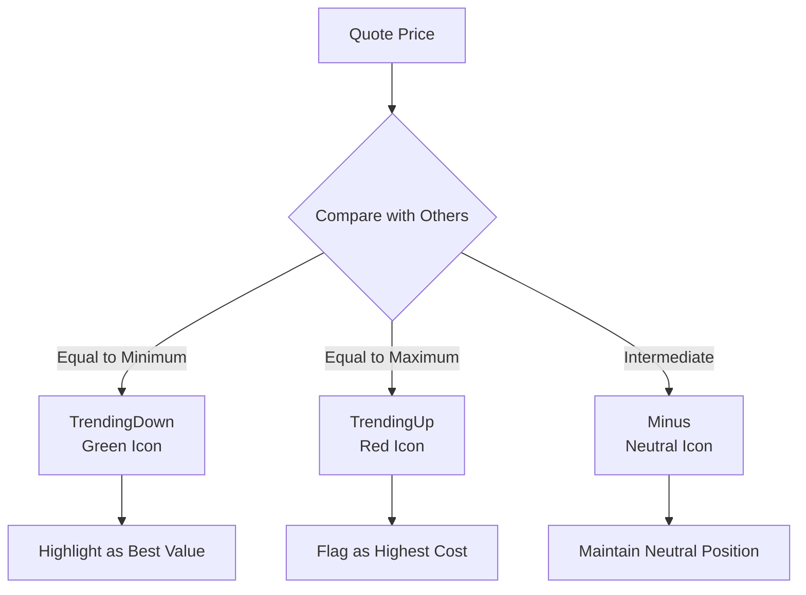

**Diagram sources**
- [QuoteComparison.tsx](file://src/components/quote/QuoteComparison.tsx#L88-L93)

**Section sources**
- [QuoteComparison.tsx](file://src/components/quote/QuoteComparison.tsx#L1-L185)

## PricingSavingsCard Component

The PricingSavingsCard component specializes in aggregating savings calculations for bulk ordering scenarios, demonstrating the financial benefits of collaborative production arrangements.

### Shared Production Savings Model

The component implements a sophisticated savings calculation model that demonstrates the advantages of shared production:

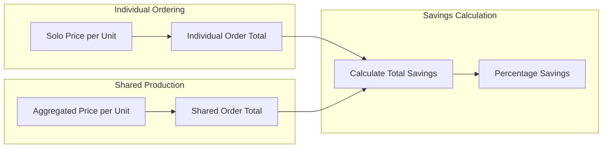

**Diagram sources**
- [PricingSavingsCard.tsx](file://src/components/aggregation/PricingSavingsCard.tsx#L12-L20)

### Savings Calculation Formula

The component implements precise mathematical formulas for savings calculations:

| Metric | Formula | Purpose | Display Format |
|--------|---------|---------|----------------|
| Savings per Unit | `soloPrice - aggregatedPrice` | Individual unit savings | Currency display |
| Total Savings | `savingsPerUnit * quantity` | Overall order savings | Currency display |
| Percentage Savings | `(savingsPerUnit / soloPrice) * 100` | Relative value proposition | Percentage display |

### Visual Savings Presentation

The component presents savings information through a dual-column layout that clearly separates individual and shared pricing scenarios:

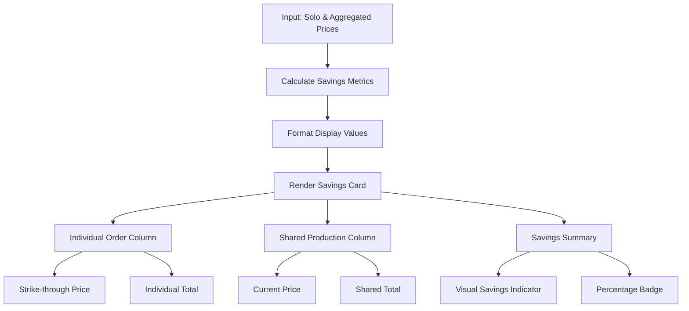

**Diagram sources**
- [PricingSavingsCard.tsx](file://src/components/aggregation/PricingSavingsCard.tsx#L23-L87)

**Section sources**
- [PricingSavingsCard.tsx](file://src/components/aggregation/PricingSavingsCard.tsx#L1-L87)

## Implementation Architecture

The Price Comparison feature follows a modular architecture that promotes reusability, maintainability, and scalability across the application ecosystem.

### Component Interaction Pattern

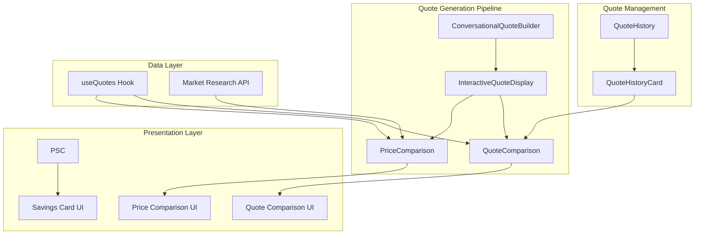

**Diagram sources**
- [ConversationalQuoteBuilder.tsx](file://src/components/quote/ConversationalQuoteBuilder.tsx#L43-L200)
- [QuoteHistory.tsx](file://src/pages/QuoteHistory.tsx#L128-L149)

### Data Flow Architecture

The system implements a unidirectional data flow pattern that ensures predictable state management and efficient updates:

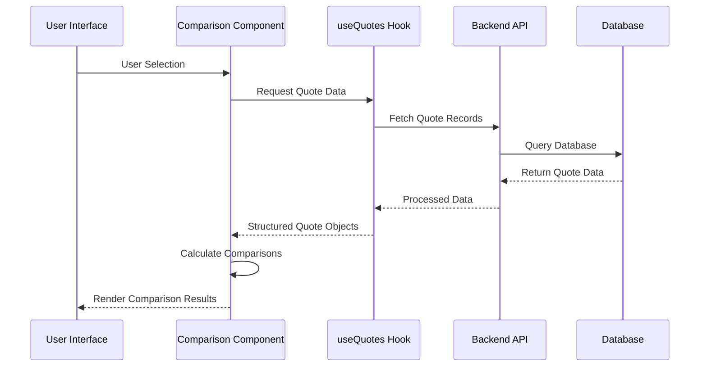

**Diagram sources**
- [useQuotes.ts](file://src/hooks/useQuotes.ts#L55-L80)

**Section sources**
- [useQuotes.ts](file://src/hooks/useQuotes.ts#L1-L261)

## Data Flow and Calculations

The Price Comparison feature implements sophisticated calculation engines that transform raw quote data into meaningful comparative insights.

### Price Calculation Engine

The system employs multiple calculation strategies depending on the data availability and quote structure:

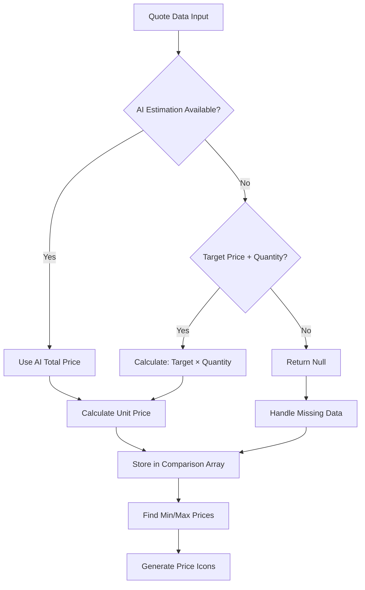

**Diagram sources**
- [QuoteComparison.tsx](file://src/components/quote/QuoteComparison.tsx#L23-L30)

### Mathematical Precision

The component maintains high precision in financial calculations while ensuring appropriate rounding for user display:

| Calculation Type | Precision Level | Rounding Strategy | Display Format |
|-----------------|-----------------|-------------------|----------------|
| Unit Price | 2 decimal places | Fixed-point arithmetic | Currency format |
| Total Price | 2 decimal places | Fixed-point arithmetic | Currency format |
| Percentage Savings | 0 decimal places | Integer rounding | Percentage format |
| Quantity Display | Whole numbers | No rounding | Locale-specific format |

### Error Handling and Edge Cases

The system implements robust error handling for various edge cases:

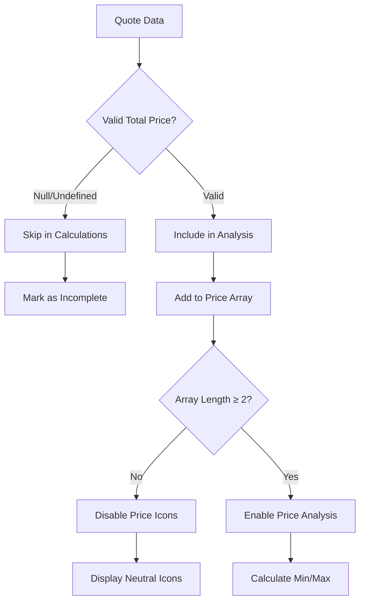

**Diagram sources**
- [QuoteComparison.tsx](file://src/components/quote/QuoteComparison.tsx#L81-L94)

**Section sources**
- [QuoteComparison.tsx](file://src/components/quote/QuoteComparison.tsx#L23-L94)

## UI Visualization Patterns

The Price Comparison feature implements consistent visualization patterns that enhance user comprehension and decision-making efficiency.

### Proportional Bar Visualization

The system uses proportional bar charts to create intuitive price comparisons:

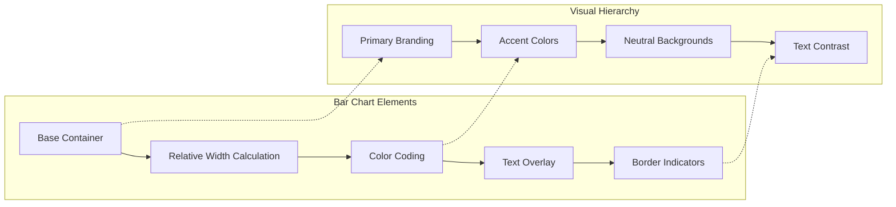

**Diagram sources**
- [PriceComparison.tsx](file://src/components/quote/PriceComparison.tsx#L34-L86)

### Responsive Design Implementation

The components implement responsive design patterns that adapt to various screen sizes and device orientations:

| Screen Size | Layout Pattern | Component Behavior | Accessibility Features |
|-------------|---------------|-------------------|----------------------|
| Mobile | Single Column | Stacked bars with labels | Touch-friendly spacing |
| Tablet | Dual Column | Side-by-side comparisons | Enhanced touch targets |
| Desktop | Multi-column | Full-width tables | Keyboard navigation |
| Large Screens | Expanded Layout | Detailed breakdowns | High contrast options |

### Color Scheme and Branding

The system maintains consistent branding through carefully chosen color schemes:

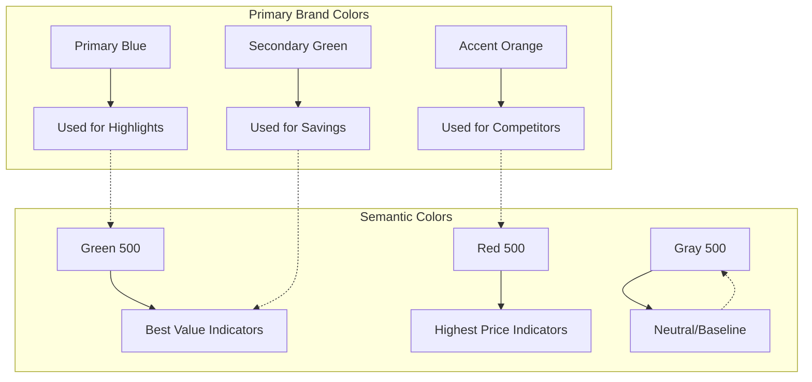

**Section sources**
- [PriceComparison.tsx](file://src/components/quote/PriceComparison.tsx#L25-L123)
- [QuoteComparison.tsx](file://src/components/quote/QuoteComparison.tsx#L96-L182)

## Integration Examples

The Price Comparison feature integrates seamlessly with various parts of the application ecosystem, providing contextual pricing analysis at critical decision points.

### Quote Generation Integration

During the quote generation process, PriceComparison provides immediate feedback on competitive positioning:

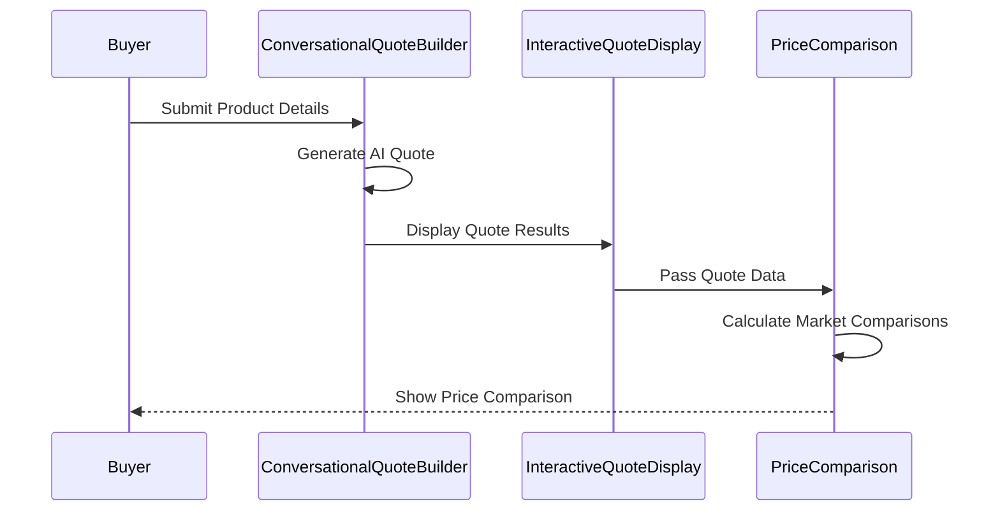

**Diagram sources**
- [ConversationalQuoteBuilder.tsx](file://src/components/quote/ConversationalQuoteBuilder.tsx#L112-L162)
- [InteractiveQuoteDisplay.tsx](file://src/components/quote/InteractiveQuoteDisplay.tsx#L45-L230)

### Quote Management Integration

The QuoteComparison component becomes available during quote management operations:

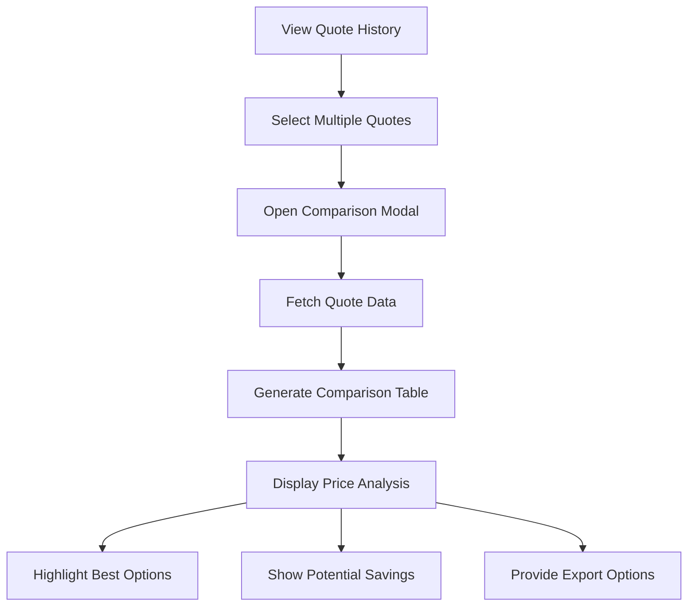

**Diagram sources**
- [QuoteHistory.tsx](file://src/pages/QuoteHistory.tsx#L128-L149)
- [QuoteHistoryCard.tsx](file://src/components/quote/QuoteHistoryCard.tsx#L31-L65)

### Real-Time Updates

The system supports real-time updates when quote data changes:

| Event Type | Trigger Condition | Update Mechanism | User Feedback |
|------------|-------------------|------------------|---------------|
| Quote Modification | Price change detected | Re-calculate comparisons | Automatic refresh |
| New Quote Addition | Quote added to selection | Add to comparison matrix | Smooth transition |
| Quote Removal | Quote deselected | Remove from analysis | Immediate update |
| Data Refresh | Manual refresh action | Re-fetch quote data | Loading indicator |

**Section sources**
- [QuoteHistory.tsx](file://src/pages/QuoteHistory.tsx#L128-L149)
- [QuoteHistoryCard.tsx](file://src/components/quote/QuoteHistoryCard.tsx#L31-L65)

## Performance Considerations

The Price Comparison feature implements several performance optimization strategies to ensure responsive user experiences even with large datasets.

### Calculation Optimization

The system employs efficient calculation algorithms that minimize computational overhead:

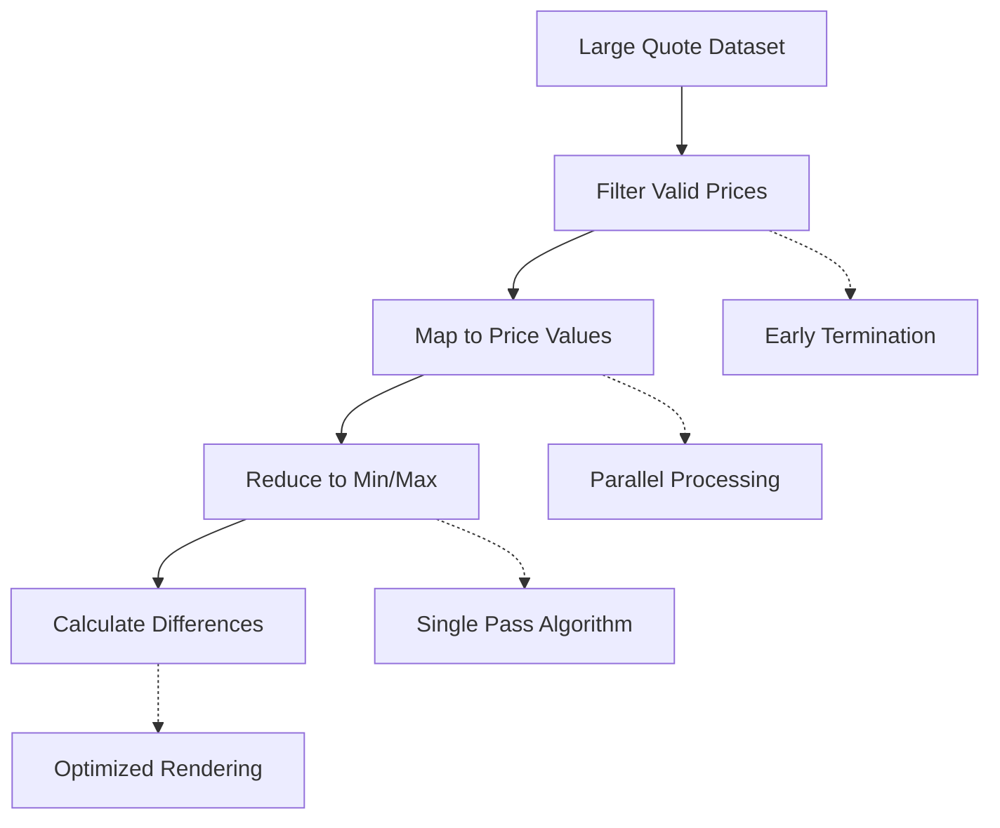

### Memory Management

The components implement memory-efficient patterns to prevent performance degradation:

| Optimization Technique | Implementation | Benefit | Trade-off |
|----------------------|----------------|---------|-----------|
| Lazy Loading | Load comparison data on demand | Reduced initial load time | Delayed comparison availability |
| Memoization | Cache calculation results | Faster subsequent calculations | Increased memory usage |
| Virtual Scrolling | Render only visible rows | Improved table performance | Complex implementation |
| Debounced Updates | Delay rapid state changes | Reduced calculation frequency | Slight user experience lag |

### Network Optimization

The system minimizes network requests through intelligent caching and batching:

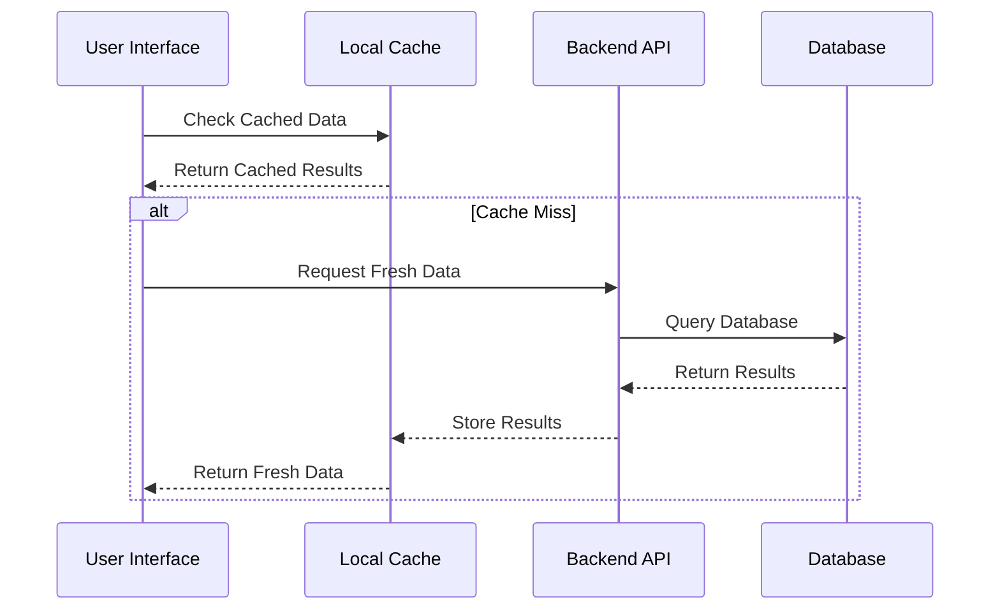

## Best Practices

The Price Comparison feature embodies several best practices in user interface design, data presentation, and accessibility.

### Design Principles

The system adheres to established design principles that enhance usability and comprehension:

| Principle | Implementation | Rationale | Benefits |
|-----------|----------------|-----------|----------|
| Consistency | Uniform iconography and color schemes | Predictable user experience | Reduced learning curve |
| Clarity | Clear labeling and visual hierarchy | Easy information processing | Improved decision-making |
| Accessibility | Semantic HTML and ARIA labels | Inclusive design | Broader user reach |
| Responsiveness | Adaptive layouts and touch targets | Cross-device compatibility | Enhanced user satisfaction |

### Data Accuracy Standards

The system maintains high standards for data accuracy and reliability:

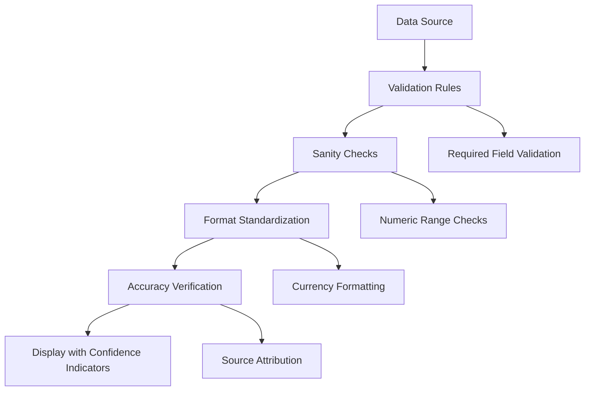

### User Experience Guidelines

The components follow established UX guidelines for effective information presentation:

| Guideline | Implementation | User Benefit | Technical Consideration |
|-----------|----------------|--------------|------------------------|
| Progressive Disclosure | Show basic info first, advanced options later | Reduce cognitive overload | State management complexity |
| Visual Hierarchy | Use size, color, and placement effectively | Guide user attention | Design consistency |
| Feedback Loops | Provide immediate response to user actions | Confirm successful operations | Animation performance |
| Error Prevention | Validate input before processing | Reduce frustration | Input validation complexity |

## Conclusion

The Price Comparison feature represents a sophisticated implementation of comparative pricing analysis that enhances buyer decision-making through transparency, visualization, and actionable insights. By combining multiple specialized components with intelligent calculation engines and responsive design patterns, the system delivers a comprehensive pricing analysis solution that builds trust and demonstrates value.

The modular architecture ensures maintainability and extensibility, while performance optimizations guarantee responsive user experiences even with complex datasets. The consistent design patterns and accessibility features make the system usable by diverse audiences, reinforcing the platform's commitment to inclusivity and user-centered design.

Through its integration with the broader quote generation and management systems, the Price Comparison feature becomes an essential tool in the buyer's toolkit, providing the information necessary for confident purchasing decisions in a competitive global marketplace. The feature's emphasis on transparency, accuracy, and user empowerment aligns perfectly with the platform's mission to democratize access to manufacturing intelligence and create equitable business opportunities.