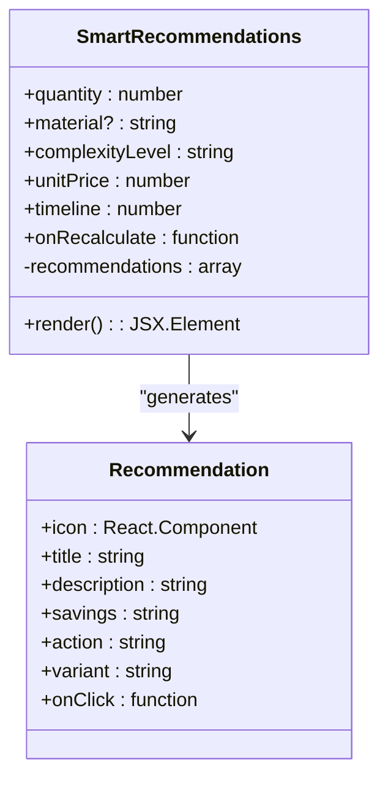
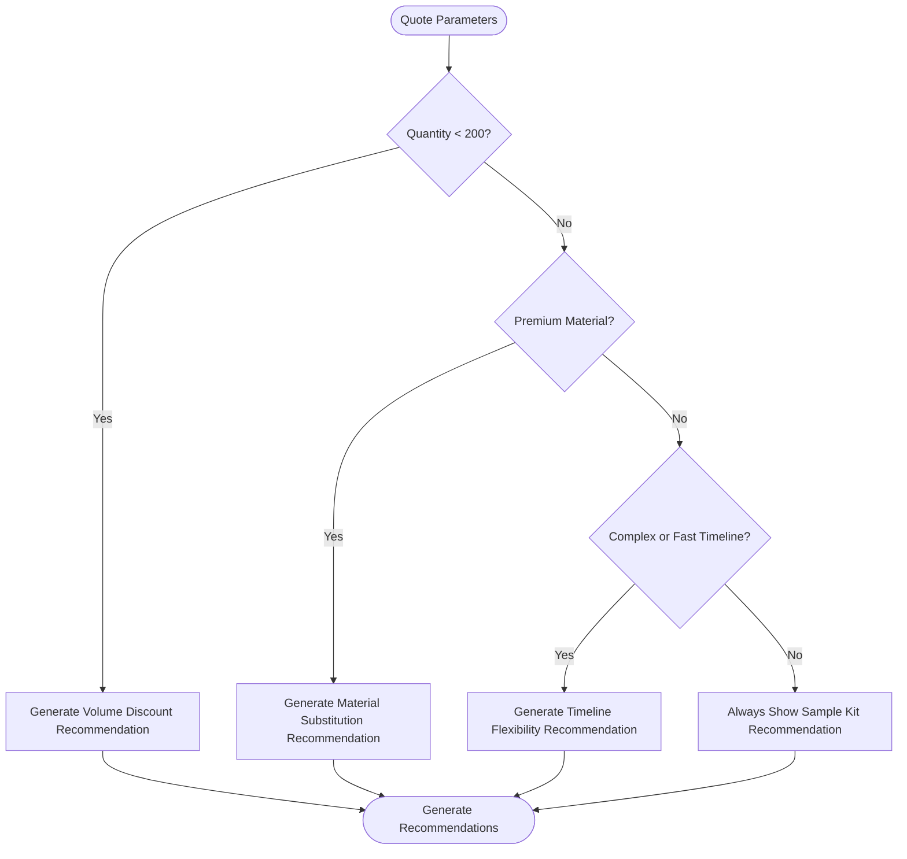
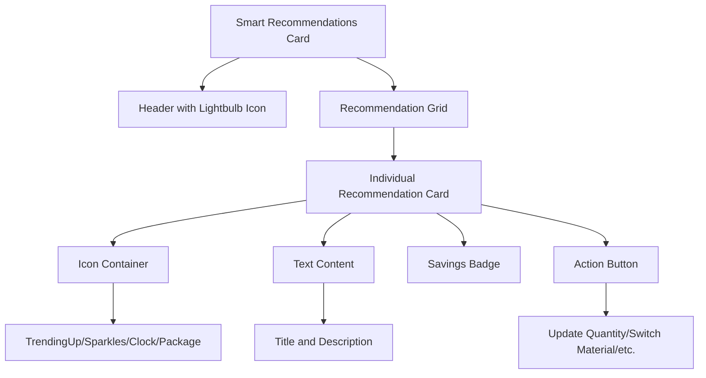
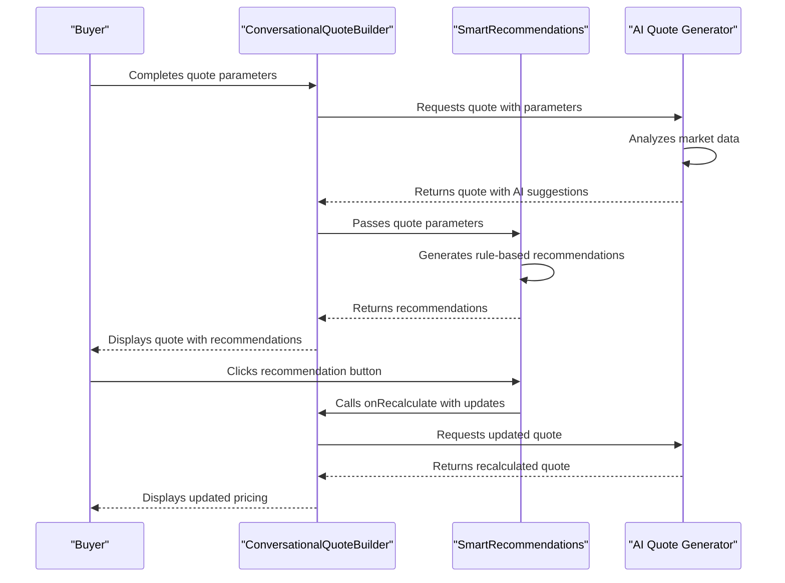
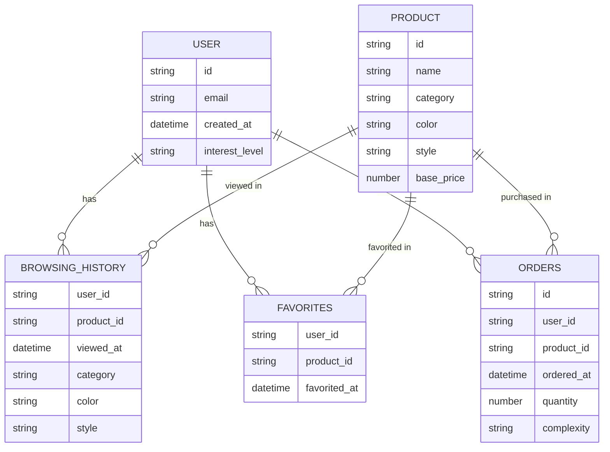
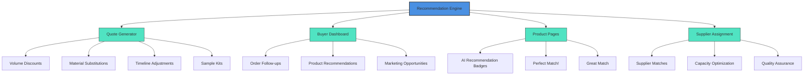

# Smart Recommendations

<cite>
**Referenced Files in This Document**   
- [SmartRecommendations.tsx](file://src/components/quote/SmartRecommendations.tsx)
- [ConversationalQuoteBuilder.tsx](file://src/components/quote/ConversationalQuoteBuilder.tsx)
- [InteractiveQuoteDisplay.tsx](file://src/components/quote/InteractiveQuoteDisplay.tsx)
- [ai-conversational-quote/index.ts](file://supabase/functions/ai-conversational-quote/index.ts)
- [ModernBuyerDashboard.tsx](file://src/pages/ModernBuyerDashboard.tsx)
- [AIProductRecommendations.tsx](file://src/components/AIProductRecommendations.tsx)
</cite>

## Table of Contents
1. [Introduction](#introduction)
2. [Core Recommendation Engine](#core-recommendation-engine)
3. [Recommendation Logic and Triggers](#recommendation-logic-and-triggers)
4. [User Interface and Experience](#user-interface-and-experience)
5. [Integration with Quote Generator](#integration-with-quote-generator)
6. [Personalization and Behavioral Analysis](#personalization-and-behavioral-analysis)
7. [Cross-Platform Recommendation System](#cross-platform-recommendation-system)
8. [Conclusion](#conclusion)

## Introduction

The Smart Recommendations engine is a core component of the Sleek Apparels platform, designed to provide intelligent, data-driven suggestions that help buyers optimize their orders for cost savings and risk mitigation. This system analyzes quote parameters and user profiles to generate actionable recommendations that improve conversion rates and customer satisfaction. The engine powers suggestions in both the quote generation process and the buyer dashboard, creating a seamless experience across the platform.

The recommendations are generated based on a combination of real-time quote parameters, historical buyer behavior, and market data. The system identifies opportunities for savings through volume discounts, material substitutions, timeline adjustments, and sample kit additions. Each recommendation is presented with clear savings calculations, appropriate icons, and call-to-action buttons that allow users to implement the suggested changes with a single click.

**Section sources**
- [SmartRecommendations.tsx](file://src/components/quote/SmartRecommendations.tsx#L1-L137)

## Core Recommendation Engine

The Smart Recommendations engine is implemented as a React component that analyzes quote parameters and generates context-specific suggestions. The system evaluates multiple factors including order quantity, material selection, complexity level, and timeline to identify optimization opportunities.

The engine operates by collecting input parameters such as quantity, material type, complexity level, unit price, and timeline. It then applies a series of business rules to determine which recommendations are relevant for the current quote configuration. Each recommendation includes metadata such as an icon, title, description, savings information, action text, and a callback function that implements the suggested change.

The component is designed to be reusable across different parts of the application, with the primary implementation in the quote generation workflow. The recommendations are dynamically generated based on the current quote parameters, ensuring that users receive relevant suggestions that are directly applicable to their specific order requirements.

**Diagram sources**
- [SmartRecommendations.tsx](file://src/components/quote/SmartRecommendations.tsx#L6-L26)

**Section sources**
- [SmartRecommendations.tsx](file://src/components/quote/SmartRecommendations.tsx#L1-L137)

## Recommendation Logic and Triggers

The recommendation engine employs several logic rules to identify optimization opportunities based on quote parameters. These rules are designed to maximize cost savings while maintaining product quality and meeting customer requirements.

The volume discount opportunity triggers when the order quantity is below 200 units. The system calculates the next threshold quantity (in increments of 50) and estimates the 5% discount that would be applied at that volume. This encourages customers to increase their order size to qualify for better pricing.

Material substitution recommendations are generated when premium materials such as organic cotton, merino wool, or bamboo are selected. The system suggests switching to standard cotton or polyester, highlighting the 15% cost savings while maintaining similar quality characteristics. This helps customers reduce costs without significantly compromising on product specifications.

Timeline flexibility recommendations appear when the order complexity is high or when a fast timeline is requested. By suggesting a standard 35-day production timeline instead of expedited options, the system can offer 8% savings per piece. This trade-off between speed and cost allows customers to optimize their budget based on their actual timeline requirements.

The sample kit recommendation is always shown as a risk mitigation strategy, particularly for new customers. The system promotes a 5-piece sample kit for $249, with the cost credited toward the bulk order. This reduces the risk of ordering large quantities without first verifying product quality.

**Diagram sources**
- [SmartRecommendations.tsx](file://src/components/quote/SmartRecommendations.tsx#L29-L87)

**Section sources**
- [SmartRecommendations.tsx](file://src/components/quote/SmartRecommendations.tsx#L29-L87)

## User Interface and Experience

The Smart Recommendations component features a clean, intuitive user interface designed to highlight cost-saving opportunities and encourage action. The recommendations are displayed in a card-based layout with a distinctive lightbulb icon in the header, signaling intelligent suggestions.

Each recommendation card includes a prominent icon that visually represents the type of suggestion: TrendingUp for volume discounts, Sparkles for material alternatives, Clock for timeline adjustments, and Package for sample kits. These visual cues help users quickly understand the nature of each recommendation.

The savings information is prominently displayed using a badge component, making the financial benefits immediately visible. The call-to-action buttons use appropriate variants (default, outline, or secondary) to indicate the relative importance of each suggestion. When a user clicks on a recommendation button, the system updates the quote parameters and recalculates the pricing, providing instant feedback on the impact of the suggested change.

The component is responsive and adapts to different screen sizes, displaying recommendations in a single column on mobile devices and in a two-column grid on larger screens. The cards feature hover effects and smooth animations that enhance the user experience and draw attention to the available options.

**Diagram sources**
- [SmartRecommendations.tsx](file://src/components/quote/SmartRecommendations.tsx#L91-L135)

**Section sources**
- [SmartRecommendations.tsx](file://src/components/quote/SmartRecommendations.tsx#L91-L135)

## Integration with Quote Generator

The Smart Recommendations engine is tightly integrated with the conversational quote generation process, providing suggestions at the final stage of quote creation. The system receives input parameters from the quote builder and generates recommendations based on the specific order configuration.

In the ConversationalQuoteBuilder component, the SmartRecommendations component is displayed alongside the final quote details, allowing users to immediately act on optimization opportunities. When a user clicks on a recommendation's call-to-action button, the system updates the relevant quote parameters and triggers a recalculation of the pricing.

The integration follows a clean separation of concerns, with the SmartRecommendations component receiving necessary parameters through props and communicating changes back through the onRecalculate callback function. This design allows the recommendation engine to be reused in other parts of the application without modification.

The quote generation backend also incorporates AI-powered suggestions through the ai-conversational-quote function, which analyzes market research data and generates additional recommendations that are displayed alongside the rule-based suggestions from the SmartRecommendations component.

**Diagram sources**
- [ConversationalQuoteBuilder.tsx](file://src/components/quote/ConversationalQuoteBuilder.tsx#L1-L363)
- [ai-conversational-quote/index.ts](file://supabase/functions/ai-conversational-quote/index.ts#L1-L385)

**Section sources**
- [ConversationalQuoteBuilder.tsx](file://src/components/quote/ConversationalQuoteBuilder.tsx#L337-L358)
- [InteractiveQuoteDisplay.tsx](file://src/components/quote/InteractiveQuoteDisplay.tsx#L172-L177)

## Personalization and Behavioral Analysis

The recommendation system incorporates personalization features that adapt suggestions based on user behavior and profile information. While the core SmartRecommendations component focuses on rule-based suggestions derived from quote parameters, other components in the system provide personalized recommendations based on browsing history and past interactions.

The AIProductRecommendations component analyzes user behavior including recently viewed products, favorited items, and browsing patterns to generate personalized product suggestions. The system assigns scores based on category popularity (20% weight), recent views (30% weight), color preferences (15% weight), and style matching (15% weight), with additional boosts for favorited items.

For new customers, the system emphasizes risk mitigation strategies such as sample kits and standard timelines. For returning customers with a history of successful orders, the recommendations may focus more on volume discounts and premium material options, reflecting their established trust in the platform.

The BuyerInterestTracker component monitors user engagement and conversion rates, which informs the prioritization of recommendations. High-engagement "hot leads" receive more aggressive cost-saving suggestions, while new visitors see more educational content about the benefits of different options.

**Diagram sources**
- [AIProductRecommendations.tsx](file://src/components/AIProductRecommendations.tsx#L119-L160)
- [BuyerInterestTracker.tsx](file://src/components/admin/BuyerInterestTracker.tsx#L51-L113)

**Section sources**
- [AIProductRecommendations.tsx](file://src/components/AIProductRecommendations.tsx#L119-L160)
- [BuyerInterestTracker.tsx](file://src/components/admin/BuyerInterestTracker.tsx#L51-L113)

## Cross-Platform Recommendation System

The Smart Recommendations engine powers suggestions across multiple platform interfaces, including the quote generator, buyer dashboard, and product pages. This creates a consistent experience where users receive relevant suggestions regardless of where they interact with the platform.

In the ModernBuyerDashboard, the system displays "Smart Suggestions" that include order follow-ups, product recommendations, and marketing opportunities. These suggestions use the same design language as the quote recommendations, with icons, titles, descriptions, and call-to-action buttons, creating a familiar interface across the platform.

The AIRecommendationBadge component provides a compact version of the recommendation system for product pages, displaying a badge with text like "Perfect Match!" or "Great Match" based on the user's browsing history and preferences. This micro-recommendation system encourages exploration and discovery throughout the platform.

The backend AI functions, such as ai-conversational-quote and ai-supplier-assignment, use similar recommendation logic to generate suggestions for both buyers and suppliers. This unified approach ensures consistency in the types of optimizations suggested across different user roles and use cases.

**Diagram sources**
- [ModernBuyerDashboard.tsx](file://src/pages/ModernBuyerDashboard.tsx#L486-L514)
- [AIProductRecommendations.tsx](file://src/components/AIProductRecommendations.tsx#L362-L375)
- [SmartSupplierAssignment.tsx](file://src/components/admin/SmartSupplierAssignment.tsx#L1-L97)

**Section sources**
- [ModernBuyerDashboard.tsx](file://src/pages/ModernBuyerDashboard.tsx#L486-L514)
- [AIProductRecommendations.tsx](file://src/components/AIProductRecommendations.tsx#L362-L375)

## Conclusion

The Smart Recommendations engine is a sophisticated system that combines rule-based logic with behavioral analysis to provide valuable suggestions that help buyers optimize their orders. By analyzing quote parameters such as quantity, material, complexity, and timeline, the system identifies concrete opportunities for cost savings and risk mitigation.

The engine's modular design allows it to be integrated across multiple platform interfaces, providing a consistent recommendation experience in the quote generator, buyer dashboard, and product pages. The use of clear visual indicators, prominent savings calculations, and actionable buttons makes it easy for users to understand and implement the suggested optimizations.

The system contributes significantly to conversion optimization by reducing barriers to purchase, mitigating perceived risks, and demonstrating the platform's expertise in apparel manufacturing. By personalizing recommendations based on user behavior and order history, the engine creates a tailored experience that increases customer satisfaction and loyalty.

Future enhancements could include machine learning models that refine recommendation accuracy over time, integration with supplier capacity data to provide more precise timeline estimates, and expanded personalization features that take into account seasonal trends and market conditions.